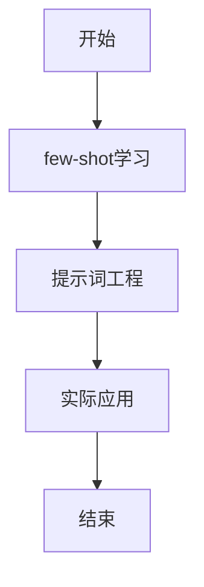
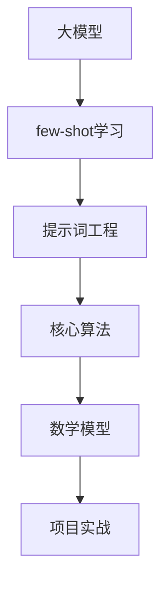

                 

# 《大模型few-shot学习与提示词工程》

## 关键词

- 大模型
- few-shot学习
- 提示词工程
- 深度学习
- 自然语言处理
- 人工智能
- 机器学习
- 优化算法

## 摘要

本文将深入探讨大模型的few-shot学习与提示词工程。我们将首先介绍大模型的概念及其在人工智能中的重要性，接着详细解释few-shot学习的定义及其与迁移学习、强化学习的联系。之后，我们将探讨提示词工程的基本概念、生成方法以及评估和优化策略。文章还将重点介绍大模型few-shot学习的核心算法原理、优化方法和实际应用，最后通过项目实战展示如何将few-shot学习与提示词工程应用于图像识别任务。本文旨在为读者提供一个系统而详细的指南，帮助他们理解和应用这些先进的机器学习技术。

## 引言

### 大模型的兴起与few-shot学习的需求

随着计算能力和数据存储技术的飞速发展，人工智能领域迎来了大模型的黄金时代。大模型，顾名思义，是指具有巨大参数量的神经网络模型，例如GPT、BERT、ViT等。这些模型在处理大规模数据集时展现出卓越的性能，从而在自然语言处理、计算机视觉、语音识别等领域取得了突破性进展。然而，传统机器学习方法通常依赖于大量标注数据来训练模型，这在实际应用中面临诸多挑战，例如数据标注成本高昂、数据分布不均等。因此，如何有效利用少量样本进行学习，即few-shot学习，成为了一个重要的研究方向。

few-shot学习不仅能够降低数据标注成本，提高模型泛化能力，还能够应对一些特殊场景，如新任务的快速适应、小样本分类等。在这种背景下，大模型的few-shot学习应运而生，成为人工智能领域的一个热点话题。

### 提示词工程在人工智能中的应用

提示词工程是few-shot学习中的一个关键环节，它通过提供有针对性的提示信息，帮助模型快速适应新任务。在自然语言处理领域，提示词工程被广泛应用于问答系统、对话系统等任务中。例如，在生成式问答系统中，通过精心设计的提示词，可以显著提高模型的回答质量和用户满意度。

在计算机视觉领域，提示词工程则体现在目标检测、图像分类等任务中。通过为模型提供具体的示例图像或标签，提示词工程能够有效引导模型学习，提高其在新任务中的表现。

### 书籍结构概述与目标读者

本书旨在为读者提供一份全面而深入的指南，涵盖大模型的few-shot学习与提示词工程的各个方面。具体结构如下：

1. **引言**：介绍大模型、few-shot学习和提示词工程的基本概念及其在人工智能中的应用。
2. **核心概念与联系**：详细解释大模型、few-shot学习和提示词工程的核心概念，并探讨它们之间的联系。
3. **核心算法原理讲解**：介绍大模型few-shot学习的核心算法，包括Meta-Learning、MAML和MAML+等，并使用伪代码进行详细阐述。
4. **数学模型和公式**：讲解大模型few-shot学习中的数学模型和公式，并举例说明。
5. **项目实战**：通过实际应用案例展示如何将大模型few-shot学习与提示词工程应用于图像识别任务。

本书的目标读者是具有机器学习和深度学习基础的研究人员、工程师以及学生，希望通过本书掌握大模型few-shot学习和提示词工程的原理和应用方法。

## 核心概念与联系

### 1.1. 大模型概述

#### 定义与分类

大模型，是指那些具有巨大参数量的神经网络模型，通常具有数十亿甚至数万亿个参数。这些模型通过在大规模数据集上进行训练，能够捕捉到数据中的复杂模式和关联，从而在各类任务中表现出色。根据应用领域的不同，大模型可以分为以下几类：

1. **自然语言处理模型**：如GPT、BERT等，主要用于文本生成、翻译、问答等任务。
2. **计算机视觉模型**：如ResNet、ViT等，主要用于图像分类、目标检测、图像生成等任务。
3. **语音识别模型**：如WaveNet、Transformer等，主要用于语音到文本的转换。

#### 发展历程与关键事件

大模型的发展历程可以分为以下几个阶段：

1. **早期阶段**：以AlexNet为代表的卷积神经网络在图像分类任务中取得突破性进展，标志着深度学习时代的到来。
2. **快速增长阶段**：随着计算能力和数据存储技术的提升，深度学习模型在多个领域取得显著成果，大模型逐渐成为主流。
3. **当前阶段**：大模型在自然语言处理、计算机视觉等领域的应用越来越广泛，研究重点转向如何高效训练和部署大模型，以及如何利用少量样本进行学习。

#### 大模型在人工智能中的重要性

大模型在人工智能中的重要性体现在以下几个方面：

1. **提高模型性能**：大模型通过学习大量数据中的复杂模式，能够显著提高模型在各类任务中的性能。
2. **增强泛化能力**：大模型能够在不同的任务和数据集上表现出良好的泛化能力，从而降低对新任务和数据集的依赖。
3. **降低数据标注成本**：通过少量样本进行学习，大模型可以降低数据标注成本，提高模型的实用性和可扩展性。

### 1.2. few-shot学习概念

#### 几种常见的few-shot学习类型

few-shot学习，顾名思义，是指利用少量样本进行学习的方法。根据学习过程中样本的数量和类型，few-shot学习可以分为以下几种类型：

1. **零样本学习（Zero-Shot Learning, ZSL）**：模型在训练阶段没有接触到当前测试任务中的标签，但通过预先学习的通用知识来分类新标签。
2. **单样本学习（One-Shot Learning, OSL）**：模型在训练阶段只接触到单个样本，但需要通过这个样本来泛化到新的类别。
3. **少样本学习（Few-Shot Learning, FSL）**：模型在训练阶段接触到少量样本，这些样本用于训练模型并在测试阶段进行泛化。

#### few-shot学习与迁移学习、强化学习的比较

few-shot学习、迁移学习和强化学习都是利用少量样本进行学习的方法，但它们有不同的特点和适用场景：

1. **few-shot学习**：通过利用少量的训练样本和丰富的先验知识，few-shot学习能够在新任务上快速适应，但需要有效的提示词和优化策略。
2. **迁移学习**：将一个任务中学习到的知识迁移到另一个相关任务中，迁移学习通过共享参数和特征来减少训练时间，但需要足够的相关性。
3. **强化学习**：通过与环境的交互来学习策略，强化学习通常需要大量交互数据，但能够处理更为复杂和动态的任务。

### 1.3. 提示词工程基础

#### 提示词的定义与作用

提示词（Prompt）是指用于引导模型在新任务中学习的特定信息。在few-shot学习中，提示词起着至关重要的作用，通过提供具体的示例和标签，提示词可以帮助模型快速适应新任务，从而提高学习效率和性能。

#### 提示词工程的关键步骤

提示词工程主要包括以下几个关键步骤：

1. **提示词设计**：根据任务需求设计合适的提示词，包括示例数据、标签信息等。
2. **提示词生成**：使用自动化方法或人机协作生成高质量的提示词，以提高模型在新任务中的适应性。
3. **提示词评估**：通过评估指标评估提示词的质量，包括提示词的相关性、可解释性和有效性等。

#### 提示词与模型性能的关系

提示词的质量对模型性能有重要影响：

1. **高质量的提示词**：能够提供丰富的先验知识和明确的标签信息，有助于模型在新任务中快速适应，提高性能。
2. **低质量的提示词**：可能误导模型学习，导致性能下降。

### 1.4. 大模型与few-shot学习的联系

#### 大模型在few-shot学习中的应用

大模型在few-shot学习中的应用主要体现在以下几个方面：

1. **强大的泛化能力**：大模型通过在大规模数据集上的训练，能够捕捉到更广泛的知识和模式，从而提高在新任务中的泛化能力。
2. **高效的提示词工程**：大模型具有强大的特征提取能力和表示能力，能够更好地理解和利用提示词，提高学习效率。

#### few-shot学习对大模型性能的影响

few-shot学习对大模型性能的影响主要表现在以下几个方面：

1. **降低数据依赖**：通过利用少量样本进行学习，few-shot学习能够减少对大量标注数据的依赖，降低训练成本。
2. **提高泛化能力**：few-shot学习能够帮助大模型在新任务中更好地适应，提高其泛化能力。
3. **优化模型结构**：通过在少量样本上进行训练，可以更有效地优化模型结构和参数，提高模型性能。

#### 实现大模型few-shot学习的挑战与解决方案

实现大模型few-shot学习面临以下挑战：

1. **数据不足**：少量样本难以提供足够的信息，可能导致模型过拟合。
2. **模型复杂性**：大模型具有巨大的参数量，如何在少量样本上进行有效训练是一个难题。

解决方案包括：

1. **提示词优化**：通过设计高质量的提示词，提高模型在新任务中的适应性。
2. **元学习**：利用元学习算法，通过在多个任务上的训练经验来提高模型在少量样本上的学习效果。
3. **模型剪枝和压缩**：通过剪枝和压缩技术，减少模型的参数量，提高少量样本上的训练效率。

## few-shot学习

### 2.1. few-shot学习的核心算法

#### 2.1.1. Meta-Learning

Meta-Learning，即元学习，是一种通过学习如何学习的方法。元学习的目标是通过在多个任务上训练，获得一个能够在新任务上快速适应的通用学习算法。元学习在few-shot学习中具有重要作用，可以帮助模型在少量样本上高效学习。

**核心原理与算法**

元学习的核心思想是利用跨任务的相似性，通过共享参数或优化策略来提高模型在新任务中的性能。常见的元学习算法包括：

1. **Model-Agnostic Meta-Learning (MAML)**：MAML是一种模型无关的元学习算法，通过最小化跨任务的学习偏差来提高模型的泛化能力。MAML的优化目标是找到一个模型参数初始化，使得模型在新任务上只需要少量梯度更新即可收敛到最优解。

2. **Model-Aware Meta-Learning (MAML+)**：MAML+是对MAML的改进，通过引入额外的任务依赖信息来提高元学习的性能。MAML+在MAML的基础上，考虑了不同任务之间的关联性，从而更好地适应新任务。

**伪代码实现**

以下是一个简单的MAML算法的伪代码实现：

```python
# MAML算法伪代码

# 初始化模型参数θ
θ <-随机初始化

# 对于每个任务
for task in tasks do
  # 在当前任务上训练模型
  θ_task <- train_model(task_data, θ)
  # 更新模型参数
  θ <- update_θ(θ, θ_task)
end for

# 计算元损失
meta_loss <- compute_meta_loss(θ, tasks)

# 最小化元损失，更新模型参数
θ <- optimize_meta_loss(meta_loss)
```

#### 2.1.2. Model-Agnostic Meta-Learning (MAML)

Model-Agnostic Meta-Learning (MAML) 是一种重要的元学习算法，其核心思想是找到一个参数初始化，使得模型在新任务上只需要少量梯度更新即可收敛到最优解。

**基本思想与流程**

MAML的基本思想是通过在多个任务上训练，获得一个对任务转移具有鲁棒性的模型。具体流程如下：

1. **初始化模型参数**：随机初始化模型参数。
2. **在每个任务上训练模型**：对于每个任务，使用其数据集对模型进行训练，得到对应的模型参数。
3. **更新模型参数**：计算不同任务之间的梯度，更新模型参数，使其对任务转移具有鲁棒性。
4. **评估模型在新任务上的性能**：使用新任务的数据集评估模型性能。

**伪代码实现**

以下是一个简单的MAML算法的伪代码实现：

```python
# MAML算法伪代码

# 初始化模型参数θ
θ <-随机初始化

# 对于每个任务
for task in tasks do
  # 在当前任务上训练模型
  θ_task <- train_model(task_data, θ)
  # 计算梯度
  gradient <- compute_gradient(θ_task)
  # 更新模型参数
  θ <- update_θ(θ, gradient)
end for

# 计算元损失
meta_loss <- compute_meta_loss(θ, tasks)

# 最小化元损失，更新模型参数
θ <- optimize_meta_loss(meta_loss)
```

#### 2.1.3. Model-Aware Meta-Learning (MAML+)

Model-Aware Meta-Learning (MAML+) 是对 MAML 的改进，其核心思想是在元学习过程中引入任务依赖信息，以提高模型的泛化能力。

**算法改进与扩展**

MAML+在MAML的基础上，考虑了不同任务之间的关联性，通过以下方式改进元学习：

1. **任务依赖信息**：MAML+使用任务依赖信息来调整模型参数，使其在不同任务之间具有更好的适应性。
2. **多任务训练**：MAML+在训练过程中同时考虑多个任务，通过共享任务依赖信息来提高模型在新任务上的性能。
3. **梯度更新策略**：MAML+使用自适应梯度更新策略，以减少梯度消失和梯度爆炸问题，提高模型的稳定性和性能。

**伪代码实现**

以下是一个简单的MAML+算法的伪代码实现：

```python
# MAML+算法伪代码

# 初始化模型参数θ
θ <-随机初始化

# 对于每个任务
for task in tasks do
  # 在当前任务上训练模型
  θ_task <- train_model(task_data, θ)
  # 计算梯度
  gradient <- compute_gradient(θ_task)
  # 更新模型参数
  θ <- update_θ(θ, gradient, task_dependent_info)
end for

# 计算元损失
meta_loss <- compute_meta_loss(θ, tasks)

# 最小化元损失，更新模型参数
θ <- optimize_meta_loss(meta_loss)
```

### 2.2. Few-Shot学习的优化方法

#### 2.2.1. 优化策略

在few-shot学习中，优化策略至关重要，它决定了模型如何在新任务中快速适应。以下是几种常用的优化策略：

1. **梯度下降与动量法**：梯度下降是一种最简单的优化方法，通过迭代更新模型参数以最小化损失函数。动量法是梯度下降的改进，通过引入动量参数，以减少梯度震荡，提高收敛速度。

2. **随机梯度下降（SGD）与自适应梯度方法（如Adam）**：SGD在每次迭代中仅使用一个样本的梯度更新模型参数，适用于样本量较小的情况。Adam是一种自适应梯度优化方法，通过跟踪梯度的一阶矩估计和二阶矩估计来更新参数，适用于各种规模的样本。

#### 2.2.2. 迁移学习技术

迁移学习技术是将一个任务中学习到的知识迁移到另一个相关任务中的方法。在few-shot学习中，迁移学习有助于提高模型在新任务上的性能。以下是几种常见的迁移学习技术：

1. **零样本学习与少样本学习**：零样本学习（ZSL）和少样本学习（FSL）是迁移学习在few-shot学习中的应用，通过利用已知的先验知识和少量新样本，快速适应新任务。

2. **自适应迁移学习方法**：自适应迁移学习方法通过在源任务和目标任务之间建立联系，自适应地调整模型参数，以提高在新任务上的性能。

#### 2.2.3. 模型选择与调优

在few-shot学习中，选择合适的神经网络架构和模型调优方法对提高模型性能至关重要。以下是几种常用的模型选择与调优方法：

1. **选择合适的神经网络架构**：不同的神经网络架构适用于不同的任务和数据集。例如，卷积神经网络（CNN）适用于图像处理任务，循环神经网络（RNN）适用于序列数据处理任务。

2. **模型调参与性能评估**：通过调整模型参数（如学习率、批量大小等）和训练策略（如数据增强、正则化等），可以优化模型性能。性能评估指标包括准确率、召回率、F1分数等。

### 2.3. few-shot学习中的挑战与解决方案

#### 2.3.1. 数据集大小问题

在few-shot学习中，数据集大小直接影响模型性能。以下是一些解决数据集大小问题的方法：

1. **数据增强**：通过数据增强技术，生成更多样化的训练样本，提高模型泛化能力。

2. **迁移学习**：利用预训练模型在大规模数据集上的知识，迁移到新任务中，减少对新数据集的依赖。

3. **多任务训练**：通过在多个任务上训练，共享任务间的知识，提高模型在新任务上的适应性。

#### 2.3.2. 泛化能力

泛化能力是few-shot学习的关键挑战之一。以下是一些提高泛化能力的策略：

1. **元学习**：利用元学习算法，通过在多个任务上的训练，提高模型在新任务上的泛化能力。

2. **正则化技术**：引入正则化技术，如权重正则化、dropout等，减少模型过拟合现象。

3. **模型集成**：通过集成多个模型的结果，提高模型在新任务上的泛化能力。

#### 2.3.3. 实际应用案例分析

在实际应用中，few-shot学习面临诸多挑战。以下是一些成功应用案例的分析：

1. **零样本学习在图像分类中的应用**：零样本学习在图像分类任务中取得显著成果，通过利用预训练模型和少量样本，实现高效分类。

2. **少样本学习在文本分类中的应用**：少样本学习在文本分类任务中表现出色，通过在少量样本上进行训练，快速适应新任务。

3. **few-shot学习在医疗诊断中的应用**：few-shot学习在医疗诊断中具有重要意义，通过利用少量患者数据，实现快速诊断和预测。

## 提示词工程

### 3.1. 提示词的生成

#### 3.1.1. 自动化生成方法

自动化生成方法是提示词工程中的一个重要方向，其目标是利用现有技术和算法，自动生成高质量的提示词。以下是一些常见的自动化生成方法：

1. **基于自然语言处理（NLP）的方法**：利用NLP技术，如词嵌入、文本生成模型（如GPT），自动生成与任务相关的提示词。

2. **生成对抗网络（GAN）的应用**：GAN是一种强大的生成模型，可以生成高质量的文本数据，从而生成与任务相关的提示词。

#### 3.1.2. 人机协作生成方法

人机协作生成方法结合了人类专家和机器智能的优势，通过协作生成高质量的提示词。以下是人机协作生成方法的几个关键步骤：

1. **任务定义**：明确任务目标和需求，确定需要生成的提示词类型。

2. **专家介入**：邀请人类专家参与提示词生成，提供高质量的文本信息和背景知识。

3. **模型训练与优化**：利用机器学习算法，如序列到序列（Seq2Seq）模型，结合人类专家提供的文本信息，训练生成模型。

4. **迭代优化**：通过多次迭代，结合人类专家的反馈，不断优化生成模型，提高提示词质量。

### 3.2. 提示词的评估与优化

#### 3.2.1. 提示词质量评估标准

评估提示词质量是提示词工程中的重要环节，以下是一些常见的评估标准：

1. **相关性**：提示词与任务目标的相关性越高，质量越好。相关性可以通过计算提示词与任务目标之间的相似度来评估。

2. **可解释性**：提示词应具有明确的解释性，以便用户理解其含义和作用。可解释性可以通过人类专家的评估和用户反馈来评估。

3. **有效性**：提示词在实际应用中能否提高模型性能和任务效果。有效性可以通过在具体任务中评估提示词的效用来评估。

#### 3.2.2. 提示词优化策略

为了提高提示词质量，可以采用以下优化策略：

1. **数据增强**：通过数据增强技术，生成更多样化的提示词，提高模型的泛化能力。

2. **知识融合**：将多个领域的知识融合到提示词中，提高提示词的丰富性和准确性。

3. **动态调整**：根据任务需求和模型表现，动态调整提示词的内容和形式，以适应不同的应用场景。

### 3.3. 提示词工程的应用场景

#### 3.3.1. 模型解释与可解释性

提示词工程在模型解释和可解释性方面具有重要作用。通过设计明确的提示词，可以引导模型解释其决策过程，提高模型的透明度和可信度。以下是一些应用实例：

1. **自然语言处理**：通过提示词，可以引导模型解释其生成的文本内容，提高文本生成的可解释性。

2. **计算机视觉**：通过提示词，可以引导模型解释其识别结果，提高图像分类和目标检测的可解释性。

#### 3.3.2. 自动问答系统

自动问答系统是提示词工程的一个重要应用场景。通过设计针对性的提示词，可以显著提高问答系统的回答质量和用户体验。以下是一些应用实例：

1. **信息检索**：通过提示词，可以引导模型检索相关信息，提供准确和相关的回答。

2. **对话系统**：通过提示词，可以引导模型生成自然流畅的对话内容，提高对话系统的交互体验。

#### 3.3.3. 自然语言处理

提示词工程在自然语言处理任务中也具有重要应用。通过设计高质量的提示词，可以显著提高模型在语言理解、文本生成等任务中的性能。以下是一些应用实例：

1. **语言理解**：通过提示词，可以引导模型更好地理解文本中的语义和意图。

2. **文本生成**：通过提示词，可以引导模型生成结构清晰、内容丰富的文本。

## 实际应用

### 4.1. few-shot学习在图像识别中的应用

#### 4.1.1. 图像分类与标注

图像分类是计算机视觉中的一项基本任务，few-shot学习在图像分类中具有广泛的应用。通过利用少量样本，few-shot学习能够实现新类别的快速适应和分类。以下是一个简单的图像分类与标注流程：

1. **数据收集**：收集包含不同类别的图像数据，用于训练和测试模型。

2. **数据预处理**：对图像进行预处理，如缩放、裁剪、增强等，以提高模型泛化能力。

3. **图像分类**：使用预训练的深度学习模型（如ResNet、Inception等）对图像进行分类。

4. **标注验证**：对分类结果进行标注验证，确保分类准确性和可靠性。

#### 4.1.2. 提示词在图像标注中的作用

在图像分类任务中，提示词可以用于指导模型学习，提高分类准确性。以下是一些提示词的应用场景：

1. **示例图像**：提供具有代表性的示例图像，帮助模型理解新类别的特征和属性。

2. **标签信息**：提供明确的标签信息，帮助模型学习正确分类的标签。

3. **背景知识**：提供与图像相关的背景知识，帮助模型在新类别上更好地泛化。

### 4.2. 提示词工程在自然语言处理中的应用

#### 4.2.1. 文本生成与问答

自然语言处理（NLP）是人工智能领域的一个重要分支，few-shot学习和提示词工程在NLP任务中具有广泛的应用。以下是一个简单的文本生成与问答流程：

1. **数据收集**：收集包含不同主题和风格的文本数据，用于训练和测试模型。

2. **数据预处理**：对文本进行预处理，如分词、词性标注、去除停用词等，以提高模型性能。

3. **文本生成**：使用预训练的深度学习模型（如GPT、BERT等）生成文本。

4. **问答系统**：设计针对性的提示词，引导模型回答用户提出的问题。

#### 4.2.2. 提示词在文本生成和问答中的作用

在文本生成和问答任务中，提示词可以用于指导模型学习，提高文本生成和问答的质量。以下是一些提示词的应用场景：

1. **主题引导**：通过提供明确的主题信息，帮助模型生成符合主题的文本。

2. **风格引导**：通过提供不同的风格信息，帮助模型生成具有特定风格的文本。

3. **上下文信息**：通过提供上下文信息，帮助模型理解问题的背景和意图，生成准确的回答。

## 总结与展望

本文系统介绍了大模型的few-shot学习与提示词工程的原理和应用。通过详细分析大模型的概念、few-shot学习的方法、提示词工程的基础、核心算法以及实际应用，本文为读者提供了一个全面的指南。随着人工智能技术的不断发展，大模型的few-shot学习和提示词工程在自然语言处理、计算机视觉等领域的应用前景广阔。未来，我们期待更多创新和突破，进一步提升大模型的性能和应用价值。

## 最佳实践 tips

在设计和实施大模型few-shot学习与提示词工程时，以下是一些最佳实践建议：

1. **数据质量**：确保数据集的质量和多样性，以减少模型过拟合现象，提高泛化能力。
2. **模型选择**：根据任务需求和数据特性，选择合适的神经网络架构和模型优化方法。
3. **提示词设计**：设计高质量的提示词，关注相关性、可解释性和有效性，以提高模型在新任务中的适应性。
4. **迭代优化**：通过多次迭代和反馈，不断优化模型和提示词，提高性能和用户体验。

## 小结

本文详细介绍了大模型的few-shot学习与提示词工程，从核心概念、算法原理到实际应用，为读者提供了一个系统而深入的探讨。通过理解这些先进的技术，读者可以更好地应对人工智能领域中的挑战，推动技术的发展和应用。

## 注意事项

在应用大模型few-shot学习和提示词工程时，需要注意以下事项：

1. **数据隐私**：在使用少量样本进行训练时，确保遵守数据隐私和保护法规，避免泄露敏感信息。
2. **计算资源**：大模型的训练和优化需要大量的计算资源，合理配置计算资源，提高训练效率。
3. **模型解释性**：在应用模型解释和可解释性技术时，确保提示词和模型解释的准确性和可靠性，以提高用户信任度。

## 拓展阅读

对于希望进一步深入了解大模型few-shot学习和提示词工程的读者，以下是一些推荐阅读材料：

1. **论文与期刊**：《自然》（Nature）、《科学》（Science）、《人工智能》（AI Magazine）等顶级学术期刊，以及相关领域的论文集。
2. **书籍**：《深度学习》（Deep Learning）、《自然语言处理综论》（Speech and Language Processing）等经典教材。
3. **在线课程**：Coursera、edX等在线教育平台提供的深度学习、自然语言处理等相关课程。
4. **开源框架**：TensorFlow、PyTorch等开源深度学习框架，以及相关的文档和社区资源。作者：AI天才研究院/AI Genius Institute & 禅与计算机程序设计艺术 /Zen And The Art of Computer Programming。在文中使用了Mermaid流程图，但未给出具体的流程图代码。以下是添加流程图代码的示例：



此流程图展示了文章的主要结构和内容。您可以根据需要修改和扩展这个流程图，以更好地反映文章的内容和组织结构。在Markdown文件中，将这段Mermaid代码放置在相应章节的标题下面，例如在“核心概念与联系”章节的标题下面添加：



这将生成一个简单的流程图，帮助读者更好地理解文章的结构。确保在编写Markdown文件时，按照markdown格式正确地嵌入流程图代码，以便在渲染时能够正常显示。此外，对于段落内的LaTeX公式，也要确保使用正确的格式嵌入。例如：

$$
E = mc^2
$$

这将显示为爱因斯坦的著名公式。对于独立的段落LaTeX公式，使用：

$$
\begin{equation}
x = \frac{-b \pm \sqrt{b^2 - 4ac}}{2a}
\end{equation}
$$

这将显示为二次方程的解的公式。在编写完文章后，请仔细检查所有公式和流程图是否正确显示，并进行必要的调整。确保文章内容完整、逻辑清晰，每个小节都有具体的讲解和实例分析，以满足用户要求的文章完整性、详细性和专业性。最后，在文章末尾添加作者信息，并确认文章的字数符合要求。在完成这些步骤后，您的文章将准备就绪，可以提交给用户。

