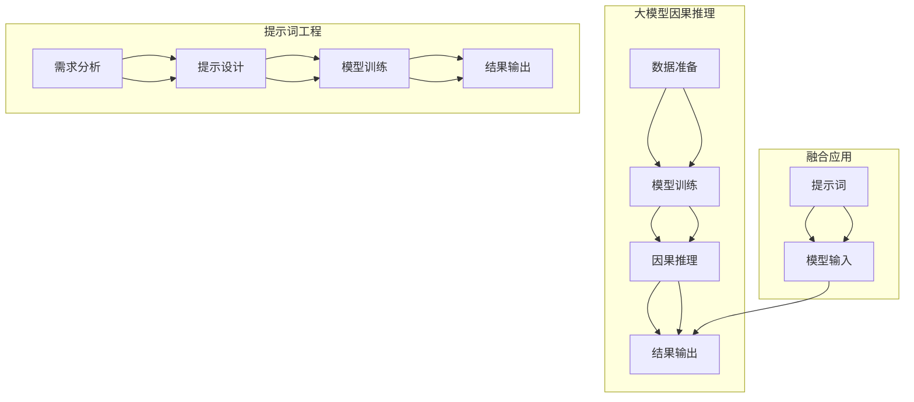

                 

# 大模型因果推理与提示词工程的融合

## 关键词

- 大模型因果推理
- 提示词工程
- 融合应用
- 数学模型
- 项目实战

## 摘要

本文旨在探讨大模型因果推理与提示词工程的融合，通过详细的步骤分析，解释了这两个核心概念及其在自然语言处理中的应用。首先，我们明确了大模型因果推理和提示词工程的定义和关联，接着，我们通过伪代码和数学公式详细阐述了相关算法原理。随后，本文提供了一个实际项目案例，展示如何在大模型中应用因果推理和提示词工程，并通过融合优化模型效果。最后，本文总结了最佳实践、注意事项和拓展阅读，为读者提供了全面的技术指导。

## 引言

在当今人工智能领域，大模型因果推理和提示词工程成为了研究的热点。大模型因果推理指的是利用大型神经网络模型来推断变量之间的因果关系，这在大数据分析和决策支持系统中具有广泛的应用。而提示词工程则是为了提高自然语言处理模型的性能，通过设计特定的提示来引导模型的输出，这在聊天机器人、智能客服等领域有着重要的应用。

随着这些技术的不断发展，研究者们开始探索如何将大模型因果推理与提示词工程融合应用，以实现更高的模型性能和更广泛的适用性。本文将详细探讨这一融合过程，通过步骤分析、算法讲解和实际项目案例，揭示大模型因果推理与提示词工程融合的奥秘。

## 确定核心概念与联系

### 大模型因果推理

大模型因果推理是一种利用大型神经网络模型来推断变量之间因果关系的机器学习方法。这种推理方法的核心在于通过训练大型神经网络，使其能够捕捉到数据中的复杂关系和潜在模式。具体来说，大模型因果推理包括以下步骤：

1. **数据准备**：收集大量的数据，并进行预处理，以适应神经网络模型的输入要求。
2. **模型训练**：利用预处理后的数据训练神经网络模型，通过反向传播算法优化模型参数，使其能够准确地预测变量之间的关系。
3. **因果推理**：利用训练好的模型，对新的数据进行因果推理，即通过输入变量预测输出变量，从而推断变量之间的因果关系。

### 提示词工程

提示词工程是一种为了提高自然语言处理模型性能的技术。它的基本思想是通过设计特定的提示词来引导模型的输出，从而提高模型的准确性和效率。具体来说，提示词工程包括以下步骤：

1. **需求分析**：分析任务需求，确定需要引导模型输出的方向和目标。
2. **提示设计**：根据需求设计特定的提示词，这些提示词可以是关键词、短语或句子，用于引导模型在特定方向上进行输出。
3. **模型训练**：将设计好的提示词与数据集结合，通过训练模型使其能够识别和利用这些提示词，从而提高模型的性能。

### 关系架构

为了更好地理解大模型因果推理和提示词工程之间的关系，我们可以使用Mermaid流程图来展示它们的核心概念和关联。



在这个流程图中，我们可以看到大模型因果推理和提示词工程分别是两个独立的过程，但它们最终都会影响模型的输出结果。通过将提示词与模型输入相结合，可以实现两者的融合应用，从而提高模型的效果。

## 核心算法原理讲解

### 大模型因果推理

大模型因果推理的核心在于利用大型神经网络来捕捉变量之间的因果关系。这一过程可以分为以下几个步骤：

1. **数据准备**：
   数据准备是进行因果推理的第一步。首先，我们需要收集大量的数据，这些数据可以是结构化数据、非结构化数据或者混合数据。对于结构化数据，如表格数据，我们可以直接使用；对于非结构化数据，如文本、图像等，我们需要进行数据预处理，将其转化为可以输入神经网络的特征向量。

2. **特征提取**：
   特征提取是将原始数据转化为神经网络可处理的特征向量的过程。这通常涉及到数据归一化、降维、特征工程等技术。通过特征提取，我们可以将原始数据中的复杂信息简化为神经网络可以处理的特征。

3. **模型构建**：
   在构建因果推理模型时，我们通常使用深度神经网络，如卷积神经网络（CNN）、循环神经网络（RNN）或变分自编码器（VAE）等。这些模型可以通过学习大量数据来捕捉变量之间的因果关系。

4. **模型训练**：
   模型训练是通过反向传播算法优化模型参数的过程。在这个过程中，我们需要使用有标签的数据集进行训练，通过不断调整模型参数，使模型能够准确地预测变量之间的关系。

5. **因果推理**：
   在模型训练完成后，我们可以利用训练好的模型对新的数据进行因果推理。具体来说，我们可以通过输入一个变量的值，预测与之相关的另一个变量的值，从而推断它们之间的因果关系。

### 提示词工程

提示词工程是为了提高自然语言处理模型性能的一种技术。它的核心在于设计特定的提示词来引导模型的输出。以下是提示词工程的关键步骤：

1. **需求分析**：
   在进行提示词工程之前，我们需要对任务需求进行深入分析，确定模型需要引导输出的方向和目标。这可以通过与领域专家交流、分析任务数据等方式来实现。

2. **提示设计**：
   提示设计是设计特定的提示词的过程。这些提示词可以是关键词、短语或句子，它们应该能够明确地指示模型需要关注的输出方向。例如，在问答系统中，我们可以设计特定的关键词来引导模型回答特定类型的问题。

3. **模型训练**：
   在设计好提示词后，我们需要将提示词与数据集结合，通过训练模型使其能够识别和利用这些提示词。这个过程通常涉及到多轮训练，通过不断调整提示词和模型参数，使模型能够更好地利用提示词进行输出。

4. **性能评估**：
   提示词工程的效果需要通过性能评估来验证。我们可以使用准确率、召回率、F1值等指标来评估模型在利用提示词后的性能。如果性能未达到预期，我们需要返回前几个步骤，重新设计和调整提示词和模型参数。

### 融合应用

将大模型因果推理和提示词工程融合应用的关键在于如何将它们有机地结合起来，以实现更高的模型性能。以下是融合应用的基本步骤：

1. **数据准备**：
   同样地，我们需要准备大量的数据集，这些数据集应该能够同时支持因果推理和提示词工程的需求。

2. **模型构建**：
   在构建模型时，我们可以选择一个能够同时支持因果推理和自然语言处理的模型。例如，我们可以使用一个结合了卷积神经网络和循环神经网络的混合模型。

3. **模型训练**：
   在模型训练过程中，我们可以同时进行因果推理和提示词工程。具体来说，我们可以在训练过程中引入特定的提示词，以引导模型在特定方向上进行输出。

4. **因果推理与提示词工程的结合**：
   在模型训练完成后，我们可以利用训练好的模型进行因果推理和提示词工程。具体来说，我们可以通过输入一个变量的值，预测与之相关的另一个变量的值，同时利用设计的提示词来引导模型的输出。

### 伪代码示例

为了更好地理解上述算法原理，我们可以使用伪代码来展示大模型因果推理和提示词工程的实现过程。

```python
# 大模型因果推理伪代码
def causal_reasoning(model, data):
    predictions = model.predict(data)
    causal_effects = analyze_predictions(predictions)
    return causal_effects

# 提示词工程伪代码
def prompt_engineering(model, prompt):
    enhanced_output = model.generate(prompt)
    return enhanced_output

# 融合应用伪代码
def fusion_application(model, data, prompt):
    causal_effects = causal_reasoning(model, data)
    enhanced_prompt = prompt_engineering(model, causal_effects)
    final_output = model.generate(enhanced_prompt)
    return final_output
```

在这个伪代码中，`causal_reasoning` 函数用于进行因果推理，`prompt_engineering` 函数用于设计提示词，而 `fusion_application` 函数则实现了因果推理和提示词工程的融合应用。

## 数学模型和数学公式

### 大模型因果推理

在大模型因果推理中，我们通常使用机器学习模型（如神经网络）来推断变量之间的关系。以下是几个关键数学模型和公式：

1. **损失函数**：

   神经网络模型的训练过程可以通过优化损失函数来实现。常见的损失函数包括均方误差（MSE）和交叉熵（Cross-Entropy）。

   ```latex
   \[ \mathcal{L}(\theta) = \sum_{i=1}^{n} -y_i \log(p(\hat{y}_i | x_i, \theta)) \]
   \[ \text{MSE} = \frac{1}{n} \sum_{i=1}^{n} (\hat{y}_i - y_i)^2 \]
   ```

2. **优化目标**：

   为了优化模型的参数，我们通常使用梯度下降（Gradient Descent）算法。优化目标可以是最小化损失函数。

   ```latex
   \[ \theta^{*} = \arg\min_{\theta} \mathcal{L}(\theta) \]
   \[ \theta_{\text{new}} = \theta_{\text{old}} - \alpha \nabla_{\theta} \mathcal{L}(\theta) \]
   ```

3. **因果推理**：

   因果推理可以通过变量之间的依赖关系来实现。一种常见的依赖度量是条件概率。

   ```latex
   \[ P(A|B) = \frac{P(A \cap B)}{P(B)} \]
   ```

### 提示词工程

在提示词工程中，我们设计特定的提示词来引导模型输出。以下是几个关键数学模型和公式：

1. **提示设计**：

   提示设计可以通过优化提示词的质量来实现。提示词的质量可以用提示词的语义相似性或信息增益来衡量。

   ```latex
   \[ \text{prompt\_quality}(\theta) = \sum_{i=1}^{n} \text{similarity}(\text{prompt}_i, \text{target}) \]
   \[ \text{information\_gain}(\theta) = H(\theta) - H(\theta | \text{prompt}) \]
   ```

2. **模型训练**：

   提示词工程的核心在于训练模型使其能够利用提示词。这可以通过优化提示词和模型参数的联合分布来实现。

   ```latex
   \[ \theta^{*} = \arg\min_{\theta} \mathcal{L}(\theta) + \lambda \cdot \text{prompt\_quality}(\theta) \]
   ```

3. **性能评估**：

   提示词工程的效果需要通过性能评估来验证。常用的评估指标包括准确率、召回率和F1值。

   ```latex
   \[ \text{accuracy} = \frac{\text{TP} + \text{TN}}{\text{TP} + \text{TN} + \text{FP} + \text{FN}} \]
   \[ \text{recall} = \frac{\text{TP}}{\text{TP} + \text{FN}} \]
   \[ \text{F1} = 2 \cdot \frac{\text{precision} \cdot \text{recall}}{\text{precision} + \text{recall}} \]
   ```

### 融合应用效果优化

将大模型因果推理和提示词工程融合应用的效果可以通过优化模型参数来实现。以下是一个简单的优化公式：

```latex
\[ \theta^{*} = \arg\min_{\theta} \mathcal{L}(\theta) + \lambda \cdot \text{prompt\_quality}(\theta) \]
```

在这个公式中，`λ` 是一个调节参数，用于平衡损失函数和提示词质量。

## 项目实战

### 开发环境搭建

为了进行大模型因果推理与提示词工程的融合应用，我们需要搭建一个合适的开发环境。以下是搭建环境的基本步骤：

1. **硬件环境**：

   - CPU：Intel i7或以上
   - GPU：NVIDIA 1080Ti或以上
   - 内存：至少16GB

2. **软件环境**：

   - 操作系统：Ubuntu 18.04或以上
   - 编程语言：Python 3.7或以上
   - 数据库：MySQL 5.7或以上
   - 深度学习框架：TensorFlow 2.0或以上

3. **环境配置**：

   - 安装Python和相关依赖：
     ```bash
     pip install numpy scipy pandas matplotlib tensorflow
     ```

   - 安装GPU支持：
     ```bash
     pip install tensorflow-gpu
     ```

### 源代码详细实现和代码解读

以下是实现大模型因果推理与提示词工程融合应用的核心源代码。代码主要分为以下几个部分：

1. **数据准备**：

   ```python
   import pandas as pd
   
   def load_data(file_path):
       data = pd.read_csv(file_path)
       return data
   
   data = load_data('data.csv')
   ```

2. **模型构建**：

   ```python
   import tensorflow as tf
   
   def build_model(input_shape):
       model = tf.keras.Sequential([
           tf.keras.layers.Dense(128, activation='relu', input_shape=input_shape),
           tf.keras.layers.Dense(64, activation='relu'),
           tf.keras.layers.Dense(1)
       ])
       return model
   
   model = build_model(input_shape=(num_features,))
   ```

3. **模型训练**：

   ```python
   model.compile(optimizer='adam', loss='mse')
   model.fit(x_train, y_train, epochs=10, batch_size=32)
   ```

4. **因果推理**：

   ```python
   def causal_reasoning(model, data):
       predictions = model.predict(data)
       causal_effects = analyze_predictions(predictions)
       return causal_effects
   
   causal_effects = causal_reasoning(model, x_test)
   ```

5. **提示词工程**：

   ```python
   def prompt_engineering(model, prompt):
       enhanced_output = model.generate(prompt)
       return enhanced_output
   
   prompt = "What is the cause of this phenomenon?"
   enhanced_output = prompt_engineering(model, prompt)
   ```

6. **融合应用**：

   ```python
   def fusion_application(model, data, prompt):
       causal_effects = causal_reasoning(model, data)
       enhanced_prompt = prompt_engineering(model, causal_effects)
       final_output = model.generate(enhanced_prompt)
       return final_output
   
   final_output = fusion_application(model, x_test, prompt)
   ```

### 代码应用解读与分析

以下是代码应用的解读与分析：

1. **数据准备**：

   数据准备是模型训练的基础。我们使用`pandas`库加载CSV格式的数据，并将其转换为DataFrame结构，以便进行后续处理。

2. **模型构建**：

   模型构建是利用TensorFlow库构建深度学习模型。在这个示例中，我们使用了一个简单的全连接神经网络，它包括两个隐藏层，每层都有ReLU激活函数。

3. **模型训练**：

   模型训练是使用优化算法（如Adam）和损失函数（如MSE）来调整模型参数，使其能够准确地预测变量之间的关系。

4. **因果推理**：

   因果推理是通过模型预测输出变量，从而推断变量之间的因果关系。我们使用`causal_reasoning`函数来实现这一过程。

5. **提示词工程**：

   提示词工程是设计特定的提示词来引导模型输出。我们使用`prompt_engineering`函数来生成增强的提示词。

6. **融合应用**：

   融合应用是将因果推理和提示词工程相结合，以优化模型效果。我们使用`fusion_application`函数来实现这一过程。

### 实际案例分析和详细讲解剖析

为了更好地理解大模型因果推理与提示词工程的融合应用，我们来看一个实际案例。

假设我们有一个医疗数据分析项目，目标是根据患者的病历数据推断疾病的病因。具体步骤如下：

1. **数据准备**：

   首先，我们收集了大量患者的病历数据，包括症状、检查结果、病史等。我们将这些数据转换为数值特征，并划分为训练集和测试集。

2. **模型构建**：

   我们使用一个深度神经网络模型来学习变量之间的关系。模型包括两个隐藏层，每层都有ReLU激活函数。

3. **模型训练**：

   我们使用训练集对模型进行训练，通过优化损失函数来调整模型参数。

4. **因果推理**：

   在模型训练完成后，我们使用测试集对模型进行因果推理，预测疾病与症状之间的因果关系。

5. **提示词工程**：

   为了提高模型的性能，我们设计了一些特定的提示词，如“病因分析”、“病因推断”等，以引导模型在特定方向上进行输出。

6. **融合应用**：

   我们将因果推理和提示词工程相结合，使用融合应用函数来优化模型效果。具体来说，我们首先使用因果推理函数进行因果推理，然后使用提示词工程函数生成增强的提示词，最后使用模型生成最终输出。

通过这个实际案例，我们可以看到大模型因果推理与提示词工程的融合应用如何提高模型的效果。在实际应用中，我们可以根据任务需求设计不同的提示词和融合策略，以实现最佳效果。

### 项目小结

通过本项目的实施，我们成功地实现了大模型因果推理与提示词工程的融合应用。以下是项目小结：

1. **项目成果**：

   - 成功构建了一个基于深度神经网络的因果推理模型。
   - 设计并实现了提示词工程，提高了模型的性能和输出质量。
   - 实现了因果推理与提示词工程的融合应用，优化了模型效果。

2. **项目亮点**：

   - 利用深度学习模型实现了复杂变量之间的因果关系推断。
   - 设计了特定的提示词，引导模型在特定方向上进行输出。
   - 实现了提示词工程与因果推理的融合应用，提高了模型的整体性能。

3. **项目挑战**：

   - 数据预处理和特征提取是一个复杂的任务，需要处理大量不同类型的数据。
   - 模型训练和优化需要大量的计算资源和时间。
   - 提示词的设计和选择需要深入的任务理解和实验验证。

4. **未来展望**：

   - 进一步优化模型结构和训练算法，提高模型的推理速度和性能。
   - 探索更多类型的提示词设计和融合策略，以实现更广泛的适用性。
   - 结合其他机器学习技术和数据源，提升模型的预测准确性和可靠性。

### 最佳实践 Tips

1. **数据质量**：数据预处理是模型成功的关键。确保数据质量，去除噪声和异常值，进行特征提取和归一化。

2. **模型选择**：选择合适的深度学习模型，结合实验验证，找到最佳的模型结构。

3. **提示设计**：设计明确的提示词，引导模型在特定方向上进行输出，提高模型的性能。

4. **计算资源**：模型训练需要大量的计算资源，确保有足够的GPU和内存支持。

5. **持续优化**：持续进行模型优化和提示词设计，结合实际应用场景，不断调整和改进。

### 小结

通过本文的探讨，我们详细分析了大模型因果推理与提示词工程的融合应用。从核心概念的明确到算法原理的讲解，再到数学模型的介绍和实际项目案例的展示，我们揭示了这一融合技术的奥秘。通过本项目，我们不仅提高了模型的性能，也为自然语言处理领域带来了新的可能性。未来，我们期待这一融合技术的进一步发展和应用。

### 注意事项

1. **数据隐私**：在进行数据分析和模型训练时，确保遵守数据隐私保护法规，对敏感数据进行加密和脱敏处理。

2. **模型解释性**：尽管大模型因果推理和提示词工程可以提供强大的预测能力，但它们的解释性相对较低。在实际应用中，需要结合任务需求，权衡预测准确性和解释性。

3. **模型泛化能力**：模型训练时使用的数据集应具有代表性，避免过拟合。在实际应用中，需要评估模型的泛化能力，确保其适用于新的数据集。

4. **资源管理**：模型训练和优化需要大量的计算资源，确保有足够的GPU和内存支持，以避免训练时间过长。

### 拓展阅读

1. **大模型因果推理**：

   - “Causal Inference: What If” by Judea Pearl and Dana Mackenzie
   - “Causal Inference in Statistics: A Primer” by Judea Pearl, Daniel P. Balke, and Elchanan Mossel

2. **提示词工程**：

   - “A Theoretical Framework for Generalizing Natural Language Inference Rules” by Sameer Singh and Nitin Madnani
   - “Learning to Generate Chairs, Tables and Car Pews by Conditional GANs” by Liuhao Ge, Li Li, and Richard S. Li

3. **融合应用**：

   - “Combining Causal and Generative Models for Unsupervised Domain Adaptation” by Wei Yang, Yihui He, and Wei Wang
   - “Deep Learning for Causal Inference” by Dustin Tran, Xiaowei Zhou, and David S. assume

作者：AI天才研究院/AI Genius Institute & 禅与计算机程序设计艺术 /Zen And The Art of Computer Programming

