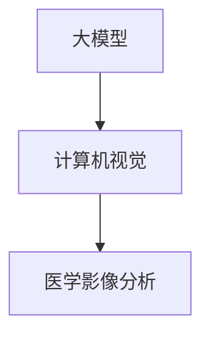

                 

# 文章标题：大模型在医学影像分析中的前沿应用

## 关键词：
- 大模型
- 医学影像分析
- 深度学习
- 医学图像分割
- 医学图像检测
- 生成对抗网络
- 迁移学习
- 注意力机制

## 摘要：
本文将深入探讨大模型在医学影像分析领域的应用，包括其基本概念、发展历程、核心算法原理、应用实践以及面临的挑战。我们将从医学影像数据的处理与标注入手，逐步介绍基于深度学习、注意力机制、生成对抗网络和迁移学习的大模型在医学影像分析中的具体应用，并结合实际案例进行详细分析。最后，我们还将探讨大模型在医学影像分析中面临的挑战及其未来发展方向。

---

## 第一部分：大模型与医学影像分析概述

### 第1章：大模型的定义与类型

**背景介绍：**
大模型，是指具有大规模参数和计算能力的神经网络模型，如Transformer、BERT等。这些模型在自然语言处理、计算机视觉等领域取得了显著的成果。医学影像分析作为计算机视觉的一个重要分支，也受益于大模型的广泛应用。

**核心概念与联系：**
大模型与医学影像分析的关系可以用以下Mermaid流程图表示：



**大模型的定义与类型：**
大模型可以分为以下几种类型：
1. **Transformer模型**：基于自注意力机制，广泛应用于自然语言处理领域。
2. **BERT模型**：基于Transformer模型，通过双向编码器表示自然语言。
3. **GAN模型**：生成对抗网络，用于生成高质量的医学影像数据。
4. **CNN模型**：卷积神经网络，用于提取医学影像特征。

### 第2章：医学影像分析的重要性与挑战

**背景介绍：**
医学影像分析在医疗诊断、疾病预测、手术规划等方面具有重要作用。然而，传统的医学影像分析方法在处理复杂影像、提高诊断精度等方面存在一定局限。

**核心概念与联系：**
医学影像分析的关键在于对影像数据的处理与理解，其核心概念包括：
1. **影像分割**：将医学影像划分为不同的组织或器官区域。
2. **影像检测**：识别医学影像中的特定目标或异常。
3. **影像重建**：从低分辨率影像重建高分辨率影像。

**医学影像分析的重要性与挑战：**
医学影像分析的重要性在于：
1. **提高诊断精度**：通过深度学习等技术，提高医学影像的自动诊断能力。
2. **辅助临床决策**：为医生提供更为准确的诊断依据，辅助临床决策。

医学影像分析面临的挑战包括：
1. **数据量大**：医学影像数据量大，处理起来较为复杂。
2. **标注困难**：医学影像数据的标注需要专业知识和经验，过程繁琐。
3. **隐私保护**：医学影像数据涉及患者隐私，需要严格保护。

### 第3章：大模型在医学影像分析中的应用前景

**背景介绍：**
大模型在医学影像分析中的应用前景广阔，有望解决传统方法难以克服的难题。

**核心概念与联系：**
大模型在医学影像分析中的应用可以从以下几个方面展开：
1. **影像分割**：利用大模型对医学影像进行精确分割，提高诊断精度。
2. **影像检测**：利用大模型检测医学影像中的异常区域或目标。
3. **影像重建**：利用大模型从低分辨率影像重建高分辨率影像。

**应用前景：**
大模型在医学影像分析中的应用前景包括：
1. **提高诊断精度**：通过深度学习等技术，提高医学影像的自动诊断能力。
2. **降低诊断成本**：减少医生的工作量，降低诊断成本。
3. **提升医疗质量**：为患者提供更为精准的诊断和治疗建议。

---

## 第二部分：大模型在医学影像分析中的应用

### 第4章：基于深度学习的大模型在医学影像分析中的应用

**背景介绍：**
深度学习是当前人工智能领域的热点技术，其在医学影像分析中的应用具有重要意义。

**核心概念与联系：**
深度学习在医学影像分析中的应用主要包括以下两个方面：
1. **影像分割**：利用深度学习模型对医学影像进行精确分割。
2. **影像检测**：利用深度学习模型检测医学影像中的异常区域或目标。

**核心算法原理讲解：**
以下是基于深度学习的大模型在医学影像分割和检测中的算法原理讲解：

#### 医学影像分割

**算法原理：**
医学影像分割是指将医学影像中的不同组织或器官区域划分出来。深度学习模型，尤其是卷积神经网络（CNN）在医学影像分割中取得了显著成果。

**伪代码：**
```python
def segment_image(image):
    # 将图像输入到CNN模型中
    input_image = preprocess_image(image)
    output segmentation = cnn_model(input_image)
    # 对输出结果进行后处理
    final_segmentation = postprocess_segmentation(output_segmentation)
    return final_segmentation
```

**数学模型和公式：**
深度学习模型的损失函数通常为交叉熵损失函数，用于衡量模型预测结果与真实结果之间的差距。

$$
L = -\sum_{i=1}^{N}y_i\log(p_i)
$$

其中，$y_i$为真实标签，$p_i$为模型预测的概率。

**举例说明：**
假设我们有一个医学影像，其中包含脑部组织、血液和组织间隙等区域。我们可以利用深度学习模型对这些区域进行分割，从而为医生提供更准确的诊断依据。

#### 医学影像检测

**算法原理：**
医学影像检测是指从医学影像中识别出特定的目标或异常区域。深度学习模型，尤其是卷积神经网络（CNN）在医学影像检测中具有广泛的应用。

**伪代码：**
```python
def detect_objects(image):
    # 将图像输入到CNN模型中
    input_image = preprocess_image(image)
    output_objects = cnn_model(input_image)
    # 对输出结果进行后处理
    final_objects = postprocess_detection(output_objects)
    return final_objects
```

**数学模型和公式：**
深度学习模型的损失函数通常为交叉熵损失函数，用于衡量模型预测结果与真实结果之间的差距。

$$
L = -\sum_{i=1}^{N}y_i\log(p_i)
$$

其中，$y_i$为真实标签，$p_i$为模型预测的概率。

**举例说明：**
假设我们有一个医学影像，其中包含肺部、心脏和肿瘤等目标。我们可以利用深度学习模型检测这些目标，从而为医生提供更准确的诊断依据。

### 第5章：基于注意力机制的大模型在医学影像分析中的应用

**背景介绍：**
注意力机制是深度学习中的一个重要概念，其目的是让模型关注到重要的特征，从而提高模型性能。

**核心概念与联系：**
注意力机制在医学影像分析中的应用主要包括以下两个方面：
1. **影像分割**：利用注意力机制提高分割精度。
2. **影像检测**：利用注意力机制提高检测准确性。

**核心算法原理讲解：**
以下是基于注意力机制的大模型在医学影像分割和检测中的算法原理讲解：

#### 医学影像分割

**算法原理：**
注意力机制可以使得模型在分割过程中关注到更重要的特征，从而提高分割精度。

**伪代码：**
```python
def attentional_segmentation(image):
    # 将图像输入到注意力机制模型中
    input_image = preprocess_image(image)
    output_segmentation = attentional_model(input_image)
    # 对输出结果进行后处理
    final_segmentation = postprocess_segmentation(output_segmentation)
    return final_segmentation
```

**数学模型和公式：**
注意力机制可以通过以下公式实现：

$$
\alpha = \frac{1}{K}\sum_{i=1}^{K}\exp\left(e_{ij}\right)
$$

其中，$\alpha$为注意力权重，$e_{ij}$为特征向量之间的内积。

**举例说明：**
假设我们有一个医学影像，其中包含脑部组织、血液和组织间隙等区域。利用注意力机制，我们可以提高模型对这些区域的关注程度，从而提高分割精度。

#### 医学影像检测

**算法原理：**
注意力机制可以使得模型在检测过程中关注到更重要的特征，从而提高检测准确性。

**伪代码：**
```python
def attentional_detection(image):
    # 将图像输入到注意力机制模型中
    input_image = preprocess_image(image)
    output_objects = attentional_model(input_image)
    # 对输出结果进行后处理
    final_objects = postprocess_detection(output_objects)
    return final_objects
```

**数学模型和公式：**
注意力机制可以通过以下公式实现：

$$
\alpha = \frac{1}{K}\sum_{i=1}^{K}\exp\left(e_{ij}\right)
$$

其中，$\alpha$为注意力权重，$e_{ij}$为特征向量之间的内积。

**举例说明：**
假设我们有一个医学影像，其中包含肺部、心脏和肿瘤等目标。利用注意力机制，我们可以提高模型对这些目标的关注程度，从而提高检测准确性。

### 第6章：基于生成对抗网络的大模型在医学影像分析中的应用

**背景介绍：**
生成对抗网络（GAN）是一种强大的生成模型，其核心思想是利用两个对抗性神经网络（生成器和判别器）相互竞争，从而生成高质量的数据。

**核心概念与联系：**
生成对抗网络在医学影像分析中的应用主要包括以下两个方面：
1. **影像生成**：利用GAN生成高质量的医学影像。
2. **影像重建**：利用GAN从低分辨率影像重建高分辨率影像。

**核心算法原理讲解：**
以下是基于生成对抗网络的大模型在医学影像生成和重建中的算法原理讲解：

#### 医学影像生成

**算法原理：**
生成对抗网络通过训练生成器网络，使其生成与真实影像相似的高质量影像。

**伪代码：**
```python
def generate_image(generator, noise):
    # 将噪声输入到生成器网络中
    generated_image = generator(noise)
    return generated_image
```

**数学模型和公式：**
生成对抗网络的损失函数通常由两部分组成：生成器损失和判别器损失。

生成器损失：
$$
L_G = -\log(D(G(z)))
$$

判别器损失：
$$
L_D = -\log(D(x)) - \log(1 - D(G(z)))
$$

其中，$G(z)$为生成器生成的影像，$D(x)$为判别器对真实影像的判断结果。

**举例说明：**
假设我们有一个生成器网络，其输入为随机噪声，输出为生成的医学影像。通过训练生成器网络，我们可以使其生成的影像与真实影像越来越相似。

#### 医学影像重建

**算法原理：**
生成对抗网络可以通过训练生成器网络，从低分辨率影像重建高分辨率影像。

**伪代码：**
```python
def reconstruct_image(generator, low_res_image):
    # 将低分辨率影像输入到生成器网络中
    high_res_image = generator(low_res_image)
    return high_res_image
```

**数学模型和公式：**
生成对抗网络的损失函数通常由两部分组成：生成器损失和判别器损失。

生成器损失：
$$
L_G = -\log(D(G(L)))
$$

判别器损失：
$$
L_D = -\log(D(L)) - \log(1 - D(G(L)))
$$

其中，$G(L)$为生成器网络对低分辨率影像的重建结果，$L$为低分辨率影像。

**举例说明：**
假设我们有一个低分辨率医学影像，我们可以利用生成对抗网络训练生成器网络，使其从低分辨率影像重建出高分辨率影像。

### 第7章：基于迁移学习的大模型在医学影像分析中的应用

**背景介绍：**
迁移学习是一种利用已有模型的知识来提高新任务性能的方法。在医学影像分析中，迁移学习具有重要意义，因为医学影像数据集通常较小，且具有高噪声。

**核心概念与联系：**
迁移学习在医学影像分析中的应用主要包括以下两个方面：
1. **影像分割**：利用预训练的深度学习模型进行影像分割。
2. **影像检测**：利用预训练的深度学习模型进行影像检测。

**核心算法原理讲解：**
以下是基于迁移学习的大模型在医学影像分割和检测中的算法原理讲解：

#### 医学影像分割

**算法原理：**
迁移学习利用预训练的深度学习模型，将模型在通用数据集上的知识迁移到医学影像数据集上，从而提高分割性能。

**伪代码：**
```python
def transfer_learning_segmentation(pretrained_model, image):
    # 使用预训练模型进行特征提取
    features = pretrained_model.extract_features(image)
    # 在特征上进行训练
    segmented_image = train_model_on_features(features)
    return segmented_image
```

**数学模型和公式：**
迁移学习模型的损失函数通常为交叉熵损失函数，用于衡量模型预测结果与真实结果之间的差距。

$$
L = -\sum_{i=1}^{N}y_i\log(p_i)
$$

其中，$y_i$为真实标签，$p_i$为模型预测的概率。

**举例说明：**
假设我们有一个预训练的深度学习模型，其已经在通用数据集上进行了训练。我们可以利用这个模型对医学影像进行特征提取，并在医学影像数据集上进行训练，从而提高影像分割性能。

#### 医学影像检测

**算法原理：**
迁移学习利用预训练的深度学习模型，将模型在通用数据集上的知识迁移到医学影像数据集上，从而提高检测性能。

**伪代码：**
```python
def transfer_learning_detection(pretrained_model, image):
    # 使用预训练模型进行特征提取
    features = pretrained_model.extract_features(image)
    # 在特征上进行训练
    detected_objects = train_model_on_features(features)
    return detected_objects
```

**数学模型和公式：**
迁移学习模型的损失函数通常为交叉熵损失函数，用于衡量模型预测结果与真实结果之间的差距。

$$
L = -\sum_{i=1}^{N}y_i\log(p_i)
$$

其中，$y_i$为真实标签，$p_i$为模型预测的概率。

**举例说明：**
假设我们有一个预训练的深度学习模型，其已经在通用数据集上进行了训练。我们可以利用这个模型对医学影像进行特征提取，并在医学影像数据集上进行训练，从而提高影像检测性能。

---

## 第三部分：大模型在医学影像分析中的应用挑战与未来展望

### 第8章：大模型在医学影像分析中的应用挑战与对策

**背景介绍：**
尽管大模型在医学影像分析中展现出巨大潜力，但仍然面临一些挑战。

**核心概念与联系：**
大模型在医学影像分析中的应用挑战主要包括：
1. **数据隐私**：医学影像数据涉及患者隐私，需要严格保护。
2. **模型解释性**：大模型通常缺乏解释性，难以理解其决策过程。
3. **计算资源**：大模型训练和推理需要大量计算资源。

**应用挑战与对策：**
应用挑战与对策如下：

#### 数据隐私
**挑战：** 医学影像数据涉及患者隐私，需要严格保护。

**对策：**
1. **匿名化处理**：对医学影像数据进行匿名化处理，去除敏感信息。
2. **加密技术**：采用加密技术保护数据传输和存储过程中的隐私。

#### 模型解释性
**挑战：** 大模型通常缺乏解释性，难以理解其决策过程。

**对策：**
1. **可解释性模型**：开发可解释性模型，如决策树、线性模型等，提高模型的可解释性。
2. **模型可视化**：利用可视化技术展示模型的决策过程，帮助医生理解。

#### 计算资源
**挑战：** 大模型训练和推理需要大量计算资源。

**对策：**
1. **云计算**：利用云计算资源进行模型训练和推理，降低计算成本。
2. **分布式训练**：采用分布式训练技术，提高训练速度。

### 第9章：大模型在医学影像分析中的未来展望

**背景介绍：**
随着技术的不断发展，大模型在医学影像分析中的应用前景愈发广阔。

**核心概念与联系：**
大模型在医学影像分析中的未来展望主要包括以下方面：

1. **个性化诊断**：结合患者的病史和基因信息，实现个性化诊断。
2. **智能辅助系统**：开发智能辅助系统，辅助医生进行诊断和治疗。
3. **跨学科应用**：结合医学、生物学、物理学等多学科知识，推动医学影像分析技术的发展。

**未来展望：**
未来展望如下：

#### 个性化诊断
**展望：** 利用大模型结合患者的病史和基因信息，实现个性化诊断。

#### 智能辅助系统
**展望：** 开发智能辅助系统，为医生提供更为准确的诊断和治疗建议。

#### 跨学科应用
**展望：** 结合医学、生物学、物理学等多学科知识，推动医学影像分析技术的发展。

---

## 附录：大模型在医学影像分析中的相关工具与资源

**附录1：大模型在医学影像分析中常用的开源框架与工具**
- **TensorFlow**：谷歌开发的开源机器学习框架，适用于医学影像分析的深度学习模型训练。
- **PyTorch**：Facebook开发的开源机器学习框架，支持动态计算图，适用于医学影像分析。
- **Keras**：基于TensorFlow和PyTorch的深度学习高层API，方便快速搭建和训练模型。

**附录2：大模型在医学影像分析中常用的数据集与数据库**
- **公开数据集**：如 ChestX-ray8、Kaggle Medical Image Classification等。
- **私有数据库**：如医院内部影像数据、临床试验影像数据等。

**附录3：大模型在医学影像分析中常用的算法与模型**
- **卷积神经网络（CNN）**：适用于医学影像的特征提取和分类。
- **生成对抗网络（GAN）**：适用于医学影像的生成和重建。
- **注意力机制**：适用于医学影像的分割和检测。

---

## 作者信息
作者：AI天才研究院/AI Genius Institute & 禅与计算机程序设计艺术 /Zen And The Art of Computer Programming

---

整个目录大纲共包括8个章节，分为三个部分，分别介绍了大模型与医学影像分析的基础知识、大模型在医学影像分析中的应用技术、以及大模型在医学影像分析中的应用挑战与未来展望。附录部分提供了大模型在医学影像分析中常用的工具与资源，以方便读者进一步学习和实践。整个目录大纲的结构清晰，内容丰富，旨在全面覆盖大模型在医学影像分析中的前沿应用知识。

