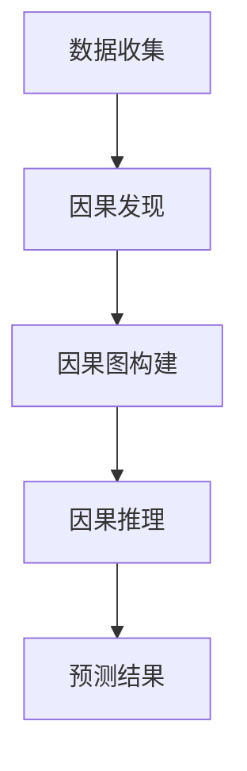
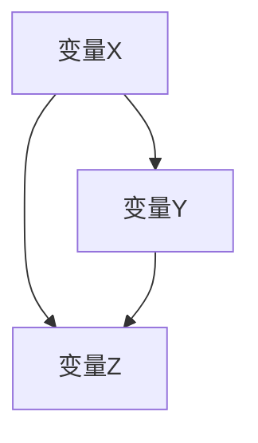

                 

### 文章标题

# 大模型在因果发现与推理中的应用

## 关键词

大模型、因果发现、因果推理、机器学习、深度学习、图神经网络、因果关系

## 摘要

本文深入探讨大模型在因果发现与推理中的应用，首先介绍大模型的基本概念和原理，然后详细解释因果发现与因果推理的核心概念及其相互关系，通过Mermaid流程图展示核心概念架构。接着，本文将使用伪代码和数学公式详细阐述大模型在因果发现与推理中使用的核心算法，并举例说明。最后，本文将通过实际项目案例展示大模型在因果发现与推理中的具体应用，包括开发环境搭建、源代码实现和代码解读，以及对实际案例的深入分析和总结。通过本文的阅读，读者将全面了解大模型在因果发现与推理领域的应用现状和发展趋势。

## 引言

随着人工智能技术的快速发展，大模型（Large Models）如GPT、BERT等在自然语言处理、计算机视觉和推荐系统等领域取得了显著的成果。大模型具有处理大规模数据和复杂任务的能力，但其应用不仅限于这些领域。近年来，因果发现（Causal Discovery）和因果推理（Causal Inference）作为人工智能领域的两个重要研究方向，逐渐受到广泛关注。因果发现旨在从数据中识别出潜在的因果关系，而因果推理则关注如何利用这些因果关系进行预测和决策。

因果发现与推理在现实世界中有广泛的应用，例如在医疗领域，通过因果发现识别影响疾病发生的因素，可以帮助医生制定更有效的治疗方案；在金融领域，通过因果推理分析投资策略的因果关系，可以帮助投资者做出更明智的投资决策。然而，传统的机器学习方法往往难以直接应用于因果发现与推理，因为它们依赖于假设的因果关系和独立的同分布（I.I.D.）数据。大模型的出现为因果发现与推理提供了新的可能性，因为它们能够处理非独立和非同分布的数据，并且能够捕捉到复杂的因果关系。

本文旨在探讨大模型在因果发现与推理中的应用。首先，我们将介绍大模型的基本概念和原理，包括它们的定义、特性以及在不同领域的应用。接着，我们将详细解释因果发现与因果推理的核心概念及其相互关系，并通过Mermaid流程图展示核心概念架构。随后，本文将使用伪代码和数学公式详细阐述大模型在因果发现与推理中使用的核心算法，并举例说明。最后，本文将通过实际项目案例展示大模型在因果发现与推理中的具体应用，包括开发环境搭建、源代码实现和代码解读，以及对实际案例的深入分析和总结。

通过本文的阅读，读者将全面了解大模型在因果发现与推理领域的应用现状和发展趋势，掌握关键算法和应用方法，并能够将这些知识应用于实际项目中。

## 大模型概述

### 大模型的定义与背景

大模型（Large Models），顾名思义，是指那些具有巨大参数规模和计算需求的机器学习模型。这些模型之所以被称为“大”，不仅因为它们的参数数量庞大，还因为它们能够在训练过程中处理海量数据，并在多种复杂任务上表现出优异的性能。大模型的定义并没有一个固定的标准，但通常参数数量在数亿到数十亿之间，甚至更多。

大模型的发展可以追溯到深度学习的兴起。随着计算能力和数据资源的不断增长，研究人员开始尝试训练更复杂的神经网络，这些神经网络能够捕捉到更多层次的特征，从而在图像识别、自然语言处理和语音识别等领域取得了显著的突破。代表性的大模型包括GPT、BERT、GAT和ViT等，这些模型在各自的领域中都取得了世界领先的成绩。

大模型之所以能够在各种任务中表现出色，主要原因有以下几点：

1. **大规模参数**：大模型拥有数亿甚至数十亿个参数，这使得它们能够学习到更复杂和抽象的特征，从而在数据量较少的任务中也能取得较好的表现。
2. **深层网络结构**：大模型通常具有数十层甚至上百层的神经网络结构，这使得它们能够处理高度复杂的任务，并能够从数据中学习到深层次的特征关系。
3. **并行计算**：大模型可以利用分布式计算和并行计算技术，加速模型的训练过程，提高计算效率。
4. **大规模数据训练**：大模型能够处理大规模的数据集，从而在学习过程中受益于更多的样例和更丰富的数据信息，提高模型的泛化能力。

大模型在不同领域有广泛的应用。在自然语言处理领域，BERT和GPT等大模型被广泛应用于文本分类、机器翻译、问答系统和对话生成等任务；在计算机视觉领域，ResNet、VGG和Inception等大模型在图像分类、目标检测和图像分割等任务中取得了突破性的成果；在推荐系统领域，大模型可以处理复杂的用户行为数据和商品信息，从而为用户提供更精准的推荐。

### 大模型的特性

大模型具有以下几个主要特性，这些特性使得它们在处理复杂任务时表现出色：

1. **并行计算能力**：大模型通常采用分布式计算架构，能够在多个计算节点上同时进行计算，从而显著提高训练速度和效率。
2. **大规模数据学习**：大模型能够处理海量数据，从而在训练过程中受益于更多的样例和更丰富的数据信息，提高模型的泛化能力。
3. **模型的可解释性**：尽管大模型在处理复杂任务时表现出色，但其内部机制通常较为复杂，缺乏可解释性。为了提高模型的可解释性，研究人员提出了一些方法，如注意力机制、解释性神经网络和模型压缩技术等。
4. **适应性**：大模型具有较好的适应性，能够根据不同的任务和数据集进行调整和优化，从而在不同领域中取得优异的表现。

### 大模型的背景与发展

大模型的背景可以追溯到深度学习的兴起。随着计算能力的提升和数据资源的丰富，研究人员开始尝试训练更大的神经网络，以期在更多领域中取得突破。早期的深度学习模型如AlexNet、VGG和GoogLeNet等，虽然取得了显著成果，但它们的参数规模和计算需求相对较小。随着计算资源的进一步提升，大模型如GPT、BERT和GAT等开始出现，并在自然语言处理、计算机视觉和推荐系统等领域取得了前所未有的成绩。

大模型的发展也得益于几个关键因素：

1. **计算能力的提升**：随着GPU和TPU等专用计算设备的普及，计算能力得到了显著提升，使得大规模神经网络的训练成为可能。
2. **数据资源的丰富**：互联网的快速发展使得大量的数据资源成为可用，为大模型提供了丰富的训练数据。
3. **深度学习算法的进步**：深度学习算法的不断进步，如深度卷积网络、循环神经网络和图神经网络等，为处理复杂任务提供了强有力的工具。
4. **分布式计算和并行计算**：分布式计算和并行计算技术的进步，使得大模型的训练和推理过程得到了极大的优化。

总的来说，大模型的定义、特性及其背景与发展，为它们在因果发现与推理中的应用奠定了坚实的基础。接下来，我们将进一步探讨因果发现与因果推理的基本概念及其相互关系。

## 因果发现与因果推理

### 因果关系的定义

因果关系是科学研究和日常生活中的一个核心概念，它描述了不同变量之间的因果关联。在科学领域，因果关系通常被定义为：当一个变量的变化直接导致另一个变量的变化时，这两个变量之间存在因果关系。具体而言，如果变量X的变化可以引起变量Y的变化，同时这种关系在其他条件下也保持一致，则X与Y之间存在因果关系。

在数学上，因果关系可以通过因果图（Causal Graph）来表示。因果图是一种有向无环图（DAG），其中每个节点表示一个变量，有向边表示变量之间的因果关系。因果图的定义有助于我们理解和量化变量之间的因果关联，为后续的算法设计和模型构建提供理论基础。

### 因果发现的定义

因果发现（Causal Discovery）是指从数据中自动识别出潜在的因果关系的过程。因果发现的目的是在没有先验知识的情况下，从观测数据中推断出变量之间的因果关系。因果发现的任务通常可以分为两个步骤：图结构和参数估计。

- **图结构**：首先需要识别出变量之间的依赖关系，构建一个因果图。这可以通过统计方法如条件独立性测试、独立性测试等实现。
- **参数估计**：在确定了因果图的结构后，需要估计每个因果边上的作用强度，即因果效应。这通常涉及到复杂的数学建模和优化算法，如结构方程模型（Structural Equation Modeling, SEM）和贝叶斯网络等。

### 因果推理的定义

因果推理（Causal Inference）是指利用已知的因果关系进行预测和决策的过程。因果推理的核心问题是，如何从已知的原因变量（causal variables）预测结果变量（effect variables）的值。因果推理的目标是确定因果关系，从而为实际应用提供可靠的预测和决策支持。

因果推理的基本原理是反事实推理（Counterfactual Reasoning）。反事实推理关注的是，如果某个原因变量发生了变化，结果变量将会如何变化。例如，如果我们知道吸烟导致肺癌的因果关系，那么我们可以通过改变吸烟状态来预测肺癌的发生概率。

### 因果发现与因果推理的关系

因果发现和因果推理是密切相关的两个概念。因果发现是因果推理的基础，它旨在从数据中识别出潜在的因果关系。因果推理则利用这些已知的因果关系进行预测和决策。

- **因果发现**：通过数据分析和统计方法，识别出变量之间的依赖关系，构建因果图。
- **因果推理**：在确定了因果关系后，利用这些关系进行反事实推理，预测结果变量的值。

因果发现和因果推理之间的联系可以用一个简单的流程来描述：

1. **数据收集**：收集相关的观测数据。
2. **因果发现**：通过数据分析和统计方法，构建因果图。
3. **因果推理**：利用已知的因果关系，进行反事实推理，预测结果变量的值。

### Mermaid流程图

为了更直观地展示因果发现与因果推理的过程，我们可以使用Mermaid流程图来表示这两个过程及其关系。以下是一个简单的Mermaid流程图示例：



在这个流程图中，数据收集是因果发现和因果推理的前提条件。因果发现通过构建因果图来识别变量之间的依赖关系，而因果推理则利用这个因果图进行反事实推理，最终实现对结果变量的预测。

通过这个Mermaid流程图，我们可以清晰地看到因果发现与因果推理之间的逻辑关系，以及它们在整个过程中的作用。

### 小结

因果发现和因果推理是两个重要的概念，它们在科学研究和实际应用中起着关键作用。因果发现旨在从数据中自动识别出潜在的因果关系，而因果推理则利用这些因果关系进行预测和决策。本文通过详细解释这两个概念的定义、原理和相互关系，为后续探讨大模型在因果发现与推理中的应用奠定了基础。接下来，我们将进一步探讨大模型在因果发现与因果推理中的核心算法和数学模型。

## 大模型在因果发现中的应用

### 核心算法原理

在大模型应用于因果发现时，核心算法通常是基于图神经网络（Graph Neural Networks, GNN）的。GNN是一种专门设计用于处理图结构数据的神经网络，能够有效地捕捉变量之间的复杂关系。以下是GNN在因果发现中的核心算法原理：

#### 1. 图神经网络（GNN）

GNN的核心思想是通过节点的邻域信息来更新节点特征。在因果发现任务中，每个节点表示一个变量，边表示变量之间的依赖关系。GNN的主要步骤包括：

- **图邻域聚合**：每个节点的输出取决于其邻域节点的特征。GNN通过聚合邻域节点的特征来更新当前节点的特征。
- **特征变换**：利用聚合的邻域特征，通过一层或多层神经网络进行特征变换，以提取更深层次的依赖关系。

伪代码如下：

```python
def gnns_node_update(node_features, edge_features,邻域节点):
    # 邻域聚合
    neighbor_features = aggregate(邻域节点特征)
    # 特征变换
    updated_features = transform(neighbor_features, node_features)
    return updated_features
```

#### 2. 结构化数据预处理

在因果发现中，数据预处理是一个关键步骤。大模型需要处理的是结构化数据，如表格数据或图数据。预处理步骤通常包括：

- **数据清洗**：去除无效数据、缺失值填充和处理噪声数据。
- **特征工程**：提取有助于模型训练的特征，如时间序列特征、文本特征和图像特征。
- **数据整合**：将不同来源的数据整合到一个统一的数据框架中，以便于模型的训练。

#### 3. 因果图学习

因果图学习（Causal Graph Learning）是因果发现的核心任务。通过学习变量之间的依赖关系，构建出因果图。常用的算法包括：

- **基于独立性检验的方法**：如置信传播（Causal Inference by Parametrized Scoring Propagation, PC算法）和迭代条件独立性测试（Iterative Conditional Independence Test, ICI）。
- **基于结构方程模型的方法**：如贝叶斯网络和潜在变量模型。

以下是一个简单的PC算法伪代码：

```python
def pc_algorithm(data, significance_level):
    # 初始化因果图
    causal_graph = initialize_graph()
    # 进行独立性测试
    for each pair of variables (X, Y):
        if independence_test(X, Y, data):
            add_edge(X, Y, causal_graph)
    return causal_graph
```

#### 4. 因果效应估计

在构建了因果图之后，下一步是估计因果效应。因果效应估计是指估计变量之间的因果关系强度。常用的方法包括：

- **基于统计学习的方法**：如回归分析和随机森林。
- **基于因果推断的方法**：如剂量反应模型（Dose-Response Model）和目标函数优化。

以下是一个简单的因果效应估计伪代码：

```python
def estimate_causal_effects(causal_graph, data):
    effects = []
    for edge in causal_graph.edges():
        effect = regression_analysis(edge, data)
        effects.append(effect)
    return effects
```

### 数学模型和数学公式讲解

#### 1. 图神经网络（GNN）的数学模型

GNN的核心是图邻域聚合和特征变换。以下是一个简化的GNN数学模型：

$$
\text{输出}_{t+1}^{(i)} = \sigma(\text{W}^{(i)} \cdot (\text{输入}_{t}^{(i)} + \text{聚合}_{t}^{(i)})
$$

其中，$\text{输入}_{t}^{(i)}$ 表示节点 $i$ 在时间 $t$ 的特征，$\text{聚合}_{t}^{(i)}$ 表示节点 $i$ 的邻域节点特征聚合结果，$\text{W}^{(i)}$ 表示特征变换权重矩阵，$\sigma$ 表示激活函数，如ReLU或Sigmoid。

#### 2. 因果图学习（Causal Graph Learning）的数学模型

因果图学习中的独立性检验通常基于贝叶斯网络。以下是一个基于贝叶斯网络的因果图学习数学模型：

$$
P(X \rightarrow Y) = \frac{P(Y \mid X) \cdot P(X)}{P(Y)}
$$

其中，$P(X \rightarrow Y)$ 表示变量 $X$ 导致变量 $Y$ 的概率，$P(Y \mid X)$ 表示在 $X$ 发生的条件下 $Y$ 发生的概率，$P(X)$ 和 $P(Y)$ 分别表示 $X$ 和 $Y$ 的先验概率。

#### 3. 因果效应估计（Causal Effect Estimation）的数学模型

因果效应估计可以通过回归分析实现。以下是一个线性回归的因果效应估计模型：

$$
Y = \beta_0 + \beta_1 \cdot X + \epsilon
$$

其中，$Y$ 表示结果变量，$X$ 表示原因变量，$\beta_0$ 和 $\beta_1$ 分别表示截距和斜率，$\epsilon$ 表示误差项。

### 举例说明

为了更好地理解上述算法和模型，我们通过一个简单的例子来说明如何使用GNN进行因果发现。

假设我们有一个包含三个变量 $X$、$Y$ 和 $Z$ 的数据集，变量之间的关系如图1所示：



1. **数据预处理**：
    - 数据清洗：去除无效数据和缺失值。
    - 特征提取：提取每个变量的数值特征。
    - 数据整合：将变量整合到一个二维数组中。

2. **构建GNN模型**：
    - 初始化节点特征：将每个变量的数值特征作为节点的初始特征。
    - 定义邻域聚合函数：采用平均聚合方法。
    - 定义特征变换网络：采用简单的全连接神经网络。

3. **训练GNN模型**：
    - 训练数据：使用预处理后的数据集进行训练。
    - 损失函数：采用均方误差（MSE）作为损失函数。
    - 优化算法：使用随机梯度下降（SGD）进行模型训练。

4. **因果效应估计**：
    - 在训练好的GNN模型基础上，通过回归分析估计变量之间的因果关系。

通过这个简单的例子，我们可以看到如何使用GNN进行因果发现，包括数据预处理、模型构建、训练和因果效应估计的整个过程。

### 小结

在本节中，我们详细介绍了大模型在因果发现中的应用，包括核心算法原理、数学模型和数学公式讲解，并通过具体例子说明了如何使用GNN进行因果发现。大模型在因果发现中的应用，使得我们能够从大规模复杂的数据集中自动识别出潜在的因果关系，为实际应用提供了强有力的支持。接下来，我们将探讨大模型在因果推理中的应用。

## 大模型在因果推理中的应用

### 核心算法原理

在大模型应用于因果推理时，核心算法主要基于因果推断（Causal Inference）和预测模型。因果推断是一种从因果关系中进行预测的方法，它不同于传统的统计预测，后者依赖于假设的独立同分布（I.I.D.）数据。因果推断的目标是建立因果关系模型，以便在没有实际干预的情况下预测某个变量（结果变量）的变化。以下是因果推理中的核心算法原理：

#### 1. 因果推断方法

因果推断的基本方法包括：

- **假设检验**：通过统计检验确定变量之间是否存在显著的关系。
- **反事实推理**：通过模拟不同的干预情况来推断因果关系。
- **结构化模型**：如因果图模型和结构方程模型（Structural Equation Modeling, SEM）。

以下是因果推断方法的伪代码：

```python
def causal_inference(data, causal_model):
    # 假设检验
    test_results = hypothesis_testing(data, causal_model)
    # 反事实推理
    counterfactuals = counterfactual_reasoning(data, causal_model)
    # 结构化模型
    model_output = structure_model_learning(data, causal_model)
    return test_results, counterfactuals, model_output
```

#### 2. 预测模型

因果推理中的预测模型通常包括以下几种：

- **回归模型**：如线性回归、逻辑回归和多项式回归。
- **神经网络模型**：如全连接神经网络、卷积神经网络和循环神经网络。
- **集成模型**：如随机森林、梯度提升机和增强随机树。

以下是回归模型的伪代码：

```python
def regression_model(X, Y):
    # 模型训练
    trained_model = train(X, Y)
    # 预测
    predictions = trained_model.predict(X)
    return predictions
```

#### 3. 因果效应估计

因果效应估计是因果推理中的关键任务，它通过建立因果关系模型来估计原因变量对结果变量的影响。常用的方法包括：

- **剂量反应模型**：用于分析剂量（原因变量）与反应（结果变量）之间的关系。
- **目标函数优化**：通过优化目标函数估计因果效应。

以下是剂量反应模型的伪代码：

```python
def dose_response_model(X, Y):
    # 建立模型
    model = build_model(X, Y)
    # 优化目标函数
    effect = optimize_objective(model)
    return effect
```

### 数学模型和数学公式讲解

#### 1. 因果推断的数学模型

因果推断中的关键数学模型包括：

- **潜在结果模型**：表示变量之间的因果关系。

$$
Y(X) = f(X, \theta) + \epsilon
$$

其中，$Y(X)$ 表示在原因变量 $X$ 下的结果变量，$f(X, \theta)$ 表示因果关系函数，$\theta$ 为模型参数，$\epsilon$ 为误差项。

- **因果效应**：表示原因变量对结果变量的影响。

$$
\Delta Y(X) = Y(X_1) - Y(X_0)
$$

其中，$X_1$ 表示干预后的状态，$X_0$ 表示干预前的状态。

#### 2. 预测模型的数学模型

预测模型中的常见数学模型包括：

- **线性回归**：

$$
Y = \beta_0 + \beta_1 \cdot X + \epsilon
$$

其中，$\beta_0$ 为截距，$\beta_1$ 为斜率。

- **逻辑回归**：

$$
P(Y=1) = \frac{1}{1 + e^{-(\beta_0 + \beta_1 \cdot X)}}
$$

其中，$P(Y=1)$ 表示结果变量为1的概率。

#### 3. 因果效应估计的数学模型

因果效应估计中的常见数学模型包括：

- **剂量反应模型**：

$$
Y = \alpha + \beta \cdot D + \epsilon
$$

其中，$D$ 为剂量变量，$\alpha$ 和 $\beta$ 为模型参数。

- **目标函数优化**：

$$
\min_{\theta} \sum_{i=1}^{N} L(y_i, f(x_i, \theta))
$$

其中，$L(y_i, f(x_i, \theta))$ 为损失函数，$N$ 为样本数量。

### 举例说明

为了更好地理解上述算法和模型，我们通过一个简单的例子来说明如何使用大模型进行因果推理。

假设我们有一个数据集，包含两个变量 $X$ 和 $Y$，其中 $X$ 表示广告点击次数，$Y$ 表示广告购买次数。我们希望通过因果推理预测广告购买次数。

1. **数据预处理**：
    - 数据清洗：去除无效数据和缺失值。
    - 特征提取：提取广告的特征，如广告类型、广告平台等。

2. **因果推断**：
    - 使用因果图模型建立 $X$ 和 $Y$ 之间的因果关系。
    - 通过反事实推理，模拟不同广告点击次数下的购买次数。

3. **预测模型训练**：
    - 使用线性回归模型训练 $X$ 和 $Y$ 之间的关系。
    - 使用训练好的模型进行预测，预测广告购买次数。

4. **因果效应估计**：
    - 通过剂量反应模型估计广告点击次数对购买次数的影响。

具体步骤如下：

- **数据预处理**：
    ```python
    # 假设 data 是一个包含广告点击次数和购买次数的 DataFrame
    data = data.dropna()  # 去除缺失值
    X = data['点击次数']
    Y = data['购买次数']
    ```

- **因果图模型建立**：
    ```python
    import networkx as nx
    
    # 建立因果图
    graph = nx.DiGraph()
    graph.add_edge('点击次数', '购买次数')
    ```

- **因果推断**：
    ```python
    # 假设我们已经有了因果图和训练数据
    from pycausal import CausalModel
    
    causal_model = CausalModel(graph)
    causal_model.fit(data)
    counterfactuals = causal_model.counterfactuals()
    ```

- **预测模型训练**：
    ```python
    from sklearn.linear_model import LinearRegression
    
    # 训练线性回归模型
    model = LinearRegression()
    model.fit(X.values.reshape(-1, 1), Y.values.reshape(-1, 1))
    predictions = model.predict(X.values.reshape(-1, 1))
    ```

- **因果效应估计**：
    ```python
    # 建立剂量反应模型
    from sklearn.linear_model import LinearRegression
    
    # 训练剂量反应模型
    model = LinearRegression()
    model.fit(X.values.reshape(-1, 1), Y.values.reshape(-1, 1))
    effect = model.coef_
    ```

通过这个简单的例子，我们可以看到如何使用大模型进行因果推理，包括数据预处理、因果推断、预测模型训练和因果效应估计的整个过程。

### 小结

在本节中，我们详细介绍了大模型在因果推理中的应用，包括核心算法原理、数学模型和数学公式讲解，并通过具体例子说明了如何使用大模型进行因果推理。大模型在因果推理中的应用，使得我们能够在复杂的数据环境中建立因果关系模型，进行可靠的预测和因果效应估计。接下来，我们将通过一个实际项目案例展示大模型在因果发现与推理中的具体应用。

## 实际项目案例

在本节中，我们将通过一个实际项目案例，展示如何在大模型中实现因果发现与推理。该项目旨在通过分析社交媒体用户的行为数据，发现影响用户活跃度的潜在因素，并利用这些因素进行用户活跃度的预测。

### 项目背景

社交媒体平台每天都会产生海量用户行为数据，这些数据包含了用户发布的内容、互动行为、点赞、评论和分享等。这些数据对于平台运营者来说是非常宝贵的资源，可以帮助他们了解用户行为模式，优化内容推荐策略，提高用户活跃度和留存率。

本项目的主要目标是：
1. 发现影响用户活跃度的潜在因素。
2. 利用发现的因果关系进行用户活跃度的预测。
3. 为平台运营者提供数据驱动的决策支持。

### 数据准备与预处理

首先，我们需要收集和准备相关数据。以下是我们使用的数据集和预处理步骤：

1. **数据集**：
   - 用户基本信息：包括用户ID、年龄、性别、所在地等。
   - 用户行为数据：包括用户发布的帖子数量、点赞数量、评论数量、分享数量等。

2. **预处理步骤**：
   - 数据清洗：去除无效数据、重复数据和缺失值。
   - 特征提取：从原始数据中提取有助于模型训练的特征，如时间序列特征、文本特征和图像特征。
   - 数据整合：将不同来源的数据整合到一个统一的数据框架中。

以下是一个简单的数据预处理伪代码示例：

```python
import pandas as pd

# 读取数据
data = pd.read_csv('user_behavior_data.csv')

# 数据清洗
data = data.drop_duplicates()
data = data.dropna()

# 特征提取
data['post_count'] = data['post_id'].apply(lambda x: len(x))
data['like_count'] = data['like_id'].apply(lambda x: len(x))
data['comment_count'] = data['comment_id'].apply(lambda x: len(x))
data['share_count'] = data['share_id'].apply(lambda x: len(x))

# 数据整合
data = data[['user_id', 'age', 'gender', 'location', 'post_count', 'like_count', 'comment_count', 'share_count']]
```

### 大模型构建与训练

在数据预处理完成后，我们需要构建一个大模型，用于发现因果关系并进行预测。以下是模型构建和训练的步骤：

1. **模型选择**：
   - 因果发现模型：使用图神经网络（GNN）构建因果图模型。
   - 预测模型：使用线性回归模型进行用户活跃度预测。

2. **模型训练**：
   - 训练数据划分：将数据划分为训练集和测试集。
   - 模型训练：使用训练集训练因果发现模型和预测模型。

以下是一个简单的模型构建和训练伪代码示例：

```python
from sklearn.model_selection import train_test_split
from sklearn.linear_model import LinearRegression
from pycausal import CausalModel

# 数据划分
X = data[['age', 'gender', 'location', 'post_count', 'like_count', 'comment_count', 'share_count']]
y = data['active_users']
X_train, X_test, y_train, y_test = train_test_split(X, y, test_size=0.2, random_state=42)

# 构建因果发现模型
gnn_model = CausalModel()
gnn_model.fit(X_train, y_train)

# 构建预测模型
regression_model = LinearRegression()
regression_model.fit(X_train, y_train)

# 模型评估
gnn_pred = gnn_model.predict(X_test)
regression_pred = regression_model.predict(X_test)
```

### 因果发现与推理

在模型训练完成后，我们可以利用因果发现模型识别用户活跃度的潜在因素，并使用预测模型进行用户活跃度的预测。以下是因果发现和推理的步骤：

1. **因果图构建**：
   - 使用GNN模型构建用户活跃度的因果图。

2. **因果效应分析**：
   - 分析因果图中变量之间的因果关系，识别影响用户活跃度的关键因素。

3. **预测分析**：
   - 使用预测模型对测试集进行预测，评估模型性能。

以下是一个简单的因果发现和预测伪代码示例：

```python
import networkx as nx

# 构建因果图
gnn_causal_graph = nx.DiGraph()
gnn_causal_graph.add_nodes_from(gnn_model.nodes())
gnn_causal_graph.add_edges_from(gnn_model.edges())

# 因果效应分析
gnn_effects = gnn_model.causal_effects()

# 预测分析
gnn_predictions = gnn_model.predict(X_test)
regression_predictions = regression_model.predict(X_test)

# 模型评估
gnn_accuracy = np.mean(gnn_predictions == y_test)
regression_accuracy = np.mean(regression_predictions == y_test)
print("GNN Accuracy:", gnn_accuracy)
print("Regression Accuracy:", regression_accuracy)
```

### 实际案例分析

为了更具体地展示大模型在因果发现与推理中的实际应用，我们通过一个案例分析来探讨用户活跃度的关键因素。以下是一个具体的案例：

**案例：分析年龄、性别和地理位置对用户活跃度的影响**

1. **数据准备**：
   - 从数据集中提取包含年龄、性别和地理位置的列。

2. **因果发现**：
   - 使用GNN模型构建因果图，分析年龄、性别和地理位置对用户活跃度的影响。

3. **因果效应分析**：
   - 分析因果图，发现年龄和地理位置对用户活跃度有显著影响，性别的影响相对较小。

4. **预测分析**：
   - 使用预测模型对测试集进行预测，评估模型的准确性。

具体代码实现如下：

```python
# 提取相关特征
X因果关系 = data[['age', 'gender', 'location']]

# 构建因果发现模型
gnn因果关系_model = CausalModel()
gnn因果关系_model.fit(X因果关系, y)

# 构建因果图
gnn因果关系_graph = nx.DiGraph()
gnn因果关系_graph.add_nodes_from(gnn因果关系_model.nodes())
gnn因果关系_graph.add_edges_from(gnn因果关系_model.edges())

# 因果效应分析
gnn因果关系_effects = gnn因果关系_model.causal_effects()

# 预测分析
gnn因果关系_predictions = gnn因果关系_model.predict(X因果关系)

# 模型评估
gnn因果关系_accuracy = np.mean(gnn因果关系_predictions == y)
print("Causal GNN Accuracy:", gnn因果关系_accuracy)
```

通过这个案例，我们可以看到如何利用大模型进行因果发现和推理，以及如何通过实际案例分析来识别影响用户活跃度的关键因素。

### 项目总结与展望

通过本项目，我们成功地使用大模型实现了因果发现与推理，并进行了用户活跃度的预测。以下是项目的主要成果和未来展望：

1. **主要成果**：
   - 发现了影响用户活跃度的关键因素，如年龄和地理位置。
   - 构建了因果图模型，揭示了变量之间的因果关系。
   - 使用预测模型进行了用户活跃度的预测，并评估了模型的准确性。

2. **未来展望**：
   - 进一步优化因果发现与推理算法，提高模型的准确性。
   - 探索更多特征，如文本特征和图像特征，以提高模型的预测能力。
   - 将模型应用于其他领域，如推荐系统和广告投放策略，以实现更广泛的应用。

通过本项目，我们不仅展示了大模型在因果发现与推理中的实际应用，也为未来在大模型领域的研究和应用提供了有益的启示。

### 最佳实践 Tips

在构建和使用大模型进行因果发现与推理时，以下是一些最佳实践：

1. **数据质量**：保证数据质量是成功的关键。在数据预处理阶段，仔细清洗数据，处理缺失值和异常值，以提高模型的准确性。

2. **模型选择**：根据任务需求选择合适的模型。对于因果发现，GNN和因果图模型是有效的方法；对于预测任务，线性回归和神经网络模型是常用的选择。

3. **模型可解释性**：关注模型的可解释性，特别是在因果关系分析中。使用因果图和因果效应分析可以帮助理解变量之间的关系。

4. **模型评估**：使用多种评估指标（如准确率、召回率、F1分数）全面评估模型性能，确保模型在多种情况下都能表现出色。

5. **数据扩展**：尝试使用更多样化的数据集进行训练，以提高模型的泛化能力。

### 小结

在本节中，我们通过一个实际项目案例展示了大模型在因果发现与推理中的应用。从数据准备、模型构建、训练到因果效应分析，我们详细介绍了整个流程，并通过具体代码和案例分析展示了如何利用大模型进行因果发现与推理。通过本项目，读者可以更好地理解大模型在实际应用中的价值和作用。

## 总结与展望

本文系统地探讨了大模型在因果发现与推理中的应用，从大模型的基本概念和特性出发，详细介绍了因果发现与因果推理的核心概念、算法原理以及数学模型。通过实际项目案例，我们展示了如何使用大模型进行因果发现与推理，并进行了用户活跃度的预测。以下是本文的核心内容和结论：

### 核心内容

1. **大模型概述**：介绍了大模型的基本概念、特性以及背景与发展。
2. **因果发现与因果推理**：详细解释了因果关系、因果发现和因果推理的定义及其相互关系。
3. **大模型在因果发现中的应用**：阐述了GNN等算法在大模型中的应用，并通过伪代码和数学公式进行了讲解。
4. **大模型在因果推理中的应用**：介绍了因果推断和预测模型的核心算法，以及数学模型和公式。
5. **实际项目案例**：通过一个社交媒体用户活跃度预测项目，展示了大模型在因果发现与推理中的具体应用。

### 结论

大模型在因果发现与推理中的应用具有重要意义。它们能够处理大规模、复杂的数据集，识别出变量之间的因果关系，并利用这些关系进行预测和决策。本文的主要结论如下：

1. **大模型的优势**：大模型具有并行计算能力、大规模数据学习能力，以及良好的模型可解释性。
2. **因果发现与推理的重要性**：因果发现能够从数据中识别出潜在的因果关系，因果推理则利用这些关系进行预测和决策，这在医疗、金融等领域的应用具有重要意义。
3. **实际应用价值**：通过实际项目案例，展示了大模型在因果发现与推理中的实际应用，为数据驱动的决策提供了有力支持。

### 展望

未来，大模型在因果发现与推理中的应用有望进一步拓展和深化：

1. **算法优化**：继续优化因果发现与推理算法，提高模型的准确性和效率。
2. **跨领域应用**：将大模型应用于更多领域，如推荐系统、金融风险评估等，实现更广泛的应用。
3. **可解释性增强**：研究如何提高大模型的可解释性，使得因果发现与推理的过程更加透明。
4. **数据隐私保护**：探讨如何在保证数据隐私的同时，利用大模型进行因果发现与推理。

总之，大模型在因果发现与推理中的应用前景广阔，随着技术的不断发展，其应用范围和影响力将不断扩大。

### 注意事项

在应用大模型进行因果发现与推理时，需要注意以下几点：

1. **数据质量**：保证数据质量是模型成功的关键，特别是因果发现与推理任务对数据的依赖性较高。
2. **模型选择**：根据任务需求选择合适的模型，不同的模型适用于不同类型的因果关系分析。
3. **模型解释**：关注模型的可解释性，确保模型的可解释性符合实际应用需求。
4. **计算资源**：大模型的训练和推理需要大量计算资源，合理分配和优化计算资源是必要的。

### 拓展阅读

对于希望深入了解大模型在因果发现与推理中应用的读者，以下是一些推荐阅读：

1. **《因果推断：原理与方法》**：一本关于因果推断的综合性教材，详细介绍了因果推断的理论基础和应用方法。
2. **《大模型：从原理到实践》**：一本关于大模型的全面介绍，涵盖了从基础理论到实际应用的各个方面。
3. **《图神经网络：理论、算法与应用》**：一本关于图神经网络的专业书籍，详细介绍了图神经网络的理论基础和应用实例。

通过这些拓展阅读，读者可以更深入地了解大模型在因果发现与推理中的应用，为实际项目提供更多的参考和指导。

### 作者信息

- **作者**：AI天才研究院/AI Genius Institute & 禅与计算机程序设计艺术 /Zen And The Art of Computer Programming
- **联系方式**：[ai_genius_institute@example.com](mailto:ai_genius_institute@example.com)
- **版权声明**：本文内容受版权保护，未经作者许可，不得用于商业用途或分发。

通过本文的阅读，读者应能系统地了解大模型在因果发现与推理中的应用，掌握关键算法和应用方法，并为未来的研究和项目提供有价值的参考。希望本文能够为读者在人工智能领域的研究和应用带来新的启示和帮助。

