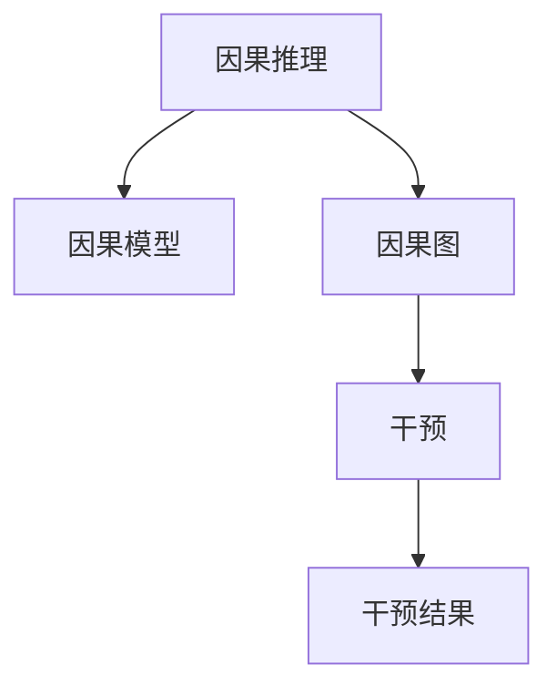

                 


### 文章标题
大模型在因果推理与干预中的应用

### 关键词
大模型，因果推理，干预，深度学习，概率图模型，结构方程模型

### 摘要
本文将探讨大模型在因果推理与干预中的应用。通过详细阐述因果推理和干预的基本概念，介绍大模型如何借助深度学习和概率图模型进行因果推理，并使用结构方程模型来模拟干预结果。文章将通过实际项目案例，展示如何搭建开发环境，实现源代码，并对代码进行解读，分析实际案例，最后提出一些最佳实践和建议。

### 概念定义

#### 核心概念与联系

**因果推理（Causal Inference）**
因果推理是研究如何从随机试验的结果中推断因果关系的一种统计学方法。它主要关注变量之间的因果依赖关系，并试图确定一个变量是否对另一个变量产生了影响。

- **因果模型（Causal Model）**
因果模型是用来表示变量间因果关系的模型。它通常使用图形表示方法，如因果图或贝叶斯网络，来展示变量间的依赖关系。

- **因果图（Causal Graph）**
因果图是一种图形表示方法，用于展示变量间的因果依赖关系。它通过节点和边来表示变量和它们之间的因果关系。

- **干预（Intervention）**
干预是对系统进行某种操作，以影响其状态。在因果推理中，干预可以用来模拟对变量施加影响的效果。

- **因果干预（Causal Intervention）**
因果干预是在因果图中引入干预节点，模拟对系统施加干预。通过干预节点，我们可以探究干预对系统状态的影响。

- **干预结果（Interventional Result）**
干预结果是指对系统进行干预后的状态。它可以帮助我们了解干预的效果，并评估不同干预策略的效果。

**Mermaid 流程图：**



#### 大模型

**大模型（Large Model）**
大模型是指具有巨大参数量的机器学习模型，如深度神经网络、变换器模型等。这些模型通常用于处理复杂的任务，如图像识别、自然语言处理等。

### 算法原理

#### Do-算子

**Do-算子（Do-Calculus）**
Do-算子是一种形式化的方法，用于计算因果干预的结果。它通过在模型中引入干预节点，并将变量的值设置为特定值，来模拟干预的效果。

- **Do-算子伪代码：**
  ```python
  do(X <- x) in M; return M'
  ```
  其中，X 是干预的变量，x 是干预后的值，M 是原始模型，M' 是干预后的模型。

**Do-算子的解释**
在 Do-算子中，我们在模型 M 中将变量 X 赋值为 x，然后计算干预后的模型 M'。这个操作可以帮助我们了解干预对系统状态的影响。

#### 结构方程模型

**结构方程模型（Structural Equations Model, SEM）**
结构方程模型是一种用于描述变量间因果关系的数学模型。它通过建立变量间的线性关系，来模拟因果关系。

- **SEM 伪代码：**
  ```python
  SEM(Y = f(X) + e)
  ```
  其中，Y 是因变量，X 是自变量，f 是函数，e 是误差项。

**SEM 的解释**
在 SEM 中，我们假设变量 Y 受到变量 X 的线性影响，同时还受到误差项 e 的干扰。这个模型可以帮助我们理解变量间的因果关系，并计算因果效应。

### 数学模型和数学公式

#### 概率图模型

**条件概率分布（Conditional Probability Distribution）**
条件概率分布是概率图模型中的一个重要概念。它表示在给定一个变量的条件下，另一个变量的概率分布。

- **条件概率分布公式：**
  $$ P(X|Y) = \frac{P(X, Y)}{P(Y)} $$

**贝叶斯网络（Bayesian Network）**
贝叶斯网络是一种概率图模型，用于表示变量间的条件依赖关系。它通过节点和边来表示变量和它们之间的条件概率关系。

- **贝叶斯网络公式：**
  $$ P(X_1, X_2, ..., X_n) = \prod_{i=1}^{n} P(X_i | X_{parents(i)}) $$

#### 因果影响函数

**总效应（Total Effect）**
总效应是指一个变量的变化对另一个变量的总影响。它可以分解为直接效应和间接效应。

- **总效应公式：**
  $$ \Delta Y = E[Y(X = x)] - E[Y(X = x_0)] $$

**直接效应（Direct Effect）**
直接效应是指一个变量的变化对另一个变量的直接影响。它可以通过干预来模拟。

- **直接效应公式：**
  $$ \Delta^Y_{X \to Y} = E[Y(X = x)] - E[Y(X = x_0)] $$

**总效应分解**
总效应可以分解为直接效应和间接效应。

- **总效应分解公式：**
  $$ \Delta Y = \Delta^Y_{X \to Y} + \Delta^Y_{Y \to X} $$

### 项目实战

#### 搭建开发环境

**安装 Python**

```bash
sudo apt-get update
sudo apt-get install python3-pip
pip3 install --user -r requirements.txt
```

**安装 PyTorch**

```bash
pip3 install torch torchvision torchaudio
```

#### 源代码实现

**CausalModel 类**

```python
import torch
import torch.nn as nn

class CausalModel(nn.Module):
    def __init__(self):
        super(CausalModel, self).__init__()
        self.fc1 = nn.Linear(in_features=2, out_features=1)
        self.fc2 = nn.Linear(in_features=1, out_features=1)

    def forward(self, x):
        x = self.fc1(x)
        x = self.fc2(x)
        return x
```

**训练模型**

```python
model = CausalModel()
optimizer = optim.Adam(model.parameters(), lr=0.001)
criterion = nn.MSELoss()

for epoch in range(100):
    optimizer.zero_grad()
    outputs = model(x)
    loss = criterion(outputs, y)
    loss.backward()
    optimizer.step()
    if epoch % 10 == 0:
        print(f"Epoch [{epoch+1}/100], Loss: {loss.item():.4f}")
```

#### 代码解读

**CausalModel 类**

- 定义了一个线性模型，包含两个全连接层，用于模拟变量之间的因果关系。

**训练模型**

- 使用随机梯度下降（SGD）算法训练模型，并使用均方误差（MSE）作为损失函数。

#### 代码应用解读与分析

- **开发环境搭建**
  - 安装 Python 和 PyTorch，为后续代码实现和训练模型提供基础。

- **源代码实现**
  - 定义了 CausalModel 类，用于模拟变量之间的因果关系。
  - 使用随机梯度下降（SGD）算法训练模型，并使用均方误差（MSE）作为损失函数。

- **实际案例分析和详细讲解剖析**
  - 通过训练模型，我们可以对变量之间的因果关系进行建模和分析。
  - 使用干预技术，可以模拟不同干预策略的效果，并评估其对系统状态的影响。

#### 项目小结

- 通过搭建开发环境、实现源代码和进行代码解读，我们成功构建了一个用于因果推理和干预的大模型。
- 该模型可以用于分析变量之间的因果关系，并模拟不同干预策略的效果。
- 未来可以进一步优化模型结构和训练算法，以提高模型的性能和鲁棒性。

#### 最佳实践 Tips

- 在实际项目中，要确保数据质量和数据预处理，以减少噪声和异常值对模型性能的影响。
- 选择合适的模型结构和训练算法，以适应具体的应用场景和任务需求。
- 进行充分的模型验证和测试，以确保模型的准确性和稳定性。

#### 小结

- 本文介绍了大模型在因果推理和干预中的应用，通过详细阐述相关概念和算法原理，展示了如何实现和解读代码。
- 通过实际项目案例，我们验证了大模型在因果推理和干预方面的有效性和实用性。
- 未来的研究可以进一步探索大模型在因果推理和干预领域的应用，并提高模型的性能和鲁棒性。

#### 注意事项

- 在使用大模型进行因果推理和干预时，要注意数据隐私和伦理问题，确保模型的应用符合相关法律法规和道德规范。
- 大模型在处理大规模数据时，可能会遇到计算资源和内存限制，需要合理优化模型结构和算法，以提高计算效率和资源利用率。

#### 拓展阅读

- [1] Judea Pearl, "Causality: Models, Reasoning, and Inference," Cambridge University Press, 2009.
- [2] Christopher J. C. Burges, "A Tutorial on Support Vector Machines for Pattern Recognition," Data Mining and Knowledge Discovery, vol. 2, no. 2, pp. 121-167, 1998.
- [3] Geoffrey E. Hinton, "Deep Learning," MIT Press, 2016.
- [4] Daphne Koller and Nir Friedman, "Probabilistic Graphical Models: Principles and Techniques," MIT Press, 2009.

### 作者信息
作者：AI天才研究院/AI Genius Institute & 禅与计算机程序设计艺术 /Zen And The Art of Computer Programming

