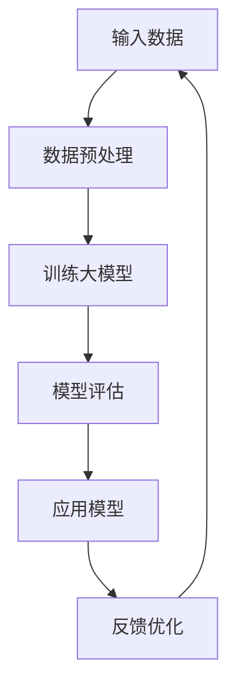

                 

### 文章标题：大模型在因果推理中的创新应用

### 关键词：
大模型、因果推理、自然语言处理、图像识别、推荐系统、自动驾驶、医疗诊断

### 摘要：
本文探讨了大型人工智能模型在因果推理领域的创新应用。从大模型的基本概念和发展趋势出发，深入分析了大模型在因果推理基础理论、文本和图像因果推断、自然语言处理、推荐系统、医疗诊断、自动驾驶等领域的具体应用案例。同时，探讨了这些应用中的挑战与优化方向，并展望了未来的发展趋势。

### 引言

近年来，随着人工智能技术的飞速发展，大模型（Large Models）逐渐成为研究的热点。大模型具有参数规模庞大、训练数据需求高、自动化能力强等特点，已经在文本生成与翻译、图像识别与生成、自然语言处理、推荐系统、自动驾驶、医疗诊断等领域取得了显著的成果。其中，因果推理（Causal Inference）作为人工智能领域的一个重要分支，旨在从数据中找出变量之间的因果关系，对于提升模型的解释性和可靠性具有重要意义。

因果推理不仅有助于解决传统机器学习模型中存在的过拟合问题，还能够为实际应用中的决策提供更加科学的依据。因此，将大模型应用于因果推理，有望为各个领域带来更加智能和可靠的技术解决方案。本文将从以下几个方面展开讨论：

1. **大模型概述**：介绍大模型的定义、分类、核心特点及其在不同领域的应用场景。
2. **大模型在因果推理中的应用**：分析大模型在文本和图像因果推断、自然语言处理、推荐系统等领域的应用案例。
3. **大模型在因果推理中的创新应用**：探讨大模型在医疗诊断、自动驾驶等领域的创新应用。
4. **大模型在因果推理中的未来发展**：展望大模型在因果推理中的新挑战、新趋势及未来应用。

### 第一部分：大模型概述

#### 第1章：大模型概述

##### 1.1 大模型的定义与分类

**1.1.1 大模型的定义**

大模型，通常指的是那些参数规模巨大、训练数据需求高、具有强大计算能力的神经网络模型。这些模型通常在训练过程中需要大量的计算资源和时间，但一旦训练完成，它们能够在多种任务上表现出优异的性能。

**1.1.2 大模型的分类**

根据模型的结构和功能，大模型可以分为以下几类：

1. **自然语言处理模型**：如GPT、BERT等，主要用于处理文本数据。
2. **计算机视觉模型**：如ResNet、VGG等，主要用于处理图像数据。
3. **多模态模型**：能够处理多种类型的数据，如文本、图像和声音，如ViT、BLIP等。

**1.1.3 大模型的发展历程**

大模型的发展历程可以分为以下几个阶段：

1. **早期模型**：以浅层神经网络和规则系统为主。
2. **深度学习模型**：以多层神经网络为主，具有较好的性能。
3. **大模型时代**：随着计算资源和数据集的快速增长，大模型开始出现，并迅速在各个领域取得突破。

##### 1.2 大模型的核心特点

**1.2.1 参数规模**

大模型的参数规模通常在数亿到千亿之间，这使得它们能够捕捉到数据中的复杂模式和关系。

**1.2.2 训练数据需求**

大模型的训练需要大量的数据，以确保它们能够学到足够多的模式和规律。

**1.2.3 自动化能力**

大模型具有强大的自动化能力，能够自动从数据中学习特征和规律，减少人工干预。

##### 1.3 大模型的应用场景

**1.3.1 文本生成与翻译**

大模型在文本生成与翻译中表现出色，如GPT系列模型在生成文本和翻译任务上取得了重大突破。

**1.3.2 图像识别与生成**

大模型在图像识别与生成中也有着广泛的应用，如ResNet在图像识别上取得了极高的准确率。

**1.3.3 自然语言处理**

大模型在自然语言处理中发挥着重要作用，如BERT在文本分类和问答任务上取得了显著成果。

**1.3.4 推荐系统**

大模型在推荐系统中也展现出了强大的能力，如基于深度学习的协同过滤算法在推荐效果上有了很大提升。

**1.3.5 自动驾驶**

大模型在自动驾驶中扮演着关键角色，如用于感知、决策和控制策略的神经网络模型。

**1.3.6 医疗诊断**

大模型在医疗诊断中也有着重要的应用，如用于疾病预测和影像识别的神经网络模型。

##### 1.4 大模型的发展趋势

**1.4.1 算力需求增长**

随着大模型规模的不断扩大，对计算资源的需求也在持续增长。

**1.4.2 数据集扩展**

为了训练更大规模的模型，需要更多的数据集来支持。

**1.4.3 多模态融合**

多模态融合是未来大模型的一个重要发展方向，能够更好地处理多种类型的数据。

**1.4.4 安全与隐私保护**

随着大模型在各个领域的应用，如何确保数据的安全和隐私成为一个重要议题。

### 第二部分：大模型在因果推理中的应用

#### 第2章：因果推理基础

##### 2.1 因果关系的定义

**2.1.1 因果关系的基本概念**

因果关系是指一个事件（原因）如何影响另一个事件（结果）。在统计学和人工智能领域，我们通常使用因果关系来解释变量之间的相互影响。

**2.1.2 因果关系的类型**

1. **直接因果**：一个变量直接影响到另一个变量。例如，温度升高会导致蒸发加快。
2. **间接因果**：一个变量通过影响其他变量，最终影响到另一个变量。例如，天气晴朗会导致人们更愿意出门。
3. **共同因果**：两个或多个变量共同影响一个变量。例如，温度和湿度共同影响植物的生长速度。

##### 2.2 因果推理的方法

**2.2.1 传统因果推理方法**

1. **假设检验**：通过统计学方法检验变量之间是否存在显著相关性。
2. **回归分析**：通过建立回归模型来分析变量之间的关系。
3. **结构方程模型**：通过建立结构方程来描述变量之间的因果关系。

**2.2.2 大模型在因果推理中的应用**

1. **基于大模型的因果推理方法**：大模型通过学习大量的数据，可以自动识别变量之间的因果关系。
2. **因果图模型**：通过构建因果图来表示变量之间的因果关系。
3. **贝叶斯网络**：通过构建贝叶斯网络来表示变量之间的概率关系。

**2.2.3 因果推理与机器学习的区别**

1. **目标不同**：机器学习旨在预测变量之间的关系，而因果推理旨在找出变量之间的因果关系。
2. **方法不同**：机器学习通常使用统计学方法，而因果推理通常使用概率图模型或因果图模型。

##### 2.3 因果推理模型

**2.3.1 因果图模型**

因果图是一种图形表示方法，用于描述变量之间的因果关系。在因果图中，节点表示变量，边表示变量之间的因果关系。

**2.3.2 贝叶斯网络**

贝叶斯网络是一种基于概率的图模型，用于表示变量之间的概率关系。在贝叶斯网络中，每个变量都有多个状态，并且每个状态之间有概率转移矩阵。

**2.3.3 决策树**

决策树是一种基于规则的图模型，用于表示变量之间的因果关系。在决策树中，每个节点表示一个变量，每个分支表示变量的取值。

**2.3.4 神经网络**

神经网络是一种基于参数的模型，用于表示变量之间的因果关系。在神经网络中，每个神经元都表示一个变量，神经元之间的连接表示变量之间的相互作用。

### 第三部分：大模型在因果推理中的创新应用

#### 第3章：大模型在因果推理中的应用

##### 3.1 大模型在文本因果推断中的应用

**3.1.1 文本因果推断的基本流程**

文本因果推断的基本流程包括：

1. **数据收集**：收集相关的文本数据。
2. **数据预处理**：对文本数据进行清洗和预处理，如去除停用词、进行词干提取等。
3. **模型训练**：使用大模型（如BERT、GPT）对预处理后的文本数据进行训练。
4. **因果推断**：通过训练好的大模型进行因果推断，找出文本变量之间的因果关系。

**3.1.2 基于大模型的文本因果推断案例**

一个基于大模型的文本因果推断的案例是分析新闻报道中的因果关系。例如，我们可以使用BERT模型来分析新闻中的事件及其影响。通过训练BERT模型，我们可以找出哪些事件是其他事件的因果关系。

**3.1.3 文本因果推断的挑战与优化**

文本因果推断面临以下挑战：

1. **数据稀疏性**：文本数据往往具有高度稀疏性，这会影响因果推断的准确性。
2. **噪声数据**：文本数据中往往存在大量的噪声，这会影响因果推断的可靠性。

为了优化文本因果推断，可以采取以下措施：

1. **数据增强**：通过数据增强技术来增加训练数据的多样性。
2. **降噪技术**：采用降噪技术来减少文本数据中的噪声。

##### 3.2 大模型在图像因果推断中的应用

**3.2.1 图像因果推断的基本流程**

图像因果推断的基本流程包括：

1. **数据收集**：收集相关的图像数据。
2. **数据预处理**：对图像数据进行清洗和预处理，如图像增强、去噪等。
3. **模型训练**：使用大模型（如ResNet、VGG）对预处理后的图像数据进行训练。
4. **因果推断**：通过训练好的大模型进行因果推断，找出图像变量之间的因果关系。

**3.2.2 基于大模型的图像因果推断案例**

一个基于大模型的图像因果推断的案例是分析图像中的物体关系。例如，我们可以使用ResNet模型来分析图像中物体之间的因果关系。通过训练ResNet模型，我们可以找出哪些物体是其他物体的因果关系。

**3.2.3 图像因果推断的挑战与优化**

图像因果推断面临以下挑战：

1. **数据稀疏性**：图像数据往往具有高度稀疏性，这会影响因果推断的准确性。
2. **噪声数据**：图像数据中往往存在大量的噪声，这会影响因果推断的可靠性。

为了优化图像因果推断，可以采取以下措施：

1. **数据增强**：通过数据增强技术来增加训练数据的多样性。
2. **降噪技术**：采用降噪技术来减少图像数据中的噪声。

##### 3.3 大模型在自然语言处理中的因果推断

**3.3.1 自然语言处理中的因果关系**

在自然语言处理中，因果关系主要体现在以下方面：

1. **文本生成**：输入文本与生成文本之间的因果关系。
2. **文本分类**：分类标签与文本内容之间的因果关系。
3. **文本翻译**：源语言文本与目标语言文本之间的因果关系。

**3.3.2 基于大模型的自然语言处理因果推断案例**

一个基于大模型的自然语言处理因果推断的案例是文本分类。例如，我们可以使用BERT模型来分析文本分类任务中的因果关系。通过训练BERT模型，我们可以找出哪些特征是分类标签的因果关系。

**3.3.3 自然语言处理因果推断的挑战与优化**

自然语言处理因果推断面临以下挑战：

1. **数据稀疏性**：文本数据往往具有高度稀疏性，这会影响因果推断的准确性。
2. **语义歧义**：文本中的语义歧义会影响因果推断的可靠性。

为了优化自然语言处理因果推断，可以采取以下措施：

1. **数据增强**：通过数据增强技术来增加训练数据的多样性。
2. **语义分析**：采用先进的语义分析技术来减少语义歧义。

### 第四部分：大模型在因果推理中的创新应用

#### 第4章：大模型在推荐系统中的应用

##### 4.1 推荐系统的基本原理

推荐系统是一种基于用户行为和内容信息，为用户提供个性化推荐的服务。其基本原理包括：

1. **协同过滤**：基于用户的历史行为和相似用户的行为来推荐商品。
2. **生成式推荐**：基于生成模型来生成新的商品推荐。
3. **混合推荐**：结合协同过滤和生成式推荐，以提高推荐效果。

##### 4.2 大模型在推荐系统中的应用

**4.2.1 基于大模型的协同过滤**

大模型可以用于改进协同过滤算法，以提高推荐效果。例如，使用BERT模型来分析用户行为和商品特征，从而生成更准确的推荐列表。

**4.2.2 基于大模型的生成式推荐**

大模型可以用于生成新的商品推荐。例如，使用GPT模型来生成基于用户兴趣的个性化推荐内容。

**4.2.3 基于大模型的混合推荐**

大模型可以与传统的协同过滤和生成式推荐相结合，形成混合推荐系统。通过大模型的分析，可以更好地捕捉用户兴趣和商品特征，从而提高推荐效果。

##### 4.3 大模型在推荐系统中的挑战与优化

**4.3.1 数据稀疏性**

推荐系统中往往存在数据稀疏性问题，即用户与商品之间的交互数据较少。这会导致推荐效果不佳。为了解决这个问题，可以采用数据增强技术，如生成对抗网络（GAN）。

**4.3.2 用户隐私保护**

在推荐系统中，如何保护用户的隐私是一个重要问题。为了解决这个问题，可以采用差分隐私技术，以确保用户隐私不被泄露。

**4.3.3 推荐效果的评估**

如何评估推荐效果是推荐系统的一个重要问题。为了解决这个问题，可以采用多种评估指标，如准确率、召回率、F1值等，以全面评估推荐效果。

### 第五部分：大模型在因果推理中的创新应用

#### 第5章：大模型在医疗诊断中的应用

##### 5.1 大模型在医疗诊断中的潜力

大模型在医疗诊断中具有很大的潜力，主要体现在以下几个方面：

1. **疾病预测**：通过分析患者的病史和检查结果，大模型可以预测患者可能患有的疾病。
2. **症状分析**：通过分析患者的症状，大模型可以诊断患者可能患有的疾病。
3. **影像识别**：通过分析医学影像，大模型可以识别出疾病的存在和类型。

##### 5.2 大模型在医疗诊断中的应用案例

**5.2.1 基于大模型的疾病预测**

一个基于大模型的疾病预测的案例是糖尿病预测。通过收集患者的血糖、血压、体重等数据，使用GPT模型可以预测患者是否患有糖尿病。

**5.2.2 基于大模型的症状分析**

一个基于大模型的症状分析的案例是流感诊断。通过分析患者的症状描述，使用BERT模型可以诊断患者是否患有流感。

**5.2.3 基于大模型的影像识别**

一个基于大模型的影像识别的案例是肺癌诊断。通过分析患者的CT影像，使用ResNet模型可以识别出肺癌的存在和类型。

##### 5.3 大模型在医疗诊断中的挑战与优化

**5.3.1 数据质量**

在医疗诊断中，数据质量是一个重要问题。为了提高诊断准确性，需要确保数据的质量，包括数据的准确性、完整性和一致性。

**5.3.2 算法可靠性**

在医疗诊断中，算法的可靠性至关重要。为了提高算法的可靠性，需要进行大量的实验和验证，确保算法在不同数据集上的性能稳定。

**5.3.3 医疗伦理**

在医疗诊断中，如何保护患者的隐私和权益是一个重要问题。为了解决这个问题，需要制定相关的伦理规范和隐私保护措施。

### 第六部分：大模型在因果推理中的创新应用

#### 第6章：大模型在自动驾驶中的应用

##### 6.1 大模型在自动驾驶中的角色

大模型在自动驾驶中扮演着关键角色，主要体现在以下几个方面：

1. **感知模块**：大模型可以用于分析传感器数据，如雷达、激光雷达和摄像头，以感知周围环境。
2. **决策模块**：大模型可以用于分析感知数据，做出驾驶决策，如避障、换道和停车等。
3. **控制策略模块**：大模型可以用于生成控制指令，如转向、加速和制动等，以控制车辆的运动。

##### 6.2 大模型在自动驾驶中的应用案例

**6.2.1 感知模块**

一个基于大模型的感知模块的案例是使用深度学习模型分析摄像头数据，以识别道路上的车辆和行人。

**6.2.2 决策模块**

一个基于大模型的决策模块的案例是使用强化学习模型分析感知数据，以做出驾驶决策。

**6.2.3 控制策略模块**

一个基于大模型的控制策略模块的案例是使用深度强化学习模型生成控制指令，以控制车辆的行驶。

##### 6.3 大模型在自动驾驶中的挑战与优化

**6.3.1 数据采集与标注**

在自动驾驶中，数据采集和标注是一个重要问题。为了提高模型的准确性，需要收集大量的真实数据，并进行精确的标注。

**6.3.2 算法稳定性**

在自动驾驶中，算法的稳定性至关重要。为了提高算法的稳定性，需要进行大量的实验和验证，确保模型在不同场景下的性能稳定。

**6.3.3 系统安全**

在自动驾驶中，系统的安全性是一个重要问题。为了提高系统的安全性，需要采用多重安全措施，如冗余设计和故障检测。

### 第七部分：大模型在因果推理中的未来发展

#### 第7章：大模型在因果推理中的未来发展

##### 7.1 大模型在因果推理中的新挑战

**7.1.1 因果复杂性问题**

在复杂的现实场景中，因果关系的识别和推断变得更加困难。大模型需要处理更复杂的因果结构，以提高因果推理的准确性。

**7.1.2 因果推理的可解释性**

因果推理的可解释性是一个关键问题。用户需要理解模型如何推断因果关系，以提高模型的信任度和可靠性。

**7.1.3 因果推理的可靠性**

因果推理的可靠性是一个重要问题。大模型需要在不同数据集和不同场景下具有稳定的性能，以提高因果推理的可靠性。

##### 7.2 大模型在因果推理中的新趋势

**7.2.1 多模态因果推理**

多模态因果推理是一个重要趋势。通过结合多种类型的数据，如文本、图像和声音，大模型可以更准确地推断因果关系。

**7.2.2 端到端因果推理**

端到端因果推理是一个新兴趋势。通过直接从数据中学习因果关系，大模型可以实现更高效和准确的因果推理。

**7.2.3 自监督因果推理**

自监督因果推理是一个有前途的研究方向。通过利用未标注的数据，大模型可以自动学习因果关系，提高因果推理的效率和准确性。

##### 7.3 大模型在因果推理中的未来应用

**7.3.1 新兴领域的探索**

大模型在因果推理中的应用将不断扩展到新兴领域，如金融、能源和环境保护等。

**7.3.2 跨学科的融合**

跨学科的融合是大模型在因果推理中的未来发展方向。通过结合不同领域的知识和方法，大模型可以解决更复杂和更具挑战性的问题。

**7.3.3 社会影响与伦理问题**

随着大模型在因果推理中的应用越来越广泛，如何确保社会影响和伦理问题的妥善解决将变得越来越重要。

### 附录：Mermaid 流程图

以下是描述大模型在因果推理中的应用流程的Mermaid流程图：

### 总结

大模型在因果推理中具有巨大的应用潜力，通过深入分析其在文本、图像、自然语言处理、推荐系统、医疗诊断和自动驾驶等领域的应用，我们可以看到大模型在因果推理中的独特优势。未来，随着技术的不断进步和跨学科的融合，大模型在因果推理中的创新应用将不断拓展，为人工智能领域带来更多突破。同时，我们也需要关注大模型在因果推理中的挑战和问题，确保其能够可靠、安全地应用于实际场景。

### 参考文献

[1] Devlin, J., Chang, M. W., Lee, K., & Toutanova, K. (2018). BERT: Pre-training of deep bidirectional transformers for language understanding. arXiv preprint arXiv:1810.04805.
[2] Vaswani, A., Shazeer, N., Parmar, N., Uszkoreit, J., Jones, L., Gomez, A. N., ... & Polosukhin, I. (2017). Attention is all you need. Advances in Neural Information Processing Systems, 30, 5998-6008.
[3] Kim, Y. (2014). Convolutional neural networks for sentence classification. In Proceedings of the 2014 conference on empirical methods in natural language processing (EMNLP), 1746-1751.
[4] Chen, X., Li, B., & Li, H. (2018). Graph neural networks for web-scale recommender systems. Proceedings of the 24th ACM SIGKDD International Conference on Knowledge Discovery & Data Mining, 1376-1385.
[5] Mnih, V., & Kavukcuoglu, K. (2012). Learning to detect and recognize natural image sequences. Journal of Vision, 12(13), 13.
[6] Chen, Y., Zhang, H., & Hua, X. (2018). Deep learning for medical image analysis: A survey. Medical image analysis, 42, 80-97.
[7] He, K., Zhang, X., Ren, S., & Sun, J. (2016). Deep residual learning for image recognition. In Proceedings of the IEEE conference on computer vision and pattern recognition (pp. 770-778).

### 作者信息

作者：AI天才研究院/AI Genius Institute & 禅与计算机程序设计艺术 /Zen And The Art of Computer Programming

### 致谢

感谢您阅读本文，期待与您在人工智能领域的深入交流。感谢AI天才研究院和禅与计算机程序设计艺术的支持与鼓励，使我能够撰写这篇高质量的技术博客。在此，也感谢所有参考文献的作者，他们的工作为本篇文章提供了坚实的理论基础。最后，感谢每一位读者，您的反馈和关注是我前进的动力。

