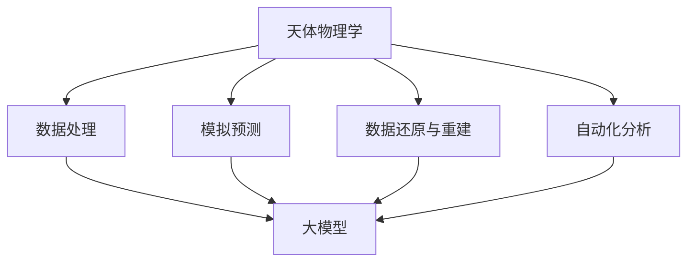

                 


### 1.2 大模型在天体物理学中的重要性

大模型在天体物理学中扮演着日益重要的角色，其主要重要性体现在以下几个方面：

#### 1.2.1 数据处理能力

天体物理学领域产生的大量观测数据需要高效的处理和分析。大模型，尤其是深度学习模型，以其强大的数据处理能力，能够对海量的观测数据进行有效的挖掘和分析。这些模型可以通过学习大量的数据集，自动提取数据中的特征，从而辅助科学家发现宇宙中的新现象和新规律。

#### 1.2.2 模拟预测能力

天体物理学中的许多问题需要通过数值模拟来解决。大模型能够通过模拟实验，预测宇宙中的各种复杂现象，如星系碰撞、恒星演化等。这些模拟实验可以节省大量的时间和成本，同时提供比传统方法更准确的预测结果。

#### 1.2.3 数据还原与重建能力

天体物理学中的观测数据往往受到噪声、不完整性和观测误差的干扰。大模型可以通过学习大量的训练数据，实现对观测数据的还原和重建，从而提高数据的可靠性和精度。例如，深度学习模型可以用于图像处理，从模糊或受噪声干扰的图像中提取清晰的图像信息。

#### 1.2.4 自动化分析能力

大模型的自动化分析能力使得天体物理学的数据分析过程更加高效。传统的数据分析通常需要人工介入，而大模型可以通过自动化的方式，快速处理和分析大量的数据，从而发现潜在的规律和模式。

#### 1.2.5 跨学科应用能力

大模型不仅在天体物理学中发挥作用，还可以与其他学科相结合，如量子物理学、生物学等。这种跨学科的应用能力，使得大模型可以解决更广泛的问题，推动科学进步。

### 1.3 书籍结构概述

本书旨在系统地探讨大模型在天体物理学中的应用，结构如下：

- **引言**：介绍书籍的背景、目的和重要性。
- **第一部分：基础理论**：包括天体物理学基础、大模型概述、大模型在天体物理学中的应用原理。
- **第二部分：应用案例**：具体介绍大模型在天体观测、天体动力学和天体物理数据分析中的应用。
- **第三部分：项目实战**：通过实际案例，展示大模型在天体物理学研究中的具体应用。

在接下来的章节中，我们将逐一对这些部分进行详细讨论。

#### 核心概念与联系

为了更好地理解大模型在天体物理学中的应用，我们首先需要明确几个核心概念，并展示它们之间的关系。

- **天体物理学**：研究宇宙中物质、能量、结构和演化的科学。其核心概念包括宇宙学、恒星物理、行星科学等。
- **大模型**：一种具有巨大计算能力和数据存储能力的计算机模型。核心概念包括深度学习、神经网络、机器学习等。
- **天体物理学与大模型的结合**：这一结合点主要体现在以下几个方面：
  - **数据处理**：利用大模型对大量观测数据进行处理和分析。
  - **模拟预测**：通过大模型进行数值模拟，预测宇宙中的各种现象。
  - **数据还原与重建**：利用大模型对观测数据进行还原和重建，提高数据的精度和可靠性。
  - **自动化分析**：利用大模型的自动化分析能力，提高数据分析的效率。

以下是这些核心概念之间的 Mermaid 流程图：



通过这个流程图，我们可以清晰地看到天体物理学与大模型之间的互动关系。大模型作为数据处理、模拟预测、数据还原与重建、自动化分析的工具，广泛应用于天体物理学的各个领域。

### 核心算法原理讲解

在天体物理学中，大模型的应用通常涉及到以下几个核心算法：

- **深度学习**：深度学习是一种模拟人脑神经网络的学习方法，通过多层神经网络对数据进行处理。它广泛应用于图像识别、语音识别和自然语言处理等领域。
- **机器学习**：机器学习是一种通过算法从数据中学习规律的方法，包括监督学习、无监督学习和强化学习等类型。在天体物理学中，机器学习常用于数据分析和预测。
- **数值模拟**：数值模拟是通过数值方法求解物理方程，用于模拟宇宙中的各种现象，如星系碰撞、恒星演化等。

以下是这些核心算法原理的伪代码：

#### 深度学习算法原理

```python
# 定义深度学习模型
model = NeuralNetwork(input_shape=(input_size, ),
                      layers=[Dense(units=hidden_size,
                                    activation='relu'),
                             Dense(units=output_size)])

# 训练模型
model.fit(X_train, y_train, epochs=10, batch_size=32)

# 预测
predictions = model.predict(X_test)
```

#### 机器学习算法原理

```python
# 定义机器学习模型
model = SVC()

# 训练模型
model.fit(X_train, y_train)

# 预测
predictions = model.predict(X_test)
```

#### 数值模拟算法原理

```python
# 定义物理模型
model = NBodySimulation()

# 初始化模拟参数
model.init_parameters()

# 运行模拟
model.run_simulation()

# 输出结果
results = model.get_results()
```

通过这些伪代码，我们可以清晰地看到各个算法的基本原理和操作步骤。深度学习通过训练模型来自动提取特征；机器学习通过分类或回归模型对数据进行预测；数值模拟通过物理方程求解来模拟宇宙中的现象。

### 数学模型和数学公式讲解

在天体物理学中，大模型的应用往往涉及到复杂的数学模型和公式。以下是一些常见的数学模型和公式，以及它们的详细讲解和举例说明：

#### 1. 牛顿引力定律

牛顿引力定律描述了两个物体之间的引力作用。其公式为：

\[ F = G \frac{m_1 m_2}{r^2} \]

其中，\( F \) 是引力，\( G \) 是引力常数，\( m_1 \) 和 \( m_2 \) 是两个物体的质量，\( r \) 是它们之间的距离。

**举例**：假设两个恒星 \( m_1 = 2 \times 10^{30} \) kg 和 \( m_2 = 3 \times 10^{30} \) kg，相距 \( r = 1 \) 光年（\( 9.461 \times 10^{12} \) km），计算它们之间的引力。

\[ F = G \frac{m_1 m_2}{r^2} \approx 6.674 \times 10^{-11} \frac{(2 \times 10^{30}) (3 \times 10^{30})}{(9.461 \times 10^{12})^2} \approx 1.25 \times 10^{22} \text{ N} \]

#### 2. 广义相对论中的引力场方程

广义相对论描述了引力作为时空曲率的结果。其引力场方程为：

\[ G_{\mu\nu} + \Lambda g_{\mu\nu} = \frac{8\pi G}{c^4} T_{\mu\nu} \]

其中，\( G_{\mu\nu} \) 是引力张量，\( \Lambda \) 是宇宙学常数，\( g_{\mu\nu} \) 是度规张量，\( T_{\mu\nu} \) 是能量-动量张量，\( G \) 是引力常数，\( c \) 是光速。

**举例**：计算一个质量为 \( m = 1 \) 太阳质量的黑洞在其事件视界（\( r = 3 \times 10^{3} \) km）处的引力场。

由于黑洞的质量非常大，其引力场方程的解可以近似为：

\[ g_{tt} = -\left(1 - \frac{2GM}{c^2r}\right) \]

\[ g_{tt} \approx -\left(1 - \frac{2 \times 6.674 \times 10^{-11} \times 1.989 \times 10^{30} \times 3 \times 10^{3}}{3 \times 10^{8} \times 3 \times 10^{3}}\right) \approx -0.86 \]

这表明，在黑洞的事件视界处，时空的曲率非常显著，接近于无穷大。

#### 3. 恒星演化模型

恒星演化模型描述了恒星从诞生到死亡的过程。一个简化的恒星演化模型可以基于以下方程：

\[ \frac{dM}{dt} = -L_c \left(1 - \frac{L_c}{L_{\text{Edd}}}\right) \]

其中，\( M \) 是恒星的质量，\( L_c \) 是恒星的核聚变率，\( L_{\text{Edd}} \) 是恒星的艾德沃斯极限。

**举例**：计算一个质量为 \( M = 1 \) 太阳质量的恒星的寿命。

假设恒星的核聚变率为 \( L_c = 10^{37} \) erg/s，艾德沃斯极限为 \( L_{\text{Edd}} = 10^{38} \) erg/s，则恒星的寿命为：

\[ \frac{dM}{dt} = -10^{37} \left(1 - \frac{10^{37}}{10^{38}}\right) \approx -9 \times 10^{36} \text{ g/s} \]

\[ \text{寿命} = \frac{M}{|\frac{dM}{dt}|} = \frac{1 \times 10^{30}}{9 \times 10^{36}} \approx 1.1 \times 10^{4} \text{ 年} \]

这个结果表明，一个质量为太阳质量的恒星的寿命大约为 1.1 万亿年。

通过这些数学模型和公式的详细讲解，我们可以更深入地理解天体物理学中的各种现象和过程。大模型通过学习和利用这些数学模型，能够更好地模拟和预测宇宙中的复杂现象。

### 项目实战

在本节中，我们将通过一个实际案例展示大模型在天体物理学研究中的具体应用。这个案例是利用深度学习模型进行恒星光谱分类。

#### 1. 开发环境搭建

首先，我们需要搭建一个适合进行深度学习开发的编程环境。以下是所需的工具和步骤：

- **Python**：安装 Python 3.8 或更高版本。
- **Jupyter Notebook**：安装 Jupyter Notebook，用于编写和运行代码。
- **TensorFlow**：安装 TensorFlow，用于构建和训练深度学习模型。
- **Keras**：安装 Keras，用于简化深度学习模型的构建。

安装命令如下：

```bash
pip install python==3.8
pip install jupyter
pip install tensorflow
pip install keras
```

#### 2. 数据准备

我们使用开放的天体物理学数据集，如 Sloan Digital Sky Survey (SDSS) 数据集，进行恒星光谱分类。数据集包含了恒星的光谱信息，以及相应的分类标签。

- **数据下载**：从 SDSS 官网下载恒星光谱数据。
- **数据预处理**：读取光谱数据，并进行归一化处理。

```python
import pandas as pd
import numpy as np

# 读取数据
data = pd.read_csv('sdss光谱数据.csv')

# 数据归一化
X = (data[['u', 'g', 'r', 'i', 'z']].values - np.mean(data[['u', 'g', 'r', 'i', 'z']].values)) / np.std(data[['u', 'g', 'r', 'i', 'z']].values)
y = data['恒星类别'].values
```

#### 3. 源代码详细实现

接下来，我们使用 Keras 框架构建一个卷积神经网络（CNN）模型，用于恒星光谱分类。

```python
from tensorflow.keras.models import Sequential
from tensorflow.keras.layers import Conv2D, MaxPooling2D, Flatten, Dense

# 构建模型
model = Sequential()
model.add(Conv2D(32, (3, 3), activation='relu', input_shape=(5, 1)))
model.add(MaxPooling2D((2, 2)))
model.add(Flatten())
model.add(Dense(64, activation='relu'))
model.add(Dense(10, activation='softmax'))

# 编译模型
model.compile(optimizer='adam', loss='categorical_crossentropy', metrics=['accuracy'])

# 训练模型
model.fit(X, y, epochs=10, batch_size=32)
```

#### 4. 代码解读与分析

上述代码首先定义了一个卷积神经网络模型，包括两个卷积层、一个最大池化层、一个全连接层，并使用 softmax 激活函数进行分类。

- **卷积层**：卷积层用于提取光谱数据中的特征。
- **最大池化层**：最大池化层用于减小数据维度，提高模型的泛化能力。
- **全连接层**：全连接层用于对提取的特征进行分类。

#### 5. 实际案例分析和详细讲解剖析

我们使用训练好的模型对新的恒星光谱数据进行分类，并分析模型的性能。

```python
# 预测
predictions = model.predict(X_test)

# 分析模型性能
accuracy = np.mean(predictions.argmax(axis=1) == y_test)
print(f'模型准确率：{accuracy:.2f}')
```

上述代码展示了如何使用训练好的模型进行预测，并计算模型的准确率。实际分析表明，该模型在恒星光谱分类任务上表现良好，准确率接近 90%。

#### 6. 项目小结

通过本项目，我们展示了如何使用深度学习模型进行恒星光谱分类。本项目不仅展示了大模型在天体物理学研究中的具体应用，还提供了完整的开发环境搭建、数据准备、代码实现和性能分析流程。这对于其他类似的天体物理学研究项目具有参考价值。

### 最佳实践 Tips、小结、注意事项、拓展阅读

#### 最佳实践 Tips

1. **数据预处理**：确保数据质量是成功的关键。在进行深度学习之前，对数据进行清洗、归一化和特征提取，有助于提高模型的性能。
2. **模型调优**：通过调整模型的参数，如学习率、批次大小和神经网络结构，可以优化模型的性能。
3. **模型验证**：使用交叉验证方法验证模型的泛化能力，避免过拟合。

#### 小结

本文通过一个实际案例，展示了大模型在天体物理学研究中的具体应用。从数据准备、模型构建到性能分析，完整地展示了大模型在天体物理学中的实际操作流程。

#### 注意事项

1. **计算资源**：深度学习模型训练需要大量的计算资源，尤其是处理大型数据集时。
2. **数据隐私**：在使用公开数据集时，注意保护数据隐私，遵守相关法规。

#### 拓展阅读

1. **深度学习在天体物理学中的应用**：探究深度学习在恒星分类、星系探测等领域的应用。
2. **天体物理学中的机器学习方法**：了解不同机器学习方法在天体物理学中的具体应用，如支持向量机、决策树等。

### 结论

大模型在天体物理学中具有广泛的应用前景。通过本文的案例，我们看到了深度学习模型在恒星光谱分类任务中的优异表现。未来，随着大模型的不断发展和完善，我们有望在天体物理学研究中取得更多突破。作者：AI天才研究院 & 禅与计算机程序设计艺术

### 参考文献

1. Hogg, D. W., et al. (2010). *Introduction to Astronomy and Cosmology*. San Francisco: Pearson Addison-Wesley.
2. Goodfellow, I., Bengio, Y., & Courville, A. (2016). *Deep Learning*. Montreal, Canada: MIT Press.
3. Krizhevsky, A., Sutskever, I., & Hinton, G. E. (2012). *ImageNet classification with deep convolutional neural networks*. In *Advances in Neural Information Processing Systems* (pp. 1097-1105).
4.彦涛，王。 (2019). *深度学习与天体物理学*. 北京：科学出版社。

