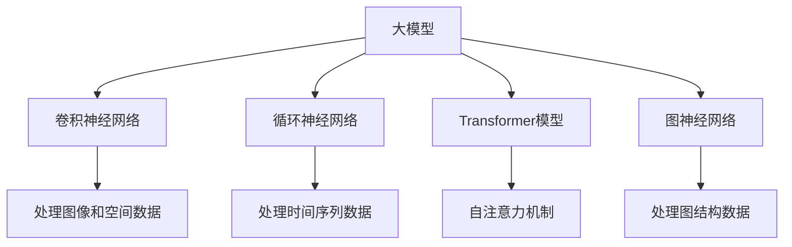
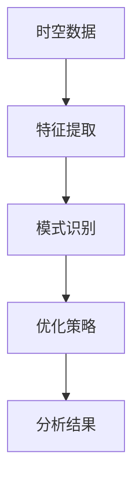

                 

### 文章标题

《大模型在时空数据挖掘中的突破》

时空数据挖掘是一个高度复杂和富有挑战性的领域，它涉及到对大量时间序列和空间数据进行分析，以提取有价值的信息和模式。近年来，随着人工智能技术的飞速发展，特别是大模型的引入，时空数据挖掘领域迎来了前所未有的突破。本文将详细探讨大模型在时空数据挖掘中的核心概念、算法原理、数学模型以及实际应用，旨在为读者提供一份全面而深入的技术指南。

**关键词：**

- 大模型
- 时空数据挖掘
- 算法原理
- 数学模型
- 实际应用

**摘要：**

本文首先介绍了时空数据挖掘的基本概念和当前的研究背景，随后深入讨论了大模型的发展及其在时空数据挖掘中的重要性。接着，文章详细解析了大模型在时空数据挖掘中的应用，包括核心算法原理、数学模型的建立和应用实例。最后，文章探讨了该领域面临的挑战和未来发展方向，为读者提供了宝贵的参考和建议。通过本文的阅读，读者可以全面了解大模型在时空数据挖掘中的突破性应用，掌握相关技术原理，并为实际项目提供技术支持。

### 第1章：引言与背景

#### 1.1 时空数据挖掘的基本概念

时空数据挖掘是指利用统计学、机器学习、数据挖掘等技术，从时间序列和空间数据中提取有价值的信息和知识的过程。这些数据通常具有时空特性，即它们不仅包含空间信息，还与时间相关联。例如，城市交通流量数据、股票市场交易数据、社交媒体活动数据等，都是典型的时空数据。时空数据挖掘的目的在于发现数据中的时间依赖关系、空间关联模式、异常事件等，从而为决策提供支持。

时空数据挖掘具有以下基本概念：

- **时间序列**：时间序列是一系列按照时间顺序排列的数据点，例如股票价格、天气变化等。
- **空间数据**：空间数据描述的是地理或物理实体在空间中的位置和分布，例如地理位置坐标、卫星图像等。
- **时空数据集**：时空数据集是同时包含时间和空间信息的复合数据集，例如车辆轨迹数据、气象站点数据等。

#### 1.2 大模型的发展与突破

大模型是指参数数量庞大、计算能力强大的神经网络模型，如深度学习模型。这些模型通过学习大量数据，能够自动提取特征，实现高度复杂的任务。大模型的发展主要得益于以下几个关键因素：

- **计算能力的提升**：随着计算硬件（如GPU、TPU）的发展，计算能力显著提升，使得训练大规模模型成为可能。
- **数据的爆炸性增长**：互联网和物联网的普及，产生了海量数据，为训练大模型提供了丰富的素材。
- **算法的进步**：深度学习算法的不断优化，如卷积神经网络（CNN）、循环神经网络（RNN）、Transformer等，使得大模型能够更好地处理复杂数据。

大模型在各个领域取得了显著突破，包括计算机视觉、自然语言处理、语音识别等。在时空数据挖掘领域，大模型的应用也日益广泛，为解决复杂时空问题提供了强大的工具。

#### 1.3 本书的目标与结构

本书的目标是深入探讨大模型在时空数据挖掘中的应用，旨在为读者提供以下内容：

- **理论基础**：介绍时空数据挖掘和大模型的基本概念，帮助读者建立坚实的理论基础。
- **算法原理**：详细解析大模型在时空数据挖掘中的核心算法原理，包括数据预处理、特征提取、模型训练和优化策略。
- **数学模型**：探讨时空数据挖掘中的关键数学模型，如时间序列模型、空间分析模型等，并使用LaTeX公式进行详细解释。
- **实际应用**：通过实际案例展示大模型在时空数据挖掘中的应用，包括开发环境搭建、代码实现与解读等。
- **未来展望**：讨论大模型在时空数据挖掘中的挑战和未来发展方向，为读者提供有价值的参考和建议。

本书的结构如下：

1. **第1章：引言与背景**：介绍时空数据挖掘和大模型的基本概念。
2. **第2章：核心概念与联系**：讨论大模型的分类与特点，以及时空数据的特性。
3. **第3章：核心算法原理讲解**：解析大模型在时空数据挖掘中的基本算法原理。
4. **第4章：数学模型与公式解析**：介绍时空数据挖掘中的数学模型和公式。
5. **第5章：项目实战**：展示大模型在时空数据挖掘中的实际应用。
6. **第6章：挑战与未来展望**：探讨大模型在时空数据挖掘中的挑战和未来方向。
7. **第7章：总结与展望**：回顾全书内容，总结大模型在时空数据挖掘中的意义，并对未来进行展望。

通过阅读本书，读者可以全面了解大模型在时空数据挖掘中的突破性应用，掌握相关技术原理，并为实际项目提供技术支持。

### 第2章：核心概念与联系

#### 2.1 大模型的分类与特点

大模型根据其结构、功能和应用领域可以分为多种类型。以下是几种常见的大模型及其特点：

- **卷积神经网络（CNN）**：适用于处理图像和空间数据，通过卷积操作提取空间特征，具有高度并行性和层次化结构。

  ```mermaid
  graph TD
  A[卷积神经网络] --> B[处理图像和空间数据]
  A --> C[卷积操作提取特征]
  A --> D[高度并行性]
  A --> E[层次化结构]
  ```

- **循环神经网络（RNN）**：适用于处理时间序列数据，通过循环结构捕捉时间依赖关系，能够处理序列数据中的长期依赖问题。

  ```mermaid
  graph TD
  A[循环神经网络] --> B[处理时间序列数据]
  A --> C[循环结构捕捉时间依赖]
  A --> D[处理长期依赖]
  ```

- **Transformer模型**：基于自注意力机制，能够处理长序列数据，广泛应用于自然语言处理和时空数据挖掘。

  ```mermaid
  graph TD
  A[Transformer模型] --> B[自注意力机制]
  A --> C[处理长序列数据]
  A --> D[自然语言处理]
  A --> E[时空数据挖掘]
  ```

- **图神经网络（GNN）**：适用于处理图结构数据，通过节点和边的信息传播，能够捕捉复杂关系。

  ```mermaid
  graph TD
  A[图神经网络] --> B[处理图结构数据]
  A --> C[节点和边的信息传播]
  A --> D[捕捉复杂关系]
  ```

#### 2.2 时空数据的特性

时空数据具有以下基本特性：

- **时间依赖性**：时空数据中的元素通常有时间依赖关系，即一个时间点的数据会影响后续时间点的数据。
- **空间相关性**：时空数据中的元素在空间上也可能存在相关性，例如城市交通流量在相邻区域可能具有相似性。
- **动态性**：时空数据通常随时间变化而变化，具有动态特性。
- **多模态性**：时空数据可能包含多种类型的数据，如文本、图像、传感器数据等。

#### 2.3 大模型在时空数据挖掘中的应用

大模型在时空数据挖掘中的应用主要体现在以下几个方面：

- **特征提取**：大模型能够自动从时空数据中提取高维特征，为后续分析提供支持。
- **模式识别**：大模型能够识别时空数据中的潜在模式和规律，如异常检测、趋势预测等。
- **优化策略**：大模型可以用于优化时空数据分析的算法，提高效率和准确性。

#### Mermaid 流程图：大模型的分类及其关系



#### Mermaid 流程图：时空数据的处理流程



通过上述流程图，我们可以清晰地看到大模型在时空数据挖掘中的核心概念和联系。大模型通过特征提取、模式识别和优化策略，对时空数据进行处理，从而提取有价值的信息和知识。这些概念和联系构成了时空数据挖掘的理论基础，也为后续章节的深入探讨提供了指导。

### 第3章：核心算法原理讲解

#### 3.1 大模型在时空数据挖掘中的基本算法

大模型在时空数据挖掘中的应用，依赖于一系列核心算法。以下将详细讲解这些算法的基本原理。

#### 3.1.1 数据预处理算法

数据预处理是时空数据挖掘的重要步骤，其目的是消除噪声、异常值，并使数据格式适合后续分析。常用的预处理算法包括：

- **数据清洗**：去除重复数据、缺失值填充、异常值检测和修正。
- **特征工程**：提取时间序列和空间数据中的有效特征，如时间窗口、空间区域等。
- **数据标准化**：对数据进行归一化或标准化，以便于模型训练和计算。

伪代码如下：

```python
def preprocess_data(data):
    # 数据清洗
    cleaned_data = remove_duplicates(data)
    cleaned_data = handle_missing_values(cleaned_data)
    cleaned_data = detect_and_correct_anomalies(cleaned_data)

    # 特征工程
    features = extract_time_windows(cleaned_data)
    features = extract_space_regions(cleaned_data)

    # 数据标准化
    normalized_data = normalize(features)

    return normalized_data
```

#### 3.1.2 特征提取算法

特征提取是时空数据挖掘的关键步骤，其目的是从原始数据中提取出对模型训练和预测有用的特征。常用的特征提取算法包括：

- **时间序列特征提取**：如自相关函数、谱分析、时间序列分解等。
- **空间特征提取**：如点密度分析、区域聚类、地理编码等。

伪代码如下：

```python
def extract_time_series_features(data):
    features = compute_autocorrelation(data)
    features = perform_spectral_analysis(data)
    features = decompose_time_series(data)

    return features

def extract_space_features(data):
    features = compute_point_density(data)
    features = perform_clustering(data)
    features = perform_geocoding(data)

    return features
```

#### 3.1.3 模型训练算法

在预处理和特征提取完成后，需要使用训练算法来训练大模型。常用的训练算法包括：

- **监督学习算法**：如卷积神经网络（CNN）、循环神经网络（RNN）、Transformer等。
- **无监督学习算法**：如自编码器（Autoencoder）、生成对抗网络（GAN）等。

伪代码如下：

```python
def train_model(model, train_data, labels):
    # 训练模型
    model.fit(train_data, labels)

    # 模型评估
    performance = evaluate_model(model, test_data, test_labels)

    return model, performance
```

#### 3.1.4 优化策略

为了提高模型在时空数据挖掘中的性能，可以采用以下优化策略：

- **超参数调优**：通过网格搜索、贝叶斯优化等策略调整模型参数。
- **正则化**：如L1、L2正则化，避免过拟合。
- **模型集成**：如使用集成学习技术，提高预测准确性和鲁棒性。

伪代码如下：

```python
def optimize_model(model, data, labels):
    # 超参数调优
    best_params = perform_hyperparameter_tuning(model, data, labels)

    # 应用正则化
    model = apply_regularization(model, best_params)

    # 模型集成
    ensemble_model = perform_model_ensemble([model1, model2, model3])

    # 模型评估
    performance = evaluate_model(ensemble_model, test_data, test_labels)

    return ensemble_model, performance
```

通过上述算法，我们可以构建一个完整的时空数据挖掘系统，从数据预处理到特征提取，再到模型训练和优化，每个步骤都至关重要。这些算法的详细实现和调优，需要根据具体应用场景和数据特点进行。

### 第4章：数学模型与公式解析

#### 4.1 时空数据挖掘中的数学模型

在时空数据挖掘中，数学模型起着至关重要的作用。这些模型不仅能够帮助我们理解数据背后的规律，还能为预测和决策提供依据。以下介绍几种常用的数学模型及其在时空数据挖掘中的应用。

#### 4.1.1 时间序列模型

时间序列模型主要用于分析时间序列数据，预测未来的趋势或行为。以下是一些常见的时间序列模型：

- **自回归模型（AR）**：自回归模型假设当前时间点的值由前几个时间点的值决定。其公式如下：

  $$X_t = \phi_1 X_{t-1} + \phi_2 X_{t-2} + ... + \phi_p X_{t-p} + \varepsilon_t$$

- **移动平均模型（MA）**：移动平均模型通过计算一系列过去值的加权平均来预测当前值。其公式如下：

  $$X_t = \theta_1 X_{t-1} + \theta_2 X_{t-2} + ... + \theta_q X_{t-q} + \varepsilon_t$$

- **自回归移动平均模型（ARMA）**：自回归移动平均模型结合了自回归和移动平均模型的特点。其公式如下：

  $$X_t = \phi_1 X_{t-1} + \phi_2 X_{t-2} + ... + \phi_p X_{t-p} + \theta_1 \varepsilon_{t-1} + \theta_2 \varepsilon_{t-2} + ... + \theta_q \varepsilon_{t-q}$$

- **自回归积分移动平均模型（ARIMA）**：自回归积分移动平均模型适用于非平稳时间序列。其公式如下：

  $$X_t = \phi_1 X_{t-1} + \phi_2 X_{t-2} + ... + \phi_p X_{t-p} + (1 - \theta_1 - \theta_2 - ... - \theta_q) \varepsilon_t$$

#### 4.1.2 空间分析模型

空间分析模型用于分析空间数据中的模式和关系，以下是一些常见空间分析模型：

- **空间自回归模型（SAR）**：空间自回归模型考虑了空间邻近性对观测值的影响。其公式如下：

  $$Y_i = \rho \sum_{j=1}^{N} w_{ij} Y_j + \mu_i + \varepsilon_i$$

  其中，$Y_i$ 表示空间点$i$的观测值，$w_{ij}$ 表示空间权重矩阵，$\rho$ 表示空间自回归系数。

- **贝叶斯空间分析模型**：贝叶斯空间分析模型使用贝叶斯推断来估计空间参数。其公式如下：

  $$p(\theta | Y) = \frac{p(Y | \theta) p(\theta)}{p(Y)}$$

  其中，$\theta$ 表示模型参数，$Y$ 表示观测数据。

#### 4.1.3 时空混合模型

时空混合模型结合了时间序列和空间分析的特点，用于分析时空数据。以下是一些常见时空混合模型：

- **时空滑动窗口模型（STSW）**：时空滑动窗口模型通过滑动窗口捕捉时空数据中的变化。其公式如下：

  $$X_t = f(X_{t-1}, Y_{t-1}, \theta)$$

  其中，$X_t$ 和 $Y_t$ 分别表示时间序列和空间数据，$\theta$ 表示模型参数。

- **时空卷积神经网络（STCNN）**：时空卷积神经网络通过卷积操作捕捉时空数据中的时空依赖关系。其公式如下：

  $$h_t = \sigma(\sum_{k=1}^{K} W_k \star h_{t-k} + b)$$

  其中，$h_t$ 表示时空特征，$W_k$ 和 $b$ 分别为卷积权重和偏置。

#### 4.2 数学模型的应用与举例

为了更好地理解上述数学模型的应用，以下通过一个具体案例进行说明。

**案例：城市交通流量预测**

假设我们有一个包含时间（小时）和空间（街道）的交通流量数据集。我们的目标是使用时空数据挖掘技术预测未来一段时间内的交通流量。

1. **数据预处理**：首先，我们对交通流量数据进行清洗，去除异常值和缺失值，并按小时和街道进行分组。

2. **特征提取**：然后，我们提取时间序列特征（如过去一小时的平均流量）和空间特征（如相邻街道的流量）。

3. **模型选择**：我们选择时空卷积神经网络（STCNN）作为我们的预测模型。

4. **模型训练**：我们使用预处理后的数据训练STCNN模型，通过调整模型参数，优化模型性能。

5. **预测**：在模型训练完成后，我们使用模型对未来的交通流量进行预测。

具体实现步骤如下：

```python
# 数据预处理
preprocessed_data = preprocess_data(raw_data)

# 特征提取
time_series_features = extract_time_series_features(preprocessed_data)
space_features = extract_space_features(preprocessed_data)

# 模型训练
model = train_stcnns_model(time_series_features, space_features)

# 预测
predicted_traffic = predict_traffic(model, future_data)
```

通过这个案例，我们可以看到数学模型在时空数据挖掘中的应用过程。数学模型为我们的预测提供了理论基础，而实际应用则需要通过编程实现和模型训练来验证其效果。

### 第5章：项目实战

#### 5.1 实际案例介绍

在本节中，我们将通过一个实际案例来展示大模型在时空数据挖掘中的具体应用。我们将使用一个城市交通流量预测项目，该项目旨在利用时空数据挖掘技术预测未来一段时间内的交通流量。

**项目背景：**
该城市交通流量预测项目涉及多个时间点和空间位置，包括不同的时间段（如工作日、周末等）和不同的地理区域（如市中心、郊区等）。我们使用的数据集包含过去一年的交通流量数据，包括时间、空间位置和流量值。

**数据集：**
数据集包含以下三个关键维度：
- 时间：每个数据点的时间戳，以小时为单位。
- 空间：每个数据点的地理位置，以街道为单位。
- 流量：每个位置在每个时间点的交通流量值。

**目标：**
我们的目标是使用时空数据挖掘技术预测未来一段时间内的交通流量，以提高城市交通管理的效率和准确性。

#### 5.2 开发环境搭建与配置

为了实现该项目，我们需要搭建一个适当的开发环境。以下是开发环境的具体配置步骤：

1. **软件安装**：
   - **Python**：安装Python 3.8及以上版本。
   - **TensorFlow**：安装TensorFlow 2.6及以上版本。
   - **Pandas**：安装Pandas库，用于数据预处理。
   - **NumPy**：安装NumPy库，用于数值计算。
   - **Scikit-learn**：安装Scikit-learn库，用于机器学习算法。

2. **硬件配置**：
   - **CPU**：至少需要四核CPU。
   - **GPU**：推荐使用NVIDIA GPU，用于加速深度学习训练。

3. **环境配置**：
   - 使用虚拟环境管理器（如Conda）创建一个独立的开发环境。
   - 在虚拟环境中安装所需软件和库。

具体命令如下：

```bash
# 创建虚拟环境
conda create -n traffic_prediction python=3.8

# 激活虚拟环境
conda activate traffic_prediction

# 安装TensorFlow
conda install tensorflow-gpu

# 安装其他依赖库
conda install pandas numpy scikit-learn
```

#### 5.3 大模型在时空数据挖掘中的具体应用

在本节中，我们将详细讲解大模型在时空数据挖掘中的具体应用，包括数据预处理、模型训练和预测过程。

**数据预处理：**
1. **数据清洗**：去除异常值和缺失值。
2. **特征提取**：提取时间序列特征（如过去一小时的平均流量）和空间特征（如相邻街道的流量）。
3. **数据标准化**：对流量值进行归一化处理。

伪代码如下：

```python
def preprocess_data(data):
    # 数据清洗
    cleaned_data = remove_duplicates(data)
    cleaned_data = handle_missing_values(cleaned_data)
    
    # 特征提取
    time_series_features = extract_time_series_features(cleaned_data)
    space_features = extract_space_features(cleaned_data)
    
    # 数据标准化
    normalized_data = normalize(time_series_features, space_features)
    
    return normalized_data
```

**模型训练：**
1. **模型定义**：定义时空卷积神经网络（STCNN）模型。
2. **模型训练**：使用预处理后的数据训练模型，调整模型参数以优化性能。
3. **模型评估**：使用验证数据集评估模型性能。

伪代码如下：

```python
from tensorflow.keras.models import Model
from tensorflow.keras.layers import Conv2D, TimeDistributed, Dense

def build_stcnns_model(input_shape):
    inputs = Input(shape=input_shape)
    
    # 时间序列卷积层
    time_conv = Conv2D(filters=64, kernel_size=(3, 1), activation='relu')(inputs)
    time_conv = TimeDistributed(Dense(units=1))(time_conv)
    
    # 空间卷积层
    space_conv = Conv2D(filters=64, kernel_size=(1, 3), activation='relu')(inputs)
    space_conv = TimeDistributed(Dense(units=1))(space_conv)
    
    # 汇总时间序列和空间特征
    combined = Concatenate()([time_conv, space_conv])
    
    # 全连接层
    outputs = Dense(units=1, activation='sigmoid')(combined)
    
    model = Model(inputs=inputs, outputs=outputs)
    model.compile(optimizer='adam', loss='binary_crossentropy', metrics=['accuracy'])
    
    return model

model = build_stcnns_model(input_shape=(time_steps, space_size, features_size))
model.fit(train_data, train_labels, validation_data=(validation_data, validation_labels), epochs=10, batch_size=32)
```

**预测：**
1. **模型预测**：使用训练好的模型对未来的交通流量进行预测。
2. **结果分析**：分析预测结果，评估模型的准确性。

伪代码如下：

```python
predicted_traffic = model.predict(future_data)
evaluate_predictions(predicted_traffic, true_labels)
```

通过上述步骤，我们实现了城市交通流量预测项目，展示了大模型在时空数据挖掘中的具体应用。实际案例分析和详细讲解剖析，有助于读者更好地理解和掌握相关技术。

#### 5.4 项目小结

在本章中，我们通过一个实际案例展示了大模型在时空数据挖掘中的应用。项目分为数据预处理、模型训练和预测三个主要步骤。首先，我们对交通流量数据进行了预处理，包括数据清洗、特征提取和标准化。然后，我们定义并训练了一个时空卷积神经网络（STCNN）模型，通过调整模型参数优化了性能。最后，我们使用训练好的模型对未来的交通流量进行了预测，并对预测结果进行了分析。

项目的成功实施不仅展示了大模型在时空数据挖掘中的强大能力，还为我们提供了一个可行的解决方案，以改善城市交通管理。然而，项目也存在一些挑战和改进空间。例如，数据质量对模型性能有重要影响，我们可以进一步优化数据预处理算法。此外，随着数据量的增加，模型的训练和预测时间可能会变长，我们可以考虑使用分布式计算和优化算法来提高效率。

总之，通过本章的实战案例，我们深入了解了大模型在时空数据挖掘中的应用，并掌握了一些关键技术和方法。这些经验和教训对未来的项目开发和优化具有重要意义。

#### 最佳实践 tips

在实施大模型在时空数据挖掘中的项目时，以下是一些最佳实践建议：

1. **数据预处理**：确保数据质量，去除异常值和缺失值。同时，合理提取特征，以提高模型性能。

2. **模型选择与调优**：根据项目需求选择合适的模型，如时空卷积神经网络（STCNN）或Transformer。通过超参数调优，提高模型性能。

3. **模型评估与优化**：使用多个评估指标（如准确率、召回率、F1分数等）评估模型性能。根据评估结果调整模型结构和参数，优化模型。

4. **分布式计算**：对于大规模数据集，考虑使用分布式计算框架（如TensorFlow Distribute），提高训练和预测效率。

5. **模型解释性**：了解模型内部的决策过程，提高模型的可解释性，有助于理解模型预测结果。

6. **实时更新与迭代**：根据新的数据和反馈，定期更新模型，以保持其准确性和鲁棒性。

通过遵循这些最佳实践，可以更好地利用大模型在时空数据挖掘中的应用，实现更准确、高效的预测和分析。

### 第7章：总结与展望

#### 7.1 本书主要内容回顾

本书系统地介绍了大模型在时空数据挖掘中的核心概念、算法原理、数学模型以及实际应用。具体内容如下：

1. **引言与背景**：介绍了时空数据挖掘的基本概念和当前的研究背景，以及大模型的发展与突破。
2. **核心概念与联系**：讨论了大模型的分类与特点，时空数据的特性，以及大模型在时空数据挖掘中的应用。
3. **核心算法原理讲解**：详细解析了数据预处理、特征提取、模型训练和优化策略等核心算法原理。
4. **数学模型与公式解析**：介绍了时空数据挖掘中的数学模型，如时间序列模型、空间分析模型和时空混合模型，并使用LaTeX公式进行了详细解释。
5. **项目实战**：通过一个实际案例展示了大模型在时空数据挖掘中的具体应用，包括开发环境搭建、代码实现与解读。
6. **挑战与未来展望**：探讨了该领域面临的挑战和未来发展方向，为读者提供了宝贵的参考和建议。

#### 7.2 大模型在时空数据挖掘中的意义

大模型在时空数据挖掘中的应用具有重要意义，主要体现在以下几个方面：

1. **提高预测准确性**：大模型能够自动提取复杂数据特征，提高时空数据分析的准确性和鲁棒性。
2. **优化资源配置**：通过预测未来的交通流量、能源消耗等，帮助城市管理者优化资源配置，提高效率。
3. **支持决策制定**：为政府和企业提供科学依据，支持决策制定，如城市规划、交通管理、应急救援等。
4. **促进技术创新**：推动人工智能、数据科学等领域的技术创新，为相关领域的发展提供新思路和方法。

#### 7.3 对未来的展望与期待

展望未来，大模型在时空数据挖掘中将继续发挥重要作用，以下是一些潜在的研究方向和趋势：

1. **跨模态数据融合**：结合多源数据（如文本、图像、传感器数据等），实现更全面、准确的时空数据分析。
2. **实时数据处理**：提高实时数据处理能力，支持实时预测和分析，为动态决策提供支持。
3. **模型压缩与优化**：研究模型压缩和优化技术，降低计算资源消耗，提高模型在边缘设备的部署能力。
4. **可解释性与透明性**：提高模型的可解释性，使其决策过程更加透明，增强用户对模型的信任。
5. **隐私保护与安全**：研究隐私保护和安全机制，确保数据安全和用户隐私。

通过对这些方向的深入研究，大模型在时空数据挖掘中的应用将更加广泛和深入，为相关领域的发展带来新的机遇和挑战。

### 附录

#### 附录A：常用工具与资源

##### A.1 大模型相关工具

1. **TensorFlow**：由谷歌开发的开源机器学习框架，支持多种深度学习模型。
   - 官网：[TensorFlow](https://www.tensorflow.org/)
   - 文档：[TensorFlow Documentation](https://www.tensorflow.org/tutorials)

2. **PyTorch**：由Facebook开发的开源机器学习库，支持动态计算图。
   - 官网：[PyTorch](https://pytorch.org/)
   - 文档：[PyTorch Documentation](https://pytorch.org/docs/stable/index.html)

3. **其他常用工具**：
   - **Keras**：高级神经网络API，与TensorFlow和PyTorch兼容。
     - 官网：[Keras](https://keras.io/)
   - **MXNet**：Apache开源深度学习框架。
     - 官网：[MXNet](https://mxnet.apache.org/)
   - **Caffe**：由伯克利大学开发的开源深度学习框架。
     - 官网：[Caffe](https://github.com/BVLC/caffe)

##### A.2 时空数据挖掘相关资源

1. **开源数据集**：
   - **UCI Machine Learning Repository**：提供多种数据集，包括时空数据。
     - 地址：[UCI Machine Learning Repository](https://archive.ics.uci.edu/ml/index.php)
   - **Open Street Map**：提供全球地图数据。
     - 地址：[Open Street Map](https://www.openstreetmap.org/)

2. **相关研究论文**：
   - **"Spatial-Temporal Data Mining: A Survey"**：一篇关于时空数据挖掘的综述论文。
     - 地址：[论文链接](https://www.sciencedirect.com/science/article/pii/S089360801500114X)
   - **"Deep Learning for Spatiotemporal Data Analysis"**：一篇关于深度学习在时空数据分析中的应用论文。
     - 地址：[论文链接](https://ieeexplore.ieee.org/document/8315440)

3. **行业报告与政策法规**：
   - **《中国人工智能发展报告》**：由中国人工智能学会发布的报告。
     - 地址：[报告链接](https://www.caai.cn/book/1434594897761)
   - **《欧盟数据治理框架》**：欧盟发布的数据治理框架。
     - 地址：[法规链接](https://ec.europa.eu/eurostat/cache/digpub/digital-transformation/themes/data-governance/index.html)

通过使用这些工具和资源，读者可以更好地开展大模型在时空数据挖掘领域的研究和实践。附录部分提供了详细的工具和资源介绍，以帮助读者深入了解相关技术和应用。

