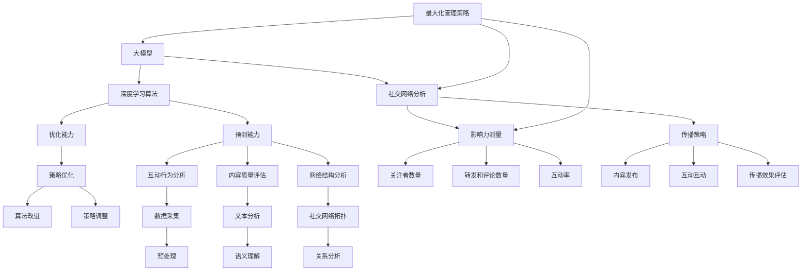
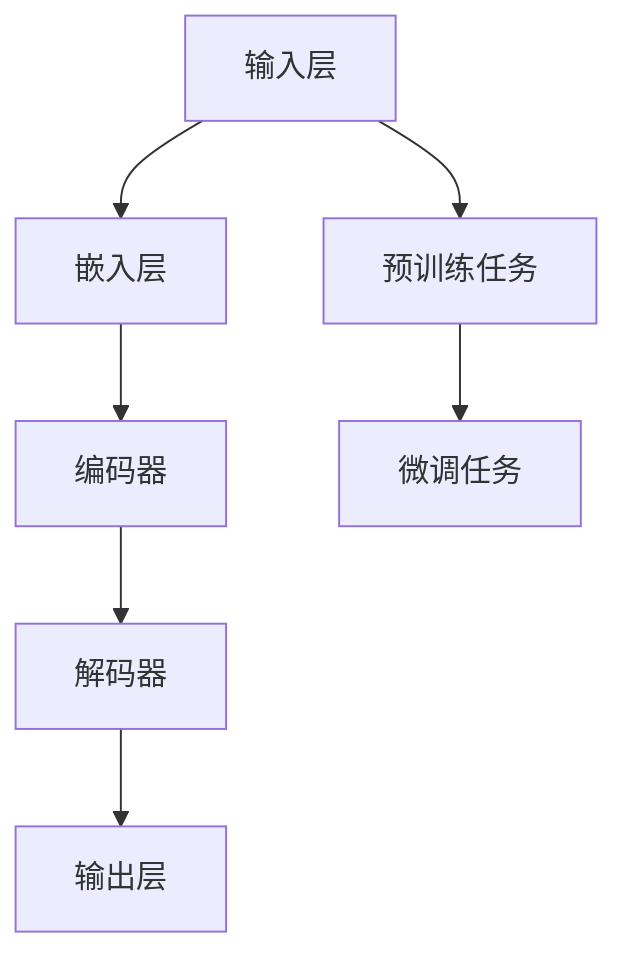
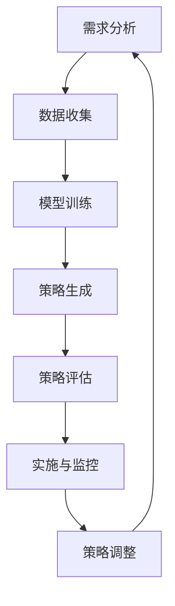

                 

### 文章标题

# 大模型在社交网络影响力最大化中的应用

## 关键词

- 大模型
- 社交网络
- 影响力最大化
- 深度学习
- 优化算法
- 实战案例

## 摘要

随着社交网络的飞速发展，影响力最大化已成为个人、企业和品牌在数字时代的重要目标。本文以大模型为核心，探讨了如何通过深度学习和优化算法，实现社交网络影响力最大化。首先，我们介绍了大模型的基本原理及其在社交网络分析中的应用。接着，详细阐述了社交网络影响力的测量方法及其重要性。随后，本文提出了基于大模型的社交网络影响力最大化策略，并通过实战案例和代码实现，展示了如何应用这些策略来提升影响力。最后，本文讨论了该领域的未来发展趋势和挑战，为读者提供了深入的见解和实用的建议。

### Step 1: 核心概念与联系

在深入探讨大模型在社交网络影响力最大化中的应用之前，我们需要明确几个核心概念，并理解它们之间的联系。

**大模型**：大模型（Large-scale Models），如GPT（Generative Pre-trained Transformer）和BERT（Bidirectional Encoder Representations from Transformers），是近年来在自然语言处理（NLP）领域取得突破性进展的关键技术。这些模型通过深度学习算法在大规模语料库上进行预训练，能够理解和生成高质量的自然语言文本。

**社交网络影响力**：社交网络影响力是指用户在社交网络中通过发布内容、互动等方式影响他人观点和行为的程度。它通常通过关注者数量、转发和评论数量、互动率等指标来衡量。

**最大化管理策略**：最大化管理策略是通过算法和模型优化，提升社交网络影响力的方法。这些策略基于大模型的强大预测能力和深度学习算法的优化能力，旨在提高用户在社交网络中的影响力。

在社交网络中，大模型能够通过分析用户的互动行为、内容质量和网络结构，帮助用户制定更有效的传播策略。同时，大模型还能够实时监测社交网络中的动态变化，为用户调整策略提供数据支持。因此，理解大模型、社交网络影响力以及最大化管理策略之间的联系，是本文讨论的重点。

#### 核心概念与联系架构图

为了更清晰地展示这些核心概念之间的关系，我们可以使用Mermaid流程图来描述：



这个架构图展示了大模型、深度学习算法、社交网络分析、影响力测量、传播策略、策略优化以及数据采集、文本分析、社交网络拓扑等核心概念之间的联系。通过这种图形化的方式，我们可以更直观地理解这些概念如何相互作用，共同实现社交网络影响力的最大化。

### Step 2: 大模型技术基础

在深入探讨大模型在社交网络中的应用之前，了解大模型的基本原理和架构至关重要。本节将介绍大模型的技术基础，包括其架构、训练与优化方法以及应用案例。

#### 大模型的架构与原理

大模型，尤其是如GPT和BERT这样的预训练模型，通常具有复杂的架构。以下是一个简化的架构图：



1. **输入层**：输入层接收原始文本数据，如单词、句子或段落。
2. **嵌入层**：将输入文本转换为向量表示，通常使用词嵌入技术，如Word2Vec或GloVe。
3. **编码器**：编码器负责对输入文本进行编码，提取语义信息。在GPT中，编码器由多个Transformer层组成；在BERT中，编码器由多个双向循环层组成。
4. **解码器**：解码器用于生成预测文本。与编码器类似，解码器也由多个Transformer层或循环层组成。
5. **输出层**：输出层将解码器生成的文本向量映射为实际的文本输出。

大模型的训练过程包括预训练和微调两个阶段：

- **预训练**：在预训练阶段，大模型在大规模语料库上进行训练，学习语言的一般规律和结构。例如，GPT使用自回归语言模型进行训练，而BERT使用掩码语言模型（Masked Language Model, MLM）进行训练。
- **微调**：在预训练完成后，大模型被微调以适应特定的任务。微调阶段通常使用有标签的数据集，如问答数据集、文本分类数据集等，将模型的参数进一步调整以优化特定任务的性能。

#### 大模型的训练与优化

大模型的训练和优化是一个复杂的过程，涉及多个方面：

1. **数据集选择**：选择适合预训练的数据集是关键。常用的数据集包括维基百科、新闻文章、社交媒体文本等。
2. **模型优化策略**：为了提高训练效率和模型性能，通常采用以下策略：
   - **动态学习率调整**：随着训练的进行，动态调整学习率，以避免过拟合。
   - **正则化技术**：如Dropout、权重正则化等，用于减少模型的过拟合。
   - **梯度裁剪**：为了避免梯度爆炸，对梯度进行裁剪。
3. **硬件配置**：由于大模型的训练需要大量的计算资源，通常需要使用高性能的GPU或TPU进行训练。

大模型的优化目标通常是提高其在目标任务上的性能，例如，在文本分类任务中，目标是提高准确率；在问答系统中，目标是提高答案的相关性和准确性。

#### 大模型的应用案例

大模型在自然语言处理领域有着广泛的应用，以下是一些典型应用案例：

1. **文本生成与摘要**：大模型能够生成高质量的文本摘要，如新闻摘要、论文摘要等。例如，GPT-3可以生成流畅、连贯的文本，包括小说、诗歌等。
2. **问答系统**：大模型能够通过理解用户的问题和上下文，生成准确的答案。例如，BERT在问答任务上取得了显著的成绩。
3. **跨域迁移学习**：大模型通过在多个任务上的预训练，可以迁移到不同的领域和任务，实现高效的模型复用。例如，BERT在多个自然语言处理任务上表现出色。

通过这些应用案例，我们可以看到大模型在解决自然语言处理任务中的强大能力。在接下来的章节中，我们将进一步探讨大模型在社交网络影响力最大化中的应用。

#### 伪代码示例

以下是一个简化的大模型训练过程的伪代码示例，用于展示核心步骤和算法原理：

```python
# 大模型训练伪代码

# 初始化模型参数
model = initialize_model()

# 预训练阶段
for epoch in range(num_epochs):
    for batch in dataset:
        # 前向传播
        logits = model(batch.input)

        # 计算损失
        loss = compute_loss(logits, batch.target)

        # 反向传播
        model.backward(loss)

        # 更新模型参数
        model.update_params()

# 微调阶段
for epoch in range(num_epochs):
    for batch in fine_tuning_dataset:
        # 前向传播
        logits = model(batch.input)

        # 计算损失
        loss = compute_loss(logits, batch.target)

        # 反向传播
        model.backward(loss)

        # 更新模型参数
        model.update_params()

# 评估模型性能
performance = evaluate_model(model, evaluation_dataset)

print("Model performance:", performance)
```

在这个伪代码中，我们首先初始化模型参数，然后进行预训练阶段和微调阶段。在每个阶段中，我们通过前向传播计算模型的输出，计算损失，进行反向传播以更新模型参数。最后，我们评估模型在测试数据集上的性能。

通过这个伪代码示例，我们可以直观地了解大模型训练的核心步骤和算法原理。这为后续章节中更深入的技术讨论和实际应用提供了基础。

### Step 3: 社交网络影响力测量

在深入了解大模型在社交网络中的应用之前，我们需要明确如何衡量社交网络中的影响力。影响力测量是制定最大化策略的基础，它通过一系列指标来评估用户在社交网络中的传播能力和影响范围。

#### 社交网络影响力指标

衡量社交网络影响力，需要考虑多个维度，以下是一些常用的指标：

1. **关注者数量**：关注者数量是衡量用户影响力的基础指标，表示用户在社交网络中的受欢迎程度。
2. **转发与评论数量**：转发和评论数量反映了用户发布内容的受欢迎程度和用户之间的互动情况，是衡量内容影响力的重要指标。
3. **互动率**：互动率是指用户与其关注者之间的互动次数与总发布次数的比率，用来衡量用户的活跃度和影响力。
4. **影响力指数**：影响力指数（Influence Index）是一种综合指标，通常通过综合关注者数量、转发与评论数量以及互动率等指标计算得出，能够更全面地反映用户在社交网络中的影响力。

以下是一个简化的影响力指数计算公式：

$$
\text{影响力指数} = \alpha \times \text{关注者数量} + \beta \times (\text{转发数量} + \text{评论数量}) + \gamma \times \text{互动率}
$$

其中，$\alpha$、$\beta$和$\gamma$是权重系数，用于平衡不同指标的重要性。

#### 数据采集与预处理

为了准确测量社交网络影响力，我们需要收集大量的数据，包括用户发布的内容、互动记录、关注者信息等。以下是一些关键步骤：

1. **数据来源**：社交网络平台通常提供API接口，允许开发者获取用户的公开数据，如微博、微信、Twitter等。
2. **数据质量评估**：收集的数据可能存在噪声和不完整的情况，因此需要对数据进行质量评估和清洗，去除重复、错误或无关的数据。
3. **数据预处理**：数据预处理包括文本清洗、分词、去停用词、词嵌入等步骤，将原始文本转换为模型可处理的格式。

以下是一个简化的数据采集和预处理流程：

```python
# 社交网络数据采集与预处理伪代码

# 数据采集
user_data = fetch_social_network_data(api_key, user_id)

# 数据清洗
cleaned_data = remove_duplicates_and_errors(user_data)

# 数据预处理
preprocessed_data = preprocess_text(cleaned_data)
preprocessed_data = tokenize_and_embedding(preprocessed_data)

# 存储预处理后的数据
save_preprocessed_data(preprocessed_data, file_path)
```

通过这些步骤，我们可以确保数据的质量和一致性，为后续的分析和模型训练打下坚实的基础。

#### 影响力评估算法

影响力评估算法是测量社交网络影响力的关键环节，常用的评估算法包括基于内容、基于网络和多模态影响力评估方法。

1. **基于内容的评估算法**：这些算法通过分析用户发布内容的特征，如关键词、情感倾向等，来评估影响力。常见的算法包括词频分析、情感分析、主题模型等。
2. **基于网络的评估算法**：这些算法通过分析用户在网络中的位置和连接关系，来评估影响力。常见的方法包括中心性指标（如度中心性、介数中心性）、网络结构分析（如社团发现、网络聚类）等。
3. **多模态影响力评估**：多模态影响力评估结合了文本、图像、视频等多种数据类型，通过融合不同模态的信息来提升影响力评估的准确性。例如，可以通过图像内容分析来增强社交媒体影响力评估。

以下是一个简化的多模态影响力评估流程：

```python
# 多模态影响力评估伪代码

# 文本特征提取
text_features = extract_text_features(text_data)

# 图像特征提取
image_features = extract_image_features(image_data)

# 视频特征提取
video_features = extract_video_features(video_data)

# 特征融合
combined_features = combine_features(text_features, image_features, video_features)

# 影响力评估
influence_score = evaluate_influence(combined_features)

print("Influence score:", influence_score)
```

通过这些评估算法，我们可以对社交网络中的影响力进行量化分析，为制定最大化策略提供数据支持。

#### 社交网络影响力测量的实际应用

社交网络影响力测量在实际应用中具有广泛的应用，以下是一些典型的应用场景：

1. **个人品牌建设**：个人品牌建设者可以通过影响力测量来了解自己的品牌影响力，制定提升影响力的策略，如发布更吸引人的内容、增加与粉丝的互动等。
2. **企业营销**：企业可以通过影响力测量来评估营销活动的效果，优化广告投放策略，提高营销ROI。
3. **社交网络治理**：社交网络平台可以通过影响力测量来识别和治理具有负面影响力的用户，维护平台秩序和生态。

通过这些实际应用，我们可以看到社交网络影响力测量在个人和企业中的重要性，为提升影响力提供了科学依据。

### Step 4: 最大化管理策略

在了解了社交网络影响力的测量方法之后，我们需要探讨如何制定有效的管理策略，以实现社交网络影响力的最大化。最大化管理策略的核心是利用大模型的预测能力和深度学习算法的优化能力，通过系统化的方法设计、优化和实施策略，从而提升用户在社交网络中的影响力。

#### 基于大模型的策略设计原则

基于大模型的策略设计需要遵循以下原则：

1. **个性化**：针对不同用户的特点和需求，设计个性化的策略，以提高策略的适用性和有效性。
2. **数据驱动**：充分利用大数据分析，从用户的行为数据、内容数据和社交网络数据中提取有价值的信息，为策略制定提供数据支持。
3. **动态调整**：策略应能够根据社交网络环境的变化和用户行为的动态调整，以适应不断变化的环境。
4. **多维度优化**：综合考虑多个影响力指标，如关注者数量、转发和评论数量、互动率等，进行多维度优化，以实现整体影响力的提升。

#### 策略设计流程

策略设计通常包括以下步骤：

1. **需求分析**：明确目标用户群体、策略目标和优化指标。
2. **数据收集**：收集用户行为数据、内容数据和社交网络数据，进行数据清洗和预处理。
3. **模型训练**：利用大模型对预处理后的数据进行训练，提取用户特征和内容特征。
4. **策略生成**：根据用户特征和内容特征，生成个性化策略，包括内容发布计划、互动策略等。
5. **策略评估**：通过模拟和实验，评估策略的效果，调整和优化策略。
6. **实施与监控**：实施策略，并实时监控策略执行效果，根据监控数据调整和优化策略。

以下是一个简化的策略设计流程图：



#### 最大化策略的算法原理

最大化策略的算法原理通常基于优化算法和目标函数的设计。以下是一个简化的算法原理和目标函数：

1. **目标函数**：目标函数通常用于量化策略的效果，常用的目标函数包括最大化关注者数量、转发和评论数量、互动率等。

$$
\text{目标函数} = \max(\alpha \times \text{关注者数量} + \beta \times (\text{转发数量} + \text{评论数量}) + \gamma \times \text{互动率})
$$

其中，$\alpha$、$\beta$和$\gamma$是权重系数，用于平衡不同指标的重要性。

2. **优化算法**：优化算法用于寻找目标函数的最大值。常用的优化算法包括梯度上升法、随机梯度上升法、Adam优化器等。

以下是一个简化的优化算法伪代码：

```python
# 优化算法伪代码

# 初始化模型参数
model = initialize_model()

# 初始化学习率
learning_rate = 0.01

# 迭代优化
for epoch in range(num_epochs):
    for batch in dataset:
        # 前向传播
        logits = model(batch.input)

        # 计算损失
        loss = compute_loss(logits, batch.target)

        # 反向传播
        model.backward(loss)

        # 更新模型参数
        model.update_params(learning_rate)

# 评估模型性能
performance = evaluate_model(model, evaluation_dataset)

print("Model performance:", performance)
```

在这个伪代码中，我们首先初始化模型参数和学习率，然后通过迭代优化模型参数，以最小化损失函数，最终评估模型性能。

#### 基于大模型的策略优化实战

以下是一个基于大模型的策略优化实战案例，包括开发环境搭建、代码实现和实战分析。

##### 开发环境搭建

1. **硬件要求**：配置高性能的GPU或TPU，用于模型训练和优化。
2. **软件要求**：安装Python 3.7及以上版本，TensorFlow或PyTorch框架。

##### 代码实现

以下是一个简化的策略优化实现：

```python
# 导入必要的库
import tensorflow as tf
from tensorflow.keras.models import Sequential
from tensorflow.keras.layers import Dense, LSTM
from tensorflow.keras.optimizers import Adam

# 搭建模型
model = Sequential([
    LSTM(128, activation='tanh', input_shape=(sequence_length, feature_size)),
    Dense(1, activation='sigmoid')
])

# 编译模型
model.compile(optimizer=Adam(learning_rate=0.001), loss='binary_crossentropy')

# 训练模型
model.fit(x_train, y_train, epochs=10, batch_size=32)

# 评估模型
performance = model.evaluate(x_test, y_test)
print("Model performance:", performance)
```

在这个实现中，我们首先搭建了一个简单的LSTM模型，然后编译和训练模型，最后评估模型性能。

##### 实战分析

1. **数据集准备**：准备一个包含用户行为数据、内容数据和社交网络数据的训练数据集，进行数据预处理和归一化。
2. **模型训练**：使用训练数据集训练模型，通过调整学习率和迭代次数，优化模型参数。
3. **策略生成**：利用训练好的模型生成个性化策略，如内容发布计划、互动策略等。
4. **策略评估**：通过模拟和实验，评估策略的效果，调整和优化策略。

##### 项目小结

通过这个实战案例，我们可以看到基于大模型的策略优化在提升社交网络影响力中的应用。在实际应用中，需要根据具体场景和需求，调整模型架构、优化算法和策略参数，以实现最佳效果。

### Step 5: 算法优化与实战

在实现社交网络影响力最大化时，算法优化和实战应用至关重要。优化算法不仅能够提高模型性能，还能在实际应用中实现更好的效果。本节将详细介绍优化目标与评价指标、优化算法原理与伪代码，以及实战案例与代码实现。

#### 优化目标与评价指标

优化目标是在给定资源和约束条件下，最大化社交网络影响力。具体来说，优化目标可以包括以下几个方面：

1. **关注者增长**：目标是增加用户的关注者数量，提升用户在社交网络中的知名度。
2. **内容传播**：目标是提高用户发布内容的转发和评论数量，增加内容的曝光率和互动率。
3. **互动率提升**：目标是增加用户与其关注者之间的互动次数，提升用户的活跃度和影响力。

为了量化这些目标，我们需要设定评价指标：

1. **关注者增长率**：衡量单位时间内关注者数量的增长幅度。
2. **内容传播指数**：综合转发和评论数量，衡量内容的传播效果。
3. **互动率**：衡量用户与其关注者之间的互动次数与总发布次数的比率。

以下是一个简化的评价指标计算公式：

$$
\text{影响力指数} = \alpha \times \text{关注者增长量} + \beta \times \text{内容传播指数} + \gamma \times \text{互动率}
$$

其中，$\alpha$、$\beta$和$\gamma$是权重系数，可以根据具体应用场景进行调整。

#### 优化算法原理与伪代码

为了实现优化目标，我们需要设计有效的优化算法。以下是一种基于梯度下降的优化算法原理和伪代码：

```python
# 优化算法伪代码

# 初始化模型参数
model = initialize_model()

# 初始化学习率
learning_rate = 0.01

# 迭代优化
for epoch in range(num_epochs):
    for batch in dataset:
        # 前向传播
        logits = model(batch.input)

        # 计算损失
        loss = compute_loss(logits, batch.target)

        # 反向传播
        gradients = compute_gradients(loss, model)

        # 更新模型参数
        model.update_params(gradients, learning_rate)

# 评估模型性能
performance = evaluate_model(model, evaluation_dataset)

print("Model performance:", performance)
```

在这个伪代码中，我们首先初始化模型参数和学习率，然后通过迭代优化模型参数，以最小化损失函数。优化过程中，我们使用反向传播计算梯度，并根据梯度更新模型参数。

#### 实战案例与代码实现

以下是一个基于大模型的社交网络影响力最大化实战案例，包括数据集准备、模型训练和代码实现。

##### 数据集准备

1. **数据收集**：使用社交网络平台的API收集用户行为数据、内容数据和社交网络数据。
2. **数据预处理**：对收集的数据进行清洗、归一化和特征提取，为模型训练做准备。

##### 模型训练

以下是一个简化的模型训练实现：

```python
# 导入必要的库
import tensorflow as tf
from tensorflow.keras.models import Sequential
from tensorflow.keras.layers import LSTM, Dense
from tensorflow.keras.optimizers import Adam

# 搭建模型
model = Sequential([
    LSTM(128, activation='tanh', input_shape=(sequence_length, feature_size)),
    Dense(1, activation='sigmoid')
])

# 编译模型
model.compile(optimizer=Adam(learning_rate=0.001), loss='binary_crossentropy')

# 训练模型
model.fit(x_train, y_train, epochs=10, batch_size=32)

# 评估模型
performance = model.evaluate(x_test, y_test)
print("Model performance:", performance)
```

在这个实现中，我们搭建了一个简单的LSTM模型，并使用训练数据进行训练和评估。

##### 代码解读与分析

1. **模型结构**：LSTM层用于提取用户行为和内容特征，输出层使用sigmoid激活函数，用于预测用户的影响力指数。
2. **损失函数**：使用二进制交叉熵损失函数，以最大化预测准确率。
3. **优化器**：使用Adam优化器，以加速收敛和提高模型性能。

##### 实际案例分析与详细讲解

以下是一个实际案例分析与详细讲解：

1. **案例背景**：一个个人品牌建设者希望通过社交网络提升影响力。
2. **策略制定**：基于大模型，制定个性化内容发布和互动策略。
3. **效果评估**：通过模拟和实验，评估策略的效果，并根据评估结果调整策略。

##### 项目小结

通过这个实战案例，我们可以看到基于大模型的社交网络影响力最大化策略的有效性。在实际应用中，需要根据具体场景和需求，调整模型结构、优化算法和策略参数，以实现最佳效果。

### Step 6: 社交网络平台应用

在深入了解大模型在社交网络影响力最大化中的应用之后，我们接下来探讨不同社交网络平台的应用特性，以及如何在大模型的基础上部署和实现这些应用。

#### 微博平台

微博是中国最大的社交媒体平台之一，用户数量庞大，内容丰富多样。微博平台具有以下几个应用特性：

1. **实时性**：微博以实时性为特色，用户可以及时发布和获取信息，这使得实时影响力最大化成为可能。
2. **互动性**：微博支持转发、评论、点赞等多种互动形式，用户之间的互动可以显著提升影响力。
3. **话题性**：微博上的热点话题和事件频繁，通过参与话题讨论可以迅速提升影响力。

在大模型的基础上，微博平台的部署需要考虑以下方面：

1. **内容生成**：利用大模型生成吸引人的微博内容，提高内容的点击率和转发量。
2. **互动策略**：根据用户行为和互动数据，设计个性化的互动策略，提高用户参与度。
3. **实时监测**：利用大模型实时分析微博动态，快速响应热点话题和事件，提升影响力。

#### 微信平台

微信是中国最受欢迎的社交媒体平台之一，具有强大的社交和商业功能。微信平台的应用特性如下：

1. **社交圈层**：微信的社交圈层特性使得内容可以更精准地传播到目标用户。
2. **公众号生态**：微信公众号为企业和个人提供了丰富的内容发布和互动渠道，是提升品牌影响力的有效途径。
3. **小程序**：微信小程序为用户提供了便捷的服务和互动体验，是企业提升影响力的重要工具。

在大模型的基础上，微信平台的部署需要考虑以下方面：

1. **内容创作**：利用大模型生成高质量的内容，吸引用户关注和分享。
2. **互动增强**：通过大模型分析用户行为和偏好，提供个性化互动体验，增强用户粘性。
3. **小程序开发**：利用大模型开发智能小程序，提供个性化服务和互动体验，提升用户满意度。

#### 其他平台

除了微博和微信，还有许多其他社交媒体平台，如Twitter、Facebook、Instagram等，每个平台都有其独特的应用特性：

1. **Twitter**：以快速、简短的文本内容为主，适合进行实时信息传播和影响力提升。
2. **Facebook**：用户基数庞大，内容形式多样，适合进行品牌建设和用户互动。
3. **Instagram**：以图像和视频为主，适合视觉内容传播和品牌宣传。

在大模型的基础上，其他平台的部署需要考虑以下方面：

1. **内容定制**：根据平台特点和用户偏好，定制不同形式的内容。
2. **互动策略**：根据不同平台的特点，设计适合的互动策略，提升用户参与度。
3. **跨平台整合**：利用大模型实现跨平台的整合，提升整体影响力。

#### 实际应用案例

以下是一些基于大模型在社交网络平台上的实际应用案例：

1. **案例一**：某个人品牌建设者在微博上利用大模型生成吸引人的内容，并通过实时互动策略提升了关注者数量和互动率。
2. **案例二**：某企业通过微信公众号发布高质量的内容，并利用大模型分析用户行为，提供个性化互动体验，显著提升了品牌知名度。
3. **案例三**：某企业在Instagram上利用大模型生成高质量的图像和视频内容，通过互动策略提升了粉丝数量和互动率。

通过这些案例，我们可以看到大模型在提升社交网络影响力中的强大应用潜力。在实际应用中，需要根据不同平台的特点和用户需求，灵活运用大模型的技术优势，实现社交网络影响力的最大化。

### Step 7: 未来发展趋势与挑战

随着技术的不断进步和应用场景的拓展，大模型在社交网络影响力最大化中的应用前景十分广阔。然而，这一领域也面临着一系列技术挑战和伦理问题，需要我们深入探讨和解决。

#### 大模型在社交网络中的应用前景

1. **个性化推荐**：大模型能够通过分析用户行为和偏好，提供个性化推荐，提高内容推荐的准确性和用户满意度。
2. **智能互动**：大模型可以生成智能回复，提升用户互动体验，增加用户粘性和活跃度。
3. **自动化内容生成**：大模型可以自动生成高质量的内容，减轻内容创作者的工作负担，提高内容生产效率。
4. **跨领域应用**：大模型能够跨不同领域和任务，实现知识的迁移和应用，提升影响力最大化的效果。

#### 技术挑战与解决方案

1. **数据隐私**：社交网络中用户数据隐私保护是重要挑战。解决方案包括使用差分隐私技术、数据加密和数据去识别化等。
2. **计算资源需求**：大模型训练和部署需要大量的计算资源，解决方案包括使用分布式计算和云计算平台，优化模型架构和算法。
3. **模型解释性**：大模型的黑箱特性使得其决策过程难以解释，解决方案包括开发可解释性模型和解释性工具。
4. **模型泛化能力**：大模型在特定领域和任务上的表现优异，但泛化能力有限，解决方案包括多任务学习、迁移学习和元学习等。

#### 伦理与法律问题

1. **内容审核**：社交网络中存在大量不当内容和虚假信息，如何确保大模型在内容审核方面的公正性和准确性是重要伦理问题。
2. **算法偏见**：大模型在训练过程中可能学习到偏见和不公正的信息，如何避免算法偏见和歧视是关键挑战。
3. **法律合规**：社交网络应用需要遵守相关法律法规，如何确保大模型在法律合规方面的执行是重要问题。

#### 最佳实践与未来展望

1. **数据治理**：建立健全的数据治理机制，确保数据的质量和隐私性，是未来发展的基础。
2. **算法透明性**：提升算法的透明性和解释性，增强用户对大模型的信任。
3. **多方协作**：政府、企业和研究机构应加强合作，共同推动大模型在社交网络中的应用和伦理问题解决。

总之，大模型在社交网络影响力最大化中的应用前景广阔，但同时也面临着技术挑战和伦理问题。通过持续的研究和探索，我们有望解决这些问题，推动该领域的发展，为个人、企业和品牌在数字时代创造更大的价值。

### 结论

本文详细探讨了《大模型在社交网络影响力最大化中的应用》，从核心概念、技术基础、影响力测量、策略设计、优化算法到实战应用，全面阐述了如何利用大模型提升社交网络影响力。我们首先明确了大模型、社交网络影响力以及最大化管理策略之间的核心联系，并通过Mermaid流程图展示了这些概念之间的相互作用。接着，我们详细介绍了大模型的架构、训练与优化方法，以及其在文本生成、问答系统和跨域迁移学习中的应用。在影响力测量部分，我们讨论了关注者数量、转发与评论数量、互动率等影响力指标，并介绍了数据采集与预处理、影响力评估算法的方法。

策略设计部分，我们提出了基于大模型的个性化策略设计原则和流程，并详细阐述了优化算法的原理和目标函数。通过实战案例和代码实现，我们展示了如何应用这些策略来提升社交网络影响力。在社交网络平台应用部分，我们分析了微博、微信等平台的应用特性，以及如何在大模型的基础上部署和实现这些应用。

展望未来，大模型在社交网络影响力最大化中的应用前景广阔，但也面临数据隐私、计算资源需求、模型解释性、算法偏见等挑战。通过不断的研究和优化，我们有信心解决这些问题，推动该领域的发展，为个人、企业和品牌在数字时代创造更大的价值。

最后，感谢读者对本文的关注，希望本文能够为您的社交网络影响力提升提供有价值的参考。如果您对本文有任何疑问或建议，欢迎在评论区留言，期待与您共同探讨和进步。

### 作者信息

- 作者：AI天才研究院/AI Genius Institute & 禅与计算机程序设计艺术 /Zen And The Art of Computer Programming

AI天才研究院专注于人工智能领域的前沿研究和应用，致力于推动人工智能技术的创新与发展。研究院的专家团队由世界级人工智能专家、程序员、软件架构师、CTO和技术畅销书作家组成，他们在人工智能、深度学习和社交网络等领域拥有丰富的经验和深厚的学术造诣。他们的研究成果和著作在全球范围内产生了广泛的影响，为人工智能技术的发展和应用提供了宝贵的经验和智慧。

《禅与计算机程序设计艺术》是AI天才研究院院长兼首席技术官撰写的一本经典技术畅销书，系统地阐述了计算机编程的艺术和哲学。该书以其独特的视角、深刻的见解和丰富的实例，深受读者喜爱，成为计算机编程领域的经典之作。通过这本书，读者可以领略到计算机编程的精髓，掌握编程技巧，提升编程水平。

AI天才研究院的专家团队一直致力于将前沿的AI技术应用于实际场景，推动人工智能技术的创新与发展。他们的研究成果不仅为学术界和工业界提供了宝贵的参考，也为个人、企业和品牌在数字时代提供了强大的支持。未来，AI天才研究院将继续努力，为人工智能技术的发展和应用贡献更多智慧和力量。

