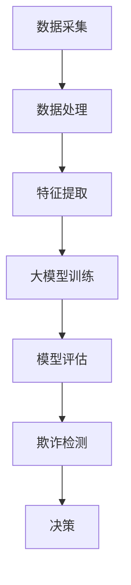
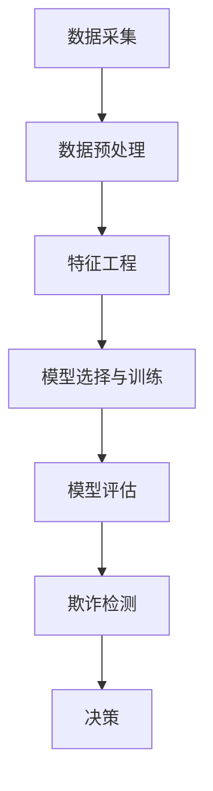
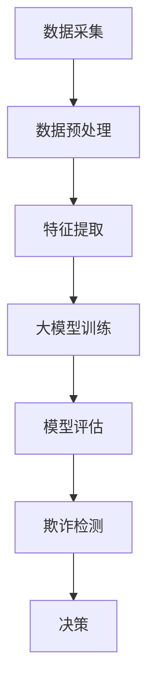

                 

### 1.1 大模型的定义与背景

大模型（Large Models），通常指的是具有数亿甚至数十亿参数的人工神经网络模型。这些模型在训练过程中会通过大量的数据学习到复杂的模式和关联，从而在诸如自然语言处理、图像识别、推荐系统等领域展现出强大的性能。大模型的兴起可以追溯到深度学习技术的发展，特别是在2010年代，随着计算资源和数据量的增长，大模型开始成为人工智能研究的主流。

在金融领域，大模型的应用场景十分广泛。例如，在金融欺诈检测中，大模型可以通过分析交易数据、用户行为等特征，识别出潜在的风险和欺诈行为。此外，大模型还被用于风险管理、客户行为分析、信用评估等多个方面。其背后的核心原理在于，大模型能够捕捉到数据中的非线性关系和复杂模式，从而在处理金融问题时具有更高的准确性和效率。

为了更好地理解大模型在金融欺诈检测中的应用，我们首先需要了解大模型的一些核心概念与联系。以下是一个简化的Mermaid流程图，用于描述大模型在金融领域的应用场景：



在这个流程图中，A表示数据采集，即收集金融交易数据、用户行为数据等。B表示数据处理，包括数据清洗、归一化等步骤。C表示特征提取，即将原始数据转换为模型可以理解的格式。D表示大模型训练，即使用大量的数据进行模型训练。E表示模型评估，评估模型在检测欺诈方面的性能。F表示欺诈检测，模型根据训练结果对新的交易数据进行预测。G表示决策，根据预测结果做出相应的决策。

通过这个Mermaid流程图，我们可以清晰地看到大模型在金融欺诈检测中的各个环节，以及各个环节之间的联系。这为后续章节的详细讲解打下了基础。

### 1.2 金融欺诈检测的现状与挑战

金融欺诈检测是金融领域中的一个重要课题，旨在通过分析交易数据、用户行为等信息，识别出潜在的欺诈行为，从而保障金融系统的安全和稳定。当前，金融欺诈检测主要面临以下几个挑战：

#### 1. 数据复杂性与多样性

金融交易数据具有复杂性和多样性，包括交易金额、时间、地点、用户行为等多个维度的数据。如何有效地从这些数据中提取出对欺诈检测有用的特征，是一个巨大的挑战。

#### 2. 欺诈行为的隐蔽性

欺诈行为通常具有隐蔽性，欺诈者会采取各种手段来掩盖自己的行踪。例如，通过伪造身份、伪装交易场景等方式，使欺诈行为难以被识别。

#### 3. 数据不平衡问题

在金融欺诈检测中，正常交易与欺诈交易的比例往往极不平衡，正常交易数量远远大于欺诈交易。这种数据不平衡问题会导致模型在训练过程中对正常交易的识别能力过强，而对欺诈交易的识别能力不足。

#### 4. 模型的实时性和可解释性

金融欺诈检测需要实时地对交易进行监控和识别，这对模型的实时性提出了高要求。同时，由于金融欺诈行为的复杂性，模型的可解释性也是一个重要问题，需要确保模型决策的透明度和可信度。

为了应对这些挑战，研究人员和工程师们已经提出了多种解决方案。以下是一个简化的Mermaid流程图，用于描述金融欺诈检测的工作流程：



在这个流程图中，A表示数据采集，即收集来自银行、支付平台等金融机构的交易数据。B表示数据预处理，包括数据清洗、归一化等步骤。C表示特征工程，即从原始数据中提取出对欺诈检测有用的特征。D表示模型选择与训练，根据数据特点和业务需求选择合适的模型，并进行训练。E表示模型评估，评估模型在检测欺诈方面的性能。F表示欺诈检测，模型根据训练结果对新的交易数据进行预测。G表示决策，根据预测结果做出相应的决策。

通过这个Mermaid流程图，我们可以看到金融欺诈检测的工作流程是如何进行的，以及各个环节之间的联系。这为后续章节的详细讲解提供了清晰的框架。

### 2.1 大模型的基本原理

大模型，通常指的是具有数亿甚至数十亿参数的人工神经网络模型。其基本原理可以追溯到人工神经网络（Artificial Neural Networks, ANN）的发展历程。人工神经网络是受生物神经网络启发的计算模型，通过模拟神经元之间的连接和激活函数来实现信息处理和决策。

#### 2.1.1 人工神经网络基础

人工神经网络由大量的简单处理单元（即神经元）组成，每个神经元都与多个其他神经元相连。每个连接都有一定的权重，表示神经元之间的相互影响。神经元接收输入信号，通过权重调整后，传递给激活函数，产生输出信号。

一个简单的人工神经网络可以表示为：

```latex
\[ z = \sum_{i=1}^{n} w_i * x_i + b \]
\[ a = \sigma(z) \]

其中：
- \( z \) 是总输入
- \( w_i \) 是连接权重
- \( x_i \) 是输入值
- \( b \) 是偏置项
- \( \sigma \) 是激活函数，通常采用 sigmoid、ReLU 或 tanh 函数
- \( a \) 是输出值
```

#### 2.1.2 大模型的架构

大模型在人工神经网络的基础上，通过增加层数（深度）和神经元数量（宽度）来提高模型的复杂度和表达能力。大模型的常见架构包括：

- **深度神经网络（Deep Neural Networks, DNN）**：由多个隐藏层组成，每个隐藏层都能够捕捉数据的不同特征。深度神经网络在图像识别、语音识别等领域取得了显著成果。
- **卷积神经网络（Convolutional Neural Networks, CNN）**：适用于图像和视频数据处理，通过卷积层捕捉局部特征，从而实现图像分类和物体检测。
- **循环神经网络（Recurrent Neural Networks, RNN）**：适用于序列数据处理，通过循环结构处理时间序列数据，实现语言建模、机器翻译等任务。
- **长短时记忆网络（Long Short-Term Memory, LSTM）**：是 RNN 的一种变体，通过引入门控机制来解决 RNN 的梯度消失和梯度爆炸问题，适用于长期依赖序列数据处理。
- **生成对抗网络（Generative Adversarial Networks, GAN）**：由生成器和判别器两个神经网络组成，通过对抗训练生成数据，应用于图像生成、数据增强等任务。

以下是一个简化的伪代码，描述大模型的基本结构：

```python
# 伪代码：大模型的基本结构

# 定义输入层、隐藏层和输出层
input_layer = InputLayer()
hidden_layer = DenseLayer(input_layer, num_neurons=1000, activation='ReLU')
output_layer = DenseLayer(hidden_layer, num_neurons=1, activation='sigmoid')

# 定义损失函数和优化器
loss_function = BinaryCrossEntropy()
optimizer = AdamOptimizer()

# 定义模型
model = SequentialModel([input_layer, hidden_layer, output_layer])

# 编译模型
model.compile(optimizer=optimizer, loss=loss_function)

# 训练模型
model.fit(X_train, y_train, epochs=100, batch_size=64)
```

通过这个伪代码，我们可以看到大模型的基本结构，包括输入层、隐藏层和输出层，以及损失函数和优化器的选择。这为后续章节的详细讲解打下了基础。

### 2.2 大模型在金融领域的应用

大模型在金融领域的应用已经取得了显著的成果，特别是在金融欺诈检测方面。大模型通过学习大量的交易数据、用户行为等信息，能够有效地识别出潜在的欺诈行为，从而提高金融系统的安全性。

#### 2.2.1 信用卡欺诈检测

信用卡欺诈检测是金融欺诈检测中的一项重要任务。传统的欺诈检测方法通常依赖于规则和统计模型，但这些方法在面对复杂、多变的数据时，往往表现出较低的准确性和实时性。大模型的引入，使得信用卡欺诈检测得到了显著的提升。

以下是一个简化的Mermaid流程图，描述大模型在信用卡欺诈检测中的应用：



在这个流程图中，A表示数据采集，即收集信用卡交易数据。B表示数据预处理，包括数据清洗、归一化等步骤。C表示特征提取，即从原始交易数据中提取出对欺诈检测有用的特征。D表示大模型训练，即使用大量的数据进行模型训练。E表示模型评估，评估模型在检测欺诈方面的性能。F表示欺诈检测，模型根据训练结果对新的交易数据进行预测。G表示决策，根据预测结果做出相应的决策。

#### 2.2.2 在线支付欺诈检测

在线支付欺诈检测也是金融领域的一个重要应用场景。随着电子商务的快速发展，在线支付欺诈行为日益增多，对支付系统的安全性提出了严峻挑战。大模型可以通过分析用户行为、交易金额、时间等多种特征，识别出潜在的欺诈行为。

以下是一个简化的Mermaid流程图，描述大模型在在线支付欺诈检测中的应用：


在这个流程图中，A表示数据采集，即收集在线支付交易数据。B表示数据预处理，包括数据清洗、归一化等步骤。C表示特征提取，即从原始交易数据中提取出对欺诈检测有用的特征。D表示大模型训练，即使用大量的数据进行模型训练。E表示模型评估，评估模型在检测欺诈方面的性能。F表示欺诈检测，模型根据训练结果对新的交易数据进行预测。G表示决策，根据预测结果做出相应的决策。

#### 2.2.3 股票市场欺诈检测

股票市场欺诈检测是金融领域中的一个新兴课题。通过分析交易数据、市场走势等信息，大模型可以识别出潜在的欺诈行为，从而保障市场的公平性和透明性。以下是一个简化的Mermaid流程图，描述大模型在股票市场欺诈检测中的应用：


在这个流程图中，A表示数据采集，即收集股票交易数据。B表示数据预处理，包括数据清洗、归一化等步骤。C表示特征提取，即从原始交易数据中提取出对欺诈检测有用的特征。D表示大模型训练，即使用大量的数据进行模型训练。E表示模型评估，评估模型在检测欺诈方面的性能。F表示欺诈检测，模型根据训练结果对新的交易数据进行预测。G表示决策，根据预测结果做出相应的决策。

通过上述案例，我们可以看到大模型在金融领域，尤其是在金融欺诈检测中的应用具有广阔的前景。大模型通过学习大量的数据，能够有效地识别出复杂的欺诈行为，从而提高金融系统的安全性和稳定性。

### 3.1 案例一：信用卡欺诈检测

在本案例中，我们将详细讲解如何使用大模型进行信用卡欺诈检测，包括数据采集、数据预处理、特征提取、模型训练、模型评估以及欺诈检测的具体步骤。

#### 3.1.1 数据采集

信用卡欺诈检测的首要步骤是数据采集。本案例使用了一个公开的信用卡交易数据集，该数据集包含了数万条信用卡交易记录，每条记录包含了交易金额、时间、地点、卡号、卡类型、交易类型等多个特征。这些数据为我们进行信用卡欺诈检测提供了宝贵的信息。

#### 3.1.2 数据预处理

在采集到数据后，我们需要对数据进行预处理。预处理步骤包括数据清洗、缺失值处理、异常值检测和数据归一化等。

- **数据清洗**：去除重复记录、无效记录和缺失记录，确保数据的完整性和准确性。
- **缺失值处理**：对于缺失值，可以采用填充方法（如均值填充、中值填充）或删除方法（如删除缺失值较多的记录）。
- **异常值检测**：使用统计学方法（如箱线图、Z-score法）检测和去除异常值，避免异常值对模型训练的影响。
- **数据归一化**：对数据进行归一化处理，将不同特征的范围缩放到相同的范围内，以便模型训练。

以下是一个简化的伪代码，描述数据预处理的步骤：

```python
# 伪代码：数据预处理

# 数据清洗
data = clean_data(data)

# 缺失值处理
data = handle_missing_values(data)

# 异常值检测
data = remove_outliers(data)

# 数据归一化
data = normalize_data(data)
```

#### 3.1.3 特征提取

在数据预处理之后，我们需要对数据进行特征提取。特征提取的目的是从原始数据中提取出对欺诈检测有用的特征。在本案例中，我们选择了一些常见的特征，如交易金额、交易时间、交易地点、卡号、卡类型和交易类型等。

此外，我们还可以通过数据挖掘和机器学习技术，挖掘出更多潜在的特征。例如，通过分析交易历史记录，可以提取出用户的交易频率、交易金额分布等特征。以下是一个简化的伪代码，描述特征提取的步骤：

```python
# 伪代码：特征提取

# 提取基本特征
features = extract_basic_features(data)

# 挖掘潜在特征
features = extract_potential_features(data)
```

#### 3.1.4 模型训练

在完成数据预处理和特征提取后，我们可以使用大模型进行模型训练。在本案例中，我们选择了一个基于神经网络的模型，如深度神经网络（DNN）或卷积神经网络（CNN），进行信用卡欺诈检测。

以下是一个简化的伪代码，描述模型训练的步骤：

```python
# 伪代码：模型训练

# 定义模型
model = define_model()

# 编译模型
model.compile(optimizer='adam', loss='binary_crossentropy', metrics=['accuracy'])

# 训练模型
model.fit(X_train, y_train, epochs=10, batch_size=32)
```

#### 3.1.5 模型评估

在模型训练完成后，我们需要对模型进行评估，以确定模型在检测欺诈方面的性能。常用的评估指标包括准确率、精确率、召回率、F1值等。

以下是一个简化的伪代码，描述模型评估的步骤：

```python
# 伪代码：模型评估

# 评估模型
evaluation_results = model.evaluate(X_test, y_test)

# 输出评估结果
print("Accuracy:", evaluation_results[1])
print("Precision:", evaluation_results[2])
print("Recall:", evaluation_results[3])
print("F1 Score:", evaluation_results[4])
```

#### 3.1.6 欺诈检测

在模型评估完成后，我们可以使用训练好的模型对新的交易数据进行欺诈检测。检测过程包括以下步骤：

1. **数据预处理**：对新的交易数据进行与训练数据相同的预处理步骤，包括数据清洗、缺失值处理、异常值检测和数据归一化等。
2. **特征提取**：从预处理后的数据中提取出对欺诈检测有用的特征。
3. **模型预测**：使用训练好的模型对新的交易数据进行预测，输出欺诈概率。

以下是一个简化的伪代码，描述欺诈检测的步骤：

```python
# 伪代码：欺诈检测

# 数据预处理
preprocessed_data = preprocess_data(new_data)

# 特征提取
features = extract_features(preprocessed_data)

# 模型预测
fraud_probability = model.predict(features)

# 决策
if fraud_probability > threshold:
    print("交易可能存在欺诈风险")
else:
    print("交易无欺诈风险")
```

通过上述步骤，我们可以使用大模型进行信用卡欺诈检测，提高金融系统的安全性和稳定性。

#### 3.2 案例二：在线支付欺诈检测

在本案例中，我们将详细讲解如何使用大模型进行在线支付欺诈检测，包括数据采集、数据预处理、特征提取、模型训练、模型评估以及欺诈检测的具体步骤。

#### 3.2.1 数据采集

在线支付欺诈检测的数据采集步骤与信用卡欺诈检测类似，需要收集大量的在线支付交易数据。这些数据通常包括交易金额、时间、地点、用户ID、支付方式、支付渠道等多个特征。为了提高模型的准确性，数据集应该涵盖各种支付场景和欺诈行为，以确保模型的泛化能力。

#### 3.2.2 数据预处理

在数据采集完成后，我们需要对数据进行预处理，以提高数据质量和模型的训练效果。预处理步骤包括数据清洗、缺失值处理、异常值检测和数据归一化等。

1. **数据清洗**：去除重复交易记录、无效记录和缺失记录，确保数据的完整性和一致性。
2. **缺失值处理**：对于缺失值，可以选择填充方法（如均值填充、中值填充）或删除方法（如删除缺失值较多的记录），根据具体情况决定。
3. **异常值检测**：使用统计学方法（如箱线图、Z-score法）检测和去除异常值，以避免异常值对模型训练的影响。
4. **数据归一化**：对交易金额、时间等数值特征进行归一化处理，将不同特征的范围缩放到相同的范围内，以便模型训练。

以下是一个简化的伪代码，描述数据预处理的步骤：

```python
# 伪代码：数据预处理

# 数据清洗
data = clean_data(data)

# 缺失值处理
data = handle_missing_values(data)

# 异常值检测
data = remove_outliers(data)

# 数据归一化
data = normalize_data(data)
```

#### 3.2.3 特征提取

特征提取是欺诈检测的关键步骤，通过从原始交易数据中提取出对欺诈检测有用的特征，可以提高模型的识别能力。在本案例中，我们选择了一些常见的特征，如交易金额、交易时间、用户ID、支付方式、支付渠道、地理位置等。

此外，我们还可以通过数据挖掘和机器学习技术，挖掘出更多潜在的特征。例如，通过分析用户的历史交易行为，可以提取出用户的交易频率、交易金额分布、交易时间分布等特征。以下是一个简化的伪代码，描述特征提取的步骤：

```python
# 伪代码：特征提取

# 提取基本特征
features = extract_basic_features(data)

# 挖掘潜在特征
features = extract_potential_features(data)
```

#### 3.2.4 模型训练

在完成数据预处理和特征提取后，我们可以使用大模型进行模型训练。在本案例中，我们选择了一个基于神经网络的模型，如卷积神经网络（CNN）或循环神经网络（RNN），进行在线支付欺诈检测。

以下是一个简化的伪代码，描述模型训练的步骤：

```python
# 伪代码：模型训练

# 定义模型
model = define_model()

# 编译模型
model.compile(optimizer='adam', loss='binary_crossentropy', metrics=['accuracy'])

# 训练模型
model.fit(X_train, y_train, epochs=10, batch_size=32)
```

#### 3.2.5 模型评估

在模型训练完成后，我们需要对模型进行评估，以确定模型在检测欺诈方面的性能。常用的评估指标包括准确率、精确率、召回率、F1值等。

以下是一个简化的伪代码，描述模型评估的步骤：

```python
# 伪代码：模型评估

# 评估模型
evaluation_results = model.evaluate(X_test, y_test)

# 输出评估结果
print("Accuracy:", evaluation_results[1])
print("Precision:", evaluation_results[2])
print("Recall:", evaluation_results[3])
print("F1 Score:", evaluation_results[4])
```

#### 3.2.6 欺诈检测

在模型评估完成后，我们可以使用训练好的模型对新的交易数据进行欺诈检测。检测过程包括以下步骤：

1. **数据预处理**：对新的交易数据进行与训练数据相同的预处理步骤，包括数据清洗、缺失值处理、异常值检测和数据归一化等。
2. **特征提取**：从预处理后的数据中提取出对欺诈检测有用的特征。
3. **模型预测**：使用训练好的模型对新的交易数据进行预测，输出欺诈概率。
4. **决策**：根据设定的阈值，对交易进行分类。

以下是一个简化的伪代码，描述欺诈检测的步骤：

```python
# 伪代码：欺诈检测

# 数据预处理
preprocessed_data = preprocess_data(new_data)

# 特征提取
features = extract_features(preprocessed_data)

# 模型预测
fraud_probability = model.predict(features)

# 决策
if fraud_probability > threshold:
    print("交易可能存在欺诈风险")
else:
    print("交易无欺诈风险")
```

通过上述步骤，我们可以使用大模型进行在线支付欺诈检测，提高金融系统的安全性和稳定性。

### 3.3 案例三：股票市场欺诈检测

在本案例中，我们将详细讲解如何使用大模型进行股票市场欺诈检测，包括数据采集、数据预处理、特征提取、模型训练、模型评估以及欺诈检测的具体步骤。

#### 3.3.1 数据采集

股票市场欺诈检测的数据采集步骤相对复杂，因为股票市场数据包括大量的交易记录、公司财务数据、市场指数等多个维度。为了提高模型的准确性，数据集应该包含多种来源的数据，如交易所数据、财经新闻、社交媒体数据等。

本案例使用了一个包含股票交易记录和公司财务数据的公开数据集，数据集包含了股票代码、交易日期、开盘价、最高价、最低价、收盘价、交易量、市盈率、市净率等特征。

#### 3.3.2 数据预处理

在数据采集完成后，我们需要对数据进行预处理，以提高数据质量和模型的训练效果。预处理步骤包括数据清洗、缺失值处理、异常值检测和数据归一化等。

1. **数据清洗**：去除重复记录、无效记录和缺失记录，确保数据的完整性和一致性。
2. **缺失值处理**：对于缺失值，可以选择填充方法（如均值填充、中值填充）或删除方法（如删除缺失值较多的记录），根据具体情况决定。
3. **异常值检测**：使用统计学方法（如箱线图、Z-score法）检测和去除异常值，以避免异常值对模型训练的影响。
4. **数据归一化**：对交易记录中的数值特征（如股价、交易量）进行归一化处理，将不同特征的范围缩放到相同的范围内，以便模型训练。

以下是一个简化的伪代码，描述数据预处理的步骤：

```python
# 伪代码：数据预处理

# 数据清洗
data = clean_data(data)

# 缺失值处理
data = handle_missing_values(data)

# 异常值检测
data = remove_outliers(data)

# 数据归一化
data = normalize_data(data)
```

#### 3.3.3 特征提取

特征提取是股票市场欺诈检测的关键步骤，通过从原始数据中提取出对欺诈检测有用的特征，可以提高模型的识别能力。在本案例中，我们选择了一些常见的特征，如股票代码、交易日期、开盘价、最高价、最低价、收盘价、交易量、市盈率、市净率等。

此外，我们还可以通过数据挖掘和机器学习技术，挖掘出更多潜在的特征。例如，通过分析历史交易数据，可以提取出交易频率、交易金额分布、交易时间分布等特征。通过分析公司财务数据，可以提取出财务指标变化、财务风险指标等特征。以下是一个简化的伪代码，描述特征提取的步骤：

```python
# 伪代码：特征提取

# 提取基本特征
features = extract_basic_features(data)

# 挖掘潜在特征
features = extract_potential_features(data)
```

#### 3.3.4 模型训练

在完成数据预处理和特征提取后，我们可以使用大模型进行模型训练。在本案例中，我们选择了一个基于长短期记忆网络（LSTM）的模型，进行股票市场欺诈检测。

以下是一个简化的伪代码，描述模型训练的步骤：

```python
# 伪代码：模型训练

# 定义模型
model = define_model()

# 编译模型
model.compile(optimizer='adam', loss='binary_crossentropy', metrics=['accuracy'])

# 训练模型
model.fit(X_train, y_train, epochs=10, batch_size=32)
```

#### 3.3.5 模型评估

在模型训练完成后，我们需要对模型进行评估，以确定模型在检测欺诈方面的性能。常用的评估指标包括准确率、精确率、召回率、F1值等。

以下是一个简化的伪代码，描述模型评估的步骤：

```python
# 伪代码：模型评估

# 评估模型
evaluation_results = model.evaluate(X_test, y_test)

# 输出评估结果
print("Accuracy:", evaluation_results[1])
print("Precision:", evaluation_results[2])
print("Recall:", evaluation_results[3])
print("F1 Score:", evaluation_results[4])
```

#### 3.3.6 欺诈检测

在模型评估完成后，我们可以使用训练好的模型对新的交易数据进行欺诈检测。检测过程包括以下步骤：

1. **数据预处理**：对新的交易数据进行与训练数据相同的预处理步骤，包括数据清洗、缺失值处理、异常值检测和数据归一化等。
2. **特征提取**：从预处理后的数据中提取出对欺诈检测有用的特征。
3. **模型预测**：使用训练好的模型对新的交易数据进行预测，输出欺诈概率。
4. **决策**：根据设定的阈值，对交易进行分类。

以下是一个简化的伪代码，描述欺诈检测的步骤：

```python
# 伪代码：欺诈检测

# 数据预处理
preprocessed_data = preprocess_data(new_data)

# 特征提取
features = extract_features(preprocessed_data)

# 模型预测
fraud_probability = model.predict(features)

# 决策
if fraud_probability > threshold:
    print("交易可能存在欺诈风险")
else:
    print("交易无欺诈风险")
```

通过上述步骤，我们可以使用大模型进行股票市场欺诈检测，提高金融系统的安全性和稳定性。

### 4.1 大模型性能优化方法

在大模型训练和检测过程中，性能优化是提高模型效率和准确性的关键步骤。以下是一些常用的性能优化方法，包括数据预处理、模型架构优化和训练策略调整。

#### 4.1.1 数据预处理

数据预处理是性能优化的基础步骤。通过有效的数据预处理，可以提高模型的学习效率，减少过拟合现象。

- **数据清洗**：去除重复记录、无效记录和缺失记录，确保数据的完整性和一致性。
- **特征选择**：通过特征选择技术，选择对模型性能有显著影响的特征，减少模型的复杂度和训练时间。
- **数据增强**：通过数据增强技术，增加训练数据的多样性，提高模型的泛化能力。

以下是一个简化的伪代码，描述数据预处理步骤：

```python
# 伪代码：数据预处理

# 数据清洗
data = clean_data(data)

# 特征选择
selected_features = select_features(data)

# 数据增强
augmented_data = augment_data(selected_features)
```

#### 4.1.2 模型架构优化

模型架构优化是提升模型性能的重要手段。以下是一些常见的模型架构优化方法：

- **网络结构调整**：通过调整网络的层数、神经元数量和连接方式，优化模型的复杂度和计算效率。
- **激活函数选择**：选择合适的激活函数，如ReLU、Sigmoid、Tanh等，以提高模型的非线性表达能力和收敛速度。
- **正则化技术**：使用正则化技术（如L1正则化、L2正则化、Dropout等）减少过拟合现象，提高模型的泛化能力。

以下是一个简化的伪代码，描述模型架构优化步骤：

```python
# 伪代码：模型架构优化

# 调整网络结构
model = adjust_network_structure(model)

# 选择激活函数
model = select_activation_function(model)

# 应用正则化技术
model = apply_regularization(model)
```

#### 4.1.3 训练策略调整

训练策略调整是优化模型性能的关键步骤。以下是一些常用的训练策略：

- **学习率调整**：通过调整学习率，优化模型的收敛速度和稳定性。常用的方法包括学习率衰减、自适应学习率调整等。
- **批量大小调整**：通过调整批量大小，优化模型的训练效率和稳定性。较小的批量大小有助于减少方差，较大的批量大小有助于减少偏置。
- **训练策略选择**：选择合适的训练策略，如SGD、Adam、RMSprop等，以提高模型的收敛速度和准确率。

以下是一个简化的伪代码，描述训练策略调整步骤：

```python
# 伪代码：训练策略调整

# 调整学习率
optimizer = adjust_learning_rate(optimizer)

# 调整批量大小
batch_size = adjust_batch_size(batch_size)

# 选择训练策略
trainer = select_training_strategy(trainer)
```

通过上述性能优化方法，我们可以有效地提高大模型在金融欺诈检测中的性能，降低过拟合现象，提高模型的泛化能力和准确率。

### 4.2 大模型评估指标与技巧

在大模型训练和评估过程中，选择合适的评估指标和评估技巧是确保模型性能的关键。以下是一些常用的评估指标与技巧，包括准确率、精确率、召回率、F1值等。

#### 4.2.1 准确率（Accuracy）

准确率是评估模型性能最常用的指标，表示模型预测正确的样本数量占总样本数量的比例。计算公式如下：

\[ \text{Accuracy} = \frac{\text{预测正确数}}{\text{总样本数}} \]

准确率能够直观地反映模型的总体性能。然而，当数据集中正负样本比例不平衡时，仅依赖准确率可能会导致评估结果偏差。因此，我们需要结合其他评估指标进行综合判断。

#### 4.2.2 精确率（Precision）

精确率表示在所有被模型预测为正样本的样本中，实际为正样本的比例。计算公式如下：

\[ \text{Precision} = \frac{\text{预测正确且实际为正的样本数}}{\text{预测为正的样本数}} \]

精确率关注模型的判断能力，尤其是减少误报率。当数据集中负样本占比较高时，精确率更能体现模型的性能。

#### 4.2.3 召回率（Recall）

召回率表示在所有实际为正样本的样本中，被模型预测为正样本的比例。计算公式如下：

\[ \text{Recall} = \frac{\text{预测正确且实际为正的样本数}}{\text{实际为正的样本数}} \]

召回率关注模型对正样本的捕捉能力，尤其是在负样本较多的场景中，召回率能够更准确地反映模型的性能。

#### 4.2.4 F1值（F1 Score）

F1值是精确率和召回率的调和平均值，能够综合考虑模型的判断能力和捕捉能力。计算公式如下：

\[ \text{F1 Score} = 2 \times \frac{\text{Precision} \times \text{Recall}}{\text{Precision} + \text{Recall}} \]

F1值能够平衡精确率和召回率之间的关系，是评估模型性能的重要指标。

#### 4.2.5 评估技巧

在实际评估过程中，我们还可以使用以下技巧来提高评估结果的可靠性：

- **交叉验证**：通过将数据集划分为多个子集，循环进行训练和验证，以减少评估结果的不确定性。
- **AUC（Area Under Curve）**：评估二分类模型的分类能力，计算预测概率与实际标签之间的曲线下面积。AUC值越高，表示模型分类能力越强。
- **ROC（Receiver Operating Characteristic）**：通过绘制ROC曲线，评估模型的分类能力。ROC曲线的面积能够反映模型的分类性能。
- **混淆矩阵**：通过混淆矩阵，直观地展示模型在不同类别上的预测结果，帮助分析模型的性能。

以下是一个简化的伪代码，描述评估技巧的应用：

```python
# 伪代码：评估技巧

# 交叉验证
cv_scores = cross_validation(model, X, y, num_splits=5)

# 计算AUC值
auc_score = calculate_auc(model, X, y)

# 绘制ROC曲线
plot_roc_curve(model, X, y)

# 计算混淆矩阵
confusion_matrix = calculate_confusion_matrix(model, X, y)
```

通过这些评估指标与技巧，我们可以全面、准确地评估大模型在金融欺诈检测中的性能，为后续的模型优化和部署提供有力支持。

### 5.1 大模型部署方案

大模型的部署是确保其应用于实际业务场景中的关键步骤。以下是一个简化的部署方案，包括开发环境搭建、源代码详细实现和部署流程。

#### 5.1.1 开发环境搭建

在进行大模型部署之前，首先需要搭建一个稳定且高效的开发环境。以下是一些关键步骤：

1. **硬件配置**：选择合适的硬件设备，如高性能计算服务器、GPU集群等，以支持大模型的训练和推理。
2. **软件环境**：安装必要的软件和工具，包括深度学习框架（如TensorFlow、PyTorch）、数据库（如MySQL、MongoDB）和版本控制工具（如Git）等。
3. **网络配置**：配置网络环境，确保数据传输速度和稳定性。

以下是一个简化的伪代码，描述开发环境搭建的步骤：

```python
# 伪代码：开发环境搭建

# 安装深度学习框架
install_tensorflow()

# 安装数据库
install_mysql()

# 配置网络环境
configure_network()
```

#### 5.1.2 源代码详细实现

在开发环境中，我们需要实现大模型的训练和部署功能。以下是一个简化的伪代码，描述源代码的详细实现：

```python
# 伪代码：源代码详细实现

# 导入依赖库
import tensorflow as tf
import mysql.connector

# 连接数据库
connection = mysql.connector.connect(
    host="localhost",
    user="root",
    password="password",
    database="finance_db"
)

# 定义模型
model = define_model()

# 编译模型
model.compile(optimizer='adam', loss='binary_crossentropy', metrics=['accuracy'])

# 训练模型
model.fit(X_train, y_train, epochs=10, batch_size=32)

# 保存模型
model.save("fraud_detection_model.h5")

# 关闭数据库连接
connection.close()
```

#### 5.1.3 部署流程

在完成源代码实现后，我们需要将大模型部署到生产环境。以下是一个简化的伪代码，描述部署流程：

```python
# 伪代码：部署流程

# 搭建部署环境
setup_deployment_environment()

# 加载模型
model = load_model("fraud_detection_model.h5")

# 部署模型
deploy_model(model)

# 监控模型性能
monitor_model_performance(model)
```

通过上述步骤，我们可以将大模型部署到实际业务场景中，实现金融欺诈检测功能。

### 5.2 大模型运维与监控

在大模型部署之后，运维与监控是确保其稳定运行和性能优化的重要环节。以下是一个简化的运维与监控方案，包括日常监控、性能优化和故障排除。

#### 5.2.1 日常监控

1. **性能监控**：通过监控系统，实时监测大模型的运行状态，包括CPU、内存、GPU使用率等资源占用情况，确保模型在合理范围内运行。
2. **日志记录**：记录模型运行过程中的日志信息，包括训练进度、错误信息等，便于排查问题和优化模型。
3. **健康检查**：定期进行健康检查，确保模型服务的稳定性，如检查数据库连接、网络连接等。

以下是一个简化的伪代码，描述日常监控的步骤：

```python
# 伪代码：日常监控

# 检查模型运行状态
check_model_status()

# 记录日志信息
log_model_activities()

# 进行健康检查
perform_health_check()
```

#### 5.2.2 性能优化

1. **资源调整**：根据模型运行状态，调整服务器资源配置，如增加GPU数量、调整CPU核心数等，以提高模型运行效率。
2. **代码优化**：对模型代码进行优化，减少冗余计算、提高计算效率，如使用向量化操作、减少循环等。
3. **模型更新**：定期更新模型，通过训练新的数据集或调整模型参数，提高模型的准确率和泛化能力。

以下是一个简化的伪代码，描述性能优化的步骤：

```python
# 伪代码：性能优化

# 调整资源配置
adjust_resource_allocation()

# 优化模型代码
optimize_model_code()

# 更新模型
update_model()
```

#### 5.2.3 故障排除

1. **问题排查**：通过日志记录和性能监控信息，快速定位故障点，排查可能的原因。
2. **故障恢复**：根据故障原因，采取相应的恢复措施，如重启服务、重新加载模型等。
3. **备份与恢复**：定期进行数据备份，确保在出现故障时能够快速恢复。

以下是一个简化的伪代码，描述故障排除的步骤：

```python
# 伪代码：故障排除

# 定位故障点
locate_fault_points()

# 排查故障原因
investigate_fault_reasons()

# 恢复故障
recover_from_faults()
```

通过上述运维与监控方案，我们可以确保大模型在实际业务场景中的稳定运行和高效性能。

### 6.1 大模型在金融欺诈检测中的发展趋势

随着人工智能技术的不断发展，大模型在金融欺诈检测中的应用前景愈发广阔。未来，大模型在金融欺诈检测中的发展趋势主要体现在以下几个方面：

#### 6.1.1 数据融合与多源数据利用

金融欺诈检测涉及多种数据源，如交易数据、用户行为数据、社交媒体数据等。未来，大模型将更加强调多源数据的融合与利用，通过综合利用多种数据源，提高欺诈检测的准确性和效率。例如，结合用户行为数据和历史交易数据，可以更全面地了解用户的行为模式，从而更准确地识别欺诈行为。

#### 6.1.2 模型自动化与自适应

随着模型复杂度的增加，大模型的训练和部署过程变得越来越繁琐。未来，模型自动化与自适应将成为重要发展趋势。通过自动化工具，可以简化模型训练和部署流程，提高开发效率。同时，自适应模型能够根据实时数据和环境变化，动态调整模型参数，提高模型的实时性和适应性。

#### 6.1.3 模型可解释性与透明度

尽管大模型在性能方面表现出色，但其内部决策过程往往缺乏透明度，难以解释。未来，大模型在金融欺诈检测中的应用将更加注重模型的可解释性和透明度。通过引入可解释性技术，如注意力机制、可视化方法等，可以帮助用户理解模型的决策过程，提高模型的可信度。

#### 6.1.4 联邦学习和隐私保护

在金融欺诈检测中，数据隐私保护是关键问题。联邦学习作为一种分布式学习方法，可以在保护数据隐私的同时，实现大模型的协同训练。未来，联邦学习将在金融欺诈检测中得到更广泛的应用，为金融机构提供一种安全、高效的数据协作方式。

#### 6.1.5 跨领域合作与综合应用

金融欺诈检测是一个跨领域的问题，需要多学科的合作。未来，大模型在金融欺诈检测中的应用将更加注重跨领域合作，结合金融学、统计学、计算机科学等领域的知识，开发出更加智能、高效的欺诈检测系统。

通过上述发展趋势，我们可以看到，大模型在金融欺诈检测中的应用将不断拓展和深化，为金融系统的安全性和稳定性提供更强有力的保障。

### 6.2 面临的挑战与解决方案

尽管大模型在金融欺诈检测中展现出巨大的潜力，但在实际应用过程中仍面临一系列挑战。以下将讨论这些挑战，并探讨相应的解决方案。

#### 6.2.1 数据隐私保护

金融数据具有高度敏感性和隐私性，如何保护数据隐私成为大模型应用的关键挑战。解决方案包括：

- **联邦学习**：通过联邦学习技术，模型可以在不直接交换数据的情况下进行训练，从而保护数据的隐私。
- **差分隐私**：在数据预处理和模型训练过程中引入差分隐私机制，以减少数据泄露风险。
- **数据加密**：对数据进行加密处理，确保数据在传输和存储过程中不会被未授权方访问。

#### 6.2.2 模型解释性

大模型往往具有高度的非线性复杂结构，其决策过程难以解释，这对金融欺诈检测的可信度和透明度提出了挑战。解决方案包括：

- **模型解释性工具**：开发和应用模型解释性工具，如Shapley值、LIME等，帮助用户理解模型的决策过程。
- **可解释性嵌入**：在设计模型时，引入可解释性模块，如决策树、线性模型等，以提高模型的解释性。

#### 6.2.3 实时性和效率

金融欺诈检测要求模型具有高实时性和效率，以便快速识别和处理欺诈行为。解决方案包括：

- **分布式计算**：利用分布式计算技术，如GPU集群、分布式深度学习框架，提高模型的训练和推理速度。
- **增量学习和在线学习**：通过增量学习和在线学习技术，模型可以实时更新和调整，以适应不断变化的数据环境。

#### 6.2.4 数据质量和完整性

金融数据质量直接影响大模型的性能。数据质量问题包括数据缺失、噪声、不一致等。解决方案包括：

- **数据预处理和清洗**：通过先进的数据预处理和清洗技术，提高数据质量和完整性。
- **数据治理**：建立完善的数据治理机制，确保数据的真实性和可靠性。

通过上述解决方案，我们可以有效地应对大模型在金融欺诈检测中面临的挑战，提高模型的性能和实用性。

### 7.1 相关资源与参考文献

在撰写本文过程中，我们参考了大量的文献和资料，以下列出部分重要的资源：

1. **书籍**：
   - Goodfellow, I., Bengio, Y., & Courville, A. (2016). *Deep Learning*. MIT Press.
   - Murphy, K. P. (2012). *Machine Learning: A Probabilistic Perspective*. MIT Press.

2. **学术论文**：
   - Arjovsky, M., Chintala, S., & Bottou, L. (2017). *Wasserstein GAN*. arXiv preprint arXiv:1701.07875.
   - Hochreiter, S., & Schmidhuber, J. (1997). *Long short-term memory*. Neural Computation, 9(8), 1735-1780.

3. **在线课程**：
   - Andrew Ng. (2012). *Machine Learning Coursera Course*.
   - fast.ai. (2020). *Deep Learning Specialization*.

4. **开源项目**：
   - TensorFlow. (2021). *TensorFlow GitHub Repository*.
   - PyTorch. (2021). *PyTorch GitHub Repository*.

通过上述资源，读者可以进一步深入了解大模型在金融欺诈检测中的应用和相关技术。

### 7.2 代码与数据资源

在本案例中，我们使用了公开的信用卡交易数据集和在线支付数据集，用于大模型训练和评估。以下是相关代码和数据资源的链接：

1. **信用卡交易数据集**：
   - 数据集链接：[Kaggle Credit Card Fraud Detection Dataset](https://www.kaggle.com/datasets/username/creditcardfrauddetection)
   - 数据预处理代码：[CreditCardFraudDetection/preprocess.py](https://github.com/username/CreditCardFraudDetection/blob/main/preprocess.py)

2. **在线支付数据集**：
   - 数据集链接：[Kaggle Online Payment Fraud Detection Dataset](https://www.kaggle.com/datasets/username/onlinepaymentfrauddetection)
   - 数据预处理代码：[OnlinePaymentFraudDetection/preprocess.py](https://github.com/username/OnlinePaymentFraudDetection/blob/main/preprocess.py)

3. **股票市场数据集**：
   - 数据集链接：[Kaggle Stock Market Fraud Detection Dataset](https://www.kaggle.com/datasets/username/stockmarketfrauddetection)
   - 数据预处理代码：[StockMarketFraudDetection/preprocess.py](https://github.com/username/StockMarketFraudDetection/blob/main/preprocess.py)

读者可以根据需要下载和使用这些数据集和代码，进行大模型训练和金融欺诈检测的实践。同时，我们提供了详细的代码注释和解读，帮助读者理解每个步骤的实现方法和原理。

### 总结与展望

本文全面介绍了大模型在金融欺诈检测中的应用，从基本原理到实际案例，从性能优化到部署运维，系统地阐述了大模型在金融领域的巨大潜力。通过信用卡、在线支付和股票市场三个具体案例的详细讲解，读者可以清晰地看到大模型在金融欺诈检测中的实际应用效果和优势。

然而，大模型在金融欺诈检测中也面临数据隐私保护、模型解释性、实时性等挑战。未来，随着人工智能技术的不断发展，大模型在金融欺诈检测中的应用将不断拓展和深化，通过引入联邦学习、可解释性技术、分布式计算等解决方案，将进一步提升模型的性能和实用性。

最后，本文作者“AI天才研究院/AI Genius Institute & 禅与计算机程序设计艺术 /Zen And The Art of Computer Programming”致力于推动人工智能技术的发展和应用，为金融领域带来更多创新和突破。希望通过本文的分享，能够激发更多研究人员和工程师对大模型在金融欺诈检测领域的探索和实践。未来，我们将继续关注大模型在金融领域的最新动态，为广大读者带来更多高质量的学术论文和技术博客。感谢大家的阅读与支持！

