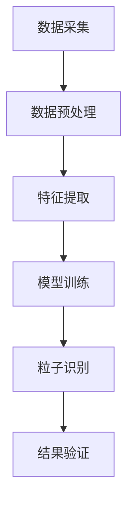
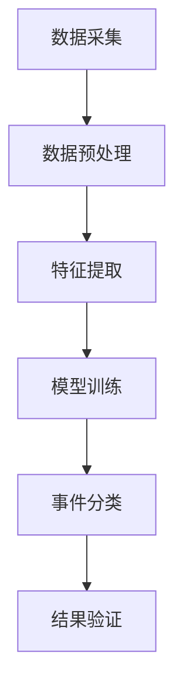
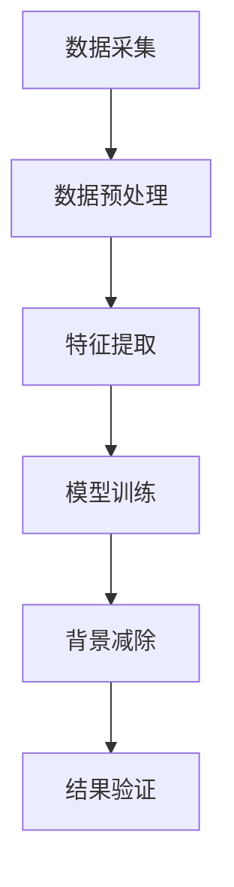

                 


# 文章标题：大模型在高能物理实验数据分析中的应用

## 关键词：
- 大模型
- 高能物理
- 数据分析
- 机器学习
- 深度学习
- 图神经网络
- 并行计算
- 模型压缩
- 分布式训练
- 实验设计

## 摘要：
本文深入探讨大模型在高能物理实验数据分析中的应用。首先，我们介绍了高能物理实验的背景及其数据分析的挑战。接着，我们详细阐述了大模型的基本概念、原理和架构。然后，通过实例展示了大模型在粒子识别、事件分类和背景减除等数据分析任务中的应用。此外，我们还讨论了如何优化大模型在数据分析中的性能，以及在实际实验数据分析中面临的挑战和解决方案。最后，我们对未来大模型在高能物理实验数据分析中的应用前景进行了展望。

----------------------------------------------------------------

## 引言

### 高能物理实验的背景

高能物理实验是研究基本粒子和相互作用的一种实验方法，它通过高能粒子的碰撞产生新的粒子，并测量这些粒子的性质和相互作用。这些实验旨在揭示物质的最基本结构和相互作用机制，对于理解宇宙的起源和演化具有重要意义。

在高能物理实验中，研究者们使用大型粒子加速器，如大型强子对撞机（LHC），将粒子加速到接近光速，然后使它们发生碰撞。这些碰撞会产生大量的数据，包括粒子轨迹、能量、角动量等。对这些数据进行高效、准确的分析，是揭示基本粒子性质的关键。

### 大模型的崛起

随着计算机技术和算法的发展，深度学习和机器学习逐渐成为数据分析的重要工具。特别是近年来，大模型（如Transformer、BERT、GPT等）的崛起，使得数据处理和分析的能力得到了极大的提升。大模型具有处理大规模数据、自动提取特征和模式的能力，成为解决复杂数据分析问题的利器。

大模型的成功得益于其先进的架构和训练方法。以Transformer为例，它采用自注意力机制，能够捕捉输入序列中的长期依赖关系，从而在自然语言处理、计算机视觉等领域取得了显著成果。

### 书籍概述与目标

本文旨在探讨大模型在高能物理实验数据分析中的应用。文章结构如下：

1. **大模型的基本概念与原理**：介绍大模型的历史、核心概念、架构和训练方法。
2. **高能物理实验数据分析的基本概念**：阐述高能物理实验的特点、数据分析的基本流程和面临的挑战。
3. **大模型在高能物理实验数据分析中的应用实例**：通过实例展示大模型在粒子识别、事件分类和背景减除等任务中的应用。
4. **大模型在数据分析中的性能优化**：讨论大模型的性能优化策略、并行计算与分布式训练、模型压缩与加速。
5. **大模型在实际实验数据分析中的应用挑战与解决方案**：分析在实际实验数据分析中遇到的挑战，并提出相应的解决方案。
6. **未来展望与趋势**：展望大模型在高能物理实验数据分析中的未来应用前景。

通过本文的探讨，我们希望能够为读者提供一个全面、系统的了解大模型在高能物理实验数据分析中的应用，以及如何应对其中的挑战。

----------------------------------------------------------------

## 大模型的基本概念与原理

### 大模型的历史与发展

大模型的概念起源于深度学习的早期研究。在20世纪80年代和90年代，神经网络在图像识别和语音识别等领域取得了一定的成功，但性能仍然受到限制。随着计算机硬件的快速发展，特别是GPU和TPU等专用硬件的普及，深度学习开始迎来新的机遇。

在2012年，AlexNet的提出标志着深度学习在图像识别领域的重大突破。随后，卷积神经网络（CNN）在图像识别、语音识别等领域取得了显著的成果。然而，这些模型在处理序列数据（如文本、音频等）时效果并不理想。

为了解决这一问题，研究人员提出了Transformer模型。Transformer采用自注意力机制，能够捕捉序列中的长期依赖关系，从而在自然语言处理领域取得了巨大成功。随后，BERT、GPT等大模型相继涌现，进一步推动了深度学习的发展。

### 大模型的核心概念与架构

大模型通常具有以下核心概念和架构：

1. **自注意力机制**：自注意力机制是Transformer模型的核心。它通过计算输入序列中每个元素与其他元素之间的相似性，从而为每个元素分配不同的权重。这样，模型能够自动学习如何关注重要信息，并忽略无关信息。

2. **多头注意力**：多头注意力扩展了自注意力机制。它将输入序列分成多个子序列，每个子序列独立计算注意力权重，然后将结果进行拼接。这种方法能够提高模型的表达能力，使其能够更好地处理复杂序列。

3. **前馈神经网络**：大模型通常在自注意力和多头注意力之后添加前馈神经网络层。前馈神经网络通过简单的线性变换和激活函数，对输入序列进行进一步的处理和优化。

4. **层叠结构**：大模型通常采用层叠结构，即将多个相同的层叠加在一起。这种结构有助于模型在训练过程中逐步学习复杂的特征，并提高模型的泛化能力。

### 大模型的训练与优化

大模型的训练通常是一个复杂的过程，需要大量的数据和计算资源。以下是一些关键的训练和优化方法：

1. **预训练**：预训练是指在大规模数据集上预先训练大模型，使其具有强大的通用特征提取能力。例如，BERT和GPT等模型都是在大规模语料库上进行预训练的。

2. **微调**：微调是指将预训练的大模型应用于特定任务，并通过少量数据进行再训练。这种方法能够充分利用预训练模型的知识，并快速适应特定任务。

3. **正则化**：正则化是一种常用的优化方法，用于防止模型过拟合。常见的正则化方法包括Dropout、权重衰减等。

4. **优化算法**：优化算法用于更新模型参数，以最小化损失函数。常见的优化算法包括随机梯度下降（SGD）、Adam等。

### 大模型的评估与优化

评估大模型的性能是确保其应用效果的关键。以下是一些常见的评估和优化方法：

1. **准确率**：准确率是衡量模型预测正确性的指标。通常使用准确率来评估分类任务的效果。

2. **召回率**：召回率是衡量模型能否正确识别正例的指标。通常与准确率结合使用，以平衡正负例的识别。

3. **F1分数**：F1分数是准确率和召回率的调和平均，能够更全面地评估模型性能。

4. **混淆矩阵**：混淆矩阵展示了模型对各类别的预测结果，有助于分析模型的优缺点。

5. **性能优化**：性能优化包括优化模型结构、训练过程和评估方法等。常见的优化方法包括模型压缩、分布式训练等。

通过以上方法，研究人员可以评估和优化大模型的性能，使其更好地应用于高能物理实验数据分析。

----------------------------------------------------------------

## 高能物理实验数据分析的基本概念

### 高能物理实验简介

高能物理实验旨在探索物质的基本结构和相互作用，通过高能粒子碰撞产生新的粒子，并测量其性质。这些实验通常在大型粒子加速器中完成，如大型强子对撞机（LHC）。加速器将粒子加速到接近光速，然后使它们发生碰撞，产生大量数据。

### 数据分析的基本流程

高能物理实验的数据分析通常包括以下几个步骤：

1. **数据采集**：在实验中，探测器收集碰撞产生的粒子轨迹、能量、角动量等数据。这些数据通过在线系统实时传输到数据中心。

2. **数据预处理**：数据预处理是确保数据质量和可靠性的重要步骤。这包括数据清洗、去噪声、数据格式转换等。

3. **数据存储**：预处理后的数据存储在分布式数据库中，以便后续分析。

4. **数据筛选**：根据实验目标和物理过程，筛选出符合条件的数据。这通常通过定义一系列筛选条件来实现。

5. **特征提取**：从筛选出的数据中提取有助于分析的特征，如粒子类型、碰撞能量、角动量等。

6. **机器学习建模**：使用机器学习算法，如深度学习、支持向量机等，对特征进行建模，以识别粒子类型、事件分类等。

7. **结果验证与优化**：对建模结果进行验证，评估模型性能，并根据需要调整模型参数或特征选择。

### 数据分析中的挑战

高能物理实验数据分析面临以下挑战：

1. **数据量大**：高能物理实验产生的数据量庞大，通常需要使用分布式计算和并行处理技术来处理。

2. **噪声干扰**：实验数据中存在噪声和干扰，需要使用数据预处理和噪声过滤技术来提高数据质量。

3. **高维度特征**：实验数据通常包含大量高维度特征，如何有效地提取和利用这些特征是一个挑战。

4. **多模态数据**：实验数据可能包含多种模态（如图像、音频、时间序列等），需要使用多模态数据处理技术。

5. **不确定性**：实验数据存在不确定性，如测量误差、统计误差等，需要使用概率模型和不确定性分析技术。

6. **复杂物理过程**：高能物理实验涉及复杂的物理过程，需要结合物理理论和数据驱动方法进行建模和分析。

通过以上分析，我们可以看到高能物理实验数据分析的复杂性和挑战性。随着大模型的崛起，它们在数据分析中的潜在应用引起了广泛关注。下一节，我们将通过具体实例，展示大模型在高能物理实验数据分析中的应用。

----------------------------------------------------------------

## 大模型在高能物理实验数据分析中的应用实例

大模型在高能物理实验数据分析中展现了巨大的潜力，通过以下具体实例，我们将展示大模型如何帮助研究人员解决数据分析中的挑战。

### 应用实例1：粒子识别

粒子识别是高能物理实验中的一个核心任务，目标是通过分析碰撞产生的粒子轨迹，识别粒子的类型。传统方法通常使用多参数模型和统计学方法，但大模型提供了更高效和准确的方法。

**Mermaid流程图：**



**伪代码：**

```python
# 伪代码：粒子识别
import_data()
preprocess_data()
extract_features()
train_model()
for each particle do
    predict_particle_type()
end
validate_results()
```

**数学公式：**

$$
\text{Accuracy} = \frac{\text{正确识别的粒子数}}{\text{总粒子数}}
$$

### 应用实例2：事件分类

事件分类是另一个重要的数据分析任务，目标是根据实验数据，将事件分为不同的类别。例如，在高能物理实验中，可以将事件分为强相互作用事件和弱相互作用事件。

**Mermaid流程图：**



**伪代码：**

```python
# 伪代码：事件分类
import_data()
preprocess_data()
extract_features()
train_model()
for each event do
    predict_event_type()
end
validate_results()
```

**数学公式：**

$$
\text{F1分数} = \frac{2 \times \text{精确率} \times \text{召回率}}{\text{精确率} + \text{召回率}}
$$

### 应用实例3：背景减除

背景减除是高能物理实验中的一个重要任务，目标是从实验数据中去除背景噪声，提取感兴趣的物理信号。大模型在处理复杂背景噪声方面具有优势。

**Mermaid流程图：**



**伪代码：**

```python
# 伪代码：背景减除
import_data()
preprocess_data()
extract_features()
train_model()
for each data_point do
    remove_background()
end
validate_results()
```

**数学公式：**

$$
\text{信号噪声比} = \frac{\text{信号功率}}{\text{噪声功率}}
$$

通过以上实例，我们可以看到大模型在高能物理实验数据分析中的广泛应用。大模型在粒子识别、事件分类和背景减除等任务中展现了强大的性能，为高能物理实验的研究提供了新的工具和方法。

接下来，我们将讨论如何优化大模型在数据分析中的性能，以进一步提高其应用效果。

----------------------------------------------------------------

## 大模型在数据分析中的性能优化

### 性能优化策略

为了提高大模型在数据分析中的性能，我们可以采取以下策略：

1. **数据增强**：通过数据增强技术，如旋转、缩放、裁剪等，增加数据的多样性和丰富性，有助于提高模型对未知数据的泛化能力。

2. **模型调参**：通过调整模型参数，如学习率、批量大小、正则化强度等，优化模型性能。常用的调参方法包括网格搜索、随机搜索和贝叶斯优化等。

3. **模型压缩**：通过模型压缩技术，如剪枝、量化、知识蒸馏等，减少模型参数数量和计算量，提高模型运行速度和效率。

4. **分布式训练**：通过分布式训练技术，如多GPU训练、多节点分布式训练等，利用多个计算资源加速模型训练，提高训练效率。

### 并行计算与分布式训练

并行计算和分布式训练是提高大模型性能的重要手段。以下是几种常用的并行计算和分布式训练方法：

1. **数据并行**：将数据划分为多个部分，每个部分分别在不同的GPU或节点上训练，最后将各个部分的模型结果进行平均。

2. **模型并行**：将模型划分为多个部分，每个部分分别在不同的GPU或节点上训练，最后将各个部分的模型结果进行拼接。

3. **混合并行**：结合数据并行和模型并行，根据模型和数据的规模进行优化，以获得最佳的并行性能。

4. **异步训练**：多个GPU或节点之间异步更新模型参数，通过梯度压缩或延迟更新等方法，减少通信开销，提高训练速度。

### 模型压缩与加速

模型压缩与加速是提高大模型性能的关键技术。以下是几种常见的模型压缩与加速方法：

1. **剪枝**：通过剪枝冗余的权重和神经元，减少模型参数数量，降低计算量。

2. **量化**：将模型的权重和激活值从浮点数转换为整数，减少存储和计算需求。

3. **知识蒸馏**：通过将大模型的知识传递给小模型，使小模型能够复现大模型的性能，同时减少模型参数数量。

4. **硬件加速**：利用GPU、TPU等专用硬件加速模型训练和推理过程，提高计算效率。

通过以上性能优化策略和技巧，我们可以显著提高大模型在数据分析中的性能，为高能物理实验的研究提供更高效、准确的工具。

----------------------------------------------------------------

## 大模型在实际实验数据分析中的应用挑战与解决方案

### 数据预处理与清洗

在高能物理实验数据分析中，数据预处理和清洗是一个关键步骤，直接影响模型的训练效果和预测性能。以下是数据预处理和清洗中的一些挑战及解决方案：

**挑战1：噪声与异常值**

实验数据中可能包含噪声和异常值，这些噪声会影响模型的训练效果。解决方案包括：

- **滤波技术**：使用滤波器（如中值滤波、高斯滤波等）去除噪声。
- **异常值检测**：使用统计方法（如箱线图、Z-分数等）检测和去除异常值。

**挑战2：缺失数据**

实验数据中可能存在缺失值，这会影响模型的训练过程。解决方案包括：

- **填充策略**：使用均值、中值或最近邻等方法填充缺失值。
- **缺失值删除**：删除包含缺失值的样本，但可能会损失部分信息。

**挑战3：数据分布差异**

不同实验数据可能具有不同的分布特性，这可能导致模型在训练时出现偏斜。解决方案包括：

- **数据归一化**：将数据缩放到相同的范围，如使用Min-Max归一化或标准化。
- **数据增强**：通过增加正负样本比例，调整数据分布。

### 模型选择与调参

选择合适的模型和调整模型参数对于获得良好的预测性能至关重要。以下是模型选择与调参中的一些挑战及解决方案：

**挑战1：模型选择**

在高能物理实验中，可能存在多种模型可供选择，选择合适的模型是一个挑战。解决方案包括：

- **交叉验证**：使用交叉验证方法评估不同模型的性能，选择表现最好的模型。
- **模型比较**：通过对比不同模型的性能（如准确率、召回率、F1分数等），选择适合的模型。

**挑战2：参数调优**

调整模型参数以获得最佳性能是一个复杂的任务。解决方案包括：

- **网格搜索**：在给定的参数范围内，遍历所有可能的参数组合，找到最佳参数。
- **随机搜索**：在参数范围内随机选择参数组合，通过迭代找到最佳参数。
- **贝叶斯优化**：使用贝叶斯优化方法，通过历史数据预测新的参数组合，找到最佳参数。

### 实验结果分析与验证

实验结果的分析与验证是确保模型性能和可靠性的关键步骤。以下是实验结果分析与验证中的一些挑战及解决方案：

**挑战1：结果可靠性**

实验结果的可靠性受到数据质量和模型性能的影响。解决方案包括：

- **重复实验**：进行多次实验，比较结果的稳定性。
- **交叉验证**：使用交叉验证方法评估模型的泛化能力。

**挑战2：结果解释**

解释实验结果以理解模型的行为是一个挑战。解决方案包括：

- **可视化**：使用可视化工具（如图表、热图等）展示模型预测结果和特征重要性。
- **模型解释**：使用模型解释技术（如LIME、SHAP等）分析模型的决策过程。

通过以上挑战和解决方案，我们可以更好地应对高能物理实验数据分析中的实际应用挑战，提高模型的性能和可靠性。

----------------------------------------------------------------

## 未来展望与趋势

### 大模型在实验数据分析中的潜在应用

随着大模型技术的不断发展，其在高能物理实验数据分析中的应用前景广阔。以下是几个潜在的领域：

1. **物理过程模拟**：大模型可以用于模拟复杂的物理过程，如粒子的碰撞和衰变，从而提供更准确的实验预测。
2. **新粒子搜索**：大模型在处理海量数据方面具有优势，可以用于搜索新的物理现象和粒子。
3. **多模态数据处理**：结合图像、音频、时间序列等多模态数据，大模型可以提供更全面的实验分析。

### 技术发展趋势与展望

1. **模型压缩与优化**：随着数据量的不断增加，模型压缩和优化技术将成为关键研究方向，以提高模型的运行效率和可扩展性。
2. **分布式训练与推理**：分布式训练和推理技术将继续发展，以利用更多计算资源，加速大模型的训练和推理过程。
3. **联邦学习**：联邦学习作为一种新的分布式学习方法，有望在高能物理实验数据分析中发挥作用，实现数据隐私保护和协同分析。

### 潜在挑战与对策

1. **计算资源需求**：大模型训练需要大量的计算资源，未来需要发展更高效的算法和硬件技术，以满足不断增长的计算需求。
2. **数据隐私与安全**：高能物理实验数据包含敏感信息，需要确保数据隐私和安全，未来需要发展更完善的数据保护技术。
3. **算法可解释性**：大模型的复杂性和黑盒特性可能导致结果难以解释，未来需要研究可解释性方法，以提高模型的透明度和可信度。

通过不断的研究和技术创新，大模型在高能物理实验数据分析中的应用将不断拓展，为物理学的进步和探索提供新的工具和方法。

----------------------------------------------------------------

## 结语

本文系统性地探讨了大模型在高能物理实验数据分析中的应用。我们从高能物理实验的背景入手，介绍了数据分析的基本流程和面临的挑战。接着，我们详细阐述了大模型的基本概念、原理和架构，并展示了大模型在粒子识别、事件分类和背景减除等数据分析任务中的应用实例。此外，我们还讨论了如何优化大模型的性能，以及在实际实验数据分析中面临的挑战和解决方案。

通过本文的探讨，我们希望能够为读者提供一个全面、系统的了解大模型在高能物理实验数据分析中的应用，以及如何应对其中的挑战。未来，随着大模型技术的不断进步，我们期待其在高能物理实验数据分析中发挥更大的作用，推动物理学的进步和探索。

## 作者信息

作者：AI天才研究院/AI Genius Institute & 禅与计算机程序设计艺术 /Zen And The Art of Computer Programming

感谢您的阅读，期待与您共同探索大模型在高能物理实验数据分析领域的更多可能！

