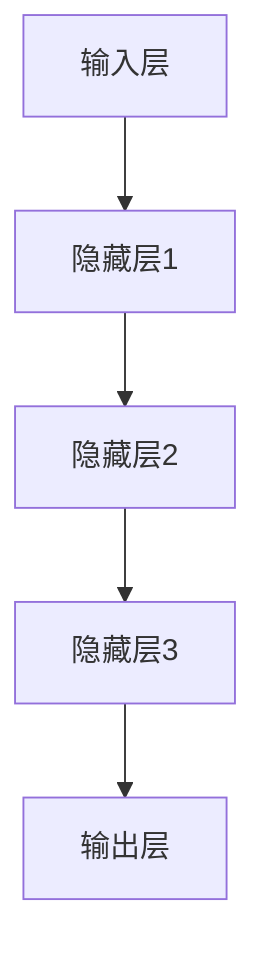

                 


# 《大模型时代的软件架构新思维》

> 关键词：大模型、软件架构、人工智能、深度学习、算法、数学模型

> 摘要：本文将探讨大模型时代下的软件架构新思维。随着人工智能和深度学习的快速发展，大模型在各个领域展现出了巨大的潜力。本文将从大模型的基础知识、核心算法原理、应用实践等方面，深入分析大模型时代的软件架构新思维，为开发者提供有益的指导。

## 引言

### 大模型时代背景

近年来，人工智能和深度学习取得了飞速的发展，大模型技术逐渐成为学术界和工业界的关注焦点。大模型指的是具有巨大参数量和训练数据量的神经网络模型，这些模型在自然语言处理、计算机视觉、语音识别等领域取得了显著的成果。例如，GPT-3拥有超过1750亿个参数，ImageNet数据库包含了超过1400万个标注图像，这些数据量和参数量的大幅增长，推动了人工智能技术的不断突破。

### 人工智能与软件架构的关系

人工智能技术的发展离不开软件架构的支持。传统的软件架构设计主要是基于功能模块化和模块之间的松耦合原则，而人工智能引入了新的挑战，如数据处理的高复杂性、计算资源的高需求等。因此，软件架构也需要适应人工智能的发展，从传统的功能驱动转向数据驱动，更加注重分布式计算和协同工作。

### 大模型的发展趋势

随着数据量的增加和计算能力的提升，大模型的发展趋势体现在以下几个方面：

1. **模型参数规模的增加**：为了提高模型的表达能力，研究者不断尝试增加模型的参数规模，从千亿参数到万亿参数的模型逐渐成为可能。
2. **多模态融合**：大模型不仅能在单一领域表现出色，还具备多模态融合的能力，如图文识别、语音识别与自然语言处理等跨领域的应用。
3. **自动机器学习（AutoML）**：自动机器学习技术可以帮助自动化大模型的训练和调优，降低人力成本，提高模型性能。

## 大模型基础

### 大模型定义与分类

大模型是指具有巨大参数量和训练数据量的神经网络模型。根据不同的应用场景和数据类型，大模型可以分为以下几类：

1. **自然语言处理（NLP）模型**：如GPT、BERT等，主要用于处理文本数据。
2. **计算机视觉（CV）模型**：如ResNet、Inception等，主要用于图像和视频数据的处理。
3. **语音识别（ASR）模型**：如WaveNet、Convolutive Neural Networks（CNNs）等，主要用于语音数据的处理。
4. **多模态模型**：如ViT、Gatari等，能够同时处理图像和文本数据，实现跨模态的信息融合。

### 大模型工作原理

大模型的工作原理主要基于深度学习的框架。深度学习是一种基于多层神经网络的学习方法，通过逐层提取特征，实现从原始数据到高级抽象表示的转换。

1. **前向传播（Forward Propagation）**：输入数据通过网络中的多层神经元，每层神经元对输入数据进行加权求和，并应用激活函数进行非线性变换。
2. **反向传播（Back Propagation）**：利用梯度下降算法，通过反向传播计算网络参数的梯度，更新网络参数，优化模型性能。
3. **训练与验证**：使用训练数据对模型进行训练，通过验证数据评估模型性能，不断调整模型参数，直到达到满意的性能水平。

### 大模型架构分析

大模型的架构主要包括以下几个部分：

1. **输入层（Input Layer）**：接收外部输入数据，如文本、图像、语音等。
2. **隐藏层（Hidden Layers）**：对输入数据进行特征提取和变换，隐藏层可以有多层。
3. **输出层（Output Layer）**：产生最终预测结果，如分类结果、生成文本等。

以下是使用Mermaid绘制的简化的神经网络架构图：



## 大模型算法原理讲解

### 算法概述

大模型的算法主要基于深度学习的框架，包括以下几种：

1. **卷积神经网络（CNN）**：适用于图像处理任务。
2. **循环神经网络（RNN）**：适用于序列数据处理任务，如自然语言处理。
3. **变换器（Transformer）**：适用于自然语言处理任务，尤其是序列到序列的翻译任务。

### 算法原理讲解

以变换器（Transformer）为例，其算法原理如下：

1. **自注意力机制（Self-Attention）**：自注意力机制允许模型在序列中的每个位置计算其对于其他所有位置的权重，从而实现对序列的全局上下文信息进行建模。
2. **前馈网络（Feedforward Network）**：在自注意力机制的基础上，每个位置还通过两个全连接层进行非线性变换。
3. **多头注意力（Multi-Head Attention）**：多头注意力允许模型同时关注序列中的不同部分，提高模型的表示能力。

以下是变换器的伪代码：

```python
def transformer(input_sequence):
    # 输入序列进行嵌入操作
    embedded_sequence = embedding(input_sequence)

    # 多头自注意力机制
    attention_scores = multi_head_attention(embedded_sequence)

    # 前馈网络
    feedforward_output = feedforward_network(attention_scores)

    # 输出层
    output = output_layer(feedforward_output)

    return output
```

### 算法优缺点分析

变换器具有以下优点：

1. **并行计算**：变换器的设计使得其可以并行计算，提高了计算效率。
2. **强表示能力**：多头注意力机制使得模型可以关注序列中的不同部分，提高模型的表示能力。
3. **适应多种任务**：变换器可以应用于多种序列处理任务，如机器翻译、文本生成等。

变换器也存在一些缺点：

1. **计算资源需求高**：由于变换器包含大量的矩阵乘法和非线性变换，计算资源需求较高。
2. **训练时间较长**：大模型的训练时间较长，需要大量的计算资源和时间。

## 大模型在软件架构中的应用

### 大模型在软件架构中的作用

大模型在软件架构中的应用，主要体现在以下几个方面：

1. **增强智能化**：大模型可以处理复杂的任务，提高软件的智能化水平。
2. **优化软件设计**：大模型可以帮助开发者自动生成代码、优化算法，提高软件设计效率。
3. **提升用户体验**：通过大模型的应用，软件可以更好地理解用户需求，提供个性化的服务。

### 应用案例分析

#### 案例一：大模型在自然语言处理中的应用

自然语言处理是人工智能的一个重要分支，大模型在自然语言处理领域具有广泛的应用。例如，BERT（Bidirectional Encoder Representations from Transformers）模型在文本分类、问答系统等领域取得了显著的成果。

BERT模型的工作原理如下：

1. **双向编码**：BERT模型通过双向变换器网络，对输入文本进行编码，使其能够理解文本的上下文信息。
2. **预训练与微调**：BERT模型在大量文本语料上进行预训练，然后针对具体任务进行微调，提高模型在特定任务上的性能。

BERT模型的伪代码如下：

```python
def bert(input_sequence):
    # 输入序列进行嵌入操作
    embedded_sequence = embedding(input_sequence)

    # 双向编码
    encoded_sequence = bidirectional_transformer(embedded_sequence)

    # 输出层
    output = output_layer(encoded_sequence)

    return output
```

#### 案例二：大模型在计算机视觉中的应用

计算机视觉是另一个广泛应用人工智能的领域，大模型在计算机视觉中也有重要的作用。例如，ResNet（Residual Network）模型在图像分类、目标检测等领域取得了突破性的成果。

ResNet模型的工作原理如下：

1. **残差连接**：ResNet模型引入了残差连接，通过跳过一部分网络层，使得网络可以学习到更复杂的特征。
2. **深度网络**：ResNet模型通过增加网络的深度，提高了模型的表达能力。

ResNet模型的伪代码如下：

```python
def resnet(input_image):
    # 输入图像进行预处理
    preprocessed_image = preprocess_image(input_image)

    # 残差块
    residual_block_output = residual_block(preprocessed_image)

    # 主网络
    main_network_output = main_network(residual_block_output)

    # 输出层
    output = output_layer(main_network_output)

    return output
```

## 大模型时代的软件架构设计

### 软件架构设计原则

在大模型时代，软件架构设计需要遵循以下原则：

1. **可扩展性**：软件架构应能够适应不断增长的数据规模和模型复杂性。
2. **可维护性**：软件架构应便于维护和更新，以适应技术发展和业务需求的变化。
3. **可靠性**：软件架构应具备高可靠性，确保模型训练和预测过程的稳定性。

### 架构设计方法

在大模型时代，常见的软件架构设计方法包括：

1. **微服务架构**：将大模型应用拆分为多个微服务，提高系统的可扩展性和可维护性。
2. **分布式架构**：通过分布式计算，充分利用集群资源，提高模型训练和预测的效率。
3. **容器化与自动化部署**：使用容器化和自动化部署技术，简化大模型应用的部署和管理。

## 大模型时代的安全与隐私

### 大模型安全挑战

在大模型时代，安全挑战主要体现在以下几个方面：

1. **数据安全**：大模型训练需要大量的数据，如何保护这些数据的安全成为一个重要问题。
2. **模型安全**：大模型可能会受到攻击，如对抗性攻击、模型窃取等。
3. **隐私保护**：在处理敏感数据时，如何保护用户隐私是一个关键问题。

### 隐私保护策略

为了保护用户隐私，可以采取以下策略：

1. **加密与匿名化**：对敏感数据进行加密和匿名化处理，防止数据泄露。
2. **数据隐私法律与规范**：遵守相关的数据隐私法律和规范，确保数据处理符合法律要求。

## 大模型时代的开发实践

### 开发流程与工具

在大模型时代，开发流程主要包括以下步骤：

1. **需求分析**：明确大模型应用的需求和目标。
2. **数据准备**：收集和处理训练数据，确保数据的质量和多样性。
3. **模型设计**：根据应用场景选择合适的模型结构和算法。
4. **模型训练**：使用训练数据训练模型，调整模型参数。
5. **模型评估**：使用验证数据评估模型性能，调整模型参数。
6. **模型部署**：将训练好的模型部署到生产环境。

常见的开发工具包括：

1. **深度学习框架**：如TensorFlow、PyTorch等，用于模型设计和训练。
2. **数据预处理工具**：如Pandas、NumPy等，用于数据处理和清洗。
3. **模型评估工具**：如Scikit-learn、Matplotlib等，用于模型性能评估和可视化。

### 实践案例

#### 案例一：大模型在电子商务中的应用

电子商务平台可以利用大模型进行商品推荐、用户行为分析等任务。例如，使用GPT模型对用户评论进行情感分析，从而为用户提供更个性化的推荐。

#### 案例二：大模型在金融科技中的应用

金融科技公司可以利用大模型进行信用评估、风险控制等任务。例如，使用Transformer模型对用户的信用记录进行分析，从而为用户提供更准确的信用评分。

## 附录

### 附录A：大模型常用工具介绍

1. **深度学习框架**：如TensorFlow、PyTorch、Keras等。
2. **模型训练工具**：如CUDA、GPU开源库等。

### 附录B：参考资料与进一步阅读

1. **相关书籍**：《深度学习》、《强化学习基础教程》等。
2. **学术论文**：《Attention Is All You Need》、《BERT: Pre-training of Deep Bidirectional Transformers for Language Understanding》等。
3. **开源项目**：TensorFlow、PyTorch等。

## 作者信息

作者：AI天才研究院/AI Genius Institute & 禅与计算机程序设计艺术/Zen And The Art of Computer Programming

## 小结

大模型时代的到来，为软件架构带来了新的挑战和机遇。本文从大模型的基础知识、算法原理、应用实践等方面，深入分析了大模型时代的软件架构新思维。开发者需要不断学习和适应新技术，以应对大模型时代带来的变革。同时，我们也需要关注大模型时代的安全与隐私问题，确保技术的可持续发展。

## 注意事项

1. **数据安全**：在大模型训练和应用过程中，务必确保数据的安全。
2. **模型解释性**：大模型的决策过程往往缺乏解释性，开发者需要关注模型的可解释性。
3. **资源管理**：大模型训练和部署需要大量的计算资源，合理管理资源至关重要。

## 拓展阅读

1. **《大规模机器学习》**：深入探讨大规模机器学习的方法和技术。
2. **《深度学习中的数学》**：详细讲解深度学习中的数学原理和公式。

