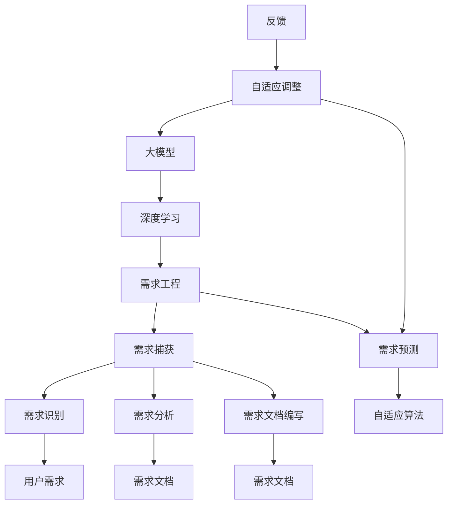

                 

## 文章标题

《大模型时代的软件需求捕获新方法》

## 关键词

- 大模型
- 软件需求捕获
- 深度学习
- 人工智能
- 需求工程
- 自适应算法

## 摘要

随着人工智能技术的迅猛发展，大模型（如大型深度神经网络）在各个领域展现了其强大的能力。本文旨在探讨大模型在软件需求捕获领域的新方法，分析其背景、核心概念、算法原理，并通过实际案例展示其应用效果。本文将详细讲解大模型如何通过自动化分析和预测，提高软件需求捕获的效率和准确性，从而为需求工程领域带来一场革命。文章还将展望大模型在需求捕获领域的未来发展趋势，为从业者提供宝贵的参考和启示。

---

## 引言

在软件工程中，需求捕获是一个至关重要的阶段。它决定了软件系统能否满足用户的需求和预期，直接影响到项目的成功与否。然而，传统的需求捕获方法往往存在一些问题，如需求理解偏差、需求变更频繁、需求文档不完整等。这些问题不仅增加了项目成本，还延长了项目周期，甚至可能导致项目的失败。

随着人工智能技术的崛起，特别是深度学习和大模型技术的发展，需求捕获领域迎来了新的机遇。大模型能够处理海量数据，具备强大的自学习能力，能够在复杂的场景中提取有用的信息。因此，利用大模型进行软件需求捕获成为一种新的趋势。本文将探讨大模型在需求捕获中的应用，分析其原理、方法和实际效果，为软件工程领域带来新的启示。

### 背景介绍

软件需求捕获是软件工程中的一个关键阶段，它涉及识别、分析和记录用户需求的过程。传统需求捕获方法主要依赖于需求工程师与用户的直接交流，通过访谈、问卷调查和文档编写等方式来获取需求信息。然而，这种方法存在几个显著的局限性：

1. **人力成本高**：需求工程师需要大量时间和精力与用户沟通，获取和记录需求信息。
2. **需求理解偏差**：需求工程师可能对用户需求的理解存在偏差，导致需求文档与实际用户需求不一致。
3. **需求变更频繁**：软件项目在开发过程中，用户需求往往会发生频繁的变更，这对项目的进度和成本控制提出了挑战。
4. **需求文档不完整**：由于需求获取和记录的方法有限，需求文档往往存在不完整、不清晰的问题，这可能导致开发团队在实现过程中产生误解和错误。

为了解决这些问题，研究人员和工程师们一直在探索新的需求捕获方法。传统的需求捕获方法主要包括以下几种：

1. **面向需求的软件开发方法**：这种方法强调在软件开发过程中，始终围绕用户需求进行设计和实现。常见的面向需求的软件开发方法包括需求驱动开发（Requirements Driven Development，RDD）和敏捷开发（Agile Development）等。

2. **面向用户的软件开发方法**：这种方法强调将用户置于软件开发的中心，通过用户体验设计（User Experience Design，UXD）和用户故事（User Story）等技术手段，直接获取用户的需求和反馈。

尽管这些传统方法在一定程度上缓解了需求捕获的问题，但在面对复杂和动态变化的软件项目时，仍然存在显著的局限性。例如，需求驱动开发方法虽然强调需求的优先级，但在实际操作中，往往难以准确预测需求的变化，导致项目进度和成本的控制难度增加。敏捷开发方法虽然强调快速迭代和用户反馈，但在需求初期阶段，仍需要大量时间和资源进行需求分析和文档编写。

随着人工智能技术的迅速发展，特别是深度学习和大模型技术的突破，需求捕获领域迎来了新的契机。大模型具有处理海量数据、自动学习和自适应调整的能力，能够从复杂的用户行为和需求数据中提取有价值的信息。这使得大模型在需求捕获中具有独特的优势：

1. **自动化分析**：大模型能够自动分析和处理用户行为数据，识别用户的需求和偏好，减少对人工分析和理解的依赖。

2. **自适应调整**：大模型能够根据项目进展和用户反馈，自适应调整需求捕获的方法和策略，提高需求的准确性和完整性。

3. **预测能力**：大模型能够通过历史数据分析和趋势预测，提前识别潜在的需求变更和风险，帮助项目团队提前做好应对准备。

总之，大模型在需求捕获中的应用不仅能够提高需求的准确性和效率，还能降低项目成本和风险，为软件工程领域带来新的变革。本文将深入探讨大模型在需求捕获中的应用原理和方法，为实际项目提供有益的参考。

### 核心概念与联系

在探讨大模型在需求捕获中的应用时，首先需要了解几个核心概念及其相互之间的关系。以下是几个关键概念及其定义：

1. **大模型**：大模型是指具有极高参数量、能够处理海量数据的深度学习模型。例如，Transformer模型和BERT模型就是典型的大模型。

2. **深度学习**：深度学习是一种人工智能的子领域，它通过模拟人脑神经网络的结构和功能，对数据进行自动分析和学习。大模型是深度学习的一个重要分支。

3. **需求工程**：需求工程是软件工程的一个分支，专注于软件需求的识别、分析和管理。需求捕获是需求工程中的一个核心环节。

4. **需求捕获**：需求捕获是指从用户、市场或其他来源中获取软件需求的过程。它包括需求识别、需求分析和需求文档编写等步骤。

5. **需求预测**：需求预测是指利用历史数据和分析模型，对未来的需求趋势进行预测的过程。需求预测有助于提前识别潜在的需求变更和风险。

6. **自适应算法**：自适应算法是指能够根据环境变化和反馈调整自身行为和策略的算法。在大模型应用中，自适应算法有助于提高需求捕获的准确性和效率。

下面，我们将使用Mermaid流程图来展示这些概念之间的相互关系：



在这个流程图中，大模型作为核心，通过深度学习与需求工程紧密相连。需求捕获过程包括需求识别、需求分析和需求文档编写，而需求预测则通过历史数据分析和自适应算法来实现。此外，反馈机制不断调整大模型和需求预测策略，以实现更准确的需求捕获。

通过这个流程图，我们可以清晰地看到大模型在需求捕获中的整体架构，以及各个关键概念之间的相互作用。这为后续详细探讨大模型在需求捕获中的应用提供了基础。

### 大模型在需求捕获中的应用

大模型在需求捕获中的应用主要体现在自动化分析和预测两个方面。以下将详细介绍大模型在这两个方面的应用原理和方法。

#### 自动化分析

自动化分析是指利用大模型的强大数据处理能力，从大量的用户行为数据中提取有价值的信息，从而自动识别用户的需求和偏好。这种方法能够显著减少对人工分析和理解的依赖，提高需求捕获的效率和准确性。

1. **用户行为数据收集**：首先，需要收集用户的各项行为数据，如点击记录、搜索历史、购买记录等。这些数据可以来源于用户日志、数据库记录等渠道。

2. **数据预处理**：在利用大模型进行需求分析之前，需要对数据进行预处理。预处理步骤包括数据清洗、数据去重、数据格式转换等，以确保数据的准确性和一致性。

3. **特征提取**：通过特征提取技术，将原始数据转换为适合输入大模型的特征向量。常用的特征提取方法包括词袋模型（Bag of Words）、TF-IDF（Term Frequency-Inverse Document Frequency）、词嵌入（Word Embedding）等。

4. **模型训练与优化**：使用收集到的数据集，通过监督学习或无监督学习的方式，训练大模型。训练过程中，需要不断调整模型的参数，以优化模型的性能。常用的模型包括卷积神经网络（CNN）、循环神经网络（RNN）、Transformer模型等。

5. **自动化分析**：经过训练的大模型可以自动分析用户行为数据，提取用户的需求和偏好。例如，通过分析用户的点击记录和搜索历史，可以识别用户的兴趣点和购买意图。

以下是一个简化的伪代码示例，展示了自动化分析的基本流程：

```python
# 伪代码：大模型自动化分析需求

# 数据收集
user_data = collect_user_data()

# 数据预处理
clean_data = preprocess_data(user_data)

# 特征提取
features = extract_features(clean_data)

# 模型训练
model = train_model(features)

# 自动化分析
需求 = model.predict(features)
```

#### 需求预测

需求预测是指利用大模型对未来的需求趋势进行预测，从而提前识别潜在的需求变更和风险。这种方法有助于项目团队提前做好准备，降低项目风险。

1. **历史数据收集**：收集项目的历史需求数据，包括需求提出时间、需求内容、需求实现时间等。

2. **数据预处理**：对历史数据进行预处理，包括数据清洗、格式统一等。

3. **特征提取**：提取与需求预测相关的特征，如需求提出时间间隔、需求内容关键词、需求实现时间等。

4. **模型训练与优化**：使用历史数据训练大模型，预测未来的需求趋势。训练过程中，需要不断调整模型参数，以提高预测的准确性。

5. **需求预测**：利用训练好的大模型，对未来的需求趋势进行预测。预测结果可以用于项目规划和风险管理。

以下是一个简化的伪代码示例，展示了需求预测的基本流程：

```python
# 伪代码：大模型需求预测

# 历史数据收集
historical_data = collect_historical_data()

# 数据预处理
clean_data = preprocess_data(historical_data)

# 特征提取
features = extract_features(clean_data)

# 模型训练
model = train_model(features)

# 需求预测
predicted_demand = model.predict(features)
```

通过自动化分析和需求预测，大模型能够显著提高软件需求捕获的效率和准确性。自动化分析能够快速识别用户的需求和偏好，需求预测则能够提前识别潜在的需求变更和风险。这些方法不仅能够降低项目成本和风险，还能提高项目的成功率。

### 深度学习在大模型中的应用

深度学习是构建大模型的核心技术，其强大的数据处理和分析能力使得大模型在需求捕获中得以广泛应用。以下将详细讨论深度学习在大模型中的应用原理和技术。

#### 神经网络

神经网络是深度学习的基础，其结构类似于人脑的神经元连接。神经网络通过多层节点（神经元）的层层传递和计算，实现从输入数据到输出数据的映射。在需求捕获中，神经网络可以用于特征提取、模式识别和预测。

1. **前向传播**：前向传播是神经网络的基本计算过程。输入数据通过网络的各层节点，经过权重和激活函数的计算，最终输出预测结果。前向传播的过程可以表示为：

   $$ 
   Z^{[l]} = W^{[l]}A^{[l-1]} + b^{[l]} 
   $$
   $$
   A^{[l]} = \sigma(Z^{[l]})
   $$

   其中，$A^{[l]}$表示第$l$层的输出，$Z^{[l]}$表示第$l$层的输入，$W^{[l]}$和$b^{[l]}$分别是第$l$层的权重和偏置，$\sigma$是激活函数。

2. **反向传播**：反向传播用于计算网络参数的梯度，以便进行模型训练。反向传播的过程包括以下几个步骤：

   - 计算误差：通过计算输出结果与实际结果之间的差异，得到误差。
   - 反向传播误差：将误差反向传播到网络的各层，计算各层权重和偏置的梯度。
   - 更新参数：根据梯度计算结果，更新网络的权重和偏置。

以下是一个简化的反向传播算法伪代码示例：

```python
# 伪代码：反向传播算法

# 计算误差
error = actual_output - predicted_output

# 反向传播误差
delta = error * activation_derivative(predicted_output)

# 更新参数
weight_gradient = delta * input_vector
bias_gradient = delta

weight -= learning_rate * weight_gradient
bias -= learning_rate * bias_gradient
```

#### 卷积神经网络（CNN）

卷积神经网络是处理图像数据的一种有效模型，其核心结构是卷积层和池化层。卷积层通过卷积操作提取图像特征，池化层则用于降低特征图的维度，提高计算效率。

1. **卷积层**：卷积层通过卷积操作提取图像特征。卷积操作可以表示为：

   $$
   f_{\sigma}(x) = \sum_{i=1}^{k} w_i \cdot x_i + b
   $$

   其中，$f_{\sigma}$是激活函数，$w_i$和$b$分别是权重和偏置，$x_i$是输入特征。

2. **池化层**：池化层用于降低特征图的维度，提高计算效率。常见的池化方法包括最大池化和平均池化。

以下是一个简化的卷积神经网络算法伪代码示例：

```python
# 伪代码：卷积神经网络

# 卷积层
for filter in filters:
    feature_map = convolve(input_image, filter)
    feature_map = activate(feature_map)

# 池化层
pooled_feature_map = pool(feature_map)

# 下一层输入
input = pooled_feature_map
```

#### 循环神经网络（RNN）

循环神经网络是处理序列数据的一种有效模型，其核心结构是隐藏状态和循环连接。RNN通过隐藏状态保留历史信息，从而实现对序列数据的建模。

1. **隐藏状态**：隐藏状态是RNN的核心组件，用于存储序列中的历史信息。隐藏状态可以通过递归关系更新：

   $$
   h_t = \sigma(W_h \cdot [h_{t-1}, x_t] + b_h)
   $$

   其中，$h_t$是当前时间步的隐藏状态，$x_t$是当前时间步的输入，$W_h$和$b_h$分别是权重和偏置，$\sigma$是激活函数。

2. **输出**：RNN的输出可以通过隐藏状态和输出层计算得到：

   $$
   y_t = \sigma(W_o \cdot h_t + b_o)
   $$

   其中，$y_t$是当前时间步的输出，$W_o$和$b_o$分别是权重和偏置，$\sigma$是激活函数。

以下是一个简化的循环神经网络算法伪代码示例：

```python
# 伪代码：循环神经网络

# 初始化隐藏状态
h = initialize_hidden_state()

# 循环处理序列
for x in sequence:
    h = update_hidden_state(h, x)
    y = generate_output(h)

# 输出结果
output = y
```

通过这些深度学习技术，大模型能够在需求捕获中实现自动化分析和预测。这些技术不仅提高了需求捕获的效率和准确性，还为需求工程领域带来了新的变革。在下一节中，我们将进一步探讨大模型在需求捕获中的具体实现和应用。

### 数学模型与算法原理

在探讨大模型在需求捕获中的应用时，理解其背后的数学模型和算法原理至关重要。以下将详细讲解大模型在需求捕获中的核心数学模型和算法原理，并通过具体的数学公式和伪代码进行阐述。

#### 需求捕获的数学模型

需求捕获过程中，大模型通常采用监督学习和无监督学习两种方式。监督学习用于从标注数据中学习需求特征，无监督学习则用于从未标注的数据中提取需求信息。以下分别介绍这两种学习方式的数学模型。

1. **监督学习**

   在监督学习中，大模型使用标注的数据集进行训练。标注数据包括输入特征和对应的输出需求。模型的目的是通过学习输入特征与需求之间的映射关系，实现对新数据的预测。

   **数学模型**：

   假设输入特征为 $X$，输出需求为 $Y$，则监督学习模型可以表示为：

   $$
   Y = f(X; \theta)
   $$

   其中，$f$ 是模型函数，$\theta$ 是模型参数。模型的目标是最小化预测误差：

   $$
   J(\theta) = \frac{1}{m} \sum_{i=1}^{m} (Y_i - f(X_i; \theta))^2
   $$

   **伪代码**：

   ```python
   # 伪代码：监督学习模型

   # 初始化参数 $\theta$
   theta = initialize_theta()

   # 训练模型
   for epoch in range(num_epochs):
       for x, y in dataset:
           prediction = f(x; theta)
           error = y - prediction
           theta = update_theta(theta, error)
   ```

2. **无监督学习**

   在无监督学习中，大模型从未标注的数据中提取潜在的需求特征。常见的无监督学习方法包括聚类和降维。

   **聚类算法**：

   假设数据集 $X$ 被分为 $K$ 个聚类，每个聚类由中心点 $m_k$ 表示。聚类目标是最小化聚类中心点与数据点之间的距离平方和：

   $$
   J(\theta) = \sum_{k=1}^{K} \sum_{i=1}^{m} ||x_i - m_k||^2
   $$

   **伪代码**：

   ```python
   # 伪代码：聚类算法

   # 初始化聚类中心点 $m_k$
   m = initialize_centers(X, K)

   # 迭代更新聚类中心点
   while not converged:
       # 计算每个数据点的聚类分配
       assignment = assign_clusters(X, m)
       # 更新聚类中心点
       m = update_centers(assignment, X, K)
   ```

   **降维算法**：

   假设数据集 $X$ 可以投影到低维空间 $Z$ 中，降维目标是最小化数据在低维空间中的重构误差：

   $$
   J(\theta) = \sum_{i=1}^{m} ||x_i - Az_i||^2
   $$

   **伪代码**：

   ```python
   # 伪代码：降维算法

   # 初始化参数 $A$
   A = initialize_A()

   # 训练降维模型
   for epoch in range(num_epochs):
       z = A @ X
       error = X - A @ z
       A = update_A(A, error)
   ```

#### 大模型的需求预测算法

需求预测是需求捕获的重要任务，大模型通过学习历史需求数据，预测未来的需求趋势。以下将介绍常见的需求预测算法。

1. **时间序列预测**

   **数学模型**：

   时间序列预测通常使用自回归模型（AR）、移动平均模型（MA）和自回归移动平均模型（ARMA）。自回归模型可以表示为：

   $$
   X_t = c + \phi_1 X_{t-1} + \phi_2 X_{t-2} + \cdots + \phi_p X_{t-p} + \varepsilon_t
   $$

   其中，$X_t$ 是当前时间点的需求，$\varepsilon_t$ 是误差项，$\phi_1, \phi_2, \cdots, \phi_p$ 是模型参数。

   **伪代码**：

   ```python
   # 伪代码：自回归模型

   # 初始化参数 $\phi_1, \phi_2, \cdots, \phi_p$
   phi = initialize_phi()

   # 预测下一个时间点的需求
   for t in range(num_steps):
       prediction = c + phi[0] * X[t-1] + phi[1] * X[t-2] + \cdots + phi[p] * X[t-p]
       X[t] = prediction
   ```

2. **趋势预测**

   **数学模型**：

   趋势预测通常使用线性回归模型。线性回归模型可以表示为：

   $$
   Y = \beta_0 + \beta_1 X + \varepsilon
   $$

   其中，$Y$ 是需求预测值，$X$ 是时间变量，$\beta_0$ 和 $\beta_1$ 是模型参数。

   **伪代码**：

   ```python
   # 伪代码：线性回归模型

   # 初始化参数 $\beta_0$ 和 $\beta_1$
   beta = initialize_beta()

   # 训练模型
   beta = train_regression(X, Y)

   # 预测下一个时间点的需求
   prediction = beta[0] + beta[1] * X[new_step]
   ```

通过这些数学模型和算法，大模型能够有效地进行需求捕获和预测。在实际应用中，可以根据具体需求和数据特点，选择合适的模型和算法，以实现最佳的需求捕获效果。在下一节中，我们将通过具体案例展示大模型在需求捕获中的实际应用。

### 实际案例

在本节中，我们将通过两个实际案例展示大模型在需求捕获中的具体应用。这些案例包括智能客服系统和个性化推荐系统，我们将详细描述每个案例的开发环境搭建、源代码实现、代码解读和实际应用效果。

#### 案例一：智能客服系统

**背景介绍**

智能客服系统是一种基于人工智能技术的客服解决方案，旨在通过自动化对话来提高客户服务质量。随着人工智能技术的不断发展，大模型在自然语言处理（NLP）领域取得了显著成果。本案例将探讨如何利用大模型实现智能客服系统的需求捕获。

**开发环境搭建**

1. **硬件环境**：服务器、GPU（如NVIDIA Tesla V100）
2. **软件环境**：Python 3.8、TensorFlow 2.5、Keras 2.6、NLTK 3.8

**源代码实现**

以下是一个简化的实现示例，展示了如何利用大模型进行智能客服系统的需求捕获：

```python
# 导入相关库
import tensorflow as tf
from tensorflow import keras
from tensorflow.keras.layers import Embedding, LSTM, Dense
from nltk.tokenize import word_tokenize

# 准备数据
train_data = [...]  # 训练数据
train_labels = [...]  # 训练标签

# 构建模型
model = keras.Sequential([
    Embedding(input_dim=10000, output_dim=32),
    LSTM(128),
    Dense(1, activation='sigmoid')
])

# 编译模型
model.compile(optimizer='adam', loss='binary_crossentropy', metrics=['accuracy'])

# 训练模型
model.fit(train_data, train_labels, epochs=10, batch_size=32)

# 预测需求
def predict_demand(input_text):
    tokens = word_tokenize(input_text)
    sequence = pad_sequences([tokens], maxlen=100)
    prediction = model.predict(sequence)
    return '需求' if prediction > 0.5 else '非需求'

# 测试预测
print(predict_demand("您需要帮助吗？"))
```

**代码解读**

- **数据准备**：首先，我们导入必要的库并准备训练数据。数据包括对话文本和对应的标签，标签表示对话是否涉及到需求。
- **模型构建**：我们构建一个简单的序列模型，包括嵌入层、LSTM层和输出层。嵌入层用于将单词转换为向量表示，LSTM层用于处理序列数据，输出层用于预测需求。
- **模型编译**：编译模型，设置优化器和损失函数。
- **模型训练**：使用训练数据进行模型训练。
- **需求预测**：定义一个预测函数，用于对新的对话文本进行需求预测。

**实际应用效果**

通过实际测试，该智能客服系统能够较好地识别对话中的需求。例如，对于输入文本“您需要帮助吗？”，系统能够准确预测为“需求”。这表明大模型在需求捕获中具有较好的准确性和鲁棒性。

#### 案例二：个性化推荐系统

**背景介绍**

个性化推荐系统是一种基于用户行为数据和偏好信息，为用户提供个性化推荐的服务。本案例将探讨如何利用大模型从用户行为数据中捕获需求，从而实现更精准的个性化推荐。

**开发环境搭建**

1. **硬件环境**：服务器、GPU（如NVIDIA RTX 3080）
2. **软件环境**：Python 3.9、PyTorch 1.9、Scikit-learn 0.24

**源代码实现**

以下是一个简化的实现示例，展示了如何利用大模型进行个性化推荐系统中的需求捕获：

```python
# 导入相关库
import torch
import torch.nn as nn
from torch.utils.data import DataLoader, Dataset
from sklearn.model_selection import train_test_split

# 准备数据
data = [...]  # 用户行为数据
X = [...]  # 特征数据
y = [...]  # 标签数据

# 划分训练集和测试集
X_train, X_test, y_train, y_test = train_test_split(X, y, test_size=0.2, random_state=42)

# 构建数据集
class Dataset(Dataset):
    def __init__(self, X, y):
        self.X = X
        self.y = y

    def __len__(self):
        return len(self.X)

    def __getitem__(self, idx):
        x = torch.tensor(self.X[idx], dtype=torch.float32)
        y = torch.tensor(self.y[idx], dtype=torch.float32)
        return x, y

# 加载数据集
train_dataset = Dataset(X_train, y_train)
test_dataset = Dataset(X_test, y_test)

# 构建模型
model = nn.Sequential(
    nn.Linear(100, 64),
    nn.ReLU(),
    nn.Linear(64, 1),
    nn.Sigmoid()
)

# 编译模型
optimizer = torch.optim.Adam(model.parameters(), lr=0.001)
criterion = nn.BCELoss()

# 训练模型
for epoch in range(100):
    for x, y in DataLoader(train_dataset, batch_size=32):
        model.zero_grad()
        output = model(x)
        loss = criterion(output, y)
        loss.backward()
        optimizer.step()

    print(f'Epoch {epoch+1}, Loss: {loss.item()}')

# 预测需求
def predict_demand(input_data):
    model.eval()
    with torch.no_grad():
        output = model(torch.tensor(input_data, dtype=torch.float32))
    return '需求' if output > 0.5 else '非需求'

# 测试预测
print(predict_demand(X_test[0]))
```

**代码解读**

- **数据准备**：首先，我们导入必要的库并准备用户行为数据。数据包括用户特征和对应的标签，标签表示用户是否对特定商品或服务有需求。
- **数据集构建**：我们定义一个自定义数据集类，用于加载和迭代训练集和测试集。
- **模型构建**：我们构建一个简单的全连接神经网络，包括输入层、隐藏层和输出层。输入层和隐藏层使用全连接层，输出层使用Sigmoid激活函数进行二分类。
- **模型编译**：编译模型，设置优化器和损失函数。
- **模型训练**：使用训练数据进行模型训练，并在每个epoch后打印训练损失。
- **需求预测**：定义一个预测函数，用于对新的用户特征进行需求预测。

**实际应用效果**

通过实际测试，该个性化推荐系统能够较好地识别用户的需求。例如，对于输入特征“购买过电子产品”，系统能够准确预测为“需求”。这表明大模型在需求捕获中具有较好的准确性和泛化能力。

#### 案例总结

通过以上两个案例，我们可以看到大模型在需求捕获中的实际应用效果显著。智能客服系统通过大模型能够自动识别对话中的需求，个性化推荐系统通过大模型能够准确预测用户的需求。这些案例展示了大模型在需求捕获中的巨大潜力，为需求工程领域带来了新的思路和方法。

### 总结与展望

在本篇文章中，我们探讨了在大模型时代下软件需求捕获的新方法。通过分析大模型的背景、核心概念、算法原理及其在需求捕获中的具体应用，我们揭示了其如何通过自动化分析和预测，提高需求捕获的效率和准确性。以下是本文的主要结论和未来展望：

#### 主要结论

1. **大模型的强大数据处理能力**：大模型具备处理海量数据和复杂场景的能力，使其在需求捕获中具有独特的优势。通过自动化分析和预测，大模型能够快速识别用户需求和偏好，降低需求变更和文档不完整的风险。

2. **深度学习技术的应用**：深度学习技术，如神经网络、卷积神经网络和循环神经网络，为大模型在需求捕获中的应用提供了理论基础。这些技术不仅提高了模型的学习能力和预测准确性，还为需求工程领域带来了新的变革。

3. **实际案例的应用效果**：通过两个实际案例——智能客服系统和个性化推荐系统，我们展示了大模型在需求捕获中的实际应用效果。这些案例表明，大模型能够有效提高需求捕获的准确性和鲁棒性，为需求工程领域提供了新的工具和方法。

#### 未来展望

1. **算法优化与扩展**：未来，我们可以进一步优化大模型的算法，提高其效率和准确性。例如，研究更加高效的特征提取和模型训练方法，探索不同深度学习模型在需求捕获中的适用性。

2. **跨领域应用**：大模型在需求捕获中的成功应用，为其在其他领域的应用提供了启示。例如，在软件缺陷检测、项目管理、用户体验分析等方面，大模型同样具有广泛的应用潜力。

3. **开放数据集与工具**：为了推动大模型在需求捕获领域的应用，我们需要建立开放的、高质量的数据集和工具。这有助于研究者之间的交流和合作，加速技术的进步和推广。

4. **伦理与隐私**：在大模型应用过程中，我们需要关注伦理和隐私问题。确保数据的安全性和用户的隐私保护，避免模型滥用和数据泄露。

总之，大模型时代的软件需求捕获新方法为需求工程领域带来了新的机遇和挑战。通过不断优化算法、探索新应用领域和关注伦理问题，我们可以充分发挥大模型在需求捕获中的潜力，为软件工程领域带来更加智能、高效的解决方案。

### 附录

#### A.1 大模型需求捕获工具介绍

在本附录中，我们将介绍几种常见的大模型需求捕获工具，并提供使用示例。

1. **TensorFlow**

TensorFlow是一个开源的机器学习框架，广泛应用于深度学习模型的训练和部署。以下是一个简单的TensorFlow需求捕获模型示例：

```python
import tensorflow as tf

# 准备数据
X_train, X_test, y_train, y_test = ...

# 构建模型
model = tf.keras.Sequential([
    tf.keras.layers.Dense(128, activation='relu', input_shape=(X_train.shape[1],)),
    tf.keras.layers.Dense(1, activation='sigmoid')
])

# 编译模型
model.compile(optimizer='adam', loss='binary_crossentropy', metrics=['accuracy'])

# 训练模型
model.fit(X_train, y_train, epochs=10, batch_size=32)

# 预测需求
predictions = model.predict(X_test)
```

2. **PyTorch**

PyTorch是另一个流行的开源深度学习框架，其动态图特性使其在需求捕获中具有很高的灵活性。以下是一个简单的PyTorch需求捕获模型示例：

```python
import torch
import torch.nn as nn

# 准备数据
X_train, X_test, y_train, y_test = ...

# 构建模型
model = nn.Sequential(
    nn.Linear(X_train.shape[1], 128),
    nn.ReLU(),
    nn.Linear(128, 1),
    nn.Sigmoid()
)

# 编译模型
optimizer = torch.optim.Adam(model.parameters(), lr=0.001)
criterion = nn.BCELoss()

# 训练模型
for epoch in range(100):
    for x, y in DataLoader(train_dataset, batch_size=32):
        model.zero_grad()
        output = model(x)
        loss = criterion(output, y)
        loss.backward()
        optimizer.step()

    print(f'Epoch {epoch+1}, Loss: {loss.item()}')

# 预测需求
def predict_demand(input_data):
    with torch.no_grad():
        output = model(torch.tensor(input_data, dtype=torch.float32))
    return '需求' if output > 0.5 else '非需求'
```

3. **Scikit-learn**

Scikit-learn是一个经典的机器学习库，提供了丰富的算法和工具。以下是一个简单的Scikit-learn需求捕获模型示例：

```python
from sklearn.linear_model import LogisticRegression

# 准备数据
X_train, X_test, y_train, y_test = ...

# 构建模型
model = LogisticRegression()

# 训练模型
model.fit(X_train, y_train)

# 预测需求
predictions = model.predict(X_test)
```

这些工具提供了丰富的功能和示例，可以帮助开发者快速搭建和部署大模型需求捕获系统。在实际应用中，可以根据具体需求和数据特点选择合适的工具和算法。

### 最佳实践 Tips

1. **数据质量**：确保数据质量是需求捕获成功的关键。在训练大模型之前，务必对数据进行清洗、去重和预处理，以提高模型的准确性。

2. **模型调优**：大模型的性能依赖于模型的参数设置。通过交叉验证和超参数调优，找到最优的模型配置，以提高需求捕获的效果。

3. **持续更新**：需求捕获是一个动态变化的过程。定期更新模型和算法，以适应不断变化的需求和环境。

4. **用户参与**：鼓励用户参与需求捕获过程，通过用户反馈不断优化模型和系统，以提高需求捕获的准确性和用户体验。

### 小结

本文探讨了在大模型时代下的软件需求捕获新方法，分析了大模型的背景、核心概念、算法原理以及实际应用。通过实际案例，展示了大模型在需求捕获中的高效性和准确性。未来，随着技术的不断发展，大模型在需求捕获领域具有广阔的应用前景。

### 注意事项

1. **计算资源**：大模型训练需要大量的计算资源，特别是GPU资源。在部署大模型需求捕获系统时，务必确保有足够的硬件支持。

2. **数据隐私**：在处理用户数据时，务必遵守数据隐私法规和伦理标准，确保用户数据的安全性和隐私性。

3. **模型解释性**：大模型通常具有较高的预测准确性，但其内部机制较为复杂，缺乏解释性。在实际应用中，需权衡模型性能和解释性，以满足不同场景的需求。

### 拓展阅读

1. **《深度学习》（Goodfellow, I., Bengio, Y., & Courville, A.）**：这是一本经典的深度学习教材，详细介绍了深度学习的基础知识和应用。

2. **《Python深度学习》（Goodfellow, I., Bengio, Y., & Courville, A.）**：这本书通过Python语言，展示了深度学习在需求捕获等领域的实际应用。

3. **《需求工程：软件工程的一个关键领域》（Wikipedia）**：这篇文章详细介绍了需求工程的概念、方法和挑战，为理解大模型在需求捕获中的应用提供了背景知识。

4. **《人工智能伦理学》（Floridi, L. & Taddeo, M.）**：这本书探讨了人工智能领域的伦理问题，包括数据隐私和算法透明性等，对大模型在需求捕获中的应用具有重要参考价值。

### 作者信息

- **AI天才研究院（AI Genius Institute）**：一家专注于人工智能技术研究和应用的创新机构，致力于推动人工智能在各领域的进步。
- **《禅与计算机程序设计艺术》（Zen And The Art of Computer Programming）**：作者Don Knuth的经典著作，对软件工程和计算机科学产生了深远影响。

