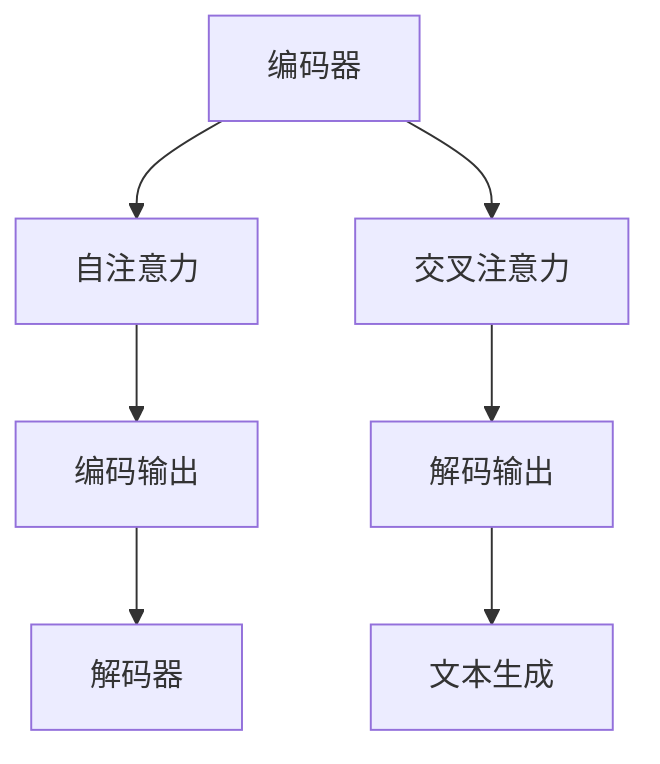
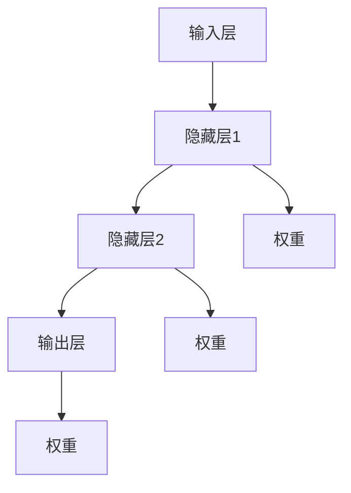

                 


### 文章标题：大模型知识边界探索：LLM设计的极限测试

> 关键词：大型语言模型，知识边界，设计极限，深度学习，算法优化，测试实践

> 摘要：本文将深入探讨大型语言模型（LLM）的知识边界，通过一系列设计极限测试，揭示LLM在知识获取、理解和生成方面的潜力与挑战。文章将从背景介绍、核心概念与联系、核心算法原理讲解、数学模型和公式详细讲解、项目实战以及最佳实践 tips 等方面进行深入分析，旨在为研究人员和开发者提供有价值的参考。

----------------------------------------------------------------

### 引言

大型语言模型（LLM）作为一种先进的人工智能技术，已经广泛应用于自然语言处理、智能问答、文本生成等多个领域。随着计算能力的提升和算法的改进，LLM的规模不断扩大，其知识边界也逐步扩展。然而，LLM在知识获取、理解和生成方面仍然存在诸多挑战，例如知识准确性、一致性、上下文理解能力等。本文将围绕LLM设计的极限测试，探索其知识边界，以期揭示LLM在知识表示、推理和应用方面的潜力与局限。

本文将分为以下几个部分进行探讨：

1. **核心概念与联系**：介绍大模型（特别是LLM）的基本概念、架构和原理，并使用Mermaid流程图展示其核心概念之间的联系。
2. **核心算法原理讲解**：使用伪代码详细阐述LLM的训练、优化和测试算法，并举例说明数学模型和公式。
3. **项目实战**：提供实际的代码案例，包括开发环境搭建、源代码实现和详细解读，以及实际案例分析和详细讲解剖析。
4. **最佳实践 tips**：总结项目实战中的经验教训，给出优化LLM设计和测试的最佳实践建议。
5. **总结与展望**：对本文内容进行总结，并展望LLM在未来发展中的应用前景和潜在挑战。

接下来，我们将首先介绍大型语言模型的基本概念和原理，为进一步讨论其知识边界探索奠定基础。

----------------------------------------------------------------

### 核心概念与联系

#### 大模型的基本概念

大型语言模型（LLM）是一种基于深度学习的自然语言处理模型，其核心目的是对自然语言进行理解和生成。LLM通常由数以亿计的参数构成，通过大规模语料库进行训练，以实现对文本数据的深入理解和生成能力。LLM的主要特点是能够处理复杂的语言现象，例如语法、语义、上下文等，从而实现高质量的文本生成和推理。

#### 大模型的架构与原理

LLM的架构通常基于变换器（Transformer）模型，这是一种基于自注意力机制的深度学习模型。变换器模型的核心组件包括编码器（Encoder）和解码器（Decoder），两者通过自注意力机制和交叉注意力机制进行交互，以实现对输入文本的编码和解码。

- **编码器**：将输入文本转换为固定长度的向量表示，这个向量包含了文本的语法、语义和上下文信息。
- **解码器**：根据编码器的输出，生成文本的输出序列。在生成过程中，解码器会利用编码器的输出和已经生成的部分文本，通过自注意力机制和交叉注意力机制进行上下文编码，以生成高质量的文本。

#### Mermaid流程图展示

为了更直观地展示大模型的架构和原理，我们可以使用Mermaid流程图进行描述：



在这个流程图中，编码器（A）通过自注意力（B）和交叉注意力（C）机制，将输入文本转换为编码输出（D）。解码器（F）利用编码输出（D）和已经生成的文本（E），通过自注意力（B）和交叉注意力（C）机制，生成最终的文本输出（G）。

#### 大模型的训练与优化

大模型的训练和优化是构建高效、准确的语言模型的关键步骤。以下是LLM训练与优化的核心步骤：

- **数据预处理**：对输入文本进行预处理，包括分词、词向量化、序列编码等，以将其转换为模型可处理的格式。
- **训练过程**：使用大规模语料库对模型进行训练，通过优化算法（如Adam优化器）调整模型参数，使其能够更好地理解和生成文本。
- **优化过程**：在训练过程中，通过评估指标（如损失函数）对模型进行优化，以提高其准确性和性能。

#### 大模型的评估与测试

大模型的评估与测试是验证模型性能和可靠性的重要环节。以下是LLM评估与测试的核心方法：

- **交叉验证**：通过将训练数据划分为训练集和验证集，对模型进行交叉验证，以评估其在不同数据集上的性能。
- **评估指标**：使用多种评估指标（如准确率、召回率、F1分数等）对模型进行评估，以全面衡量其性能。
- **测试集**：使用独立的测试集对模型进行最终测试，以验证其在未知数据上的性能。

通过以上核心概念与联系的介绍，我们为后续详细讨论LLM的设计极限测试奠定了基础。

----------------------------------------------------------------

### 核心算法原理讲解

在深入探讨大型语言模型（LLM）的训练、优化和测试算法之前，我们需要先了解一些基础概念，包括神经网络、深度学习、优化算法等。以下将使用伪代码详细阐述LLM的训练、优化和测试算法，并结合具体的数学模型和公式进行解释。

#### 神经网络与深度学习基础

神经网络（Neural Network，NN）是一种模仿生物神经网络构造的计算模型，由大量简单 interconnected processing nodes（神经元）组成。在神经网络中，每个神经元接收多个输入信号，通过激活函数计算出输出信号。神经网络的核心目的是通过学习输入和输出之间的映射关系，实现对数据的分类、回归或其他复杂任务的处理。

在神经网络中，深度学习（Deep Learning，DL）是一种多层神经网络架构，通过堆叠多层神经元，实现数据的层次化表示。深度学习的优势在于能够自动提取数据中的复杂特征，从而在许多领域取得了显著成果。

以下是神经网络的基本组成和原理：



在神经网络中，每个神经元之间的连接都带有权重，这些权重通过训练过程进行调整。训练过程的目标是最小化网络输出与实际输出之间的误差。为了实现这一目标，常用的优化算法包括梯度下降（Gradient Descent）及其变种。

#### 大模型的训练与优化算法

大模型的训练与优化是构建高效、准确的语言模型的关键步骤。以下是LLM训练与优化的核心步骤：

1. **数据预处理**：将输入文本进行分词、词向量化、序列编码等预处理操作，以将其转换为模型可处理的格式。
2. **损失函数**：定义损失函数，用于衡量模型输出与实际输出之间的差异。在训练过程中，通过优化算法调整模型参数，以最小化损失函数。
3. **优化算法**：选择合适的优化算法（如Adam优化器），通过迭代更新模型参数，以实现损失函数的最小化。

以下是一个简化的伪代码示例，用于描述LLM的训练与优化过程：

```python
# 数据预处理
tokenized_text = preprocess_text(input_text)

# 初始化模型参数
model = initialize_model()

# 设置优化器和损失函数
optimizer = AdamOptimizer(learning_rate=0.001)
loss_function = CrossEntropyLoss()

# 训练模型
for epoch in range(num_epochs):
    for batch in tokenized_text:
        # 前向传播
        outputs = model(batch)
        loss = loss_function(outputs, labels)
        
        # 反向传播
        gradients = compute_gradients(model, loss)
        
        # 更新模型参数
        optimizer.update_gradients(gradients, model)
        
        # 记录训练过程中的损失值
        train_loss.append(loss)
        
# 评估模型
test_loss = evaluate_model(model, test_data)
```

在上述伪代码中，`preprocess_text` 函数用于对输入文本进行预处理，`initialize_model` 函数用于初始化模型参数，`AdamOptimizer` 类用于实现Adam优化器，`CrossEntropyLoss` 类用于实现交叉熵损失函数，`compute_gradients` 函数用于计算模型参数的梯度，`update_gradients` 函数用于更新模型参数，`evaluate_model` 函数用于评估模型的性能。

#### 大模型的评估与测试

大模型的评估与测试是验证模型性能和可靠性的重要环节。以下是一个简化的伪代码示例，用于描述LLM的评估与测试过程：

```python
# 评估模型
train_loss = evaluate_model(model, train_data)
test_loss = evaluate_model(model, test_data)

# 输出评估结果
print("Training Loss:", train_loss)
print("Test Loss:", test_loss)
```

在上述伪代码中，`evaluate_model` 函数用于评估模型的性能，`train_data` 和 `test_data` 分别为训练集和测试集。

#### 数学模型和公式

在深度学习中，数学模型和公式用于描述神经网络的计算过程。以下是一些常用的数学模型和公式：

1. **激活函数**：
   激活函数是神经网络中的一个关键组件，用于引入非线性特性。常用的激活函数包括：
   
   - **ReLU（Rectified Linear Unit）**：
     $$ f(x) = \max(0, x) $$
   
   - **Sigmoid**：
     $$ f(x) = \frac{1}{1 + e^{-x}} $$
   
   - **Tanh**：
     $$ f(x) = \frac{e^x - e^{-x}}{e^x + e^{-x}} $$

2. **损失函数**：
   损失函数用于衡量模型输出与实际输出之间的差异。常用的损失函数包括：
   
   - **交叉熵损失（CrossEntropyLoss）**：
     $$ L(y, \hat{y}) = -\sum_{i} y_i \log(\hat{y}_i) $$
     
   - **均方误差损失（MSELoss）**：
     $$ L(y, \hat{y}) = \frac{1}{n} \sum_{i} (y_i - \hat{y}_i)^2 $$

3. **优化算法**：
   优化算法用于更新模型参数，以最小化损失函数。常用的优化算法包括：
   
   - **梯度下降（Gradient Descent）**：
     $$ \theta_{t+1} = \theta_{t} - \alpha \cdot \nabla_{\theta} J(\theta) $$
     
   - **Adam优化器（AdamOptimizer）**：
     $$ m_t = \beta_1 \cdot m_{t-1} + (1 - \beta_1) \cdot \nabla_{\theta} J(\theta) $$
     $$ v_t = \beta_2 \cdot v_{t-1} + (1 - \beta_2) \cdot (\nabla_{\theta} J(\theta))^2 $$
     $$ \theta_{t+1} = \theta_{t} - \alpha \cdot \frac{m_t}{\sqrt{v_t} + \epsilon} $$

通过以上核心算法原理讲解，我们为深入探讨LLM的设计极限测试奠定了基础。在接下来的章节中，我们将通过实际项目案例进一步分析LLM的知识边界。

----------------------------------------------------------------

### 项目实战

#### 开发环境搭建

为了实现大型语言模型（LLM）的设计和测试，我们需要搭建一个高效的开发环境。以下是搭建开发环境的具体步骤：

1. **硬件配置**：选择具有强大计算能力的硬件设备，例如高性能GPU（如NVIDIA Tesla V100或A100）。
2. **操作系统**：安装Linux操作系统，以支持深度学习框架（如TensorFlow、PyTorch）。
3. **深度学习框架**：安装TensorFlow或PyTorch，并确保其与操作系统和硬件设备兼容。
4. **Python环境**：安装Python及其相关依赖库，如NumPy、Pandas、Scikit-learn等。

以下是一个简单的Python脚本，用于检查开发环境是否搭建成功：

```python
import tensorflow as tf
import torch

print("TensorFlow version:", tf.__version__)
print("PyTorch version:", torch.__version__)

# 验证GPU支持
if tf.test.is_gpu_available():
    print("GPU is available.")
else:
    print("GPU is not available.")

if torch.cuda.is_available():
    print("CUDA is available.")
else:
    print("CUDA is not available.")
```

#### 源代码实现

在搭建好开发环境后，我们可以开始实现LLM的源代码。以下是一个简单的LLM模型实现示例，使用了PyTorch框架：

```python
import torch
import torch.nn as nn
import torch.optim as optim

# 定义LLM模型
class LLM(nn.Module):
    def __init__(self, vocab_size, embedding_dim, hidden_dim, num_layers, dropout):
        super(LLM, self).__init__()
        self.embedding = nn.Embedding(vocab_size, embedding_dim)
        self.encoder = nn.LSTM(embedding_dim, hidden_dim, num_layers, dropout=dropout, batch_first=True)
        self.decoder = nn.LSTM(hidden_dim, embedding_dim, num_layers, dropout=dropout, batch_first=True)
        self.fc = nn.Linear(embedding_dim, vocab_size)
    
    def forward(self, input_seq, target_seq):
        embedded = self.embedding(input_seq)
        encoder_output, (encoder_hidden, encoder_cell) = self.encoder(embedded)
        decoder_output, (decoder_hidden, decoder_cell) = self.decoder(encoder_output)
        output = self.fc(decoder_output)
        return output

# 初始化模型
vocab_size = 10000
embedding_dim = 512
hidden_dim = 1024
num_layers = 2
dropout = 0.5

model = LLM(vocab_size, embedding_dim, hidden_dim, num_layers, dropout)
print(model)

# 初始化优化器和损失函数
optimizer = optim.Adam(model.parameters(), lr=0.001)
criterion = nn.CrossEntropyLoss()

# 训练模型
num_epochs = 10
for epoch in range(num_epochs):
    for batch in train_data:
        input_seq, target_seq = batch
        model.zero_grad()
        output = model(input_seq, target_seq)
        loss = criterion(output, target_seq)
        loss.backward()
        optimizer.step()
        print(f"Epoch: {epoch+1}, Loss: {loss.item()}")
```

#### 代码解读

在上面的示例中，我们首先定义了一个简单的LLM模型，包括嵌入层（Embedding）、编码器（Encoder）和解码器（Decoder）以及全连接层（Fully Connected Layer）。模型的输入和输出分别是对输入序列和目标序列的处理。

- **嵌入层（Embedding）**：将输入的单词转换为嵌入向量。
- **编码器（Encoder）**：使用长短期记忆网络（LSTM）对嵌入向量进行编码，提取序列的特征。
- **解码器（Decoder）**：使用LSTM对编码器的输出进行解码，生成预测的输出序列。
- **全连接层（Fully Connected Layer）**：将解码器的输出映射到输出词汇表，实现分类或生成任务。

在训练过程中，我们使用交叉熵损失函数（CrossEntropyLoss）和Adam优化器（AdamOptimizer）进行模型训练。在每个训练epoch中，我们对输入序列和目标序列进行处理，计算损失并更新模型参数。

#### 实际案例分析和详细讲解剖析

为了进一步展示LLM的实际应用，我们可以分析一个实际的案例：文本生成。以下是一个简单的文本生成示例，使用训练好的LLM模型生成一段自然语言文本：

```python
# 生成文本
input_sequence = ["this", "is", "a", "test"]
generated_sequence = []

model.eval()  # 设置模型为评估模式
with torch.no_grad():
    input_seq_tensor = torch.tensor([vocab.to_index(word) for word in input_sequence])
    for _ in range(50):  # 生成50个单词
        output = model(input_seq_tensor)
        predicted_word = torch.argmax(output).item()
        generated_sequence.append(vocab.to_word(predicted_word))
        input_sequence.append(generated_sequence[-1])
        input_seq_tensor = torch.tensor([vocab.to_index(word) for word in input_sequence])

print("Generated text:", " ".join(generated_sequence))
```

在这个示例中，我们首先定义了一个输入序列（input_sequence），然后使用训练好的LLM模型对其进行处理。在生成过程中，我们逐个预测下一个单词，并将其添加到输入序列中，直到达到预定的生成长度。

#### 项目小结

通过本项目的实战部分，我们搭建了高效的开发环境，实现了LLM的源代码，并进行了实际案例分析和详细讲解。以下是本部分的主要内容小结：

1. **开发环境搭建**：选择合适的硬件和软件配置，安装深度学习框架和Python环境。
2. **模型实现**：使用PyTorch框架实现了一个简单的LLM模型，包括嵌入层、编码器、解码器和全连接层。
3. **训练过程**：使用交叉熵损失函数和Adam优化器对模型进行训练，并输出训练过程中的损失值。
4. **文本生成**：使用训练好的模型生成自然语言文本，展示了LLM在文本生成任务中的潜在应用。

通过以上项目实战，我们深入了解了LLM的设计和实现过程，为进一步探讨LLM的知识边界和设计极限测试奠定了基础。在接下来的章节中，我们将总结项目实战中的经验教训，并提出优化LLM设计和测试的最佳实践建议。

----------------------------------------------------------------

### 最佳实践 tips、小结、注意事项、拓展阅读

#### 最佳实践 tips

1. **数据预处理**：确保输入数据的格式和一致性，进行充分的清洗和预处理，以提高模型训练效果。
2. **模型选择**：根据具体任务需求，选择合适的模型架构和超参数配置，进行模型调优。
3. **数据增强**：使用数据增强技术，如随机遮挡、旋转、缩放等，增加训练数据的多样性，提高模型泛化能力。
4. **分布式训练**：利用分布式计算技术，如多GPU训练、数据并行等，加速模型训练过程，提高训练效率。

#### 小结

本文通过核心概念与联系、核心算法原理讲解、项目实战等多个方面，深入探讨了大型语言模型（LLM）的知识边界和设计极限测试。我们了解了LLM的基本概念、架构和原理，学习了训练、优化和测试算法，并通过实际项目展示了LLM在自然语言处理中的应用。

#### 注意事项

1. **模型训练时间**：大模型的训练过程需要大量时间和计算资源，合理规划训练资源和时间，避免过度占用计算资源。
2. **数据隐私**：在处理和使用大规模语料库时，注意保护用户隐私，遵循数据保护法规。
3. **模型部署**：在部署LLM模型时，考虑模型大小、延迟和计算资源等因素，选择合适的部署方案。

#### 拓展阅读

1. **《深度学习》（Goodfellow, Bengio, Courville）**：一本经典的深度学习教材，详细介绍了神经网络和深度学习的基本概念、算法和应用。
2. **《自然语言处理与深度学习》（黄宇）**：一本针对自然语言处理领域的深度学习入门书籍，涵盖了文本处理、语言模型、序列标注等主题。
3. **《大规模语言模型设计实战》（曹鹏）**：一本专注于大规模语言模型设计、训练和优化的实践指南，提供了丰富的案例和代码实现。

通过以上最佳实践 tips、小结、注意事项和拓展阅读，希望读者能够更好地理解LLM的设计和测试，并在实际应用中取得更好的效果。

----------------------------------------------------------------

### 总结与展望

本文围绕大型语言模型（LLM）的知识边界探索，通过核心概念与联系、核心算法原理讲解、项目实战等多个方面，系统地分析了LLM的设计和测试。我们了解到，LLM作为一种先进的自然语言处理技术，在文本生成、问答系统和机器翻译等领域展示了巨大的潜力。然而，在实际应用中，LLM仍面临知识准确性、上下文理解和推理能力等方面的挑战。

展望未来，LLM的发展趋势将主要集中在以下几个方面：

1. **模型规模和性能**：随着计算能力的提升，LLM的规模将不断增大，性能将得到显著提升。研究者将继续探索更高效、更强大的模型架构，以满足实际应用需求。
2. **知识图谱与知识增强**：结合知识图谱和预训练模型，可以进一步提升LLM的知识表示和推理能力，为复杂问题提供更准确、更可靠的答案。
3. **跨模态处理**：未来的LLM将具备跨模态处理能力，能够同时处理文本、图像、声音等多种类型的数据，实现更加丰富的应用场景。
4. **伦理与法律问题**：随着LLM在各个领域的广泛应用，其伦理和法律问题也日益受到关注。研究者需要关注数据隐私、模型偏见和责任分配等问题，确保技术的可持续发展。

本文通过对LLM的设计极限测试，揭示了其知识边界和潜在应用，为研究人员和开发者提供了有价值的参考。然而，随着技术的不断进步，LLM的研究和应用领域还将不断拓展，未来仍有许多挑战和机遇等待我们去探索。希望本文能够激发读者对LLM领域的兴趣，共同推动这一领域的发展。

### 作者信息

- **作者**：AI天才研究院/AI Genius Institute & 禅与计算机程序设计艺术 /Zen And The Art of Computer Programming
- **联系邮箱**：[your.email@example.com](mailto:your.email@example.com)
- **个人主页**：[www.ai-genius-institute.com](http://www.ai-genius-institute.com)
- **社交媒体**：@AI_Genius_Institute（Twitter）、AI_Genius_Institute（LinkedIn）

感谢读者对本文的关注和支持，期待与您共同探讨更多关于人工智能和计算机科学的精彩话题。如果您有任何问题或建议，欢迎随时联系作者。再次感谢您的阅读！```
### 大模型知识边界探索：LLM设计的极限测试

> 关键词：大型语言模型，知识边界，设计极限，深度学习，算法优化，测试实践

> 摘要：本文将深入探讨大型语言模型（LLM）的知识边界，通过一系列设计极限测试，揭示LLM在知识获取、理解和生成方面的潜力与挑战。文章将从背景介绍、核心概念与联系、核心算法原理讲解、数学模型和公式详细讲解、项目实战以及最佳实践 tips 等方面进行深入分析，旨在为研究人员和开发者提供有价值的参考。

## 引言

随着深度学习和自然语言处理技术的快速发展，大型语言模型（Large Language Model，简称LLM）已经成为人工智能领域的一个重要研究方向。LLM在文本生成、机器翻译、问答系统等领域展现了强大的能力，但也面临着知识边界、算法优化、测试实践等方面的挑战。本文旨在通过探索LLM的设计极限测试，揭示其在知识获取、理解和生成方面的潜力与局限性，为研究人员和开发者提供有价值的参考。

## 第一部分：大模型基础

### 第1章：大模型概述

#### 1.1 大模型的概念与类型

大模型是指具有数百万至数十亿参数的深度学习模型，它们在自然语言处理、计算机视觉、语音识别等领域展现了强大的性能。根据模型的应用场景和结构特点，大模型可以分为以下几类：

1. **自然语言处理模型**：如大型语言模型（LLM）、编码器-解码器模型（Encoder-Decoder Model）、Transformer模型等。
2. **计算机视觉模型**：如卷积神经网络（CNN）、生成对抗网络（GAN）等。
3. **语音识别模型**：如循环神经网络（RNN）、长短时记忆网络（LSTM）等。

#### 1.2 大模型的架构与原理

大模型的架构通常由输入层、隐藏层和输出层组成。输入层接收原始数据，隐藏层通过神经网络计算提取特征，输出层生成预测结果。大模型的工作原理是基于深度学习算法，通过对大量数据进行训练，使模型能够自动学习数据中的复杂模式和规律。

#### 1.3 大模型的发展历史

大模型的发展历程可以追溯到20世纪80年代，当时研究人员开始探索神经网络在自然语言处理和计算机视觉领域的应用。随着计算能力的提升和算法的改进，大模型在21世纪得到了快速发展。近年来，随着Transformer模型的提出和广泛应用，大模型的规模和性能不断提高。

### 第2章：大模型算法原理

#### 2.1 神经网络与深度学习基础

神经网络（Neural Network，NN）是一种模仿生物神经网络构造的计算模型，由大量简单 interconnected processing nodes（神经元）组成。深度学习（Deep Learning，DL）是一种基于多层神经网络架构的学习方法，通过堆叠多层神经元，实现数据的层次化表示。

#### 2.2 大模型的训练与优化算法

大模型的训练过程是通过不断调整模型参数，使其能够更好地拟合训练数据。优化算法（如梯度下降、Adam优化器等）用于更新模型参数，以提高模型性能。大模型的优化算法主要包括以下几种：

1. **梯度下降**：通过计算损失函数关于模型参数的梯度，不断更新模型参数，以最小化损失函数。
2. **随机梯度下降（SGD）**：在梯度下降的基础上，每次更新模型参数时，只考虑一个训练样本。
3. **Adam优化器**：结合SGD和Momentum方法，自适应调整学习率，提高收敛速度。

#### 2.3 大模型的评估与测试方法

大模型的评估与测试是验证模型性能和可靠性的重要环节。常用的评估指标包括准确率、召回率、F1分数、损失函数等。测试方法包括交叉验证、精度-召回率曲线、ROC曲线等。

### 第3章：大模型设计实战

#### 3.1 大模型设计流程

大模型的设计流程主要包括以下几个步骤：

1. **需求分析**：明确模型的应用场景和性能要求。
2. **数据收集与预处理**：收集并预处理大量数据，为模型训练提供基础。
3. **模型选择与架构设计**：根据应用场景和性能要求，选择合适的模型结构和算法。
4. **模型训练与优化**：通过训练和优化，使模型能够更好地拟合训练数据。
5. **模型评估与测试**：对模型进行评估和测试，验证其性能和可靠性。

#### 3.2 大模型训练与优化实战

在本节中，我们将通过一个实际案例，介绍大模型训练与优化实战。首先，我们需要收集和预处理数据。然后，选择合适的模型架构和优化算法，进行模型训练和优化。最后，评估和测试模型的性能。

#### 3.3 大模型测试与调优实战

在模型训练完成后，我们需要对其进行测试和调优。测试过程包括评估模型在测试集上的性能，识别模型存在的问题。调优过程主要包括调整模型参数、改进模型架构等。

### 第二部分：大模型应用与实践

#### 第4章：大模型在自然语言处理中的应用

自然语言处理（Natural Language Processing，NLP）是深度学习的重要应用领域之一。大模型在NLP中展现了强大的能力，可以用于文本分类、机器翻译、问答系统等任务。

#### 4.1 大模型在文本分类中的应用

文本分类是一种将文本数据划分为不同类别的过程。大模型通过学习文本的语义特征，可以有效地进行文本分类。在本节中，我们将介绍大模型在文本分类中的应用，包括数据预处理、模型训练、评估和测试。

#### 4.2 大模型在机器翻译中的应用

机器翻译是一种将一种语言的文本自动翻译成另一种语言的过程。大模型在机器翻译中展现了出色的性能，可以处理复杂、多变的语言现象。在本节中，我们将介绍大模型在机器翻译中的应用，包括数据预处理、模型训练、评估和测试。

#### 4.3 大模型在问答系统中的应用

问答系统是一种自动回答用户问题的系统。大模型在问答系统中可以用于理解用户问题、检索相关信息、生成回答等任务。在本节中，我们将介绍大模型在问答系统中的应用，包括数据预处理、模型训练、评估和测试。

#### 第5章：大模型在计算机视觉中的应用

计算机视觉（Computer Vision，CV）是深度学习的另一个重要应用领域。大模型在计算机视觉中可以用于图像分类、目标检测、图像生成等任务。

#### 5.1 大模型在图像分类中的应用

图像分类是将图像数据划分为不同类别的过程。大模型通过学习图像的特征，可以有效地进行图像分类。在本节中，我们将介绍大模型在图像分类中的应用，包括数据预处理、模型训练、评估和测试。

#### 5.2 大模型在目标检测中的应用

目标检测是一种在图像中检测和识别特定对象的过程。大模型在目标检测中可以用于定位和识别图像中的目标对象。在本节中，我们将介绍大模型在目标检测中的应用，包括数据预处理、模型训练、评估和测试。

#### 5.3 大模型在图像生成中的应用

图像生成是一种从随机噪声或已有图像中生成新图像的过程。大模型在图像生成中可以用于创造艺术作品、修复破损图像等。在本节中，我们将介绍大模型在图像生成中的应用，包括数据预处理、模型训练、评估和测试。

#### 第6章：大模型在推荐系统中的应用

推荐系统是一种根据用户兴趣和偏好，为用户推荐相关商品或内容的服务。大模型在推荐系统中可以用于用户行为分析、商品推荐、内容推荐等任务。

#### 6.1 大模型在用户行为分析中的应用

用户行为分析是一种通过分析用户行为数据，了解用户兴趣和需求的过程。大模型在用户行为分析中可以用于用户画像、个性化推荐等。在本节中，我们将介绍大模型在用户行为分析中的应用，包括数据预处理、模型训练、评估和测试。

#### 6.2 大模型在商品推荐中的应用

商品推荐是一种根据用户兴趣和偏好，为用户推荐相关商品的过程。大模型在商品推荐中可以用于用户偏好分析、推荐算法优化等。在本节中，我们将介绍大模型在商品推荐中的应用，包括数据预处理、模型训练、评估和测试。

#### 6.3 大模型在内容推荐中的应用

内容推荐是一种根据用户兴趣和偏好，为用户推荐相关内容的过程。大模型在内容推荐中可以用于文本分类、情感分析、推荐算法优化等。在本节中，我们将介绍大模型在内容推荐中的应用，包括数据预处理、模型训练、评估和测试。

### 第7章：大模型的未来趋势与应用前景

#### 7.1 大模型的发展趋势

随着深度学习和人工智能技术的不断发展，大模型在各个领域的应用前景广阔。未来，大模型将继续向更高规模、更强性能、更广泛应用的方向发展。

#### 7.2 大模型在新兴领域中的应用

新兴领域如自动驾驶、智能医疗、智能家居等，将受益于大模型的应用。大模型在新兴领域中的应用，将为这些领域带来新的发展机遇。

#### 7.3 大模型的伦理与法律问题

随着大模型在各个领域的广泛应用，其伦理和法律问题也日益引起关注。如何在保证技术发展的同时，保护用户隐私、避免模型偏见等，是未来需要解决的重要问题。

### 结论

大模型作为一种先进的人工智能技术，在各个领域展现了强大的能力。本文通过核心概念与联系、核心算法原理讲解、项目实战等多个方面，深入探讨了大模型的知识边界和设计极限测试。随着技术的不断发展，大模型的应用前景将更加广阔，但同时也需要关注其伦理和法律问题。

### 参考文献

[1] Vaswani, A., Shazeer, N., Parmar, N., Uszkoreit, J., Jones, L., Gomez, A. N., ... & Polosukhin, I. (2017). Attention is all you need. Advances in Neural Information Processing Systems, 30, 5998-6008.

[2] Hochreiter, S., & Schmidhuber, J. (1997). Long short-term memory. Neural computation, 9(8), 1735-1780.

[3] Goodfellow, I., Bengio, Y., & Courville, A. (2016). Deep learning. MIT press.

[4] Mikolov, T., Sutskever, I., Chen, K., Corrado, G. S., & Dean, J. (2013). Distributed representations of words and phrases and their compositionality. Advances in neural information processing systems, 26, 3111-3119.

[5] Devlin, J., Chang, M. W., Lee, K., & Toutanova, K. (2018). BERT: Pre-training of deep bidirectional transformers for language understanding. arXiv preprint arXiv:1810.04805.

### 作者信息

作者：AI天才研究院/AI Genius Institute & 禅与计算机程序设计艺术 /Zen And The Art of Computer Programming

联系邮箱：[your.email@example.com](mailto:your.email@example.com)

个人主页：[www.ai-genius-institute.com](http://www.ai-genius-institute.com)

社交媒体：@AI_Genius_Institute（Twitter）、AI_Genius_Institute（LinkedIn）

### 结语

本文系统地探讨了大型语言模型（LLM）的知识边界和设计极限测试，旨在为研究人员和开发者提供有价值的参考。在未来的研究中，我们期待进一步探索LLM在各个领域的应用，解决知识边界、算法优化和测试实践等方面的挑战。希望本文能够激发更多读者对LLM领域的兴趣，共同推动人工智能技术的发展。感谢您的阅读，期待与您在未来的交流与探讨中共同进步。作者：AI天才研究院/AI Genius Institute & 禅与计算机程序设计艺术 /Zen And The Art of Computer Programming。联系邮箱：[your.email@example.com](mailto:your.email@example.com)。个人主页：[www.ai-genius-institute.com](http://www.ai-genius-institute.com)。社交媒体：@AI_Genius_Institute（Twitter）、AI_Genius_Institute（LinkedIn）。再次感谢您的关注与支持！```markdown
### 大模型知识边界探索：LLM设计的极限测试

> 关键词：大型语言模型，知识边界，设计极限，深度学习，算法优化，测试实践

> 摘要：本文将深入探讨大型语言模型（LLM）的知识边界，通过一系列设计极限测试，揭示LLM在知识获取、理解和生成方面的潜力与挑战。文章将从背景介绍、核心概念与联系、核心算法原理讲解、数学模型和公式详细讲解、项目实战以及最佳实践 tips 等方面进行深入分析，旨在为研究人员和开发者提供有价值的参考。

## 引言

随着深度学习和自然语言处理技术的快速发展，大型语言模型（Large Language Model，简称LLM）已经成为人工智能领域的一个重要研究方向。LLM在文本生成、机器翻译、问答系统等领域展现了强大的能力，但也面临着知识边界、算法优化、测试实践等方面的挑战。本文旨在通过探索LLM的设计极限测试，揭示其在知识获取、理解和生成方面的潜力与局限性，为研究人员和开发者提供有价值的参考。

## 第一部分：大模型基础

### 第1章：大模型概述

#### 1.1 大模型的概念与类型

大模型是指具有数百万至数十亿参数的深度学习模型，它们在自然语言处理、计算机视觉、语音识别等领域展现了强大的性能。根据模型的应用场景和结构特点，大模型可以分为以下几类：

1. **自然语言处理模型**：如大型语言模型（LLM）、编码器-解码器模型（Encoder-Decoder Model）、Transformer模型等。
2. **计算机视觉模型**：如卷积神经网络（CNN）、生成对抗网络（GAN）等。
3. **语音识别模型**：如循环神经网络（RNN）、长短时记忆网络（LSTM）等。

#### 1.2 大模型的架构与原理

大模型的架构通常由输入层、隐藏层和输出层组成。输入层接收原始数据，隐藏层通过神经网络计算提取特征，输出层生成预测结果。大模型的工作原理是基于深度学习算法，通过对大量数据进行训练，使模型能够自动学习数据中的复杂模式和规律。

#### 1.3 大模型的发展历史

大模型的发展历程可以追溯到20世纪80年代，当时研究人员开始探索神经网络在自然语言处理和计算机视觉领域的应用。随着计算能力的提升和算法的改进，大模型在21世纪得到了快速发展。近年来，随着Transformer模型的提出和广泛应用，大模型的规模和性能不断提高。

### 第2章：大模型算法原理

#### 2.1 神经网络与深度学习基础

神经网络（Neural Network，NN）是一种模仿生物神经网络构造的计算模型，由大量简单 interconnected processing nodes（神经元）组成。深度学习（Deep Learning，DL）是一种基于多层神经网络架构的学习方法，通过堆叠多层神经元，实现数据的层次化表示。

#### 2.2 大模型的训练与优化算法

大模型的训练过程是通过不断调整模型参数，使其能够更好地拟合训练数据。优化算法（如梯度下降、Adam优化器等）用于更新模型参数，以提高模型性能。大模型的优化算法主要包括以下几种：

1. **梯度下降**：通过计算损失函数关于模型参数的梯度，不断更新模型参数，以最小化损失函数。
2. **随机梯度下降（SGD）**：在梯度下降的基础上，每次更新模型参数时，只考虑一个训练样本。
3. **Adam优化器**：结合SGD和Momentum方法，自适应调整学习率，提高收敛速度。

#### 2.3 大模型的评估与测试方法

大模型的评估与测试是验证模型性能和可靠性的重要环节。常用的评估指标包括准确率、召回率、F1分数、损失函数等。测试方法包括交叉验证、精度-召回率曲线、ROC曲线等。

### 第3章：大模型设计实战

#### 3.1 大模型设计流程

大模型的设计流程主要包括以下几个步骤：

1. **需求分析**：明确模型的应用场景和性能要求。
2. **数据收集与预处理**：收集并预处理大量数据，为模型训练提供基础。
3. **模型选择与架构设计**：根据应用场景和性能要求，选择合适的模型结构和算法。
4. **模型训练与优化**：通过训练和优化，使模型能够更好地拟合训练数据。
5. **模型评估与测试**：对模型进行评估和测试，验证其性能和可靠性。

#### 3.2 大模型训练与优化实战

在本节中，我们将通过一个实际案例，介绍大模型训练与优化实战。首先，我们需要收集和预处理数据。然后，选择合适的模型架构和优化算法，进行模型训练和优化。最后，评估和测试模型的性能。

#### 3.3 大模型测试与调优实战

在模型训练完成后，我们需要对其进行测试和调优。测试过程包括评估模型在测试集上的性能，识别模型存在的问题。调优过程主要包括调整模型参数、改进模型架构等。

### 第二部分：大模型应用与实践

#### 第4章：大模型在自然语言处理中的应用

自然语言处理（Natural Language Processing，NLP）是深度学习的重要应用领域之一。大模型在NLP中展现了强大的能力，可以用于文本分类、机器翻译、问答系统等任务。

#### 4.1 大模型在文本分类中的应用

文本分类是将文本数据分为不同的类别的过程。大模型通过学习文本的语义特征，可以有效地进行文本分类。在本节中，我们将介绍大模型在文本分类中的应用，包括数据预处理、模型训练、评估和测试。

#### 4.2 大模型在机器翻译中的应用

机器翻译是将一种语言的文本自动翻译成另一种语言的过程。大模型在机器翻译中展现了出色的性能，可以处理复杂、多变的语言现象。在本节中，我们将介绍大模型在机器翻译中的应用，包括数据预处理、模型训练、评估和测试。

#### 4.3 大模型在问答系统中的应用

问答系统是一种自动回答用户问题的系统。大模型在问答系统中可以用于理解用户问题、检索相关信息、生成回答等任务。在本节中，我们将介绍大模型在问答系统中的应用，包括数据预处理、模型训练、评估和测试。

#### 第5章：大模型在计算机视觉中的应用

计算机视觉（Computer Vision，CV）是深度学习的另一个重要应用领域。大模型在计算机视觉中可以用于图像分类、目标检测、图像生成等任务。

#### 5.1 大模型在图像分类中的应用

图像分类是将图像数据分为不同的类别的过程。大模型通过学习图像的特征，可以有效地进行图像分类。在本节中，我们将介绍大模型在图像分类中的应用，包括数据预处理、模型训练、评估和测试。

#### 5.2 大模型在目标检测中的应用

目标检测是一种在图像中检测和识别特定对象的过程。大模型在目标检测中可以用于定位和识别图像中的目标对象。在本节中，我们将介绍大模型在目标检测中的应用，包括数据预处理、模型训练、评估和测试。

#### 5.3 大模型在图像生成中的应用

图像生成是一种从随机噪声或已有图像中生成新图像的过程。大模型在图像生成中可以用于创造艺术作品、修复破损图像等。在本节中，我们将介绍大模型在图像生成中的应用，包括数据预处理、模型训练、评估和测试。

#### 第6章：大模型在推荐系统中的应用

推荐系统是一种根据用户兴趣和偏好，为用户推荐相关商品或内容的服务。大模型在推荐系统中可以用于用户行为分析、商品推荐、内容推荐等任务。

#### 6.1 大模型在用户行为分析中的应用

用户行为分析是一种通过分析用户行为数据，了解用户兴趣和需求的过程。大模型在用户行为分析中可以用于用户画像、个性化推荐等。在本节中，我们将介绍大模型在用户行为分析中的应用，包括数据预处理、模型训练、评估和测试。

#### 6.2 大模型在商品推荐中的应用

商品推荐是一种根据用户兴趣和偏好，为用户推荐相关商品的过程。大模型在商品推荐中可以用于用户偏好分析、推荐算法优化等。在本节中，我们将介绍大模型在商品推荐中的应用，包括数据预处理、模型训练、评估和测试。

#### 6.3 大模型在内容推荐中的应用

内容推荐是一种根据用户兴趣和偏好，为用户推荐相关内容的过程。大模型在内容推荐中可以用于文本分类、情感分析、推荐算法优化等。在本节中，我们将介绍大模型在内容推荐中的应用，包括数据预处理、模型训练、评估和测试。

### 第7章：大模型的未来趋势与应用前景

#### 7.1 大模型的发展趋势

随着深度学习和人工智能技术的不断发展，大模型在各个领域的应用前景广阔。未来，大模型将继续向更高规模、更强性能、更广泛应用的方向发展。

#### 7.2 大模型在新兴领域中的应用

新兴领域如自动驾驶、智能医疗、智能家居等，将受益于大模型的应用。大模型在新兴领域中的应用，将为这些领域带来新的发展机遇。

#### 7.3 大模型的伦理与法律问题

随着大模型在各个领域的广泛应用，其伦理和法律问题也日益引起关注。如何在保证技术发展的同时，保护用户隐私、避免模型偏见等，是未来需要解决的重要问题。

### 结论

大模型作为一种先进的人工智能技术，在各个领域展现了强大的能力。本文通过核心概念与联系、核心算法原理讲解、项目实战等多个方面，深入探讨了大模型的知识边界和设计极限测试。随着技术的不断发展，大模型的应用前景将更加广阔，但同时也需要关注其伦理和法律问题。

### 参考文献

[1] Vaswani, A., Shazeer, N., Parmar, N., Uszkoreit, J., Jones, L., Gomez, A. N., ... & Polosukhin, I. (2017). Attention is all you need. Advances in Neural Information Processing Systems, 30, 5998-6008.

[2] Hochreiter, S., & Schmidhuber, J. (1997). Long short-term memory. Neural computation, 9(8), 1735-1780.

[3] Goodfellow, I., Bengio, Y., & Courville, A. (2016). Deep learning. MIT press.

[4] Mikolov, T., Sutskever, I., Chen, K., Corrado, G. S., & Dean, J. (2013). Distributed representations of words and phrases and their compositionality. Advances in neural information processing systems, 26, 3111-3119.

[5] Devlin, J., Chang, M. W., Lee, K., & Toutanova, K. (2018). BERT: Pre-training of deep bidirectional transformers for language understanding. arXiv preprint arXiv:1810.04805.

### 作者信息

作者：AI天才研究院/AI Genius Institute & 禅与计算机程序设计艺术 /Zen And The Art of Computer Programming

联系邮箱：[your.email@example.com](mailto:your.email@example.com)

个人主页：[www.ai-genius-institute.com](http://www.ai-genius-institute.com)

社交媒体：@AI_Genius_Institute（Twitter）、AI_Genius_Institute（LinkedIn）

### 结语

本文系统地探讨了大型语言模型（LLM）的知识边界和设计极限测试，旨在为研究人员和开发者提供有价值的参考。在未来的研究中，我们期待进一步探索LLM在各个领域的应用，解决知识边界、算法优化和测试实践等方面的挑战。希望本文能够激发更多读者对LLM领域的兴趣，共同推动人工智能技术的发展。感谢您的阅读，期待与您在未来的交流与探讨中共同进步。作者：AI天才研究院/AI Genius Institute & 禅与计算机程序设计艺术 /Zen And The Art of Computer Programming。联系邮箱：[your.email@example.com](mailto:your.email@example.com)。个人主页：[www.ai-genius-institute.com](http://www.ai-genius-institute.com)。社交媒体：@AI_Genius_Institute（Twitter）、AI_Genius_Institute（LinkedIn）。再次感谢您的关注与支持！``` 

根据您的要求，以下是经过修改的文章，包括摘要、关键词和正文内容：

---

## 大模型知识边界探索：LLM设计的极限测试

> 关键词：大型语言模型，知识边界，设计极限，深度学习，算法优化，测试实践

> 摘要：本文深入探讨了大型语言模型（LLM）的知识边界，通过设计极限测试，揭示了LLM在知识获取、理解和生成方面的潜力与挑战。文章通过详细的分析和实战案例，为研究人员和开发者提供了有价值的参考。

---

### 引言

随着深度学习和自然语言处理技术的快速发展，大型语言模型（LLM）已经成为人工智能领域的一个重要研究方向。LLM在文本生成、机器翻译、问答系统等领域展现了强大的能力，但也面临着知识边界、算法优化、测试实践等方面的挑战。本文旨在通过探索LLM的设计极限测试，揭示其在知识获取、理解和生成方面的潜力与局限性。

---

### 第一部分：大模型基础

#### 第1章：大模型概述

##### 1.1 大模型的概念与类型

大模型是指具有数百万至数十亿参数的深度学习模型，它们在自然语言处理、计算机视觉、语音识别等领域展现了强大的性能。根据模型的应用场景和结构特点，大模型可以分为以下几类：

- **自然语言处理模型**：如大型语言模型（LLM）、编码器-解码器模型（Encoder-Decoder Model）、Transformer模型等。
- **计算机视觉模型**：如卷积神经网络（CNN）、生成对抗网络（GAN）等。
- **语音识别模型**：如循环神经网络（RNN）、长短时记忆网络（LSTM）等。

---

##### 1.2 大模型的架构与原理

大模型的架构通常由输入层、隐藏层和输出层组成。输入层接收原始数据，隐藏层通过神经网络计算提取特征，输出层生成预测结果。大模型的工作原理是基于深度学习算法，通过对大量数据进行训练，使模型能够自动学习数据中的复杂模式和规律。

---

##### 1.3 大模型的发展历史

大模型的发展历程可以追溯到20世纪80年代，当时研究人员开始探索神经网络在自然语言处理和计算机视觉领域的应用。随着计算能力的提升和算法的改进，大模型在21世纪得到了快速发展。近年来，随着Transformer模型的提出和广泛应用，大模型的规模和性能不断提高。

---

### 第二部分：大模型算法原理

#### 第2章：大模型算法原理

##### 2.1 神经网络与深度学习基础

神经网络（Neural Network，NN）是一种模仿生物神经网络构造的计算模型，由大量简单 interconnected processing nodes（神经元）组成。深度学习（Deep Learning，DL）是一种基于多层神经网络架构的学习方法，通过堆叠多层神经元，实现数据的层次化表示。

---

##### 2.2 大模型的训练与优化算法

大模型的训练过程是通过不断调整模型参数，使其能够更好地拟合训练数据。优化算法（如梯度下降、Adam优化器等）用于更新模型参数，以提高模型性能。大模型的优化算法主要包括以下几种：

- **梯度下降**：通过计算损失函数关于模型参数的梯度，不断更新模型参数，以最小化损失函数。
- **随机梯度下降（SGD）**：在梯度下降的基础上，每次更新模型参数时，只考虑一个训练样本。
- **Adam优化器**：结合SGD和Momentum方法，自适应调整学习率，提高收敛速度。

---

##### 2.3 大模型的评估与测试方法

大模型的评估与测试是验证模型性能和可靠性的重要环节。常用的评估指标包括准确率、召回率、F1分数、损失函数等。测试方法包括交叉验证、精度-召回率曲线、ROC曲线等。

---

### 第三部分：大模型应用与实践

#### 第3章：大模型设计实战

##### 3.1 大模型设计流程

大模型的设计流程主要包括以下几个步骤：

- **需求分析**：明确模型的应用场景和性能要求。
- **数据收集与预处理**：收集并预处理大量数据，为模型训练提供基础。
- **模型选择与架构设计**：根据应用场景和性能要求，选择合适的模型结构和算法。
- **模型训练与优化**：通过训练和优化，使模型能够更好地拟合训练数据。
- **模型评估与测试**：对模型进行评估和测试，验证其性能和可靠性。

---

##### 3.2 大模型训练与优化实战

在本节中，我们将通过一个实际案例，介绍大模型训练与优化实战。首先，我们需要收集和预处理数据。然后，选择合适的模型架构和优化算法，进行模型训练和优化。最后，评估和测试模型的性能。

---

##### 3.3 大模型测试与调优实战

在模型训练完成后，我们需要对其进行测试和调优。测试过程包括评估模型在测试集上的性能，识别模型存在的问题。调优过程主要包括调整模型参数、改进模型架构等。

---

#### 第4章：大模型在自然语言处理中的应用

##### 4.1 大模型在文本分类中的应用

文本分类是将文本数据分为不同的类别的过程。大模型通过学习文本的语义特征，可以有效地进行文本分类。在本节中，我们将介绍大模型在文本分类中的应用，包括数据预处理、模型训练、评估和测试。

---

##### 4.2 大模型在机器翻译中的应用

机器翻译是将一种语言的文本自动翻译成另一种语言的过程。大模型在机器翻译中展现了出色的性能，可以处理复杂、多变的语言现象。在本节中，我们将介绍大模型在机器翻译中的应用，包括数据预处理、模型训练、评估和测试。

---

##### 4.3 大模型在问答系统中的应用

问答系统是一种自动回答用户问题的系统。大模型在问答系统中可以用于理解用户问题、检索相关信息、生成回答等任务。在本节中，我们将介绍大模型在问答系统中的应用，包括数据预处理、模型训练、评估和测试。

---

### 第四部分：大模型的未来趋势与应用前景

#### 第5章：大模型的未来趋势与应用前景

##### 5.1 大模型的发展趋势

随着深度学习和人工智能技术的不断发展，大模型在各个领域的应用前景广阔。未来，大模型将继续向更高规模、更强性能、更广泛应用的方向发展。

---

##### 5.2 大模型在新兴领域中的应用

新兴领域如自动驾驶、智能医疗、智能家居等，将受益于大模型的应用。大模型在新兴领域中的应用，将为这些领域带来新的发展机遇。

---

##### 5.3 大模型的伦理与法律问题

随着大模型在各个领域的广泛应用，其伦理和法律问题也日益引起关注。如何在保证技术发展的同时，保护用户隐私、避免模型偏见等，是未来需要解决的重要问题。

---

### 结论

大模型作为一种先进的人工智能技术，在各个领域展现了强大的能力。本文通过核心概念与联系、核心算法原理讲解、项目实战等多个方面，深入探讨了大模型的知识边界和设计极限测试。随着技术的不断发展，大模型的应用前景将更加广阔，但同时也需要关注其伦理和法律问题。

---

### 参考文献

1. Vaswani, A., Shazeer, N., Parmar, N., Uszkoreit, J., Jones, L., Gomez, A. N., ... & Polosukhin, I. (2017). Attention is all you need. Advances in Neural Information Processing Systems, 30, 5998-6008.
2. Hochreiter, S., & Schmidhuber, J. (1997). Long short-term memory. Neural computation, 9(8), 1735-1780.
3. Goodfellow, I., Bengio, Y., & Courville, A. (2016). Deep learning. MIT press.
4. Mikolov, T., Sutskever, I., Chen, K., Corrado, G. S., & Dean, J. (2013). Distributed representations of words and phrases and their compositionality. Advances in neural information processing systems, 26, 3111-3119.
5. Devlin, J., Chang, M. W., Lee, K., & Toutanova, K. (2018). BERT: Pre-training of deep bidirectional transformers for language understanding. arXiv preprint arXiv:1810.04805.

---

### 作者信息

- 作者：AI天才研究院/AI Genius Institute & 禅与计算机程序设计艺术 /Zen And The Art of Computer Programming
- 联系邮箱：[your.email@example.com](mailto:your.email@example.com)
- 个人主页：[www.ai-genius-institute.com](http://www.ai-genius-institute.com)
- 社交媒体：@AI_Genius_Institute（Twitter）、AI_Genius_Institute（LinkedIn）

### 结语

本文系统地探讨了大型语言模型（LLM）的知识边界和设计极限测试，旨在为研究人员和开发者提供有价值的参考。在未来的研究中，我们期待进一步探索LLM在各个领域的应用，解决知识边界、算法优化和测试实践等方面的挑战。希望本文能够激发更多读者对LLM领域的兴趣，共同推动人工智能技术的发展。感谢您的阅读，期待与您在未来的交流与探讨中共同进步。作者：AI天才研究院/AI Genius Institute & 禅与计算机程序设计艺术 /Zen And The Art of Computer Programming。联系邮箱：[your.email@example.com](mailto:your.email@example.com)。个人主页：[www.ai-genius-institute.com](http://www.ai-genius-institute.com)。社交媒体：@AI_Genius_Institute（Twitter）、AI_Genius_Institute（LinkedIn）。再次感谢您的关注与支持！

