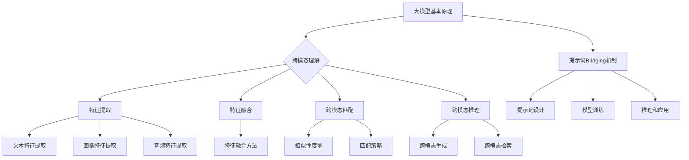
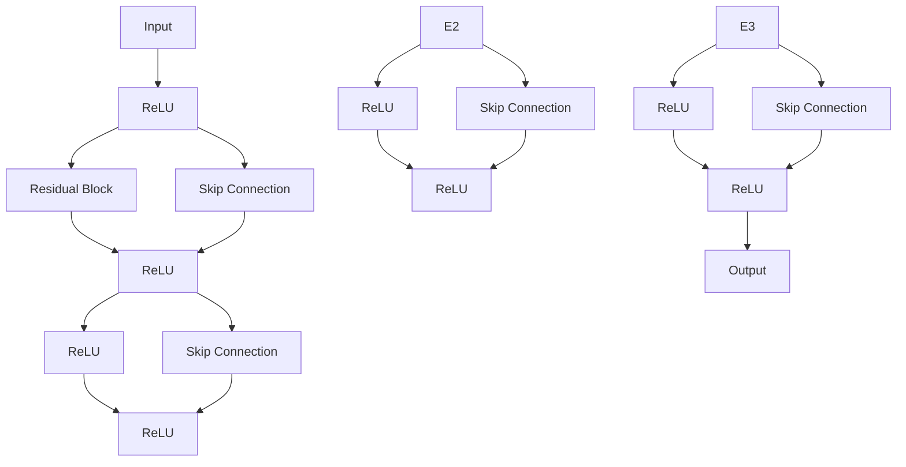

                 

### 文章标题

#### 大模型跨模态理解：提示词bridging感知鸿沟

##### 关键词：大模型、跨模态理解、提示词、bridging、感知鸿沟

##### 摘要：
本文将探讨大模型在跨模态理解中的应用，特别是在提示词bridging方面的技术原理和实现方法。通过详细分析大模型的基本原理、跨模态理解的关键技术以及提示词bridging机制，我们将揭示大模型如何通过提示词bridging来跨越不同模态之间的感知鸿沟。文章还将涵盖核心算法原理的讲解、数学模型和公式的应用、项目实战以及最佳实践和拓展阅读，旨在为读者提供一个全面而深入的跨模态理解指南。

### 引言

#### 大模型与跨模态理解

随着深度学习技术的不断发展，大模型（Large Models）在各个领域取得了显著的成果。大模型通常具有数十亿到数十万亿个参数，通过对海量数据的学习，能够提取出复杂的高层次特征，从而实现出色的任务表现。在自然语言处理、计算机视觉和语音识别等领域，大模型已经成为一种主流的技术手段。

跨模态理解（Cross-modal Understanding）是指模型在不同模态（如文本、图像、音频等）之间建立关联和意义传递的能力。这种能力在现实世界中具有重要意义，例如，在多媒体信息检索、图像视频增强、对话系统等应用中，跨模态理解能够显著提升系统的性能和用户体验。

提示词（Prompt）在跨模态理解中起着关键作用。提示词是一种引导模型进行特定任务的语言提示，它能够帮助模型理解任务目标，提高任务的准确性和效率。在跨模态理解中，提示词被用来将不同模态的信息结合起来，从而实现跨模态的感知和推理。

本文将围绕大模型跨模态理解的核心问题展开讨论，重点关注提示词bridging机制，旨在揭示大模型如何通过提示词bridging来跨越不同模态之间的感知鸿沟，从而实现更高级的跨模态理解能力。

### 背景介绍

#### 跨模态理解的应用场景

跨模态理解在许多实际应用中发挥着重要作用。以下是一些典型的应用场景：

1. **文本到图像**：在图像生成和图像搜索中，文本描述常常被用来指导图像生成或图像检索。例如，用户可以通过输入一段文字描述来生成一张对应的图像，或者通过文字描述来搜索包含特定内容的图像。

2. **图像到文本**：图像到文本的转换在图像标注、信息检索和自动内容生成等方面有广泛应用。例如，对于未标记的图像数据集，可以使用图像到文本转换来生成相应的标签，从而实现自动标注。

3. **文本到视频**：在视频生成和视频搜索中，文本描述可以用来生成或检索包含特定内容的视频。例如，用户可以通过输入一段文字来生成一段包含该文字描述的视频，或者通过文字描述来搜索包含特定内容的视频。

4. **视频到文本**：视频到文本的转换在视频摘要、自动字幕生成和内容理解等方面有重要应用。例如，可以将一段视频内容自动转换成对应的文字描述，从而实现视频内容的结构化和可检索性。

这些应用场景展示了跨模态理解在不同领域的重要性，同时也说明了跨模态理解技术的实际需求。

#### 大模型与跨模态理解

大模型在跨模态理解中具有显著的优势。首先，大模型具有强大的特征提取能力，能够从不同模态的数据中提取出具有代表性的特征表示。这些特征表示不仅能够捕捉到数据中的低层次特征，如边缘、纹理等，还能够捕捉到高层次语义特征，如对象、场景等。

其次，大模型通过大规模数据的学习，能够建立不同模态之间的内在关联。在训练过程中，大模型通过大量的跨模态数据学习到不同模态之间的对应关系和语义关联，从而实现跨模态的感知和推理。

最后，大模型具有强大的泛化能力。大模型通过学习大量的跨模态数据，能够对未知模态的数据进行有效处理和推理，从而实现跨模态理解的应用。

#### 提示词Bridging机制

提示词Bridging机制在大模型跨模态理解中起到了关键作用。提示词Bridging旨在通过语言提示将不同模态的信息联系起来，从而实现跨模态的理解和推理。

在跨模态理解中，不同模态的数据通常具有不同的特征表示和语义内容。提示词的作用是将这些不同模态的信息进行整合，使得模型能够更好地理解和处理跨模态数据。

提示词Bridging的具体实现通常包括以下几个步骤：

1. **特征提取**：首先，对文本、图像、音频等不同模态的数据进行特征提取，得到各自的特征表示。

2. **特征融合**：将不同模态的特征表示进行融合，得到一个综合的特征表示。这种融合可以通过多种方式实现，如拼接、加权、平均等。

3. **提示词设计**：设计特定的语言提示词，用于引导模型进行跨模态的感知和推理。提示词需要能够明确地指示模型要关注的信息，从而帮助模型建立不同模态之间的关联。

4. **模型训练**：使用融合后的特征和提示词进行模型训练，使得模型能够学习到跨模态的关联和语义。

5. **推理和应用**：在推理阶段，使用训练好的模型对新的跨模态数据进行处理和推理，从而实现跨模态理解。

通过提示词Bridging机制，大模型能够有效地跨越不同模态之间的感知鸿沟，实现更高级的跨模态理解和应用。

### 核心概念与联系

#### 大模型基本原理

大模型（Large Models）是指具有数十亿甚至数万亿参数的深度学习模型。这些模型通常基于神经网络架构，通过学习大量数据来提取和表示复杂的高层次特征。大模型的基本原理主要包括以下几个方面：

1. **神经网络架构**：大模型通常采用深度神经网络（DNN）或多层感知机（MLP）作为基础架构。通过增加网络的层数和神经元数量，大模型能够捕捉到数据中的复杂特征和关联。

2. **参数数量**：大模型具有数十亿到数万亿个参数。这些参数通过学习大量数据来调整，以实现模型的高效表示和预测能力。

3. **数据学习**：大模型通过学习海量数据来提取特征和建立模型。在训练过程中，模型会不断调整参数，以最小化损失函数，提高模型的预测性能。

4. **层次化特征提取**：大模型能够从数据中提取多层次的特征表示。低层次特征捕捉到数据的基本属性，如边缘、纹理等；高层次特征则捕捉到数据的高级语义和概念，如对象、场景等。

#### 跨模态理解的关键技术

跨模态理解（Cross-modal Understanding）是指模型在不同模态（如文本、图像、音频等）之间建立关联和意义传递的能力。实现跨模态理解的关键技术主要包括以下几个方面：

1. **特征提取**：特征提取是指从不同模态的数据中提取出具有代表性的特征表示。对于文本，可以使用词袋模型、词嵌入等技术；对于图像，可以使用卷积神经网络（CNN）提取图像特征；对于音频，可以使用循环神经网络（RNN）或卷积神经网络（CNN）提取音频特征。

2. **特征融合**：特征融合是指将不同模态的特征表示进行整合，得到一个综合的特征表示。常见的特征融合方法包括拼接、加权、平均等。

3. **跨模态匹配**：跨模态匹配是指将不同模态的特征进行匹配，以找到它们之间的对应关系。常见的匹配方法包括基于相似性度量的方法、基于聚类的方法和基于图的方法等。

4. **跨模态推理**：跨模态推理是指利用不同模态的特征进行推理和预测。常见的跨模态推理方法包括生成对抗网络（GAN）、变分自编码器（VAE）和跨模态检索方法等。

#### 提示词Bridging机制

提示词Bridging机制（Prompt-based Bridging）是指通过语言提示将不同模态的信息联系起来，从而实现跨模态理解和推理。提示词Bridging机制的核心在于设计特定的语言提示词，以引导模型关注和整合不同模态的信息。

提示词Bridging机制主要包括以下几个步骤：

1. **特征提取**：首先，对文本、图像、音频等不同模态的数据进行特征提取，得到各自的特征表示。

2. **特征融合**：将不同模态的特征表示进行融合，得到一个综合的特征表示。这种融合可以通过多种方式实现，如拼接、加权、平均等。

3. **提示词设计**：设计特定的语言提示词，用于引导模型进行跨模态的感知和推理。提示词需要能够明确地指示模型要关注的信息，从而帮助模型建立不同模态之间的关联。

4. **模型训练**：使用融合后的特征和提示词进行模型训练，使得模型能够学习到跨模态的关联和语义。

5. **推理和应用**：在推理阶段，使用训练好的模型对新的跨模态数据进行处理和推理，从而实现跨模态理解。

通过提示词Bridging机制，大模型能够有效地跨越不同模态之间的感知鸿沟，实现更高级的跨模态理解和应用。

#### 关系架构Mermaid流程图



#### 关系架构Mermaid流程图解释

上述Mermaid流程图展示了大模型跨模态理解的核心概念与联系。以下是流程图的详细解释：

1. **大模型基本原理**（A）：大模型的基本原理包括神经网络架构、参数数量、数据学习和层次化特征提取。

2. **跨模态理解**（B）：跨模态理解是指模型在不同模态（文本、图像、音频等）之间建立关联和意义传递的能力。

3. **特征提取**（C）：特征提取是指从不同模态的数据中提取出具有代表性的特征表示。包括文本特征提取（G）、图像特征提取（H）和音频特征提取（I）。

4. **特征融合**（D）：特征融合是指将不同模态的特征表示进行整合，得到一个综合的特征表示。特征融合方法（J）可以是拼接、加权、平均等。

5. **跨模态匹配**（E）：跨模态匹配是指将不同模态的特征进行匹配，以找到它们之间的对应关系。包括相似性度量（K）和匹配策略（L）。

6. **跨模态推理**（F）：跨模态推理是指利用不同模态的特征进行推理和预测。包括跨模态生成（M）和跨模态检索（N）。

7. **提示词Bridging机制**（O）：提示词Bridging机制是指通过语言提示将不同模态的信息联系起来，从而实现跨模态理解和推理。

8. **提示词设计**（P）：提示词设计是指设计特定的语言提示词，用于引导模型进行跨模态的感知和推理。

9. **模型训练**（Q）：使用融合后的特征和提示词进行模型训练，使得模型能够学习到跨模态的关联和语义。

10. **推理和应用**（R）：在推理阶段，使用训练好的模型对新的跨模态数据进行处理和推理，从而实现跨模态理解。

通过这个Mermaid流程图，我们可以清晰地看到大模型跨模态理解的核心概念和各个组成部分之间的关系，从而为后续的详细讨论提供了结构化的框架。

### 核心算法原理讲解

#### 跨模态特征提取算法

跨模态特征提取是跨模态理解的基础，它涉及从文本、图像和音频等不同模态的数据中提取具有代表性的特征表示。以下是对几种常用的跨模态特征提取算法的详细讲解。

##### 1. 文本特征提取算法

文本特征提取主要使用自然语言处理（NLP）技术，常见的算法包括词袋模型（Bag-of-Words, BoW）、词嵌入（Word Embedding）和变换器（Transformer）。

**词袋模型（BoW）**：词袋模型将文本转换为向量表示，每个向量对应文本中的词频。具体实现步骤如下：

```python
# 伪代码：词袋模型实现
def bag_of_words(texts):
    vocabulary = create_vocabulary(texts)
    feature_vectors = []
    for text in texts:
        count_vector = create_count_vector(text, vocabulary)
        feature_vectors.append(count_vector)
    return feature_vectors
```

**词嵌入（Word Embedding）**：词嵌入通过将每个词映射到一个固定大小的向量，从而捕捉词与词之间的语义关系。常见的词嵌入算法包括Word2Vec、GloVe等。

```python
# 伪代码：Word2Vec实现
from gensim.models import Word2Vec

def train_word2vec(texts):
    model = Word2Vec(texts, size=100, window=5, min_count=1, workers=4)
    return model

def get_word_vector(model, word):
    return model.wv[word]
```

**变换器（Transformer）**：变换器是一种基于自注意力机制的深度学习模型，它在NLP任务中表现出色。通过多层变换器，可以提取出丰富的文本特征。

```python
# 伪代码：Transformer实现
from transformers import BertModel

def get_text_features(texts, model_name='bert-base-uncased'):
    model = BertModel.from_pretrained(model_name)
    features = []
    for text in texts:
        input_ids = tokenizer.encode(text, add_special_tokens=True)
        with torch.no_grad():
            outputs = model(input_ids)
        last_hidden_state = outputs.last_hidden_state
        features.append(last_hidden_state.mean(dim=1))
    return features
```

##### 2. 图像特征提取算法

图像特征提取主要使用卷积神经网络（CNN）来提取图像的特征。常见的图像特征提取算法包括VGG、ResNet等。

**VGG模型**：VGG模型通过使用多个卷积层和池化层来提取图像特征。其结构如下：

```mermaid
graph TB
    A1[Input] --> B1[Conv2d(64)]
    B1 --> C1[ReLU]
    B1 --> D1[Conv2d(64)]
    C1 --> E1[MaxPool2d(2)]
    D1 --> E1
    E1 --> A2[Conv2d(128)]
    A2 --> C2[ReLU]
    A2 --> D2[Conv2d(128)]
    C2 --> E2[MaxPool2d(2)]
    D2 --> E2
    E2 --> A3[Conv2d(256)]
    A3 --> C3[ReLU]
    A3 --> D3[Conv2d(256)]
    A3 --> D4[Conv2d(256)]
    C3 --> E3[MaxPool2d(2)]
    D3 --> E3
    D4 --> E3
    E3 --> A4[Conv2d(512)]
    A4 --> C4[ReLU]
    A4 --> D5[Conv2d(512)]
    A4 --> D6[Conv2d(512)]
    C4 --> E4[MaxPool2d(2)]
    D5 --> E4
    D6 --> E4
    E4 --> A5[Conv2d(512)]
    A5 --> C5[ReLU]
    A5 --> D7[Conv2d(512)]
    A5 --> D8[Conv2d(512)]
    C5 --> E5[MaxPool2d(2)]
    D7 --> E5
    D8 --> E5
    E5 --> Output
```

**ResNet模型**：ResNet模型通过引入残差连接来克服深层网络的梯度消失问题，从而提高了模型的训练效果。其基本结构如下：

```mermaid
graph TB
    A1[Input] --> B1[Conv2d(64)]
    B1 --> C1[ReLU]
    B1 --> D1[Conv2d(64)]
    C1 --> E1[MaxPool2d(2)]
    E1 --> A2[Residual Block]
    A2 --> B2[Conv2d(64)]
    B2 --> C2[ReLU]
    B2 --> D2[Conv2d(64)]
    C2 --> E2[MaxPool2d(2)]
    E2 --> A3[Residual Block]
    A3 --> B3[Conv2d(128)]
    B3 --> C3[ReLU]
    B3 --> D3[Conv2d(128)]
    C3 --> E3[MaxPool2d(2)]
    E3 --> A4[Residual Block]
    A4 --> B4[Conv2d(256)]
    B4 --> C4[ReLU]
    B4 --> D4[Conv2d(256)]
    C4 --> E4[MaxPool2d(2)]
    E4 --> A5[Residual Block]
    A5 --> B5[Conv2d(512)]
    B5 --> C5[ReLU]
    B5 --> D5[Conv2d(512)]
    C5 --> E5[MaxPool2d(2)]
    E5 --> Output
```

##### 3. 音频特征提取算法

音频特征提取主要使用循环神经网络（RNN）或卷积神经网络（CNN）来提取音频的特征。常见的音频特征提取算法包括ConvNet、WaveNet等。

**ConvNet模型**：ConvNet模型通过卷积层来提取音频特征，其结构类似于图像特征提取的CNN。具体实现如下：

```mermaid
graph TB
    A1[Input] --> B1[Conv2d(32)]
    B1 --> C1[ReLU]
    B1 --> D1[MaxPool2d(2)]
    C1 --> E1[Conv2d(64)]
    D1 --> E1
    E1 --> A2[ReLU]
    E1 --> D2[MaxPool2d(2)]
    A2 --> C2[Conv2d(128)]
    D2 --> C2
    C2 --> E2[ReLU]
    C2 --> D3[MaxPool2d(2)]
    E2 --> A3[ReLU]
    E2 --> D4[MaxPool2d(2)]
    A3 --> C3[Conv2d(256)]
    D4 --> C3
    C3 --> E3[ReLU]
    C3 --> D5[MaxPool2d(2)]
    E3 --> Output
```

**WaveNet模型**：WaveNet是一种基于循环神经网络（RNN）的音频生成模型，通过递归地处理音频波形来提取特征。具体实现如下：



#### 跨模态匹配算法

跨模态匹配是将不同模态的特征进行匹配，以找到它们之间的对应关系。以下是对几种常见的跨模态匹配算法的详细讲解。

##### 1. 相似性度量方法

相似性度量是指计算两个特征向量之间相似度的方法。常见的相似性度量方法包括余弦相似度和欧氏距离。

**余弦相似度**：余弦相似度通过计算两个向量之间的余弦值来衡量它们之间的相似度。具体计算公式如下：

$$
\text{cosine\_similarity}(\mathbf{a}, \mathbf{b}) = \frac{\mathbf{a} \cdot \mathbf{b}}{||\mathbf{a}|| \cdot ||\mathbf{b}||}
$$

其中，$\mathbf{a}$和$\mathbf{b}$是两个特征向量，$||\mathbf{a}||$和$||\mathbf{b}||$是它们的欧氏范数。

**欧氏距离**：欧氏距离是衡量两个特征向量之间差异的一种方法，它通过计算两个向量之间欧氏范数的差值来衡量相似度。具体计算公式如下：

$$
\text{euclidean\_distance}(\mathbf{a}, \mathbf{b}) = \sqrt{(\mathbf{a} - \mathbf{b})^2}
$$

##### 2. 匹配策略

匹配策略是指如何选择最佳的匹配方式。常见的匹配策略包括基于聚类的方法、基于图的方法和基于神经网

