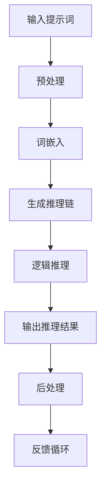

                 

# 大模型逻辑推理能力：提示词构建推理链

## 1. 引言

### 1.1 大模型逻辑推理能力概述

在人工智能领域，大型预训练模型（Large Pre-trained Models）如BERT、GPT和Turing等已经取得了令人瞩目的成就。这些模型在自然语言处理（NLP）任务中表现出色，例如文本分类、机器翻译和问答系统。然而，这些模型在逻辑推理任务上仍存在诸多挑战。

逻辑推理是智能行为的重要组成部分，其涉及从已知事实推导出新事实的能力。大模型在逻辑推理方面的能力主要体现在以下几个方面：

- **知识理解**：大模型可以通过学习大量的文本数据来理解各种知识概念及其相互关系。
- **推理链构建**：大模型能够根据提示词（Prompt）构建推理链，从中推导出新的结论。
- **逻辑判断**：大模型可以在复杂的逻辑框架内进行判断和决策。

### 1.2 提示词构建推理链

提示词是引导大模型进行逻辑推理的关键。一个有效的提示词可以帮助模型明确推理的方向和目标，从而提升推理的准确性和效率。

- **概念定义**：提示词（Prompt）是指为引导大模型进行特定任务而设计的一组文字或语言指令。
- **作用**：提示词可以起到以下作用：
  - **明确目标**：提示词帮助模型确定推理任务的目标，从而避免盲目推理。
  - **提供上下文**：提示词可以为模型提供必要的上下文信息，帮助模型更好地理解问题。
  - **引导推理路径**：提示词可以指导模型按照特定的逻辑路径进行推理。

### 1.3 大模型逻辑推理算法原理

大模型逻辑推理的算法原理主要包括以下几个方面：

- **知识嵌入**：将自然语言文本转换为向量表示，以便进行数学运算和推理。
- **推理算法**：基于图论、逻辑推理和概率图模型等理论，设计用于处理逻辑推理的算法。
- **训练策略**：通过大规模预训练和特定任务微调，提升模型在逻辑推理任务上的性能。

### 1.4 大模型逻辑推理应用案例

大模型逻辑推理在多个领域都有着广泛的应用，例如：

- **医学诊断**：利用大模型进行医学文献的阅读和理解，辅助医生进行疾病诊断。
- **法律咨询**：通过大模型对法律文本的解析，提供法律咨询服务。
- **教育辅导**：利用大模型为学生提供个性化的学习辅导，提升学习效果。

### 1.5 大模型逻辑推理性能评估

为了评估大模型在逻辑推理任务上的性能，可以采用以下指标：

- **准确性**：模型推理结果的准确性，即推理结果与真实结果的一致性。
- **效率**：模型进行推理的速度和资源消耗。
- **鲁棒性**：模型在面对不同类型和难度的逻辑问题时，保持稳定的表现。

### 1.6 大模型逻辑推理能力提升策略

为了进一步提升大模型在逻辑推理任务上的能力，可以从以下几个方面进行优化：

- **算法改进**：设计更有效的逻辑推理算法，提升模型的推理能力。
- **数据增强**：通过数据增强技术，扩充训练数据集，提高模型的泛化能力。
- **模型压缩**：采用模型压缩技术，减小模型体积，提升推理效率。

### 1.7 大模型逻辑推理能力前沿研究

当前，大模型逻辑推理能力的研究正不断推进，一些前沿研究方向包括：

- **跨模态推理**：研究如何结合不同类型的数据（如文本、图像、音频等），提升大模型的逻辑推理能力。
- **多语言推理**：研究如何使大模型能够在多种语言间进行逻辑推理，提高其在国际间的应用能力。
- **不确定性推理**：研究如何在逻辑推理中引入不确定性，提高模型在实际应用中的鲁棒性。

## 2. 设计《大模型逻辑推理能力：提示词构建推理链》的目录大纲

### 2.1 确定核心内容

#### 2.1.1 大模型逻辑推理能力概述

- 介绍大模型的逻辑推理能力及其重要性。
- 简要回顾相关历史背景和发展趋势。

#### 2.1.2 提示词构建推理链

- 提示词的概念和作用。
- 提示词构建推理链的方法和技术。

#### 2.1.3 大模型逻辑推理算法原理

- 逻辑推理算法的基础理论。
- 常见的大模型逻辑推理算法介绍。

#### 2.1.4 大模型逻辑推理应用案例

- 应用场景介绍。
- 案例分析和讲解。

#### 2.1.5 大模型逻辑推理性能评估

- 评估指标和方法。
- 实际应用中的性能评估案例。

#### 2.1.6 大模型逻辑推理能力提升策略

- 算法优化。
- 数据处理和特征工程。
- 模型压缩与加速。

#### 2.1.7 大模型逻辑推理能力前沿研究

- 最新研究进展。
- 未来发展趋势。

### 2.2 设计Mermaid流程图

在“2.1.3 大模型逻辑推理算法原理”章节中，可以使用Mermaid流程图来展示大模型逻辑推理的基本流程。



### 2.3 编写核心算法原理讲解的伪代码

在“2.1.3 大模型逻辑推理算法原理”章节中，可以使用伪代码来详细阐述大模型逻辑推理算法的原理。

```python
// 伪代码：大模型逻辑推理算法
function logical_reasoning(input_prompt):
    # 输入提示词预处理
    preprocessed_prompt = preprocess_prompt(input_prompt)
    
    # 提示词词嵌入
    word_embeddings = word_embedding(preprocessed_prompt)
    
    # 生成推理链
    reasoning_chain = generate_reasoning_chain(word_embeddings)
    
    # 逻辑推理
    reasoning_result = logical_inference(reasoning_chain)
    
    # 输出推理结果
    return reasoning_result
```

### 2.4 编写数学模型和数学公式

在“2.1.3 大模型逻辑推理算法原理”章节中，需要详细讲解相关的数学模型和数学公式。

```
$$
L(\theta) = -\frac{1}{m} \sum_{i=1}^{m} \sum_{j=1}^{n} y_j^{(i)} \log(p_{j}^{(i)})
$$

// 注释：这是一个损失函数的例子，用于计算预测概率的对数似然损失。
```

### 2.5 编写项目实战部分

在“2.1.4 大模型逻辑推理应用案例”章节中，需要提供具体的实际案例，包括开发环境搭建、源代码实现、代码解读和分析等。

```python
### 大模型逻辑推理应用案例：问答系统

#### 案例背景
- 开发一个基于大模型的问答系统，能够理解用户的自然语言问题，并给出合理的回答。

#### 开发环境搭建
- 使用Python和TensorFlow框架进行开发。

#### 源代码实现
```python
# 代码片段：问答系统实现
class QuestionAnsweringModel(nn.Module):
    def __init__(self):
        super(QuestionAnsweringModel, self).__init__()
        # 模型结构定义

    def forward(self, input_seq, question_seq):
        # 前向传播过程
        # ...

# 实例化模型并训练
model = QuestionAnsweringModel()
# 训练代码省略
```

#### 代码解读与分析
- 介绍模型的结构和训练过程。

```

## 3. 完成目录大纲

按照上述步骤，我们可以完成这本书的目录大纲：

# 大模型逻辑推理能力：提示词构建推理链

## 第一部分：引言

### 1.1 大模型逻辑推理能力概述

### 1.2 提示词构建推理链

### 1.3 大模型逻辑推理算法原理

### 1.4 大模型逻辑推理应用案例

### 1.5 大模型逻辑推理性能评估

### 1.6 大模型逻辑推理能力提升策略

### 1.7 大模型逻辑推理能力前沿研究

## 第二部分：核心内容详解

### 2.1 大模型逻辑推理能力概述

#### 2.1.1 大模型逻辑推理能力概述

#### 2.1.2 提示词的概念与作用

#### 2.1.3 提示词构建推理链的方法

### 2.2 提示词构建推理链

#### 2.2.1 提示词设计策略

#### 2.2.2 提示词构建推理链的流程

#### 2.2.3 提示词构建推理链的技术细节

### 2.3 大模型逻辑推理算法原理

#### 2.3.1 逻辑推理算法基础理论

#### 2.3.2 大模型逻辑推理算法介绍

#### 2.3.3 逻辑推理算法的优化策略

### 2.4 大模型逻辑推理应用案例

#### 2.4.1 应用场景介绍

#### 2.4.2 案例分析与讲解

### 2.5 大模型逻辑推理性能评估

#### 2.5.1 评估指标与方法

#### 2.5.2 性能评估案例分析

### 2.6 大模型逻辑推理能力提升策略

#### 2.6.1 算法优化

#### 2.6.2 数据处理与特征工程

#### 2.6.3 模型压缩与加速

### 2.7 大模型逻辑推理能力前沿研究

#### 2.7.1 最新研究进展

#### 2.7.2 未来发展趋势

## 第三部分：项目实战

### 3.1 大模型逻辑推理应用案例：问答系统

#### 3.1.1 案例背景

#### 3.1.2 开发环境搭建

#### 3.1.3 源代码实现

#### 3.1.4 代码解读与分析

#### 3.1.5 案例小结

## 第四部分：总结与展望

### 4.1 文章总结

### 4.2 最佳实践与注意事项

### 4.3 拓展阅读

### 4.4 结论与未来工作展望

### 参考文献

- 作者：AI天才研究院/AI Genius Institute & 禅与计算机程序设计艺术 /Zen And The Art of Computer Programming

---

通过以上详细的目录大纲设计，我们可以为撰写《大模型逻辑推理能力：提示词构建推理链》这篇文章奠定坚实的基础。接下来，我们将逐章节展开深入讨论，确保文章内容的丰富性和完整性。期待完成一篇既有深度又具实用价值的技术博客文章。

