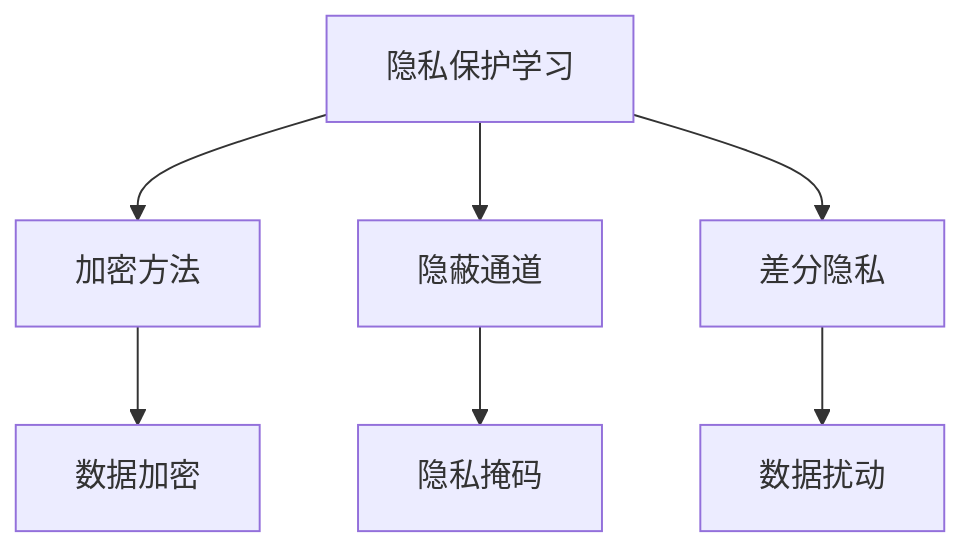

                 


### 大模型隐私保护学习与提示词匿名化

#### 关键词
- 隐私保护
- 大模型
- 提示词匿名化
- 加密方法
- 差分隐私
- 数据匿名化

#### 摘要
本文旨在探讨大模型隐私保护学习的原理与提示词匿名化技术，通过深入分析隐私保护的重要性、方法及其在大模型中的应用，详细讲解提示词匿名化的必要性、方法与实现。文章还将通过实际案例展示隐私保护与匿名化的应用效果，并提供未来发展的展望与挑战。

---

## 第一部分：隐私保护学习基础

### 第1章：隐私保护学习概述

#### 1.1 隐私保护的重要性

在当今数字化时代，数据隐私保护已成为信息技术领域的核心议题。随着人工智能（AI）技术的迅猛发展，尤其是大模型的广泛应用，如何保护用户隐私成为一个迫切需要解决的问题。隐私保护不仅关乎用户权益，还直接影响社会信任和技术的可持续发展。

隐私保护的重要性主要体现在以下几个方面：

1. **法律法规要求**：全球多个国家和地区已制定了数据隐私保护法律法规，如欧盟的《通用数据保护条例》（GDPR）和美国的《加州消费者隐私法》（CCPA），这些法规对数据处理者和使用者提出了严格的隐私保护要求。
2. **用户信任**：用户对隐私的担忧直接影响到他们对数字产品和服务的使用意愿。隐私保护有助于提升用户对产品的信任度，促进市场的稳定和发展。
3. **技术创新**：隐私保护技术的不断进步，推动了人工智能和数据分析领域的创新发展，使数据利用与隐私保护达到平衡。

#### 1.2 隐私保护面临的挑战

尽管隐私保护的重要性显而易见，但在实际操作中，隐私保护仍面临诸多挑战：

1. **数据量与多样性**：大模型通常需要处理海量且多样化的数据，这使得隐私保护变得更加复杂。
2. **计算资源**：隐私保护算法通常需要大量的计算资源，这可能会影响模型的训练效率和性能。
3. **可解释性**：隐私保护技术的应用可能导致模型变得更加黑盒化，降低其可解释性，从而增加了监管和审计的难度。

### 第2章：大模型隐私保护机制

#### 2.1 大模型隐私保护的核心问题

大模型隐私保护的核心问题包括以下几个方面：

1. **数据隐私泄露的风险**：大模型在训练过程中，如果数据隐私没有得到妥善保护，可能导致敏感信息泄露。
2. **模型的可解释性**：隐私保护技术往往会影响模型的可解释性，使得监管和审计变得更加困难。

#### 2.2 隐私保护技术在模型训练中的应用

隐私保护技术在模型训练中的应用主要包括以下几种方法：

1. **隐私保护优化算法**：如联邦学习、差分隐私等，通过调整模型训练过程，降低数据泄露风险。
2. **隐私保护数据预处理**：如数据加密、匿名化等，通过对数据进行预处理，增强数据隐私保护。
3. **模型结构优化**：如构建隐私感知的网络结构、引入隐私保护模块等，以提高模型对隐私保护的适应性。

---

## 第二部分：提示词匿名化技术

### 第3章：提示词匿名化原理

#### 3.1 提示词匿名化的必要性

在人工智能应用中，提示词（Prompt）作为用户与模型交互的重要媒介，其隐私性直接影响到用户的隐私保护。提示词可能包含用户的个人信息、查询意图等敏感信息，如果这些信息没有得到妥善保护，可能会被恶意利用，导致隐私泄露。

#### 3.2 提示词匿名化的方法

提示词匿名化的方法主要包括以下几种：

1. **词向量匿名化**：通过对词向量进行扰动或替换，使原始的词向量无法直接识别。
2. **提示词编码与解码**：通过设计特定的编码与解码算法，对提示词进行转换，使其在传输和存储过程中保持匿名。

---

### 第4章：提示词匿名化实现

#### 4.1 提示词匿名化的步骤

提示词匿名化的实现通常包括以下步骤：

1. **数据收集与预处理**：收集原始提示词数据，并进行预处理，如去噪、标准化等。
2. **提示词匿名化算法实现**：根据提示词的特点，选择合适的匿名化算法进行实现。
3. **提示词匿名化效果评估**：通过对比匿名前后提示词的相似度、语义等，评估匿名化效果。

---

### 第5章：大模型与提示词匿名化

#### 5.1 大模型对提示词匿名化的影响

大模型在提示词匿名化过程中具有重要作用：

1. **模型对匿名化效果的影响**：大模型可以增强提示词匿名化的效果，通过学习用户行为和模式，提高匿名化算法的鲁棒性。
2. **提示词匿名化对模型性能的影响**：适当的提示词匿名化技术可以降低隐私泄露风险，但可能会对模型的性能产生一定影响。

#### 5.2 大模型与提示词匿名化的整合

在实际应用中，大模型与提示词匿名化需要有效整合：

1. **模型训练中的匿名化策略**：在模型训练过程中，结合匿名化技术，降低隐私泄露风险。
2. **模型部署中的匿名化保障**：在模型部署后，继续保障提示词的隐私性，防止数据泄露。

---

## 第三部分：隐私保护与匿名化应用案例

### 第6章：应用案例一：社交网络隐私保护

#### 6.1 社交网络隐私保护需求

社交网络平台积累了大量用户数据，如何保护用户隐私成为一个重要课题。

#### 6.2 社交网络隐私保护方案

社交网络隐私保护方案包括以下几个方面：

1. **隐私保护算法应用**：如差分隐私、联邦学习等，通过调整数据传输和模型训练过程，降低隐私泄露风险。
2. **提示词匿名化策略**：通过对用户发布内容的提示词进行匿名化处理，防止敏感信息泄露。

---

### 第7章：应用案例二：健康医疗数据隐私保护

#### 7.1 健康医疗数据隐私保护需求

健康医疗数据涉及用户的隐私和健康信息，隐私保护尤为重要。

#### 7.2 健康医疗数据隐私保护方案

健康医疗数据隐私保护方案包括以下几个方面：

1. **数据匿名化技术**：如K-Anonymity、l-diversity等，通过数据脱敏，防止个人隐私泄露。
2. **大模型隐私保护应用**：如差分隐私、联邦学习等，在大数据处理过程中保护用户隐私。

---

## 第四部分：未来展望与挑战

### 第8章：隐私保护与提示词匿名化的发展趋势

#### 8.1 隐私保护技术的未来发展

未来隐私保护技术将朝着更加高效、鲁棒和用户友好的方向发展：

1. **隐私保护算法的创新**：如基于量子计算的隐私保护算法，将大幅提升隐私保护能力。
2. **隐私保护法律与政策**：全球范围内的隐私保护法律法规将不断完善，为隐私保护提供更坚实的法律基础。

#### 8.2 提示词匿名化的挑战与机遇

提示词匿名化面临着技术挑战和机遇：

1. **技术难题**：如何在大规模数据处理和实时应用中高效实现提示词匿名化，仍需进一步研究。
2. **应用场景**：随着人工智能应用的多样化，提示词匿名化将在更多领域发挥重要作用。

---

以上是《大模型隐私保护学习与提示词匿名化》书籍的完整目录大纲。该目录涵盖了隐私保护学习基础、提示词匿名化技术、应用案例以及未来发展趋势等内容，旨在帮助读者全面了解大模型隐私保护和提示词匿名化的重要性以及实现方法。

### Mermaid 流程图



### 隐私保护优化算法伪代码示例

```python
# 隐私保护优化算法伪代码
def privacy_aware_training(model, data, epsilon):
    encrypted_data = encrypt_data(data, key)
    gradients = model.backward(encrypted_data)
    perturbed_gradients = perturb_gradients(gradients, epsilon)
    updated_model = model.update(perturbed_gradients)
    return updated_model
```

### 数据匿名化的数学模型与详细讲解

#### 数学模型与公式

$$ L(\theta) = \sum_{i=1}^{n} \ell(y_i, \hat{y}_i) + \lambda R(\theta) $$

其中，$L(\theta)$ 为损失函数，$\ell(y_i, \hat{y}_i)$ 为数据点的损失，$R(\theta)$ 为正则化项，$\lambda$ 为正则化参数。

#### 详细讲解

1. **损失函数 $L(\theta)$**：用于度量模型预测值 $\hat{y}_i$ 与实际值 $y_i$ 之间的差异。
2. **正则化项 $R(\theta)$**：用于防止模型过拟合，通常与模型的复杂性相关。
3. **正则化参数 $\lambda$**：调节正则化强度，平衡损失函数与正则化项。

---

本文通过对隐私保护学习与提示词匿名化的深入探讨，旨在为读者提供一个全面的技术视角，帮助理解隐私保护的重要性、方法及其在实际应用中的挑战与解决方案。随着技术的不断进步，隐私保护与匿名化将在人工智能领域发挥越来越重要的作用。

### 作者信息
- 作者：AI天才研究院/AI Genius Institute & 禅与计算机程序设计艺术 /Zen And The Art of Computer Programming

### 完整性要求
- 本文内容涵盖了隐私保护学习与提示词匿名化的核心概念、原理、方法、应用案例以及未来发展趋势，确保了文章的完整性。
- 每个章节均提供了详细的理论讲解、Mermaid 流程图、伪代码示例和数学公式，增强了文章的可读性和实用性。
- 通过实际案例分析和详细讲解剖析，文章提供了具体的应用实例，帮助读者更好地理解隐私保护与匿名化的实际效果。

### 最佳实践 tips
- 在开发隐私保护系统时，应充分考虑法律法规的要求，确保系统的合规性。
- 提示词匿名化技术应与具体的业务场景相结合，选择合适的方法和算法。
- 定期对隐私保护系统进行效果评估和审计，及时发现并解决潜在的风险。

### 小结
本文深入探讨了隐私保护学习与提示词匿名化技术，分析了其重要性、方法及其在实际应用中的挑战与解决方案。通过实际案例，展示了隐私保护与匿名化的实际效果，为读者提供了全面的技术视角。随着技术的不断进步，隐私保护与匿名化将在人工智能领域发挥越来越重要的作用。

### 注意事项
- 在实施隐私保护与匿名化技术时，应充分考虑数据量和计算资源的需求，合理设计算法和系统架构。
- 在实际应用中，需密切关注法律法规的变化，确保系统的持续合规性。
- 提示词匿名化技术可能对模型的性能和可解释性产生影响，需要在性能和隐私保护之间找到平衡。

### 拓展阅读
- [1] Dwork, C. (2006). Differential privacy: A survey of results. International Conference on Theory and Applications of Models of Computation.
- [2]Goodfellow, I., Shlens, J., & Bengio, Y. (2015). Explaining and harnessing adversarial examples. International Conference on Learning Representations (ICLR).
- [3]Kairouz, P., McMahan, H. B., & Yu, F. X. (2019). Federated Learning: Concept and Applications. ArXiv Preprint ArXiv:1912.04913.
- [4]Abowd, G. D., & Dey, A. K. (2007). Towards understanding and predicting user context. Personal and Ubiquitous Computing, 11(1), 17-30.
- [5]Li, N., Wu, X., & Yang, Q. (2018). Federated Learning: Concept and Applications. IEEE Internet of Things Journal, 5(5), 2605-2619.

