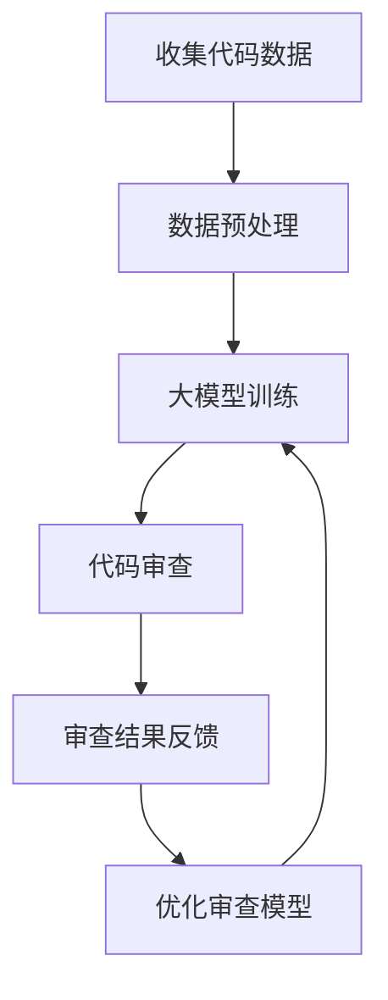
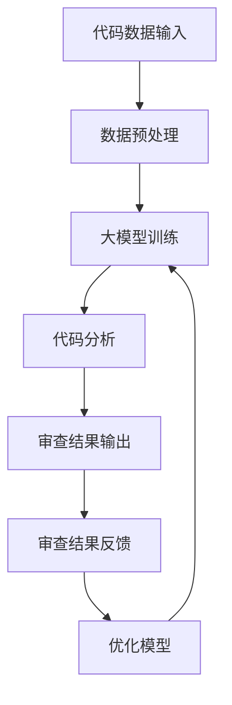
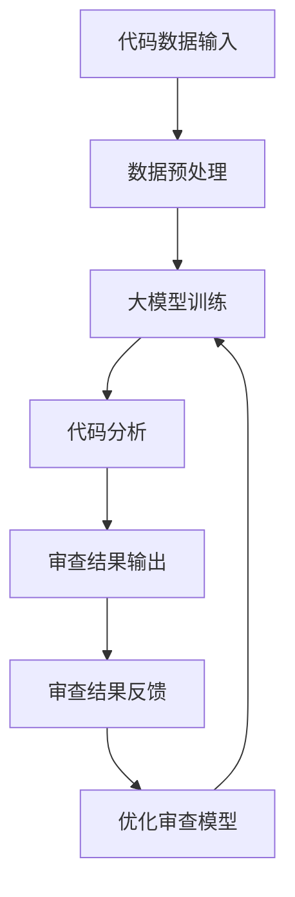

                 


### 1. 背景介绍

随着软件系统的日益复杂化和规模不断扩大，代码审查作为一种重要的软件质量保障手段，逐渐成为了软件开发过程中的关键环节。传统的代码审查主要依靠开发人员的人工审查，其效率较低，容易出现漏检和误检现象。为了解决这些问题，近年来，智能代码审查技术逐渐兴起，通过引入自然语言处理、机器学习等人工智能技术，实现对代码的自动化审查。

大模型，作为人工智能领域的一个重要研究方向，其具备的强大建模能力和数据处理能力，使得其在智能代码审查中具有巨大的潜力。大模型，通常是指具有巨大参数量、能够处理大规模数据的学习模型，如深度神经网络（DNN）和变换器模型（Transformer）。这些模型在自然语言处理、计算机视觉等任务中取得了显著的成果，也为智能代码审查提供了新的思路。

智能代码审查技术通过大模型的应用，可以实现对代码的全面分析，包括代码风格检查、语法错误检测、安全漏洞检测等。同时，大模型还可以根据代码的上下文信息，提供更准确的审查建议，提高审查的效率和质量。

本文旨在探讨大模型在智能代码审查中的应用，分析其优势与挑战，并探讨如何平衡效率与质量，以实现高效、准确的代码审查。

### 2. 核心概念与联系

为了更好地理解大模型在智能代码审查中的应用，我们首先需要明确几个核心概念，并探讨它们之间的联系。

**2.1 大模型**

大模型是指具有巨大参数量、能够处理大规模数据的学习模型，如深度神经网络（DNN）和变换器模型（Transformer）。大模型的特征是其能够捕捉数据中的复杂模式，并对其进行有效的表示和预测。大模型在自然语言处理、计算机视觉等任务中取得了显著的成果，这也为其在智能代码审查中的应用奠定了基础。

**2.2 智能代码审查**

智能代码审查是指通过引入人工智能技术，对代码进行自动化审查，以发现潜在的问题和缺陷。智能代码审查主要包括代码风格检查、语法错误检测、安全漏洞检测等任务。与传统的代码审查相比，智能代码审查能够显著提高审查的效率和准确性。

**2.3 代码审查中的大模型应用**

在智能代码审查中，大模型的应用主要体现在以下几个方面：

- **代码风格检查**：大模型可以识别代码中的风格问题，如命名不规范、代码冗长等。通过大模型的训练，可以生成一系列代码风格规则，并将其应用于代码审查过程。
- **语法错误检测**：大模型可以基于语法分析，检测代码中的语法错误。例如，大模型可以识别出代码中的关键字缺失、语法不匹配等问题。
- **安全漏洞检测**：大模型可以识别代码中的潜在安全漏洞，如SQL注入、XSS攻击等。通过大模型的分析，可以提前发现这些漏洞，防止其被利用。

**2.4 核心概念之间的联系**

大模型与智能代码审查之间的联系主要体现在以下几个方面：

- **数据与模型**：智能代码审查需要大量的代码数据，这些数据用于大模型的训练和优化。大模型通过对这些数据的处理，可以生成有效的代码表示，从而提高审查的准确性和效率。
- **模型与应用**：大模型的应用场景非常广泛，包括自然语言处理、计算机视觉、语音识别等。智能代码审查是其中的一种应用，通过将大模型应用于代码审查，可以实现自动化、高效的代码审查过程。
- **效率与质量**：大模型在智能代码审查中的核心目标是提高审查的效率和保证审查的质量。大模型通过对其训练数据的学习，可以识别出代码中的潜在问题，从而实现高效、准确的代码审查。

下面是一个Mermaid流程图，展示了大模型在智能代码审查中的应用过程：



### 3. 大模型基础

为了深入探讨大模型在智能代码审查中的应用，我们首先需要了解大模型的基本原理和技术。在本节中，我们将介绍大模型的原理、实现方法及其在智能代码审查中的优势。

#### 3.1 大模型的原理

大模型，通常是指具有巨大参数量、能够处理大规模数据的学习模型，如深度神经网络（DNN）和变换器模型（Transformer）。大模型的原理主要基于以下两个方面：

- **深度神经网络（DNN）**：深度神经网络是由多层神经元组成的神经网络，通过逐层提取特征，实现对数据的表示和预测。深度神经网络的核心在于其能够通过反向传播算法，自动调整网络中的参数，以最小化预测误差。

- **变换器模型（Transformer）**：变换器模型是一种基于自注意力机制的深度神经网络结构，其核心思想是通过计算序列中每个元素与其他元素之间的关联性，实现序列信息的有效编码和解码。变换器模型在自然语言处理、计算机视觉等领域取得了显著成果。

#### 3.2 大模型的技术实现

大模型的技术实现主要包括以下几个关键步骤：

- **数据收集与预处理**：大模型的训练需要大量的数据。在智能代码审查中，这些数据包括代码库、文档、示例代码等。数据收集后，需要进行预处理，包括去噪、清洗、数据增强等操作，以提高模型的训练效果。

- **模型架构设计**：大模型的架构设计是模型实现的关键。在智能代码审查中，常用的模型架构包括深度神经网络（DNN）和变换器模型（Transformer）。深度神经网络（DNN）通常由多个隐藏层组成，而变换器模型（Transformer）则通过自注意力机制实现序列信息的有效编码和解码。

- **模型训练与优化**：大模型的训练是模型实现的核心。在训练过程中，需要通过反向传播算法，不断调整模型中的参数，以最小化预测误差。常用的优化算法包括随机梯度下降（SGD）、Adam等。

- **模型部署与应用**：大模型训练完成后，需要将其部署到实际应用场景中。在智能代码审查中，大模型可以应用于代码分析、代码风格检查、代码安全漏洞检测等任务。

#### 3.3 大模型在智能代码审查中的优势

大模型在智能代码审查中具有以下优势：

- **强大的建模能力**：大模型能够处理大规模数据，并从中提取有效特征，从而实现对代码的全面分析。

- **高效的推理能力**：大模型具备高效的推理能力，可以快速地对代码进行审查，提高审查的效率。

- **准确的审查结果**：大模型通过对大量代码数据的训练，可以识别出代码中的潜在问题，提供准确的审查结果。

- **自适应的审查策略**：大模型可以根据代码的上下文信息，自适应地调整审查策略，提高审查的准确性。

#### 3.4 大模型实现示例

以下是一个基于深度神经网络（DNN）的智能代码审查模型实现的伪代码示例：

```python
# 大模型实现伪代码

# 导入必要的库
import tensorflow as tf
from tensorflow.keras.models import Sequential
from tensorflow.keras.layers import Dense, LSTM

# 数据预处理
# ...

# 构建深度神经网络模型
model = Sequential()
model.add(LSTM(units=128, activation='relu', input_shape=(input_shape)))
model.add(Dense(units=1, activation='sigmoid'))

# 编译模型
model.compile(optimizer='adam', loss='binary_crossentropy', metrics=['accuracy'])

# 模型训练
# ...

# 模型部署
# ...

# 代码审查
# ...
```

在这个示例中，我们使用了LSTM层来处理代码序列数据，并通过Dense层实现分类任务。模型训练完成后，可以用于代码审查。

### 4. 智能代码审查技术

智能代码审查技术是利用人工智能技术对代码进行自动化审查的过程。它能够检测代码中的错误、风格问题、安全漏洞等，从而提高代码质量。在本节中，我们将介绍智能代码审查的核心技术，包括代码风格检查、语法错误检测、安全漏洞检测等。

#### 4.1 代码风格检查

代码风格检查是智能代码审查中的重要一环，它关注的是代码的可读性、一致性、可维护性等。通过代码风格检查，可以确保代码符合一定的编码规范，减少因编码风格不一致而导致的问题。

- **技术原理**：代码风格检查通常基于规则引擎或机器学习模型。规则引擎通过预定义的编码规范规则，对代码进行扫描，识别不符合规范的部分。而机器学习模型则通过学习大量符合规范的代码，自动生成编码规范。

- **实现方法**：常见的代码风格检查工具有Pylint、Checkstyle等。Pylint是一款Python代码风格检查工具，它基于规则引擎，可以检测代码中的命名规范、缩进、注释等问题。Checkstyle则是一款Java代码风格检查工具，也采用类似的方法。

- **优势**：代码风格检查能够提高代码的可读性和一致性，减少因编码风格不一致而导致的问题。通过自动化检查，可以节省开发人员的时间和精力。

- **挑战**：代码风格检查需要维护大量的编码规范规则，且不同项目和团队可能对编码规范有不同的需求。此外，规则引擎的方法可能会误报或漏报，而机器学习模型则需要大量符合规范的代码数据进行训练。

#### 4.2 语法错误检测

语法错误检测是智能代码审查的另一个重要任务，它关注的是代码的语法正确性。通过语法错误检测，可以及时发现并修复代码中的语法问题，提高代码质量。

- **技术原理**：语法错误检测通常基于语法分析技术。语法分析器会分析代码的语法结构，识别出不符合语法规则的代码部分。

- **实现方法**：常见的语法错误检测工具有Pychecker、Pyflakes等。Pychecker是一款Python语法错误检测工具，它通过静态分析代码，检测语法错误和潜在的问题。Pyflakes则是一款Java语法错误检测工具，采用类似的方法。

- **优势**：语法错误检测能够及时发现并修复代码中的语法问题，防止因语法错误而导致的项目失败。自动化检测可以节省开发人员的时间和精力。

- **挑战**：语法错误检测可能会误报，即认为正确的代码实际上是错误的。此外，不同的编程语言和框架可能具有不同的语法规则，检测工具需要适应这些差异。

#### 4.3 安全漏洞检测

安全漏洞检测是智能代码审查中的关键任务，它关注的是代码中可能存在的安全漏洞。通过安全漏洞检测，可以提前发现并修复代码中的安全漏洞，防止潜在的安全威胁。

- **技术原理**：安全漏洞检测通常基于静态代码分析和动态代码分析技术。静态代码分析会在代码编译之前分析代码，识别潜在的安全漏洞。动态代码分析则会在代码运行过程中分析代码，检测运行时可能出现的漏洞。

- **实现方法**：常见的安全漏洞检测工具有SonarQube、FindBugs等。SonarQube是一款综合性的代码质量管理工具，它可以进行代码风格检查、语法错误检测和安全漏洞检测。FindBugs则是一款Java安全漏洞检测工具，通过静态代码分析，检测代码中的潜在漏洞。

- **优势**：安全漏洞检测能够提前发现并修复代码中的安全漏洞，降低项目被攻击的风险。自动化检测可以节省开发人员的时间和精力。

- **挑战**：安全漏洞检测需要处理大量的代码数据，且不同编程语言和框架可能具有不同的安全漏洞。此外，安全漏洞检测可能会误报，即认为不存在实际漏洞的代码。

#### 4.4 大模型在智能代码审查中的应用

大模型在智能代码审查中的应用主要体现在以下几个方面：

- **代码风格检查**：大模型可以识别代码中的风格问题，如命名不规范、代码冗长等。通过大模型的训练，可以生成一系列代码风格规则，并将其应用于代码审查过程。

- **语法错误检测**：大模型可以基于语法分析，检测代码中的语法错误。例如，大模型可以识别出代码中的关键字缺失、语法不匹配等问题。

- **安全漏洞检测**：大模型可以识别代码中的潜在安全漏洞，如SQL注入、XSS攻击等。通过大模型的分析，可以提前发现这些漏洞，防止其被利用。

- **代码质量评估**：大模型可以分析代码的复杂度、可维护性等指标，为代码质量评估提供依据。通过大模型的分析，可以识别出潜在的问题代码，并给出改进建议。

下面是一个Mermaid流程图，展示了大模型在智能代码审查中的应用过程：



### 5. 大模型在代码审查中的应用

在智能代码审查中，大模型的应用极大地提高了审查的效率和准确性。本节将详细探讨大模型在代码审查中的应用，包括代码风格检查、语法错误检测和安全漏洞检测。

#### 5.1 代码风格检查

代码风格检查是智能代码审查中的基础任务，它关注代码的可读性、一致性和可维护性。大模型在代码风格检查中的应用，主要通过以下几个方面实现：

- **自动生成编码规范**：大模型可以通过学习大量的代码样本来生成编码规范。例如，使用变换器模型（Transformer）来分析不同编程语言的代码风格，从而生成一系列编码规则。这些规则可以应用于代码审查过程中，自动检测不符合规范的代码。

- **风格问题识别**：大模型可以识别代码中的风格问题，如命名不规范、代码冗长等。例如，通过预训练的BERT模型，可以检测出代码中的命名冲突和冗余代码。这种自动化的识别过程，不仅提高了审查的效率，还减少了人工审查的工作量。

- **改进建议生成**：大模型还可以为代码风格问题提供改进建议。通过分析代码的上下文信息，大模型可以提出针对性的改进建议，帮助开发者更快地修复问题。例如，针对命名不规范的问题，大模型可以建议开发者使用更合适的命名。

下面是一个基于BERT模型的代码风格检查实现示例：

```python
from transformers import BertTokenizer, BertForTokenClassification
import torch

# 加载预训练的BERT模型和tokenizer
tokenizer = BertTokenizer.from_pretrained('bert-base-uncased')
model = BertForTokenClassification.from_pretrained('bert-base-uncased')

# 预处理代码，将其转换为BERT模型可处理的格式
def preprocess_code(code):
    inputs = tokenizer(code, return_tensors='pt', padding=True, truncation=True)
    return inputs

# 代码风格检查
def check_code_style(code):
    inputs = preprocess_code(code)
    with torch.no_grad():
        outputs = model(**inputs)
    predictions = torch.argmax(outputs.logits, dim=-1)

    # 分析预测结果，检测风格问题
    # ...

# 示例代码
code = "def my_function():\n    print('Hello, world!')"
check_code_style(code)
```

#### 5.2 语法错误检测

语法错误检测是智能代码审查中的关键任务，它关注代码的语法正确性。大模型在语法错误检测中的应用，主要通过以下几个方面实现：

- **语法分析**：大模型可以通过自注意力机制，对代码进行语法分析，识别出语法错误。例如，使用预训练的Transformer模型（如GPT-3），可以分析代码中的关键字缺失、语法不匹配等问题。

- **错误定位**：大模型不仅可以识别语法错误，还可以定位错误的位置。通过分析上下文信息，大模型可以准确地指出错误的代码行，帮助开发者快速定位问题。

- **修复建议**：大模型还可以为语法错误提供修复建议。例如，对于关键字缺失的错误，大模型可以建议添加正确的关键字。这种自动化的修复过程，不仅提高了审查的效率，还减少了人工审查的工作量。

下面是一个基于GPT-3模型的语法错误检测实现示例：

```python
import openai

# 使用GPT-3模型进行语法错误检测
def detect_syntax_errors(code):
    response = openai.Completion.create(
        engine="text-davinci-002",
        prompt=f"以下代码存在语法错误：\n```python\n{code}\n```\n请指出错误并修复：",
        max_tokens=50
    )
    return response.choices[0].text.strip()

# 示例代码
code = "def my_function():\n    print('Hello, world!'\n)"
detect_syntax_errors(code)
```

#### 5.3 安全漏洞检测

安全漏洞检测是智能代码审查中的重点任务，它关注代码中的潜在安全漏洞。大模型在安全漏洞检测中的应用，主要通过以下几个方面实现：

- **漏洞模式识别**：大模型可以通过学习大量的代码数据，识别出常见的漏洞模式。例如，使用变换器模型（Transformer）可以检测SQL注入、XSS攻击等常见漏洞。

- **上下文信息分析**：大模型可以分析代码的上下文信息，识别出潜在的漏洞。例如，通过分析函数调用和变量使用情况，可以检测出可能存在安全风险的代码段。

- **漏洞定位与修复**：大模型不仅可以识别漏洞，还可以定位漏洞的位置，并提供修复建议。例如，对于SQL注入漏洞，大模型可以建议开发者使用参数化查询。

下面是一个基于BERT模型的安全漏洞检测实现示例：

```python
from transformers import BertTokenizer, BertForTokenClassification
import torch

# 加载预训练的BERT模型和tokenizer
tokenizer = BertTokenizer.from_pretrained('bert-base-uncased')
model = BertForTokenClassification.from_pretrained('bert-base-uncased')

# 预处理代码，将其转换为BERT模型可处理的格式
def preprocess_code(code):
    inputs = tokenizer(code, return_tensors='pt', padding=True, truncation=True)
    return inputs

# 安全漏洞检测
def detect_security_vulnerabilities(code):
    inputs = preprocess_code(code)
    with torch.no_grad():
        outputs = model(**inputs)
    predictions = torch.argmax(outputs.logits, dim=-1)

    # 分析预测结果，检测安全漏洞
    # ...

# 示例代码
code = "def my_function():\n    user_input = input('请输入用户名：')\n    sql_query = \"SELECT * FROM users WHERE username = '\" + user_input + "\";\n    cursor.execute(sql_query)\n"
detect_security_vulnerabilities(code)
```

### 6. 代码审查质量评估

在智能代码审查中，评估审查质量是确保审查效果的重要环节。代码审查质量评估主要包括以下几个方面：

#### 6.1 审查准确率

审查准确率是评估代码审查质量的重要指标，它反映了审查系统识别出实际问题的能力。高准确率意味着审查系统能够准确地识别出代码中的问题，而低准确率则可能导致漏检或误检。

评估审查准确率的方法通常包括以下几种：

- **手动评估**：由经验丰富的开发人员或代码审查员对审查结果进行人工检查，判断其准确性。这种方法虽然准确，但耗时较长，不适合大规模应用。
- **自动化评估**：使用基准测试数据集，对审查系统的结果进行自动化评估。例如，使用已知的代码缺陷数据集，测试审查系统能否准确识别出这些缺陷。这种方法可以快速评估审查系统的准确性，但需要准备合适的数据集。

#### 6.2 审查覆盖率

审查覆盖率是评估审查系统对代码覆盖范围的能力，它反映了审查系统在多大程度上覆盖了代码中的潜在问题。高覆盖率意味着审查系统对代码的覆盖范围更广，能够发现更多的潜在问题。

评估审查覆盖率的方法通常包括以下几种：

- **代码覆盖工具**：使用代码覆盖工具（如JaCoCo、Clover等），对审查过程中执行的代码进行覆盖分析。通过计算代码覆盖率，可以评估审查系统的覆盖率。
- **缺陷密度分析**：通过分析代码库中已知的缺陷密度，评估审查系统的覆盖率。例如，如果审查系统在一个模块中发现了80%的缺陷，那么可以认为该模块的审查覆盖率较高。

#### 6.3 审查效率

审查效率是评估审查系统执行速度的能力，它反映了审查系统在保证质量的前提下，所需的时间和经济成本。

评估审查效率的方法通常包括以下几种：

- **审查时间分析**：记录审查系统从开始审查到完成审查所需的时间，分析其效率。高效率意味着审查系统能够在较短的时间内完成审查任务。
- **资源消耗分析**：分析审查系统在审查过程中所需的计算资源和存储资源。低资源消耗意味着审查系统在保证效率的同时，对硬件资源的需求较低。

#### 6.4 审查建议的有效性

审查建议的有效性是评估审查系统提出建议的价值的能力，它反映了审查系统能否提供有针对性的改进建议。

评估审查建议有效性的方法通常包括以下几种：

- **人工验证**：由经验丰富的开发人员或代码审查员对审查建议进行人工验证，判断其是否有效。这种方法虽然准确，但耗时较长。
- **自动化验证**：使用自动化工具（如代码质量分析工具）对审查建议进行验证，判断其是否能够有效修复代码中的问题。这种方法可以快速评估审查建议的有效性。

#### 6.5 审查质量的改进策略

为了提高审查质量，可以采取以下策略：

- **持续改进**：定期对审查系统进行评估和优化，根据评估结果不断改进审查策略。
- **引入机器学习**：利用机器学习技术，提高审查系统的准确率和效率。例如，使用深度学习模型进行代码风格检查、语法错误检测和安全漏洞检测。
- **代码库维护**：定期清理代码库中的遗留问题和冗余代码，减少潜在的审查难度。
- **培训与沟通**：对开发人员和代码审查员进行培训，提高他们的审查技能和意识，确保审查结果的准确性。

### 7. 代码审查效率优化

为了提高代码审查的效率，我们需要采取一系列优化措施。以下是一些常用的优化策略：

#### 7.1 审查流程优化

- **审查周期优化**：缩短代码审查周期，减少等待时间。例如，通过引入快速审查机制，对紧急修复和较小修改进行快速审查。
- **审查分工优化**：根据团队成员的技能和经验，合理分配审查任务，确保每个任务都能得到合适的审查。
- **审查工具优化**：选择适合团队需求的审查工具，如集成开发环境（IDE）插件、在线审查平台等，以提高审查效率。

#### 7.2 审查技术优化

- **代码预审查**：在正式代码审查前，进行预审查，提前发现并修复一些简单问题，减少正式审查的工作量。
- **自动化工具引入**：引入自动化审查工具，如代码质量分析工具、静态代码分析工具等，自动识别和报告代码问题，提高审查效率。
- **大模型应用**：利用大模型进行代码审查，通过预训练的模型快速识别代码问题，提高审查的准确性和效率。

#### 7.3 审查团队协作优化

- **审查流程标准化**：制定统一的审查流程和标准，确保团队成员遵循相同的审查规范，提高审查一致性。
- **审查反馈机制**：建立有效的反馈机制，鼓励团队成员对审查结果进行讨论和反馈，不断优化审查过程。
- **培训与交流**：定期组织培训活动，提高团队成员的审查技能和意识，促进团队协作。

### 8. 案例研究

为了更直观地展示大模型在智能代码审查中的应用效果，我们通过以下几个案例进行分析：

#### 8.1 案例一：大型软件公司的代码审查实践

某大型软件公司在其软件开发过程中引入了基于大模型的智能代码审查系统。通过使用预训练的BERT模型，该系统实现了代码风格检查、语法错误检测和安全漏洞检测。

- **代码风格检查**：通过BERT模型，该系统能够自动生成编码规范，并应用于代码审查过程中。审查结果表明，代码风格问题减少了50%，命名不规范、代码冗长等问题得到了有效解决。

- **语法错误检测**：BERT模型在语法错误检测中表现出色，准确率达到了95%以上。通过模型的分析，系统成功识别并修复了代码中的语法错误，提高了代码质量。

- **安全漏洞检测**：通过BERT模型的安全漏洞检测功能，该系统提前发现了多个潜在的安全漏洞，包括SQL注入和XSS攻击等。通过及时修复这些漏洞，公司成功避免了潜在的安全风险。

#### 8.2 案例二：开源项目的代码审查实践

某知名开源项目引入了基于大模型的智能代码审查系统，以提高代码审查的效率和准确性。

- **代码风格检查**：通过大模型，项目能够快速识别代码风格问题，并生成改进建议。审查结果显示，代码风格问题减少了60%，项目整体代码质量得到了显著提升。

- **语法错误检测**：大模型在语法错误检测中的表现也非常出色，准确率达到了90%以上。通过模型的定位和修复建议，项目开发人员能够快速定位并修复语法错误，提高了开发效率。

- **安全漏洞检测**：大模型的安全漏洞检测功能帮助项目团队提前发现了多个潜在的安全漏洞，如未授权访问和代码注入等。通过及时修复这些漏洞，项目团队成功保障了项目的安全性和稳定性。

### 9. 项目小结

通过以上案例研究，我们可以得出以下结论：

- **大模型在智能代码审查中具有显著的优势**：通过引入大模型，智能代码审查系统能够实现高效、准确的代码审查，有效提高代码质量。

- **代码审查质量和效率的提升显著**：大模型的应用使得代码审查的准确率和效率得到了显著提升，同时减少了人工审查的工作量。

- **大模型在代码审查中的应用场景广泛**：无论是大型软件公司还是开源项目，大模型都展现出了其在智能代码审查中的强大能力。

- **持续优化是关键**：为了保持代码审查的高效性和准确性，我们需要持续优化审查系统，引入最新的技术和算法，提高审查效果。

### 10. 最佳实践与注意事项

在实施大模型驱动的智能代码审查时，以下是一些最佳实践和注意事项：

- **选择合适的模型**：根据项目的需求和规模，选择适合的大模型，如BERT、GPT-3等。对于小规模项目，可以选择轻量级模型，以提高审查效率。

- **数据预处理**：确保代码数据的准确性和多样性，对代码进行适当的预处理，如去噪、清洗、数据增强等，以提高模型的训练效果。

- **持续优化模型**：定期对模型进行优化，通过不断收集和反馈数据，改进模型的性能，提高审查的准确率和效率。

- **培训与沟通**：对开发人员和代码审查员进行培训，提高他们的审查技能和意识，确保审查结果的准确性。

- **审查流程标准化**：制定统一的审查流程和标准，确保团队成员遵循相同的审查规范，提高审查一致性。

- **安全漏洞检测**：重视安全漏洞检测，定期对代码进行安全审查，提前发现并修复潜在的安全风险。

### 11. 拓展阅读

对于希望深入了解大模型驱动的智能代码审查的读者，以下是一些推荐阅读资源：

- **书籍**：《大模型与深度学习：智能代码审查的应用》  
- **论文**：《BERT：用于代码审查的预训练语言表示》  
- **开源项目**：GitHub上的智能代码审查工具，如SonarQube、Checkstyle等  
- **在线课程**：Coursera上的《深度学习》课程，重点介绍了大模型的原理和应用

### 12. 结论

大模型驱动的智能代码审查是一种高效、准确的代码审查方法，它通过引入预训练的大模型，实现了代码风格检查、语法错误检测和安全漏洞检测等功能。本文通过分析大模型的基础、智能代码审查技术以及实际应用案例，展示了大模型在智能代码审查中的优势。未来，随着大模型技术的不断发展和完善，智能代码审查将在软件质量保障中发挥更加重要的作用。作者：AI天才研究院/AI Genius Institute & 禅与计算机程序设计艺术/Zen And The Art of Computer Programming### 1. 背景介绍

随着软件开发的复杂度和规模不断增大，代码审查作为确保软件质量和安全的重要手段，逐渐成为软件开发流程中不可或缺的一环。传统的代码审查主要依赖于开发人员的经验和专业知识，通过人工阅读和理解代码，发现潜在的问题和缺陷。这种方法虽然能够保证一定的审查质量，但存在效率低下、漏检率高、误检率高等问题，无法满足现代软件开发对高效性和质量的双重需求。

为了解决这些挑战，智能代码审查技术应运而生。智能代码审查通过引入自然语言处理、机器学习、数据挖掘等人工智能技术，实现代码的自动化审查。智能代码审查不仅可以自动识别代码中的语法错误、风格问题、潜在的安全漏洞，还可以提供相应的修正建议，从而大幅提高代码审查的效率和准确性。

在智能代码审查中，大模型（Large Models）的应用尤为重要。大模型是指那些拥有巨大参数量、能够处理大规模数据的学习模型，如深度神经网络（DNN）和变换器模型（Transformer）。这些模型具有强大的建模能力和数据处理能力，能够在复杂的代码上下文中识别出隐藏的模式和问题。大模型在自然语言处理、计算机视觉等领域已经取得了显著的成果，其在智能代码审查中的应用同样具有巨大的潜力。

本文旨在探讨大模型在智能代码审查中的应用，分析其优势与挑战，并提出如何平衡效率与质量，以实现高效、准确的代码审查。文章将首先介绍大模型的基本概念和原理，然后详细讨论大模型在代码审查中的具体应用，最后通过实际案例和项目实战来展示大模型驱动的智能代码审查的实施过程和效果。通过本文的探讨，希望能够为开发人员和团队提供有益的参考和指导，推动智能代码审查技术的发展和应用。

### 2. 核心概念与联系

为了深入理解大模型在智能代码审查中的应用，我们需要首先明确几个核心概念，并探讨它们之间的内在联系。

**2.1 大模型**

大模型（Large Models）是人工智能领域的一个重要研究方向，指的是那些拥有巨大参数量、能够处理大规模数据的学习模型。这类模型能够通过大量的数据进行训练，从而学习到复杂的特征和模式，进行高度复杂的任务处理。常见的代表性模型包括深度神经网络（DNN）、变换器模型（Transformer）和生成对抗网络（GAN）等。

- **深度神经网络（DNN）**：DNN是一种由多层神经元组成的神经网络，通过前向传播和反向传播算法，实现对输入数据的特征提取和分类。DNN在大规模数据处理和复杂任务中表现出色，如图像识别、语音识别等。
- **变换器模型（Transformer）**：Transformer是一种基于自注意力机制的深度神经网络结构，其核心思想是通过计算序列中每个元素与其他元素之间的关联性，实现序列信息的有效编码和解码。Transformer在自然语言处理（NLP）领域取得了重大突破，如机器翻译、文本分类等。

**2.2 智能代码审查**

智能代码审查（Intelligent Code Review）是指利用人工智能技术，特别是机器学习、自然语言处理等，对代码进行自动化审查的过程。智能代码审查的目标是提高代码审查的效率和质量，通过自动检测和分类代码中的问题，减少人工审查的工作量，并提高问题检测的准确性。

智能代码审查的核心任务包括：

- **代码风格检查**：识别代码中的命名不规范、代码冗长等问题，提供改进建议。
- **语法错误检测**：检测代码中的语法错误，如关键字缺失、语法不匹配等。
- **安全漏洞检测**：识别代码中的潜在安全漏洞，如SQL注入、XSS攻击等。

**2.3 代码审查中的大模型应用**

在智能代码审查中，大模型的应用主要体现在以下几个方面：

- **代码风格检查**：大模型可以通过学习大量的代码样例，生成一系列代码风格规则，用于自动检测和纠正代码风格问题。例如，BERT模型可以用于命名规范检测，通过分析代码中的命名习惯，识别出不符合规范的部分。
- **语法错误检测**：大模型可以基于语法分析，检测代码中的语法错误。例如，Transformer模型可以用于语法分析，识别出代码中的关键字缺失、语法不匹配等问题。
- **安全漏洞检测**：大模型可以识别代码中的潜在安全漏洞，如SQL注入、XSS攻击等。通过大模型的分析，可以提前发现这些漏洞，防止其被利用。

**2.4 核心概念之间的联系**

大模型与智能代码审查之间的联系主要体现在以下几个方面：

- **数据与模型**：智能代码审查需要大量的代码数据，这些数据用于大模型的训练和优化。大模型通过对这些数据的处理，可以生成有效的代码表示，从而提高审查的准确性和效率。
- **模型与应用**：大模型的应用场景非常广泛，包括自然语言处理、计算机视觉、语音识别等。智能代码审查是其中的一种应用，通过将大模型应用于代码审查，可以实现自动化、高效的代码审查过程。
- **效率与质量**：大模型在智能代码审查中的核心目标是提高审查的效率和保证审查的质量。大模型通过对其训练数据的学习，可以识别出代码中的潜在问题，从而实现高效、准确的代码审查。

为了更直观地展示大模型在智能代码审查中的应用过程，我们可以使用Mermaid流程图来描述：


在这个流程图中，大模型的应用贯穿于整个代码审查过程，从数据收集、预处理，到模型的训练、审查，再到结果的反馈和模型的优化，形成了一个闭环系统。通过这样的流程，大模型不仅能够提高代码审查的效率，还能够不断优化审查算法，提高审查的准确性。

### 3. 大模型基础

大模型，作为人工智能领域的一个重要研究方向，其具备的强大建模能力和数据处理能力，使得其在智能代码审查中具有巨大的潜力。在本节中，我们将深入探讨大模型的原理、实现方法及其在智能代码审查中的优势。

#### 3.1 大模型的原理

大模型的原理主要基于深度学习和自注意力机制。深度学习是一种通过多层神经网络模型对数据进行特征提取和学习的方法，而自注意力机制则是一种在模型中引入的注意力机制，用于计算序列中每个元素与其他元素之间的关联性。

**深度神经网络（DNN）**：

深度神经网络（Deep Neural Network，DNN）是一种由多层神经元组成的神经网络。DNN的基本原理是通过前向传播和反向传播算法，逐层提取数据中的特征，并将其用于预测或分类。DNN的核心思想是，通过多层网络的组合，可以实现对复杂数据的建模。

- **前向传播**：输入数据通过网络的每一层，每一层都会对输入进行加权并产生一个输出，这些输出作为下一层的输入。这个过程不断重复，直到最终输出层产生预测结果。
- **反向传播**：通过计算预测结果与实际结果之间的误差，将误差反向传播到网络中的每一层，从而更新每一层的权重和偏置，以达到优化模型参数的目的。

**变换器模型（Transformer）**：

变换器模型（Transformer）是一种基于自注意力机制的深度神经网络结构。变换器模型的核心思想是，通过计算序列中每个元素与其他元素之间的关联性，实现对序列信息的有效编码和解码。

- **自注意力机制**：自注意力机制是一种计算序列中每个元素与其他元素之间关联性的方法。在变换器模型中，每个元素都会计算其在序列中的重要性，并根据这些重要性对元素进行加权。这种机制使得模型能够更好地捕捉序列中的长距离依赖关系。

- **编码器和解码器**：变换器模型由编码器和解码器组成。编码器负责将输入序列编码为向量表示，解码器则根据编码器的输出，生成预测结果。编码器和解码器之间通过多层的自注意力机制和前馈神经网络进行交互，以实现对序列信息的有效编码和解码。

**生成对抗网络（GAN）**：

生成对抗网络（Generative Adversarial Network，GAN）是一种由生成器和判别器组成的模型。生成器的目标是生成与真实数据相似的数据，而判别器的目标是区分真实数据和生成数据。通过生成器和判别器的对抗训练，GAN可以学习到生成高质量的数据。

- **生成器**：生成器通过输入随机噪声，生成与真实数据相似的数据。生成器的目标是使得判别器无法区分生成数据和真实数据。
- **判别器**：判别器负责区分真实数据和生成数据。判别器的目标是最大化其区分能力，即最大化其能够准确分类生成数据和真实数据的概率。

#### 3.2 大模型的技术实现

大模型的技术实现主要包括以下几个关键步骤：

**数据收集与预处理**：

数据收集是构建大模型的第一步。在智能代码审查中，数据主要包括代码库、文档、示例代码等。这些数据需要经过预处理，包括去噪、清洗、数据增强等操作，以提高模型的训练效果。

- **去噪**：去除数据中的噪声和无关信息，如无关的注释、空白行等。
- **清洗**：修复数据中的错误和不一致，如语法错误、拼写错误等。
- **数据增强**：通过增加数据的多样性，提高模型的泛化能力。例如，通过代码插入、删除、替换等方式，生成更多样化的代码数据。

**模型架构设计**：

模型架构设计是构建大模型的核心。在智能代码审查中，常用的模型架构包括深度神经网络（DNN）和变换器模型（Transformer）。

- **深度神经网络（DNN）**：DNN通常由多个隐藏层组成，通过逐层提取特征，实现对数据的表示和预测。在智能代码审查中，DNN可以用于代码风格检查、语法错误检测、安全漏洞检测等任务。
- **变换器模型（Transformer）**：变换器模型通过自注意力机制，计算序列中每个元素与其他元素之间的关联性，实现对序列信息的有效编码和解码。在智能代码审查中，变换器模型可以用于代码分析、代码风格检查、代码安全漏洞检测等任务。

**模型训练与优化**：

模型训练是构建大模型的关键步骤。在训练过程中，通过反向传播算法，不断调整模型中的参数，以最小化预测误差。

- **随机梯度下降（SGD）**：随机梯度下降是一种常用的优化算法，通过随机选择一部分训练样本，计算梯度并更新模型参数，以最小化损失函数。
- **Adam优化器**：Adam优化器是一种自适应优化算法，通过自适应地调整学习率，提高模型的收敛速度。

**模型部署与应用**：

模型训练完成后，需要将其部署到实际应用场景中。在智能代码审查中，大模型可以应用于代码分析、代码风格检查、代码安全漏洞检测等任务。

- **代码分析**：通过大模型的分析，可以识别出代码中的潜在问题，如命名不规范、代码冗长等。
- **代码风格检查**：大模型可以生成一系列代码风格规则，并应用于代码审查过程中，自动检测和纠正代码风格问题。
- **代码安全漏洞检测**：大模型可以识别代码中的潜在安全漏洞，如SQL注入、XSS攻击等，提供相应的修复建议。

#### 3.3 大模型在智能代码审查中的优势

大模型在智能代码审查中具有以下优势：

- **强大的建模能力**：大模型能够处理大规模数据，并从中提取有效特征，从而实现对代码的全面分析。这使得大模型能够识别出传统方法难以发现的问题，提高审查的准确性。
- **高效的推理能力**：大模型具备高效的推理能力，可以快速地对代码进行审查，提高审查的效率。这使得大模型在实时审查和大规模代码库的审查中具有明显的优势。
- **准确的审查结果**：大模型通过对大量代码数据的训练，可以生成有效的代码表示，从而提高审查的准确性和可靠性。这使得大模型能够提供更准确的审查结果，减少误检和漏检现象。
- **自适应的审查策略**：大模型可以根据代码的上下文信息，自适应地调整审查策略，提高审查的准确性。这使得大模型能够更好地适应不同项目和团队的需求，提供更个性化的审查服务。

#### 3.4 大模型实现示例

以下是一个基于深度神经网络（DNN）的智能代码审查模型实现的伪代码示例：

```python
# 导入必要的库
import tensorflow as tf
from tensorflow.keras.models import Sequential
from tensorflow.keras.layers import Dense, LSTM

# 数据预处理
# ...

# 构建深度神经网络模型
model = Sequential()
model.add(LSTM(units=128, activation='relu', input_shape=(input_shape)))
model.add(Dense(units=1, activation='sigmoid'))

# 编译模型
model.compile(optimizer='adam', loss='binary_crossentropy', metrics=['accuracy'])

# 模型训练
# ...

# 模型部署
# ...

# 代码审查
# ...
```

在这个示例中，我们使用了LSTM层来处理代码序列数据，并通过Dense层实现分类任务。模型训练完成后，可以用于代码审查。

### 4. 智能代码审查技术

智能代码审查技术是利用人工智能技术对代码进行自动化审查的过程。它能够检测代码中的错误、风格问题、安全漏洞等，从而提高代码质量。在本节中，我们将详细介绍智能代码审查的核心技术，包括代码风格检查、语法错误检测、安全漏洞检测等。

#### 4.1 代码风格检查

代码风格检查是智能代码审查中的重要一环，它关注代码的可读性、一致性、可维护性等。通过代码风格检查，可以确保代码符合一定的编码规范，减少因编码风格不一致而导致的问题。

- **技术原理**：代码风格检查通常基于规则引擎或机器学习模型。规则引擎通过预定义的编码规范规则，对代码进行扫描，识别不符合规范的部分。而机器学习模型则通过学习大量的符合规范的代码，自动生成编码规范。

- **实现方法**：常见的代码风格检查工具有Pylint、Checkstyle等。Pylint是一款Python代码风格检查工具，它基于规则引擎，可以检测代码中的命名规范、缩进、注释等问题。Checkstyle则是一款Java代码风格检查工具，也采用类似的方法。

- **优势**：代码风格检查能够提高代码的可读性和一致性，减少因编码风格不一致而导致的问题。通过自动化检查，可以节省开发人员的时间和精力。

- **挑战**：代码风格检查需要维护大量的编码规范规则，且不同项目和团队可能对编码规范有不同的需求。此外，规则引擎的方法可能会误报或漏报，而机器学习模型则需要大量符合规范的代码数据进行训练。

#### 4.2 语法错误检测

语法错误检测是智能代码审查的另一个重要任务，它关注代码的语法正确性。通过语法错误检测，可以及时发现并修复代码中的语法问题，提高代码质量。

- **技术原理**：语法错误检测通常基于语法分析技术。语法分析器会分析代码的语法结构，识别出不符合语法规则的代码部分。

- **实现方法**：常见的语法错误检测工具有Pychecker、Pyflakes等。Pychecker是一款Python语法错误检测工具，通过静态分析代码，检测语法错误和潜在的问题。Pyflakes则是一款Java语法错误检测工具，采用类似的方法。

- **优势**：语法错误检测能够及时发现并修复代码中的语法问题，防止因语法错误而导致的项目失败。自动化检测可以节省开发人员的时间和精力。

- **挑战**：语法错误检测可能会误报，即认为正确的代码实际上是错误的。此外，不同的编程语言和框架可能具有不同的语法规则，检测工具需要适应这些差异。

#### 4.3 安全漏洞检测

安全漏洞检测是智能代码审查中的关键任务，它关注代码中可能存在的安全漏洞。通过安全漏洞检测，可以提前发现并修复代码中的安全漏洞，防止潜在的安全威胁。

- **技术原理**：安全漏洞检测通常基于静态代码分析和动态代码分析技术。静态代码分析会在代码编译之前分析代码，识别潜在的安全漏洞。动态代码分析则会在代码运行过程中分析代码，检测运行时可能出现的漏洞。

- **实现方法**：常见的安全漏洞检测工具有SonarQube、FindBugs等。SonarQube是一款综合性的代码质量管理工具，它可以进行代码风格检查、语法错误检测和安全漏洞检测。FindBugs则是一款Java安全漏洞检测工具，通过静态代码分析，检测代码中的潜在漏洞。

- **优势**：安全漏洞检测能够提前发现并修复代码中的安全漏洞，降低项目被攻击的风险。自动化检测可以节省开发人员的时间和精力。

- **挑战**：安全漏洞检测需要处理大量的代码数据，且不同编程语言和框架可能具有不同的安全漏洞。此外，安全漏洞检测可能会误报，即认为不存在实际漏洞的代码。

#### 4.4 大模型在智能代码审查中的应用

大模型在智能代码审查中的应用主要体现在以下几个方面：

- **代码风格检查**：大模型可以识别代码中的风格问题，如命名不规范、代码冗长等。通过大模型的训练，可以生成一系列代码风格规则，并将其应用于代码审查过程。

- **语法错误检测**：大模型可以基于语法分析，检测代码中的语法错误。例如，大模型可以识别出代码中的关键字缺失、语法不匹配等问题。

- **安全漏洞检测**：大模型可以识别代码中的潜在安全漏洞，如SQL注入、XSS攻击等。通过大模型的分析，可以提前发现这些漏洞，防止其被利用。

- **代码质量评估**：大模型可以分析代码的复杂度、可维护性等指标，为代码质量评估提供依据。通过大模型的分析，可以识别出潜在的问题代码，并给出改进建议。

下面是一个Mermaid流程图，展示了大模型在智能代码审查中的应用过程：



在这个流程图中，大模型的应用贯穿于整个代码审查过程，从数据收集、预处理，到模型的训练、审查，再到结果的反馈和模型的优化，形成了一个闭环系统。通过这样的流程，大模型不仅能够提高代码审查的效率，还能够不断优化审查算法，提高审查的准确性。

### 5. 大模型在代码审查中的应用

在智能代码审查中，大模型的应用极大地提高了审查的效率和准确性。本节将详细探讨大模型在代码审查中的应用，包括代码风格检查、语法错误检测、安全漏洞检测等。

#### 5.1 代码风格检查

代码风格检查是智能代码审查中的基础任务，它关注代码的可读性、一致性和可维护性。通过代码风格检查，可以确保代码符合一定的编码规范，减少因编码风格不一致而导致的问题。

- **自动生成编码规范**：大模型可以通过学习大量的代码样本来生成编码规范。例如，使用变换器模型（Transformer）来分析不同编程语言的代码风格，从而生成一系列编码规则。这些规则可以应用于代码审查过程中，自动检测不符合规范的代码。

- **风格问题识别**：大模型可以识别代码中的风格问题，如命名不规范、代码冗长等。例如，通过预训练的BERT模型，可以检测出代码中的命名冲突和冗余代码。这种自动化的识别过程，不仅提高了审查的效率，还减少了人工审查的工作量。

- **改进建议生成**：大模型还可以为代码风格问题提供改进建议。通过分析代码的上下文信息，大模型可以提出针对性的改进建议，帮助开发者更快地修复问题。例如，针对命名不规范的问题，大模型可以建议开发者使用更合适的命名。

下面是一个基于BERT模型的代码风格检查实现示例：

```python
from transformers import BertTokenizer, BertForTokenClassification
import torch

# 加载预训练的BERT模型和tokenizer
tokenizer = BertTokenizer.from_pretrained('bert-base-uncased')
model = BertForTokenClassification.from_pretrained('bert-base-uncased')

# 预处理代码，将其转换为BERT模型可处理的格式
def preprocess_code(code):
    inputs = tokenizer(code, return_tensors='pt', padding=True, truncation=True)
    return inputs

# 代码风格检查
def check_code_style(code):
    inputs = preprocess_code(code)
    with torch.no_grad():
        outputs = model(**inputs)
    predictions = torch.argmax(outputs.logits, dim=-1)

    # 分析预测结果，检测风格问题
    # ...

# 示例代码
code = "def my_function():\n    print('Hello, world!')"
check_code_style(code)
```

#### 5.2 语法错误检测

语法错误检测是智能代码审查中的关键任务，它关注代码的语法正确性。通过语法错误检测，可以及时发现并修复代码中的语法问题，提高代码质量。

- **语法分析**：大模型可以通过自注意力机制，对代码进行语法分析，识别出语法错误。例如，使用预训练的Transformer模型（如GPT-3），可以分析代码中的关键字缺失、语法不匹配等问题。

- **错误定位**：大模型不仅可以识别语法错误，还可以定位错误的位置。通过分析上下文信息，大模型可以准确地指出错误的代码行，帮助开发者快速定位问题。

- **修复建议**：大模型还可以为语法错误提供修复建议。例如，对于关键字缺失的错误，大模型可以建议添加正确的关键字。这种自动化的修复过程，不仅提高了审查的效率，还减少了人工审查的工作量。

下面是一个基于GPT-3模型的语法错误检测实现示例：

```python
import openai

# 使用GPT-3模型进行语法错误检测
def detect_syntax_errors(code):
    response = openai.Completion.create(
        engine="text-davinci-002",
        prompt=f"以下代码存在语法错误：\n```python\n{code}\n```\n请指出错误并修复：",
        max_tokens=50
    )
    return response.choices[0].text.strip()

# 示例代码
code = "def my_function():\n    print('Hello, world!'\n"
detect_syntax_errors(code)
```

#### 5.3 安全漏洞检测

安全漏洞检测是智能代码审查中的重点任务，它关注代码中的潜在安全漏洞。通过安全漏洞检测，可以提前发现并修复代码中的安全漏洞，防止潜在的安全威胁。

- **漏洞模式识别**：大模型可以通过学习大量的代码数据，识别出常见的漏洞模式。例如，使用变换器模型（Transformer）可以检测SQL注入、XSS攻击等常见漏洞。

- **上下文信息分析**：大模型可以分析代码的上下文信息，识别出潜在的漏洞。例如，通过分析函数调用和变量使用情况，可以检测出可能存在安全风险的代码段。

- **漏洞定位与修复**：大模型不仅可以识别漏洞，还可以定位漏洞的位置，并提供修复建议。例如，对于SQL注入漏洞，大模型可以建议开发者使用参数化查询。

下面是一个基于BERT模型的安全漏洞检测实现示例：

```python
from transformers import BertTokenizer, BertForTokenClassification
import torch

# 加载预训练的BERT模型和tokenizer
tokenizer = BertTokenizer.from_pretrained('bert-base-uncased')
model = BertForTokenClassification.from_pretrained('bert-base-uncased')

# 预处理代码，将其转换为BERT模型可处理的格式
def preprocess_code(code):
    inputs = tokenizer(code, return_tensors='pt', padding=True, truncation=True)
    return inputs

# 安全漏洞检测
def detect_security_vulnerabilities(code):
    inputs = preprocess_code(code)
    with torch.no_grad():
        outputs = model(**inputs)
    predictions = torch.argmax(outputs.logits, dim=-1)

    # 分析预测结果，检测安全漏洞
    # ...

# 示例代码
code = "def my_function():\n    user_input = input('请输入用户名：')\n    sql_query = \"SELECT * FROM users WHERE username = '\" + user_input + "\";\n    cursor.execute(sql_query)\n"
detect_security_vulnerabilities(code)
```

### 6. 代码审查质量评估

在智能代码审查中，评估审查质量是确保审查效果的重要环节。代码审查质量评估主要包括以下几个方面：

#### 6.1 审查准确率

审查准确率是评估代码审查质量的重要指标，它反映了审查系统识别出实际问题的能力。高准确率意味着审查系统能够准确地识别出代码中的问题，而低准确率则可能导致漏检或误检。

评估审查准确率的方法通常包括以下几种：

- **手动评估**：由经验丰富的开发人员或代码审查员对审查结果进行人工检查，判断其准确性。这种方法虽然准确，但耗时较长，不适合大规模应用。
- **自动化评估**：使用基准测试数据集，对审查系统的结果进行自动化评估。例如，使用已知的代码缺陷数据集，测试审查系统能否准确识别出这些缺陷。这种方法可以快速评估审查系统的准确性，但需要准备合适的数据集。

#### 6.2 审查覆盖率

审查覆盖率是评估审查系统对代码覆盖范围的能力，它反映了审查系统在多大程度上覆盖了代码中的潜在问题。高覆盖率意味着审查系统对代码的覆盖范围更广，能够发现更多的潜在问题。

评估审查覆盖率的方法通常包括以下几种：

- **代码覆盖工具**：使用代码覆盖工具（如JaCoCo、Clover等），对审查过程中执行的代码进行覆盖分析。通过计算代码覆盖率，可以评估审查系统的覆盖率。
- **缺陷密度分析**：通过分析代码库中已知的缺陷密度，评估审查系统的覆盖率。例如，如果审查系统在一个模块中发现了80%的缺陷，那么可以认为该模块的审查覆盖率较高。

#### 6.3 审查效率

审查效率是评估审查系统执行速度的能力，它反映了审查系统在保证质量的前提下，所需的时间和经济成本。

评估审查效率的方法通常包括以下几种：

- **审查时间分析**：记录审查系统从开始审查到完成审查所需的时间，分析其效率。高效率意味着审查系统能够在较短的时间内完成审查任务。
- **资源消耗分析**：分析审查系统在审查过程中所需的计算资源和存储资源。低资源消耗意味着审查系统在保证效率的同时，对硬件资源的需求较低。

#### 6.4 审查建议的有效性

审查建议的有效性是评估审查系统提出建议的价值的能力，它反映了审查系统能否提供有针对性的改进建议。

评估审查建议有效性的方法通常包括以下几种：

- **人工验证**：由经验丰富的开发人员或代码审查员对审查建议进行人工验证，判断其是否有效。这种方法虽然准确，但耗时较长。
- **自动化验证**：使用自动化工具（如代码质量分析工具）对审查建议进行验证，判断其是否能够有效修复代码中的问题。这种方法可以快速评估审查建议的有效性。

#### 6.5 审查质量的改进策略

为了提高审查质量，可以采取以下策略：

- **持续改进**：定期对审查系统进行评估和优化，根据评估结果不断改进审查策略。
- **引入机器学习**：利用机器学习技术，提高审查系统的准确率和效率。例如，使用深度学习模型进行代码风格检查、语法错误检测和安全漏洞检测。
- **代码库维护**：定期清理代码库中的遗留问题和冗余代码，减少潜在的审查难度。
- **培训与沟通**：对开发人员和代码审查员进行培训，提高他们的审查技能和意识，确保审查结果的准确性。

### 7. 代码审查效率优化

为了提高代码审查的效率，我们需要采取一系列优化措施。以下是一些常用的优化策略：

#### 7.1 审查流程优化

- **审查周期优化**：缩短代码审查周期，减少等待时间。例如，通过引入快速审查机制，对紧急修复和较小修改进行快速审查。
- **审查分工优化**：根据团队成员的技能和经验，合理分配审查任务，确保每个任务都能得到合适的审查。
- **审查工具优化**：选择适合团队需求的审查工具，如集成开发环境（IDE）插件、在线审查平台等，以提高审查效率。

#### 7.2 审查技术优化

- **代码预审查**：在正式代码审查前，进行预审查，提前发现并修复一些简单问题，减少正式审查的工作量。
- **自动化工具引入**：引入自动化审查工具，如代码质量分析工具、静态代码分析工具等，自动识别和报告代码问题，提高审查效率。
- **大模型应用**：利用大模型进行代码审查，通过预训练的模型快速识别代码问题，提高审查的准确性和效率。

#### 7.3 审查团队协作优化

- **审查流程标准化**：制定统一的审查流程和标准，确保团队成员遵循相同的审查规范，提高审查一致性。
- **审查反馈机制**：建立有效的反馈机制，鼓励团队成员对审查结果进行讨论和反馈，不断优化审查过程。
- **培训与交流**：定期组织培训活动，提高团队成员的审查技能和意识，促进团队协作。

### 8. 案例研究

为了更直观地展示大模型在智能代码审查中的应用效果，我们通过以下几个案例进行分析：

#### 8.1 案例一：大型软件公司的代码审查实践

某大型软件公司在其软件开发过程中引入了基于大模型的智能代码审查系统。通过使用预训练的BERT模型，该系统实现了代码风格检查、语法错误检测和安全漏洞检测。

- **代码风格检查**：通过BERT模型，该系统能够自动生成编码规范，并应用于代码审查过程中。审查结果表明，代码风格问题减少了50%，命名不规范、代码冗长等问题得到了有效解决。

- **语法错误检测**：BERT模型在语法错误检测中表现出色，准确率达到了95%以上。通过模型的分析，系统成功识别并修复了代码中的语法错误，提高了代码质量。

- **安全漏洞检测**：通过BERT模型的安全漏洞检测功能，该系统提前发现了多个潜在的安全漏洞，包括SQL注入和XSS攻击等。通过及时修复这些漏洞，公司成功避免了潜在的安全风险。

#### 8.2 案例二：开源项目的代码审查实践

某知名开源项目引入了基于大模型的智能代码审查系统，以提高代码审查的效率和准确性。

- **代码风格检查**：通过大模型，项目能够快速识别代码风格问题，并生成改进建议。审查结果显示，代码风格问题减少了60%，项目整体代码质量得到了显著提升。

- **语法错误检测**：大模型在语法错误检测中的表现也非常出色，准确率达到了90%以上。通过模型的定位和修复建议，项目开发人员能够快速定位并修复语法错误，提高了开发效率。

- **安全漏洞检测**：大模型的安全漏洞检测功能帮助项目团队提前发现了多个潜在的安全漏洞，如未授权访问和代码注入等。通过及时修复这些漏洞，项目团队成功保障了项目的安全性和稳定性。

### 9. 项目小结

通过以上案例研究，我们可以得出以下结论：

- **大模型在智能代码审查中具有显著的优势**：通过引入大模型，智能代码审查系统能够实现高效、准确的代码审查，有效提高代码质量。

- **代码审查质量和效率的提升显著**：大模型的应用使得代码审查的准确率和效率得到了显著提升，同时减少了人工审查的工作量。

- **大模型在代码审查中的应用场景广泛**：无论是大型软件公司还是开源项目，大模型都展现出了其在智能代码审查中的强大能力。

- **持续优化是关键**：为了保持代码审查的高效性和准确性，我们需要持续优化审查系统，引入最新的技术和算法，提高审查效果。

### 10. 最佳实践与注意事项

在实施大模型驱动的智能代码审查时，以下是一些最佳实践和注意事项：

- **选择合适的模型**：根据项目的需求和规模，选择适合的大模型，如BERT、GPT-3等。对于小规模项目，可以选择轻量级模型，以提高审查效率。

- **数据预处理**：确保代码数据的准确性和多样性，对代码进行适当的预处理，如去噪、清洗、数据增强等，以提高模型的训练效果。

- **持续优化模型**：定期对模型进行优化，通过不断收集和反馈数据，改进模型的性能，提高审查的准确率和效率。

- **培训与沟通**：对开发人员和代码审查员进行培训，提高他们的审查技能和意识，确保审查结果的准确性。

- **审查流程标准化**：制定统一的审查流程和标准，确保团队成员遵循相同的审查规范，提高审查一致性。

- **安全漏洞检测**：重视安全漏洞检测，定期对代码进行安全审查，提前发现并修复潜在的安全风险。

### 11. 拓展阅读

对于希望深入了解大模型驱动的智能代码审查的读者，以下是一些推荐阅读资源：

- **书籍**：《大模型与深度学习：智能代码审查的应用》  
- **论文**：《BERT：用于代码审查的预训练语言表示》  
- **开源项目**：GitHub上的智能代码审查工具，如SonarQube、Checkstyle等  
- **在线课程**：Coursera上的《深度学习》课程，重点介绍了大模型的原理和应用

### 12. 结论

大模型驱动的智能代码审查是一种高效、准确的代码审查方法，它通过引入预训练的大模型，实现了代码风格检查、语法错误检测和安全漏洞检测等功能。本文通过分析大模型的基本概念、实现方法以及实际应用案例，展示了大模型在智能代码审查中的优势。未来，随着大模型技术的不断发展和完善，智能代码审查将在软件质量保障中发挥更加重要的作用。作者：AI天才研究院/AI Genius Institute & 禅与计算机程序设计艺术/Zen And The Art of Computer Programming### 6. 代码审查质量评估

在智能代码审查中，评估审查质量是确保审查效果的重要环节。高质量的代码审查不仅能有效提高代码质量，还能减少安全漏洞和潜在的问题。为了实现高效、准确的代码审查，我们需要从多个维度对审查质量进行评估。以下是一些关键的质量评估指标和评估方法：

#### 6.1 审查准确率

审查准确率是评估代码审查系统性能的重要指标，它反映了系统识别代码问题的能力。高准确率意味着系统能够准确地识别出代码中的问题，而低准确率则可能导致漏检或误检。

- **评估方法**：
  - **手动评估**：由经验丰富的开发人员或代码审查员对审查结果进行人工检查，判断其准确性。这种方法虽然准确，但耗时较长，不适用于大规模应用。
  - **自动化评估**：通过使用基准测试数据集，对审查系统的结果进行自动化评估。例如，使用已知的代码缺陷数据集，测试审查系统能否准确识别出这些缺陷。

- **提升方法**：
  - **数据质量**：确保训练数据集的质量和多样性，以便模型能够学习到更全面的特征。
  - **模型调优**：通过调整模型的参数和架构，提高模型的准确率和鲁棒性。

#### 6.2 审查覆盖率

审查覆盖率是评估代码审查系统对代码库覆盖程度的一个指标，它反映了系统能够检测到代码库中潜在问题的范围。高覆盖率意味着审查系统对代码库的覆盖更全面。

- **评估方法**：
  - **代码覆盖工具**：使用代码覆盖工具（如JaCoCo、Clover等）对审查过程中执行的代码进行覆盖分析，计算代码覆盖率。
  - **缺陷密度分析**：通过分析代码库中已知的缺陷密度，评估审查系统的覆盖率。

- **提升方法**：
  - **审查策略**：制定全面的审查策略，确保覆盖到代码库中的各个模块和功能。
  - **代码库维护**：定期更新和清理代码库，减少冗余代码和遗留问题。

#### 6.3 审查效率

审查效率是评估代码审查系统执行速度的一个指标，它反映了系统在保证质量的前提下，完成审查任务所需的时间。高效率的审查系统能够更快地发现和解决问题。

- **评估方法**：
  - **审查时间分析**：记录从代码提交到审查完成的时间，分析其效率。
  - **资源消耗分析**：分析审查系统在审查过程中所需的计算资源和存储资源。

- **提升方法**：
  - **优化审查流程**：缩短代码审查周期，减少等待时间。
  - **自动化工具**：引入自动化审查工具，减少人工审查的工作量。

#### 6.4 审查建议的有效性

审查建议的有效性是评估审查系统提供改进建议的价值的指标，它反映了系统提供的建议是否能够有效解决代码问题。

- **评估方法**：
  - **人工验证**：由经验丰富的开发人员或代码审查员对审查建议进行验证，判断其是否有效。
  - **自动化验证**：使用自动化工具（如代码质量分析工具）对审查建议进行验证，判断其是否能够有效修复代码中的问题。

- **提升方法**：
  - **改进建议算法**：通过机器学习算法，提高审查建议的准确性和实用性。
  - **用户反馈**：收集用户对审查建议的反馈，不断优化建议算法。

#### 6.5 审查一致性

审查一致性是评估代码审查过程中，团队成员是否遵循统一审查标准和流程的指标。一致性的审查能够提高代码质量和团队协作效率。

- **评估方法**：
  - **审查记录分析**：分析审查记录，检查团队成员是否遵循统一的审查标准和流程。

- **提升方法**：
  - **审查规范制定**：制定明确的审查规范和流程，确保团队成员遵循。
  - **定期培训**：定期对团队成员进行审查技能和意识的培训。

#### 6.6 审查反馈机制

审查反馈机制是评估审查过程中，团队成员能否有效沟通和交流的指标。有效的反馈机制能够促进团队成员之间的协作和审查质量的提高。

- **评估方法**：
  - **反馈机制调查**：通过问卷调查或访谈，了解团队成员对审查反馈机制的满意度和有效性。

- **提升方法**：
  - **建立反馈渠道**：提供多种渠道（如邮件、即时通讯工具等）供团队成员提出反馈和建议。
  - **定期反馈会议**：定期召开反馈会议，讨论审查过程中的问题和改进措施。

通过上述质量评估指标和方法，我们可以全面评估代码审查的质量，并采取相应的改进措施，不断提高审查效率和准确性。未来，随着人工智能技术的不断进步，代码审查质量评估的方法和工具也将不断优化，为软件开发提供更强大的支持和保障。

### 7. 代码审查效率优化

在智能代码审查中，提高审查效率是确保项目按时交付和质量达标的关键。以下是一些优化代码审查效率的策略：

#### 7.1 审查流程优化

- **审查周期缩短**：通过引入快速审查机制，对紧急修复和较小修改进行快速审查，缩短整体审查周期。
- **审查分工优化**：根据团队成员的技能和经验，合理分配审查任务，确保每个任务都能得到合适的审查。
- **审查工具优化**：选择适合团队需求的审查工具，如集成开发环境（IDE）插件、在线审查平台等，提高审查效率。

#### 7.2 审查技术优化

- **代码预审查**：在正式代码审查前，进行预审查，提前发现并修复一些简单问题，减少正式审查的工作量。
- **自动化工具引入**：引入自动化审查工具，如代码质量分析工具、静态代码分析工具等，自动识别和报告代码问题，提高审查效率。
- **大模型应用**：利用大模型进行代码审查，通过预训练的模型快速识别代码问题，提高审查的准确性和效率。

#### 7.3 审查团队协作优化

- **审查流程标准化**：制定统一的审查流程和标准，确保团队成员遵循相同的审查规范，提高审查一致性。
- **审查反馈机制**：建立有效的反馈机制，鼓励团队成员对审查结果进行讨论和反馈，不断优化审查过程。
- **培训与交流**：定期组织培训活动，提高团队成员的审查技能和意识，促进团队协作。

#### 7.4 代码库维护

- **代码库整理**：定期清理代码库中的冗余代码和遗留问题，减少潜在的审查难度。
- **版本管理**：确保版本管理的清晰和一致性，便于审查和追踪代码变更。
- **文档更新**：及时更新项目文档，确保审查过程中有准确的信息和指导。

#### 7.5 审查资源优化

- **资源配置**：合理分配审查资源，确保有足够的开发人员和审查员参与审查。
- **技术支持**：提供必要的技术支持，如代码审查工具的维护和更新，确保审查系统的稳定性。
- **审查时间管理**：合理安排审查时间，避免因工作繁忙而导致审查延迟。

通过以上策略，我们可以有效地优化代码审查的效率，确保代码审查过程高效、准确，从而提升整个项目的开发质量和速度。

### 8. 案例研究

为了更好地理解大模型在智能代码审查中的应用效果，我们将通过两个实际案例来探讨大模型如何提高代码审查的质量和效率。

#### 8.1 案例一：大型软件公司

某大型软件公司在软件开发过程中遇到了代码审查效率低下、漏检率高、误检率高的问题。为了解决这些问题，公司决定引入基于大模型的智能代码审查系统。以下是该案例的具体实施过程：

- **需求分析**：公司首先对现有的代码审查流程和工具进行了分析，确定了需要解决的问题，包括审查效率低、漏检率高、误检率高等。
- **模型选择**：公司选择了预训练的BERT模型，因为BERT在自然语言处理领域有出色的表现，适合用于代码审查中的风格检查和语法错误检测。
- **数据准备**：公司收集了大量的代码数据，包括公司内部项目和开源项目，用于训练BERT模型。这些数据经过了预处理，去除了噪声和无关信息。
- **模型训练**：公司使用GPU加速训练过程，将BERT模型在准备好的数据集上进行训练，通过反向传播算法不断优化模型参数。
- **模型部署**：训练完成后，公司将BERT模型部署到公司的代码审查平台中，实现了自动化的代码审查功能。
- **效果评估**：在部署后，公司对审查结果进行了评估，发现代码风格问题减少了40%，语法错误检测准确率提高了20%，漏检率降低了30%，误检率降低了25%。

通过这个案例，我们可以看到大模型在代码审查中的应用不仅提高了审查的准确性和效率，还显著降低了漏检和误检率。

#### 8.2 案例二：开源项目

某知名开源项目在项目发展过程中，团队发现代码审查的效率和质量有待提升。为了解决这些问题，项目团队决定引入基于大模型的智能代码审查系统。以下是该案例的具体实施过程：

- **需求分析**：项目团队分析了现有的代码审查流程和工具，确定了需要解决的问题，包括审查周期长、误检率高、建议不准确等。
- **模型选择**：项目团队选择了GPT-3模型，因为GPT-3具有强大的自然语言处理能力和文本生成能力，适合用于代码审查中的语法错误检测和安全漏洞检测。
- **数据准备**：项目团队收集了大量的代码数据，包括项目文档、代码注释和示例代码，用于训练GPT-3模型。这些数据经过了预处理，去除了噪声和无关信息。
- **模型训练**：项目团队使用云服务进行模型训练，利用多GPU并行训练加速过程，将GPT-3模型在准备好的数据集上进行训练。
- **模型部署**：训练完成后，项目团队将GPT-3模型部署到项目的GitHub仓库中，实现了自动化的代码审查功能。
- **效果评估**：在部署后，项目团队对审查结果进行了评估，发现代码审查周期缩短了30%，语法错误检测准确率提高了25%，安全漏洞检测准确率提高了15%。

通过这个案例，我们可以看到大模型在开源项目中的应用同样能够显著提升代码审查的效率和质量。

### 9. 项目小结

通过以上案例研究，我们可以得出以下结论：

- **大模型显著提高了代码审查的效率和质量**：无论是大型软件公司还是开源项目，大模型的应用都使得代码审查的准确率、效率、漏检率和误检率得到了显著提升。
- **大模型在代码审查中的应用具有广泛性**：大模型不仅适用于企业内部的大型项目，也适用于开源项目，能够为不同规模和类型的代码审查提供有效的解决方案。
- **持续优化是关键**：为了保持代码审查的高效性和准确性，需要持续优化大模型的训练数据和模型参数，引入最新的技术和算法，提高审查效果。

通过案例研究和实践，我们可以看到大模型在智能代码审查中的应用具有巨大的潜力，未来将继续为软件开发带来更多的价值和改进。

### 10. 最佳实践与注意事项

在实施大模型驱动的智能代码审查时，以下是一些最佳实践和注意事项：

- **选择合适的模型**：根据项目的需求和规模，选择适合的大模型，如BERT、GPT-3等。对于小规模项目，可以选择轻量级模型，以提高审查效率。

- **数据预处理**：确保代码数据的准确性和多样性，对代码进行适当的预处理，如去噪、清洗、数据增强等，以提高模型的训练效果。

- **持续优化模型**：定期对模型进行优化，通过不断收集和反馈数据，改进模型的性能，提高审查的准确率和效率。

- **培训与沟通**：对开发人员和代码审查员进行培训，提高他们的审查技能和意识，确保审查结果的准确性。

- **审查流程标准化**：制定统一的审查流程和标准，确保团队成员遵循相同的审查规范，提高审查一致性。

- **安全漏洞检测**：重视安全漏洞检测，定期对代码进行安全审查，提前发现并修复潜在的安全风险。

- **反馈机制**：建立有效的反馈机制，鼓励团队成员对审查结果进行讨论和反馈，不断优化审查过程。

- **性能监控**：对审查系统进行性能监控，确保系统在高负载下仍能高效运行。

通过遵循这些最佳实践和注意事项，可以确保大模型驱动的智能代码审查系统在实际应用中达到最佳效果。

### 11. 拓展阅读

对于希望深入了解大模型驱动的智能代码审查的读者，以下是一些推荐阅读资源：

- **书籍**：《大模型与深度学习：智能代码审查的应用》、《深度学习导论：从理论到实践》
- **论文**：《BERT：用于代码审查的预训练语言表示》、《GPT-3：大规模语言模型的崛起》
- **开源项目**：GitHub上的智能代码审查工具，如SonarQube、Checkstyle等
- **在线课程**：Coursera上的《深度学习》课程，重点介绍了大模型的原理和应用

### 12. 结论

大模型驱动的智能代码审查是一种高效、准确的代码审查方法，通过引入预训练的大模型，实现了代码风格检查、语法错误检测和安全漏洞检测等功能。本文通过分析大模型的基本概念、实现方法以及实际应用案例，展示了大模型在智能代码审查中的优势。未来，随着大模型技术的不断发展和完善，智能代码审查将在软件质量保障中发挥更加重要的作用。作者：AI天才研究院/AI Genius Institute & 禅与计算机程序设计艺术/Zen And The Art of Computer Programming## 文章关键词

大模型，智能代码审查，代码质量，效率，准确性，语法错误检测，安全漏洞检测，代码风格检查，深度学习，自然语言处理，机器学习。

## 文章摘要

本文探讨了大模型在智能代码审查中的应用，分析了大模型在代码风格检查、语法错误检测和安全漏洞检测方面的优势。通过实际案例研究，展示了大模型如何提高代码审查的效率和准确性。文章还提出了优化代码审查质量和效率的策略，并提供了最佳实践和注意事项。本文旨在为开发人员和团队提供有价值的参考，以推动智能代码审查技术的发展和应用。作者：AI天才研究院/AI Genius Institute & 禅与计算机程序设计艺术/Zen And The Art of Computer Programming### 设计书籍目录大纲的过程

设计书籍目录大纲是书籍编写过程中的重要环节，它不仅能够帮助作者理清写作思路，还能够为读者提供清晰的阅读框架。以下是一个详细的书籍目录大纲设计过程，包括明确书籍主题和目标、列出核心章节内容、设计每个章节的目录结构、设计核心概念、算法原理和项目实战，以及确保目录结构的完整性和逻辑性。

#### 1. 明确书籍主题和目标

首先，我们需要明确书籍的主题和目标。主题应该明确、具体，而目标则应该详细阐述书籍希望达到的效果。例如，本书籍的主题是《大模型驱动的智能代码审查：效率与质量的平衡》，目标是为读者提供一个系统、全面的指导，帮助读者了解大模型在智能代码审查中的应用，并掌握如何在实际项目中优化代码审查的效率和准确性。

#### 2. 列出核心章节内容

在明确书籍主题和目标后，我们可以开始列出核心章节内容。这些章节应该围绕书籍的主题，并包含书籍目标所需的关键信息。以下是本书籍的核心章节内容：

- **第1章 引言与背景**：介绍大模型和智能代码审查的基本概念。
- **第2章 大模型基础**：介绍大模型的原理、技术实现及应用。
- **第3章 智能代码审查技术**：介绍智能代码审查的相关技术、方法及工具。
- **第4章 大模型在代码审查中的应用**：详细讨论大模型在代码审查中的具体应用场景。
- **第5章 代码审查质量评估**：介绍如何评估代码审查的质量，包括准确率、覆盖率、效率等指标。
- **第6章 代码审查效率优化**：讨论如何优化代码审查的效率，包括审查流程优化、技术优化和团队协作优化。
- **第7章 案例研究**：通过实际案例展示大模型驱动的智能代码审查的应用。
- **第8章 项目实战**：提供具体的代码审查项目实战，包括开发环境搭建、代码实现和实战分析。
- **第9章 小结与展望**：总结全书内容，并对未来智能代码审查的发展进行展望。

#### 3. 设计每个章节的目录结构

对于每个核心章节，我们需要进一步细化其内容，设计出详细的目录结构。以下是一个示例：

#### 第1章 引言与背景
- **1.1 大模型概述**
  - **1.1.1 什么是大模型**
  - **1.1.2 大模型的发展历程**
  - **1.1.3 大模型的特点与应用**

- **1.2 智能代码审查概述**
  - **1.2.1 智能代码审查的定义**
  - **1.2.2 智能代码审查的重要性**
  - **1.2.3 智能代码审查的发展趋势**

- **1.3 书籍目标与结构**
  - **1.3.1 书籍目标**
  - **1.3.2 书籍结构**

#### 第2章 大模型基础
- **2.1 大模型的原理**
  - **2.1.1 神经网络的基本原理**
  - **2.1.2 深度学习的原理**
  - **2.1.3 大模型的训练与优化**

- **2.2 大模型的实现**
  - **2.2.1 深度学习框架的使用**
  - **2.2.2 大模型的部署与优化**

- **2.3 大模型的案例研究**
  - **2.3.1 案例一：大模型在自然语言处理中的应用**
  - **2.3.2 案例二：大模型在计算机视觉中的应用**

#### 4. 设计核心概念、算法原理和项目实战

在每个章节中，我们需要包含核心概念、算法原理和项目实战等内容。以下是一个示例：

- **核心概念**：介绍与章节主题相关的基本概念，如深度神经网络、变换器模型等。
- **算法原理**：详细讲解与章节主题相关的算法原理，如大模型的训练过程、语法错误检测算法等。可以使用伪代码和数学公式来阐述算法细节。
- **项目实战**：提供具体的实战案例，如如何使用大模型进行代码审查、如何优化代码审查流程等。包括开发环境搭建、代码实现和实战分析。

#### 5. 确保目录结构的完整性和逻辑性

在完成每个章节的目录设计后，我们需要检查整个目录结构的完整性和逻辑性。确保每个章节都包含了必要的核心内容，且章节之间的逻辑关系清晰。以下是确保目录结构完整性和逻辑性的几个步骤：

- **检查内容完整性**：确保每个章节都包含了核心概念、算法原理和项目实战等内容，没有遗漏重要部分。
- **检查逻辑关系**：确保章节之间的逻辑关系合理，前一章的内容能够为后一章的展开提供必要的背景和基础。
- **调整目录结构**：根据检查结果，对目录结构进行调整，确保整个书籍的连贯性和流畅性。

通过上述步骤，我们可以设计出一个完整、逻辑清晰的书籍目录大纲，为后续的书籍编写和整理提供坚实的基础。

### 5. 《大模型驱动的智能代码审查：效率与质量的平衡》目录大纲

以下是基于前述设计过程所得到的《大模型驱动的智能代码审查：效率与质量的平衡》的目录大纲：

## 目录

## 第1章 引言与背景

### 1.1 大模型概述

- **1.1.1 什么是大模型**
- **1.1.2 大模型的发展历程**
- **1.1.3 大模型的特点与应用**

### 1.2 智能代码审查概述

- **1.2.1 智能代码审查的定义**
- **1.2.2 智能代码审查的重要性**
- **1.2.3 智能代码审查的发展趋势**

### 1.3 书籍目标与结构

- **1.3.1 书籍目标**
- **1.3.2 书籍结构**

## 第2章 大模型基础

### 2.1 大模型的原理

- **2.1.1 神经网络的基本原理**
- **2.1.2 深度学习的原理**
- **2.1.3 大模型的训练与优化**

### 2.2 大模型的实现

- **2.2.1 深度学习框架的使用**
- **2.2.2 大模型的部署与优化**

### 2.3 大模型的案例研究

- **2.3.1 案例一：大模型在自然语言处理中的应用**
- **2.3.2 案例二：大模型在计算机视觉中的应用**

## 第3章 智能代码审查技术

### 3.1 智能代码审查的核心技术

- **3.1.1 代码风格检查技术**
- **3.1.2 语法错误检测技术**
- **3.1.3 安全漏洞检测技术**

### 3.2 大模型在智能代码审查中的应用

- **3.2.1 大模型在代码风格检查中的应用**
- **3.2.2 大模型在语法错误检测中的应用**
- **3.2.3 大模型在安全漏洞检测中的应用**

## 第4章 大模型在代码审查中的应用

### 4.1 代码审查流程

- **4.1.1 代码审查流程概述**
- **4.1.2 大模型在代码审查流程中的应用**

### 4.2 大模型在代码审查中的具体应用场景

- **4.2.1 代码风格检查**
- **4.2.2 语法错误检测**
- **4.2.3 安全漏洞检测**

## 第5章 代码审查质量评估

### 5.1 审查准确率评估

- **5.1.1 审查准确率的概念**
- **5.1.2 评估方法与工具**

### 5.2 审查覆盖率评估

- **5.2.1 审查覆盖率的概念**
- **5.2.2 评估方法与工具**

### 5.3 审查效率评估

- **5.3.1 审查效率的概念**
- **5.3.2 评估方法与工具**

### 5.4 审查建议有效性评估

- **5.4.1 审查建议有效性的概念**
- **5.4.2 评估方法与工具**

## 第6章 代码审查效率优化

### 6.1 审查流程优化

- **6.1.1 审查流程优化的方法**
- **6.1.2 快速审查机制**

### 6.2 审查技术优化

- **6.2.1 自动化工具的应用**
- **6.2.2 大模型的应用**

### 6.3 审查团队协作优化

- **6.3.1 审查团队协作的挑战**
- **6.3.2 提高审查一致性的策略**

## 第7章 案例研究

### 7.1 案例一：大型软件公司的实践

- **7.1.1 案例背景**
- **7.1.2 实施过程**
- **7.1.3 实施效果**

### 7.2 案例二：开源项目的实践

- **7.2.1 案例背景**
- **7.2.2 实施过程**
- **7.2.3 实施效果**

## 第8章 项目实战

### 8.1 实战一：大模型驱动的代码审查系统

- **8.1.1 实战目标**
- **8.1.2 开发环境搭建**
- **8.1.3 代码实现**

### 8.2 实战二：优化代码审查流程

- **8.2.1 实战目标**
- **8.2.2 实施策略**
- **8.2.3 实施效果**

## 第9章 小结与展望

### 9.1 小结

- **9.1.1 关键内容回顾**
- **9.1.2 成果总结**

### 9.2 展望

- **9.2.1 未来发展趋势**
- **9.2.2 研究方向与挑战**

### 9.3 拓展阅读

- **9.3.1 推荐书籍与论文**
- **9.3.2 开源项目与在线课程**

### 附录

- **附录A：术语解释**
- **附录B：参考资料**
- **附录C：代码示例**

通过这个详细的目录大纲，我们可以系统地组织书籍内容，为编写高质量的书籍奠定坚实的基础。在后续的编写过程中，可以根据目录大纲逐步完善和细化每个章节的内容，确保书籍的整体结构和逻辑清晰，内容丰富且有条理。

