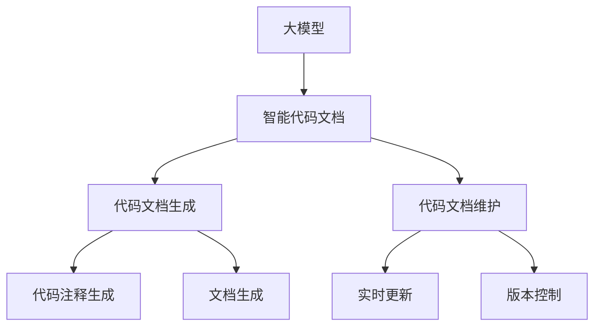

                 


### 《大模型驱动的智能代码文档生成与维护》目录大纲

为了撰写一篇高质量的技术博客文章，我们将遵循以下步骤来完善《大模型驱动的智能代码文档生成与维护》的目录大纲：

**1. 定义核心概念和联系**

首先，我们需要明确文章中的核心概念，如大模型、智能代码文档、代码文档生成与维护等。接着，我们将这些概念通过Mermaid流程图展示出来，以便读者能够直观地理解它们之间的联系。

- **大模型**：一种拥有强大学习能力和广泛知识面的机器学习模型。
- **智能代码文档**：利用大模型自动生成的代码注释、文档等，用于提高代码的可读性和可维护性。
- **代码文档生成与维护**：利用大模型自动生成代码文档，并在代码变更时进行实时更新和维护。

**Mermaid流程图**：



**2. 确定核心章节**

根据核心概念和联系，我们将确定文章的核心章节，确保内容涵盖以下几个方面：

- 大模型简介
- 智能代码文档的重要性
- 大模型与代码文档的关系
- 大模型驱动的代码文档生成
- 大模型驱动的代码文档维护
- 大模型驱动的代码文档应用场景
- 展望与未来

**3. 设计目录结构**

基于核心章节，我们将设计文章的目录结构，确保每个章节的逻辑清晰、结构紧凑。

**4. 编写详细内容**

针对每个章节，我们将编写详细内容，包括背景介绍、核心概念与联系、核心算法原理讲解、数学模型和公式讲解、项目实战等。每个章节都将包含以下部分：

- 引言：简要介绍章节主题和目的。
- 内容主体：详细阐述核心概念、算法原理、数学模型和公式、项目实战等。
- 结论：总结章节要点，提出未来研究方向或建议。

**5. 格式化输出**

最后，我们将使用markdown格式输出文章，确保格式规范。文章末尾将包含作者信息。

### **文章格式**

```markdown
# 文章标题

> 关键词：大模型、智能代码文档、代码文档生成与维护

> 摘要：本文介绍了大模型驱动的智能代码文档生成与维护的技术，包括大模型的定义、智能代码文档的重要性、大模型与代码文档的关系、大模型驱动的代码文档生成与维护技术，以及应用场景和未来展望。

## 第一部分：大模型与代码文档基础

## 第二部分：大模型驱动的代码文档生成

## 第三部分：大模型驱动的代码文档维护

## 第四部分：大模型驱动的代码文档应用场景

## 第五部分：展望与未来

### 作者信息

作者：AI天才研究院/AI Genius Institute & 禅与计算机程序设计艺术 /Zen And The Art of Computer Programming
```

现在，我们已经完成了《大模型驱动的智能代码文档生成与维护》的目录大纲设计，接下来我们将逐一撰写每个章节的内容。请等待我的后续更新。

