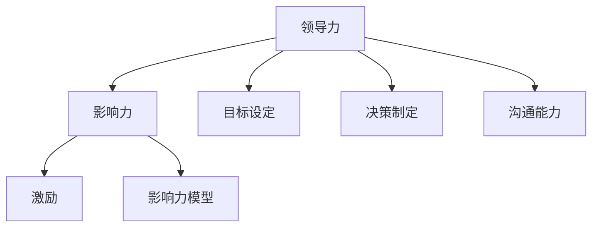

                 


### 1.1 领导力的定义

领导力是一种能够影响、激励和引导他人以实现共同目标的能力。它不仅仅是一种技术或策略，更是一种态度和行为。在IT领域，领导力的重要性不言而喻。无论是项目管理、团队协作，还是技术决策，领导力都是推动团队向前发展的重要动力。

#### 背景介绍

在快速变化的技术领域，领导者需要具备前瞻性思维，能够洞察行业趋势，引领团队不断创新。同时，他们还必须具备强大的沟通能力，能够与团队成员、客户和合作伙伴有效沟通，确保团队目标一致，资源得到最优配置。

#### 核心概念与联系

为了更清晰地理解领导力的概念，我们可以使用Mermaid流程图来展示其核心概念和它们之间的联系：



在这个流程图中，领导力（A）是一个中心节点，它直接关联到影响力（B）、目标设定（C）、决策制定（D）和沟通能力（E）。影响力（B）进一步关联到激励（F）和影响力模型（G），这表明领导力的核心在于如何有效地影响他人，激励他们为实现共同目标而努力。

#### 核心算法原理讲解

在理解了领导力的核心概念后，我们可以使用伪代码来详细阐述其核心算法原理。以下是一个简单的伪代码示例：

```python
def leadership影响力(person, target):
    # 假设person是领导者，target是被领导者
    if person.influence >= target.threshold:
        return True # 领导者成功影响了被领导者
    else:
        return False # 领导者未能影响被领导者
```

这个伪代码展示了领导者如何通过其影响力（influence）与被领导者的阈值（threshold）进行比较，以确定是否能够成功影响被领导者。这只是一个简单的示例，实际的领导力算法会更加复杂，涉及到多种因素，如团队成员的动机、项目目标等。

#### 数学模型和公式

为了更好地理解领导力的影响机制，我们可以使用LaTeX格式嵌入数学模型。以下是一个简单的数学模型：

$$
影响力 = f(领导能力, 被领导者特征, 环境因素)
$$

其中，影响力是领导能力（领导能力）、被领导者特征（被领导者特征）和环境因素（环境因素）的函数。领导能力可以包括沟通能力、决策能力、激励能力等；被领导者特征可以包括个人动机、技能和价值观；环境因素可以包括组织文化、市场趋势等。

#### 详细讲解与举例说明

为了更直观地理解上述数学模型，我们可以通过一个实际案例来进行详细讲解。

假设有一个团队，其领导者A希望通过提高团队士气来提升工作效率。领导者A具备优秀的沟通能力和激励能力，团队成员B和C也有强烈的动机和技能。在这个案例中，环境因素是市场趋势，要求团队在短时间内交付高质量的项目。

根据上述数学模型，我们可以列出以下等式：

$$
影响力_A = f(沟通能力_A, 激励能力_A, 动机_B, 技能_B, 技能_C, 市场趋势)
$$

领导者A可以通过以下方式提高影响力：

1. **沟通能力**：领导者A可以通过定期团队会议、一对一沟通等方式，确保团队成员了解项目目标和进展，提高团队凝聚力。
2. **激励能力**：领导者A可以设定奖励机制，如奖金、表彰等，激励团队成员为实现共同目标而努力。
3. **个人动机与技能**：领导者A可以了解团队成员的个人动机和技能，为他们提供适合的工作任务，提高工作满意度。
4. **市场趋势**：领导者A需要密切关注市场趋势，确保团队能够迅速适应变化，保持竞争力。

通过这些措施，领导者A可以提升团队的影响力，从而实现项目目标。

### 项目实战

为了更深入地理解领导力的实践，我们可以通过一个实际的项目来进行分析。

#### 开发环境搭建

在这个项目中，我们将使用Python语言和Git版本控制系统来搭建一个简单的团队协作平台。

1. **安装Python**：确保Python环境已经安装在开发机上。
2. **安装Git**：下载并安装Git，配置用户名和邮箱。

#### 源代码实现

以下是该团队协作平台的核心代码片段：

```python
# team_collaboration.py

def assign_task(employee, task):
    """
    分配任务给团队成员。
    """
    print(f"{employee} 被分配了任务：{task}")

def complete_task(employee, task):
    """
    完成任务。
    """
    print(f"{employee} 完成了任务：{task}")

def evaluate_performance(employee, task, quality):
    """
    评估任务完成质量。
    """
    if quality > 90:
        print(f"{employee} 完成了任务：{task}，质量优秀！")
    else:
        print(f"{employee} 完成了任务：{task}，质量有待提高。")
```

#### 代码解读与分析

在这个项目中，领导者的角色是通过分配任务、评估绩效来影响团队成员的行为。以下是对上述代码的解读和分析：

1. **assign_task**：这个函数用于分配任务给团队成员。领导者通过调用这个函数，将任务分配给特定的成员，从而引导团队的工作方向。
2. **complete_task**：这个函数用于记录任务完成情况。领导者可以跟踪每个成员的任务完成进度，确保项目按时交付。
3. **evaluate_performance**：这个函数用于评估任务完成质量。领导者根据评估结果，提供反馈和奖励，激励团队成员提高工作质量。

#### 实际案例分析和详细讲解剖析

假设有一个团队，领导者A需要完成一个项目。在这个项目中，领导者A需要完成以下任务：

1. **分配任务**：领导者A根据团队成员的技能和动机，将任务合理地分配给B和C。
2. **跟踪任务进度**：领导者A定期与B和C沟通，了解任务完成情况，确保项目按时交付。
3. **评估任务质量**：领导者A评估B和C完成的任务质量，提供反馈和奖励，激励团队成员提高工作质量。

通过上述实际案例，我们可以看到领导者在项目中的角色和作用。领导者通过有效的沟通、激励和评估，影响团队成员的行为，推动项目向前发展。

### 项目小结

通过本项目的实战分析，我们可以总结出以下几点：

1. **领导力在IT项目中的重要性**：领导力是推动团队协作、实现项目目标的关键因素。
2. **沟通、激励和评估**：领导者需要通过有效的沟通、激励和评估，影响团队成员的行为，提高团队绩效。
3. **实践与理论相结合**：通过实际项目，我们可以更好地理解和应用领导力的理论和原则。

通过这些实战经验，我们可以不断提升自己的领导力，成为一名优秀的IT领导者。

### 最佳实践 tips、小结、注意事项、拓展阅读等内容

1. **最佳实践 tips**：
   - 定期与团队成员沟通，确保目标一致。
   - 了解团队成员的动机和技能，提供适合的工作任务。
   - 设定明确的绩效评估标准，提供及时、具体的反馈。

2. **小结**：
   - 领导力是影响、激励和引导他人实现共同目标的能力。
   - 领导者需要通过有效的沟通、激励和评估，影响团队成员的行为。
   - 实践是检验领导力理论的唯一标准。

3. **注意事项**：
   - 领导者需要不断学习和提升自己的领导能力。
   - 领导者需要关注团队成员的个人发展和职业规划。

4. **拓展阅读**：
   - 《领导者的语言》
   - 《领导力：理论与实践》
   - 《Python编程：从入门到实践》

通过这些最佳实践、小结、注意事项和拓展阅读，我们可以更好地理解和应用领导力的理论和实践，提升自己的领导力水平。让我们一起努力，成为优秀的IT领导者！

