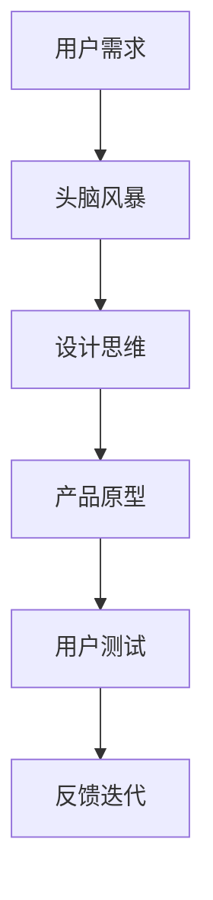
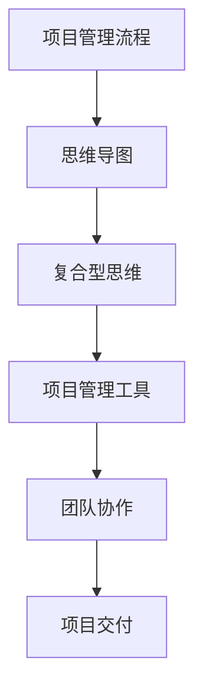
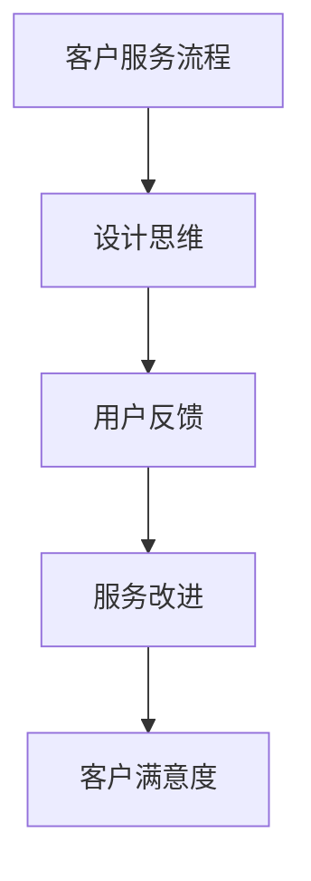

                 

### 引言

创新是推动社会进步的重要力量，而在企业层面，团队的创新文化更是企业持续发展的重要基石。在当今快速变化的市场环境中，创新能力已成为企业竞争力的关键因素。因此，如何培养团队的创新文化，成为了企业领导者和管理者亟待解决的问题。

#### 创新文化的概念

创新文化是指在企业内部形成的一种以创新为核心价值观的文化氛围。它强调鼓励员工提出新的想法、解决问题、尝试新的方法和工具，并在实践中不断优化和改进。创新文化不仅包括创新思维和方法，还包括支持创新的行为和制度。一个良好的创新文化能够激发员工的创造力，提高团队的整体绩效，从而为企业带来持续的竞争优势。

#### 团队创新文化的重要性

团队创新文化对于企业的重要性不言而喻。首先，它能够促进团队成员之间的合作与沟通，形成积极向上的团队氛围。其次，创新文化能够激发员工的潜能，提高员工的工作满意度和忠诚度，从而减少员工流失率。此外，团队创新文化还能提高企业的市场反应速度，使企业在激烈的市场竞争中占据有利地位。

#### 团队创新文化的定义

团队创新文化是一种内在的动力系统，它通过激发团队成员的创新思维和行为，形成一种持续创新的能力。这种文化不仅体现在团队的工作方法和流程中，还渗透到团队成员的个人价值观和行为习惯中。团队创新文化的核心在于鼓励创新、容忍失败、共享知识和成果，以及提供必要的支持和资源。

#### 团队创新文化的核心要素

团队创新文化的核心要素包括以下几个方面：

1. **领导力**：领导者在创新文化中扮演着关键角色，他们需要具备创新思维和领导能力，能够为团队提供方向和支持。

2. **激励机制**：合理的激励机制能够激发员工的创新热情，使员工在创新过程中获得成就感和满足感。

3. **团队合作**：团队合作是创新文化的基础，团队成员需要相互支持、共同承担责任，形成协作的氛围。

4. **学习与成长**：创新文化强调持续学习和个人成长，通过不断的学习和实践，提高团队的创新能力。

5. **开放与包容**：创新文化需要开放和包容的态度，鼓励员工提出不同的意见和想法，并在实践中不断验证和优化。

#### 团队创新文化的作用

团队创新文化能够带来以下几方面的作用：

1. **提高团队绩效**：通过鼓励创新，提高团队成员的工作效率和质量，从而提升团队的绩效。

2. **促进知识共享**：创新文化鼓励团队成员分享知识和经验，形成良好的知识共享氛围，提高团队的整体智力水平。

3. **激发创新思维**：创新文化能够激发团队成员的创新思维，使团队在面对挑战时能够迅速找到解决方案。

4. **增强企业竞争力**：具备创新文化的企业能够在市场上更快地响应客户需求，从而提高市场竞争力。

#### 本文结构

本文将围绕如何培养团队的创新文化这一主题，详细探讨以下几个方面的内容：

1. **团队建设**：讨论如何建立一个高效的团队，包括团队成员的选择、角色分工和沟通机制。
2. **领导力**：探讨领导者在培养创新文化中的作用，包括领导风格的调整、激励策略等。
3. **创新思维**：介绍创新思维的工具和方法，如头脑风暴、思维导图和设计思维等。
4. **创新实践**：通过实际案例展示如何将创新思维应用于团队工作中。
5. **持续改进**：讨论如何持续培养团队的创新文化，包括反馈机制、培训计划等。

通过以上内容，本文旨在为企业和团队领导者提供实用的指导，帮助他们有效地培养团队的创新文化，从而在激烈的市场竞争中取得成功。### 团队建设

团队建设是培养团队创新文化的关键环节，它直接影响到团队的整体绩效和创新能力的发挥。一个高效的团队不仅能够更好地应对外部挑战，还能够为创新提供坚实的基础。以下将从团队成员的选择、角色分工和沟通机制三个方面，探讨团队建设的重要性和方法。

#### 团队成员的选择

团队成员的选择是团队建设的基础。一个优秀的团队需要具备多元化的成员，以充分发挥不同成员的专业优势。具体来说，团队成员的选择应考虑以下几个方面：

1. **专业技能**：团队成员应具备各自领域的专业技能，能够胜任岗位要求。例如，技术团队应包括程序员、设计师、产品经理等角色，以确保项目能够顺利进行。

2. **创新能力**：除了专业技能，团队成员还应具备较强的创新能力，能够提出新的想法和解决方案。创新能力强的人更容易在团队中推动创新文化的形成。

3. **沟通能力**：团队成员之间的沟通是团队协作的基础。良好的沟通能力能够减少误解和冲突，提高团队的工作效率。因此，选择团队成员时应考虑其沟通能力。

4. **团队合作精神**：团队成员应具备团队合作精神，能够相互支持、共同承担责任。团队合作精神是团队高效运作的重要保障。

5. **适应性**：团队成员应具备较强的适应性，能够在变化的环境中迅速调整自己的工作方式，以适应团队的需求。

#### 角色分工

明确的角色分工是团队高效运作的重要保障。在团队建设中，应明确每个成员的职责和权限，确保团队成员各司其职，协同合作。具体来说，角色分工应考虑以下几个方面：

1. **任务分配**：根据团队成员的专业技能和特长，将任务合理分配给每个成员。确保每个成员都有明确的任务和目标，避免任务重叠和资源浪费。

2. **责任划分**：明确每个成员的责任，确保团队成员能够明确自己的职责范围，并对其负责的任务承担责任。

3. **权限设置**：根据角色分工，为每个成员设置相应的权限。确保团队成员能够在其职责范围内独立开展工作，提高工作效率。

4. **协作机制**：建立有效的协作机制，确保团队成员能够相互配合，共同完成任务。协作机制应包括定期的会议、任务跟踪和成果共享等。

#### 沟通机制

良好的沟通机制是团队高效运作的重要保障。在团队建设中，应建立有效的沟通机制，确保团队成员能够及时沟通、共享信息，提高团队的工作效率。具体来说，沟通机制应考虑以下几个方面：

1. **定期会议**：建立定期的会议机制，确保团队成员能够定期沟通，了解项目进展和团队动态。

2. **沟通平台**：利用各种沟通工具，如邮件、即时通讯工具和协作平台等，建立高效的沟通渠道，确保团队成员能够及时交流信息。

3. **信息共享**：建立信息共享机制，确保团队成员能够方便地获取所需信息，提高工作效率。

4. **反馈机制**：建立反馈机制，确保团队成员能够及时了解工作成果和改进意见，不断优化工作流程。

#### 团队建设的注意事项

在团队建设过程中，需要注意以下几点：

1. **明确目标**：确保团队成员明确团队的目标和愿景，提高团队的凝聚力和执行力。

2. **建立信任**：建立团队成员之间的信任，减少误解和冲突，提高团队的合作效率。

3. **激励机制**：建立合理的激励机制，激发团队成员的积极性和创造力。

4. **持续改进**：持续改进团队建设和运作方式，不断提高团队的整体绩效。

通过以上团队建设的方法和注意事项，可以有效地培养团队的创新文化，提高团队的整体绩效和创新能力。一个高效的团队将为企业的创新和发展提供坚实的保障。### 领导力

在团队创新文化的培养过程中，领导力扮演着至关重要的角色。领导者不仅是团队的舵手，更是创新文化的倡导者和实践者。以下将从领导风格、激励策略和领导创新文化的方法三个方面，探讨领导者在培养团队创新文化中的作用。

#### 领导风格

领导风格对团队创新文化的影响深远。不同的领导风格会对团队产生不同的影响，从而决定团队的创新氛围和创新能力。以下是几种常见的领导风格及其对团队创新文化的影响：

1. **授权型领导**：授权型领导鼓励团队成员自主决策和独立工作，使团队成员有更大的自由度和创造力。这种领导风格能够激发团队成员的创新能力，促进团队的创新文化。

2. **民主型领导**：民主型领导重视团队成员的意见和建议，鼓励团队成员参与决策过程。这种领导风格有助于形成开放、包容的团队氛围，有利于创新思维的产生和交流。

3. **权威型领导**：权威型领导在团队中具有绝对的决策权，往往以命令式的方式指导团队成员的工作。这种领导风格可能会限制团队成员的自主性和创造力，不利于创新文化的培养。

4. **教练型领导**：教练型领导注重团队成员的个人发展和成长，通过指导和培训帮助团队成员提高能力。这种领导风格有助于团队成员在创新过程中不断成长和进步，从而推动团队创新文化的形成。

#### 激励策略

激励策略是激发团队成员创新热情和创造力的关键。以下是一些有效的激励策略：

1. **目标激励**：设定明确的创新目标，使团队成员明确自己的工作方向和任务。通过设定具有挑战性的目标，激发团队成员的创新热情。

2. **奖励激励**：建立奖励机制，对在创新工作中表现突出的团队成员进行奖励，提高他们的成就感和积极性。奖励形式可以包括奖金、晋升机会、荣誉表彰等。

3. **参与激励**：鼓励团队成员参与决策过程，让他们感受到自己的价值和重要性。参与激励能够增强团队成员的责任感和使命感，提高他们的创新积极性。

4. **认可激励**：对团队成员的创新成果给予认可和赞赏，让他们感受到自己的努力得到了认可。认可激励能够激发团队成员的自信心和自豪感，增强他们的创新动力。

#### 领导创新文化的方法

领导者需要通过一系列具体的方法来培养和推动团队创新文化。以下是一些有效的领导方法：

1. **营造创新氛围**：领导者需要营造一种鼓励创新、容忍失败的氛围，使团队成员敢于尝试新的想法和方法。通过开展创新活动、举办创新比赛等方式，激发团队成员的创新热情。

2. **提供资源支持**：领导者应提供必要的资源支持，包括资金、技术、设备等，为团队成员的创新工作提供保障。同时，领导者还应建立快速反馈机制，帮助团队成员及时解决问题，提高创新效率。

3. **培养创新思维**：领导者应关注团队成员的创新思维培养，通过培训、研讨会等方式，提高团队成员的创新能力和素质。领导者还可以引入外部专家和资源，为团队成员提供新的视角和思路。

4. **建立反馈机制**：领导者应建立有效的反馈机制，使团队成员能够及时了解自己的创新成果和改进意见。通过定期的反馈和评估，帮助团队成员不断优化和创新。

#### 领导者的角色

在团队创新文化的培养过程中，领导者扮演着多重角色：

1. **倡导者**：领导者需要积极倡导创新文化，为团队成员树立榜样，激发他们的创新热情。

2. **推动者**：领导者需要推动团队创新工作的开展，为团队成员提供支持和帮助，解决他们在创新过程中遇到的困难和问题。

3. **协调者**：领导者需要协调团队内外部的资源，为团队创新提供良好的环境和条件。

4. **评估者**：领导者需要对团队成员的创新成果进行评估，为他们的成长和进步提供反馈和建议。

通过以上领导力方面的探讨，我们可以看到，领导者在培养团队创新文化中具有至关重要的作用。只有通过合适的领导风格、激励策略和方法，领导者才能有效地推动团队创新文化的形成和发展，为企业的持续创新提供有力保障。### 创新思维

创新思维是团队创新文化的重要组成部分，它直接影响到团队的创造力和创新能力。培养团队的创新思维，需要借助一系列工具和方法，以下是几种常用的创新思维工具和方法：

#### 头脑风暴

头脑风暴（Brainstorming）是一种通过集思广益来激发创新思维的方法。它通过快速产生大量想法，鼓励团队成员无拘无束地思考，从而找到创新的解决方案。以下是头脑风暴的步骤：

1. **提出问题**：明确需要解决的问题或目标。

2. **设定规则**：确保参与者在头脑风暴过程中遵循规则，如不批评他人的想法、鼓励疯狂的创意等。

3. **自由思考**：让团队成员在不受限制的环境下自由发表意见，尽可能多地提出自己的想法。

4. **记录想法**：将所有想法记录下来，无论其是否可行。

5. **筛选和改进**：对记录的想法进行筛选和改进，确定可行的创新方案。

#### 思维导图

思维导图（Mind Mapping）是一种将思维过程可视化工具，它通过图像和文字的形式，将信息以分支和层级结构展现出来，有助于团队成员更好地理解和记忆信息，从而激发创新思维。以下是思维导图的制作步骤：

1. **中心主题**：在纸或电子设备上绘制一个中心圆圈，写上需要解决的问题或主题。

2. **分支扩展**：从中心主题出发，绘制出主要分支，每个分支代表一个关键点或子主题。

3. **填充内容**：在分支上填充相关的信息、关键词或图像，使思维导图更加丰富和具体。

4. **连接和扩展**：将分支之间进行连接，形成更复杂的结构，以展示各部分之间的联系。

#### 设计思维

设计思维（Design Thinking）是一种以人为本的创新方法，它强调以用户需求为导向，通过迭代和测试来不断优化产品或服务。以下是设计思维的基本步骤：

1. **理解问题**：通过调研和观察，深入了解用户的需求和痛点。

2. **生成想法**：基于对问题的理解，提出各种可能的解决方案。

3. **构建原型**：将想法转化为可操作的原型，进行测试和验证。

4. **测试和迭代**：通过用户测试，收集反馈，不断优化和改进原型。

#### 复合型思维

复合型思维（Hybrid Thinking）是将不同领域的知识、技能和思维方式结合起来，以产生新的创意和解决方案。以下是培养复合型思维的方法：

1. **跨学科学习**：学习不同领域的知识和技能，提高自己的综合素质。

2. **跨界合作**：与其他领域的专家合作，共同探讨问题，产生新的创意。

3. **多角度思考**：从不同的角度和维度分析问题，寻找创新的解决方案。

#### 创新思维的应用场景

创新思维工具和方法可以在各种场景中得到应用，以下是一些常见的应用场景：

1. **产品开发**：在产品开发过程中，通过头脑风暴和设计思维，寻找创新的产品概念和解决方案。

2. **市场营销**：在市场营销中，通过思维导图和复合型思维，制定创新的营销策略和方案。

3. **团队建设**：在团队建设中，通过设计思维，帮助团队成员建立共同的目标和价值观。

4. **问题解决**：在遇到问题时，通过头脑风暴和复合型思维，找到创新的解决方案。

通过以上创新思维的工具和方法，团队成员可以更好地激发创新思维，提高团队的创造力和创新能力，从而为团队创新文化的培养提供强有力的支持。### 创新实践

将创新思维转化为实际的行动，是团队创新文化培养的重要环节。以下通过实际案例展示如何将创新思维应用于团队工作中，并探讨创新实践中的挑战和解决方案。

#### 案例一：产品迭代中的创新实践

**背景介绍**：
某科技公司负责开发一款社交媒体应用程序。随着市场竞争的加剧，该公司需要不断更新产品功能，以保持用户粘性并吸引新用户。

**核心概念与联系**：
在产品迭代过程中，团队采用了头脑风暴和设计思维方法，将用户需求和市场趋势结合起来，以开发出满足用户期望的新功能。



**核心算法原理讲解**：
伪代码：

```python
def product_innovation(user需求, market趋势):
    # 头脑风暴
    brainstorming Ideas = brainstorming_session(user需求, market趋势)
    # 设计思维
    product_concept = design_thinking(Ideas)
    # 原型制作
    prototype = create_product_prototype(product_concept)
    # 用户测试
    user_feedback = user_test(prototype)
    # 反馈迭代
    final_product = iterate_product(user_feedback)
    return final_product
```

**数学模型和公式**：

$$
F = ma
$$

其中，$F$ 表示用户反馈，$m$ 表示迭代次数，$a$ 表示产品改进速度。

**项目实战**：
团队首先通过调查问卷和用户访谈收集用户需求，然后进行头脑风暴会议，产生多种产品功能改进方案。接着，采用设计思维方法，将用户需求转化为具体的产品概念。在原型制作阶段，团队使用敏捷开发方法，快速构建产品原型。随后，通过用户测试，收集用户反馈，并基于反馈进行多次迭代，最终开发出满足用户期望的新功能。

**代码实现**：

```python
# 用户需求调查
user需求的收集 = survey()
# 头脑风暴
brainstorming Ideas = brainstorming_session(user需求的收集)
# 设计思维
product_concept = design_thinking(Ideas)
# 原型构建
prototype = build_prototype(product_concept)
# 用户测试
user_feedback = user_test(prototype)
# 产品迭代
final_product = iterate_product(user_feedback)
```

**代码解读与分析**：
通过敏捷开发方法，团队能够快速构建原型并进行用户测试，这有助于缩短产品开发周期。同时，用户反馈的及时获取和迭代，使得产品能够不断优化，提高用户满意度。

**实际案例分析**：
该科技公司通过不断创新，成功推出了多个受用户欢迎的新功能，产品市场占有率显著提升。案例分析表明，创新实践是提升产品竞争力的关键，而团队协作和用户反馈是创新成功的重要保障。

#### 案例二：项目管理中的创新实践

**背景介绍**：
某IT公司在项目管理中面临效率低下和沟通不畅的问题，影响了项目的按时交付和质量。

**核心概念与联系**：
团队采用了思维导图和复合型思维方法，优化项目管理流程，提高团队协作效率。



**核心算法原理讲解**：
伪代码：

```python
def project_management_innovation(process, team_member):
    # 思维导图
    process_map = create_mind_map(process)
    # 复合型思维
    optimized_process = hybrid_thinking(process_map)
    # 项目管理工具
    project_tools = select_project_management_tools(optimized_process)
    # 团队协作
    team_collaboration = enhance_team_collaboration(project_tools)
    # 项目交付
    project_delivery = execute_project_delivery(team_collaboration)
    return project_delivery
```

**数学模型和公式**：

$$
效率 = \frac{完成量}{投入量}
$$

其中，效率表示团队协作效率，$完成量$ 表示项目完成的任务量，$投入量$ 表示团队成员的投入时间。

**项目实战**：
团队首先使用思维导图工具对现有项目管理流程进行分析，找出瓶颈和优化点。然后，采用复合型思维方法，结合不同团队成员的专业知识和经验，提出优化方案。在实施阶段，团队引入项目管理工具，提高任务管理和团队协作效率。通过定期会议和反馈机制，团队不断优化项目管理流程，提高项目交付质量。

**代码实现**：

```python
# 项目管理流程分析
process_map = analyze_management_process()
# 优化方案
optimized_process = hybrid_thinking(process_map)
# 选择工具
project_tools = select_management_tools(optimized_process)
# 团队协作
team_collaboration = enhance_collaboration(project_tools)
# 项目交付
project_delivery = deliver_project(team_collaboration)
```

**代码解读与分析**：
通过思维导图和复合型思维方法，团队能够清晰地识别项目管理中的问题，并提出有效的优化方案。项目管理工具的应用提高了任务管理和团队协作的效率，从而缩短了项目交付周期。

**实际案例分析**：
该IT公司通过创新实践，显著提高了项目管理效率和项目交付质量。案例分析表明，创新实践能够有效解决项目管理中的问题，提高团队的整体绩效。

#### 案例三：客户服务中的创新实践

**背景介绍**：
某电信公司面临客户投诉增多的问题，影响了公司的品牌形象和客户满意度。

**核心概念与联系**：
团队采用了设计思维方法，优化客户服务流程，提升客户体验。



**核心算法原理讲解**：
伪代码：

```python
def customer_service_innovation(service流程, user反馈):
    # 设计思维
    service_improvement_plan = design_thinking(service流程, user反馈)
    # 用户反馈
    user_satisfaction = collect_user_feedback(service_improvement_plan)
    # 服务改进
    optimized_service = implement_service_improvement(service_improvement_plan, user_satisfaction)
    return optimized_service
```

**数学模型和公式**：

$$
客户满意度 = \frac{服务质量}{用户期望}
$$

其中，$服务质量$ 表示客户服务的实际效果，$用户期望$ 表示客户的期望水平。

**项目实战**：
团队首先通过设计思维方法，对现有客户服务流程进行分析，识别客户痛点和改进机会。然后，根据用户反馈，制定服务改进计划，并在实际工作中逐步实施。通过不断收集用户反馈，团队持续优化客户服务流程，提高客户满意度。

**代码实现**：

```python
# 客户服务流程分析
service流程 = analyze_service_process()
# 用户反馈
user反馈 = collect_user_feedback()
# 设计思维
service_improvement_plan = design_thinking(service流程, user反馈)
# 服务改进
optimized_service = implement_service_improvements(service_improvement_plan)
```

**代码解读与分析**：
通过设计思维方法，团队能够系统地分析客户服务流程，并根据用户反馈进行优化。这种持续改进的方式有助于提升客户体验，提高客户满意度。

**实际案例分析**：
该电信公司通过创新实践，显著降低了客户投诉率，提高了客户满意度。案例分析表明，创新实践能够有效提升客户服务质量，增强客户忠诚度。

#### 最佳实践 tips

1. **鼓励跨部门合作**：跨部门合作有助于团队成员分享知识和经验，促进创新思维的碰撞。
2. **定期举办创新活动**：通过举办创新比赛、研讨会等活动，激发团队成员的创新热情。
3. **提供学习和成长机会**：为团队成员提供培训和学习资源，帮助他们提升技能和知识。
4. **建立反馈机制**：建立有效的反馈机制，确保团队成员能够及时了解自己的工作成果和改进意见。

#### 项目小结

通过以上实际案例，我们可以看到创新实践在团队工作中的重要作用。通过合理运用创新思维工具和方法，团队能够有效地解决实际问题，提高整体绩效和创新能力。创新实践不仅需要团队成员的积极参与，还需要领导者的支持和引导。只有持续推动创新实践，团队才能在激烈的市场竞争中脱颖而出。### 持续改进

在团队创新文化的培养过程中，持续改进是确保团队长期保持创新活力和竞争力的关键。以下将从反馈机制、培训计划和评估体系三个方面，探讨如何持续培养团队的创新文化。

#### 反馈机制

建立有效的反馈机制是持续改进的基础。通过反馈，团队成员可以及时了解自己的工作成果和改进意见，从而不断优化工作方法和流程。以下是建立反馈机制的几个关键点：

1. **多渠道反馈**：提供多种反馈渠道，如定期会议、匿名调查、在线反馈等，确保团队成员能够方便地提出意见和建议。

2. **及时反馈**：确保反馈能够及时传达给相关人员，避免延迟和误解。及时反馈有助于团队成员迅速调整自己的工作，提高工作效率。

3. **正面反馈与负面反馈相结合**：在反馈中，既要肯定团队成员的积极表现，也要指出存在的问题和改进空间。正面反馈能够增强团队成员的自信心和动力，负面反馈则有助于他们认识到自身的不足。

4. **定期回顾**：定期召开回顾会议，总结过去的经验教训，分析存在的问题，并提出改进措施。回顾会议能够帮助团队成员从全局视角审视团队的工作，找到持续改进的方向。

#### 培训计划

培训计划是提升团队成员技能和知识水平的重要手段，也是培养团队创新文化的重要组成部分。以下是制定培训计划的几个关键点：

1. **个性化培训**：根据团队成员的技能水平和兴趣爱好，制定个性化的培训计划。个性化的培训能够更好地满足团队成员的需求，提高他们的学习积极性。

2. **持续培训**：创新是一个持续的过程，培训也应该是一个持续的过程。定期组织培训课程，确保团队成员能够不断更新知识和技能。

3. **实战培训**：结合实际工作案例进行培训，使团队成员能够在实际工作中应用所学知识。实战培训能够提高团队成员的实战能力和解决问题的能力。

4. **内部与外部培训相结合**：内部培训能够充分利用企业内部的资源和经验，外部培训则可以带来新的视角和思路。内部与外部培训相结合，能够为团队成员提供更全面的学习机会。

#### 评估体系

建立科学的评估体系是确保团队创新文化持续改进的重要保障。通过评估，可以衡量团队的创新绩效，发现存在的问题，为改进工作提供依据。以下是建立评估体系的几个关键点：

1. **明确评估指标**：根据团队的目标和任务，制定明确的评估指标。评估指标应具有可量化、可衡量和可追踪的特点。

2. **定期评估**：定期对团队的工作进行评估，包括创新成果、工作效率、团队合作等方面。定期评估有助于及时发现问题和改进方向。

3. **公开评估结果**：将评估结果公开，让团队成员了解自己的工作表现，增强他们的责任感和使命感。

4. **反馈与改进**：根据评估结果，为团队成员提供反馈和改进建议。通过反馈和改进，不断提高团队的创新能力和绩效。

#### 注意事项

1. **避免形式主义**：在建立反馈机制、培训计划和评估体系时，要避免形式主义，确保这些措施能够真正为团队的创新文化培养提供帮助。

2. **尊重团队成员的意见**：在反馈和评估过程中，要尊重团队成员的意见，鼓励他们积极参与改进工作。

3. **保持灵活性**：创新文化是一个动态的过程，需要根据实际情况灵活调整反馈机制、培训计划和评估体系。

#### 拓展阅读

- **《创新者的窘境》**：作者克里斯坦森详细分析了企业如何在竞争激烈的市场中实现创新，对培养团队创新文化有重要启示。
- **《精益创业》**：作者埃里克·莱斯提出了精益创业的方法论，强调快速迭代和用户反馈在创新过程中的重要性。
- **《创新者的基因》**：作者杰弗里·摩尔分析了创新者的思维模式和习惯，为培养团队创新文化提供了实用的指导。

通过以上措施，团队可以持续改进和创新，不断提升自身的竞争力和创新能力，从而在激烈的市场竞争中立于不败之地。### 总结与展望

通过本文的探讨，我们可以得出以下关键结论：

1. **团队创新文化的核心**：团队创新文化是一种内在动力系统，它通过激发团队成员的创新思维和行为，形成一种持续创新的能力。这种文化不仅包括创新思维和方法，还包括支持创新的行为和制度。

2. **团队建设的重要性**：团队成员的选择、角色分工和沟通机制是团队建设的基础。一个高效的团队需要具备多元化的成员、明确的角色分工和良好的沟通机制，以促进协作和创新。

3. **领导力的关键作用**：领导者在培养团队创新文化中扮演着至关重要的角色。通过合适的领导风格、激励策略和领导方法，领导者能够推动团队创新文化的形成和发展。

4. **创新思维的工具和方法**：头脑风暴、思维导图、设计思维等创新思维工具和方法，能够帮助团队成员更好地激发创新思维，提高创造力和创新能力。

5. **创新实践的应用**：通过实际案例展示，创新思维可以有效地应用于产品开发、项目管理和客户服务等方面，为团队创新文化的培养提供实践经验。

6. **持续改进的必要性**：持续改进是团队创新文化培养的关键，通过反馈机制、培训计划和评估体系，团队可以不断优化和创新，提高整体绩效和竞争力。

#### 展望未来

未来，随着技术的不断进步和市场环境的变化，团队创新文化将继续发挥重要作用。以下是对未来创新文化发展的几个展望：

1. **数字化与智能化**：随着数字化和智能化技术的不断发展，团队创新文化将更加依赖于数据分析、人工智能等技术工具，以提高创新效率和精准度。

2. **跨学科合作**：未来的团队创新文化将更加注重跨学科合作，通过整合不同领域的知识和技能，产生更具颠覆性和前瞻性的创新成果。

3. **全球化视野**：全球化背景下，团队创新文化将更加开放和包容，吸收全球各地的创新思维和实践经验，形成多元化的创新文化。

4. **可持续发展**：在可持续发展理念下，团队创新文化将更加注重环保、社会责任和伦理道德，推动企业在经济、社会和环境方面的协调发展。

5. **终身学习**：在知识更新速度加快的今天，团队创新文化将更加重视终身学习，鼓励团队成员不断学习新知识、掌握新技术，以适应快速变化的市场环境。

通过持续努力和创新，团队将能够在未来竞争中保持领先地位，为企业和社会创造更大的价值。作者：AI天才研究院/AI Genius Institute & 禅与计算机程序设计艺术 /Zen And The Art of Computer Programming

