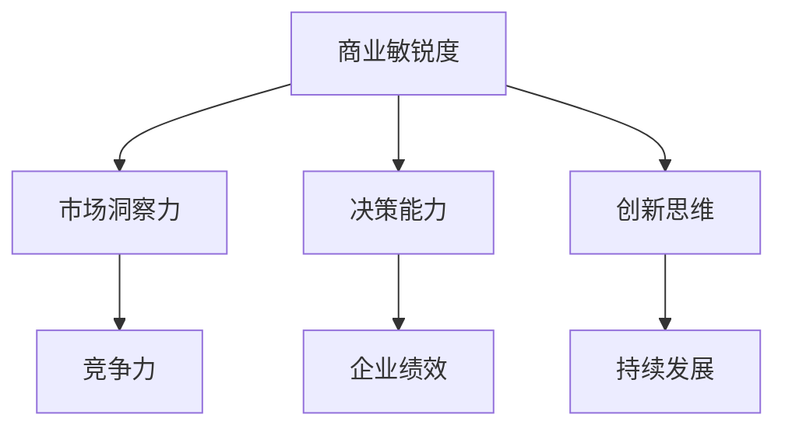

                 

### 文章标题：如何培养团队的商业敏锐度

#### 关键词：商业敏锐度、团队建设、市场洞察、战略决策、风险管理、案例分析

> 摘要：本文旨在深入探讨如何有效培养团队的商业敏锐度，通过系统化的方法提升团队在市场环境中的感知能力、决策质量和创新能力。文章首先阐述了商业敏锐度的定义与重要性，接着分析了商业敏锐度的核心要素及其在企业战略中的角色。随后，文章详细介绍了市场调研的方法和技巧，探讨了决策制定和执行的流程。此外，文章还论述了团队建设与管理的重要性，包括团队结构、角色分配和商业敏锐度的培养。最后，通过成功与失败案例的分析，总结了培养商业敏锐度的最佳实践和未来发展趋势，为企业和团队提供了有价值的参考。

### 商业敏锐度的基本概念

#### 1.1 商业敏锐度的定义与重要性

商业敏锐度（Business Acumen）是指企业在面对复杂多变的市场环境时，能够快速准确地把握市场动向、洞察商业机会和风险，并作出明智决策的能力。商业敏锐度不仅仅是商业知识和管理技能的积累，更是一种全局观和系统思维的综合体现。以下是商业敏锐度几个核心概念的相互关系和联系：

- **市场洞察力**：指对企业所处市场的深刻理解和敏锐感知，包括对市场趋势、竞争对手、消费者行为等方面的洞察。
- **决策能力**：指在复杂环境下做出有效决策的能力，包括信息收集、分析判断、风险评估和选择方案等环节。
- **创新思维**：指在商业活动中不断寻求新的解决方案、新产品和服务的思维方式，包括创造性思维、跨界思维和系统性思维。

**核心概念与联系**：



在上述关系图中，商业敏锐度是整个系统的基础，通过市场洞察力提升竞争力，通过决策能力提升企业绩效，通过创新思维推动持续发展。这三个核心概念相互作用，共同构成了商业敏锐度的核心框架。

#### 1.2 商业敏锐度的核心要素

商业敏锐度的核心要素包括市场洞察力、决策能力和创新思维。以下将详细解释这些要素及其重要性。

1. **市场洞察力**

   市场洞察力是企业了解和把握市场动态、趋势和机会的能力。它是商业敏锐度的基础，直接决定了企业的市场竞争力。市场洞察力包括以下几个方面的内容：

   - **市场趋势分析**：通过数据分析、市场调研等方法，预测市场未来的发展趋势，为企业战略提供方向。
   - **竞争对手分析**：了解竞争对手的产品、服务、市场策略和竞争优势，从而制定有针对性的竞争策略。
   - **消费者行为分析**：研究消费者的需求、偏好和行为模式，为企业产品开发、市场营销提供依据。

   **核心算法原理讲解**：

   ```plaintext
   // 市场洞察力计算公式
   市场洞察力 = (趋势分析 * 竞争对手分析 * 消费者行为分析) / 信息质量
   ```

2. **决策能力**

   决策能力是企业根据市场洞察力，在复杂多变的环境中作出有效决策的能力。决策能力的高低直接关系到企业的生存和发展。决策能力包括以下几个方面的内容：

   - **问题识别**：快速识别企业面临的问题和挑战，明确决策的目标。
   - **信息收集**：广泛收集与决策相关的各种信息，包括市场数据、竞争对手信息、内部资源等。
   - **方案分析**：分析各种可能的决策方案，评估其优缺点和潜在风险。
   - **决策选择**：根据信息分析和评估结果，选择最佳决策方案。

   **核心算法原理讲解**：

   ```plaintext
   // 决策能力计算公式
   决策能力 = (问题识别 * 信息收集 * 方案分析 * 决策选择) / 风险承受力
   ```

3. **创新思维**

   创新思维是企业不断寻求新的解决方案、新产品和服务的思维方式。创新思维是企业持续发展的动力，是企业在激烈竞争中脱颖而出的关键。创新思维包括以下几个方面的内容：

   - **创造性思维**：通过发散性思维，提出新的想法和创意。
   - **跨界思维**：跨越不同领域和行业，寻找新的商业机会和解决方案。
   - **系统性思维**：从整体和系统的角度，分析问题和解决问题。

   **核心算法原理讲解**：

   ```plaintext
   // 创新思维计算公式
   创新思维 = (创造性思维 * 跨界思维 * 系统性思维) / 创新执行力
   ```

#### 1.3 商业敏锐度与企业战略的关系

商业敏锐度与企业战略紧密相连，是企业实现长期发展的关键因素。企业战略的制定和执行需要依赖商业敏锐度，而商业敏锐度的提升又能进一步优化企业战略。

1. **战略制定**

   企业在制定战略时，需要依赖商业敏锐度来识别市场机会、分析竞争对手和评估自身优势与劣势。商业敏锐度帮助企业在复杂多变的环境中，准确把握战略方向。

   **数学模型和数学公式**：

   ```plaintext
   // 战略制定模型
   战略制定 = (市场洞察力 * 决策能力 * 创新思维) / 企业目标
   ```

2. **战略执行**

   在战略执行过程中，商业敏锐度可以帮助企业及时调整战略方向，应对市场变化和风险。企业通过不断收集和分析市场信息，优化决策过程，提高战略执行的效率和效果。

   **数学模型和数学公式**：

   ```plaintext
   // 战略执行模型
   战略执行 = (市场洞察力 * 决策能力 * 创新思维) / 执行效率
   ```

### 商业环境分析

#### 2.1 宏观环境分析

宏观环境分析（PEST分析）是一种常用的方法，用于评估企业所处的外部宏观环境。PEST分析包括政治（Political）、经济（Economic）、社会（Social）和技术（Technological）四个方面，以下分别进行详细解释。

1. **政治因素**

   政治因素包括政府政策、法律法规、政治稳定性等。这些因素对企业的经营和发展具有重要影响。企业需要密切关注政治环境的变化，以确保合规经营和稳定发展。

   **数学模型和数学公式**：

   ```plaintext
   // 政治因素影响模型
   政治因素影响 = (政策变动 * 法律法规变化 * 政治稳定性) / 企业适应性
   ```

2. **经济因素**

   经济因素包括宏观经济状况、市场需求、通货膨胀等。经济环境的稳定与否直接影响企业的经营业绩和市场竞争力。企业需要通过经济数据分析，预测经济走势，制定相应的经营策略。

   **数学模型和数学公式**：

   ```plaintext
   // 经济因素影响模型
   经济因素影响 = (宏观经济状况 * 市场需求 * 通货膨胀率) / 企业竞争力
   ```

3. **社会因素**

   社会因素包括人口结构、文化习俗、消费者行为等。这些因素直接影响企业的市场营销策略和产品定位。企业需要深入了解社会环境，以适应市场需求和消费者偏好。

   **数学模型和数学公式**：

   ```plaintext
   // 社会因素影响模型
   社会因素影响 = (人口结构 * 文化习俗 * 消费者行为) / 市场需求
   ```

4. **技术因素**

   技术因素包括新技术的发展、技术创新的速度、技术变革等。技术创新是企业发展的重要驱动力，企业需要紧跟技术发展趋势，把握技术创新带来的机遇。

   **数学模型和数学公式**：

   ```plaintext
   // 技术因素影响模型
   技术因素影响 = (新技术发展 * 技术创新速度 * 技术变革) / 企业创新能力
   ```

**数学模型和数学公式**：

```latex
// 宏观环境分析模型
宏观环境分析模型 = (PEST分析 + SWOT分析) / 企业战略目标
```

通过上述四个方面的分析，企业可以全面了解外部环境的变化和挑战，从而制定出符合实际的战略计划。

#### 2.2 行业环境分析

行业环境分析是评估企业所在行业的发展趋势、竞争态势和潜在风险的重要方法。以下是针对行业环境分析的详细解释。

1. **五力模型**

   五力模型（Five Forces Model）是由迈克尔·波特（Michael E. Porter）提出的一种分析行业结构的重要工具。五力模型包括供应商谈判能力、买家谈判能力、替代品威胁、新进入者威胁和现有竞争对手之间的竞争。通过五力模型，企业可以深入分析行业竞争环境和潜在风险。

   **核心算法原理讲解**：

   ```plaintext
   // 五力模型计算公式
   行业竞争强度 = (供应商谈判能力 * 买家谈判能力 * 替代品威胁 * 新进入者威胁 * 竞争对手竞争) / 市场规模
   ```

2. **预测分析**

   预测分析（Forecast Analysis）是通过对历史数据和市场趋势的分析，预测未来行业的发展趋势和潜在变化。企业可以利用预测分析，制定长远的战略规划，并提前应对可能的市场变化。

   **核心算法原理讲解**：

   ```plaintext
   // 预测分析模型
   预测分析 = (历史数据分析 * 市场趋势分析 * 环境变化预测) / 预测准确性
   ```

3. **行业发展趋势**

   行业发展趋势（Industry Trends）是影响企业战略决策的重要因素。企业需要关注行业内的技术进步、市场需求变化、政策法规调整等趋势，以制定适应市场变化的战略。

   **核心算法原理讲解**：

   ```plaintext
   // 行业发展趋势模型
   行业发展趋势 = (技术创新趋势 * 市场需求变化 * 政策法规调整) / 企业战略方向
   ```

**数学模型和数学公式**：

```latex
// 行业环境分析模型
行业环境分析模型 = (五力模型 + 预测分析) / 行业发展趋势
```

通过以上分析，企业可以全面了解行业环境的变化和挑战，为战略决策提供有力支持。

#### 2.3 企业内部环境分析

企业内部环境分析是评估企业内部资源、能力和组织结构的重要方法。以下是针对企业内部环境分析的详细解释。

1. **资源评估**

   资源评估（Resource Assessment）是分析企业内部资源状况的重要环节，包括资金、人力资源、技术资源、物质资源等。企业需要了解自身资源的优势和劣势，以便制定合理的战略计划。

   **核心算法原理讲解**：

   ```plaintext
   // 资源评估模型
   资源评估 = (资金状况 * 人力资源 * 技术资源 * 物质资源) / 资源利用率
   ```

2. **组织结构分析**

   组织结构分析（Organizational Structure Analysis）是评估企业内部组织架构和管理体系的重要环节。合理的组织结构可以提高企业效率和团队协作效果，为企业战略执行提供保障。

   **核心算法原理讲解**：

   ```plaintext
   // 组织结构分析模型
   组织结构分析 = (部门设置 * 职责划分 * 沟通渠道 * 权力分配) / 团队协作效率
   ```

3. **企业核心能力**

   企业核心能力（Core Competency）是企业长期积累和形成的独特能力，是企业在市场竞争中的核心竞争力。企业需要识别和培养核心能力，以保持竞争优势。

   **核心算法原理讲解**：

   ```plaintext
   // 企业核心能力模型
   企业核心能力 = (技术创新能力 * 市场响应能力 * 营销能力 * 管理能力) / 市场竞争力
   ```

**数学模型和数学公式**：

```latex
// 企业内部环境分析模型
企业内部环境分析模型 = (资源评估 + 组织结构分析) / 企业核心能力
```

通过以上分析，企业可以全面了解内部环境的变化和挑战，为战略决策提供有力支持。

#### 3.1 市场调研方法

市场调研是获取市场信息、分析消费者行为和制定营销策略的重要手段。以下将详细介绍几种常用的市场调研方法。

1. **问卷调查**

   问卷调查是一种通过设计问卷，收集消费者意见和反馈的方法。问卷调查具有覆盖面广、数据量大的优势，适用于大规模市场调研。

   **核心算法原理讲解**：

   ```plaintext
   // 问卷调查模型
   问卷调查 = (问卷设计 * 样本选择 * 数据分析 * 结果解读) / 数据可靠性
   ```

2. **深度访谈**

   深度访谈是一种通过与受访者进行一对一的深入交流，获取详细信息和观点的方法。深度访谈适用于深入了解消费者需求、市场竞争态势等方面。

   **核心算法原理讲解**：

   ```plaintext
   // 深度访谈模型
   深度访谈 = (访谈设计 * 访谈过程 * 数据整理 * 结果分析) / 访谈深度
   ```

3. **焦点小组**

   焦点小组是一种将一组具有相同背景或兴趣的消费者聚集在一起，进行讨论和交流的方法。焦点小组有助于挖掘消费者的深层次需求和意见。

   **核心算法原理讲解**：

   ```plaintext
   // 焦点小组模型
   焦点小组 = (小组设计 * 讨论过程 * 数据整理 * 结果分析) / 小组互动效果
   ```

4. **在线调查**

   在线调查是一种利用互联网进行问卷调查的方法。在线调查具有操作简便、成本低廉的优势，适用于快速收集市场信息。

   **核心算法原理讲解**：

   ```plaintext
   // 在线调查模型
   在线调查 = (问卷设计 * 样本选择 * 数据分析 * 结果解读) / 调查覆盖率
   ```

**数学模型和数学公式**：

```latex
// 市场调研模型
市场调研模型 = (问卷调查 * 深度访谈 * 焦点小组 * 在线调查) / 调研效果
```

通过以上市场调研方法，企业可以全面了解市场环境和消费者需求，为营销策略制定提供有力支持。

#### 3.2 市场趋势预测

市场趋势预测是了解未来市场动态、把握商机的重要手段。以下将详细介绍市场趋势预测的方法和步骤。

1. **时间序列分析**

   时间序列分析是一种基于历史数据，分析时间序列变化规律的方法。通过时间序列分析，可以预测未来的市场走势。

   **核心算法原理讲解**：

   ```plaintext
   // 时间序列分析模型
   时间序列分析 = (数据预处理 * 模型选择 * 模型训练 * 预测结果评估) / 预测准确性
   ```

2. **机器学习算法**

   机器学习算法是一种通过训练模型，自动发现数据中隐藏的模式和规律的方法。机器学习算法在市场趋势预测中具有高效性和准确性。

   **核心算法原理讲解**：

   ```plaintext
   // 机器学习算法模型
   机器学习算法 = (数据预处理 * 特征工程 * 模型训练 * 预测结果评估) / 模型稳定性
   ```

3. **历史数据分析**

   历史数据分析是一种通过对历史数据进行分析，找出市场变化规律的方法。历史数据分析有助于预测未来市场走势。

   **核心算法原理讲解**：

   ```plaintext
   // 历史数据分析模型
   历史数据分析 = (数据收集 * 数据清洗 * 数据可视化 * 数据分析) / 分析结果可靠性
   ```

**数学模型和数学公式**：

```latex
// 市场趋势预测模型
市场趋势预测模型 = (时间序列分析 + 机器学习算法) / 历史数据分析
```

通过以上方法，企业可以准确预测市场趋势，为战略决策提供有力支持。

#### 3.3 市场细分与定位

市场细分与定位是企业根据消费者需求和市场特点，将市场划分为不同细分市场，并选择目标市场的过程。以下将详细介绍市场细分与定位的方法和步骤。

1. **细分指标分析**

   细分指标分析是一种通过选择适当的细分指标，将市场划分为不同细分市场的方法。常见的细分指标包括年龄、性别、收入、地域等。

   **核心算法原理讲解**：

   ```plaintext
   // 细分指标分析模型
   细分指标分析 = (细分指标选择 * 指标权重设置 * 细分市场划分 * 市场规模评估) / 细分效果
   ```

2. **聚类分析**

   聚类分析是一种通过将相似的数据点划分为同一类，实现市场细分的方法。聚类分析可以帮助企业找到具有相似特征的消费者群体。

   **核心算法原理讲解**：

   ```plaintext
   // 聚类分析模型
   聚类分析 = (数据预处理 * 聚类算法选择 * 聚类结果评估 * 细分市场划分) / 聚类准确性
   ```

3. **目标市场选择**

   目标市场选择是企业根据市场细分结果，选择最具潜力的细分市场作为目标市场的过程。目标市场选择需要考虑市场规模、增长潜力、竞争态势等因素。

   **核心算法原理讲解**：

   ```plaintext
   // 目标市场选择模型
   目标市场选择 = (市场规模评估 * 增长潜力评估 * 竞争态势分析 * 企业资源评估) / 目标市场选择
   ```

**数学模型和数学公式**：

```latex
// 市场细分与定位模型
市场细分与定位模型 = (细分指标分析 + 聚类分析 + 目标市场选择) / 市场竞争策略
```

通过以上方法，企业可以准确进行市场细分与定位，为营销策略制定提供有力支持。

#### 4.1 决策框架

决策框架是企业在复杂环境中进行决策的基本结构和方法。以下是决策框架的详细解释。

1. **问题识别**

   问题识别是决策过程中的第一步，主要任务是明确企业面临的问题和挑战。企业需要通过数据分析和市场调研，找出问题的根本原因。

   **核心算法原理讲解**：

   ```plaintext
   // 问题识别模型
   问题识别 = (数据分析 * 市场调研 * 现象观察 * 问题定义) / 问题重要性
   ```

2. **目标设定**

   目标设定是在问题识别的基础上，明确决策的目标和预期结果。企业需要根据问题的重要性和资源限制，设定具体、可行的目标。

   **核心算法原理讲解**：

   ```plaintext
   // 目标设定模型
   目标设定 = (目标重要性评估 * 目标可行性评估 * 目标具体化 * 目标优先级排序) / 目标明确性
   ```

3. **选项分析**

   选项分析是评估不同决策方案的优缺点和潜在风险。企业需要列出所有可能的决策方案，并对每个方案进行详细分析。

   **核心算法原理讲解**：

   ```plaintext
   // 选项分析模型
   选项分析 = (方案列举 * 优缺点评估 * 风险评估 * 方案优先级排序) / 决策效果
   ```

4. **风险评估**

   风险评估是评估决策方案可能带来的风险和不确定性。企业需要分析每个方案的风险因素，并制定相应的风险应对策略。

   **核心算法原理讲解**：

   ```plaintext
   // 风险评估模型
   风险评估 = (风险识别 * 风险分析 * 风险优先级排序 * 风险应对策略制定) / 风险控制
   ```

5. **决策选择**

   决策选择是选择最佳决策方案的过程。企业需要根据选项分析和风险评估结果，选择最优的决策方案。

   **核心算法原理讲解**：

   ```plaintext
   // 决策选择模型
   决策选择 = (方案优先级排序 * 风险评估结果 * 决策者偏好 * 决策选择) / 决策合理性
   ```

6. **执行计划**

   执行计划是将决策方案付诸实施的过程。企业需要制定详细的执行计划，明确责任分工、时间表和关键里程碑。

   **核心算法原理讲解**：

   ```plaintext
   // 执行计划模型
   执行计划 = (方案执行流程设计 * 责任分工 * 时间表制定 * 关键里程碑设置) / 执行效果
   ```

**数学模型和数学公式**：

```latex
// 决策制定流程
决策制定 = (问题识别 + 目标设定 + 选项分析 + 风险评估 + 决策选择) / 执行计划
```

通过以上决策框架，企业可以系统地进行决策，提高决策质量和效果。

#### 4.2 创新思维与决策

创新思维是决策过程中的重要组成部分，能够帮助企业发现新的解决方案、应对复杂问题。以下是创新思维在决策中的应用和策略。

1. **头脑风暴**

   头脑风暴是一种集体创意思考的方法，通过集思广益，激发团队成员的创新思维。在头脑风暴过程中，鼓励成员自由表达想法，不受限制地探讨各种可能的解决方案。

   **核心算法原理讲解**：

   ```plaintext
   // 头脑风暴模型
   头脑风暴 = (问题提出 * 想法收集 * 想法筛选 * 创意组合) / 创意质量
   ```

2. **交叉思维**

   交叉思维是一种将不同领域、不同行业、不同思维方式的创意进行交叉融合的方法。通过交叉思维，可以打破传统思维框架，发现新的解决方案。

   **核心算法原理讲解**：

   ```plaintext
   // 交叉思维模型
   交叉思维 = (领域交叉 * 思维融合 * 创新思维激发 * 创意输出) / 创新效果
   ```

3. **创新工具**

   创新工具是一系列帮助企业和团队进行创新思维训练和实践的工具和方法，包括思维导图、六顶思考帽、设计思维等。创新工具能够引导团队成员进行系统化的创新思考。

   **核心算法原理讲解**：

   ```plaintext
   // 创新工具模型
   创新工具 = (思维导图 * 六顶思考帽 * 设计思维 * 创新实践) / 创新效率
   ```

**数学模型和数学公式**：

```latex
// 创新思维模型
创新思维模型 = (头脑风暴 + 交叉思维 + 创新工具) / 决策有效性
```

通过以上创新思维策略，企业可以提升决策过程中的创新性，提高决策质量和效果。

#### 4.3 决策执行与监控

决策执行与监控是决策过程中的关键环节，直接影响决策效果和目标实现。以下是决策执行与监控的详细解释。

1. **资源分配**

   资源分配是将企业资源（包括资金、人力、技术等）合理分配到决策执行的各个环节。资源分配需要考虑决策方案的需求和优先级，确保资源得到最有效的利用。

   **核心算法原理讲解**：

   ```plaintext
   // 资源分配模型
   资源分配 = (资源评估 * 资源需求分析 * 资源优先级排序 * 资源配置方案) / 资源利用率
   ```

2. **沟通协调**

   沟通协调是确保决策执行过程中各方协同合作的重要环节。通过有效的沟通协调，确保团队成员了解决策目标和执行要求，提高执行效率。

   **核心算法原理讲解**：

   ```plaintext
   // 沟通协调模型
   沟通协调 = (沟通渠道设计 * 信息传递 * 沟通效果评估 * 问题解决) / 沟通效率
   ```

3. **过程监控**

   过程监控是对决策执行过程的实时监控和评估，通过监控发现执行过程中的问题和风险，及时进行调整和优化。过程监控包括关键指标监控、进度跟踪和风险管理。

   **核心算法原理讲解**：

   ```plaintext
   // 过程监控模型
   过程监控 = (关键指标设定 * 数据收集 * 数据分析 * 问题识别与解决) / 执行效果
   ```

4. **结果评估**

   结果评估是对决策执行结果的评估和反馈，通过分析决策执行的效果，评估目标实现程度和执行效果，为后续决策提供参考。结果评估包括效果评估、成本效益分析和经验总结。

   **核心算法原理讲解**：

   ```plaintext
   // 结果评估模型
   结果评估 = (效果评估 * 成本效益分析 * 经验总结 * 反馈修正) / 决策改进
   ```

**数学模型和数学公式**：

```latex
// 决策执行模型
决策执行模型 = (资源分配 + 沟通协调 + 过程监控 + 结果评估) / 决策效果
```

通过以上决策执行与监控步骤，企业可以确保决策方案的有效执行，提高决策质量和效果。

#### 5.1 团队结构与角色分配

团队建设是提升团队效率和业务绩效的重要环节。一个高效的团队需要明确的团队结构和合理的角色分配。以下是关于团队结构、角色分配及其在商业敏锐度培养中的重要性。

1. **团队结构**

   团队结构是指团队成员之间的组织形式和工作方式。常见的团队结构包括功能型结构、项目型结构、矩阵型结构和网络型结构。每种团队结构都有其优缺点，适用于不同的业务场景。

   - **功能型结构**：按照职能划分团队，如市场营销部、研发部等。优点是专业分工明确，效率较高；缺点是沟通协作难度大，灵活性较差。
   - **项目型结构**：根据项目需求组建团队，团队成员跨部门、跨职能合作。优点是灵活性高，能够迅速响应市场变化；缺点是管理复杂，资源调度困难。
   - **矩阵型结构**：结合功能型和项目型结构，团队成员既有职能分工，又参与项目合作。优点是既有专业深度，又有项目协同；缺点是管理层次复杂，容易产生冲突。
   - **网络型结构**：通过外部合作伙伴、顾问等组成虚拟团队，实现资源共享和优势互补。优点是资源利用最大化，创新能力较强；缺点是管理难度大，团队凝聚力较弱。

2. **角色分配**

   角色分配是指在团队中明确每个成员的职责和任务，确保团队高效运作。常见的团队角色包括：

   - **领导者**：负责团队的整体管理和决策，协调团队成员，推动项目进展。
   - **执行者**：负责执行具体任务和项目工作，确保项目目标的实现。
   - **协调者**：负责团队内部和外部沟通协调，确保信息畅通，资源到位。
   - **创新者**：负责提出新想法、新方案，推动团队创新和发展。
   - **支持者**：负责为团队成员提供技术支持和心理支持，确保团队士气和工作氛围。

**核心算法原理讲解**：

```plaintext
// 团队角色分配模型
团队角色分配 = (技能匹配 * 责权划分 * 沟通渠道) / 团队协作效率
```

通过明确的团队结构和合理的角色分配，企业可以确保团队高效运作，提升商业敏锐度。

#### 5.2 培养商业敏锐度

商业敏锐度是团队在市场竞争中取胜的关键能力。培养团队商业敏锐度需要系统化的培训和持续的努力。以下是关于如何培养团队商业敏锐度的详细方法和策略。

1. **培训计划**

   培训计划是培养商业敏锐度的重要手段。企业可以通过内部培训和外部培训，提高团队成员的商业知识和技能。以下是培训计划的关键要素：

   - **课程内容**：包括市场分析、战略管理、财务分析、风险管理等核心课程。企业应根据团队成员的实际情况和业务需求，设计有针对性的培训课程。
   - **培训方式**：包括课堂讲授、案例研讨、实战演练、在线学习等多种方式。企业应根据培训内容的复杂性和团队成员的学习习惯，选择合适的培训方式。
   - **培训评估**：通过考试、案例分析、项目报告等多种形式，评估培训效果，确保培训目标的实现。

2. **经验分享**

   经验分享是团队成员之间相互学习、共同成长的重要途径。企业可以组织内部经验分享会、案例研讨等活动，鼓励团队成员分享自己的工作经验和心得体会。以下是经验分享的关键要素：

   - **分享内容**：包括成功案例、失败教训、创新思维、市场洞察等。企业应鼓励团队成员从实际工作中提炼经验，分享有价值的观点和做法。
   - **分享形式**：包括内部研讨会、工作坊、培训课程等多种形式。企业应提供多种分享平台，满足不同团队成员的需求。
   - **分享效果**：通过互动讨论、案例分析等方式，激发团队成员的思考和创造力，提高团队的商业敏锐度。

3. **案例分析**

   案例分析是培养商业敏锐度的重要方法。通过分析实际案例，团队成员可以学习商业实践中的成功经验和失败教训，提高分析和解决问题的能力。以下是案例分析的关键要素：

   - **案例选择**：选择具有代表性的实际案例，涵盖不同行业、不同业务场景。企业应根据团队的需求和业务目标，选择有价值的案例进行分析。
   - **分析过程**：包括案例背景介绍、问题识别、解决方案评估、经验总结等环节。企业应引导团队成员按照科学的方法进行案例分析，提高分析能力。
   - **分析成果**：通过案例分析，总结出具有普遍意义的经验和教训，形成知识库，供团队成员学习和参考。

4. **持续反馈**

   持续反馈是培养商业敏锐度的重要保障。企业应建立有效的反馈机制，及时收集团队成员的意见和建议，对团队的工作进行评估和改进。以下是持续反馈的关键要素：

   - **反馈渠道**：包括内部调查、员工访谈、绩效考核等多种渠道。企业应提供多种反馈渠道，确保团队成员能够自由表达意见和建议。
   - **反馈方式**：包括面对面交流、邮件反馈、在线讨论等多种方式。企业应根据团队成员的实际情况和反馈内容，选择合适的反馈方式。
   - **反馈效果**：通过持续反馈，发现团队在工作中存在的问题和不足，及时调整和改进工作方法和策略，提高团队的商业敏锐度。

**数学模型和数学公式**：

```plaintext
// 商业敏锐度培养模型
商业敏锐度培养模型 = (培训计划 + 经验分享 + 案例分析 + 持续反馈) / 团队成员成长
```

通过以上培养策略，企业可以有效地提升团队的商业敏锐度，提高市场竞争力。

#### 5.3 管理商业风险

在商业活动中，风险是不可避免的。有效的商业风险管理能够帮助企业识别、评估和应对风险，降低潜在损失。以下是管理商业风险的方法和策略。

1. **风险评估**

   风险评估是商业风险管理的第一步，旨在识别和评估企业面临的各种风险。以下是风险评估的关键步骤：

   - **风险识别**：通过问卷调查、访谈、头脑风暴等方式，识别企业可能面临的各种风险。
   - **风险分析**：对识别出的风险进行详细分析，评估其发生的可能性、影响程度和潜在的损失。
   - **风险优先级排序**：根据风险的发生可能性、影响程度和潜在损失，对风险进行优先级排序，确定重点风险。

2. **风险控制**

   风险控制是在风险评估的基础上，采取相应的措施来降低风险的发生概率和损失程度。以下是风险控制的关键策略：

   - **风险规避**：通过调整业务策略、改变业务模式等方式，避免高风险的业务活动。
   - **风险降低**：通过改进流程、增加保险、加强内部审计等方式，降低风险的发生概率和损失程度。
   - **风险接受**：对于无法规避或降低的风险，企业应制定相应的应对措施，确保在风险发生时能够及时应对。

3. **风险应对策略**

   风险应对策略是企业应对不同类型风险的具体措施。以下是几种常见风险应对策略：

   - **预防措施**：通过制定内部规章制度、加强员工培训等方式，预防风险的发生。
   - **应急措施**：在风险发生时，采取紧急措施，迅速应对，降低损失。
   - **恢复措施**：在风险发生后，进行损失评估和恢复工作，尽快恢复正常运营。

**数学模型和数学公式**：

```plaintext
// 商业风险管理模型
商业风险管理模型 = (风险评估 + 风险控制 + 风险应对策略) / 企业稳定性
```

通过有效的商业风险管理，企业可以降低风险带来的损失，提高企业的稳定性。

### 案例分析

#### 6.1 案例分析概述

案例分析是培养团队商业敏锐度的重要方法之一，通过分析成功和失败的案例，可以深入理解商业决策的过程和结果。以下将介绍几个具有代表性的商业案例，并分析其中的关键因素和经验教训。

#### 6.2 成功案例分析

**案例一：苹果公司的创新战略**

苹果公司自成立以来，一直以其独特的设计理念和创新产品著称。以下是苹果公司成功案例的关键因素：

1. **创新思维**：苹果公司始终坚持以用户需求为导向，不断推出具有颠覆性的创新产品，如iPhone、iPad等。
2. **市场洞察力**：苹果公司能够准确把握市场趋势和消费者需求，提前布局新兴市场。
3. **品牌建设**：苹果公司通过强大的品牌影响力，吸引消费者，提高市场份额。

**经验教训**：成功的关键在于持续的创新能力和敏锐的市场洞察力，以及强大的品牌建设。

**案例二：亚马逊的物流创新**

亚马逊公司通过其创新的物流系统，实现了快速配送和高效运营。以下是亚马逊物流创新的关键因素：

1. **技术创新**：亚马逊利用大数据和人工智能技术，优化物流流程，提高配送效率。
2. **成本控制**：通过规模效应和供应链优化，降低物流成本，提高竞争力。
3. **用户体验**：亚马逊始终以用户为中心，提供便捷的购物体验和优质的售后服务。

**经验教训**：技术创新和用户体验是提升物流效率的关键，而规模效应和成本控制是提高企业竞争力的核心。

#### 6.3 失败案例分析

**案例一：诺基亚的衰落**

诺基亚曾是手机市场的领导者，但最终被竞争对手超越。以下是诺基亚失败案例的关键因素：

1. **市场洞察力不足**：诺基亚未能及时把握智能手机市场的兴起，错失了市场机会。
2. **技术创新滞后**：诺基亚在技术创新方面滞后于竞争对手，导致产品竞争力下降。
3. **内部管理问题**：诺基亚内部管理问题严重，影响企业的决策效率和创新能力。

**经验教训**：市场洞察力和技术创新是企业保持竞争优势的关键，而内部管理问题可能导致企业衰落。

**案例二：乐普医疗的转型困境**

乐普医疗是一家医疗器械企业，曾尝试多元化转型，但效果不佳。以下是乐普医疗失败案例的关键因素：

1. **战略方向不明**：乐普医疗在转型过程中，未能明确战略方向，导致资源分散。
2. **市场竞争激烈**：转型行业市场竞争激烈，企业难以在短时间内建立竞争优势。
3. **内部协作不足**：转型过程中，企业内部协作不畅，影响转型效果。

**经验教训**：明确的战略方向和内部协作是多元化转型成功的关键，而市场竞争和资源分散是转型失败的主要原因。

通过分析成功和失败的案例，企业可以从中吸取经验教训，提升团队的商业敏锐度。

### 总结与展望

#### 7.1 商业敏锐度培养的要点

商业敏锐度的培养是一个系统工程，需要从多个维度进行综合提升。以下是培养商业敏锐度的关键要点：

1. **持续学习与培训**：商业环境不断变化，企业需要通过持续学习和培训，提升团队成员的商业知识和技能。
2. **市场洞察力**：通过数据分析和市场调研，提高对市场动态的敏感度和洞察力，把握市场机会。
3. **创新思维**：培养团队成员的创新思维，鼓励他们提出新想法、新方案，推动企业持续创新。
4. **决策能力**：通过实战演练和案例分析，提高团队成员的决策能力，确保在复杂环境中做出明智的决策。
5. **风险管理**：建立健全的风险管理体系，识别和评估风险，制定有效的风险应对策略，降低风险损失。
6. **团队协作**：加强团队内部协作，提高团队的整体效能，实现资源优化配置。

#### 7.2 未来发展趋势

随着技术的进步和市场环境的变化，商业敏锐度的培养将呈现以下发展趋势：

1. **数据驱动**：大数据和人工智能技术的发展，将使得市场分析和决策过程更加精准和高效，数据驱动将成为企业决策的重要依据。
2. **跨界合作**：不同行业之间的合作将日益密切，跨界创新将成为企业提升商业敏锐度的重要手段。
3. **数字化转型**：数字化转型将成为企业提升效率和竞争力的关键，商业敏锐度的培养将更多地依赖于数字化技术和工具。
4. **敏捷管理**：敏捷管理理念将在企业中广泛应用，快速响应市场变化和客户需求将成为企业保持竞争优势的重要策略。

#### 7.3 对企业和团队的建议

为了提升团队的商业敏锐度，企业和团队可以从以下几个方面进行改进：

1. **加强人才培养**：通过内部培训、外部合作和职业发展通道，提高团队成员的专业能力和商业敏锐度。
2. **建立创新文化**：鼓励创新思维，为团队成员提供创造性的工作环境和资源，激发他们的创新潜力。
3. **完善决策机制**：建立科学的决策机制，确保决策过程的透明度和公正性，提高决策质量和效果。
4. **加强风险管理**：建立全面的风险管理体系，识别和评估风险，制定有效的风险应对策略，提高企业的抗风险能力。
5. **推动数字化转型**：充分利用数字化技术和工具，提升企业的运营效率和市场竞争力，为商业敏锐度的培养提供有力支持。

通过以上措施，企业和团队可以不断提升商业敏锐度，应对复杂多变的市场环境，实现可持续发展。

### 作者信息

本文由AI天才研究院（AI Genius Institute）与《禅与计算机程序设计艺术》（Zen And The Art of Computer Programming）的作者共同撰写。我们致力于通过先进的技术和方法，提升企业和团队的商业敏锐度，推动行业创新和发展。期待您的关注与交流。

