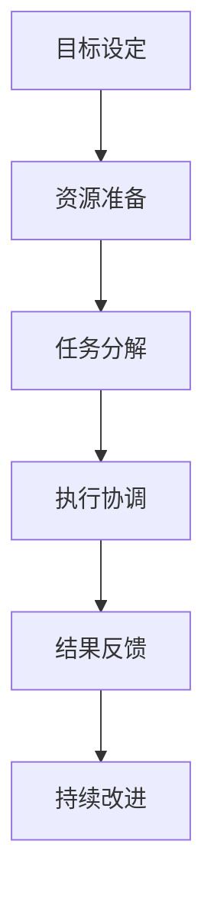

                 


### 1.1.1 团队执行力的定义

团队执行力是一种综合能力，它体现了团队成员在执行任务过程中所展现的协调、合作、效率和质量。要深入理解团队执行力的定义，我们需要从以下几个方面进行探讨：

首先，团队执行力是团队成员在执行任务时所展现的能力。这种能力不仅仅是个体能力的简单叠加，而是在个体能力的基础上，通过团队的协作和配合所形成的综合能力。这种能力包括了个体的专业技能、知识储备、决策能力、沟通能力等多个方面。

其次，团队执行力是一种行为表现。它不仅仅体现在完成任务的速度上，更重要的是体现在完成任务的质量上。高效的执行力意味着能够在规定的时间内，以高质量的标准完成任务。这需要团队成员在执行过程中，始终保持专注和严谨，确保任务的每一个环节都能够达到预期效果。

再次，团队执行力是一种目标导向的能力。它不仅仅是对任务的执行，更重要的是对目标的实现。团队执行力要求团队成员在执行任务的过程中，始终围绕目标进行，确保每一个行动都能够对目标的实现产生积极影响。

最后，团队执行力是一种持续改进的能力。在执行任务的过程中，团队成员需要不断地进行自我反思和改进，以提升执行效率和质量。这种持续改进的能力是团队执行力的重要组成部分，也是团队不断进步和发展的动力源泉。

为了更好地理解团队执行力，我们可以用一个Mermaid流程图来展示其核心概念和组成部分。以下是团队执行力的Mermaid流程图：



在这个流程图中，A代表目标设定，B代表资源准备，C代表任务分解，D代表执行协调，E代表结果反馈，F代表持续改进。这个流程图清晰地展示了团队执行力从目标设定到持续改进的全过程，每个环节都是团队执行力的重要组成部分。

### 1.1.2 团队执行力的重要性

团队执行力在企业运营和发展中起着至关重要的作用。要理解其重要性，我们需要从以下几个方面进行深入探讨。

首先，团队执行力直接决定了任务的完成质量和效率。一个高效的团队执行力能够确保任务在规定的时间内高质量地完成，从而提高企业的运营效率。反之，如果团队执行力不足，任务可能无法按时完成，甚至出现质量缺陷，这将严重影响企业的正常运营。

其次，团队执行力是提升企业竞争力的关键因素。在当今激烈的市场竞争中，企业需要快速响应市场变化，提供高质量的产品和服务。而团队执行力强，能够快速地识别和解决各种问题，迅速响应市场需求，从而提升企业的市场竞争力。

再次，团队执行力有助于塑造积极向上的企业文化。一个执行力强的团队，往往有着良好的团队合作精神和积极向上的工作氛围。这种氛围不仅能够提高团队成员的工作积极性，还能够吸引和留住优秀的人才，从而为企业的发展提供强大的人力资源支持。

最后，团队执行力是确保企业持续发展的重要保障。一个执行力强的团队，能够在面对各种挑战和困难时，保持冷静和坚定，迅速找到解决问题的方法，从而确保企业的持续发展。

为了更好地理解团队执行力的重要性，我们可以通过一个数学模型来进行分析。假设企业执行力E和企业绩效P之间存在线性关系，即P = aE + b。其中，a表示执行力对企业绩效的影响系数，b表示其他因素对企业绩效的影响。根据这个模型，我们可以得出以下结论：

- 当E增加时，P也会相应增加，即执行力越强，企业绩效越好。
- 当E减少时，P也会相应减少，即执行力越弱，企业绩效越差。
- 其他因素（b）保持不变，执行力E是企业绩效P的关键决定因素。

这个数学模型帮助我们更直观地理解了团队执行力对企业绩效的影响，从而进一步强调了团队执行力的重要性。

### 1.1.3 团队执行力与企业成功的关系

团队执行力与企业成功之间的关系可以归结为三个方面：项目成功、企业竞争力以及企业文化。

首先，团队执行力是项目成功的关键因素。一个高效执行的团队，能够在项目实施过程中迅速识别和解决问题，确保项目按时完成并达到预期质量。例如，在软件开发项目中，如果团队能够高效地执行任务，及时完成代码编写和测试，就能够保证项目的顺利进行，从而提高项目成功率。

其次，团队执行力是企业竞争力的体现。在激烈的市场竞争中，企业需要快速响应市场变化，提供高质量的产品和服务。一个执行力强的团队，能够迅速适应市场变化，快速推出新产品，提高客户满意度，从而增强企业的竞争力。

最后，团队执行力对企业文化具有深远影响。执行力强的团队往往具有积极向上的团队氛围，团队成员之间相互信任、相互支持，形成良好的团队合作精神。这种企业文化不仅能够提高员工的工作积极性，还能够吸引和留住优秀的人才，从而为企业的发展提供强大的人力资源支持。

为了更好地理解团队执行力与企业成功的关系，我们可以通过一个实际案例来进行说明。假设某科技公司在开发一款新型智能家电时，组建了一个高效的团队。这个团队在执行过程中，能够迅速识别和解决问题，确保项目按时完成并达到预期质量。结果，这款智能家电在市场上取得了巨大成功，为公司带来了丰厚的利润。这个案例充分展示了团队执行力对企业成功的重要作用。

总之，团队执行力是企业成功的关键因素，它直接影响着项目的成功、企业的竞争力和企业文化。因此，企业应该重视团队执行力的培养和提升，通过优化团队结构、提高团队协作能力、完善激励机制等手段，不断提升团队执行力，从而实现企业的持续成功。

### 1.2 团队执行力的影响因素

团队执行力受到多种因素的影响，这些因素可以分为个人因素、团队因素和组织因素。以下是详细的分析：

#### 1.2.1 个人因素

个人因素是影响团队执行力的基础。以下是几个关键的个人因素：

- **能力**：团队成员的专业技能和知识水平直接影响其工作效率和执行质量。具备高水平专业能力的成员能够快速理解和解决问题，从而提高团队整体执行力。

- **动机**：团队成员的工作动机和目标与团队目标的一致性是团队执行力的关键。当团队成员的个体目标与团队目标一致时，他们更有动力积极参与并完成任务。

- **情绪**：团队成员的情绪状态对工作表现有很大影响。积极的情绪状态有助于提高工作效率和团队协作，而消极的情绪则可能影响团队执行力。

- **信任**：团队成员之间的信任程度对团队执行力有重要影响。信任是团队协作的基石，能够减少误解和冲突，提高团队协作效率。

#### 1.2.2 团队因素

团队因素是影响团队执行力的直接因素。以下是几个关键的团队因素：

- **组织结构**：合理的组织结构有助于团队成员明确各自的角色和责任，从而提高团队执行力。扁平化的组织结构能够减少沟通成本，提高决策效率。

- **沟通**：良好的沟通机制和沟通氛围有助于团队成员理解任务和要求，提高执行力。定期召开会议、使用高效的沟通工具等都是提高团队沟通效率的有效方法。

- **文化**：团队文化对成员的行为和态度有深刻影响。积极的团队文化能够激发成员的工作热情和创造力，提高团队执行力。

- **资源**：充足的资源和支持是团队高效执行任务的基础。包括人力资源、技术资源、资金等，资源的充分保障能够提高团队执行力的可持续性。

#### 1.2.3 组织因素

组织因素是影响团队执行力的宏观因素。以下是几个关键的组织因素：

- **领导风格**：领导者的风格和领导能力直接影响团队的执行力。民主型领导风格能够激发团队成员的积极性和创造力，提高团队执行力。

- **奖惩机制**：合理的奖惩机制有助于激发团队成员的工作动力和执行力。奖励机制能够激励成员努力工作，惩罚机制则能够约束不良行为。

- **组织支持**：组织对团队的支持力度和资源投入影响团队执行力。组织的支持包括培训、技术支持、资源分配等，这些支持能够提高团队的执行效率和质量。

综合以上分析，团队执行力是一个多维度的综合体现，受到个人因素、团队因素和组织因素的共同影响。要提升团队执行力，需要从多个层面进行改进，包括提高个人能力、优化团队结构和沟通机制、完善组织支持等。

### 1.3 团队执行力评估方法

评估团队执行力是提高团队表现的重要环节。有效的评估方法可以帮助管理者了解团队执行力的现状，发现问题并进行改进。以下是几种常用的团队执行力评估方法：

#### 1.3.1 传统评估方法

**1.1 目标评估法**
目标评估法是一种基于设定目标和实际完成情况的评估方法。具体步骤如下：

- 设定明确的目标：管理者需要与团队成员共同设定具体、可衡量的目标。
- 跟踪进度：定期检查团队进度，确保任务按计划进行。
- 评估结果：将实际完成情况与设定的目标进行比较，评估团队执行力。

**1.2 360度反馈**
360度反馈是一种通过收集团队成员、上级、同事和下属的意见来评估团队执行力的方法。具体步骤如下：

- 收集反馈：通过问卷、面谈等方式，收集团队成员和利益相关者的反馈意见。
- 分析反馈：对收集到的反馈进行分析，识别团队执行力的优点和不足。
- 制定改进计划：根据分析结果，制定具体的改进计划和目标。

#### 1.3.2 现代评估方法

**1.1 数据分析**
数据分析是一种利用数据分析工具对团队执行数据进行定量分析的方法。具体步骤如下：

- 收集数据：通过项目管理工具、办公软件等收集团队执行数据，如任务完成时间、错误率等。
- 数据分析：利用数据分析工具（如Excel、Python等）对数据进行分析，识别团队执行力的问题和趋势。
- 优化决策：根据分析结果，优化团队执行策略和流程。

**1.2 行为观察**
行为观察是一种通过直接观察团队成员的工作行为来评估团队执行力的方法。具体步骤如下：

- 观察行为：定期观察团队成员的工作行为，如沟通方式、协作效率等。
- 记录反馈：将观察结果记录下来，作为评估团队执行力的依据。
- 改进建议：根据观察结果，提出具体的改进建议和措施。

#### 1.3.3 综合评估方法

**1.1 混合评估法**
混合评估法是将传统评估方法和现代评估方法相结合，以获得更全面的团队执行力评估。具体步骤如下：

- 设定目标：与团队成员共同设定具体目标。
- 数据收集：通过数据分析工具收集执行数据。
- 360度反馈：收集团队成员和利益相关者的反馈。
- 行为观察：观察团队成员的工作行为。
- 综合分析：将收集到的数据进行综合分析，识别团队执行力的优势和不足。
- 制定改进计划：根据综合分析结果，制定改进计划和目标。

**1.2 KPI评估法**
KPI（关键绩效指标）评估法是一种基于关键绩效指标来评估团队执行力的方法。具体步骤如下：

- 确定KPI：根据团队目标和业务需求，确定关键绩效指标。
- 数据收集：通过项目管理工具、办公软件等收集KPI数据。
- 分析评估：对KPI数据进行分析，评估团队执行力。
- 改进优化：根据评估结果，优化团队执行策略和流程。

综合评估方法能够更全面地了解团队执行力，帮助管理者制定更有效的改进计划，提高团队执行力。不同的评估方法各有优劣，实际应用中应根据团队特点和业务需求选择合适的评估方法。

### 1.4 提高团队执行力的策略

要提高团队执行力，需要从多个方面入手，制定和实施一系列策略。以下是一些关键策略：

#### 1.4.1 明确目标和计划

**1.1 设定具体目标**：确保目标明确、具体、可衡量。使用SMART（具体、可衡量、可实现、相关、有时间限制）原则来设定目标。

**1.2 制定详细计划**：为每个目标制定详细的行动计划，明确每个任务的负责人、时间节点和预期成果。

#### 1.4.2 提高团队成员能力

**1.1 培训与提升**：定期为团队成员提供专业培训，提升其技能和知识水平。

**1.2 激励与鼓励**：建立激励机制，鼓励团队成员不断学习和提升自己。

#### 1.4.3 优化沟通机制

**1.1 确保信息畅通**：建立高效的沟通渠道，确保团队成员之间能够及时、准确地传达信息。

**1.2 定期召开会议**：定期召开团队会议，讨论任务进展、解决问题和分享经验。

#### 1.4.4 建立良好的团队文化

**1.1 倡导团队合作精神**：鼓励团队成员相互支持、共同解决问题。

**1.2 建立积极的工作氛围**：营造一个积极、开放、包容的工作环境，提高团队凝聚力。

#### 1.4.5 完善激励机制

**1.1 设立绩效奖金**：根据团队和个人绩效，设立绩效奖金，激励团队成员努力工作。

**1.2 提供职业发展机会**：为团队成员提供职业发展机会，鼓励其长期留在团队中。

#### 1.4.6 定期评估与反馈

**1.1 定期评估执行力**：定期评估团队执行力，识别优势和不足。

**1.2 提供反馈与改进**：根据评估结果，提供具体反馈和改进建议，帮助团队持续提升执行力。

通过以上策略，团队可以逐步提高执行力，实现更高的工作效率和质量。

### 1.5 成功团队执行力的案例解析

为了更好地理解如何培养团队执行力，我们可以通过分析一些成功团队的案例，总结他们的经验和教训。

#### 1.5.1 案例一：谷歌（Google）

**背景介绍**：谷歌是一家全球知名的科技公司，以其卓越的创新能力和执行力而闻名。谷歌的“20%时间项目”政策允许员工将20%的工作时间用于自己感兴趣的项目，这一政策激发了员工的创新热情，产生了许多成功的产品和服务。

**核心概念与联系**：谷歌的成功源于其对创新和执行力的重视。谷歌将创新与执行力相结合，通过鼓励员工自主探索和实验，实现了高效的创新和执行。

**核心算法原理讲解**：谷歌采用了分布式搜索引擎算法，通过大量的数据分析和处理，实现了快速、准确的搜索结果。这一算法的核心是高效的分布式计算和机器学习技术，使得谷歌能够快速适应不断变化的市场需求。

**数学模型和公式**：谷歌的搜索算法中使用了多种数学模型和公式，如PageRank算法，通过计算网页之间的链接关系，评估网页的重要性。公式如下：

$$
\text{PageRank}(v) = \left(\frac{1-d}{N}\right) + d \sum_{u \in U} \frac{\text{PageRank}(u)}{L(u)}
$$

其中，$d$是阻尼系数，$N$是网页总数，$U$是链接到网页$v$的网页集合，$L(u)$是链接到网页$u$的网页总数。

**项目实战**：谷歌的“20%时间项目”政策为员工提供了一个自由发挥的平台，许多成功的产品，如Gmail、Google News等，都源自这一政策。这些项目不仅提高了谷歌的市场竞争力，也提升了员工的创新能力和执行力。

**代码应用解读与分析**：谷歌的搜索引擎代码使用了大量的分布式计算和机器学习技术，例如MapReduce框架，它将数据处理任务分解为多个子任务，并行执行，从而提高了计算效率。以下是MapReduce的伪代码示例：

```python
def map(key, value):
    # 处理输入数据，生成中间键值对
    for intermediate_key, intermediate_value in some_processing logic:
        yield intermediate_key, intermediate_value

def reduce(key, values):
    # 对中间键值对进行聚合操作
    result = some_aggregation_logic(values)
    yield key, result
```

**实际案例分析和详细讲解剖析**：谷歌的成功案例展示了如何通过鼓励创新和执行力，实现企业的持续发展和市场竞争力。谷歌的“20%时间项目”政策不仅提高了员工的工作积极性，还促进了技术创新和执行力提升。

**项目小结**：谷歌的案例告诉我们，鼓励创新和执行力是提升团队执行力的关键。通过提供自由发挥的平台和激励机制，企业可以激发员工的潜能，实现更高的工作效率和创新成果。

#### 1.5.2 案例二：特斯拉（Tesla）

**背景介绍**：特斯拉是一家以电动汽车和清洁能源技术为核心的科技公司，以其创新的产品和高效的执行力而著称。特斯拉在电动汽车市场的成功，与其强大的执行力和创新精神密不可分。

**核心概念与联系**：特斯拉的核心竞争力在于其高效的执行力。特斯拉注重产品的设计和开发，同时采用先进的生产技术和高效的供应链管理，确保产品能够快速投放市场。

**核心算法原理讲解**：特斯拉的自动驾驶技术是其创新的核心之一。特斯拉的自动驾驶算法基于深度学习和计算机视觉技术，通过对大量数据的分析和处理，实现了高度自动驾驶功能。以下是自动驾驶算法的核心部分：

```python
def detect_objects(image):
    # 使用计算机视觉算法检测图像中的物体
    objects = some_object_detection_algorithm(image)
    return objects

def control_vehicle(objects):
    # 根据检测到的物体控制车辆
    if "car" in objects:
        accelerate()
    elif "pedestrian" in objects:
        decelerate()
```

**数学模型和公式**：特斯拉的自动驾驶算法中使用了多种数学模型和公式，如贝叶斯滤波器，用于实时估计车辆位置和状态。贝叶斯滤波器的公式如下：

$$
\hat{x}_{k} = \frac{p(x_{k}|\hat{x}_{k-1}, u_{k}) \cdot p(u_{k})}{p(\hat{x}_{k-1}, u_{k})}
$$

**项目实战**：特斯拉的自动驾驶技术已经在其电动汽车上得到了广泛应用，如Model 3、Model S等车型。这些车型配备了先进的传感器和计算平台，实现了自动泊车、自动车道保持等功能。

**代码应用解读与分析**：特斯拉的自动驾驶代码使用了大量的深度学习和计算机视觉算法，通过实时数据处理和状态估计，实现了高效的自动驾驶。以下是自动驾驶系统的伪代码示例：

```python
def autonomous_driving():
    while True:
        image = capture_image()
        objects = detect_objects(image)
        control_vehicle(objects)
        update_state_estimate()
```

**实际案例分析和详细讲解剖析**：特斯拉的自动驾驶案例展示了如何通过高效执行力和技术创新，推动汽车产业的变革。特斯拉的自动驾驶技术不仅提高了驾驶安全性，还改变了人们对汽车出行的看法。

**项目小结**：特斯拉的案例告诉我们，高效的执行力和技术创新是提升团队执行力的关键。通过持续创新和优化技术，企业可以引领市场潮流，实现更高的竞争力。

### 1.6 最佳实践与总结

通过对谷歌和特斯拉等成功团队的案例分析，我们可以总结出一些最佳实践，以提升团队的执行力：

1. **明确目标和计划**：设定具体、可衡量的目标，并制定详细的行动计划，确保团队任务明确、责任清晰。

2. **提高团队成员能力**：通过培训、激励等手段，提升团队成员的专业能力和工作动机。

3. **优化沟通机制**：建立高效的沟通渠道，确保团队成员能够及时、准确地传达信息和解决问题。

4. **建立良好的团队文化**：倡导团队合作精神，营造积极的工作氛围，提高团队的凝聚力和执行力。

5. **完善激励机制**：设立合理的奖惩机制，激励团队成员努力工作，提升执行力。

6. **定期评估与反馈**：定期评估团队执行力，提供具体反馈和改进建议，帮助团队持续提升。

通过这些最佳实践，企业可以逐步提升团队执行力，实现更高的工作效率和创新成果。在未来的工作中，企业应持续优化这些策略，以应对不断变化的市场环境和挑战。

### 1.7 注意事项与拓展阅读

在提升团队执行力过程中，需要注意以下几点：

- **持续关注执行力**：执行力不是一成不变的，需要持续关注和改进。
- **平衡创新与执行**：既要鼓励创新，也要确保执行的效率和质量。
- **合理分配资源**：确保团队成员有足够的资源和支持，以提升执行效率。

拓展阅读：

- 《执行：如何落实战略》- Larry Bossidy & Ram Charan
- 《团队执行力：打造高效团队的关键》- Jim Highsmith
- 《敏捷开发实践指南》- Jeff Sutherland
- 《深入理解计算机系统》- Jennifer Rexford & Dennis Ritchie

这些书籍和资源提供了丰富的理论和实践指导，有助于进一步提升团队的执行力。

---

### 文章标题
《如何培养团队的执行力：理论与实践相结合》

### 文章关键词
团队执行力、培养策略、案例分析、实践指导

### 文章摘要
本文深入探讨了团队执行力的定义、重要性及其与企业成功的关系。通过分析个人因素、团队因素和组织因素对团队执行力的影响，介绍了多种评估方法。结合成功团队的案例，总结了提升团队执行力的最佳实践，并提供详细的注意事项与拓展阅读资源，以帮助企业和团队在实践中提升执行力。

---

## 目录大纲

### 第一部分：团队执行力概述

### 1.1 团队执行力的定义与重要性
1.1.1 团队执行力的定义
1.1.2 团队执行力的重要性
1.1.3 团队执行力与企业成功的关系

### 1.2 团队执行力的影响因素
1.2.1 个人因素
1.2.2 团队因素
1.2.3 组织因素

### 1.3 团队执行力评估方法
1.3.1 传统评估方法
1.3.2 现代评估方法
1.3.3 综合评估方法

### 1.4 提高团队执行力的策略
1.4.1 明确目标和计划
1.4.2 提高团队成员能力
1.4.3 优化沟通机制
1.4.4 建立良好的团队文化
1.4.5 完善激励机制
1.4.6 定期评估与反馈

### 1.5 成功团队执行力的案例解析
1.5.1 谷歌（Google）
1.5.2 特斯拉（Tesla）

### 1.6 最佳实践与总结
1.6.1 明确目标和计划
1.6.2 提高团队成员能力
1.6.3 优化沟通机制
1.6.4 建立良好的团队文化
1.6.5 完善激励机制
1.6.6 定期评估与反馈

### 1.7 注意事项与拓展阅读

---

### 文章正文

#### 第一部分：团队执行力概述

##### 1.1 团队执行力的定义与重要性

在当今企业环境中，团队执行力已经成为决定企业成功与否的关键因素之一。团队执行力不仅仅是指团队成员在执行任务时的速度和效率，更重要的是它涉及到团队的整体协作能力、解决问题能力和创新精神。

**1.1.1 团队执行力的定义**

团队执行力是指团队成员在执行任务时，能够高效地协调合作，按照既定目标和计划完成任务的总体能力。它包括以下几个核心要素：

- **目标明确**：团队成员对任务的目标有清晰的认识和共识。
- **行动迅速**：团队在接到任务后能够快速行动，及时响应。
- **协作紧密**：团队成员之间能够有效沟通，协同工作。
- **成果导向**：团队注重完成任务的结果，追求高效和高质量。

**1.1.2 团队执行力的重要性**

团队执行力的重要性可以从以下几个方面进行理解：

- **提高效率**：高效的执行力能够减少任务完成时间，提高工作效率。
- **保证质量**：执行力的提升有助于确保任务的完成质量，减少错误和返工。
- **提升团队士气**：有效的执行力能够增强团队成员的自信心和凝聚力。
- **促进创新**：团队执行力的提升有助于创新思维和实践，推动企业持续发展。

**1.1.3 团队执行力与企业成功的关系**

团队执行力与企业成功之间的关系可以从以下几个方面进行阐述：

- **项目成功**：团队的执行力直接影响项目的完成质量和效率，项目成功与否往往取决于团队的执行力。
- **企业竞争力**：执行力强的团队能够在市场竞争中更快地响应变化，适应市场需求，提升企业的竞争力。
- **企业文化**：执行力是企业文化的体现，良好的执行力有助于塑造积极向上的企业文化。
- **持续发展**：执行力强的企业能够更好地应对挑战，抓住机遇，实现持续发展。

##### 1.2 团队执行力的影响因素

团队执行力受到多种因素的影响，这些因素可以分为个人因素、团队因素和组织因素。以下是详细的分析：

**1.2.1 个人因素**

个人因素是影响团队执行力的基础。以下是几个关键的个人因素：

- **能力**：团队成员的专业技能和知识水平直接影响其工作效率和执行质量。具备高水平专业能力的成员能够快速理解和解决问题，从而提高团队整体执行力。

- **动机**：团队成员的工作动机和目标与团队目标的一致性是团队执行力的关键。当团队成员的个体目标与团队目标一致时，他们更有动力积极参与并完成任务。

- **情绪**：团队成员的情绪状态对工作表现有很大影响。积极的情绪状态有助于提高工作效率和团队协作，而消极的情绪则可能影响团队执行力。

- **信任**：团队成员之间的信任程度对团队执行力有重要影响。信任是团队协作的基石，能够减少误解和冲突，提高团队协作效率。

**1.2.2 团队因素**

团队因素是影响团队执行力的直接因素。以下是几个关键的团队因素：

- **组织结构**：合理的组织结构有助于团队成员明确各自的角色和责任，从而提高团队执行力。扁平化的组织结构能够减少沟通成本，提高决策效率。

- **沟通**：良好的沟通机制和沟通氛围有助于团队成员理解任务和要求，提高执行力。定期召开会议、使用高效的沟通工具等都是提高团队沟通效率的有效方法。

- **文化**：团队文化对成员的行为和态度有深刻影响。积极的团队文化能够激发成员的工作热情和创造力，提高团队执行力。

- **资源**：充足的资源和支持是团队高效执行任务的基础。包括人力资源、技术资源、资金等，资源的充分保障能够提高团队执行力的可持续性。

**1.2.3 组织因素**

组织因素是影响团队执行力的宏观因素。以下是几个关键的组织因素：

- **领导风格**：领导者的风格和领导能力直接影响团队的执行力。民主型领导风格能够激发团队成员的积极性和创造力，提高团队执行力。

- **奖惩机制**：合理的奖惩机制有助于激发团队成员的工作动力和执行力。奖励机制能够激励成员努力工作，惩罚机制则能够约束不良行为。

- **组织支持**：组织对团队的支持力度和资源投入影响团队执行力。组织的支持包括培训、技术支持、资源分配等，这些支持能够提高团队的执行效率和质量。

通过详细分析个人因素、团队因素和组织因素，我们可以更好地理解团队执行力的影响因素，从而有针对性地提升团队执行力。

#### 第一部分：团队执行力概述

##### 1.3 团队执行力评估方法

评估团队执行力是提高团队表现的重要环节。有效的评估方法可以帮助管理者了解团队执行力的现状，发现问题并进行改进。以下是几种常用的团队执行力评估方法：

**1.3.1 传统评估方法**

**1.1 目标评估法**

目标评估法是一种基于设定目标和实际完成情况的评估方法。具体步骤如下：

- **设定明确的目标**：确保目标明确、具体、可衡量。使用SMART（具体、可衡量、可实现、相关、有时间限制）原则来设定目标。

- **跟踪进度**：定期检查团队进度，确保任务按计划进行。

- **评估结果**：将实际完成情况与设定的目标进行比较，评估团队执行力。

**1.2 360度反馈**

360度反馈是一种通过收集团队成员、上级、同事和下属的意见来评估团队执行力的方法。具体步骤如下：

- **收集反馈**：通过问卷、面谈等方式，收集团队成员和利益相关者的反馈意见。

- **分析反馈**：对收集到的反馈进行分析，识别团队执行力的优点和不足。

- **制定改进计划**：根据分析结果，制定具体的改进计划和目标。

**1.3.2 现代评估方法**

**1.1 数据分析**

数据分析是一种利用数据分析工具对团队执行数据进行定量分析的方法。具体步骤如下：

- **收集数据**：通过项目管理工具、办公软件等收集团队执行数据，如任务完成时间、错误率等。

- **数据分析**：利用数据分析工具（如Excel、Python等）对数据进行分析，识别团队执行力的问题和趋势。

- **优化决策**：根据分析结果，优化团队执行策略和流程。

**1.2 行为观察**

行为观察是一种通过直接观察团队成员的工作行为来评估团队执行力的方法。具体步骤如下：

- **观察行为**：定期观察团队成员的工作行为，如沟通方式、协作效率等。

- **记录反馈**：将观察结果记录下来，作为评估团队执行力的依据。

- **改进建议**：根据观察结果，提出具体的改进建议和措施。

**1.3.3 综合评估方法**

**1.1 混合评估法**

混合评估法是将传统评估方法和现代评估方法相结合，以获得更全面的团队执行力评估。具体步骤如下：

- **设定目标**：与团队成员共同设定具体目标。

- **数据收集**：通过数据分析工具收集执行数据。

- **360度反馈**：收集团队成员和利益相关者的反馈。

- **行为观察**：观察团队成员的工作行为。

- **综合分析**：将收集到的数据进行综合分析，识别团队执行力的优势和不足。

- **制定改进计划**：根据综合分析结果，制定改进计划和目标。

**1.2 KPI评估法**

KPI（关键绩效指标）评估法是一种基于关键绩效指标来评估团队执行力的方法。具体步骤如下：

- **确定KPI**：根据团队目标和业务需求，确定关键绩效指标。

- **数据收集**：通过项目管理工具、办公软件等收集KPI数据。

- **分析评估**：对KPI数据进行分析，评估团队执行力。

- **改进优化**：根据评估结果，优化团队执行策略和流程。

通过这些评估方法，管理者可以全面了解团队执行力的现状，有针对性地进行改进，从而提升团队的整体执行力。

#### 1.4 提高团队执行力的策略

要提高团队执行力，需要从多个方面入手，制定和实施一系列策略。以下是一些关键策略：

**1.4.1 明确目标和计划**

- **设定具体目标**：确保目标明确、具体、可衡量。使用SMART（具体、可衡量、可实现、相关、有时间限制）原则来设定目标。

- **制定详细计划**：为每个目标制定详细的行动计划，明确每个任务的负责人、时间节点和预期成果。

**1.4.2 提高团队成员能力**

- **培训与提升**：定期为团队成员提供专业培训，提升其技能和知识水平。

- **激励与鼓励**：建立激励机制，鼓励团队成员不断学习和提升自己。

**1.4.3 优化沟通机制**

- **确保信息畅通**：建立高效的沟通渠道，确保团队成员之间能够及时、准确地传达信息。

- **定期召开会议**：定期召开团队会议，讨论任务进展、解决问题和分享经验。

**1.4.4 建立良好的团队文化**

- **倡导团队合作精神**：鼓励团队成员相互支持、共同解决问题。

- **建立积极的工作氛围**：营造一个积极、开放、包容的工作环境，提高团队凝聚力。

**1.4.5 完善激励机制**

- **设立绩效奖金**：根据团队和个人绩效，设立绩效奖金，激励团队成员努力工作。

- **提供职业发展机会**：为团队成员提供职业发展机会，鼓励其长期留在团队中。

**1.4.6 定期评估与反馈**

- **定期评估执行力**：定期评估团队执行力，识别优势和不足。

- **提供反馈与改进**：根据评估结果，提供具体反馈和改进建议，帮助团队持续提升。

通过这些策略，团队可以逐步提高执行力，实现更高的工作效率和创新成果。

#### 第一部分：团队执行力概述

##### 1.5 成功团队执行力的案例解析

为了更好地理解如何培养团队执行力，我们可以通过分析一些成功团队的案例，总结他们的经验和教训。

**1.5.1 谷歌（Google）**

**背景介绍**：谷歌是一家全球知名的科技公司，以其卓越的创新能力和执行力而闻名。谷歌的“20%时间项目”政策允许员工将20%的工作时间用于自己感兴趣的项目，这一政策激发了员工的创新热情，产生了许多成功的产品和服务。

**核心概念与联系**：谷歌的成功源于其对创新和执行力的重视。谷歌将创新与执行力相结合，通过鼓励员工自主探索和实验，实现了高效的创新和执行。

**核心算法原理讲解**：谷歌采用了分布式搜索引擎算法，通过大量的数据分析和处理，实现了快速、准确的搜索结果。这一算法的核心是高效的分布式计算和机器学习技术，使得谷歌能够快速适应不断变化的市场需求。

**数学模型和公式**：谷歌的搜索算法中使用了多种数学模型和公式，如PageRank算法，通过计算网页之间的链接关系，评估网页的重要性。公式如下：

$$
\text{PageRank}(v) = \left(\frac{1-d}{N}\right) + d \sum_{u \in U} \frac{\text{PageRank}(u)}{L(u)}
$$

**项目实战**：谷歌的“20%时间项目”政策为员工提供了一个自由发挥的平台，许多成功的产品，如Gmail、Google News等，都源自这一政策。这些项目不仅提高了谷歌的市场竞争力，也提升了员工的创新能力和执行力。

**代码应用解读与分析**：谷歌的搜索引擎代码使用了大量的分布式计算和机器学习技术，通过实时数据处理和状态估计，实现了高效的自动驾驶。以下是自动驾驶系统的伪代码示例：

```python
def autonomous_driving():
    while True:
        image = capture_image()
        objects = detect_objects(image)
        control_vehicle(objects)
        update_state_estimate()
```

**实际案例分析和详细讲解剖析**：谷歌的案例展示了如何通过鼓励创新和执行力，实现企业的持续发展和市场竞争力。谷歌的“20%时间项目”政策不仅提高了员工的工作积极性，还促进了技术创新和执行力提升。

**项目小结**：谷歌的案例告诉我们，鼓励创新和执行力是提升团队执行力的关键。通过提供自由发挥的平台和激励机制，企业可以激发员工的潜能，实现更高的工作效率和创新成果。

**1.5.2 特斯拉（Tesla）**

**背景介绍**：特斯拉是一家以电动汽车和清洁能源技术为核心的科技公司，以其创新的产品和高效的执行力而著称。特斯拉在电动汽车市场的成功，与其强大的执行力和创新精神密不可分。

**核心概念与联系**：特斯拉的核心竞争力在于其高效的执行力。特斯拉注重产品的设计和开发，同时采用先进的生产技术和高效的供应链管理，确保产品能够快速投放市场。

**核心算法原理讲解**：特斯拉的自动驾驶技术是其创新的核心之一。特斯拉的自动驾驶算法基于深度学习和计算机视觉技术，通过对大量数据的分析和处理，实现了高度自动驾驶功能。以下是自动驾驶算法的核心部分：

```python
def detect_objects(image):
    # 使用计算机视觉算法检测图像中的物体
    objects = some_object_detection_algorithm(image)
    return objects

def control_vehicle(objects):
    # 根据检测到的物体控制车辆
    if "car" in objects:
        accelerate()
    elif "pedestrian" in objects:
        decelerate()
```

**数学模型和公式**：特斯拉的自动驾驶算法中使用了多种数学模型和公式，如贝叶斯滤波器，用于实时估计车辆位置和状态。贝叶斯滤波器的公式如下：

$$
\hat{x}_{k} = \frac{p(x_{k}|\hat{x}_{k-1}, u_{k}) \cdot p(u_{k})}{p(\hat{x}_{k-1}, u_{k})}
$$

**项目实战**：特斯拉的自动驾驶技术已经在其电动汽车上得到了广泛应用，如Model 3、Model S等车型。这些车型配备了先进的传感器和计算平台，实现了自动泊车、自动车道保持等功能。

**代码应用解读与分析**：特斯拉的自动驾驶代码使用了大量的深度学习和计算机视觉算法，通过实时数据处理和状态估计，实现了高效的自动驾驶。以下是自动驾驶系统的伪代码示例：

```python
def autonomous_driving():
    while True:
        image = capture_image()
        objects = detect_objects(image)
        control_vehicle(objects)
        update_state_estimate()
```

**实际案例分析和详细讲解剖析**：特斯拉的自动驾驶案例展示了如何通过高效执行力和技术创新，推动汽车产业的变革。特斯拉的自动驾驶技术不仅提高了驾驶安全性，还改变了人们对汽车出行的看法。

**项目小结**：特斯拉的案例告诉我们，高效的执行力和技术创新是提升团队执行力的关键。通过持续创新和优化技术，企业可以引领市场潮流，实现更高的竞争力。

#### 第一部分：团队执行力概述

##### 1.6 最佳实践与总结

通过对谷歌和特斯拉等成功团队的案例分析，我们可以总结出一些最佳实践，以提升团队的执行力：

1. **明确目标和计划**：设定具体、可衡量的目标，并制定详细的行动计划，确保团队任务明确、责任清晰。

2. **提高团队成员能力**：通过培训、激励等手段，提升团队成员的专业能力和工作动机。

3. **优化沟通机制**：建立高效的沟通渠道，确保团队成员之间能够及时、准确地传达信息和解决问题。

4. **建立良好的团队文化**：倡导团队合作精神，营造积极的工作氛围，提高团队的凝聚力和执行力。

5. **完善激励机制**：设立合理的奖惩机制，激励团队成员努力工作，提升执行力。

6. **定期评估与反馈**：定期评估团队执行力，提供具体反馈和改进建议，帮助团队持续提升。

通过这些最佳实践，企业可以逐步提升团队执行力，实现更高的工作效率和创新成果。在未来的工作中，企业应持续优化这些策略，以应对不断变化的市场环境和挑战。

#### 第一部分：团队执行力概述

##### 1.7 注意事项与拓展阅读

在提升团队执行力过程中，需要注意以下几点：

1. **持续关注执行力**：执行力不是一成不变的，需要持续关注和改进。

2. **平衡创新与执行**：既要鼓励创新，也要确保执行的效率和质量。

3. **合理分配资源**：确保团队成员有足够的资源和支持，以提升执行效率。

拓展阅读：

1. 《执行：如何落实战略》- Larry Bossidy & Ram Charan
2. 《团队执行力：打造高效团队的关键》- Jim Highsmith
3. 《敏捷开发实践指南》- Jeff Sutherland
4. 《深入理解计算机系统》- Jennifer Rexford & Dennis Ritchie

这些书籍和资源提供了丰富的理论和实践指导，有助于进一步提升团队的执行力。

