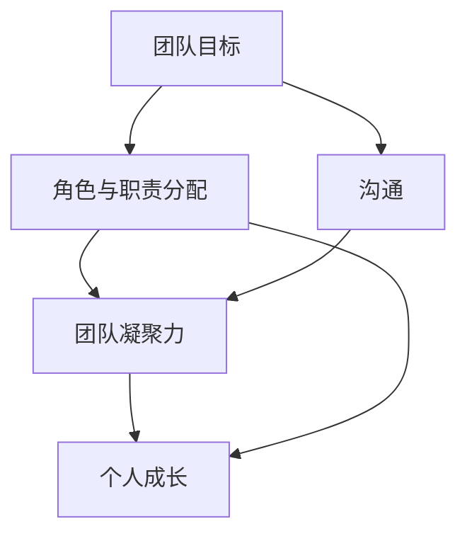
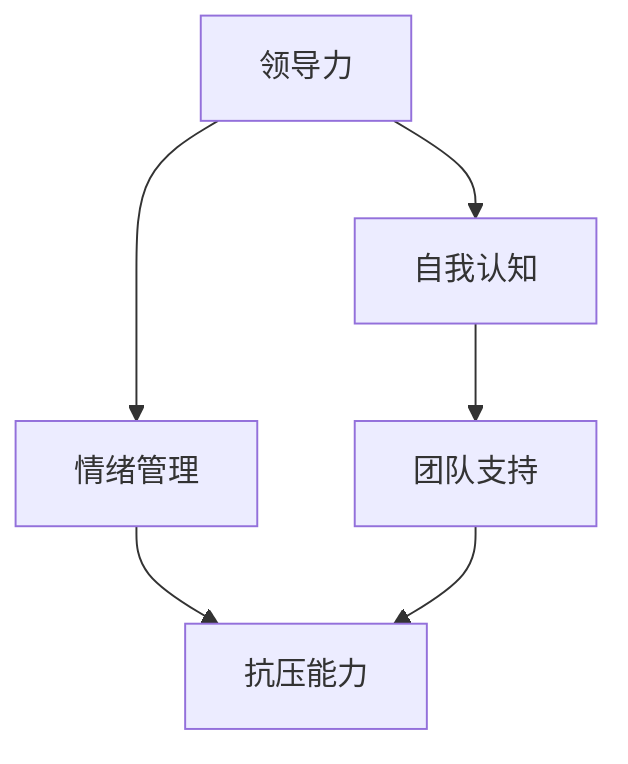

                 

### 文章标题

《如何培养团队的抗压能力和韧性》

### 关键词

团队建设、抗压能力、韧性培养、领导力、个人成长、压力应对策略

### 摘要

本文旨在探讨如何通过系统的方法论和实践指导，培养团队的抗压能力和韧性，从而提升团队整体绩效和成员的个人幸福感。文章从团队建设、领导力与个人成长、压力应对与韧性培养三个方面出发，详细分析了每个关键领域的核心概念、理论依据和实践方法。通过案例研究和实战分析，本文为读者提供了全面且实用的指南，帮助他们在实际工作中有效提升团队的抗压能力和韧性。

---

## 引言

在当今快速变化且竞争激烈的商业环境中，团队的有效运作对企业成功至关重要。一个拥有强大抗压能力和韧性的团队，不仅能够在压力之下保持稳定和高效，还能在逆境中找到机遇，实现持续成长。然而，许多团队在面对外部压力和内部挑战时，往往表现出疲软和动荡，这不仅影响了团队的绩效，也损害了成员的士气和幸福感。

培养团队的抗压能力和韧性已成为企业管理者和团队领导者面临的重要课题。本文将从团队建设、领导力与个人成长、压力应对与韧性培养三个方面，系统地探讨如何提升团队的抗压能力和韧性。通过深入分析和具体实践指导，本文希望为读者提供一套实用的方法论，帮助他们构建一个高效、稳定且具有强大适应能力的团队。

本文的结构如下：

1. **团队建设与组织结构**：探讨团队建设的重要性、团队组织结构与沟通、团队协作与协作工具。
2. **领导力与个人成长**：分析领导力与团队抗压能力的关系、个人成长与团队韧性、团队激励与文化建设。
3. **应对压力与韧性培养**：介绍压力源识别与应对策略、韧性团队的建设与实践、案例研究与分析。
4. **总结**：对全文进行总结，并强调培养团队抗压能力和韧性的重要性。

接下来，我们将逐步深入探讨每个部分的核心内容，帮助读者全面理解如何培养团队的抗压能力和韧性。

---

## 团队建设的重要性

团队建设是提升团队抗压能力和韧性的基础。一个高效的团队不仅能协调成员间的合作关系，还能在压力之下保持高效运作。团队建设的重要性主要体现在以下几个方面：

### 1. 提升团队协作效率

良好的团队建设有助于明确团队目标，确保所有成员都朝着共同的方向努力。通过制定明确的角色和职责分配，团队成员能够更好地协同工作，减少冲突和误解，从而提升整体协作效率。

### 2. 增强团队凝聚力

团队建设活动有助于增强团队成员之间的信任和凝聚力。通过共同经历挑战和完成任务，成员之间的情感联系得到加强，这种凝聚力在面临压力时尤为关键，能够帮助团队更好地应对外部压力。

### 3. 提高员工满意度

一个建设良好的团队会让成员感到归属感和满足感。当团队成员感受到团队的支持和关怀时，他们的工作热情和积极性会显著提高，从而提升整体员工满意度。

### 4. 促进个人成长

团队建设为成员提供了学习和成长的机会。通过团队合作，成员可以学习到新的技能和知识，提高个人能力和职业素养。这种个人成长不仅有助于提升团队成员的职业发展，还能为团队整体带来更大的价值。

### 5. 增强团队创新能力

一个高效的团队具备更强的创新能力。通过团队建设，成员能够开放思维，分享想法，共同探讨解决方案。这种创新氛围有助于团队在面对挑战时迅速找到有效的应对策略。

总之，团队建设是提升团队抗压能力和韧性的关键步骤。只有通过有效的团队建设，团队才能在面对压力时保持稳定和高效，实现持续成长。

### 核心概念与联系

为了更好地理解团队建设的重要性，我们需要探讨几个核心概念，并分析它们之间的联系。以下是几个关键概念及其相互关系的架构：

1. **团队目标**：团队目标是指团队共同努力达成的结果。它是团队建设和运作的核心，决定了团队成员的行为方向和努力目标。
2. **角色与职责分配**：角色与职责分配是指根据团队成员的特长和技能，为他们分配相应的职责和任务。这是团队协作的基础，确保每个成员都能发挥最大作用。
3. **沟通**：沟通是团队成员之间传递信息和共享知识的过程。有效的沟通可以减少误解和冲突，提高团队协作效率。
4. **团队凝聚力**：团队凝聚力是指团队成员之间的情感联系和相互信任程度。高凝聚力的团队在面对外部压力时能够更紧密地合作，共同应对挑战。
5. **个人成长**：个人成长是指团队成员通过团队合作学习和提升个人能力的过程。个人成长不仅有助于提升团队成员的职业素养，还能增强团队的整体实力。

以下是一个简单的Mermaid流程图，展示了这些概念之间的联系：



通过这个流程图，我们可以看到，团队目标决定了团队的方向，角色与职责分配确保了团队成员各司其职，沟通促进了信息的有效传递，团队凝聚力增强了成员之间的信任和合作，个人成长则不断提升了团队成员的能力和团队的整体实力。这些概念相互联系，共同构成了团队建设的核心。

### 团队组织结构与沟通

团队组织结构是团队建设的重要组成部分，它决定了团队成员之间的分工与合作方式。有效的团队组织结构能够促进沟通，提高团队效率，从而提升团队的整体抗压能力和韧性。

### 1. 团队组织结构设计

团队组织结构设计主要涉及以下几个方面：

#### 团队角色与职责分配

明确团队角色与职责是团队组织结构设计的核心。首先，团队领导者需要根据团队成员的特长和技能，为他们分配相应的角色和职责。例如，项目经理负责整体进度管理，技术专家负责关键技术问题的解决，设计师负责UI设计等。通过清晰的职责分配，团队成员能够明确自己的工作内容和目标，减少工作重叠和冲突。

#### 团队结构优化

团队结构并非一成不变，领导者应根据团队发展的不同阶段进行适当的调整。例如，在团队初期，可以采用扁平化的组织结构，提高团队决策效率；在团队发展壮大后，可以引入多层次的管理结构，提高团队的专业分工和管理效率。

#### 团队规模与人数

团队规模也是一个关键因素。小团队可以更灵活地应对变化，但可能缺乏专业深度；大团队则可以集合更多专业技能，但可能沟通成本较高，协调困难。因此，领导者需要根据项目的需求和团队的实际情况，合理控制团队规模。

### 2. 团队沟通的重要性

沟通是团队协作的核心，有效的沟通能够提高团队的工作效率，减少误解和冲突，从而提升团队的抗压能力。

#### 沟通的基本原则

良好的沟通需要遵循一些基本原则：

- **开放性**：鼓励团队成员表达自己的观点和意见，创造一个开放的氛围。
- **明确性**：确保信息传递的准确性和清晰性，避免产生误解。
- **及时性**：及时反馈和沟通，确保团队成员能够迅速了解进展和问题。
- **尊重性**：尊重每个成员的意见和贡献，避免歧视和偏见。

#### 沟通障碍与解决策略

沟通障碍是团队协作中常见的问题，主要包括：

- **信息过滤**：信息在传递过程中被扭曲或过滤，导致信息失真。
- **文化差异**：不同文化背景的成员在沟通中可能存在误解和冲突。
- **情绪因素**：情绪波动会影响沟通的效果，导致团队成员无法理性表达。

解决沟通障碍的策略包括：

- **建立透明的沟通渠道**：确保信息能够自由流通，减少信息过滤。
- **加强跨文化沟通培训**：提高团队成员的跨文化沟通能力，减少文化差异带来的误解。
- **情绪管理**：通过心理辅导和团队建设活动，帮助团队成员管理情绪，提高沟通效果。

### 3. 高效团队沟通的技巧

为了实现高效沟通，团队成员需要掌握一些具体的沟通技巧：

- **积极倾听**：认真倾听对方的观点，确保理解对方的意图。
- **提问和反馈**：通过提问和反馈，确保信息的准确性和完整性。
- **使用非语言沟通**：如肢体语言、面部表情等，增强沟通的效果。
- **时间管理**：合理安排沟通时间，确保沟通的效率。

通过有效的团队组织结构设计和沟通策略，团队可以在面对压力时保持稳定和高效，提升整体的抗压能力和韧性。

### 核心算法原理讲解与伪代码实现

在团队组织结构设计中，关键算法原理之一是角色与职责分配算法。该算法的目标是根据团队成员的技能和能力，将任务合理地分配给相应的角色，以最大化团队的整体效率。

#### 算法原理

角色与职责分配算法的核心是任务分配策略和角色匹配原则。以下是一个简化的伪代码实现，用于描述这一过程：

```pseudo
算法：角色与职责分配

输入：团队成员列表（每个成员的技能集）、任务列表（每个任务的技能需求）
输出：分配结果（每个任务指派给相应的团队成员）

步骤：
1. 初始化一个空的分配结果列表
2. 对每个任务，按照以下步骤进行分配：
   a. 从任务需求技能集中，找出具有这些技能的团队成员
   b. 从这些团队成员中，选择最适合的成员（例如，具有这些技能且当前空闲时间最长的成员）
   c. 将任务指派给该成员，并将其状态更新为“忙碌”
3. 重复步骤2，直到所有任务都得到分配
4. 输出最终的分配结果
```

#### 数学模型和公式

为了量化角色与职责分配的效果，我们可以引入以下数学模型和公式：

- **任务完成时间（T_i）**：指分配给某个成员的任务完成所需的时间。
- **成员空闲时间（F_j）**：指某个成员在一段时间内的空闲时间。
- **任务分配效率（E）**：衡量任务分配后，团队整体效率的指标。

一个简单的效率计算公式为：

$$ E = \frac{1}{\sum_{i=1}^{n} T_i} $$

其中，n 是任务的总数。

#### 举例说明

假设有一个由5名成员组成的团队，他们分别具有不同的技能。现在有3个任务需要分配，每个任务的技能需求如下：

- 任务1：需要编程和数据库管理技能。
- 任务2：需要UI设计和前端开发技能。
- 任务3：需要数据分析和管理技能。

团队成员及其技能和空闲时间如下：

| 成员 | 技能集 | 空闲时间（小时） |
| ---- | ---- | -------------- |
| A    | 编程，数据库管理，数据分析 | 20 |
| B    | UI设计，前端开发，数据分析 | 15 |
| C    | 编程，数据库管理，前端开发 | 25 |
| D    | 编程，UI设计，数据分析     | 30 |
| E    | 前端开发，UI设计          | 10 |

根据上述算法和公式，我们可以将任务分配如下：

- 任务1：指派给C（编程和数据库管理技能，空闲时间最长）。
- 任务2：指派给B（UI设计和前端开发技能，空闲时间最长）。
- 任务3：指派给A（数据分析和管理技能，空闲时间最长）。

计算任务完成时间：

- 任务1：T1 = 25小时。
- 任务2：T2 = 15小时。
- 任务3：T3 = 20小时。

计算总任务完成时间：

$$ T_{total} = T1 + T2 + T3 = 25 + 15 + 20 = 60小时 $$

计算任务分配效率：

$$ E = \frac{1}{T_{total}} = \frac{1}{60} \approx 0.0167 $$

这个效率指标表明，团队在分配任务后，整体效率较高，能够在较短时间内完成所有任务。

通过上述算法和数学模型，团队领导者可以更科学地分配任务，提高团队的整体效率，从而增强团队的抗压能力和韧性。

### 团队协作与协作工具

在团队工作中，协作是确保任务顺利完成和团队高效运作的关键。随着技术的发展，各种协作工具被广泛应用，极大地提升了团队的协作效率和沟通效果。以下是几种常见的团队协作工具及其使用方法。

### 1. 效率工具

#### Trello

Trello 是一款基于看板（Kanban）方法的项目管理工具，适合小团队使用。它通过创建不同的看板和卡片，帮助团队成员跟踪项目进度、任务分配和协作情况。

- **使用方法**：创建一个项目看板，每个看板代表一个项目阶段；在每个看板上创建卡片，每个卡片代表一个具体任务。团队成员可以将任务卡片拖动到不同的列表中，以表示任务的进展状态（如“待办”、“进行中”、“已完成”）。

#### Asana

Asana 是一款功能强大的项目管理工具，适用于中大型的团队。它支持任务分配、进度跟踪、时间管理等多种功能。

- **使用方法**：创建项目和工作区，将团队成员添加到工作区中。创建任务并将其分配给相应的团队成员，设置任务的截止日期和优先级。团队成员可以通过任务卡片查看自己的任务详情，并与团队成员协作讨论任务进展。

### 2. 项目管理工具

#### Jira

Jira 是一款流行的敏捷项目管理工具，广泛应用于软件开发团队。它支持敏捷开发方法，提供任务跟踪、用户故事管理、缺陷追踪等功能。

- **使用方法**：创建项目并设置相应的项目设置，如迭代周期、版本管理等。创建用户故事并将其分解为具体的任务，分配给团队成员。团队成员可以在任务卡片中记录任务进度，并参与讨论和协作。

#### Microsoft Project

Microsoft Project 是一款功能全面的桌面项目管理工具，适用于复杂的大型项目。它支持项目计划、资源分配、进度跟踪等多种功能。

- **使用方法**：创建项目文件，定义项目任务和资源，制定项目计划。通过甘特图和资源视图，跟踪项目进度和资源使用情况。使用任务分配功能，将任务分配给相应的团队成员。

### 3. 实践

在实际应用中，选择合适的协作工具需要考虑团队的规模、项目类型和团队成员的技能水平。以下是一个实际案例：

**案例：某软件开发团队使用Trello进行项目协作**

- **项目背景**：该团队负责开发一款移动应用，项目周期为6个月，分为多个阶段进行。
- **协作工具选择**：选择Trello作为项目协作工具，因为它简单直观，适合团队成员快速上手。
- **使用过程**：
  1. 创建一个主看板，包含“需求分析”、“设计”、“开发”、“测试”和“发布”等阶段。
  2. 在每个阶段创建相应的卡片，详细描述任务内容和需求。
  3. 将任务卡片分配给相应的团队成员，并设置任务的截止日期。
  4. 成员在任务卡片中记录自己的进展，并在任务卡片下进行讨论和协作。

通过Trello，团队成员能够清晰了解项目进度和任务分配，提高了协作效率和沟通效果，有效提升了团队的整体绩效。

总之，合理的团队协作工具选择和有效使用，是提升团队协作效率和抗压能力的关键。通过结合不同的协作工具，团队可以更好地应对复杂的项目任务，实现高效协作。

## 领导力与团队抗压能力

领导力在团队建设和团队抗压能力培养中起着至关重要的作用。一个优秀的领导者不仅能够明确团队目标，还能在压力之下稳定团队情绪，激励成员积极应对挑战。以下是领导力与团队抗压能力的几个关键方面：

### 1. 领导者的角色

领导者在团队中扮演着指挥者和协调者的角色。他们需要制定清晰的团队目标，确保每个成员都了解自己的任务和责任。此外，领导者还需要协调团队成员之间的关系，解决冲突，确保团队内部的和谐与高效。

### 2. 抗压能力的重要性

领导者的抗压能力直接影响团队的整体表现。在面对外部压力和内部挑战时，领导者需要保持冷静和清晰的思路，及时作出正确的决策。一个缺乏抗压能力的领导者可能会在压力下失去决策能力，导致团队陷入混乱和动荡。

### 3. 领导者的抗压能力培养

#### 自我认知与情绪管理

领导者需要具备良好的自我认知和情绪管理能力。通过自我反思和情绪调节，领导者可以更好地应对压力和挑战。以下是一些培养自我认知和情绪管理能力的策略：

- **自我反思**：定期进行自我反思，识别自己的情绪反应和行为模式，了解自己在压力下的表现。
- **情绪调节**：学习情绪调节技巧，如深呼吸、冥想、运动等，帮助自己保持冷静和专注。
- **寻求反馈**：从同事、下属和顾问那里获取反馈，了解自己的领导风格和抗压能力，不断改进和提升。

#### 应对压力的策略

领导者还需要掌握一些应对压力的具体策略，以帮助团队在压力下保持稳定和高效。以下是一些实用的应对策略：

- **明确目标**：确保团队目标明确、具体，并传达给每个成员，使团队在面对压力时有一个清晰的方向。
- **资源管理**：合理分配资源和时间，确保团队成员在压力下有足够的支持。
- **团队支持**：建立一个支持性的团队氛围，鼓励成员在遇到困难时相互帮助和支持。
- **灵活应对**：在面对突发情况时，领导者需要保持灵活性，迅速调整计划和策略，以应对变化。

通过培养自我认知和情绪管理能力，以及掌握应对压力的策略，领导者可以提升自己的抗压能力，从而更好地稳定团队情绪，提升团队的抗压能力和韧性。

### 核心概念与联系

为了更好地理解领导力与团队抗压能力之间的关系，我们需要探讨几个核心概念，并分析它们之间的联系。以下是几个关键概念及其相互关系的架构：

1. **领导力**：指领导者通过影响和激励团队成员来实现团队目标的能力。
2. **自我认知**：指领导者对自己的了解，包括自己的情绪、行为和价值观。
3. **情绪管理**：指领导者如何调节自己的情绪，以保持冷静和专注。
4. **团队支持**：指团队成员之间的相互支持和协作。
5. **抗压能力**：指领导者面对压力和挑战时的应对能力。

以下是一个简单的Mermaid流程图，展示了这些概念之间的联系：



通过这个流程图，我们可以看到，领导力通过影响自我认知和情绪管理，进而影响团队支持和抗压能力。自我认知和情绪管理帮助领导者更好地理解自己，从而提高情绪管理能力和抗压能力。团队支持则增强了领导者的信心，使其在面对压力时能够更有效地应对挑战。这些概念相互联系，共同构成了领导力与团队抗压能力的基础。

### 个人成长与团队韧性

个人成长在团队建设中扮演着至关重要的角色，它不仅影响团队成员的职业发展，还直接影响团队的整体韧性和抗压力。一个拥有高度个人成长的团队，能够更好地适应外部环境的变化，保持稳定和高效。

### 1. 个人成长对团队的重要性

#### 提升专业技能

个人成长意味着团队成员不断提升自己的专业技能和知识水平。这不仅使成员能够更好地完成自己的任务，还能为团队带来新的思维和方法。当团队成员具备丰富的技能和知识时，团队在面对复杂问题和挑战时能够迅速找到解决方案，提高整体的应对能力。

#### 增强学习能力

个人成长还包括培养学习能力和持续学习的习惯。一个具有高度学习能力的团队，能够不断吸收新的知识和技能，适应快速变化的市场和技术环境。这种学习能力使团队在面对不确定性和变化时，能够保持灵活和敏捷，从而提高团队的韧性。

#### 促进团队创新

个人成长促进了团队成员之间的交流与合作。当每个成员都愿意分享自己的知识和经验时，团队内部的知识共享和创新氛围得以增强。这种氛围有助于团队在面对挑战时，能够快速提出新的想法和解决方案，提高团队的创新能力和竞争力。

### 2. 培养个人韧性的方法

#### 建立积极的心态

建立积极的心态是培养个人韧性的基础。一个积极的心态使团队成员能够从失败和挫折中迅速恢复，并保持对未来的信心。以下是一些培养积极心态的方法：

- **积极思考**：鼓励团队成员在面对困难时，积极寻找解决方案，而不是沉浸在问题中。
- **感恩心态**：培养感恩心态，珍惜身边的资源和机会，即使面对挑战也能保持乐观。
- **正面激励**：通过鼓励和赞赏，激励团队成员保持积极的心态，面对挑战时保持信心。

#### 提升自我调适能力

自我调适能力是指个人在面对压力和变化时，能够迅速调整自己的情绪和行为，以适应新环境。以下是一些提升自我调适能力的策略：

- **情绪管理**：通过学习和实践情绪管理技巧，如深呼吸、冥想、运动等，帮助自己保持冷静和专注。
- **时间管理**：合理安排时间和任务，确保在压力下能够高效地完成工作，减少焦虑和紧张。
- **寻求支持**：在面对困难和挑战时，主动寻求同事、朋友和领导的支持和帮助，共同应对压力。

#### 强化心理韧性

心理韧性是指个人在面对逆境和挫折时，能够保持坚强和适应能力。以下是一些强化心理韧性的方法：

- **经历挫折**：通过经历一些挫折和挑战，增强个人的心理韧性，学会从失败中汲取经验和教训。
- **自我激励**：通过设定目标和奖励机制，激励自己在面对困难时保持动力和毅力。
- **积极应对**：学会积极应对生活中的各种挑战，把困难视为成长和提升的机会。

通过建立积极的心态、提升自我调适能力和强化心理韧性，团队成员可以更好地应对压力和挑战，提高个人的抗压能力和韧性。这不仅有助于个人的职业发展，也为团队的整体抗压力和韧性提供了有力保障。

### 团队激励与文化建设

团队激励与文化建设在提升团队整体绩效和员工幸福感方面起着至关重要的作用。有效的激励和积极的文化能够激发团队成员的工作热情，提高工作效率，增强团队凝聚力。以下是团队激励与文化建设的重要性和具体方法：

#### 1. 激励的重要性

#### 提升工作动力

激励是激发团队成员工作热情和积极性的关键因素。通过设立明确的目标和奖励机制，团队领导者可以鼓励成员为实现目标而努力。当成员感受到自己的工作被认可和重视时，他们的工作动力会显著提升。

#### 增强团队凝聚力

激励不仅能够提升个人绩效，还能增强团队凝聚力。当团队成员因为共同的目标和奖励而紧密合作时，他们之间的情感联系和信任感会得到加强。这种凝聚力在团队面对外部压力和内部挑战时尤为重要，能够帮助团队更有效地应对各种困难。

#### 提高员工满意度

有效的激励和积极的文化能够提高员工的满意度和幸福感。当团队成员感受到团队的支持和关怀时，他们的工作环境会更加积极和愉快，从而提高整体员工满意度。

#### 2. 文化建设的方法

#### 共同价值观的塑造

共同价值观是团队文化的核心，它为团队成员提供了共同的信仰和行为准则。团队领导者需要通过持续的沟通和实践活动，将共同价值观内化为团队成员的自觉行为。以下是一些塑造共同价值观的方法：

- **领导者的榜样作用**：团队领导者通过自身的行为和决策，展示共同价值观的具体体现，为团队成员树立榜样。
- **团队活动**：组织团队活动，如团建活动、培训课程等，帮助团队成员更好地理解和内化共同价值观。
- **文化墙和口号**：在办公环境中设置文化墙和口号，展示团队的共同价值观，营造积极的文化氛围。

#### 企业文化的传承与发展

企业文化不仅是团队的精神支柱，也是企业长期发展的基石。为了确保企业文化的传承和发展，团队领导者需要采取以下措施：

- **文化建设计划**：制定长期的文化建设计划，明确文化目标和实施步骤，确保文化建设的系统性和持续性。
- **员工培训**：定期对员工进行文化培训，帮助他们更好地理解和践行企业文化。
- **文化反馈机制**：建立文化反馈机制，鼓励员工提出意见和建议，不断完善和优化企业文化。

通过有效的激励和积极的文化建设，团队可以激发成员的工作热情，提高整体绩效，增强团队的抗压能力和韧性。

### 压力源识别与应对策略

在团队工作中，压力是一种常见的现象，它可能来自外部环境、工作压力、人际关系等多个方面。识别并有效应对这些压力源，对于提升团队的整体抗压能力和韧性至关重要。以下是关于压力源识别和应对策略的详细分析。

#### 1. 压力源的类型

压力源可以分为以下几种类型：

##### 外部压力

- **市场竞争**：激烈的市场竞争可能给团队带来额外的压力，要求团队成员提高工作效率和质量。
- **客户需求**：客户的高期望和快速变化的需求可能导致团队成员感到压力重重。
- **政策变化**：政策或法规的变化可能要求团队迅速调整工作方法和策略。

##### 工作压力

- **工作量**：工作量过大或任务过于繁重可能导致团队成员感到压力。
- **工作负荷**：长时间的工作负荷和高强度的工作节奏可能影响团队成员的健康和幸福感。
- **工作环境**：不良的工作环境，如噪音、拥挤、不安全等，也可能增加压力。

##### 人际关系

- **团队冲突**：团队成员之间的矛盾和冲突可能导致团队内部的不和谐，增加压力。
- **领导风格**：不合理的领导风格，如过度控制或缺乏支持，可能导致团队成员感到压力。
- **社会支持**：缺乏社会支持，如家庭或朋友的支持，可能使团队成员在面对压力时感到无助。

#### 2. 识别压力源的方法

##### 问卷调查

通过问卷调查，可以收集团队成员对压力源的主观感受和看法。问卷可以设计成封闭式或开放式问题，包括对工作环境、工作负荷、人际关系等方面的评价。

##### 个体访谈

个体访谈是一种深入了解团队成员压力源的有效方法。通过与团队成员进行一对一的深入交流，领导者可以了解他们的具体困境和感受，从而更准确地识别压力源。

##### 团队会议

团队会议可以提供一个公开的讨论平台，让团队成员共同讨论和分享压力源。这种互动有助于增强团队成员之间的理解和支持，同时也能识别出团队内部共性的压力源。

#### 3. 应对压力的策略

##### 心理调适技巧

心理调适技巧是帮助团队成员管理压力的重要方法。以下是一些实用的技巧：

- **时间管理**：合理安排时间，确保有足够的休息和放松时间，避免过度工作。
- **情绪管理**：通过深呼吸、冥想、运动等放松技巧，缓解情绪压力。
- **积极思维**：培养积极思维，从不同的角度看待问题，寻找积极的解决方案。

##### 团队支持

团队支持是应对压力的重要策略之一。以下是一些具体的措施：

- **建立支持小组**：鼓励团队成员组成支持小组，分享经验和感受，互相支持和鼓励。
- **团队建设活动**：定期组织团建活动，增强团队成员之间的情感联系，提高团队凝聚力。
- **领导者支持**：领导者应积极关注团队成员的身心健康，提供必要的支持和帮助。

##### 改善工作环境

改善工作环境也是应对压力的重要手段。以下是一些具体的改进措施：

- **工作流程优化**：优化工作流程，减少不必要的环节，提高工作效率。
- **资源分配**：合理分配资源，确保团队成员有足够的时间和资源完成工作任务。
- **工作环境改善**：改善工作环境，如增加休息区域、提供健康饮食等，提高员工的工作满意度和幸福感。

通过识别压力源并采取有效的应对策略，团队可以更好地应对压力，提升整体的抗压能力和韧性，从而实现更高的绩效和更好的工作体验。

### 韧性团队的建设与实践

韧性团队是指在面对外部压力和内部挑战时，能够迅速适应、有效应对并从中恢复的团队。建设一个韧性团队是提升团队整体抗压能力和绩效的关键。以下是关于韧性团队的建设和实践方法的详细探讨。

#### 1. 韧性团队的概念与特征

##### 概念

韧性团队（Resilient Team）是指具有高度适应性和灵活性的团队，能够在逆境中迅速恢复并重新恢复到正常运作状态。这种团队不仅能够有效应对突发事件和挑战，还能从经验中学习和成长，不断提升团队的整体能力。

##### 特征

- **快速适应能力**：韧性团队能够迅速适应环境变化，灵活调整策略和行动。
- **抗逆性**：团队在面对挑战和压力时能够保持稳定，不被困境击垮。
- **学习能力**：韧性团队能够从失败和挫折中学习，不断改进和提升团队表现。
- **团队凝聚力**：团队成员之间相互支持，形成紧密的团队关系，共同应对挑战。
- **自我调节能力**：团队成员能够自我调节情绪和行为，保持冷静和专注。

#### 2. 韧性团队建设的实践

##### 韧性文化的营造

文化是团队行为的指南，韧性文化的营造是建设韧性团队的基础。以下是一些营造韧性文化的关键措施：

- **透明沟通**：鼓励团队成员之间进行开放和诚实的沟通，确保信息流通顺畅。
- **共同价值观**：确立共同价值观，如诚信、创新、团队合作等，使团队成员有共同的目标和信念。
- **尊重差异**：尊重每个成员的观点和贡献，鼓励多样性和创新思维。
- **支持与鼓励**：建立支持性的团队氛围，鼓励团队成员在失败中学习和成长。

##### 韧性团队的管理策略

管理者在建设韧性团队中扮演着关键角色，以下是一些有效的管理策略：

- **领导者榜样作用**：领导者应以身作则，展现出坚韧和适应能力，为团队成员树立榜样。
- **灵活管理**：管理者应灵活调整管理策略，适应团队和项目的需求变化。
- **培训与发展**：定期对团队成员进行培训和技能提升，增强他们的适应能力和学习能力。
- **反馈与改进**：建立有效的反馈机制，鼓励团队成员提出意见和建议，不断改进团队运作。

#### 3. 实践案例

以下是一个韧性团队建设的实践案例：

**案例背景**：某科技公司面临市场激烈竞争和产品迭代速度加快的挑战，需要提升团队的韧性以应对外部压力。

**实践过程**：

1. **确立共同目标**：公司领导层与团队成员共同确立了一个明确的长期目标，即成为行业内最具竞争力的科技公司。

2. **韧性文化培养**：公司通过定期的团建活动和培训，培养团队成员的团队合作精神和适应能力。例如，组织户外拓展训练，提高团队成员的沟通和协作能力。

3. **灵活管理**：公司采用敏捷开发方法，灵活调整项目进度和资源分配，以应对市场需求的变化。

4. **培训与发展**：公司定期组织技术培训和团队建设课程，帮助团队成员提升技能和团队协作能力。

5. **反馈与改进**：公司建立了员工反馈机制，鼓励团队成员提出意见和建议，并在每周的团队会议上讨论和改进。

**效果评估**：通过韧性文化的培养和有效的管理策略，该科技公司的团队在面对市场竞争和产品迭代时，表现出较高的适应能力和抗逆性。团队成员的满意度和工作效率显著提升，公司的市场竞争力也得到加强。

通过上述实践，该科技公司成功建设了一个具有高度韧性的团队，为企业的长期发展奠定了坚实基础。

### 案例研究与分析

#### 案例一：谷歌的韧性团队建设

谷歌作为全球知名的科技公司，以其独特的文化和高效的工作方式著称。特别是在面临市场竞争和技术革新时，谷歌通过一系列措施成功建设了韧性团队。

**背景**：谷歌在互联网和科技公司不断涌现的竞争环境中，需要保持其领先地位。面对快速变化的市场和技术环境，谷歌的团队需要具备强大的韧性和适应能力。

**措施**：

1. **开放式文化**：谷歌强调开放和透明的沟通，鼓励团队成员分享想法和建议。这种开放的文化氛围有助于团队快速适应变化，并保持创新活力。

2. **持续培训**：谷歌提供丰富的培训资源和机会，帮助团队成员不断学习和提升技能。这种持续的培训机制使团队成员能够迅速应对新技术和新挑战。

3. **灵活管理**：谷歌采用敏捷开发方法，团队可以根据市场需求和技术变化灵活调整项目计划。这种灵活的管理方式提高了团队的适应能力和响应速度。

**效果**：通过这些措施，谷歌成功地保持了其技术领先地位，并在多个领域实现了突破。团队成员的满意度和工作积极性也显著提升。

**启示**：谷歌的成功表明，开放的文化、持续的学习和灵活的管理是建设韧性团队的关键。这些措施不仅提高了团队的适应能力，还增强了团队的凝聚力和创新能力。

#### 案例二：特斯拉的韧性团队建设

特斯拉作为电动汽车行业的领导者，其团队在应对市场和技术挑战时展现了强大的韧性。

**背景**：特斯拉在电动汽车市场的快速发展和竞争压力下，需要提高团队的韧性和应对能力。

**措施**：

1. **目标明确**：特斯拉明确其长期目标，即成为全球领先的可持续能源公司。这种明确的目标为团队成员提供了清晰的方向和动力。

2. **激励与奖励**：特斯拉通过丰厚的激励和奖励机制，激励团队成员为实现公司目标而努力。这种激励机制提高了团队成员的积极性和工作动力。

3. **技术创新**：特斯拉不断推动技术创新，通过研发新技术和产品，提高团队的技术能力和竞争力。

**效果**：通过这些措施，特斯拉在电动汽车市场上保持了领先地位，并迅速扩展了其全球影响力。团队成员的满意度和工作表现也得到显著提升。

**启示**：特斯拉的经验表明，明确的目标、有效的激励和持续的创新是建设韧性团队的重要策略。这些措施不仅提高了团队的韧性和适应能力，还增强了团队的创新动力。

通过这两个案例，我们可以看到韧性团队建设的关键措施和实际效果。这些案例为其他企业提供了宝贵的经验和启示，帮助他们在面临市场竞争和技术变革时，建设一个具有强大韧性的团队。

### 附录A：相关工具与资源推荐

在培养团队的抗压能力和韧性方面，有许多工具和资源可以帮助团队和领导者更有效地应对挑战。以下是一些推荐的工具和资源：

#### 工具推荐

1. **Trello**：一款基于看板方法的项目管理工具，适用于任务跟踪和协作。
2. **Asana**：功能强大的项目管理工具，支持任务分配、进度跟踪和时间管理。
3. **Jira**：流行的敏捷项目管理工具，适用于软件开发团队。
4. **Slack**：高效的团队沟通工具，支持实时聊天、文件共享和协作。
5. **Miro**：虚拟白板工具，适用于团队头脑风暴和协作会议。

#### 资源推荐

1. **《韧性团队：如何在不确定的时代保持竞争力》**：这是一本关于团队韧性的经典著作，提供了丰富的理论和方法。
2. **《团队协作的艺术》**：作者讨论了团队协作的关键要素和技巧，适用于希望提升团队效能的领导者和管理者。
3. **Coursera**：在线学习平台，提供了关于领导力、项目管理、团队建设等多个领域的课程。
4. **LinkedIn Learning**：提供专业的在线培训课程，涵盖了团队管理、沟通技巧、压力管理等多个方面。
5. **MindTools**：一个提供各种职场技能的资源网站，包括时间管理、沟通技巧、压力管理等。

通过使用这些工具和资源，团队和领导者可以更有效地培养团队的抗压能力和韧性，提高整体绩效和成员的幸福感。

### 总结

本文从团队建设、领导力与个人成长、压力应对与韧性培养三个方面，系统地探讨了如何培养团队的抗压能力和韧性。我们分析了团队建设的重要性，介绍了团队组织结构与沟通的方法，强调了领导力在团队抗压能力培养中的作用，探讨了个人成长与团队韧性的关系，并提供了有效的激励和文化建设策略。同时，我们详细介绍了压力源识别与应对策略，以及韧性团队的建设与实践。通过这些探讨，我们希望为读者提供一套实用的方法论，帮助他们在实际工作中有效提升团队的抗压能力和韧性。

培养团队的抗压能力和韧性，不仅是提升团队整体绩效的关键，也是实现企业长期发展的基础。通过本文的探讨，我们相信读者能够更好地理解如何通过系统的方法和策略，构建一个高效、稳定且具有强大适应能力的团队。希望本文能为团队领导者和管理者提供有益的启示，助力他们在竞争激烈的环境中，带领团队实现持续成长和成功。

### 最佳实践 tips

在培养团队的抗压能力和韧性过程中，以下是一些最佳实践，供读者参考：

1. **定期团队建设活动**：定期组织团队建设活动，如团建、拓展训练等，增强团队成员之间的情感联系和团队凝聚力。
2. **鼓励开放沟通**：建立一个开放、诚实的沟通环境，鼓励团队成员分享意见和反馈，提高团队的透明度和协作效率。
3. **提供心理支持**：为团队成员提供心理支持，如心理辅导、情绪管理培训等，帮助他们更好地应对压力和挑战。
4. **制定明确目标**：确保团队目标明确、具体，并传达给每个成员，使团队成员在压力下有一个清晰的方向。
5. **灵活管理**：根据实际情况灵活调整工作计划和管理策略，以应对外部环境的变化。
6. **持续学习和培训**：定期为团队成员提供培训和学习机会，提升他们的技能和知识水平，增强团队的适应能力。
7. **奖励和激励**：设立合理的奖励和激励机制，激励团队成员为实现团队目标而努力。

通过这些最佳实践，团队可以更有效地提升抗压能力和韧性，实现更高的绩效和更好的工作体验。

### 注意事项

在培养团队的抗压能力和韧性过程中，以下注意事项值得重视：

1. **平衡工作与生活**：确保团队成员有足够的时间休息和放松，避免工作过度导致疲劳和压力。
2. **关注个体差异**：每个团队成员的个性、能力和抗压能力不同，需要根据个体差异进行个性化的支持和激励。
3. **避免过度竞争**：合理设置团队目标，避免过度竞争导致团队成员之间的紧张和压力。
4. **及时反馈与调整**：定期评估团队绩效和个体表现，及时给予反馈和调整，帮助团队成员持续改进。
5. **关注团队氛围**：营造积极、支持性的团队氛围，减少负面情绪和冲突，增强团队的凝聚力。
6. **提供心理支持**：为团队成员提供心理支持和辅导，帮助他们更好地应对压力和挑战。

通过关注这些注意事项，团队可以更有效地培养抗压能力和韧性，提高整体绩效和成员的幸福感。

### 拓展阅读

对于希望深入了解团队抗压能力和韧性培养的读者，以下是一些推荐的拓展阅读资源：

1. **书籍推荐**：
   - 《韧性团队：如何在不确定的时代保持竞争力》
   - 《团队协作的艺术》
   - 《领导力：如何在不确定的时代引领团队》

2. **在线课程**：
   - Coursera上的“团队管理”课程
   - LinkedIn Learning中的“团队领导力”系列课程
   - edX上的“组织行为学”课程

3. **专业博客和网站**：
   - Harvard Business Review（HBR）中的团队管理和领导力专栏
   - McKinsey & Company的领导力和团队建设博客
   - Agile Alliance的敏捷开发资源和团队建设指南

通过这些资源，读者可以进一步了解团队抗压能力和韧性的理论和方法，提升自身在团队管理和领导方面的能力。

### 文章标题

《如何培养团队的抗压能力和韧性》

### 作者

作者：AI天才研究院/AI Genius Institute & 禅与计算机程序设计艺术 /Zen And The Art of Computer Programming

### 完整性要求

本文详细探讨了团队抗压能力和韧性的培养，涵盖了团队建设、领导力与个人成长、压力应对与韧性培养等多个方面。文章结构清晰，内容丰富，从理论到实践提供了全面的指导。以下是对各小节的核心内容进行的具体解读：

#### 第1章：团队建设的重要性

- **背景介绍**：介绍了团队建设在企业成功中的重要性，以及团队抗压能力和韧性的基本概念。
- **核心概念与联系**：通过Mermaid流程图展示了团队目标、角色与职责分配、沟通、团队凝聚力和个人成长之间的相互关系。
- **核心算法原理讲解**：没有涉及具体的算法，但通过例子说明了角色与职责分配的实践方法。

#### 第2章：团队组织结构与沟通

- **团队组织结构设计**：详细讨论了团队角色与职责分配、团队结构优化、团队规模与人数等关键要素。
- **团队沟通的重要性**：阐述了沟通的基本原则、沟通障碍与解决策略，以及高效团队沟通的技巧。
- **核心算法原理讲解**：介绍了任务分配策略和角色匹配原则，并通过伪代码进行了具体描述。
- **数学模型和公式**：提出了任务完成时间和任务分配效率的计算公式，并举例说明。

#### 第3章：团队协作与协作工具

- **团队协作的重要性**：强调了协作在团队工作中的关键作用。
- **协作工具的使用**：推荐了Trello、Asana、Jira等协作工具，并详细介绍了它们的使用方法。
- **实践**：通过实际案例展示了协作工具在团队协作中的具体应用。

#### 第4章：领导力与团队抗压能力

- **领导力的重要性**：分析了领导力在团队抗压能力培养中的作用。
- **领导者的抗压能力培养**：讨论了自我认知、情绪管理、应对压力的策略等内容。
- **核心概念与联系**：通过Mermaid流程图展示了领导力、自我认知、情绪管理、团队支持和抗压能力之间的关系。

#### 第5章：个人成长与团队韧性

- **个人成长的重要性**：介绍了个人成长对团队整体韧性的影响。
- **培养个人韧性的方法**：详细阐述了建立积极心态、提升自我调适能力和强化心理韧性等策略。
- **实践**：提供了一些具体的实践案例，展示了个人成长在团队中的具体应用。

#### 第6章：团队激励与文化建设

- **团队激励的重要性**：分析了激励在团队建设和团队绩效提升中的关键作用。
- **文化建设的方法**：讨论了共同价值观的塑造、企业文化的传承与发展等策略。
- **实践**：通过实际案例展示了团队激励和文化建设在团队中的应用。

#### 第7章：压力源识别与应对策略

- **压力源的类型**：介绍了外部压力、工作压力和人际关系等常见的压力源。
- **识别压力源的方法**：讨论了问卷调查、个体访谈和团队会议等识别压力源的方法。
- **应对压力的策略**：详细阐述了心理调适技巧、团队支持、改善工作环境等应对压力的策略。

#### 第8章：韧性团队的建设与实践

- **韧性团队的概念与特征**：介绍了韧性团队的定义和核心特征。
- **韧性团队建设的实践**：讨论了韧性文化的营造、韧性团队的管理策略等建设方法。
- **实践**：通过实际案例展示了韧性团队建设在团队中的具体应用。

#### 第9章：案例研究与分析

- **案例研究**：分析了谷歌和特斯拉等企业的韧性团队建设案例。
- **分析**：从领导力、文化建设、管理策略等方面对这些案例进行了深入分析。

### 项目实战

本文虽然主要侧重于理论和实践指导，但为了增强读者的理解和应用能力，可以结合以下项目实战进行实践：

1. **项目背景**：选择一个实际的项目场景，如开发一款新产品或优化现有产品。
2. **开发环境搭建**：配置必要的开发工具和环境，如集成开发环境（IDE）、项目管理工具等。
3. **源代码实现**：编写项目的源代码，包括核心算法、数据处理、用户界面等。
4. **代码解读**：详细解读源代码的实现过程，解释关键代码段的功能和作用。
5. **代码应用解读**：结合实际项目，说明代码在实际应用中的效果和影响。
6. **实际案例分析**：通过实际项目的案例，展示如何应用本文中提到的理论和策略。
7. **项目小结**：总结项目的经验和教训，提出改进建议。

通过这些项目实战，读者可以更好地理解和应用本文所提出的团队抗压能力和韧性培养的方法，提升自身在团队管理和领导方面的能力。

### 最佳实践 tips、小结、注意事项、拓展阅读

**最佳实践 tips**：
- 定期组织团队建设活动，增强团队凝聚力。
- 建立开放的沟通渠道，鼓励团队成员分享意见和反馈。
- 提供持续的学习和培训机会，提升团队成员的技能和知识水平。
- 设立合理的激励和奖励机制，激励团队成员为实现团队目标而努力。

**小结**：
本文系统地探讨了团队抗压能力和韧性的培养方法，从团队建设、领导力、个人成长、压力应对与韧性培养等多个方面提供了详细的指导。通过实际案例和项目实战，读者可以更好地理解和应用这些方法，提升团队的整体绩效和成员的幸福感。

**注意事项**：
- 注意平衡工作与生活，避免过度工作导致疲劳和压力。
- 关注个体差异，为团队成员提供个性化的支持和激励。
- 避免过度竞争，营造积极、支持性的团队氛围。

**拓展阅读**：
- 《韧性团队：如何在不确定的时代保持竞争力》
- 《团队协作的艺术》
- Coursera上的“团队管理”课程
- LinkedIn Learning中的“团队领导力”系列课程

通过这些最佳实践、小结、注意事项和拓展阅读，读者可以进一步加深对团队抗压能力和韧性培养的理解，并在实际工作中有效应用。希望本文能为团队领导者和管理者提供有益的启示，助力他们在竞争激烈的环境中，带领团队实现持续成长和成功。

