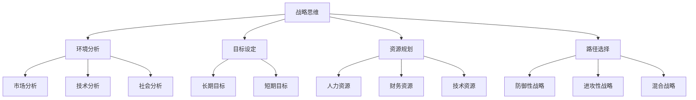

                 

# 《如何培养团队的长期战略思维》

## 关键词
战略思维、团队建设、领导力、实践方法、案例分析

## 摘要
本文旨在探讨如何培养团队的长期战略思维，从而提升团队的整体竞争力和持续发展能力。文章首先介绍了战略思维的基本概念和重要性，然后从核心概念与联系、战略思维模型、实践方法、案例分析、团队构建与领导力等方面展开深入讨论，最后对未来展望和持续学习提出了建议。通过本文，读者可以了解到如何有效地培养团队的长期战略思维，并在实际工作中应用。

## 引言

### 战略思维的重要性

在快速变化的商业环境中，战略思维已经成为企业成功的关键因素。战略思维不仅仅关注短期的利益，更强调长期的发展方向和竞争优势的构建。对于团队来说，战略思维意味着能够从全局出发，把握行业趋势，预见潜在风险，并制定出切实可行的行动计划。

#### 战略思维的基本概念

战略思维是一种系统性的思考方式，涉及到对组织内外部环境的分析，以及对资源、目标和路径的规划。它包括以下几个方面：

- **环境分析**：理解市场、技术、社会等多方面因素对组织的影响。
- **目标设定**：明确组织的发展愿景和短期、长期目标。
- **资源规划**：根据目标分配人力、财务、技术等资源。
- **路径选择**：制定实现目标的最佳策略和步骤。

### 团队战略思维的现状与挑战

当前，许多团队在战略思维方面存在一些问题。一方面，团队成员可能缺乏系统性的思考能力，导致在面对复杂问题时缺乏有效的解决方案。另一方面，团队之间的沟通不畅，信息不对称，也制约了战略思维的发挥。

#### 团队战略思维的现状

- **缺乏全局视角**：团队成员往往关注自身职责范围，缺乏对整个组织战略目标的深刻理解。
- **决策滞后**：在战略决策过程中，团队可能因为信息不畅或沟通障碍，导致决策效率低下。
- **执行力不足**：战略规划制定后，执行过程中可能出现资源调配不当、执行力度不足等问题。

#### 团队战略思维的挑战

- **快速变化的市场环境**：市场环境的不确定性增加了战略制定的难度。
- **组织结构的复杂性**：现代组织结构更加扁平化，但部门之间的协同难度增加。
- **人才短缺**：具备战略思维能力的人才相对稀缺，需要通过培训和发展来提升。

## 核心概念与联系

### 战略思维的基本概念

#### 战略的定义与类型

战略是指为实现长期目标而制定的整体性规划和行动计划。根据不同的目标和情境，战略可以分为以下几种类型：

- **防御性战略**：旨在保护现有市场份额和竞争优势。
- **进攻性战略**：通过开拓新市场或推出新产品来扩大市场份额。
- **混合战略**：结合防御和进攻两种策略，以适应不同的市场环境。

#### 长期战略思维的特点

长期战略思维强调以下几个方面：

- **前瞻性**：关注未来的发展趋势，提前布局。
- **系统性**：综合考虑各种因素，制定全面规划。
- **适应性**：根据环境变化调整战略方向。

### 团队架构与战略思维的关系

#### 团队架构的构成

团队架构是组织内部各个部门、职能单元的协同组织形式。一个有效的团队架构应该具备以下特点：

- **协同性**：各部门之间能够高效协作，形成合力。
- **灵活性**：能够快速响应市场变化，调整组织结构。

#### 团队战略思维的关键要素

- **领导力**：领导者需要具备战略思维，能够指引团队方向。
- **团队协作**：团队成员之间需要相互信任，共同为实现战略目标努力。
- **持续学习**：团队需要不断学习新知识，提升战略思维能力。

### 核心概念原理的关系架构

下面是战略思维的基本概念原理关系架构的 Mermaid 流程图：



## 战略思维模型

### 经典战略模型

#### 波特五力模型

波特五力模型是一种用于分析行业竞争力的工具，它包括以下五个方面：

- **行业竞争者**：行业内其他企业的竞争情况。
- **潜在进入者**：新进入者对市场的影响。
- **替代品**：其他行业或产品对市场的影响。
- **供应商**：供应商对市场的影响。
- **购买者**：购买者对市场的影响。

#### SWOT分析

SWOT分析是一种用于评估企业优势、劣势、机会和威胁的工具，它可以帮助企业制定相应的战略规划。

- **优势**（Strengths）：企业内部的优势，如技术、品牌、市场占有率等。
- **劣势**（Weaknesses）：企业内部存在的劣势，如管理不善、技术落后等。
- **机会**（Opportunities）：外部环境中的机会，如市场需求增长、政策支持等。
- **威胁**（Threats）：外部环境中的威胁，如竞争加剧、市场饱和等。

### 创新战略思维

#### 设计思维方法

设计思维是一种以用户为中心的思考方式，它强调通过迭代和实验来解决问题。设计思维包括以下几个步骤：

1. **同理心**：深入了解用户的需求和痛点。
2. **定义问题**：明确需要解决的问题。
3. **创意生成**：通过头脑风暴和创意筛选，生成多种可能的解决方案。
4. **原型设计**：快速构建原型，进行测试和反馈。
5. **迭代优化**：根据用户反馈，不断优化原型。

#### 系统思维与战略规划

系统思维是一种全面的思考方式，它强调从整体出发，理解各个部分之间的相互作用。在战略规划中，系统思维可以帮助团队：

- **识别关键因素**：明确影响战略规划的关键因素。
- **分析反馈循环**：理解各个部分之间的反馈机制。
- **优化整体性能**：通过调整各个部分的关系，提高整体性能。

### 核心算法原理讲解

在战略规划中，常用的算法原理包括：

- **线性规划**：用于优化资源分配，最小化成本或最大化收益。
- **决策树**：用于分析不同决策路径的结果和概率。
- **神经网络**：用于预测市场趋势和用户行为。

以下是一个简化的线性规划算法的伪代码：

```python
def linear_programming(c, A, b):
    # c: 目标函数系数
    # A: 约束矩阵
    # b: 约束值
    x = [0] * n  # 初始化解向量
    for i in range(n):
        # 求解每个变量的最优值
        x[i] = maximize(c[i], A[i], b)
    return x

def maximize(coefficient, constraint, bound):
    # coefficient: 目标函数系数
    # constraint: 约束条件
    # bound: 约束值
    return (bound - constraint) / coefficient
```

### 数学模型和公式讲解

在战略规划中，常用的数学模型和公式包括：

- **市场占有率模型**：$\text{市场占有率} = \frac{\text{企业市场份额}}{\text{行业总市场份额}}$
- **盈亏平衡模型**：$\text{盈亏平衡点} = \frac{\text{固定成本}}{\text{单位利润}}$
- **ROI模型**：$\text{ROI} = \frac{\text{投资回报}}{\text{投资成本}}$

以下是一个盈亏平衡模型的详细讲解和举例说明：

#### 盈亏平衡模型

盈亏平衡模型用于确定企业达到盈亏平衡所需的销售量或销售额。该模型的基本公式为：

$$\text{盈亏平衡点} = \frac{\text{固定成本}}{\text{单位利润}}$$

其中：

- **固定成本**：企业在一定时期内不变的成本，如租金、工资等。
- **单位利润**：每销售一个单位产品所获得的利润。

#### 举例说明

假设某企业每月固定成本为10000元，每个产品的销售价格为100元，每个产品的成本为60元。那么，该企业的盈亏平衡点为：

$$\text{盈亏平衡点} = \frac{10000}{100 - 60} = \frac{10000}{40} = 250$$

这意味着，该企业需要每月销售250个产品才能达到盈亏平衡。

### 核心算法原理讲解

在战略规划中，常用的算法原理包括：

- **线性规划**：用于优化资源分配，最小化成本或最大化收益。
- **决策树**：用于分析不同决策路径的结果和概率。
- **神经网络**：用于预测市场趋势和用户行为。

以下是一个简化的线性规划算法的伪代码：

```python
def linear_programming(c, A, b):
    # c: 目标函数系数
    # A: 约束矩阵
    # b: 约束值
    x = [0] * n  # 初始化解向量
    for i in range(n):
        # 求解每个变量的最优值
        x[i] = maximize(c[i], A[i], b)
    return x

def maximize(coefficient, constraint, bound):
    # coefficient: 目标函数系数
    # constraint: 约束条件
    # bound: 约束值
    return (bound - constraint) / coefficient
```

## 实践方法

### 战略规划流程

#### 战略目标设定

战略目标设定是战略规划的第一步，它需要明确组织的发展愿景和短期、长期目标。具体步骤包括：

1. **愿景明确**：确定组织希望实现的长远目标。
2. **目标分解**：将愿景分解为短期和长期目标。
3. **目标量化**：对每个目标进行量化，使其具有可衡量性。

#### 战略路径选择

战略路径选择是制定实现目标的策略和步骤。具体步骤包括：

1. **环境分析**：分析市场、技术、社会等多方面因素。
2. **机会识别**：识别可能的机会和威胁。
3. **方案评估**：评估不同的战略方案，选择最优方案。

#### 战略执行与监控

战略执行与监控是确保战略规划顺利实施的关键。具体步骤包括：

1. **资源调配**：根据战略规划分配资源。
2. **执行监控**：监控战略执行的进展，确保目标实现。
3. **调整与优化**：根据实际情况调整战略规划，优化执行过程。

### 战略执行中的障碍与解决

#### 障碍识别

在战略执行过程中，可能会遇到以下障碍：

1. **资源不足**：资源调配不足，无法支持战略实施。
2. **沟通不畅**：信息传递不畅，导致执行效率低下。
3. **执行力不足**：团队成员对战略目标理解不深，导致执行不力。

#### 解决方案

针对上述障碍，可以采取以下解决方案：

1. **资源调配**：优化资源分配，确保关键资源得到充分支持。
2. **沟通机制**：建立有效的沟通机制，确保信息畅通。
3. **培训与激励**：加强团队成员的培训，提高执行力，并实施激励机制。

### 战略监控与调整

战略监控与调整是确保战略规划持续有效的重要环节。具体步骤包括：

1. **监控指标设定**：设定关键绩效指标（KPI），用于监控战略执行情况。
2. **定期评估**：定期对战略执行情况进行评估，发现问题和不足。
3. **调整与优化**：根据评估结果，调整战略规划，优化执行过程。

### 项目实战

#### 开发环境搭建

为了实践战略思维，我们需要搭建一个适合战略规划与执行的开发环境。以下是一个基本的开发环境搭建步骤：

1. **安装开发工具**：安装版本控制工具（如Git）、代码编辑器（如Visual Studio Code）和项目管理工具（如JIRA）。
2. **配置开发环境**：设置环境变量、安装必要的库和依赖。
3. **构建项目框架**：创建项目目录结构，设置项目文件和配置文件。

#### 源代码详细实现

以下是一个简化的战略规划系统源代码实现，用于实现战略目标的设定、执行和监控。

```java
public class StrategicPlanningSystem {
    // 战略目标设定
    public void setStrategicGoals(List<String> goals) {
        // 实现目标设定逻辑
    }

    // 战略执行
    public void executeStrategies(List<String> strategies) {
        // 实现战略执行逻辑
    }

    // 战略监控
    public void monitorStrategies() {
        // 实现战略监控逻辑
    }
}
```

#### 代码解读与分析

上述代码实现了一个简单的战略规划系统，其中包含三个核心方法：

1. **setStrategicGoals**：用于设定战略目标，可以接受一个字符串列表作为参数，表示多个目标。
2. **executeStrategies**：用于执行战略，可以接受一个字符串列表作为参数，表示多个战略。
3. **monitorStrategies**：用于监控战略执行情况，可以定期执行，检查战略执行的状态。

#### 实际案例分析和详细讲解剖析

以下是一个实际案例分析和详细讲解：

**案例：某企业战略规划与执行**

1. **目标设定**：企业设定了三个短期目标：
   - 提高市场份额5%。
   - 降低生产成本10%。
   - 提升客户满意度20%。

2. **战略执行**：企业采取以下战略：
   - 扩大市场宣传，提高品牌知名度。
   - 优化生产流程，降低生产成本。
   - 增加客户互动，提升客户满意度。

3. **战略监控**：企业每月进行一次战略监控，检查目标完成情况，并根据实际情况调整战略。

通过这个案例，我们可以看到战略规划与执行的具体实施过程，以及如何通过监控和调整来确保战略目标的实现。

### 项目小结

通过以上实战案例，我们了解了如何搭建开发环境、实现源代码和进行实际案例分析。战略思维在项目管理中至关重要，它帮助我们明确目标、制定策略、执行计划和监控调整。在实践中，我们需要不断优化战略思维方法，以提高团队的竞争力。

## 最佳实践 tips

1. **定期战略规划**：确保团队每年至少进行一次全面战略规划，以便及时调整发展方向。
2. **跨部门协作**：鼓励跨部门合作，促进信息共享和资源整合。
3. **持续学习**：鼓励团队成员参加战略规划相关的培训和研讨会，提升战略思维能力。
4. **激励措施**：实施激励机制，鼓励团队成员积极参与战略规划和执行。

## 小结

培养团队的长期战略思维是提升团队整体竞争力的重要途径。通过本文，我们了解了战略思维的基本概念、经典模型和实践方法，并通过案例分析了战略思维在实际应用中的重要性。未来，团队需要不断优化战略思维方法，以应对快速变化的市场环境。

## 注意事项

1. **确保目标清晰**：在制定战略时，务必明确短期和长期目标，避免目标模糊导致执行困难。
2. **注重执行力度**：战略规划只是第一步，执行力度同样关键。确保团队成员充分理解战略目标，并采取有效措施确保目标实现。
3. **灵活调整**：市场环境变化快速，战略规划需要根据实际情况灵活调整，确保团队始终走在正确的方向上。

## 拓展阅读

1. **《竞争战略》**：迈克尔·波特（Michael Porter）的经典著作，详细介绍了如何通过战略规划提高企业竞争力。
2. **《创新者的窘境》**：克里斯坦森（Clayton Christensen）的著作，探讨了企业如何在激烈的市场竞争中实现持续创新。

## 作者信息

作者：AI天才研究院/AI Genius Institute & 禅与计算机程序设计艺术 /Zen And The Art of Computer Programming

