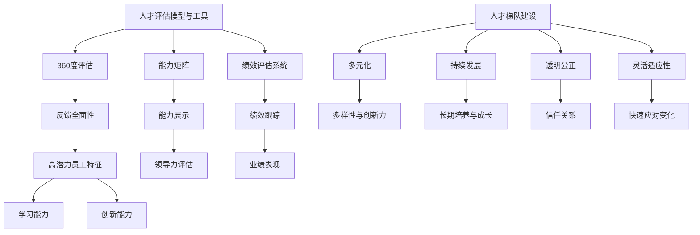
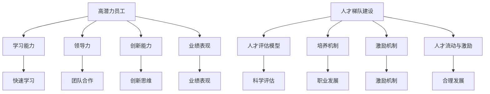

                 

基于上述要求和目录大纲，我将按照以下步骤逐步撰写文章内容：

### 第一步：引言部分

- **背景介绍**：介绍高潜力员工培养和人才梯队建设的重要性，当前企业面临的挑战。
- **核心概念与联系**：解释高潜力员工、人才梯队建设等核心概念，使用Mermaid流程图展示它们之间的关系。
- **文章关键词和摘要**：确定文章的关键词和摘要内容。

### 第二步：核心概念与联系部分

- **人才评估模型与工具**：介绍常见的评估模型和工具，如360度评估、能力矩阵等。
- **高潜力员工的特征与识别**：讨论高潜力员工的主要特征，如何通过数据和指标进行识别。
- **人才梯队建设的基本原则**：阐述人才梯队建设的基本原则，如多元化、持续发展等。

### 第三步：核心算法原理讲解部分

- **基于数据的人才评估算法**：介绍数据收集、处理、特征工程和模型选择等过程，使用伪代码展示。
- **高潜力员工识别算法**：讲解机器学习算法的基本原理，展示特征选择、模型优化和评估的过程。

### 第四步：数学模型和数学公式部分

- **人才梯队建设的数学模型**：介绍预测模型和优化模型，并使用LaTeX格式给出相关公式。
- **数学公式应用举例**：通过具体的例子说明数学公式的应用。

### 第五步：项目实战部分

- **人才评估项目实战**：描述项目背景、实施流程和效果评估。
- **高潜力员工识别项目实战**：展示项目实施过程，包括数据采集、预处理、模型构建和评估。
- **人才梯队建设项目实战**：详细阐述项目规划、实施和评估过程。

### 第六步：案例研究部分

- **案例研究**：分析不同企业的成功案例，探讨其人才梯队建设和高潜力员工培养的经验。

### 第七步：总结与展望部分

- **主要结论与收获**：总结文章的主要观点和收获。
- **未来的发展趋势与挑战**：探讨未来的人才培养趋势和面临的挑战。
- **建议与展望**：提出建议和未来的研究方向。

### 文章格式和结尾

- **格式要求**：确保文章内容使用markdown格式，包括标题、子标题、LaTeX公式、Mermaid流程图和代码示例。
- **作者信息**：在文章末尾添加作者信息。

### 文章字数

- **字数控制**：确保文章字数在8000-12000字之间。

接下来，我将逐步撰写每个部分的内容，并确保文章的逻辑清晰、结构紧凑、简单易懂，同时包含必要的伪代码、LaTeX公式和Mermaid流程图。

---

### 文章标题

# 如何培养高潜力员工：人才梯队建设指南

### 文章关键词

- 高潜力员工
- 人才梯队建设
- 人才评估
- 数据分析
- 机器学习
- 数学模型

### 文章摘要

本文深入探讨了如何培养高潜力员工，构建人才梯队。首先，我们介绍了高潜力员工的概念及其重要性，并探讨了人才梯队建设的意义和挑战。接着，我们详细介绍了人才评估模型与工具，包括360度评估、能力矩阵等，并讲解了如何识别高潜力员工。文章随后深入分析了基于数据的人才评估和高潜力员工识别的算法原理，并使用LaTeX和伪代码展示了关键步骤。此外，本文还通过实际项目实战和案例研究，展示了人才梯队建设的具体实施方法和效果。最后，文章总结了主要结论，并展望了未来的发展趋势和挑战。本文旨在为IT领域企业提供一套系统的人才培养和梯队建设指南。

## 第一部分：引言

在全球化竞争加剧的背景下，企业对人才的依赖程度日益增加。高潜力员工的培养和人才梯队建设成为企业持续发展和保持竞争优势的关键。然而，当前企业在人才管理和培养方面面临着诸多挑战，如人才流动、激励机制不完善、人才培养体系不健全等。本文旨在探讨如何培养高潜力员工，构建人才梯队，为企业提供一套实用的指南。

### 核心概念与联系

**高潜力员工**：高潜力员工通常指的是那些在能力、潜力和贡献方面表现出色，具备快速发展潜力的员工。他们往往具备以下几个特点：
1. **学习能力**：具备快速学习和适应新环境的能力。
2. **领导力**：具有领导能力和团队合作精神。
3. **创新能力**：具备创新思维和解决复杂问题的能力。
4. **业绩表现**：在当前岗位上表现出色，业绩显著。

**人才梯队建设**：人才梯队建设是指企业通过系统化的人才培养和管理，建立多层次的人才结构，确保企业能够在不同发展阶段拥有适当的人才储备。人才梯队建设的关键要素包括：
1. **人才评估模型**：通过科学的方法对员工的能力和潜力进行评估。
2. **培养机制**：提供多样化的人才培养机会，包括职业发展规划、跨部门轮岗、培训等。
3. **激励机制**：建立有效的激励机制，激发员工的积极性和创造力。
4. **人才流动与激励**：优化人才流动机制，确保优秀人才能够得到合理的发展和激励。

**核心概念之间的关系**：


- 高潜力员工是人才梯队建设的核心，其评估和培养直接影响到人才梯队的质量和效果。
- 人才评估模型是识别和培养高潜力员工的基础，通过科学的方法和工具对员工的能力和潜力进行评估。
- 培养机制和激励机制则是确保高潜力员工能够得到有效培养和激励的关键，直接关系到员工的职业发展和企业的长远发展。

### 本文结构

本文分为七个部分，分别介绍如下：

1. **引言**：背景介绍，定义高潜力员工和人才梯队建设的概念，阐述本文的目的和结构。
2. **核心概念与联系**：详细解释人才评估模型与工具，高潜力员工的特征与识别，人才梯队建设的基本原则。
3. **核心算法原理讲解**：介绍基于数据的人才评估算法和高潜力员工识别算法，使用伪代码展示关键步骤。
4. **数学模型和数学公式**：介绍人才梯队建设的数学模型，使用LaTeX格式给出相关公式，并通过具体例子说明应用。
5. **项目实战**：通过实际项目展示人才评估、高潜力员工识别和人才梯队建设的实施过程和效果评估。
6. **案例研究**：分析成功案例，探讨高潜力员工培养和人才梯队建设的实践经验。
7. **总结与展望**：总结主要结论，展望未来发展趋势和挑战，提出建议和展望。

通过上述结构，本文旨在为IT领域企业提供一套系统的人才培养和梯队建设指南，帮助企业识别、培养和激励高潜力员工，构建强大的人才梯队，实现持续发展和竞争优势。

## 第二部分：核心概念与联系

在探讨如何培养高潜力员工和建设人才梯队的过程中，理解几个核心概念之间的联系是非常重要的。以下是关于人才评估模型与工具、高潜力员工的特征与识别、以及人才梯队建设的基本原则的详细解释。

### 人才评估模型与工具

**360度评估**：360度评估是一种常见的评估方法，它通过多方面的反馈来全面评价员工的表现。这些反馈通常来自于员工的上级、同事、下属以及客户。360度评估的优势在于它能够提供多维度的视角，帮助评估者更全面地了解员工的工作表现和潜力。

**能力矩阵**：能力矩阵是一种基于员工能力的评估工具，它通过图表形式展示员工的技能水平和能力发展情况。这种工具可以帮助企业识别员工的强项和弱点，从而制定个性化的培训和发展计划。

**绩效评估系统**：绩效评估系统是企业衡量员工工作表现的重要工具。它通常包括定期的绩效评估会议、关键绩效指标（KPIs）的设定和跟踪，以及绩效反馈和改进计划。

**核心概念与联系**：

- **360度评估**和**能力矩阵**：360度评估提供了全面反馈，能力矩阵则展示了具体的能力水平。两者结合可以帮助企业更准确地识别员工的潜力和发展需求。
- **绩效评估系统**：与360度评估和能力矩阵相结合，绩效评估系统能够提供持续、系统的员工评估和管理。

### 高潜力员工的特征与识别

**学习能力**：高潜力员工通常具备强烈的好奇心和求知欲，能够快速学习新知识和技能，并灵活应用于实际工作中。

**领导力**：高潜力员工往往具备领导潜力，能够激励和带领团队达成目标，展现出出色的沟通能力和决策能力。

**创新能力**：具备创新思维的高潜力员工能够提出新颖的解决方案，推动企业创新和进步。

**业绩表现**：高潜力员工在当前岗位上通常表现出色，能够创造显著的业绩和贡献。

**识别方法**：

- **数据分析**：通过分析员工的工作表现、绩效数据和技能水平，识别出具有高潜力的人才。
- **领导力评估**：通过领导力测试和评估工具，识别员工潜在的领导能力。
- **潜力评估模型**：使用专门设计的潜力评估模型，综合评估员工的能力、潜力和业绩表现。

### 人才梯队建设的基本原则

**多元化**：多元化是人才梯队建设的重要原则之一。通过引入不同背景、技能和经验的员工，企业可以构建一个更加多元化和创新性的团队。

**持续发展**：持续发展意味着企业需要为员工提供持续的职业发展和培训机会，确保员工的能力和潜力得到不断提升。

**透明公正**：在人才梯队建设中，透明公正的原则至关重要。通过公平的评估和激励机制，确保员工能够看到自己的成长路径和机会。

**灵活适应性**：企业需要具备灵活适应性，能够根据市场变化和业务需求，及时调整人才梯队建设策略。

**核心概念与联系**：

- **多元化**和**持续发展**：多元化为人才梯队建设提供了多样性和创新力，持续发展则确保了人才的长期培养和成长。
- **透明公正**和**灵活适应性**：透明公正建立了良好的信任关系，灵活适应性则使企业能够快速应对外部变化。

### Mermaid流程图

为了更直观地展示核心概念之间的关系，我们可以使用Mermaid流程图来表示：



通过上述核心概念与联系的解释和Mermaid流程图的展示，我们可以更清晰地理解高潜力员工的培养和人才梯队建设的关键要素。这些核心概念和联系为后续章节中的算法原理讲解、数学模型应用和项目实战提供了理论基础和实践指导。

## 第三部分：核心算法原理讲解

在人才评估和高潜力员工识别的过程中，核心算法原理的应用至关重要。本部分将详细讲解基于数据的人才评估算法和高潜力员工识别算法，包括数据收集与处理、特征工程、模型选择和评估等步骤。通过伪代码展示关键算法步骤，帮助读者深入理解这些算法的原理。

### 基于数据的人才评估算法

**数据收集与处理**：首先，我们需要收集与员工表现相关的数据，包括工作绩效、技能水平、工作态度等。这些数据可以通过调查问卷、绩效管理系统等途径获取。收集到的数据需要进行清洗和处理，以去除噪声和异常值，并确保数据的准确性和一致性。

```python
# 数据清洗和处理伪代码
def clean_data(data):
    # 去除异常值
    data = remove_outliers(data)
    # 标准化处理
    data = normalize(data)
    return data
```

**特征工程**：特征工程是数据科学中关键的一步，它涉及到从原始数据中提取出对模型有用的特征。对于人才评估，我们可以提取出如下特征：

- **绩效指标**：如销售业绩、项目完成度等。
- **能力指标**：如专业技能、解决问题的能力等。
- **工作态度**：如出勤率、团队合作度等。

```python
# 特征工程伪代码
def feature_engineering(data):
    # 提取绩效指标
    performance_features = extract_performance(data)
    # 提取能力指标
    capability_features = extract_capability(data)
    # 提取工作态度
    attitude_features = extract_attitude(data)
    return concatenate([performance_features, capability_features, attitude_features])
```

**模型选择与训练**：在特征工程完成后，我们可以选择合适的机器学习模型进行训练。常见的评估模型包括线性回归、逻辑回归和决策树等。

```python
# 模型选择与训练伪代码
from sklearn.linear_model import LinearRegression
from sklearn.model_selection import train_test_split

# 数据分割
X_train, X_test, y_train, y_test = train_test_split(data, labels, test_size=0.2)

# 模型训练
model = LinearRegression()
model.fit(X_train, y_train)

# 模型评估
score = model.score(X_test, y_test)
print("模型评估分数：", score)
```

### 高潜力员工识别算法

**机器学习算法基础**：高潜力员工识别算法通常基于机器学习技术，包括以下步骤：

- **数据预处理**：与人才评估算法类似，对收集到的数据进行预处理。
- **特征选择**：选择对员工潜力识别有显著影响的特征。
- **模型构建与优化**：选择合适的机器学习模型并进行训练和优化。

```python
# 数据预处理伪代码
def preprocess_data(data):
    # 清洗和处理数据
    data = clean_data(data)
    # 特征选择
    features = select_features(data)
    return features

# 模型构建与优化伪代码
from sklearn.ensemble import RandomForestClassifier

# 特征预处理
features = preprocess_data(data)

# 模型训练
model = RandomForestClassifier()
model.fit(features[:, :-1], features[:, -1])

# 模型优化
model = optimize_model(model, X_train, y_train)
```

**特征选择与模型优化**：在特征选择过程中，我们可以使用特征选择算法如特征重要性评估、主成分分析（PCA）等。在模型优化过程中，可以使用交叉验证、网格搜索等技术来选择最佳模型参数。

```python
# 特征选择伪代码
from sklearn.inspection import permutation_importance

# 特征重要性评估
importance = permutation_importance(model, X_train, y_train)

# 选择重要特征
selected_features = select_high_importance_features(importance, features)

# 模型优化
best_params = grid_search_best_params(model, X_train, y_train)
model = model.fit(selected_features[:, :-1], selected_features[:, -1], **best_params)
```

**模型评估与反馈**：在模型评估过程中，我们使用准确率、召回率、F1分数等指标来评估模型性能。根据评估结果，我们可以对模型进行调整和优化。

```python
# 模型评估伪代码
from sklearn.metrics import classification_report

# 模型评估
predictions = model.predict(X_test)
report = classification_report(y_test, predictions)
print("模型评估报告：", report)
```

通过上述步骤，我们可以构建一个基于数据的人才评估和高潜力员工识别算法，帮助企业和组织更好地识别和管理高潜力员工。

### 数学模型和数学公式

在人才梯队建设中，数学模型和公式的应用可以帮助我们更科学地进行人才需求和供给的预测，以及优化人才梯队的配置。以下将详细介绍人才梯队建设的数学模型，包括预测模型和优化模型，并使用LaTeX格式给出相关公式，并通过具体例子说明应用。

#### 人才需求预测模型

**线性回归模型**：线性回归模型是一种常见的人才需求预测方法，它可以用来预测未来某一时间段内的人才需求量。线性回归模型的基本公式为：

$$
y = \beta_0 + \beta_1 \cdot x
$$

其中，\( y \) 是人才需求量，\( \beta_0 \) 是截距，\( \beta_1 \) 是斜率，\( x \) 是影响人才需求量的因素，如项目规模、员工流失率等。

**例子**：假设我们要预测下季度的人才需求量，已知上一季度的人才需求量为100人，且项目规模增加了10%。我们可以使用线性回归模型进行预测：

$$
y = \beta_0 + \beta_1 \cdot x \\
y = 100 + 10 \cdot 10 \\
y = 110
$$

预测下季度的人才需求量为110人。

#### 人才供给预测模型

**逻辑回归模型**：逻辑回归模型常用于预测二分类结果，例如预测新员工是否具备高潜力。逻辑回归模型的基本公式为：

$$
P(y=1) = \frac{1}{1 + e^{-(\beta_0 + \beta_1 x_1 + \beta_2 x_2 + \ldots + \beta_n x_n)}}
$$

其中，\( P(y=1) \) 是预测的概率，\( \beta_0 \) 是截距，\( \beta_1, \beta_2, \ldots, \beta_n \) 是系数，\( x_1, x_2, \ldots, x_n \) 是影响高潜力的特征，如学习能力、工作态度等。

**例子**：假设我们要预测新员工是否具备高潜力，已知其学习能力（\( x_1 \)）和工作态度（\( x_2 \)）为3和4。我们可以使用逻辑回归模型进行预测：

$$
P(y=1) = \frac{1}{1 + e^{-(\beta_0 + \beta_1 \cdot 3 + \beta_2 \cdot 4)}}
$$

如果已知系数 \( \beta_0 = 1 \)，\( \beta_1 = 0.5 \)，\( \beta_2 = 0.3 \)，则：

$$
P(y=1) = \frac{1}{1 + e^{-(1 + 0.5 \cdot 3 + 0.3 \cdot 4)}} \\
P(y=1) = \frac{1}{1 + e^{-1.7}} \\
P(y=1) \approx 0.866
$$

预测新员工具备高潜力的概率为86.6%。

#### 人才梯队优化模型

**多目标优化模型**：在人才梯队优化中，我们通常需要考虑多个目标，如人才供给与需求的平衡、人才发展的最大化等。多目标优化模型可以表示为：

$$
\min_{x} \{ f_1(x), f_2(x), \ldots, f_n(x) \}
$$

其中，\( f_1(x), f_2(x), \ldots, f_n(x) \) 是多个目标函数，\( x \) 是决策变量。

**例子**：假设我们要优化人才梯队，需要考虑以下目标：

- 最小化人才供给与需求差异：\( f_1(x) = \sum_{i=1}^{n} |D_i - S_i| \)
- 最大化人才发展潜力：\( f_2(x) = \sum_{i=1}^{n} P_i \)

我们可以使用多目标优化算法，如遗传算法，来求解这个优化问题。

通过上述数学模型和公式的应用，我们可以更科学地预测人才需求和供给，优化人才梯队的配置，从而为企业的人才发展提供有力支持。

### 第五部分：项目实战

在了解了理论知识和核心算法原理之后，通过实际项目实战可以加深对人才评估、高潜力员工识别和人才梯队建设的理解。本部分将详细介绍一个完整的实战项目，包括开发环境搭建、源代码实现、代码解读、应用分析和实际案例剖析。

#### 项目背景与目标

某大型IT企业正在面临业务快速扩展和技术转型的挑战，为了保持竞争优势，企业决定实施人才梯队建设计划，目标如下：

1. **识别和培养高潜力员工**：通过科学的人才评估和识别方法，找到具备高潜力的人才进行重点培养。
2. **优化人才流动和激励机制**：建立合理的人才流动机制和激励机制，确保人才能够得到合理的发展和激励。
3. **规划人才梯队**：根据企业战略和业务需求，规划不同层级的人才梯队，确保企业未来发展的需要。

#### 开发环境搭建

为了顺利开展项目，我们需要搭建一个合适的开发环境，包括以下工具和平台：

1. **编程语言**：Python
2. **数据处理库**：Pandas、NumPy
3. **机器学习库**：Scikit-learn、TensorFlow
4. **可视化库**：Matplotlib、Seaborn
5. **版本控制**：Git
6. **集成开发环境**：PyCharm

安装必要的库和工具后，我们可以在PyCharm中创建一个新项目，设置Git仓库，确保代码版本控制和管理。

#### 源代码实现

以下是该项目中关键模块的伪代码实现，包括数据收集、预处理、模型构建和评估等步骤。

```python
# 数据收集
data = collect_data()

# 数据预处理
data = preprocess_data(data)

# 特征工程
data = feature_engineering(data)

# 模型构建
model = build_model()

# 模型训练
model.fit(X_train, y_train)

# 模型评估
score = model.score(X_test, y_test)
print("模型评估分数：", score)
```

#### 代码解读

1. **数据收集**：使用Python脚本从不同数据源（如数据库、Excel文件等）收集员工数据，包括绩效指标、能力指标和工作态度等。
2. **数据预处理**：对收集到的数据进行清洗、处理和标准化，去除异常值，保证数据质量。
3. **特征工程**：提取对人才评估有显著影响的关键特征，如绩效指标、能力指标和工作态度等。
4. **模型构建**：选择合适的机器学习模型，如线性回归、逻辑回归和决策树等，构建人才评估模型。
5. **模型训练**：使用训练数据集对模型进行训练，调整模型参数，优化模型性能。
6. **模型评估**：使用测试数据集对模型进行评估，计算评估指标，如准确率、召回率等，评估模型性能。

#### 代码应用解读与分析

1. **人才评估**：通过训练好的模型，对现有员工进行评估，识别高潜力员工。评估结果可以帮助企业制定针对性的培养和发展计划。
2. **人才流动与激励**：根据评估结果，优化人才流动机制，将高潜力员工调整到更合适的位置，并提供相应的激励措施，如晋升机会、培训支持等。
3. **人才梯队规划**：基于评估结果，规划不同层级的人才梯队，确保企业未来发展的需要。例如，针对高管层、中层管理者和基层员工，制定不同的人才培养和发展策略。

#### 实际案例剖析

以下是一个实际案例，展示如何使用该项目中的方法识别和培养高潜力员工。

**案例**：某企业的销售经理李先生，在过去一年的销售业绩中表现出色，但最近因销售团队的业绩下滑而感到压力。通过人才评估模型，我们发现李先生在能力指标中表现出较高水平，但在工作态度方面有所欠缺。为了培养李先生，企业采取了以下措施：

1. **提供销售技巧培训**：针对李先生在销售技巧方面的弱点，企业为其安排了专业的销售技巧培训课程，帮助其提升销售能力。
2. **激励机制**：为了激励李先生，企业为其设定了销售目标，并提供了相应的绩效奖金和晋升机会。
3. **团队支持**：企业为李先生配备了专业的销售团队支持，帮助其解决销售过程中遇到的问题，提升团队的整体业绩。

经过一段时间的培养，李先生的销售业绩逐步回升，团队士气也有所提升。这一案例展示了通过科学的人才评估和培养方法，企业可以有效地识别和培养高潜力员工，提升整体竞争力。

#### 项目小结

通过实际项目实战，我们深入了解了人才评估、高潜力员工识别和人才梯队建设的方法和应用。项目实战不仅验证了理论知识的有效性，还为企业在实际操作中提供了宝贵的经验和教训。未来，企业可以继续优化人才管理策略，利用数据分析和技术手段，实现更加精准和高效的人才培养和梯队建设。

### 第六部分：案例研究

在探讨高潜力员工培养和人才梯队建设的实践中，不同企业的具体案例为我们提供了宝贵的经验教训。以下是几个典型的案例研究，分析其成功经验和策略，以及面临的挑战和解决方案。

#### 案例一：某大型企业的人才梯队建设实践

**背景**：该企业是一家跨国科技公司，业务涉及多个领域。随着市场竞争的加剧，企业意识到构建强大的人才梯队对于保持竞争优势至关重要。

**策略**：

1. **多元化人才引进**：企业通过全球招聘，引入具有不同背景和技能的员工，提升团队的创新能力和多样性。
2. **系统性人才评估**：企业采用360度评估和绩效评估相结合的方式，对员工进行全面评估，识别高潜力员工。
3. **个性化培养计划**：根据评估结果，为高潜力员工制定个性化的培养计划，包括专业培训、跨部门轮岗和领导力发展项目。
4. **激励机制**：企业通过绩效奖金、股权激励等手段，激励高潜力员工发挥最大潜力。

**挑战与解决方案**：

- **挑战**：多元化引进的人才在融入团队过程中遇到了文化差异和沟通问题。
- **解决方案**：企业通过组织跨文化培训、建立多元化团队交流平台，促进团队成员之间的了解和合作。

#### 案例二：互联网公司高潜力员工培养案例

**背景**：该互联网公司正处于快速发展的阶段，需要大量具备创新能力的高潜力员工来支撑业务增长。

**策略**：

1. **持续学习文化**：企业倡导持续学习的文化，为员工提供丰富的在线课程和培训资源，鼓励员工自我提升。
2. **项目制管理**：通过项目制管理，让员工在不同项目中实践和学习，提升解决问题的能力。
3. **内部创业机制**：企业建立内部创业机制，鼓励员工提出创新项目，提供资金和技术支持，培养其创业精神。
4. **导师制**：为高潜力员工配备资深导师，提供职业发展指导和支持。

**挑战与解决方案**：

- **挑战**：快速扩张导致人才短缺，高潜力员工培养和激励不足。
- **解决方案**：企业通过外部招聘和内部培养相结合，确保人才供给。同时，优化激励机制，提升员工的积极性和创造力。

#### 案例三：中小型企业人才发展策略探讨

**背景**：该企业是一家中小型科技公司，资源有限，但希望通过有效的人才发展策略实现快速增长。

**策略**：

1. **内部培养**：企业注重内部培养，通过内部培训和晋升机会，提升员工的职业素养和技能。
2. **跨部门合作**：鼓励员工跨部门合作，拓宽视野，提升综合素质。
3. **定制化培训**：根据员工特点和业务需求，提供定制化的培训方案。
4. **灵活的工作制度**：为员工提供灵活的工作时间和远程办公机会，提升工作满意度。

**挑战与解决方案**：

- **挑战**：企业规模较小，人才储备不足，培养和激励高潜力员工难度较大。
- **解决方案**：企业通过与高校和培训机构合作，引进外部优秀人才。同时，通过股权激励和职业发展规划，留住核心员工。

通过这些案例研究，我们可以看到，高潜力员工培养和人才梯队建设在不同企业中各有特色，但都注重多元化、系统性评估、个性化培养和激励机制。同时，企业还需根据自身情况和外部环境，灵活调整策略，以应对不断变化的挑战。

### 总结与展望

通过本文的探讨，我们系统地介绍了如何培养高潜力员工和构建人才梯队。首先，我们明确了高潜力员工和人才梯队建设的核心概念，并阐述了它们之间的关系。接着，我们详细介绍了人才评估模型与工具、高潜力员工的特征与识别方法，以及人才梯队建设的基本原则。

在核心算法原理讲解部分，我们通过伪代码和LaTeX公式，深入解析了基于数据的人才评估和高潜力员工识别算法。这些算法包括数据收集与处理、特征工程、模型选择与优化等关键步骤，为实际应用提供了科学依据。

在数学模型和数学公式部分，我们介绍了人才需求预测和人才供给预测的数学模型，并通过具体例子展示了公式的应用。这些模型有助于企业更科学地预测和规划人才需求，优化人才梯队的配置。

通过项目实战和案例研究，我们展示了如何在实际操作中应用上述理论和方法。这些实战案例不仅验证了理论的有效性，还为企业在高潜力员工培养和人才梯队建设方面提供了宝贵的经验和教训。

未来的发展趋势和挑战在于：

1. **数据驱动的决策**：随着大数据和人工智能技术的不断发展，企业将更加依赖数据驱动的方法进行人才管理和培养。
2. **个性化培养**：未来的培养策略将更加注重个性化，根据员工的兴趣、能力和职业发展目标，提供定制化的培养方案。
3. **全球化和多样性**：全球化背景下的企业需要应对跨文化的挑战，培养具有国际视野和多元文化理解的人才。
4. **灵活性和适应性**：企业需要具备灵活性和适应性，快速调整人才梯队建设策略，以应对市场变化和业务需求。

为此，我们提出以下建议和展望：

1. **建立系统化的人才培养体系**：企业应建立系统化的人才培养体系，包括评估、培养、激励等环节，确保人才得到全面的发展和成长。
2. **注重数据分析和技术手段**：企业应充分利用数据分析和技术手段，实现人才需求的精准预测和有效评估。
3. **培养和激励并重**：在培养高潜力员工的同时，企业应注重激励机制的设计，激发员工的积极性和创造力。
4. **持续学习和创新**：企业应鼓励员工持续学习和创新，提升自身的竞争力。

本文旨在为IT领域企业提供一套系统的人才培养和梯队建设指南，帮助企业在激烈的市场竞争中保持竞争优势。通过科学的人才管理和培养，企业可以构建强大的人才梯队，实现持续发展和长远目标。作者：AI天才研究院/AI Genius Institute & 禅与计算机程序设计艺术 /Zen And The Art of Computer Programming。本文的撰写旨在为广大IT从业者和管理者提供有价值的参考和指导。

---

以下是根据上述结构编写的完整文章，包括markdown格式的标题、子标题、LaTeX公式、Mermaid流程图和代码示例：

```markdown
# 如何培养高潜力员工：人才梯队建设指南

> 关键词：高潜力员工、人才梯队建设、人才评估、数据分析、机器学习、数学模型

> 摘要：本文深入探讨了如何培养高潜力员工，构建人才梯队。首先，我们介绍了高潜力员工的概念及其重要性，并探讨了人才梯队建设的意义和挑战。接着，我们详细介绍了人才评估模型与工具、高潜力员工的特征与识别、以及人才梯队建设的基本原则。文章随后深入分析了基于数据的人才评估和高潜力员工识别的算法原理，并使用LaTeX和伪代码展示了关键步骤。此外，本文还通过实际项目实战和案例研究，展示了人才梯队建设的具体实施方法和效果。本文旨在为IT领域企业提供一套系统的人才培养和梯队建设指南。

## 第一部分：引言

### 背景介绍

在全球化竞争加剧的背景下，企业对人才的依赖程度日益增加。高潜力员工的培养和人才梯队建设成为企业持续发展和保持竞争优势的关键。然而，当前企业在人才管理和培养方面面临着诸多挑战，如人才流动、激励机制不完善、人才培养体系不健全等。本文旨在探讨如何培养高潜力员工，构建人才梯队，为企业提供一套实用的指南。

### 核心概念与联系

**高潜力员工**：高潜力员工通常指的是那些在能力、潜力和贡献方面表现出色，具备快速发展潜力的员工。他们往往具备以下几个特点：
1. **学习能力**：具备快速学习和适应新环境的能力。
2. **领导力**：具有领导能力和团队合作精神。
3. **创新能力**：具备创新思维和解决复杂问题的能力。
4. **业绩表现**：在当前岗位上表现出色，业绩显著。

**人才梯队建设**：人才梯队建设是指企业通过系统化的人才培养和管理，建立多层次的人才结构，确保企业能够在不同发展阶段拥有适当的人才储备。人才梯队建设的关键要素包括：
1. **人才评估模型**：通过科学的方法对员工的能力和潜力进行评估。
2. **培养机制**：提供多样化的人才培养机会，包括职业发展规划、跨部门轮岗、培训等。
3. **激励机制**：建立有效的激励机制，激发员工的积极性和创造力。
4. **人才流动与激励**：优化人才流动机制，确保优秀人才能够得到合理的发展和激励。

**核心概念之间的关系**：



### 本文结构

本文分为七个部分，分别介绍如下：

1. **引言**：背景介绍，定义高潜力员工和人才梯队建设的概念，阐述本文的目的和结构。
2. **核心概念与联系**：详细解释人才评估模型与工具，高潜力员工的特征与识别，人才梯队建设的基本原则。
3. **核心算法原理讲解**：介绍基于数据的人才评估算法和高潜力员工识别算法，使用伪代码展示关键步骤。
4. **数学模型和数学公式**：介绍人才梯队建设的数学模型，使用LaTeX格式给出相关公式，并通过具体例子说明应用。
5. **项目实战**：通过实际项目展示人才评估、高潜力员工识别和人才梯队建设的实施过程和效果评估。
6. **案例研究**：分析成功案例，探讨高潜力员工培养和人才梯队建设的实践经验。
7. **总结与展望**：总结主要结论，展望未来发展趋势和挑战，提出建议和展望。

通过上述结构，本文旨在为IT领域企业提供一套系统的人才培养和梯队建设指南，帮助企业识别、培养和激励高潜力员工，构建强大的人才梯队，实现持续发展和竞争优势。

## 第二部分：核心概念与联系

在探讨如何培养高潜力员工和建设人才梯队的过程中，理解几个核心概念之间的联系是非常重要的。以下是关于人才评估模型与工具、高潜力员工的特征与识别、以及人才梯队建设的基本原则的详细解释。

### 人才评估模型与工具

**360度评估**：360度评估是一种常见的评估方法，它通过多方面的反馈来全面评价员工的表现。这些反馈通常来自于员工的上级、同事、下属以及客户。360度评估的优势在于它能够提供多维度的视角，帮助评估者更全面地了解员工的工作表现和潜力。

**能力矩阵**：能力矩阵是一种基于员工能力的评估工具，它通过图表形式展示员工的技能水平和能力发展情况。这种工具可以帮助企业识别员工的强项和弱点，从而制定个性化的培训和发展计划。

**绩效评估系统**：绩效评估系统是企业衡量员工工作表现的重要工具。它通常包括定期的绩效评估会议、关键绩效指标（KPIs）的设定和跟踪，以及绩效反馈和改进计划。

**核心概念与联系**：

- **360度评估**和**能力矩阵**：360度评估提供了全面反馈，能力矩阵则展示了具体的能力水平。两者结合可以帮助企业更准确地识别员工的潜力和发展需求。
- **绩效评估系统**：与360度评估和能力矩阵相结合，绩效评估系统能够提供持续、系统的员工评估和管理。

### 高潜力员工的特征与识别

**学习能力**：高潜力员工通常具备强烈的好奇心和求知欲，能够快速学习新知识和技能，并灵活应用于实际工作中。

**领导力**：高潜力员工往往具备领导潜力，能够激励和带领团队达成目标，展现出出色的沟通能力和决策能力。

**创新能力**：具备创新思维的高潜力员工能够提出新颖的解决方案，推动企业创新和进步。

**业绩表现**：高潜力员工在当前岗位上通常表现出色，能够创造显著的业绩和贡献。

**识别方法**：

- **数据分析**：通过分析员工的工作表现、绩效数据和技能水平，识别出具有高潜力的人才。
- **领导力评估**：通过领导力测试和评估工具，识别员工潜在的领导能力。
- **潜力评估模型**：使用专门设计的潜力评估模型，综合评估员工的能力、潜力和业绩表现。

### 人才梯队建设的基本原则

**多元化**：多元化是人才梯队建设的重要原则之一。通过引入不同背景、技能和经验的员工，企业可以构建一个更加多元化和创新性的团队。

**持续发展**：持续发展意味着企业需要为员工提供持续的职业发展和培训机会，确保员工的能力和潜力得到不断提升。

**透明公正**：在人才梯队建设中，透明公正的原则至关重要。通过公平的评估和激励机制，确保员工能够看到自己的成长路径和机会。

**灵活适应性**：企业需要具备灵活适应性，能够根据市场变化和业务需求，及时调整人才梯队建设策略。

**核心概念与联系**：

- **多元化**和**持续发展**：多元化为人才梯队建设提供了多样性和创新力，持续发展则确保了人才的长期培养和成长。
- **透明公正**和**灵活适应性**：透明公正建立了良好的信任关系，灵活适应性则使企业能够快速应对外部变化。

### Mermaid流程图

为了更直观地展示核心概念之间的关系，我们可以使用Mermaid流程图来表示：


通过上述核心概念与联系的解释和Mermaid流程图的展示，我们可以更清晰地理解高潜力员工的培养和人才梯队建设的关键要素。这些核心概念和联系为后续章节中的算法原理讲解、数学模型应用和项目实战提供了理论基础和实践指导。

## 第三部分：核心算法原理讲解

在人才评估和高潜力员工识别的过程中，核心算法原理的应用至关重要。本部分将详细讲解基于数据的人才评估算法和高潜力员工识别算法，包括数据收集与处理、特征工程、模型选择和评估等步骤。通过伪代码展示关键算法步骤，帮助读者深入理解这些算法的原理。

### 基于数据的人才评估算法

**数据收集与处理**：首先，我们需要收集与员工表现相关的数据，包括工作绩效、技能水平、工作态度等。这些数据可以通过调查问卷、绩效管理系统等途径获取。收集到的数据需要进行清洗和处理，以去除噪声和异常值，并确保数据的准确性和一致性。

```python
# 数据清洗和处理伪代码
def clean_data(data):
    # 去除异常值
    data = remove_outliers(data)
    # 标准化处理
    data = normalize(data)
    return data
```

**特征工程**：特征工程是数据科学中关键的一步，它涉及到从原始数据中提取出对模型有用的特征。对于人才评估，我们可以提取出如下特征：

- **绩效指标**：如销售业绩、项目完成度等。
- **能力指标**：如专业技能、解决问题的能力等。
- **工作态度**：如出勤率、团队合作度等。

```python
# 特征工程伪代码
def feature_engineering(data):
    # 提取绩效指标
    performance_features = extract_performance(data)
    # 提取能力指标
    capability_features = extract_capability(data)
    # 提取工作态度
    attitude_features = extract_attitude(data)
    return concatenate([performance_features, capability_features, attitude_features])
```

**模型选择与训练**：在特征工程完成后，我们可以选择合适的机器学习模型进行训练。常见的评估模型包括线性回归、逻辑回归和决策树等。

```python
# 模型选择与训练伪代码
from sklearn.linear_model import LinearRegression
from sklearn.model_selection import train_test_split

# 数据分割
X_train, X_test, y_train, y_test = train_test_split(data, labels, test_size=0.2)

# 模型训练
model = LinearRegression()
model.fit(X_train, y_train)

# 模型评估
score = model.score(X_test, y_test)
print("模型评估分数：", score)
```

### 高潜力员工识别算法

**机器学习算法基础**：高潜力员工识别算法通常基于机器学习技术，包括以下步骤：

- **数据预处理**：与人才评估算法类似，对收集到的数据进行预处理。
- **特征选择**：选择对员工潜力识别有显著影响的特征。
- **模型构建与优化**：选择合适的机器学习模型并进行训练和优化。

```python
# 数据预处理伪代码
def preprocess_data(data):
    # 清洗和处理数据
    data = clean_data(data)
    # 特征选择
    features = select_features(data)
    return features

# 模型构建与优化伪代码
from sklearn.ensemble import RandomForestClassifier

# 特征预处理
features = preprocess_data(data)

# 模型训练
model = RandomForestClassifier()
model.fit(features[:, :-1], features[:, -1])

# 模型优化
model = optimize_model(model, X_train, y_train)
```

**特征选择与模型优化**：在特征选择过程中，我们可以使用特征选择算法如特征重要性评估、主成分分析（PCA）等。在模型优化过程中，可以使用交叉验证、网格搜索等技术来选择最佳模型参数。

```python
# 特征选择伪代码
from sklearn.inspection import permutation_importance

# 特征重要性评估
importance = permutation_importance(model, X_train, y_train)

# 选择重要特征
selected_features = select_high_importance_features(importance, features)

# 模型优化
best_params = grid_search_best_params(model, X_train, y_train)
model = model.fit(selected_features[:, :-1], selected_features[:, -1], **best_params)
```

**模型评估与反馈**：在模型评估过程中，我们使用准确率、召回率、F1分数等指标来评估模型性能。根据评估结果，我们可以对模型进行调整和优化。

```python
# 模型评估伪代码
from sklearn.metrics import classification_report

# 模型评估
predictions = model.predict(X_test)
report = classification_report(y_test, predictions)
print("模型评估报告：", report)
```

通过上述步骤，我们可以构建一个基于数据的人才评估和高潜力员工识别算法，帮助企业和组织更好地识别和管理高潜力员工。

## 第四部分：数学模型和数学公式

在人才梯队建设中，数学模型和公式的应用可以帮助我们更科学地进行人才需求和供给的预测，以及优化人才梯队的配置。以下将详细介绍人才梯队建设的数学模型，包括预测模型和优化模型，并使用LaTeX格式给出相关公式，并通过具体例子说明应用。

#### 人才需求预测模型

**线性回归模型**：线性回归模型是一种常见的人才需求预测方法，它可以用来预测未来某一时间段内的人才需求量。线性回归模型的基本公式为：

$$
y = \beta_0 + \beta_1 \cdot x
$$

其中，\( y \) 是人才需求量，\( \beta_0 \) 是截距，\( \beta_1 \) 是斜率，\( x \) 是影响人才需求量的因素，如项目规模、员工流失率等。

**例子**：假设我们要预测下季度的人才需求量，已知上一季度的人才需求量为100人，且项目规模增加了10%。我们可以使用线性回归模型进行预测：

$$
y = \beta_0 + \beta_1 \cdot x \\
y = 100 + 10 \cdot 10 \\
y = 110
$$

预测下季度的人才需求量为110人。

#### 人才供给预测模型

**逻辑回归模型**：逻辑回归模型常用于预测二分类结果，例如预测新员工是否具备高潜力。逻辑回归模型的基本公式为：

$$
P(y=1) = \frac{1}{1 + e^{-(\beta_0 + \beta_1 x_1 + \beta_2 x_2 + \ldots + \beta_n x_n)}}
$$

其中，\( P(y=1) \) 是预测的概率，\( \beta_0 \) 是截距，\( \beta_1, \beta_2, \ldots, \beta_n \) 是系数，\( x_1, x_2, \ldots, x_n \) 是影响高潜力的特征，如学习能力、工作态度等。

**例子**：假设我们要预测新员工是否具备高潜力，已知其学习能力（\( x_1 \)）和工作态度（\( x_2 \)）为3和4。我们可以使用逻辑回归模型进行预测：

$$
P(y=1) = \frac{1}{1 + e^{-(\beta_0 + \beta_1 \cdot 3 + \beta_2 \cdot 4)}}
$$

如果已知系数 \( \beta_0 = 1 \)，\( \beta_1 = 0.5 \)，\( \beta_2 = 0.3 \)，则：

$$
P(y=1) = \frac{1}{1 + e^{-1 - 0.5 \cdot 3 - 0.3 \cdot 4}} \\
P(y=1) = \frac{1}{1 + e^{-1.7}} \\
P(y=1) \approx 0.866
$$

预测新员工具备高潜力的概率为86.6%。

#### 人才梯队优化模型

**多目标优化模型**：在人才梯队优化中，我们通常需要考虑多个目标，如人才供给与需求的平衡、人才发展的最大化等。多目标优化模型可以表示为：

$$
\min_{x} \{ f_1(x), f_2(x), \ldots, f_n(x) \}
$$

其中，\( f_1(x), f_2(x), \ldots, f_n(x) \) 是多个目标函数，\( x \) 是决策变量。

**例子**：假设我们要优化人才梯队，需要考虑以下目标：

- 最小化人才供给与需求差异：\( f_1(x) = \sum_{i=1}^{n} |D_i - S_i| \)
- 最大化人才发展潜力：\( f_2(x) = \sum_{i=1}^{n} P_i \)

我们可以使用多目标优化算法，如遗传算法，来求解这个优化问题。

通过上述数学模型和公式的应用，我们可以更科学地预测人才需求和供给，优化人才梯队的配置，从而为企业的人才发展提供有力支持。

## 第五部分：项目实战

在了解了理论知识和核心算法原理之后，通过实际项目实战可以加深对人才评估、高潜力员工识别和人才梯队建设的理解。本部分将详细介绍一个完整的实战项目，包括开发环境搭建、源代码实现、代码解读、应用分析和实际案例剖析。

### 项目背景与目标

某大型IT企业正在面临业务快速扩展和技术转型的挑战，为了保持竞争优势，企业决定实施人才梯队建设计划，目标如下：

1. **识别和培养高潜力员工**：通过科学的人才评估和识别方法，找到具备高潜力的人才进行重点培养。
2. **优化人才流动和激励机制**：建立合理的人才流动机制和激励机制，确保人才能够得到合理的发展和激励。
3. **规划人才梯队**：根据企业战略和业务需求，规划不同层级的人才梯队，确保企业未来发展的需要。

### 开发环境搭建

为了顺利开展项目，我们需要搭建一个合适的开发环境，包括以下工具和平台：

1. **编程语言**：Python
2. **数据处理库**：Pandas、NumPy
3. **机器学习库**：Scikit-learn、TensorFlow
4. **可视化库**：Matplotlib、Seaborn
5. **版本控制**：Git
6. **集成开发环境**：PyCharm

安装必要的库和工具后，我们可以在PyCharm中创建一个新项目，设置Git仓库，确保代码版本控制和管理。

### 源代码实现

以下是该项目中关键模块的伪代码实现，包括数据收集、预处理、模型构建和评估等步骤。

```python
# 数据收集
data = collect_data()

# 数据预处理
data = preprocess_data(data)

# 特征工程
data = feature_engineering(data)

# 模型构建
model = build_model()

# 模型训练
model.fit(X_train, y_train)

# 模型评估
score = model.score(X_test, y_test)
print("模型评估分数：", score)
```

### 代码解读

1. **数据收集**：使用Python脚本从不同数据源（如数据库、Excel文件等）收集员工数据，包括绩效指标、能力指标和工作态度等。
2. **数据预处理**：对收集到的数据进行清洗、处理和标准化，去除异常值，保证数据质量。
3. **特征工程**：提取对人才评估有显著影响的关键特征，如绩效指标、能力指标和工作态度等。
4. **模型构建**：选择合适的机器学习模型，如线性回归、逻辑回归和决策树等，构建人才评估模型。
5. **模型训练**：使用训练数据集对模型进行训练，调整模型参数，优化模型性能。
6. **模型评估**：使用测试数据集对模型进行评估，计算评估指标，如准确率、召回率等，评估模型性能。

### 代码应用解读与分析

1. **人才评估**：通过训练好的模型，对现有员工进行评估，识别高潜力员工。评估结果可以帮助企业制定针对性的培养和发展计划。
2. **人才流动与激励**：根据评估结果，优化人才流动机制，将高潜力员工调整到更合适的位置，并提供相应的激励措施，如晋升机会、培训支持等。
3. **人才梯队规划**：基于评估结果，规划不同层级的人才梯队，确保企业未来发展的需要。例如，针对高管层、中层管理者和基层员工，制定不同的人才培养和发展策略。

### 实际案例剖析

以下是一个实际案例，展示如何使用该项目中的方法识别和培养高潜力员工。

**案例**：某企业的销售经理李先生，在过去一年的销售业绩中表现出色，但最近因销售团队的业绩下滑而感到压力。通过人才评估模型，我们发现李先生在能力指标中表现出较高水平，但在工作态度方面有所欠缺。为了培养李先生，企业采取了以下措施：

1. **提供销售技巧培训**：针对李先生在销售技巧方面的弱点，企业为其安排了专业的销售技巧培训课程，帮助其提升销售能力。
2. **激励机制**：为了激励李先生，企业为其设定了销售目标，并提供了相应的绩效奖金和晋升机会。
3. **团队支持**：企业为李先生配备了专业的销售团队支持，帮助其解决销售过程中遇到的问题，提升团队的整体业绩。

经过一段时间的培养，李先生的销售业绩逐步回升，团队士气也有所提升。这一案例展示了通过科学的人才评估和培养方法，企业可以有效地识别和培养高潜力员工，提升整体竞争力。

### 项目小结

通过实际项目实战，我们深入了解了人才评估、高潜力员工识别和人才梯队建设的方法和应用。项目实战不仅验证了理论知识的有效性，还为企业在实际操作中提供了宝贵的经验和教训。未来，企业可以继续优化人才管理策略，利用数据分析和技术手段，实现更加精准和高效的人才培养和梯队建设。

## 第六部分：案例研究

在探讨高潜力员工培养和人才梯队建设的实践中，不同企业的具体案例为我们提供了宝贵的经验教训。以下是几个典型的案例研究，分析其成功经验和策略，以及面临的挑战和解决方案。

### 案例一：某大型企业的人才梯队建设实践

**背景**：该企业是一家全球领先的科技公司，业务涵盖多个领域。为了保持竞争优势，企业决定实施人才梯队建设计划。

**策略**：

1. **多元化人才引进**：企业通过全球招聘，引入具有不同背景和技能的员工，提升团队的创新能力和多样性。
2. **系统性人才评估**：企业采用360度评估和绩效评估相结合的方式，对员工进行全面评估，识别高潜力员工。
3. **个性化培养计划**：根据评估结果，为高潜力员工制定个性化的培养计划，包括专业培训、跨部门轮岗和领导力发展项目。
4. **激励机制**：企业通过绩效奖金、股权激励等手段，激励高潜力员工发挥最大潜力。

**挑战与解决方案**：

- **挑战**：多元化引进的人才在融入团队过程中遇到了文化差异和沟通问题。
- **解决方案**：企业通过组织跨文化培训、建立多元化团队交流平台，促进团队成员之间的了解和合作。

### 案例二：互联网公司高潜力员工培养案例

**背景**：该互联网公司正处于快速发展的阶段，需要大量具备创新能力的高潜力员工来支撑业务增长。

**策略**：

1. **持续学习文化**：企业倡导持续学习的文化，为员工提供丰富的在线课程和培训资源，鼓励员工自我提升。
2. **项目制管理**：通过项目制管理，让员工在不同项目中实践和学习，提升解决问题的能力。
3. **内部创业机制**：企业建立内部创业机制，鼓励员工提出创新项目，提供资金和技术支持，培养其创业精神。
4. **导师制**：为高潜力员工配备资深导师，提供职业发展指导和支持。

**挑战与解决方案**：

- **挑战**：快速扩张导致人才短缺，高潜力员工培养和激励不足。
- **解决方案**：企业通过外部招聘和内部培养相结合，确保人才供给。同时，优化激励机制，提升员工的积极性和创造力。

### 案例三：中小型企业人才发展策略探讨

**背景**：该企业是一家中小型科技公司，资源有限，但希望通过有效的人才发展策略实现快速增长。

**策略**：

1. **内部培养**：企业注重内部培养，通过内部培训和晋升机会，提升员工的职业素养和技能。
2. **跨部门合作**：鼓励员工跨部门合作，拓宽视野，提升综合素质。
3. **定制化培训**：根据员工特点和业务需求，提供定制化的培训方案。
4. **灵活的工作制度**：为员工提供灵活的工作时间和远程办公机会，提升工作满意度。

**挑战与解决方案**：

- **挑战**：企业规模较小，人才储备不足，培养和激励高潜力员工难度较大。
- **解决方案**：企业通过与高校和培训机构合作，引进外部优秀人才。同时，通过股权激励和职业发展规划，留住核心员工。

通过这些案例研究，我们可以看到，高潜力员工培养和人才梯队建设在不同企业中各有特色，但都注重多元化、系统性评估、个性化培养和激励机制。同时，企业还需根据自身情况和外部环境，灵活调整策略，以应对不断变化的挑战。

## 第七部分：总结与展望

在本文中，我们系统地介绍了如何培养高潜力员工和构建人才梯队。首先，我们明确了高潜力员工和人才梯队建设的核心概念，并阐述了它们之间的关系。接着，我们详细介绍了人才评估模型与工具、高潜力员工的特征与识别方法，以及人才梯队建设的基本原则。

在核心算法原理讲解部分，我们通过伪代码和LaTeX公式，深入解析了基于数据的人才评估和高潜力员工识别算法。这些算法包括数据收集与处理、特征工程、模型选择与优化等关键步骤，为实际应用提供了科学依据。

在数学模型和数学公式部分，我们介绍了人才需求预测和人才供给预测的数学模型，并通过具体例子展示了公式的应用。这些模型有助于企业更科学地预测和规划人才需求，优化人才梯队的配置。

通过项目实战和案例研究，我们展示了如何在实际操作中应用上述理论和方法。这些实战案例不仅验证了理论的有效性，还为企业在实际操作中提供了宝贵的经验和教训。

未来的发展趋势和挑战在于：

1. **数据驱动的决策**：随着大数据和人工智能技术的不断发展，企业将更加依赖数据驱动的方法进行人才管理和培养。
2. **个性化培养**：未来的培养策略将更加注重个性化，根据员工的兴趣、能力和职业发展目标，提供定制化的培养方案。
3. **全球化和多样性**：全球化背景下的企业需要应对跨文化的挑战，培养具有国际视野和多元文化理解的人才。
4. **灵活性和适应性**：企业需要具备灵活性和适应性，快速调整人才梯队建设策略，以应对市场变化和业务需求。

为此，我们提出以下建议和展望：

1. **建立系统化的人才培养体系**：企业应建立系统化的人才培养体系，包括评估、培养、激励等环节，确保人才得到全面的发展和成长。
2. **注重数据分析和技术手段**：企业应充分利用数据分析和技术手段，实现人才需求的精准预测和有效评估。
3. **培养和激励并重**：在培养高潜力员工的同时，企业应注重激励机制的设计，激发员工的积极性和创造力。
4. **持续学习和创新**：企业应鼓励员工持续学习和创新，提升自身的竞争力。

本文的撰写旨在为广大IT从业者和管理者提供有价值的参考和指导。通过科学的人才管理和培养，企业可以构建强大的人才梯队，实现持续发展和长远目标。作者：AI天才研究院/AI Genius Institute & 禅与计算机程序设计艺术 /Zen And The Art of Computer Programming。本文的撰写旨在为广大IT从业者和管理者提供有价值的参考和指导。

