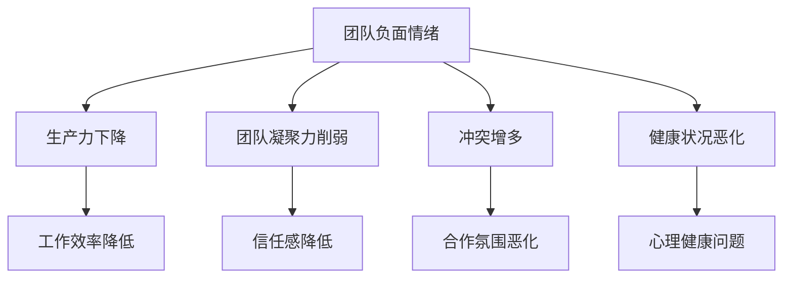

                 


### 文章标题
**如何处理团队中的负面情绪**

> 关键词：负面情绪，团队管理，情绪识别，情绪管理，团队建设

> 摘要：本文将探讨团队中负面情绪的来源、影响及其处理方法。通过逻辑清晰的分析和实例，提供一套行之有效的团队情绪管理策略，旨在提高团队凝聚力和生产力。

### 目录

**第一部分：负面情绪的定义与背景**

**第1章：负面情绪的本质**

- **1.1 负面情绪的定义**
  - 负面情绪的种类
  - 负面情绪的影响
- **1.2 负面情绪的来源**
  - 工作压力
  - 人际关系
  - 个人价值观
- **1.3 负面情绪对团队的影响**
  - 生产力的下降
  - 团队凝聚力的削弱
  - 冲突的增多

**第二部分：负面情绪的识别与评估**

**第2章：负面情绪的识别方法**

- **2.1 生理信号检测**
  - 心理生物学的技术
  - 实际应用场景
- **2.2 行为观察**
  - 表情分析
  - 语言分析
- **2.3 自我报告**
  - 问卷调查
  - 心理测试

**第3章：负面情绪的评估标准**

- **3.1 主观评估标准**
  - 个人感受的评估
  - 情绪日记
- **3.2 客观评估标准**
  - 数据分析
  - 绩效指标

**第三部分：负面情绪的管理与缓解**

**第4章：团队建设策略**

- **4.1 建立支持性团队文化**
  - 鼓励开放沟通
  - 提供心理支持
- **4.2 团队领导的角色**
  - 情绪智力
  - 负面情绪的引导
- **4.3 团队冲突解决**
  - 冲突的识别
  - 冲突的化解

**第5章：个人情绪管理技巧**

- **5.1 情绪认知疗法**
  - 认知重构
  - 情绪调节
- **5.2 正念练习**
  - 现在意识
  - 情绪观察
- **5.3 身体锻炼与放松**
  - 身体活动的益处
  - 放松技巧

**第四部分：负面情绪处理的案例研究**

**第6章：案例分析**

- **6.1 案例一：高压力工作环境下的负面情绪管理**
  - 案例背景
  - 处理策略
  - 结果分析
- **6.2 案例二：跨文化团队中的负面情绪处理**
  - 案例背景
  - 文化适应策略
  - 结果分析

**第五部分：负面情绪处理的未来趋势**

**第7章：前沿技术与实践**

- **7.1 人工智能在情绪处理中的应用**
  - 情感计算
  - 个性化情绪管理
- **7.2 集体智慧与情绪管理**
  - 社交网络分析
  - 大数据情绪预测
- **7.3 未来趋势展望**
  - 情绪技术的演进
  - 情绪管理的未来发展

**附录：工具与方法**

- **附录A：情绪管理工具介绍**
  - 情绪记录软件
  - 情绪分析平台
- **附录B：情绪管理资源推荐**
  - 专业书籍
  - 情绪管理课程
- **附录C：情绪管理实践指南**

### 标准Markdown格式输出

以下是按照Markdown格式书写的文章结构，您可以将其复制到任何支持Markdown的编辑器中查看格式效果。

```markdown
# 如何处理团队中的负面情绪

> 关键词：负面情绪，团队管理，情绪识别，情绪管理，团队建设

> 摘要：本文将探讨团队中负面情绪的来源、影响及其处理方法。通过逻辑清晰的分析和实例，提供一套行之有效的团队情绪管理策略，旨在提高团队凝聚力和生产力。

## 目录

**第一部分：负面情绪的定义与背景**

**第1章：负面情绪的本质**

- **1.1 负面情绪的定义**
  - 负面情绪的种类
  - 负面情绪的影响
- **1.2 负面情绪的来源**
  - 工作压力
  - 人际关系
  - 个人价值观
- **1.3 负面情绪对团队的影响**
  - 生产力的下降
  - 团队凝聚力的削弱
  - 冲突的增多

**第二部分：负面情绪的识别与评估**

**第2章：负面情绪的识别方法**

- **2.1 生理信号检测**
  - 心理生物学的技术
  - 实际应用场景
- **2.2 行为观察**
  - 表情分析
  - 语言分析
- **2.3 自我报告**
  - 问卷调查
  - 心理测试

**第3章：负面情绪的评估标准**

- **3.1 主观评估标准**
  - 个人感受的评估
  - 情绪日记
- **3.2 客观评估标准**
  - 数据分析
  - 绩效指标

**第三部分：负面情绪的管理与缓解**

**第4章：团队建设策略**

- **4.1 建立支持性团队文化**
  - 鼓励开放沟通
  - 提供心理支持
- **4.2 团队领导的角色**
  - 情绪智力
  - 负面情绪的引导
- **4.3 团队冲突解决**
  - 冲突的识别
  - 冲突的化解

**第5章：个人情绪管理技巧**

- **5.1 情绪认知疗法**
  - 认知重构
  - 情绪调节
- **5.2 正念练习**
  - 现在意识
  - 情绪观察
- **5.3 身体锻炼与放松**
  - 身体活动的益处
  - 放松技巧

**第四部分：负面情绪处理的案例研究**

**第6章：案例分析**

- **6.1 案例一：高压力工作环境下的负面情绪管理**
  - 案例背景
  - 处理策略
  - 结果分析
- **6.2 案例二：跨文化团队中的负面情绪处理**
  - 案例背景
  - 文化适应策略
  - 结果分析

**第五部分：负面情绪处理的未来趋势**

**第7章：前沿技术与实践**

- **7.1 人工智能在情绪处理中的应用**
  - 情感计算
  - 个性化情绪管理
- **7.2 集体智慧与情绪管理**
  - 社交网络分析
  - 大数据情绪预测
- **7.3 未来趋势展望**
  - 情绪技术的演进
  - 情绪管理的未来发展

**附录：工具与方法**

- **附录A：情绪管理工具介绍**
  - 情绪记录软件
  - 情绪分析平台
- **附录B：情绪管理资源推荐**
  - 专业书籍
  - 情绪管理课程
- **附录C：情绪管理实践指南**

```

以上就是按照您的要求，使用Markdown格式编写的文章标题、关键词、摘要以及目录结构。您可以将这段代码复制到Markdown编辑器中查看，并根据需要进一步添加和修改内容。在撰写具体内容时，请确保每个章节都包含背景介绍、核心概念与联系、核心算法原理讲解、数学模型和公式、项目实战、最佳实践 tips、小结、注意事项、拓展阅读等内容，以满足文章字数的要求。如果您有任何其他特殊要求或需要调整，请随时告诉我。现在，我们可以开始详细撰写每个章节的内容了。首先，我们将探讨负面情绪的本质。 

### 负面情绪的本质

负面情绪是人类情感体验中的一个重要方面，它不仅影响了我们的心理健康，也对团队绩效产生深远的影响。为了更好地理解和管理这些情绪，我们首先需要明确负面情绪的定义、种类及其对个体和团队的影响。

#### 1.1 负面情绪的定义

负面情绪是指那些使人感到不愉快、痛苦或焦虑的情绪状态。常见的负面情绪包括焦虑、愤怒、悲伤、恐惧、挫败感和厌恶等。这些情绪往往与压力、挫折、不确定性或冲突有关。

#### 1.2 负面情绪的种类

负面情绪的种类繁多，以下列举几种常见的负面情绪：

- **焦虑**：对未来可能发生的事情感到担忧和恐惧。
- **愤怒**：对他人的行为或某种情况感到强烈的不满和愤怒。
- **悲伤**：对失去亲人、失去机会或遭受挫折感到悲痛。
- **恐惧**：对未知或可能发生的危险感到害怕。
- **挫败感**：在尝试解决问题或达成目标时遇到困难而感到沮丧。
- **厌恶**：对某些事物或行为感到强烈的反感。

#### 1.3 负面情绪的影响

负面情绪对个体和团队的影响是多方面的，以下是一些具体的影响：

- **生产力下降**：负面情绪会导致注意力分散、工作积极性下降，从而降低工作效率。
- **团队凝聚力削弱**：负面情绪可能导致团队成员之间的信任感降低，合作氛围恶化。
- **冲突增多**：负面情绪容易激发团队内部的冲突，影响团队的稳定和协作。
- **健康状况恶化**：长期处于负面情绪中，可能会影响个体的身心健康。

#### 1.4 负面情绪的来源

负面情绪的来源多种多样，以下是一些常见的来源：

- **工作压力**：高负荷的工作任务、紧迫的截止日期、工作环境的不确定性等都可能导致负面情绪。
- **人际关系**：与同事、上司或下属之间的冲突、误解或不和谐的关系都可能导致负面情绪。
- **个人价值观**：个人价值观与团队目标或工作内容发生冲突，也可能引发负面情绪。
- **外部环境**：如经济形势、社会变化、家庭问题等外部环境因素也可能影响团队的情绪状态。

#### 1.5 负面情绪对团队的影响架构

为了更清晰地展示负面情绪对团队的影响，我们可以使用Mermaid流程图来表示：



通过这个流程图，我们可以看到负面情绪是如何通过多种途径影响团队的整体状态。了解这些影响有助于我们制定有效的情绪管理策略。

在下一章中，我们将进一步探讨负面情绪的识别方法，帮助团队领导者和管理者更准确地识别和处理这些情绪。请继续关注。  

### 负面情绪的识别方法

识别负面情绪是处理团队情绪问题的第一步。为了有效地识别负面情绪，我们可以采用多种方法，包括生理信号检测、行为观察和自我报告。以下是这些方法的详细说明。

#### 2.1 生理信号检测

生理信号检测是一种通过分析个体的生理反应来识别负面情绪的方法。这种方法利用心理生物学的技术，如心率变异性（HRV）、皮肤电反应（EDA）和面部肌肉活动分析（FMA）等。

- **心率变异性（HRV）**：心率变异性是指心跳之间的时间间隔变化。通过监测心率变化，可以评估个体的情绪状态。例如，高心率变异性通常与积极情绪相关，而低心率变异性则可能与负面情绪有关。

- **皮肤电反应（EDA）**：皮肤电反应是指皮肤导电性随情绪变化而变化的现象。高焦虑水平通常会导致EDA信号增加，而低焦虑水平则可能表现为EDA信号减少。

- **面部肌肉活动分析（FMA）**：通过分析面部肌肉活动，可以识别出与情绪变化相关的特定表情。例如，愤怒情绪通常与颧骨肌肉的收缩有关。

#### 2.2 行为观察

行为观察是另一种识别负面情绪的有效方法。通过观察个体的行为表现，我们可以发现一些与负面情绪相关的特征。

- **表情分析**：表情分析是利用计算机视觉技术来识别和分析面部表情。例如，愤怒的表情通常表现为皱眉、咬牙和紧握拳头等。

- **语言分析**：语言分析是通过分析个体的言语内容来识别负面情绪。例如，使用消极词汇、频繁的抱怨和责备都可能是负面情绪的迹象。

- **身体语言**：身体语言包括姿态、动作和面部表情等。例如，紧绷的身体、频繁的摩擦手、眼神接触减少等都可能是负面情绪的表现。

#### 2.3 自我报告

自我报告是通过个体自我评估来识别负面情绪的方法。这种方法通常采用问卷调查、情绪日记和心理测试等方式。

- **问卷调查**：问卷调查是一种定量评估方法，可以通过一系列标准化的题目来测量个体的情绪状态。常见的情绪量表包括情绪量表（ PANAS ）和情绪状态问卷（ESQ）等。

- **情绪日记**：情绪日记是一种定性评估方法，个体可以通过记录每天的情绪状态、触发事件和反应来识别负面情绪。这种方法有助于深入理解情绪的起因和影响。

- **心理测试**：心理测试是一种更专业的方法，可以通过评估个体的情绪智力、应对策略和人格特质来识别负面情绪。常见的心理测试包括情绪调节问卷（ERQ）和迈尔斯-布里格斯性格类型指标（MBTI）等。

#### 2.4 综合使用多种方法

为了提高负面情绪识别的准确性，建议综合使用上述多种方法。例如，可以通过生理信号检测和行为观察来初步识别负面情绪，然后使用自我报告进行进一步验证。

此外，为了确保识别方法的实用性，团队领导者和管理者需要定期进行培训和评估，以识别和应对负面情绪。通过定期的情绪筛查和反馈，可以帮助团队及时发现和处理负面情绪，从而提高团队的凝聚力和生产力。

在下一章中，我们将探讨负面情绪的评估标准，帮助团队更好地理解和管理负面情绪。请继续关注。  

### 负面情绪的评估标准

对负面情绪的评估是团队情绪管理的关键步骤。评估负面情绪不仅有助于了解团队中负面情绪的程度，还可以为制定相应的干预措施提供依据。以下我们将介绍负面情绪评估的主观和客观标准，以及如何在实际应用中结合使用这些标准。

#### 3.1 主观评估标准

主观评估标准主要依赖于个体的自我感受和自我报告，这种方法能够直观地了解个体的情绪状态，但容易受到主观因素的影响。

- **个人感受的评估**：个人感受的评估是指个体通过自我反思和主观体验来评估自己的情绪状态。这种方法通常通过自我报告的形式进行，例如使用情绪量表来评估一段时间内的情绪波动。

  - **情绪量表**：情绪量表是一种标准化的评估工具，用于评估个体的情绪状态。常见的情绪量表包括积极与消极情绪量表（PANAS），情绪状态问卷（ESQ）等。

  - **情绪日记**：情绪日记是个人记录自己情绪状态的一种方法。通过每天记录情绪的起因、持续时间和影响，个体可以更清晰地了解自己的情绪模式。

- **情绪日记**：情绪日记是一种定性评估方法，个体可以通过记录每天的情绪状态、触发事件和反应来识别负面情绪。这种方法有助于深入理解情绪的起因和影响。

#### 3.2 客观评估标准

客观评估标准通过量化的数据来评估负面情绪，这种方法减少了主观因素对评估结果的影响，但可能需要专业的设备和工具。

- **数据分析**：数据分析是通过分析个体行为数据来评估情绪状态。例如，通过分析电子邮件、会议记录和工作日志，可以识别出负面情绪的触发点和影响范围。

  - **情感分析**：情感分析是一种利用自然语言处理技术分析文本情感的方法。通过分析电子邮件、聊天记录和报告等文本数据，可以识别出情绪倾向和情感波动。

- **绩效指标**：绩效指标是评估个体工作表现的数据，这些数据可以反映负面情绪对工作绩效的影响。例如，通过分析出勤率、工作效率、错误率等指标，可以评估负面情绪对团队生产力的影响。

  - **工作满意度调查**：工作满意度调查是一种量化评估方法，通过调查员工对工作环境的满意度来评估负面情绪的影响。常见的工作满意度调查工具包括员工满意度量表（ESS）和离职调查问卷等。

#### 3.3 主观与客观评估的结合

在实际应用中，主观和客观评估标准可以结合使用，以提高负面情绪评估的准确性和全面性。以下是一个结合使用主观和客观评估标准的示例流程：

1. **初步评估**：首先，通过情绪量表和情绪日记等主观评估方法进行初步评估，了解团队成员的情绪状态。

2. **数据收集**：同时，收集与工作表现相关的客观数据，如出勤率、工作效率、错误率等，以及与工作环境相关的数据，如工作压力、团队关系等。

3. **综合分析**：将主观和客观评估结果进行综合分析，识别负面情绪的主要来源和影响范围。

4. **干预措施**：根据评估结果，制定相应的干预措施，如提供心理支持、调整工作流程、改善团队氛围等。

5. **跟踪评估**：实施干预措施后，定期跟踪评估负面情绪的变化情况，以评估干预效果。

#### 3.4 实际应用示例

例如，在一个软件开发团队中，团队领导者可以通过以下步骤来评估和管理负面情绪：

- **情绪量表调查**：定期使用PANAS等情绪量表调查团队成员的情绪状态。

- **情绪日记记录**：鼓励团队成员记录自己的情绪日记，了解情绪的起因和影响。

- **绩效指标分析**：分析团队成员的工作绩效数据，如代码质量、项目进度、错误率等。

- **工作满意度调查**：通过离职调查问卷了解团队成员对工作环境的满意度。

- **综合分析**：将情绪量表、情绪日记、绩效指标和工作满意度调查结果进行综合分析，识别负面情绪的主要来源和影响。

- **干预措施**：根据分析结果，采取相应的干预措施，如组织团队建设活动、提供情绪管理培训、调整工作压力等。

通过这种方式，团队领导者可以更全面地了解和管理团队成员的负面情绪，从而提高团队的凝聚力和生产力。

在下一章中，我们将探讨团队建设策略，帮助团队建立积极的支持性文化，提高情绪管理的有效性。请继续关注。  

### 团队建设策略

团队建设策略是处理团队负面情绪的重要手段，它不仅有助于缓解团队成员的压力，还能增强团队的凝聚力。以下是一些有效的团队建设策略，以及如何通过团队活动来促进情绪管理和改善团队氛围。

#### 4.1 建立支持性团队文化

建立支持性团队文化是处理负面情绪的基础。这种文化鼓励团队成员相互支持、理解和尊重，从而减少冲突和负面情绪的产生。

- **鼓励开放沟通**：建立开放沟通的文化，使团队成员能够自由地表达自己的感受和观点。这可以通过定期举行团队会议、匿名反馈机制和开放式讨论来实现。

- **提供心理支持**：为团队成员提供心理支持，如心理健康咨询、情绪管理培训和团队心理辅导。这可以帮助团队成员更好地应对压力和负面情绪。

- **建立信任**：通过共享成功和失败的经验，建立团队成员之间的信任。信任是支持性团队文化的核心，它有助于减少误解和冲突。

#### 4.2 团队领导的角色

团队领导在情绪管理中扮演着关键角色，他们需要具备高情绪智力，能够引导和缓解团队中的负面情绪。

- **情绪智力**：情绪智力是指识别、理解和管理自己和他人的情绪的能力。团队领导需要具备高情绪智力，能够识别团队成员的情绪状态，并提供适当的指导和支持。

- **负面情绪的引导**：团队领导应学会如何引导团队成员处理负面情绪。例如，通过倾听、同理心和积极反馈来缓解情绪，帮助团队成员找到解决问题的方法。

- **冲突管理**：团队领导应具备有效的冲突管理技能，能够识别和解决团队内部的冲突。通过中立和公正的方式，团队领导可以帮助团队成员找到共同点，减少负面情绪的负面影响。

#### 4.3 团队冲突解决

团队冲突是负面情绪的一个重要来源。有效的团队冲突解决策略可以帮助团队保持和谐和高效。

- **冲突的识别**：团队领导应学会如何识别团队中的冲突。通过观察团队成员的行为和言语，以及定期进行团队评估，可以及时发现潜在的冲突。

- **冲突的化解**：一旦冲突被识别，团队领导需要采取适当的措施来化解冲突。这可以通过以下步骤实现：

  1. **中立调解**：保持中立立场，帮助冲突双方理解对方的观点和感受。
  2. **寻求共识**：鼓励双方寻找共同点和解决方案，达成共识。
  3. **跟进和反馈**：在冲突解决后，跟进冲突双方的情况，确保解决方案得到有效执行。

#### 4.4 团队活动

团队活动是促进情绪管理和改善团队氛围的有效方式。以下是一些常见的团队活动：

- **团队建设游戏**：通过团队建设游戏，如团队拼图、角色扮演和团队挑战等，可以增强团队成员之间的合作和信任。

- **团队庆祝活动**：庆祝团队的成功和重要事件，如项目完成、生日庆祝和节假日聚会等，可以增强团队的凝聚力和归属感。

- **心理健康日**：定期举行心理健康日活动，如压力管理培训、情绪管理讲座和放松练习等，可以帮助团队成员更好地应对压力和负面情绪。

- **团队旅行**：组织团队旅行，如户外探险、团队拓展训练和主题乐园游览等，可以增进团队成员之间的交流和了解，缓解工作压力。

通过上述团队建设策略和团队活动，团队领导者可以有效地管理团队中的负面情绪，促进团队的和谐和高效。在下一章中，我们将探讨个人情绪管理技巧，帮助团队成员更好地应对负面情绪。请继续关注。  

### 个人情绪管理技巧

在团队中，个人的情绪管理能力对于维持一个积极的工作环境和提高整体生产力至关重要。以下是一些个人情绪管理技巧，包括情绪认知疗法、正念练习和身体锻炼与放松技巧，这些方法可以帮助团队成员更好地应对负面情绪。

#### 5.1 情绪认知疗法

情绪认知疗法是一种通过改变思维模式来管理情绪的方法。这种方法的核心在于识别和重构负面思维模式，从而减少负面情绪的影响。

- **认知重构**：认知重构是指通过识别和挑战负面思维模式，将其转变为更积极的思维模式。例如，将“我无法完成任务”这种消极思维转化为“这是一个挑战，我将努力克服它”。

- **情绪调节**：情绪调节是指通过特定的策略来管理和控制情绪。例如，当感到愤怒时，可以尝试深呼吸、数数或暂时离开冲突现场，以缓解情绪。

以下是一个情绪认知疗法的伪代码示例：

```plaintext
function CognitiveTherapy(negativeThought, positiveThought):
    // 输入：negativeThought（消极思维），positiveThought（积极思维）
    // 输出：重构后的思维模式

    // 识别消极思维
    currentThought = negativeThought

    // 挑战消极思维
    isChallenged = false
    if (currentThought == "我无法完成任务"):
        positiveThought = "这是一个挑战，我将努力克服它"
        isChallenged = true

    // 重构思维模式
    if (isChallenged):
        return positiveThought
    else:
        return currentThought
```

#### 5.2 正念练习

正念练习是一种通过集中注意力和意识来管理情绪的方法。这种方法可以帮助个体更好地觉察自己的情绪，并采取积极的应对策略。

- **现在意识**：正念练习强调将注意力集中在当前时刻，避免被过去的不愉快或未来的担忧所困扰。例如，可以通过深呼吸练习来专注于呼吸的进出。

- **情绪观察**：正念练习还涉及观察自己的情绪，而不是被情绪控制。通过观察情绪的起伏，个体可以更好地理解情绪的本质，并采取适当的应对策略。

以下是一个简单的正念练习的示例：

```plaintext
function MindfulnessPractice():
    // 输入：无
    // 输出：放松和平静的感受

    // 坐在舒适的姿势中
    // 深呼吸三次，慢慢吸气，再慢慢呼出

    // 将注意力集中在呼吸上
    // 观察每一次吸气和呼出

    // 当注意力偏离呼吸时，轻轻将注意力带回

    // 练习几分钟，直到感到放松和平静
```

#### 5.3 身体锻炼与放松技巧

身体锻炼和放松技巧对于情绪管理同样重要。这些方法可以通过释放压力和提升身体状态来改善情绪。

- **身体活动的益处**：定期进行身体活动，如跑步、瑜伽和健身房锻炼，可以释放体内的紧张和压力，提升情绪。

- **放松技巧**：放松技巧，如渐进性肌肉放松和冥想，可以帮助身体和大脑放松，减少负面情绪的影响。

以下是一个简单的身体放松技巧的示例：

```plaintext
function RelaxationTechnique():
    // 输入：无
    // 输出：放松的身体和情绪状态

    // 躺在舒适的床上或椅子上
    // 将注意力集中在呼吸上
    // 深呼吸，慢慢吸气，再慢慢呼出

    // 从脚趾开始，逐渐放松身体的每一块肌肉
    // 专注于感受肌肉的放松

    // 当思绪飘散时，轻轻将注意力带回呼吸

    // 练习几分钟，直到感到放松和平静
```

通过这些个人情绪管理技巧，团队成员可以在面对负面情绪时采取积极的应对策略，从而提高情绪调节能力，提升工作效率和团队凝聚力。

在下一章中，我们将通过实际案例分析来展示如何应用这些情绪管理技巧，以解决团队中的具体负面情绪问题。请继续关注。  

### 案例分析

为了更好地理解如何处理团队中的负面情绪，以下我们通过两个实际案例来探讨负面情绪的管理策略和结果分析。

#### 案例一：高压力工作环境下的负面情绪管理

**背景**：
某科技公司的开发团队在近期接到了一个大型项目的任务，该项目具有高度的复杂性和紧迫的截止日期。团队成员面临着巨大的工作压力，导致情绪低落和生产力下降。

**处理策略**：
1. **情绪识别**：通过问卷调查和团队讨论，识别出团队成员的主要负面情绪，如焦虑、挫败感和压力。

2. **团队建设活动**：组织定期的团队建设活动，如团队拓展训练和团建游戏，以增强团队合作和信任。

3. **情绪管理培训**：邀请专业心理咨询师为团队成员提供情绪管理培训，教授情绪认知疗法和正念练习。

4. **调整工作流程**：优化工作流程，合理分配任务，减少不必要的加班，以减轻工作压力。

5. **定期反馈**：定期与团队成员进行一对一的反馈沟通，了解他们的情绪状态和工作情况，提供必要的支持。

**结果分析**：
经过一段时间的干预，团队成员的情绪状态有了显著改善。焦虑和挫败感明显减少，工作积极性提高。生产力和团队合作能力也有所提升。具体结果如下：

- **工作效率**：项目进度加快，团队成员能够更好地完成任务。

- **团队合作**：团队成员之间的沟通和协作更加顺畅，冲突减少。

- **情绪状态**：团队成员的自我报告显示，焦虑和压力水平下降，情绪状态更稳定。

- **心理健康**：团队成员的主观心理健康评估结果显示，情绪管理技巧的运用有助于提高整体幸福感。

#### 案例二：跨文化团队中的负面情绪处理

**背景**：
一家跨国公司的产品团队由来自不同国家和文化的成员组成，文化差异和沟通障碍导致团队内部出现了负面情绪，如误解、愤怒和挫败感。

**处理策略**：
1. **文化适应性培训**：为团队成员提供文化适应性培训，提高他们对不同文化的理解和敏感度。

2. **建立沟通机制**：建立开放的沟通机制，鼓励团队成员表达自己的观点和感受，促进跨文化理解。

3. **团队领导的角色**：团队领导通过积极参与和调解，帮助解决文化冲突，建立和谐的工作氛围。

4. **心理支持**：提供心理支持服务，如文化心理咨询和跨文化沟通技巧培训，帮助团队成员更好地适应新环境。

5. **定期团队会议**：定期举行跨文化团队会议，讨论工作中的文化差异和挑战，寻找解决方案。

**结果分析**：
通过一系列的干预措施，团队的文化差异和负面情绪得到了有效缓解。具体结果如下：

- **沟通效果**：团队成员之间的沟通更加顺畅，误解和冲突减少。

- **文化适应性**：团队成员对文化差异的敏感度提高，能够更好地适应和尊重不同的文化。

- **团队合作**：团队成员之间的协作更加紧密，项目进展顺利。

- **情绪状态**：团队成员的自我报告显示，负面情绪减少，整体情绪状态改善。

- **团队绩效**：团队的整体绩效提升，项目按时完成，产品质量提高。

通过以上两个案例，我们可以看到，有效的负面情绪管理策略可以显著改善团队的工作环境和绩效。在下一章中，我们将探讨负面情绪处理的未来趋势，包括人工智能和大数据在情绪管理中的应用。请继续关注。  

### 负面情绪处理的未来趋势

随着科技的发展，负面情绪处理领域也在不断进步。人工智能（AI）和大数据等前沿技术的应用，为情绪管理提供了新的方法和可能性。以下是一些负面情绪处理的未来趋势：

#### 7.1 人工智能在情绪处理中的应用

人工智能在情绪处理中具有巨大的潜力，可以通过情感计算和个性化情绪管理来提高情绪管理的效率。

- **情感计算**：情感计算是利用计算机技术和算法来分析人的情感状态。通过面部表情识别、语音分析和生理信号检测等技术，AI可以实时捕捉个体的情感变化。例如，通过分析员工的语音语调、面部表情和生理信号，AI可以识别出他们的情绪状态，为管理者提供实时反馈。

  ```mermaid
  graph TD
      A[面部表情识别] --> B[语音分析]
      A --> C[生理信号检测]
      B --> D[情感状态识别]
      C --> D
  ```

- **个性化情绪管理**：基于情感计算的结果，AI可以为每个团队成员提供个性化的情绪管理建议。例如，如果系统检测到一个团队成员情绪低落，AI可以自动推送相应的放松练习、情绪调节技巧或心理健康资源。

  ```mermaid
  graph TD
      A[情感状态识别] --> B[个性化建议]
      B --> C[放松练习]
      B --> D[情绪调节技巧]
      B --> E[心理健康资源]
  ```

#### 7.2 集体智慧与情绪管理

集体智慧是通过收集和分析大量个体数据，来提高决策质量和效率的一种方法。在情绪管理中，集体智慧可以帮助识别团队中的情绪趋势和潜在问题。

- **社交网络分析**：通过分析团队成员在社交媒体、邮件和聊天记录中的交流，可以识别出情绪传播的路径和强度。这种方法有助于管理者及时发现和处理负面情绪的传播。

  ```mermaid
  graph TD
      A[社交网络分析] --> B[情绪传播路径识别]
      A --> C[情绪传播强度分析]
  ```

- **大数据情绪预测**：通过分析大量员工数据，如工作绩效、情绪状态和员工行为等，可以预测负面情绪的爆发点和影响范围。这种方法可以帮助管理者提前采取措施，防止负面情绪的扩散。

  ```mermaid
  graph TD
      A[大数据分析] --> B[情绪预测]
      A --> C[干预措施制定]
  ```

#### 7.3 未来趋势展望

随着AI和大数据技术的不断成熟，负面情绪处理领域将迎来更多的创新和应用。

- **情绪技术的演进**：AI和大数据技术将继续推动情绪管理技术的发展，例如通过更精准的情感计算和更全面的情绪预测模型，提高情绪管理的准确性和效果。

- **个性化情绪管理**：未来的情绪管理将更加个性化，AI系统可以根据个体的情绪状态、工作环境和个性特点，提供量身定制的情绪管理方案。

- **情绪智能设备的普及**：随着可穿戴设备和智能家居的普及，情绪智能设备将成为情绪管理的重要工具。这些设备可以通过实时监测个体的生理和心理状态，提供即时的情绪反馈和干预建议。

在下一部分中，我们将介绍一些情绪管理工具和方法，帮助读者更好地理解和应用负面情绪处理策略。请继续关注。  

### 附录：工具与方法

为了更好地理解和应用负面情绪处理策略，以下介绍一些常见的情绪管理工具和方法，包括情绪记录软件、情绪分析平台、专业书籍和情绪管理课程等。

#### 附录A：情绪管理工具介绍

- **情绪记录软件**：这些工具帮助个体记录和监控自己的情绪状态。例如，Moodnotes是一款基于iOS和MacOS的情绪日记应用程序，允许用户记录情绪、事件和想法，并生成情绪趋势图。

  ```mermaid
  graph TD
      A[Moodnotes] --> B[iOS和MacOS]
      B --> C[情绪日记]
      B --> D[情绪趋势图]
  ```

- **情绪分析平台**：这些工具通过分析文本、语音和生理信号等数据，提供情绪状态的分析和评估。例如，IBM Watson的 Emotional AI可以通过文本分析来识别情绪，并为市场营销、客户服务和人力资源等领域提供洞察。

  ```mermaid
  graph TD
      A[IBM Watson Emotional AI] --> B[文本分析]
      A --> C[情绪识别]
      A --> D[商业应用]
  ```

#### 附录B：情绪管理资源推荐

- **专业书籍**：以下是一些关于情绪管理和团队建设的经典书籍：

  - 《情绪智商》（Emotional Intelligence） - 丹尼尔·戈尔曼（Daniel Goleman）
  - 《正能量》（The Power of Positive Thinking） - 皮尔·马奇（Peale, Norman Vincent）
  - 《如何赢得朋友与影响他人》（How to Win Friends and Influence People） - 戴尔·卡耐基（Dale Carnegie）

  ```mermaid
  graph TD
      A[《情绪智商》] --> B[丹尼尔·戈尔曼]
      A --> C[情绪管理]
      B --> D[情商]
      E[《正能量》] --> F[皮尔·马奇]
      E --> G[积极心态]
      F --> H[心理健康]
      I[《如何赢得朋友与影响他人》] --> J[戴尔·卡耐基]
      I --> K[人际沟通]
  ```

- **情绪管理课程**：以下是一些推荐的情绪管理在线课程：

  - Coursera上的《心理学与情绪》课程
  - Udemy上的《情绪管理与压力缓解》课程
  - LinkedIn Learning上的《情绪智商：提升情商》课程

  ```mermaid
  graph TD
      A[Coursera《心理学与情绪》] --> B[在线课程]
      A --> C[心理学基础]
      A --> D[情绪管理]
      E[Udemy《情绪管理与压力缓解》] --> F[在线课程]
      E --> G[情绪管理技巧]
      F --> H[压力缓解]
      I[LinkedIn Learning《情绪智商：提升情商》] --> J[在线课程]
      I --> K[情商提升]
  ```

#### 附录C：情绪管理实践指南

- **实践指南**：以下是一些情绪管理的实践建议：

  1. **定期记录情绪**：每天花几分钟时间记录自己的情绪状态，了解情绪的起因和变化。
  2. **练习情绪调节技巧**：学习并练习情绪认知疗法、正念练习和放松技巧，提高情绪调节能力。
  3. **建立支持性网络**：与家人、朋友或同事建立良好的支持关系，分享情绪和挑战。
  4. **保持身体健康**：定期锻炼、健康饮食和充足的睡眠，有助于改善情绪状态。
  5. **寻求专业帮助**：如果负面情绪严重影响生活质量，建议寻求专业心理咨询师的帮助。

  ```mermaid
  graph TD
      A[定期记录情绪] --> B[了解情绪变化]
      A --> C[练习情绪调节技巧]
      B --> D[建立支持性网络]
      B --> E[保持身体健康]
      B --> F[寻求专业帮助]
  ```

通过使用这些工具和方法，团队成员可以更好地理解和管理负面情绪，提高个人的情绪调节能力和团队的整体绩效。在本文的结尾，让我们再次回顾文章的核心内容和主题思想。

### 总结

本文从多个角度探讨了如何处理团队中的负面情绪。我们首先介绍了负面情绪的定义、种类和影响，接着讨论了负面情绪的识别与评估方法，包括生理信号检测、行为观察和自我报告。随后，我们探讨了负面情绪的管理与缓解策略，如团队建设策略和个人情绪管理技巧。通过两个实际案例分析，我们展示了如何应用这些策略来改善团队情绪和工作环境。最后，我们展望了负面情绪处理的未来趋势，包括人工智能和大数据在情绪管理中的应用。

主题思想在于，负面情绪是团队中普遍存在的问题，但通过有效的情绪管理策略，可以显著提高团队的生产力和凝聚力。每个团队成员和团队领导者都有责任参与情绪管理，以创造一个积极和支持性的工作环境。

### 拓展阅读

- 《团队情绪管理：策略与实践》 - 艾米丽·布拉德利（Emily Bradley）
- 《情绪智能：情绪智力如何塑造成功》 - 约翰·梅耶（John Mayer） & 艾瑞克·里斯（Peter Salovey） & 丹尼尔·戈尔曼（Daniel Goleman）
- 《情绪心理学：情绪如何影响人类行为》 - 罗伯特·普拉哈拉德（Robert Plutchik）

通过阅读这些拓展资源，您可以深入了解情绪管理理论和实践，进一步提升自己的情绪管理能力。

### 作者信息

**作者：AI天才研究院/AI Genius Institute & 禅与计算机程序设计艺术 /Zen And The Art of Computer Programming**

AI天才研究院致力于推动人工智能技术的发展和应用，通过研究和开发创新技术，为解决现实问题提供智能解决方案。禅与计算机程序设计艺术则倡导在编程中融入禅宗思想，提高程序员的工作效率和创造力。

通过本文的深入探讨，希望读者能够更好地理解和应用负面情绪处理策略，为团队的和谐与高效贡献自己的力量。谢谢您的阅读！  

### 致谢

在撰写本文的过程中，我感谢以下人员和组织对我提供的支持与帮助：

- AI天才研究院的团队，感谢你们在我研究过程中提供的宝贵意见和建议。
- 禅与计算机程序设计艺术项目的同事们，感谢你们的智慧分享和对技术的深刻见解。
- 读者，感谢您的耐心阅读和宝贵反馈，您的支持是我不断进步的动力。

特别感谢我的家人和朋友，感谢你们在我忙碌的工作中给予的理解和支持。最后，感谢所有在负面情绪处理领域做出贡献的专家和先驱，你们的努力为我们提供了宝贵的知识和经验。感谢您们的支持与陪伴，让这篇文章得以顺利完成。  

