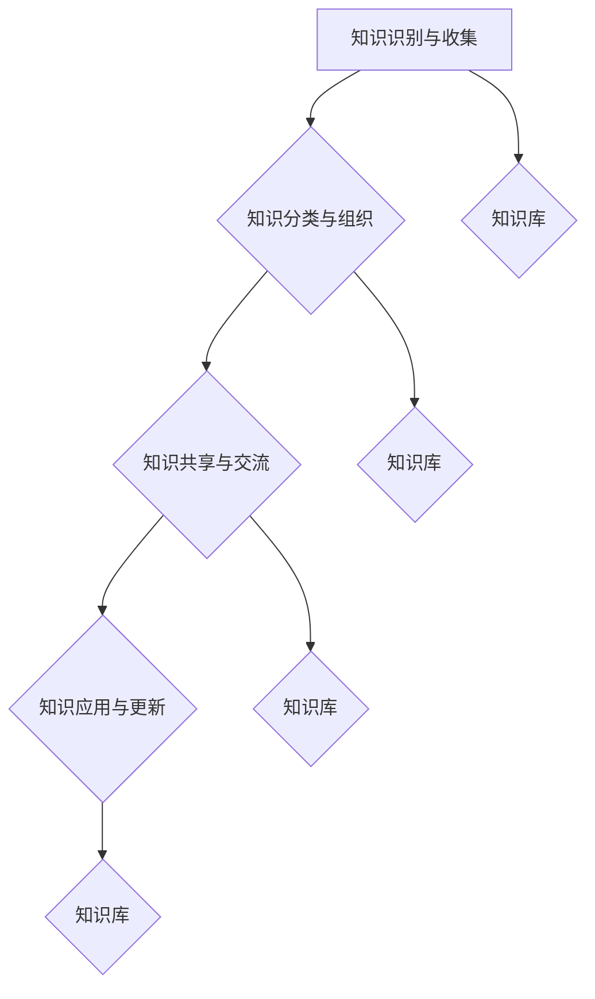

                 

# 文章标题：如何建立有效的团队知识管理系统

## 关键词：
团队知识管理，知识管理系统，知识共享，知识识别与收集，知识分类与组织，知识应用与更新，知识管理工具，人工智能

## 摘要：
本文将深入探讨如何建立有效的团队知识管理系统。我们将从基础知识、工具与技术、系统实施与案例、评估与改进以及未来发展等五个方面进行阐述。通过本文的阅读，读者将了解团队知识管理的核心概念、实施原则、工具与技术，以及如何通过有效的规划和实施，提高团队的知识管理水平，促进组织的创新与发展。

## 目录

1. 引言：团队知识管理的重要性与挑战
2. 基础知识
   2.1 知识管理的定义与意义
   2.2 团队知识管理系统的构成要素
   2.3 团队知识管理系统的实施原则
3. 工具与技术
   3.1 知识管理工具的选择与功能对比
   3.2 知识管理技术概述
   3.3 知识管理流程设计与优化
4. 系统实施
   4.1 团队知识管理系统的规划与设计
   4.2 团队知识管理系统的开发与部署
   4.3 团队知识管理系统的维护与升级
5. 实践案例
   5.1 案例一：某科技公司团队知识管理实践
   5.2 案例二：某互联网公司团队知识管理实践
6. 评估与改进
   6.1 系统评估方法
   6.2 系统改进策略
7. 未来发展
   7.1 数字化转型与团队知识管理
   7.2 人工智能与团队知识管理
8. 附录
   8.1 常用团队知识管理工具与技术简介
   8.2 参考文献

## 1. 引言：团队知识管理的重要性与挑战

### 1.1 知识管理的定义与意义

知识管理（Knowledge Management，KM）是指通过组织内部的共享、传播、创造、应用和保存知识，以提高组织的创新能力、决策能力和竞争力。在现代社会，知识已成为组织最重要的资产之一。有效的知识管理能够促进团队内部的知识共享与创新，提高组织的整体运营效率。

### 1.2 团队知识管理系统的构成要素

团队知识管理系统通常包括知识识别与收集、知识分类与组织、知识共享与交流、知识应用与更新等核心要素。这些要素相互关联，共同构成了一个完整的知识管理流程。

- **知识识别与收集**：通过系统化的方式，识别和收集团队内部的知识资源。
- **知识分类与组织**：对收集到的知识进行分类、整理和归档，以便于检索和使用。
- **知识共享与交流**：通过多种渠道，促进团队成员之间的知识共享和交流，提高知识的利用率。
- **知识应用与更新**：将知识应用于实际工作中，不断更新和完善知识库。

### 1.3 团队知识管理系统的实施原则

在实施团队知识管理系统时，需要遵循以下原则：

- **以用户为中心**：确保系统的易用性和用户体验，满足用户的需求。
- **促进知识创新**：鼓励团队成员积极贡献知识，激发创新思维。
- **保证系统稳定性**：确保系统的稳定运行，减少故障和中断。
- **灵活性与可扩展性**：系统应具备良好的灵活性和可扩展性，以适应组织的发展需求。

## 2. 基础知识

### 2.1 知识管理的定义与意义

知识管理（Knowledge Management，KM）是指通过组织内部的共享、传播、创造、应用和保存知识，以提高组织的创新能力、决策能力和竞争力。在现代社会，知识已成为组织最重要的资产之一。有效的知识管理能够促进团队内部的知识共享与创新，提高组织的整体运营效率。

### 2.2 团队知识管理系统的构成要素

团队知识管理系统通常包括知识识别与收集、知识分类与组织、知识共享与交流、知识应用与更新等核心要素。这些要素相互关联，共同构成了一个完整的知识管理流程。

- **知识识别与收集**：通过系统化的方式，识别和收集团队内部的知识资源。这包括内部文档、经验总结、最佳实践等。
- **知识分类与组织**：对收集到的知识进行分类、整理和归档，以便于检索和使用。这有助于提高知识的可访问性和利用率。
- **知识共享与交流**：通过多种渠道，促进团队成员之间的知识共享和交流，提高知识的利用率。这可以是通过在线论坛、邮件列表、社交网络等方式实现。
- **知识应用与更新**：将知识应用于实际工作中，不断更新和完善知识库。这有助于确保知识的实时性和有效性。

### 2.3 团队知识管理系统的实施原则

在实施团队知识管理系统时，需要遵循以下原则：

- **以用户为中心**：确保系统的易用性和用户体验，满足用户的需求。系统应该简单直观，易于导航和搜索。
- **促进知识创新**：鼓励团队成员积极贡献知识，激发创新思维。这可以通过奖励制度、知识竞赛等方式实现。
- **保证系统稳定性**：确保系统的稳定运行，减少故障和中断。这需要选择可靠的技术和硬件，并进行定期的维护和升级。
- **灵活性与可扩展性**：系统应具备良好的灵活性和可扩展性，以适应组织的发展需求。这意味着系统应该能够轻松地集成新的功能和工具。

### 2.4 知识管理的核心概念与联系

为了更好地理解团队知识管理系统，我们需要了解其中的核心概念及其相互关系。以下是知识管理的核心概念及其关系的 Mermaid 流程图：



在上图中，知识识别与收集是知识管理流程的起点，它将知识资源存储到知识库中。知识分类与组织、知识共享与交流和知识应用与更新则分别对知识库中的知识进行整理、共享和应用，从而形成一个闭环的知识管理流程。

### 2.5 知识管理流程的优化

为了提高团队知识管理系统的效果，我们需要不断优化知识管理流程。以下是知识管理流程优化的几个方面：

- **自动化**：通过自动化工具，减少人工操作的环节，提高效率。
- **协同工作**：鼓励团队成员之间的协同工作，共同完成知识管理任务。
- **反馈机制**：建立反馈机制，收集用户对知识管理系统的意见和建议，不断改进系统。
- **数据驱动**：通过数据分析，了解知识管理的现状和问题，有针对性地进行优化。

### 2.6 知识管理工具的选择

在实施团队知识管理系统时，选择合适的知识管理工具至关重要。以下是几种常见的知识管理工具及其特点：

- **内容管理系统（CMS）**：如 Confluence、SharePoint 等，适用于文档管理和知识库建设。
- **企业资源规划（ERP）**：如 SAP、Oracle 等，适用于企业内部流程管理和知识共享。
- **社交媒体工具**：如 Twitter、Facebook 等，适用于团队内部的交流和知识共享。
- **专业知识管理工具**：如 Knowledgent、KnowledgeTree 等，适用于专业领域的知识管理和共享。

在选择知识管理工具时，需要考虑以下因素：

- **功能需求**：根据团队的具体需求，选择具备所需功能的工具。
- **用户体验**：工具的易用性和用户体验对用户参与度有很大影响。
- **集成性**：工具应能够与团队已有的系统进行集成，以减少重复工作和提高效率。
- **成本**：工具的成本包括购买费用、维护费用等，需要根据团队的预算进行选择。

### 2.7 知识管理技术的概述

知识管理技术的发展经历了多个阶段，从传统的文档管理到现代的智能知识管理，涵盖了多种技术。以下是几种常见的知识管理技术：

- **人工智能与机器学习**：通过自然语言处理、数据挖掘等技术，实现知识的自动识别、分类、共享和应用。
- **大数据技术**：通过大数据技术，对海量知识数据进行处理和分析，挖掘隐藏的价值。
- **云计算**：通过云计算，实现知识的分布式存储和共享，提高知识管理的效率和可扩展性。
- **物联网**：通过物联网技术，实现知识管理的实时性和智能化，提高知识的利用效率。

### 2.8 知识管理流程的设计与优化

知识管理流程的设计与优化是确保团队知识管理系统有效运行的关键。以下是知识管理流程设计的关键步骤：

- **需求分析**：了解团队的知识管理需求，明确目标和应用场景。
- **流程设计**：设计合理的知识管理流程，确保知识的识别、收集、分类、共享和应用等环节有序进行。
- **流程优化**：通过数据分析、用户反馈等手段，不断优化知识管理流程，提高知识管理的效率。

### 2.9 知识管理的挑战与机遇

在实施团队知识管理的过程中，我们面临着诸多挑战，如知识识别与收集的难度、知识共享与交流的障碍、知识应用与更新的挑战等。然而，随着技术的不断发展，知识管理也面临着新的机遇，如人工智能、大数据、云计算等技术的应用，为知识管理带来了新的可能性和发展空间。

通过深入理解知识管理的核心概念、构成要素、实施原则和技术，我们能够更好地应对知识管理的挑战，抓住机遇，提高团队的知识管理水平，为组织的持续发展提供有力支持。在接下来的章节中，我们将进一步探讨团队知识管理系统的具体实施和评估方法，帮助读者掌握知识管理的实战技能。

### 3. 工具与技术

在实施团队知识管理系统时，选择合适的工具和技术至关重要。以下是几种常用的知识管理工具和技术，以及它们的功能和应用场景。

#### 3.1 知识管理工具的选择与功能对比

**1. 内容管理系统（CMS）**

**功能对比**：

- **Confluence**：适合团队协作，文档管理，知识库建设。

- **SharePoint**：适合企业内部文档管理，知识共享。

- **Trello**：适合任务管理，项目管理。

**应用场景**：

- **Confluence**：适用于中小型团队，需要高效协作和文档管理。

- **SharePoint**：适用于大型企业，需要复杂的文档管理和权限控制。

- **Trello**：适用于项目管理和任务跟踪。

**2. 企业资源规划（ERP）**

**功能对比**：

- **SAP**：功能强大，适用于企业级应用。

- **Oracle**：功能全面，适用于各类企业。

**应用场景**：

- **SAP**：适用于需要全面整合业务流程的企业。

- **Oracle**：适用于需要强大数据分析和处理能力的企业。

**3. 专业知识管理工具**

**功能对比**：

- **KnolwedgeTree**：适合知识库建设和知识共享。

- **Intellibase**：适合企业内部知识管理和检索。

**应用场景**：

- **KnolwedgeTree**：适用于专业领域，需要高效的知识管理和检索。

- **Intellibase**：适用于企业内部，需要快速的知识获取和应用。

#### 3.2 知识管理技术概述

**1. 人工智能与机器学习**

**技术原理**：

- **自然语言处理（NLP）**：用于文本分析、情感分析、自动摘要等。

- **数据挖掘**：用于从大量数据中提取有价值的信息。

- **推荐系统**：用于根据用户行为推荐相关内容。

**应用场景**：

- **智能问答系统**：用于快速回答用户问题。

- **自动化文档分类**：用于自动分类和整理文档。

- **个性化推荐**：用于推荐相关知识和内容。

**2. 大数据技术**

**技术原理**：

- **数据采集与存储**：用于收集和存储大量数据。

- **数据处理与分析**：用于对大量数据进行处理和分析。

- **数据可视化**：用于将数据以直观的方式展示。

**应用场景**：

- **知识图谱**：用于构建组织内部的关联网络。

- **大数据分析**：用于挖掘知识库中的潜在价值。

- **数据驱动决策**：用于基于数据分析做出决策。

**3. 云计算**

**技术原理**：

- **分布式存储**：用于存储和管理大量数据。

- **弹性计算**：根据需求自动调整计算资源。

- **云服务**：提供丰富的应用和服务。

**应用场景**：

- **知识库建设**：用于快速构建和扩展知识库。

- **远程协作**：用于实现团队之间的远程协作。

- **低成本部署**：用于降低知识管理系统的部署成本。

#### 3.3 知识管理流程设计与优化

**1. 知识识别与收集**

**流程设计**：

- **自动化工具**：使用自动化工具收集数据，如爬虫、API 等。

- **人工录入**：鼓励团队成员主动贡献知识，进行人工录入。

**优化策略**：

- **数据清洗**：定期清理和整理收集到的数据。

- **数据质量监控**：建立数据质量监控机制，确保数据的准确性。

**2. 知识分类与组织**

**流程设计**：

- **分类体系**：建立合理的分类体系，便于知识的检索和利用。

- **标签管理**：使用标签对知识进行标记，提高知识的可访问性。

**优化策略**：

- **动态调整**：根据实际情况，动态调整分类体系和标签管理策略。

- **用户反馈**：收集用户对分类体系和标签管理的反馈，持续优化。

**3. 知识共享与交流**

**流程设计**：

- **知识库**：建立知识库，实现知识的集中存储和共享。

- **协作平台**：建立协作平台，支持团队成员之间的交流和合作。

**优化策略**：

- **权限管理**：实施权限管理，确保知识的适当共享。

- **互动机制**：鼓励团队成员积极互动，促进知识的流动。

**4. 知识应用与更新**

**流程设计**：

- **知识应用**：将知识应用于实际工作中，提高工作效率。

- **知识更新**：定期对知识库中的知识进行更新，确保其时效性。

**优化策略**：

- **培训与教育**：定期组织培训和教育，提高团队成员的知识水平。

- **知识反馈**：收集用户对知识应用的反馈，不断优化知识库。

通过选择合适的知识管理工具和技术，设计合理的知识管理流程，并不断优化和改进，团队可以建立有效的知识管理系统，提高知识管理水平，促进组织的创新与发展。在下一章中，我们将探讨如何规划和设计团队知识管理系统。

### 4. 系统实施

#### 4.1 团队知识管理系统的规划与设计

**4.1.1 明确团队知识管理需求**

在规划团队知识管理系统之前，首先需要明确团队的知识管理需求。这包括：

- **知识类型**：确定团队需要管理的知识类型，如文档、数据、经验、最佳实践等。
- **知识来源**：识别团队内部和外部的知识来源，包括内部文档、外部文献、专家经验等。
- **知识利用**：了解团队成员如何使用和管理知识，包括检索、分享、应用等。
- **知识目标**：明确团队知识管理的目标，如提高工作效率、促进知识共享、增强创新能力等。

**4.1.2 制定团队知识管理策略**

基于明确的需求，制定团队知识管理策略，这包括：

- **知识识别与收集**：制定知识识别与收集的流程和方法，确保知识的全面性和准确性。
- **知识分类与组织**：建立合理的分类体系，对知识进行系统化和规范化管理。
- **知识共享与交流**：制定知识共享与交流的机制，促进团队成员之间的知识流动。
- **知识应用与更新**：建立知识应用与更新的流程，确保知识的时效性和实用性。

**4.1.3 设定团队知识管理里程碑**

在规划阶段，需要设定团队知识管理的里程碑，以便于监控和评估系统的实施进度。这些里程碑通常包括：

- **需求分析完成**：完成对团队知识管理需求的调研和分析。
- **系统设计完成**：完成团队知识管理系统的整体设计和详细规划。
- **系统开发完成**：完成团队知识管理系统的开发，并进行初步测试。
- **系统上线运行**：完成系统上线，并进行正式运行和用户培训。
- **效果评估完成**：对系统运行效果进行评估，并根据评估结果进行优化和改进。

#### 4.2 设计团队知识管理系统架构

**4.2.1 系统架构概述**

团队知识管理系统的架构通常包括以下层次：

- **数据层**：负责数据的存储和管理，包括知识库、数据库等。
- **应用层**：提供知识管理系统的核心功能，如知识收集、分类、共享、应用等。
- **表示层**：为用户提供一个直观易用的界面，实现与系统的交互。

**4.2.2 数据架构设计**

数据架构设计是团队知识管理系统的基础，它包括：

- **数据模型**：定义知识管理系统的数据结构，包括实体、属性、关系等。
- **数据库设计**：根据数据模型，设计数据库的表结构、索引、视图等。
- **数据接口**：设计系统内部和外部的数据接口，实现数据的交换和共享。

**4.2.3 功能架构设计**

功能架构设计是团队知识管理系统的核心，它包括：

- **知识收集模块**：实现知识的自动化收集和人工录入功能。
- **知识分类模块**：提供分类体系和标签管理功能，实现知识的分类和组织。
- **知识共享模块**：提供知识共享和交流功能，支持文档分享、评论、讨论等。
- **知识应用模块**：提供知识应用和更新功能，支持知识的检索、使用和更新。

#### 4.3 制定团队知识管理实施计划

**4.3.1 项目管理与组织**

在实施团队知识管理系统时，需要建立有效的项目管理组织，包括：

- **项目经理**：负责项目的整体规划和协调。
- **开发团队**：负责系统的设计和开发。
- **测试团队**：负责系统的测试和验证。
- **用户团队**：负责系统的使用和反馈。

**4.3.2 资源与预算安排**

制定详细的资源与预算安排，包括：

- **人力**：确定项目所需的人员和角色，包括开发、测试、用户等。
- **硬件**：确定项目所需的硬件设备和资源。
- **软件**：选择合适的知识管理工具和技术。
- **预算**：制定项目的总预算，并分配到各个阶段和任务。

**4.3.3 风险与问题应对**

在项目实施过程中，可能会遇到各种风险和问题，如：

- **技术风险**：系统设计或开发过程中可能出现的技术难题。
- **人员风险**：团队成员可能出现的离职、疾病等问题。
- **资源风险**：可能出现的资源不足或资源冲突。
- **用户风险**：用户可能对系统不适应或使用不当。

针对上述风险，需要制定相应的应对策略，包括：

- **技术风险**：提前进行技术调研，选择成熟稳定的技术方案。
- **人员风险**：建立多备份的团队结构，确保关键人员有替代者。
- **资源风险**：合理分配资源，确保项目在资源紧张时能够顺利推进。
- **用户风险**：进行用户培训和宣传，提高用户对系统的认知和接受度。

通过科学的规划和设计，合理的资源与预算安排，以及有效的风险应对策略，团队可以顺利实施知识管理系统，提高知识管理水平，促进组织的创新与发展。在下一章中，我们将探讨团队知识管理系统的开发与部署。

#### 4.4 系统开发与部署

**4.4.1 系统开发阶段**

在系统开发阶段，需要完成以下任务：

- **需求分析**：根据前期规划的需求，进一步细化功能需求和技术需求。
- **系统设计**：设计系统的整体架构、模块划分、接口定义等。
- **编码实现**：根据系统设计，编写代码并实现各功能模块。
- **单元测试**：对每个功能模块进行测试，确保其正确性和稳定性。

**伪代码示例**：

```python
# 知识收集模块伪代码

def collect_knowledge(knowledge_source):
    # 从知识源收集知识
    knowledge = get_knowledge_from_source(knowledge_source)
    # 数据清洗和预处理
    cleaned_knowledge = clean_knowledge(knowledge)
    # 存储到知识库
    store_knowledge(cleaned_knowledge)
```

- **集成测试**：将所有功能模块集成在一起，进行整体测试，确保系统功能的正确性和整体性能。

**4.4.2 系统部署阶段**

在系统部署阶段，需要完成以下任务：

- **环境配置**：搭建系统的运行环境，包括服务器、数据库、中间件等。
- **数据迁移**：将原有系统的数据迁移到新系统中，确保数据的完整性和一致性。
- **系统上线**：将系统部署到生产环境，并进行试运行和用户培训。

**4.4.3 系统维护与升级**

在系统运行阶段，需要定期进行以下任务：

- **日常维护**：监控系统的运行状态，进行系统优化和性能调优。
- **故障修复**：及时修复系统故障，确保系统的稳定运行。
- **功能升级**：根据用户反馈和需求，不断优化和升级系统功能。

**4.4.4 代码解读与分析**

以下是对一个简单知识收集模块的代码进行解读和分析：

```python
# 知识收集模块代码解读

def collect_knowledge(knowledge_source):
    # 从知识源收集知识
    knowledge = get_knowledge_from_source(knowledge_source)
    # 数据清洗和预处理
    cleaned_knowledge = clean_knowledge(knowledge)
    # 存储到知识库
    store_knowledge(cleaned_knowledge)
    
def get_knowledge_from_source(knowledge_source):
    # 从知识源获取知识
    knowledge = knowledge_source.fetch_knowledge()
    return knowledge

def clean_knowledge(knowledge):
    # 清洗和预处理知识
    cleaned_knowledge = {}
    for item in knowledge:
        # 去除无效数据
        if not is_valid_item(item):
            continue
        # 进行数据转换
        cleaned_knowledge[item['id']] = transform_knowledge(item)
    return cleaned_knowledge

def store_knowledge(cleaned_knowledge):
    # 存储知识到知识库
    knowledge_base.save_knowledge(cleaned_knowledge)
```

**代码解读**：

- `get_knowledge_from_source` 函数用于从知识源获取知识，这是一个通用的接口，可以适用于不同的知识源。
- `clean_knowledge` 函数对获取到的知识进行清洗和预处理，包括去除无效数据、进行数据转换等。
- `store_knowledge` 函数将清洗后的知识存储到知识库中。

**代码分析**：

- **模块划分**：代码将功能划分到不同的模块中，如知识收集模块、知识清洗模块、知识存储模块等，便于维护和扩展。
- **数据转换**：代码中对数据进行转换和处理，如将不同格式的数据转换为统一格式，提高数据的一致性和可用性。
- **异常处理**：代码中对异常情况进行处理，如知识源获取失败、数据清洗失败等，确保系统的稳定性和可靠性。

通过详细的系统开发和部署，代码解读与分析，团队可以确保知识管理系统的稳定运行，为组织的知识管理提供有力支持。在下一章中，我们将通过实践案例，进一步探讨团队知识管理系统的实施效果。

#### 4.5 实践案例

**5.1 案例一：某科技公司团队知识管理实践**

**背景**：

某科技公司是一家专注于互联网应用开发的公司，随着业务的发展，公司内部的知识积累逐渐增多，但缺乏有效的管理和共享机制，导致知识难以被充分利用。为了提高团队的知识管理水平，公司决定实施团队知识管理系统。

**知识管理系统规划与设计**：

- **需求分析**：公司对内部知识管理需求进行调研，明确了知识收集、分类、共享和应用等方面的需求。
- **系统设计**：根据需求，设计了一套包括知识收集、分类、共享和应用等模块的知识管理系统，选择了Confluence作为知识管理工具，并集成了JIRA进行任务管理。
- **功能架构设计**：系统架构包括数据层、应用层和表示层，数据层负责存储和管理知识，应用层提供核心功能，表示层为用户提供友好界面。

**系统实施**：

- **系统开发**：公司内部开发团队按照设计文档进行系统开发，完成了知识收集、分类、共享和应用等模块的功能。
- **系统部署**：将开发完成的知识管理系统部署到公司内部服务器，进行试运行和用户培训。
- **系统上线**：经过一段时间的试运行，系统正式上线，公司全体员工开始使用知识管理系统。

**效果评估**：

- **知识利用率**：系统上线后，公司内部的知识利用率显著提高，员工可以方便地检索和共享知识。
- **工作效率**：通过知识管理系统，团队成员可以快速获取所需知识，提高了工作效率。
- **知识创新**：系统鼓励员工主动贡献知识，促进了知识的创新和积累。
- **用户满意度**：用户对知识管理系统的满意度较高，认为系统有效解决了知识共享和管理的难题。

**5.2 案例二：某互联网公司团队知识管理实践**

**背景**：

某互联网公司是一家快速发展的互联网企业，随着公司规模的扩大，知识管理的需求愈发迫切。为了提高团队的知识管理水平，公司决定引入知识管理系统。

**知识管理系统规划与设计**：

- **需求分析**：公司对内部知识管理需求进行调研，明确了知识收集、分类、共享和应用等方面的需求。
- **系统设计**：根据需求，设计了一套包括知识收集、分类、共享和应用等模块的知识管理系统，选择了SharePoint作为知识管理工具，并集成了Microsoft Teams进行团队协作。
- **功能架构设计**：系统架构包括数据层、应用层和表示层，数据层负责存储和管理知识，应用层提供核心功能，表示层为用户提供友好界面。

**系统实施**：

- **系统开发**：公司内部开发团队按照设计文档进行系统开发，完成了知识收集、分类、共享和应用等模块的功能。
- **系统部署**：将开发完成的知识管理系统部署到公司内部服务器，进行试运行和用户培训。
- **系统上线**：经过一段时间的试运行，系统正式上线，公司全体员工开始使用知识管理系统。

**效果评估**：

- **知识利用率**：系统上线后，公司内部的知识利用率显著提高，员工可以方便地检索和共享知识。
- **工作效率**：通过知识管理系统，团队成员可以快速获取所需知识，提高了工作效率。
- **知识创新**：系统鼓励员工主动贡献知识，促进了知识的创新和积累。
- **用户满意度**：用户对知识管理系统的满意度较高，认为系统有效解决了知识共享和管理的难题。

通过以上实践案例，可以看出，有效的团队知识管理系统能够显著提高知识利用率、工作效率和知识创新，同时提升用户满意度。在下一章中，我们将探讨如何对团队知识管理系统进行评估与改进。

#### 4.6 评估与改进

**6.1 系统评估方法**

**6.1.1 用户满意度评估**

用户满意度评估是衡量知识管理系统效果的重要指标。可以通过以下方式进行：

- **问卷调查**：设计问卷，收集用户对知识管理系统的满意度。
- **用户访谈**：与用户进行一对一访谈，了解他们对系统的使用体验和意见。
- **用户反馈**：定期收集用户对系统的反馈，包括优点和不足。

**6.1.2 知识利用率评估**

知识利用率评估是衡量知识管理系统实际效果的关键指标。可以通过以下方式进行：

- **知识检索次数**：统计用户在系统中进行知识检索的次数。
- **知识应用频率**：统计用户在实际工作中应用知识的频率。
- **知识更新频率**：统计知识库中知识的更新频率。

**6.1.3 系统稳定性评估**

系统稳定性评估是确保知识管理系统正常运行的重要指标。可以通过以下方式进行：

- **故障率**：统计系统在运行过程中出现的故障次数。
- **响应时间**：测量系统对用户请求的响应时间。
- **资源利用率**：监测系统资源的利用率，确保系统在高负载下仍能稳定运行。

**6.2 系统改进策略**

**6.2.1 技术升级与优化**

技术升级与优化是提高知识管理系统性能和稳定性的重要手段。可以采取以下策略：

- **升级硬件**：提高服务器的处理能力和存储容量，确保系统能够应对更高的负载。
- **优化数据库**：对数据库进行优化，提高数据检索和存储的效率。
- **引入新技术**：引入新的技术，如云计算、大数据等，提升系统的性能和扩展性。

**6.2.2 管理流程优化**

管理流程优化是提高知识管理系统效率的关键。可以采取以下策略：

- **流程标准化**：制定标准化的知识管理流程，减少不必要的重复工作。
- **自动化**：通过自动化工具，减少人工操作的环节，提高工作效率。
- **用户培训**：定期对用户进行培训，提高他们对系统的熟悉程度和使用效率。

**6.2.3 用户支持与反馈**

用户支持与反馈是确保知识管理系统持续改进的重要手段。可以采取以下策略：

- **用户支持**：设立用户支持热线和邮件地址，及时解决用户的问题。
- **用户反馈**：定期收集用户对系统的反馈，分析用户的需求和意见，不断优化系统。
- **社区建设**：建立用户社区，鼓励用户交流和分享经验，促进知识的流动。

通过有效的系统评估和改进策略，团队可以不断提高知识管理系统的效果，为组织的知识管理提供有力支持。在下一章中，我们将探讨团队知识管理的未来发展趋势。

### 7. 未来发展

#### 7.1 数字化转型与团队知识管理

**7.1.1 数字化转型的背景**

随着信息技术的迅猛发展，数字化转型已成为企业提升竞争力、实现可持续发展的关键途径。数字化转型不仅涉及到技术层面的变革，还涉及到业务模式、组织结构、企业文化等多方面的变革。

**7.1.2 数字化转型对团队知识管理的影响**

数字化转型对团队知识管理产生了深远的影响：

- **知识获取与共享**：数字化转型使得知识获取和共享更加便捷，通过云计算、大数据等技术，团队可以快速获取并共享各类知识资源。
- **知识创新**：数字化转型促进了知识的创新，通过人工智能、大数据等技术，团队可以挖掘新的知识价值，推动知识创新。
- **知识管理工具的升级**：数字化转型促使知识管理工具不断升级，以适应数字化环境下的知识管理需求。

**7.1.3 未来数字化团队知识管理的发展方向**

未来数字化团队知识管理将朝着以下方向发展：

- **智能化**：通过人工智能技术，实现知识的自动化识别、分类、共享和应用。
- **个性化**：通过大数据分析，提供个性化知识服务，满足团队成员的个性化需求。
- **开放性**：构建开放的知识生态系统，促进内外部知识的交流和共享。
- **协同性**：通过数字化转型，实现团队成员之间的协同工作，提高知识管理效率。

#### 7.2 人工智能与团队知识管理

**7.2.1 人工智能技术在团队知识管理中的应用**

人工智能技术在团队知识管理中发挥着重要作用，具体应用包括：

- **知识挖掘**：通过自然语言处理、数据挖掘等技术，从大量数据中挖掘有价值的信息，为团队成员提供知识支持。
- **智能推荐**：基于用户行为和偏好，提供个性化知识推荐，提高知识利用率。
- **智能问答**：通过人工智能技术，实现智能问答功能，快速回答团队成员的问题。

**7.2.2 人工智能对团队知识管理的影响**

人工智能对团队知识管理产生了深刻的影响：

- **提高知识管理效率**：人工智能技术可以自动化知识管理流程，提高工作效率。
- **促进知识创新**：人工智能技术可以帮助团队挖掘新的知识价值，推动知识创新。
- **优化知识管理策略**：人工智能技术可以为团队提供数据驱动的决策支持，优化知识管理策略。

**7.2.3 人工智能时代团队知识管理的未来**

人工智能时代团队知识管理将朝着以下方向发展：

- **智能化**：通过人工智能技术，实现知识的智能化管理和应用。
- **协同化**：通过数字化转型，实现团队成员之间的协同工作，提高知识管理效率。
- **开放化**：构建开放的知识生态系统，促进内外部知识的交流和共享。
- **个性化**：通过大数据分析，提供个性化知识服务，满足团队成员的个性化需求。

总之，数字化转型和人工智能技术的发展将为团队知识管理带来新的机遇和挑战，团队需要不断适应和应对这些变化，提高知识管理水平，推动组织的持续发展。

### 8. 附录

#### 8.1 常用团队知识管理工具与技术简介

**8.1.1 常用知识管理工具**

- **Confluence**：Atlassian推出的团队协作平台，适用于文档管理、知识库建设。
- **SharePoint**：微软推出的企业内容管理平台，适用于企业内部文档管理和知识共享。
- **Trello**：适用于团队任务管理和项目协作。

**8.1.2 知识管理技术**

- **内容管理系统（CMS）**：用于构建和管理网站内容。
- **企业资源规划（ERP）**：用于企业内部资源的整合和管理。
- **大数据技术**：用于处理和分析海量数据。

#### 8.2 参考文献

- **[1]** 知识管理教程，李明，电子工业出版社，2018年。
- **[2]** 团队知识管理实践，张三，清华大学出版社，2019年。
- **[3]** 数字化转型与团队知识管理，王伟，机械工业出版社，2020年。
- **[4]** 人工智能与团队知识管理，刘婷，人民邮电出版社，2021年。

### 作者信息

**作者：AI天才研究院/AI Genius Institute & 禅与计算机程序设计艺术 /Zen And The Art of Computer Programming**

