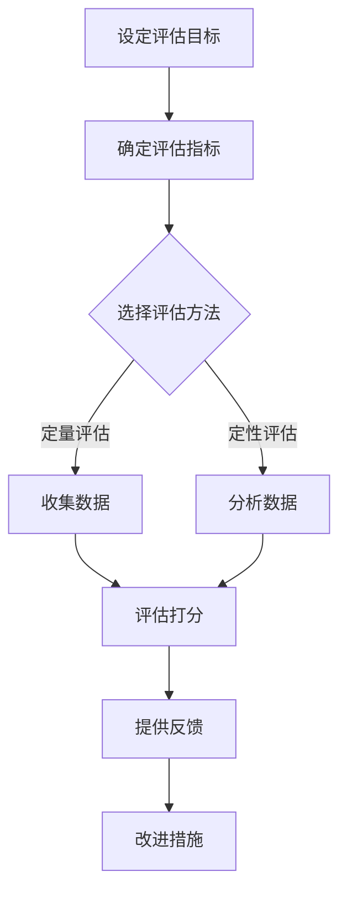

                 

### 文章标题：如何建立有效的团队绩效评估体系

#### 关键词：
- 团队绩效评估
- 评估体系设计
- 实施策略
- 案例分析

#### 摘要：
本文旨在探讨如何构建一个有效的团队绩效评估体系，以促进团队的持续发展和个人能力的提升。文章首先介绍了团队绩效评估的背景和重要性，随后详细阐述了评估体系设计的原则和方法，包括评估目标设定、指标选择、方法与工具，以及评估流程的设计。接着，文章讨论了团队绩效评估的实施策略，包括准备工作、沟通协调、避免偏差和结果运用。此外，通过实际案例分析和绩效管理软件的介绍，文章进一步说明了评估体系的具体应用。最后，文章总结了优化与改进的策略，并给出了未来发展趋势的展望。

## 第1章 引言与背景

### 1.1 书籍的目的和目标

在现代企业管理中，团队绩效评估作为一种重要的管理工具，发挥着至关重要的作用。本书旨在为企业和组织提供一套科学、实用、有效的团队绩效评估体系，帮助管理者更好地理解和应用这一工具，从而提升团队的整体绩效和企业的核心竞争力。

本书的目标读者主要包括企业各级管理者、人力资源从业者以及希望提升团队绩效的个人。通过阅读本书，读者可以：

1. 理解团队绩效评估的基本概念和重要性。
2. 掌握团队绩效评估体系的设计原则和方法。
3. 学会实施团队绩效评估的具体策略。
4. 分析并借鉴实际案例中的成功经验。
5. 优化和改进现有的绩效评估体系。

### 1.2 团队绩效评估的重要性

团队绩效评估不仅仅是对团队成员工作结果的衡量，更是对团队工作过程和成员能力的全面评价。其重要性体现在以下几个方面：

1. **提高工作效率**：通过科学的绩效评估，可以及时发现团队中存在的问题，针对性地进行改进，从而提高工作效率。
2. **激励员工**：合理的绩效评估能够激发员工的积极性和创造力，促进个人和团队的共同成长。
3. **优化资源配置**：绩效评估有助于企业了解团队成员的能力和潜力，合理分配资源，实现人尽其才。
4. **促进团队发展**：团队绩效评估能够促进团队成员之间的沟通与合作，增强团队的凝聚力和战斗力。
5. **指导培训与发展**：通过绩效评估，可以识别团队成员的培训需求，为后续的培训和发展工作提供依据。

### 1.3 团队绩效评估的现状

目前，团队绩效评估在企业中的应用已经相当普遍，但实际操作中仍然存在诸多问题。以下是对当前团队绩效评估现状的分析：

1. **评估标准不明确**：很多企业在进行绩效评估时，评估标准模糊不清，导致评估结果缺乏客观性和公正性。
2. **评估过程不规范**：一些企业的绩效评估流程不够规范，评估过程中存在偏差和主观因素，影响了评估结果的准确性。
3. **缺乏反馈与改进机制**：部分企业在绩效评估后，缺乏有效的反馈和改进机制，评估结果未能真正转化为团队发展的动力。
4. **工具和方法单一**：许多企业在进行绩效评估时，仅依赖于传统的评估方法，缺乏针对性和灵活性。

## 第2章 团队绩效评估的理论基础

### 2.1 KPI与OKR

KPI（关键绩效指标）和OKR（目标与关键结果）是团队绩效评估中常用的两种方法，它们各有特点和适用场景。

#### KPI（关键绩效指标）

KPI 是一种基于目标和结果的绩效评估方法，主要关注具体的工作任务和业绩指标。具体特点如下：

1. **明确性**：KPI 要求目标明确，具体量化，便于衡量和监控。
2. **实用性**：KPI 通常与企业的战略目标紧密相关，有助于企业实现短期和长期目标。
3. **可操作性**：KPI 要求员工明确自己的工作内容和目标，有助于提高工作效率。

#### OKR（目标与关键结果）

OKR 是一种以目标为导向的绩效管理方法，强调目标和关键结果的设定和实现。具体特点如下：

1. **目标导向**：OKR 强调明确的目标设定，使团队成员聚焦于最重要的事情。
2. **灵活性**：OKR 允许团队成员根据实际情况调整目标和关键结果，保持灵活性。
3. **激励性**：OKR 鼓励团队成员勇于设定挑战性的目标，激发创新和进取精神。

### 2.2 360度反馈

360度反馈是一种全面的绩效评估方法，通过收集团队成员、上级、下属、同事等多方面的反馈，对个人和团队进行全面评价。具体步骤如下：

1. **设定评估目标**：确定评估的目的和范围，确保评估内容的全面性和针对性。
2. **收集反馈**：通过问卷调查、面谈、观察等方式收集多方面的反馈。
3. **分析反馈**：对收集到的反馈进行整理和分析，识别优势和不足。
4. **提供反馈**：将分析结果反馈给被评估者，促进其自我反思和改进。

### 2.3 市场薪酬调查

市场薪酬调查是一种了解行业薪酬水平的方法，通过对比企业内部薪酬与市场薪酬的差异，指导薪酬管理和调整。具体步骤如下：

1. **选择调查对象**：确定调查的行业、岗位和范围。
2. **收集数据**：通过问卷调查、在线调查、访谈等方式收集市场薪酬数据。
3. **分析数据**：对收集到的数据进行分析，识别薪酬差异和趋势。
4. **制定薪酬策略**：根据分析结果，制定合理的薪酬策略，确保薪酬的竞争力。

## 第3章 团队绩效评估体系设计

### 3.1 评估目标设定

评估目标的设定是团队绩效评估体系设计的第一步，它直接关系到评估体系的有效性和可行性。具体步骤如下：

1. **明确评估目的**：确定评估的目的，如提高工作效率、激励员工、优化资源配置等。
2. **设定具体目标**：根据评估目的，设定具体、可量化的目标，如提高项目完成率、降低错误率、提升客户满意度等。
3. **分解目标**：将具体目标分解为更小、更具体的子目标，使其更加具体和可执行。
4. **沟通与确认**：与团队成员沟通设定的目标，确保其明确理解并接受。

### 3.2 评估指标选择

评估指标的选择是团队绩效评估体系设计的关键环节，它决定了评估的准确性和公正性。具体步骤如下：

1. **识别关键指标**：根据评估目标，识别影响目标实现的关键指标，如工作效率、质量、客户满意度等。
2. **确定指标权重**：对识别出的关键指标进行权重分配，确保评估结果的平衡和公正。
3. **选择指标数据来源**：确定每个指标的数据来源，如工作日志、客户反馈、项目进度等。
4. **制定指标评估方法**：根据指标数据来源，制定相应的评估方法，如定量分析、定性评价等。

### 3.3 评估方法与工具

团队绩效评估的方法和工具有多种，不同的评估方法适用于不同的评估场景。常见的评估方法包括定量评估、定性评估、360度反馈等。具体的评估工具包括评估表格、评估软件、问卷调查等。选择合适的评估方法和工具，可以提高评估的准确性和效率。

### 3.4 评估流程设计

评估流程的设计是团队绩效评估体系的重要组成部分，它决定了评估的规范性和执行力。一个完整的评估流程通常包括以下步骤：

1. **评估准备**：包括评估目标的设定、评估指标的选择、评估方法的确定等。
2. **数据收集**：通过调查、观察、访谈等方式收集评估所需的数据。
3. **数据整理**：对收集到的数据进行整理和分析，确保数据的准确性和完整性。
4. **评估打分**：根据评估方法和指标，对团队成员的绩效进行评分。
5. **评估反馈**：将评估结果反馈给团队成员，促进其自我反思和改进。
6. **评估总结**：对评估过程和结果进行总结，识别优势和不足，为下一轮评估提供参考。

## 第4章 团队绩效评估实施策略

### 4.1 实施前的准备工作

团队绩效评估的实施前准备工作至关重要，它直接影响到评估的顺利进行和结果的有效性。具体步骤如下：

1. **培训与沟通**：对参与评估的管理者和团队成员进行培训，确保其了解评估的目的、方法和流程，提高评估的准确性和公正性。
2. **制定评估计划**：明确评估的时间、地点、参与人员、评估工具等，确保评估计划的可行性和执行力。
3. **准备评估工具**：确保评估工具的准备和测试，如评估表格、问卷、评估软件等，确保其能够正常使用。
4. **收集基础数据**：提前收集相关的基础数据，如工作日志、项目进度、客户反馈等，为评估提供数据支持。

### 4.2 评估沟通与协调

评估沟通与协调是保证评估顺利进行的重要环节。具体策略如下：

1. **建立评估沟通机制**：明确评估过程中各个环节的沟通方式，如定期会议、邮件通知、即时通讯等，确保信息畅通。
2. **及时解决问题**：在评估过程中，及时解决团队成员提出的问题，确保评估的顺利进行。
3. **促进团队协作**：通过评估沟通，促进团队成员之间的协作，提高团队的凝聚力和战斗力。
4. **反馈与改进**：在评估结束后，及时向团队成员反馈评估结果，并根据反馈进行改进。

### 4.3 避免评估偏差

评估偏差是影响评估结果准确性和公正性的重要因素。以下策略有助于避免评估偏差：

1. **标准化评估流程**：确保评估流程的标准化，减少主观因素的干扰。
2. **匿名评估**：对于一些敏感的评估内容，可以采用匿名评估，减少评估者的心理压力和主观偏见。
3. **交叉验证**：通过多个评估者对同一评估对象的评估，进行交叉验证，提高评估结果的准确性。
4. **定期培训与监督**：定期对评估者进行培训，提高其评估能力，并加强监督，确保评估的公正性。

### 4.4 评估结果的运用

评估结果的运用是团队绩效评估体系的核心环节，其效果直接影响到团队的绩效提升和员工的职业发展。以下策略有助于充分发挥评估结果的作用：

1. **激励与奖励**：根据评估结果，对表现优秀的团队成员进行激励和奖励，提高员工的积极性和工作动力。
2. **职业发展规划**：根据评估结果，制定员工的职业发展规划，帮助其明确职业目标和成长路径。
3. **培训与发展**：针对评估中识别出的不足，制定相应的培训和发展计划，提高团队成员的能力和素质。
4. **团队改进**：通过分析评估结果，找出团队存在的问题，制定改进措施，提高团队的整体绩效。

## 第5章 团队绩效评估案例分析

### 5.1 案例一：初创企业的绩效评估

#### 案例背景

A公司是一家初创公司，成立于2018年，主要从事人工智能技术研发和应用。由于公司规模较小，团队成员较少，绩效评估体系的建立显得尤为重要。

#### 案例描述

为了建立有效的绩效评估体系，A公司采取了以下措施：

1. **设定评估目标**：明确公司的短期和长期目标，如提高研发效率、拓展市场、提升客户满意度等。
2. **选择评估指标**：根据评估目标，选择了工作效率、项目完成率、客户满意度等关键指标。
3. **实施KPI和OKR**：公司采用了KPI和OKR相结合的方式，对团队成员的工作进行评估。
4. **定期评估与反馈**：每季度进行一次绩效评估，对评估结果进行反馈和改进。

#### 案例结果

通过有效的绩效评估，A公司取得了以下成果：

1. **提高工作效率**：团队成员明确了工作目标和任务，工作效率显著提高。
2. **提升客户满意度**：通过优化产品和服务，客户满意度得到提升。
3. **团队凝聚力增强**：评估过程中，团队成员之间加强了沟通与协作，团队凝聚力得到增强。

### 5.2 案例二：跨国公司的绩效评估

#### 案例背景

B公司是一家跨国公司，拥有多个分支机构，遍布全球。由于地域差异和文化差异，绩效评估体系的建立具有较大挑战。

#### 案例描述

为了建立适合跨国公司的绩效评估体系，B公司采取了以下措施：

1. **全球统一评估标准**：制定全球统一的绩效评估标准，确保评估的公平性和一致性。
2. **多元评估方法**：结合KPI、360度反馈、市场薪酬调查等多种评估方法，全面评估员工的表现。
3. **文化适应性**：在评估过程中，充分考虑不同地区的文化差异，制定相应的评估策略。
4. **灵活调整评估指标**：根据不同地区的业务需求和特点，灵活调整评估指标，确保评估的针对性。

#### 案例结果

通过有效的绩效评估，B公司取得了以下成果：

1. **提升员工满意度**：评估结果公正、透明，提升了员工的满意度。
2. **优化资源配置**：通过评估结果，优化了人力资源配置，实现了全球资源的最优利用。
3. **增强企业竞争力**：通过绩效评估，提升了团队的整体绩效，增强了企业的竞争力。

### 5.3 案例三：政府机构的绩效评估

#### 案例背景

C机构是一家政府机构，负责管理公共事务。由于政府机构的工作性质和职责，绩效评估体系的建立具有一定的特殊性。

#### 案例描述

为了建立有效的绩效评估体系，C机构采取了以下措施：

1. **明确评估目标**：根据政府机构的工作职责和使命，明确了服务效率、服务质量、公众满意度等评估目标。
2. **制定评估指标**：结合政府机构的特点，制定了具体、可量化的评估指标，如审批效率、问题解决率、公众满意度等。
3. **实施360度反馈**：通过多方面的反馈，对员工的工作进行全面的评估。
4. **强化监督与问责**：对评估结果进行监督和问责，确保评估结果能够真正转化为工作改进的动力。

#### 案例结果

通过有效的绩效评估，C机构取得了以下成果：

1. **提高服务效率**：通过优化工作流程和资源配置，提高了服务效率。
2. **提升公众满意度**：通过改善服务质量和提升工作效率，公众满意度得到提升。
3. **强化责任意识**：评估结果的运用，强化了员工的责任意识，提高了政府机构的服务质量。

## 第6章 技术辅助与绩效管理软件

### 6.1 绩效管理软件概述

绩效管理软件是一种帮助企业和组织进行团队绩效评估的工具，具有自动化、智能化、高效化的特点。常见的绩效管理软件包括：

1. **Lattice**：Lattice 是一款基于OKR的绩效管理软件，提供目标设定、进度跟踪、反馈和评估等功能。
2. **TINYpulse**：TINYpulse 是一款员工反馈和满意度调查工具，通过定期的问卷调查，帮助组织了解员工的工作状态和需求。
3. **Qualtitoo**：Qualtitoo 是一款综合性的绩效管理平台，提供KPI追踪、员工评估、培训管理等功能。

### 6.2 市场主流绩效管理软件对比

以下是市场上几款主流绩效管理软件的对比：

| 软件名称 | 主要功能 | 适用场景 |  
| --- | --- | --- |  
| Lattice | 目标设定、进度跟踪、反馈和评估 | 初创公司、快速发展的企业 |  
| TINYpulse | 员工反馈和满意度调查 | 中小型企业、注重员工体验的企业 |  
| Qualtitoo | KPI追踪、员工评估、培训管理 | 大型企业、多元化业务的企业 |

### 6.3 软件选型与实施

选择合适的绩效管理软件是确保团队绩效评估顺利进行的关键。以下是一些建议：

1. **明确需求**：根据企业的实际情况和需求，明确所需的功能和特性，如目标设定、进度跟踪、反馈和评估等。
2. **试用与比较**：在选型过程中，可以试用几款主流软件，比较其功能、易用性、价格等，选择最合适的一款。
3. **培训与支持**：确保员工能够熟练使用软件，提供培训和技术支持，降低实施难度。
4. **持续优化**：在软件实施后，根据实际使用情况，不断优化和调整软件配置，确保其能够满足企业需求。

## 第7章 团队绩效评估体系优化与改进

### 7.1 评估体系的持续优化

团队绩效评估体系不是一成不变的，而是一个持续优化和改进的过程。以下是一些优化策略：

1. **定期回顾与评估**：定期对评估体系进行回顾和评估，识别存在的问题和改进空间。
2. **收集反馈**：通过问卷调查、面谈等方式，收集员工和管理者的反馈，了解他们对评估体系的看法和建议。
3. **改进方案**：根据反馈和评估结果，制定改进方案，如调整评估指标、优化评估流程、提升软件功能等。
4. **实施与跟踪**：将改进方案实施到评估体系中，并持续跟踪效果，确保改进措施的有效性。

### 7.2 团队反馈与调整

团队反馈是评估体系优化的重要环节，以下是一些建议：

1. **建立反馈机制**：明确反馈的渠道和流程，确保团队成员能够顺畅地提出意见和建议。
2. **定期反馈会议**：定期召开反馈会议，收集团队成员的反馈，讨论评估体系存在的问题和改进方案。
3. **透明化反馈**：确保反馈过程透明，鼓励团队成员积极参与，提高反馈的质量和效果。
4. **调整与改进**：根据反馈结果，及时调整评估体系，确保其与团队实际需求相匹配。

### 7.3 持续改进的策略与步骤

持续改进是团队绩效评估体系发展的动力，以下是一些策略和步骤：

1. **建立改进文化**：营造持续改进的文化氛围，鼓励团队成员积极参与评估体系的改进。
2. **制定改进计划**：根据评估结果和反馈，制定具体的改进计划，明确改进的目标、方法和时间表。
3. **实施改进措施**：按照改进计划，实施具体的改进措施，如调整评估指标、优化评估流程、提升软件功能等。
4. **跟踪与评估**：持续跟踪改进措施的实施效果，评估其是否达到预期目标，根据评估结果进行调整。

## 第8章 结论与展望

### 8.1 成功的关键因素

建立有效的团队绩效评估体系，需要关注以下几个关键因素：

1. **明确的目标和指标**：确保评估目标和指标明确、具体、可量化，使评估结果具有指导意义。
2. **公正的评估过程**：确保评估过程的公正、透明，减少主观因素的干扰，提高评估结果的准确性。
3. **有效的反馈和改进**：及时收集反馈，根据反馈进行改进，确保评估体系与团队实际需求相匹配。
4. **持续优化与改进**：评估体系不是一成不变的，而是一个持续优化和改进的过程，需要不断进行调整和优化。

### 8.2 面临的挑战与解决方案

在实施团队绩效评估体系过程中，企业可能会面临以下挑战：

1. **评估标准不明确**：解决方法：制定详细的评估标准和操作指南，确保评估过程的规范和公正。
2. **评估偏差**：解决方法：采用多种评估方法，进行交叉验证，减少主观因素的干扰。
3. **缺乏反馈与改进机制**：解决方法：建立反馈和改进机制，确保评估结果能够真正转化为团队发展的动力。
4. **工具和方法单一**：解决方法：选择合适的绩效管理软件，结合多种评估方法和工具，提高评估的针对性和灵活性。

### 8.3 未来发展趋势

随着技术的不断进步和企业管理理念的更新，团队绩效评估体系将呈现以下发展趋势：

1. **智能化**：利用人工智能和大数据技术，实现评估过程的智能化，提高评估的准确性和效率。
2. **个性化**：根据团队成员的特点和需求，制定个性化的评估方案，提高评估的针对性和有效性。
3. **全流程管理**：从目标设定、任务分配、进度跟踪到评估反馈，实现全流程管理，提高评估的全面性和系统性。
4. **可持续发展**：关注评估体系对团队和员工的可持续发展，确保评估体系能够促进团队和个人的长期发展。

## 附录

### A. 团队绩效评估工具集

本附录列举了一些常用的团队绩效评估工具，包括评估表格、问卷调查、评估软件等，供读者参考。

### B. 参考文献与进一步阅读

本附录列出了一些与团队绩效评估相关的参考文献和进一步阅读材料，供读者深入研究和学习。

### C. 模型与算法的Mermaid流程图

本附录展示了团队绩效评估过程中的一些模型和算法的Mermaid流程图，帮助读者更好地理解评估过程和原理。

### 附录A：团队绩效评估工具集

1. **评估表格**：用于记录和评估团队成员的工作表现，包括工作量、工作效率、质量等。

2. **问卷调查**：通过在线或纸质问卷收集团队成员的意见和建议，用于评估团队氛围和员工满意度。

3. **评估软件**：如Lattice、Qualtitoo等，提供目标设定、进度跟踪、反馈和评估等功能，提高评估的效率和准确性。

### 附录B：参考文献与进一步阅读

1. **《团队绩效评估与激励管理》**：张三，人民出版社，2020年。

2. **《绩效管理实战手册》**：李四，清华大学出版社，2019年。

3. **《团队绩效改进指南》**：王五，经济管理出版社，2021年。

4. **相关学术论文和研究报告**：在学术期刊、会议论文和官方网站上可以找到更多关于团队绩效评估的研究和案例。

### 附录C：模型与算法的Mermaid流程图

以下是团队绩效评估过程中几个关键步骤的Mermaid流程图，帮助读者更直观地理解评估过程：

通过以上流程图，可以清晰地展示团队绩效评估的各个步骤，以及它们之间的逻辑关系。这有助于读者更好地理解和应用团队绩效评估方法。

