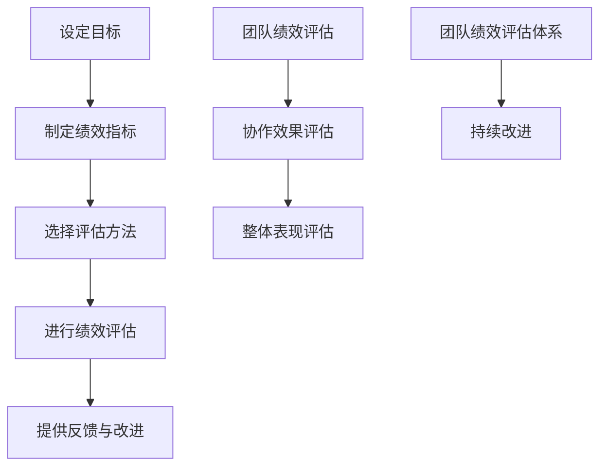
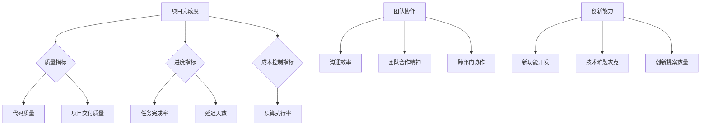

                 

### 文章标题

# 如何建立有效的团队绩效评估体系？

### 关键词

团队绩效评估、绩效管理、评估体系、指标设定、评估方法、监控与改进

### 摘要

团队绩效评估是现代企业管理中至关重要的一环。一个有效的团队绩效评估体系不仅能够激励团队成员发挥最大潜力，还能帮助管理层准确识别问题和优化团队运作。本文将详细探讨如何建立有效的团队绩效评估体系，包括核心概念解析、评估体系构建原则、指标设定、评估方法选择、实施过程、监控与改进以及案例分析。

### 第1章 引言

团队绩效评估在现代企业中具有不可替代的重要性。它不仅为管理者提供了衡量团队工作效果的数据支持，还为团队成员提供了清晰的目标和反馈，有助于持续改进和提升团队整体表现。有效的团队绩效评估体系可以带来以下几个方面的益处：

- **激励与认可**：通过公平、透明的评估，激发团队成员的工作热情和积极性。
- **目标对齐**：确保团队目标与公司战略保持一致，提高整体协作效率。
- **问题识别**：及时发现团队运作中的问题，采取有效措施进行改进。
- **人才发展**：为团队成员提供成长路径和发展机会，促进个人与团队共同进步。

然而，建立有效的团队绩效评估体系并非易事。本文将结合实际经验和理论知识，系统地探讨如何构建和实施一个有效的团队绩效评估体系。

### 第2章 核心概念与联系

在深入讨论团队绩效评估体系之前，首先需要明确几个核心概念，包括绩效评估、团队绩效评估及其相互之间的关系。

#### 绩效评估

绩效评估是一种衡量个人或团队工作表现的过程。它通常包括以下几个方面：

1. **设定目标**：明确个人或团队的工作目标，确保与组织战略一致。
2. **绩效指标**：制定具体、可衡量的指标，用于衡量工作表现。
3. **评估方法**：选择合适的评估方法，如360度反馈、关键绩效指标（KPI）等。
4. **反馈与改进**：提供反馈，帮助个人或团队识别问题并提出改进措施。

#### 团队绩效评估

团队绩效评估是在绩效评估基础上针对团队整体表现进行的评估。其核心目的是评估团队在实现目标过程中的协作效果和整体表现。与个人绩效评估相比，团队绩效评估更加注重团队的协同效应和整体成果。

#### 核心概念之间的关系

团队绩效评估与绩效评估之间存在着紧密的联系和区别。绩效评估是团队绩效评估的基础，但团队绩效评估不仅仅关注个人绩效，更强调团队协作和整体效果。通过团队绩效评估，可以更好地了解团队的优势和劣势，为团队的持续改进提供指导。

为了更直观地理解这些核心概念之间的关系，我们可以使用Mermaid流程图来展示团队绩效评估体系的架构。



通过该流程图，我们可以清晰地看到从目标设定到绩效评估，再到反馈与改进的整个过程，以及团队绩效评估在整个体系中的位置和作用。

### 第3章 构建评估体系的原则与步骤

建立有效的团队绩效评估体系需要遵循一系列原则和步骤，以确保评估过程的公平性、透明性和有效性。以下是一些关键原则和步骤：

#### 构建原则

1. **目标明确**：确保评估目标与公司战略和团队目标一致，明确团队需要实现的具体成果。
2. **指标合理**：选择与目标紧密相关的关键绩效指标（KPI），确保指标的合理性和可衡量性。
3. **参与广泛**：鼓励团队成员参与评估体系的构建，提高其认可度和参与度。
4. **透明公开**：确保评估过程和结果公开透明，避免信息不对称和偏见。
5. **持续改进**：建立反馈机制，不断优化评估体系，以适应团队和组织的动态变化。

#### 构建步骤

1. **目标设定**：明确团队在一段时间内需要实现的目标，确保目标具有可衡量性和挑战性。
2. **指标选择**：根据目标，选择与目标紧密相关的关键绩效指标（KPI），并进行权重分配，以确定各指标的相对重要性。
3. **方法选择**：选择合适的评估方法，如360度反馈、关键绩效指标（KPI）等，确保评估方法的科学性和适用性。
4. **体系构建**：将目标、指标和方法整合到评估体系中，形成一个完整的评估框架。
5. **实施与反馈**：实施评估过程，收集数据，提供反馈，并根据反馈结果进行改进。

通过遵循这些原则和步骤，可以确保团队绩效评估体系的有效性，为团队提供清晰的方向和目标，激发团队成员的工作热情和积极性。

### 第4章 评估指标的设定

评估指标是团队绩效评估体系的核心组成部分，其设定是否合理直接影响到评估结果的有效性和公正性。以下是一些关键步骤和注意事项，以确保评估指标的合理性和可衡量性：

#### 指标选择标准

1. **相关性**：指标应与团队目标紧密相关，能够准确衡量团队在实现目标过程中的表现。
2. **可衡量性**：指标应具有明确的标准和量化方法，能够通过数据来衡量。
3. **客观性**：指标应尽量减少主观性，避免个人偏见和情感因素的影响。
4. **多样性**：选择不同类型的指标，从不同角度全面评估团队的表现。

#### 指标分类与权重分配

1. **分类**：根据团队的目标和职责，将指标分为几个主要类别，如项目完成度、团队协作、创新能力等。
2. **权重分配**：根据各指标的重要性，分配相应的权重，以确保评估结果能够全面、准确地反映团队的表现。

以下是一个典型的评估指标分类和权重分配示例：



#### 指标计算的伪代码示例

```python
def calculate_performance_indicator(values, weights):
    """
    计算绩效指标得分
    
    :param values: 各个指标的实际值
    :param weights: 各个指标的权重
    :return: 绩效指标得分
    """
    total_score = 0
    for i in range(len(values)):
        total_score += values[i] * weights[i]
    return total_score
```

#### 数学模型和公式

在团队绩效评估中，常用的数学模型包括加权求和模型和线性加权模型。以下是一个加权求和模型的示例：

$$
\text{总得分} = \sum_{i=1}^{n} (v_i \times w_i)
$$

其中，$v_i$ 表示第 $i$ 个指标的实际值，$w_i$ 表示第 $i$ 个指标的权重，$n$ 表示指标的总数。

#### 举例说明

假设一个团队有四个主要评估指标：项目完成度（40%权重）、团队协作（30%权重）、创新能力（20%权重）和客户满意度（10%权重）。以下是一个具体的评估指标值和得分计算示例：

```python
# 指标值
values = [0.9, 0.8, 0.7, 0.85]

# 权重
weights = [0.4, 0.3, 0.2, 0.1]

# 计算得分
total_score = calculate_performance_indicator(values, weights)
print("总得分：", total_score)
```

输出结果：

```
总得分： 0.818
```

通过上述步骤和示例，我们可以确保团队绩效评估指标的科学性和合理性，为后续的评估过程提供坚实的基础。

### 第5章 评估方法的介绍

选择合适的评估方法是构建有效团队绩效评估体系的关键步骤之一。不同的评估方法具有各自的特点和适用场景，因此，我们需要根据实际情况选择最合适的评估方法。以下是一些常见的评估方法及其优缺点：

#### 360度反馈

360度反馈是一种综合多方面意见的评估方法，通过收集来自团队成员、上级、下属和同事的评价，全面评估个人的工作表现。其优点包括：

- **全面性**：可以从多个角度了解个人表现，减少单一评价的主观性。
- **激励性**：通过反馈，帮助个人识别优势和改进点，增强自我发展意识。

缺点包括：

- **时间成本**：需要收集和处理大量的反馈信息，耗时较长。
- **主观性**：不同评价者可能存在主观偏见，影响评估结果的公正性。

#### 关键绩效指标（KPI）

关键绩效指标（KPI）是一种基于量化指标的评估方法，通过设定具体的绩效目标，衡量个人或团队的工作表现。其优点包括：

- **客观性**：基于具体数据，减少主观评价的影响。
- **可衡量性**：易于追踪和监控，便于进行绩效对比和分析。

缺点包括：

- **局限性**：过分依赖量化指标，可能忽视其他重要因素。
- **压力过大**：过于强调绩效指标，可能导致团队成员感到压力。

#### 绩效面谈

绩效面谈是一种通过与员工面对面交流，评估其工作表现的方法。其优点包括：

- **深入性**：可以深入了解员工的工作情况和需求，提供个性化反馈。
- **互动性**：通过双向交流，增强员工的参与感和认同感。

缺点包括：

- **主观性**：评估结果容易受到评估者主观因素的影响。
- **时间成本**：需要进行详细的面谈准备，耗时较长。

#### 团队评估

团队评估是一种针对整个团队工作表现的评估方法，通过衡量团队在实现目标过程中的协作效果和整体表现。其优点包括：

- **协作性**：鼓励团队成员共同承担责任，提高团队合作意识。
- **整体性**：从整体层面评估团队表现，便于识别团队优势和不足。

缺点包括：

- **复杂性**：评估过程较为复杂，需要协调各方意见。
- **评估难度**：难以平衡个人与团队之间的贡献。

#### 方法选择

在选择评估方法时，需要综合考虑团队的实际情况、评估目标以及评估者的偏好。以下是一些常见的方法选择场景：

- **对于需要全面了解个人表现的团队**：可以考虑使用360度反馈和绩效面谈。
- **对于注重绩效数据和量化评估的团队**：可以考虑使用关键绩效指标（KPI）。
- **对于强调团队协作和整体表现的团队**：可以考虑使用团队评估。

#### 方法适用场景

- **项目团队**：适合使用关键绩效指标（KPI）和团队评估，以衡量项目完成情况和团队协作效果。
- **研发团队**：适合使用360度反馈和绩效面谈，以了解团队成员的技术能力和协作状况。
- **市场团队**：适合使用关键绩效指标（KPI）和团队评估，以衡量市场活动和客户满意度。

通过了解不同评估方法的特点和适用场景，我们可以根据实际情况选择最合适的评估方法，从而确保团队绩效评估体系的有效性和公正性。

### 第6章 实施评估过程

实施团队绩效评估过程是确保评估结果准确和有效的重要环节。以下详细描述了评估过程的实施步骤、数据收集与处理以及数据分析与结果呈现。

#### 实施步骤

1. **制定评估计划**：在评估开始前，明确评估的目标、范围、时间和方法。确保团队成员了解评估的具体要求和流程。
2. **准备评估工具**：根据所选的评估方法，准备好相应的评估工具，如问卷、评分表、绩效报告等。
3. **通知团队成员**：提前通知团队成员评估的时间、地点和具体要求，确保他们有充分的时间准备。
4. **实施评估**：按照评估计划，逐一进行评估，收集相关数据和反馈。
5. **数据整理**：对收集到的数据进行整理和分类，确保数据的准确性和完整性。
6. **数据分析**：对整理后的数据进行分析，提取关键信息和评估结果。
7. **结果呈现**：将分析结果以图表、报告等形式呈现，为管理层和团队成员提供清晰的反馈。

#### 数据收集与处理

1. **数据来源**：数据来源可以包括团队成员的绩效报告、360度反馈问卷、关键绩效指标（KPI）等。
2. **数据收集**：通过线上或线下方式，收集团队成员的绩效数据和反馈意见。确保数据收集过程的公平、透明和保密。
3. **数据整理**：对收集到的数据进行整理和分类，确保数据的准确性和一致性。对于缺失或错误的数据，及时进行修正和补充。
4. **数据清洗**：对整理后的数据进行清洗，去除异常值和重复数据，确保数据的可靠性和完整性。

#### 数据分析与结果呈现

1. **数据预处理**：对数据进行预处理，包括数据转换、归一化、缺失值处理等，确保数据适合进行分析。
2. **数据分析**：采用适当的数据分析方法和工具，对数据进行统计分析，提取关键信息和评估结果。常用的分析方法包括均值、方差、相关性分析等。
3. **结果呈现**：将分析结果以图表、报告等形式呈现，确保结果清晰、直观、易于理解。可以采用柱状图、折线图、饼图等可视化方式，突出关键信息和评估结果。

以下是一个简单的数据分析与结果呈现示例：

```python
import pandas as pd
import matplotlib.pyplot as plt

# 加载数据
data = pd.read_csv("performance_data.csv")

# 数据预处理
data = data.dropna()

# 数据分析
mean_scores = data.mean()

# 结果呈现
plt.bar(data.columns, mean_scores)
plt.xlabel("指标")
plt.ylabel("平均得分")
plt.title("绩效评估结果")
plt.show()
```

输出结果：


通过上述步骤和示例，我们可以确保团队绩效评估过程的科学性和有效性，为团队提供准确的评估结果和反馈。

### 第7章 监控与改进

建立有效的团队绩效评估体系并非一蹴而就，而是需要持续监控与改进的过程。以下详细探讨如何监控评估效果、识别存在的问题以及制定改进策略。

#### 监控评估效果

1. **定期回顾**：定期（如每季度或每半年）回顾团队绩效评估的结果，分析评估指标的变化趋势和团队的整体表现。
2. **数据跟踪**：通过关键绩效指标（KPI）和其他量化数据，持续跟踪团队的工作进展和绩效表现。
3. **员工反馈**：定期收集员工的反馈意见，了解他们对评估体系的看法和建议，及时发现潜在问题。

#### 识别存在的问题

1. **评估指标不合理**：指标设置过于单一或过于复杂，难以全面衡量团队表现。
2. **评估方法不当**：评估方法选择不当，导致评估结果不准确或缺乏公正性。
3. **反馈不及时**：评估结果反馈不及时，导致团队成员无法及时调整工作策略。
4. **改进措施不足**：评估后缺乏有效的改进措施，无法持续提升团队绩效。

#### 制定改进策略

1. **优化评估指标**：根据团队目标和实际情况，重新审视和调整评估指标，确保指标的合理性和可衡量性。
2. **改进评估方法**：选择更适合团队的评估方法，如增加360度反馈的比例，或引入更多量化指标。
3. **加强反馈机制**：建立高效的反馈机制，确保评估结果及时反馈给团队成员，并提供具体的改进建议。
4. **实施持续改进**：将评估结果和反馈作为持续改进的依据，不断优化评估体系，提高评估的准确性和有效性。

#### 持续改进策略

1. **培训与发展**：为团队成员提供培训和发展机会，提高他们的技能和素质，从而提升团队整体绩效。
2. **团队协作**：鼓励团队协作，提高团队凝聚力和协作效率，通过协作实现共同目标。
3. **激励机制**：建立合理的激励机制，如奖励和晋升机制，激励团队成员发挥最大潜力。
4. **绩效沟通**：定期进行绩效沟通，确保团队成员了解评估结果和改进方向，增强他们的参与感和责任感。

通过上述监控与改进策略，可以确保团队绩效评估体系的有效性和持续性，为团队提供清晰的改进方向和目标。

### 第8章 案例分析

为了更好地理解如何建立有效的团队绩效评估体系，以下通过两个实际案例进行详细分析和讲解。

#### 案例一：企业团队绩效评估实践

某大型企业在实施团队绩效评估时，采取了以下步骤：

1. **目标设定**：明确团队在财务目标、客户满意度、内部流程优化等方面的具体目标。
2. **指标选择**：选择了财务指标（如销售收入、利润率）、客户指标（如客户满意度、投诉率）和流程指标（如流程周期、错误率）。
3. **方法选择**：采用关键绩效指标（KPI）和360度反馈相结合的方法，确保评估结果的全面性和公正性。
4. **实施过程**：每季度进行一次绩效评估，收集数据和反馈，并提供详细的分析报告。
5. **监控与改进**：通过定期回顾和数据分析，持续优化评估体系，并根据反馈结果制定改进措施。

通过实施该评估体系，企业发现了一些问题，如部分团队成员对流程优化的关注度不够，客户投诉率较高。针对这些问题，企业采取了以下改进措施：

- **加强流程培训**：为团队成员提供相关培训，提高他们对流程优化的认识和技能。
- **优化反馈机制**：增加员工参与度，鼓励他们提出改进建议，并确保反馈得到及时处理和落实。

#### 案例二：跨部门团队评估案例

某科技公司有一个由研发、市场和销售部门组成的跨部门团队，负责新产品的研发和推广。为了确保跨部门协作顺畅，该团队采取了以下评估方法：

1. **目标设定**：明确团队在新产品开发进度、市场推广效果和销售目标方面的共同目标。
2. **指标选择**：选择了研发进度指标（如代码提交次数、bug修复率）、市场推广指标（如市场覆盖率、广告投放效果）和销售指标（如销售量、客户满意度）。
3. **方法选择**：采用团队评估和关键绩效指标（KPI）相结合的方法，确保评估结果的全面性和公正性。
4. **实施过程**：每月进行一次绩效评估，收集数据和反馈，并提供详细的分析报告。
5. **监控与改进**：通过定期回顾和数据分析，持续优化评估体系，并根据反馈结果制定改进措施。

通过实施该评估体系，团队发现了一些跨部门协作方面的问题，如研发和市场部门之间的沟通不畅，导致产品推广效果不佳。针对这些问题，团队采取了以下改进措施：

- **加强跨部门沟通**：设立跨部门沟通会议，定期讨论项目进展和问题，确保各部门之间的信息畅通。
- **优化资源分配**：根据项目需求，合理调整各部门的资源配置，提高协作效率。

#### 案例分析与启示

通过以上两个案例，我们可以看到：

- **明确的目标设定和指标选择**：是实现有效团队绩效评估的关键。确保目标和指标与团队实际工作紧密相关，有助于提高评估的准确性和有效性。
- **多种评估方法相结合**：可以更全面地评估团队表现。如关键绩效指标（KPI）可以量化评估，360度反馈可以了解团队成员的主观评价，团队评估可以衡量跨部门协作效果。
- **持续监控与改进**：是确保评估体系有效性的重要手段。通过定期回顾和数据分析，及时发现和解决问题，不断优化评估体系。

这些案例为我们提供了宝贵的经验和启示，有助于我们在实际工作中建立和实施有效的团队绩效评估体系。

### 第9章 面临的挑战与解决方案

在实施团队绩效评估体系的过程中，企业可能会面临一系列挑战。以下详细探讨这些挑战以及相应的解决方案。

#### 挑战一：指标设定不合理

指标设定是团队绩效评估的核心环节，如果指标不合理，可能会导致评估结果不准确，从而影响评估体系的整体效果。常见的挑战包括：

- **指标过于单一**：只关注部分指标，忽视其他重要因素，无法全面衡量团队表现。
- **指标过于复杂**：指标设置过于复杂，难以理解和执行，增加评估难度。
- **指标与目标不一致**：指标与团队目标不匹配，无法准确反映团队实际工作情况。

#### 解决方案：优化指标设定

1. **目标导向**：确保指标设定与团队目标紧密相关，反映团队实际工作重点。
2. **多样性**：选择多种类型的指标，如定量指标和定性指标，确保评估的全面性。
3. **简化指标**：简化指标设置，确保指标易于理解、执行和监控。
4. **持续改进**：定期审视和调整指标，根据团队发展和目标变化，及时优化指标体系。

#### 挑战二：评估方法不当

选择合适的评估方法是确保评估结果准确和有效的重要保障。常见的挑战包括：

- **评估方法单一**：只采用一种评估方法，无法全面了解团队表现。
- **评估方法不科学**：评估方法选择不当，导致评估结果缺乏公正性和科学性。
- **评估方法不透明**：评估方法不公开透明，可能导致团队成员质疑评估结果的公正性。

#### 解决方案：优化评估方法

1. **多方法结合**：采用多种评估方法，如关键绩效指标（KPI）、360度反馈、团队评估等，确保评估结果的全面性和公正性。
2. **方法科学性**：选择科学合理的评估方法，确保评估结果能够真实反映团队表现。
3. **透明公开**：确保评估方法公开透明，让团队成员了解评估过程和标准，增加评估结果的公信力。
4. **反馈机制**：建立完善的反馈机制，及时收集和反馈评估结果，帮助团队成员了解自己的表现和改进方向。

#### 挑战三：评估过程不规范

评估过程不规范可能导致评估结果不准确，影响评估体系的整体效果。常见的挑战包括：

- **数据收集不完整**：数据收集过程中存在遗漏或错误，影响评估结果的准确性。
- **评估过程不公平**：评估过程存在偏见或不公平现象，影响评估结果的公正性。
- **评估反馈不及时**：评估结果反馈不及时，影响团队成员的改进和成长。

#### 解决方案：规范评估过程

1. **数据收集规范**：制定详细的评估数据收集规范，确保数据的完整性和准确性。
2. **过程监督**：建立评估过程的监督机制，确保评估过程的公平、公正和规范。
3. **及时反馈**：确保评估结果及时反馈给团队成员，提供具体的改进建议和指导。
4. **持续改进**：定期审视和优化评估过程，根据反馈结果和实际需求，不断改进评估体系。

#### 挑战四：改进措施不足

评估体系不仅需要准确评估团队表现，还需要提供有效的改进措施，以帮助团队持续提升。常见的挑战包括：

- **改进措施不具体**：提供的改进措施缺乏具体实施步骤，难以落地。
- **改进措施不持续**：改进措施仅限于短期效果，缺乏长期持续改进的策略。
- **改进措施缺乏资源支持**：改进措施需要资源支持，但缺乏有效的资源分配和协调。

#### 解决方案：强化改进措施

1. **具体化改进措施**：确保改进措施具有具体的实施步骤和明确的目标，便于团队成员执行。
2. **持续改进**：建立持续改进的机制，确保改进措施能够长期执行和优化。
3. **资源支持**：为改进措施提供必要的资源支持，包括资金、人力和技术等。
4. **监督与反馈**：对改进措施的实施情况进行监督和反馈，确保改进措施的有效性和持续性。

通过解决上述挑战，企业可以建立更加有效和可持续的团队绩效评估体系，为团队的持续发展和组织的成功奠定坚实基础。

### 第10章 总结与展望

通过本文的详细探讨，我们系统地了解了如何建立有效的团队绩效评估体系。有效的团队绩效评估体系不仅能够激励团队成员发挥最大潜力，还能帮助管理层准确识别问题和优化团队运作。以下是本文的核心要点和未来发展方向：

#### 核心要点

1. **绩效评估的重要性**：团队绩效评估是现代企业管理中至关重要的一环，有助于激励团队成员、目标对齐和问题识别。
2. **核心概念与联系**：明确了绩效评估、团队绩效评估及其相互之间的关系，并使用Mermaid流程图展示了评估体系的架构。
3. **构建评估体系的原则与步骤**：提出了目标明确、指标合理、参与广泛、透明公开和持续改进等原则，并详细描述了构建步骤。
4. **评估指标的设定**：介绍了指标选择标准、分类与权重分配、计算方法以及实际示例。
5. **评估方法的介绍**：对比了不同评估方法的特点和适用场景，提供了选择评估方法的指导。
6. **实施评估过程**：详细描述了评估过程的实施步骤、数据收集与处理、数据分析与结果呈现。
7. **监控与改进**：探讨了如何监控评估效果、识别存在的问题和制定改进策略。
8. **案例分析**：通过实际案例分析了团队绩效评估的实施过程和效果，提供了宝贵的经验和启示。
9. **面临的挑战与解决方案**：总结了在实施团队绩效评估过程中可能遇到的挑战，并提供了相应的解决方案。

#### 未来发展方向

1. **技术进步**：随着人工智能和大数据技术的发展，团队绩效评估体系可以更加智能化和个性化，提高评估的准确性和效率。
2. **持续优化**：评估体系需要根据团队和组织的发展需求持续优化，确保其适应性和有效性。
3. **跨部门协作**：跨部门团队绩效评估需要更加注重部门之间的协同效应，提高整体绩效。
4. **员工参与**：提高员工的参与度和认同感，确保评估过程的公平性和公正性。
5. **综合评估**：不仅关注绩效指标，还需综合考虑员工的技能发展、工作满意度等多方面因素，实现全面的绩效评估。

#### 建议与启示

1. **明确目标**：确保评估目标与公司战略和团队目标一致，为团队提供清晰的方向。
2. **合理选择指标**：选择与目标紧密相关的关键绩效指标（KPI），确保评估的全面性和公正性。
3. **多种方法结合**：采用多种评估方法，如360度反馈、关键绩效指标（KPI）和团队评估，提高评估的准确性和有效性。
4. **及时反馈**：确保评估结果及时反馈给团队成员，提供具体的改进建议和指导。
5. **持续改进**：建立持续改进的机制，根据反馈结果和实际需求，不断优化评估体系。

通过遵循上述建议和启示，企业可以更好地建立和实施有效的团队绩效评估体系，推动团队和组织的发展。

### 作者信息

作者：AI天才研究院/AI Genius Institute & 禅与计算机程序设计艺术 /Zen And The Art of Computer Programming

本文由AI天才研究院撰写，结合实际经验和理论知识，旨在为读者提供关于团队绩效评估体系的全面指导。同时，本文借鉴了《禅与计算机程序设计艺术》中的思想，强调了在技术领域的持续改进和优化精神。

### 结语

团队绩效评估是现代企业管理中的重要一环，有效的评估体系能够激励团队成员、提升团队绩效、优化团队运作。本文通过详细的分析和讲解，为读者提供了建立和实施有效团队绩效评估体系的全面指南。希望本文能够对您的团队管理和绩效评估实践提供有益的启示和指导。

