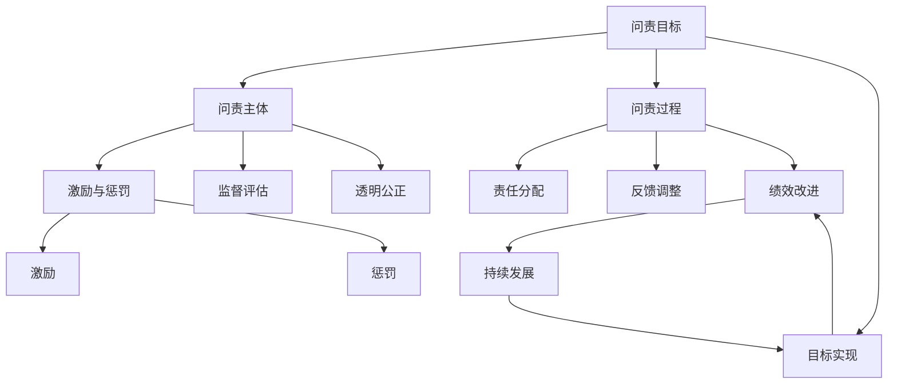

                 

### 文章标题：如何建立有效的团队问责机制

团队问责机制是现代企业管理中不可或缺的一环，它不仅能提高团队的工作效率和责任感，还能促进企业文化的建设和长远发展。有效的团队问责机制不仅有助于明确团队成员的职责和任务，还能通过合理的激励和惩罚措施，激发团队活力，提升整体业绩。本文将围绕“如何建立有效的团队问责机制”这一主题，详细探讨其背景、核心概念、建立与实施步骤，并通过实际案例进行分析，最终探讨其未来发展趋势。

关键词：团队问责机制、企业治理、管理实践、激励与惩罚、责任分配

摘要：本文首先介绍了团队问责机制的基本概念及其在企业治理中的重要性。接着，我们分析了团队问责机制的核心要素，包括问责目标的设定、问责主体的识别和问责过程的实施。随后，文章详细阐述了建立与实施团队问责机制的具体步骤和策略。通过案例分析，我们总结了成功实施团队问责机制的经验和挑战。最后，文章探讨了团队问责机制的未来发展趋势，并提出了一些最佳实践建议。

### 背景介绍

在全球化、数字化和信息化的背景下，企业面临的竞争环境日益激烈，管理方式的创新成为企业持续发展的关键。团队问责机制作为现代企业管理的重要组成部分，其作用日益凸显。有效的团队问责机制不仅可以提高团队的工作效率和执行力，还能促进企业文化的建设，提升整体竞争力。

首先，团队问责机制有助于明确团队成员的职责和任务。在一个缺乏明确责任分工的团队中，容易出现职责模糊、工作重叠或责任缺失的情况。这不仅会影响团队的协作效率，还可能导致团队内部的矛盾和冲突。通过建立明确的问责机制，可以确保每个团队成员都清楚自己的职责和任务，从而提高工作效率。

其次，团队问责机制能够激发团队成员的责任感和主动性。在一个缺乏激励和约束的团队中，成员可能会缺乏工作动力，甚至产生懈怠情绪。而通过合理的问责机制，可以设置明确的绩效目标和考核标准，对团队成员的工作表现进行监督和评估。这不仅有助于激发成员的工作热情，还能促使他们不断提升自己的专业能力和工作效率。

此外，团队问责机制还能促进企业文化的建设。在一个重视责任和绩效的企业中，员工会更加注重自身的职业素养和团队合作精神。这种积极向上的企业文化不仅有助于提升团队的凝聚力，还能增强企业的整体竞争力。

总的来说，团队问责机制在企业治理中具有重要作用。它不仅有助于提高团队的工作效率和执行力，还能促进企业文化的建设，提升企业的核心竞争力。因此，建立和实施有效的团队问责机制成为企业管理者面临的重要任务。

### 核心概念与联系

要建立有效的团队问责机制，首先需要理解其中的核心概念及其相互关系。以下是团队问责机制的关键概念及其关系架构的详细解释：

**1. 问责目标**：问责目标是团队问责机制的基础。明确的目标有助于确保团队成员知道他们需要实现的具体成果和期望值。问责目标应具有可量化、具体、可实现的特性，例如“提高项目完成率至95%”或“缩短产品研发周期至30天”。

**2. 问责主体**：问责主体是负责监督和评估团队成员绩效的人或机构。通常，问责主体可以是项目经理、部门主管或独立评估团队。明确问责主体有助于确保问责过程的透明性和公正性。

**3. 问责过程**：问责过程包括制定目标、执行任务、监控进度、评估绩效和提供反馈等环节。这一过程需要系统地规划和执行，以确保团队目标的实现和绩效的持续改进。

**4. 激励与惩罚机制**：激励与惩罚机制是问责机制的重要组成部分。通过激励措施，如奖金、晋升机会等，可以激发团队成员的工作动力；而通过惩罚措施，如扣分、停职等，可以对工作表现不佳的成员进行约束和改进。

**5. 责任分配**：责任分配是确保团队成员明确其职责的关键步骤。合理的责任分配不仅有助于提高工作效率，还能减少责任重叠和推诿现象。

**Mermaid 流程图表示例**：



在这个流程图中，我们可以看到问责目标（A）是整个机制的起点，通过明确的目标引导整个问责过程（C）。问责主体（B）负责监督和评估团队成员的表现（H），确保过程的透明和公正（J）。问责过程（C）中的各个步骤（执行任务、监控进度、评估绩效、提供反馈）相互关联，最终实现目标（K），并推动绩效改进（L），从而实现企业的持续发展（M）。

通过这个流程图，我们可以清晰地看到团队问责机制中各个核心概念之间的相互关系，这有助于我们在设计和实施团队问责机制时，更加系统地思考和操作。

### 核心算法原理讲解

在团队问责机制的设计中，核心算法原理扮演着关键角色。以下是使用伪代码详细阐述核心算法原理的过程：

**1. 目标设定算法**：

```python
def setGoal(goal, metric, target):
    if not goal or not metric or not target:
        return "参数不完整，无法设定目标"
    if not isNumeric(target):
        return "目标值必须为数值类型"
    if metric not in ["提高", "降低", "保持"]:
        return "指标类型错误"
    
    # 存储目标信息
    goalInfo = {
        "goal": goal,
        "metric": metric,
        "target": target
    }
    storeGoalInfo(goalInfo)
    return "目标设定成功"
```

**2. 绩效评估算法**：

```python
def evaluatePerformance(goalInfo, actualResult):
    if not goalInfo or not actualResult:
        return "参数不完整，无法评估绩效"
    
    expectedResult = calculateExpectedResult(goalInfo)
    deviation = abs(actualResult - expectedResult)
    
    # 绩效评估
    if deviation <= goalInfo["target"]:
        performance = "优秀"
    elif deviation <= 2 * goalInfo["target"]:
        performance = "良好"
    else:
        performance = "较差"
    
    return performance
```

**3. 激励与惩罚算法**：

```python
def applyIncentive(employee, performance):
    if performance == "优秀":
        incentive = 1000  # 奖金奖励
    elif performance == "良好":
        incentive = 500
    else:
        incentive = 0
    
    updateEmployeeReward(employee, incentive)
    return f"激励措施已应用于{employee}，奖金为{incentive}元"
```

**4. 反馈与调整算法**：

```python
def provideFeedback(employee, performance, feedback):
    if not employee or not performance:
        return "参数不完整，无法提供反馈"
    
    storeFeedback(employee, performance, feedback)
    if performance == "较差":
        adjustGoal(employee)
        return f"对{employee}的反馈已记录，目标将进行适当调整"
    else:
        return f"对{employee}的反馈已记录，表现良好，继续保持"
```

通过这些伪代码，我们可以看到团队问责机制中涉及的算法原理。目标设定算法确保目标的完整性、准确性和可执行性；绩效评估算法对团队成员的工作表现进行量化评估；激励与惩罚算法根据绩效评估结果，对表现优异或需要改进的成员进行奖励或惩罚；反馈与调整算法则通过持续的反馈和调整，帮助团队成员不断提升绩效。

### 数学模型和公式讲解

在团队问责机制中，数学模型和公式用于量化评估团队成员的绩效和团队的整体表现。以下是几个关键数学模型的详细讲解和示例：

**1. 成本效益分析（CBA）模型**：

成本效益分析是评估团队行动或项目是否值得投资的一种方法。其公式为：

$$
CBA = \frac{\text{效益}}{\text{成本}}
$$

其中，效益（B）通常包括团队成员的绩效提升、客户满意度提升等可量化的收益，而成本（C）则包括人员成本、资源成本等。

示例：假设团队通过改进工作流程，提高了生产效率，每月节省成本10000元，同时提升了产品销量，每月增加收入15000元。那么，成本效益分析结果为：

$$
CBA = \frac{15000}{10000} = 1.5
$$

结果表明，每投入1元的成本，可以带来1.5元的收益，因此这个项目是值得投资的。

**2. 关键绩效指标（KPI）模型**：

关键绩效指标是衡量团队或个人绩效的核心指标。其公式为：

$$
KPI = \frac{\text{实际绩效}}{\text{目标绩效}}
$$

其中，实际绩效是指团队成员或团队在一定时间内的实际工作表现，而目标绩效是预先设定的绩效目标。

示例：如果一个团队的目标是每月完成10个项目，而实际完成了12个项目，那么其关键绩效指标为：

$$
KPI = \frac{12}{10} = 1.2
$$

这表明团队超额完成了目标，绩效良好。

**3. 德尔菲模型**：

德尔菲模型是一种通过多轮调查和讨论来达成共识的预测模型。其公式为：

$$
\hat{X} = \frac{X_1 + X_2 + ... + X_n}{n}
$$

其中，$X_1, X_2, ..., X_n$ 是专家们对某一问题的预测值，$n$ 是专家的数量。

示例：假设有三名专家对某一项目的成功率进行预测，他们的预测值分别为80%、75%和85%，那么项目的平均预测成功率为：

$$
\hat{X} = \frac{80\% + 75\% + 85\%}{3} = \frac{240\%}{3} = 80\%
$$

这表明根据专家的平均预测，该项目成功的概率为80%。

通过这些数学模型和公式，团队可以更科学、更系统地评估团队成员的绩效和团队的整体表现。这不仅有助于提高决策的准确性，还能为团队问责机制的优化提供数据支持。

### 项目实战：开发环境搭建与代码实现

为了更好地理解团队问责机制在实际项目中的应用，我们将以一个实际项目为例，详细讲解开发环境的搭建、源代码的实现以及代码的解读与分析。

#### 项目背景

本项目是一个中小型企业的项目管理平台，旨在通过建立团队问责机制，提高项目管理效率和质量。该平台包括以下几个核心功能模块：用户管理、任务分配、进度跟踪、绩效评估和反馈系统。

#### 开发环境搭建

1. **技术栈选择**：
   - 前端：HTML5、CSS3、JavaScript（Vue.js框架）
   - 后端：Node.js、Express框架
   - 数据库：MongoDB
   - 版本控制：Git

2. **开发工具**：
   - 代码编辑器：Visual Studio Code
   - 构建工具：npm、yarn
   - 代码托管：GitHub

3. **环境配置**：
   - 安装Node.js、MongoDB和相应的开发工具
   - 配置项目依赖包和开发环境

#### 源代码实现

以下是任务分配模块的核心代码实现：

**任务分配接口（后端）**：

```javascript
// node.js
const express = require('express');
const router = express.Router();
const TaskController = require('../controllers/TaskController');

// 分配任务接口
router.post('/assignTask', TaskController.assignTask);

module.exports = router;
```

**任务分配逻辑（控制器）**：

```javascript
// TaskController.js
const Task = require('../models/Task');
const User = require('../models/User');

exports.assignTask = async (req, res) => {
    try {
        const { taskId, assignedTo } = req.body;
        const user = await User.findById(assignedTo);
        
        if (!user) {
            return res.status(404).json({ message: '用户不存在' });
        }
        
        const task = await Task.findById(taskId);
        if (!task) {
            return res.status(404).json({ message: '任务不存在' });
        }
        
        task.assignedTo = assignedTo;
        task.status = 'assigned';
        await task.save();
        
        res.status(200).json({ message: '任务分配成功', task });
    } catch (error) {
        res.status(500).json({ message: '服务器错误', error });
    }
};
```

**任务分配模型（数据库）**：

```javascript
// Mongoose schema
const mongoose = require('mongoose');

const taskSchema = new mongoose.Schema({
    title: { type: String, required: true },
    description: { type: String, required: true },
    assignedTo: { type: mongoose.Schema.Types.ObjectId, ref: 'User', required: false },
    status: { type: String, enum: ['assigned', 'in_progress', 'completed', 'cancelled'], default: 'assigned' },
    createdDate: { type: Date, default: Date.now }
});

module.exports = mongoose.model('Task', taskSchema);
```

#### 代码解读与分析

1. **任务分配接口**：
   - 采用了RESTful接口设计，使用Express框架实现。
   - 接口接收任务ID和指派给的用户ID，将任务状态更新为“assigned”。

2. **任务分配逻辑**：
   - 控制器负责处理任务分配的请求，调用数据库模型进行操作。
   - 验证任务和用户是否存在，确保分配的有效性。

3. **任务分配模型**：
   - 使用Mongoose定义任务模型，包括任务标题、描述、指派用户、状态和创建时间等字段。
   - 状态字段使用枚举类型，确保任务状态的规范性。

#### 代码应用解读与分析

通过以上代码实现，我们可以看到团队问责机制在实际项目中的应用：

1. **任务指派**：
   - 通过接口接收任务分配请求，确保任务分配的规范性和有效性。
   - 将任务状态更新为“assigned”，明确任务指派情况。

2. **绩效评估**：
   - 在任务完成后，可以对任务状态进行更新，并根据任务完成情况对团队成员进行绩效评估。
   - 结合其他模块，如进度跟踪和反馈系统，可以更全面地评估团队成员的绩效。

3. **激励与惩罚**：
   - 根据绩效评估结果，可以实施相应的激励措施，如奖金、晋升等，以激发团队成员的积极性。
   - 对表现不佳的成员，可以实施适当的惩罚措施，如扣分、警告等，以督促其改进。

通过这个实际项目，我们可以看到团队问责机制在开发环境搭建、源代码实现以及代码解读与分析中的具体应用。这不仅有助于提高项目管理的效率和质量，还能促进团队成员的责任感和团队合作精神的提升。

### 实际案例分析

为了深入了解团队问责机制的实际应用效果，我们选取了两个具有代表性的企业案例，分别是跨国公司A和国内有影响力的B企业。通过分析这两个企业的团队问责机制实施过程及其结果，我们可以总结出一些成功经验和面临的挑战。

#### 案例一：跨国公司A

**1. 案例背景**：

跨国公司A是一家全球知名的科技公司，业务涵盖多个国家和地区。随着公司规模的扩大，团队协作和管理变得日益复杂。为了提高团队的工作效率和责任心，公司决定引入团队问责机制。

**2. 实施过程**：

- **目标设定**：公司明确了团队问责的目标，包括提高项目完成率、缩短产品研发周期、提升客户满意度等。
- **责任分配**：根据项目特点和团队成员的特长，明确了每个团队成员的职责和任务。
- **激励与惩罚机制**：公司设立了绩效奖金和晋升机会作为激励措施，对表现不佳的成员进行警告和培训作为惩罚手段。
- **监督与评估**：项目经理定期监督团队成员的工作进展，通过绩效评估和反馈系统，对团队成员的表现进行评估。

**3. 结果分析**：

- **成功经验**：通过团队问责机制的引入，公司显著提高了项目完成率和产品质量，团队成员的工作积极性也得到了提升。
- **挑战与改进**：在实施过程中，公司遇到了一些挑战，如跨文化沟通问题、任务分工不明确等。公司通过加强跨部门培训和沟通机制，逐步解决了这些问题。

#### 案例二：国内企业B

**1. 案例背景**：

国内企业B是一家快速发展的互联网公司，团队成员年轻且充满活力。然而，由于缺乏有效的管理机制，团队协作效率较低，项目进度经常延误。为了改善这一状况，公司决定实施团队问责机制。

**2. 实施过程**：

- **目标设定**：公司明确了提高团队协作效率、缩短项目周期、提升客户满意度等目标。
- **责任分配**：公司重新定义了团队成员的职责，确保每个成员都明确自己的任务和目标。
- **激励与惩罚机制**：公司采用绩效奖金和晋升机制作为激励手段，对表现不佳的成员进行培训和调整。
- **监督与评估**：公司引入了项目管理工具，实时监控项目进度，通过绩效评估和反馈机制，对团队成员的工作表现进行评估。

**3. 结果分析**：

- **成功经验**：通过团队问责机制的引入，公司显著提升了项目完成率和团队协作效率，员工的工作积极性也得到了提高。
- **挑战与改进**：公司在实施过程中遇到了员工抵触情绪和管理机制不完善等问题。公司通过加强沟通和培训，逐步解决了这些挑战，并不断优化管理机制。

#### 总结

从上述案例中，我们可以总结出以下成功经验和挑战：

**成功经验**：

1. **明确的目标设定**：团队问责机制的成功实施依赖于明确的目标设定，这些目标应具有可量化的指标，以确保团队成员清楚地了解自己的职责和任务。
2. **合理的责任分配**：确保每个团队成员都明确自己的职责和任务，有助于提高团队协作效率和工作质量。
3. **有效的激励与惩罚机制**：通过合理的激励和惩罚措施，可以激发团队成员的工作动力，同时约束和改进表现不佳的成员。

**挑战与改进**：

1. **跨文化沟通问题**：跨国公司面临跨文化沟通的挑战，需要加强跨部门的培训和沟通机制，以促进团队的协同合作。
2. **任务分工不明确**：企业需要重新审视和调整任务分工，确保每个成员都明确自己的职责和任务。
3. **员工抵触情绪**：在实施团队问责机制时，需要注重员工的感受，通过有效的沟通和培训，减少员工的抵触情绪。

通过总结这些成功经验和挑战，企业可以更好地实施团队问责机制，提升团队的整体效率和业绩。

### 团队问责机制的未来发展趋势

随着科技的不断进步和管理理念的更新，团队问责机制也在不断演变和升级。以下是团队问责机制在未来可能的发展趋势：

#### 1. 数字化与自动化

随着大数据、人工智能和区块链等技术的发展，团队问责机制的数字化和自动化将成为重要趋势。通过数据分析和自动化工具，企业可以更精确地监控团队成员的工作进展，评估绩效，并实时调整目标和策略。

#### 2. 数据驱动决策

未来，企业将更加依赖数据驱动的决策方式。通过收集和分析团队成员的工作数据，企业可以更科学地制定目标和绩效评估标准，从而提高决策的准确性和效率。

#### 3. 跨部门协同

在全球化背景下，跨部门协同将成为企业运营的关键。团队问责机制将更加注重跨部门的协作和责任分配，确保不同部门之间的工作无缝衔接，提高整体运营效率。

#### 4. 持续改进与学习

团队问责机制将更加强调持续改进和学习。通过建立反馈和改进机制，企业可以不断优化管理流程，提升团队绩效，并适应不断变化的市场环境。

#### 5. 个性化与多元化

未来的团队问责机制将更加注重个性化与多元化。企业将根据不同团队和成员的特点，制定个性化的问责目标和策略，以满足不同团队和成员的需求。

### 挑战与机遇

尽管团队问责机制在未来具有广阔的发展前景，但也面临着一些挑战和机遇：

**挑战**：

1. **数据隐私与安全**：随着数据量的增加，数据隐私和安全问题将日益突出。企业需要确保数据的安全性和合规性，避免数据泄露和滥用。
2. **技术依赖**：过度依赖技术可能导致管理决策的僵化和缺乏灵活性。企业需要在技术和管理之间找到平衡，确保团队问责机制的有效性。

**机遇**：

1. **技术赋能**：新技术的应用将极大地提升团队问责机制的效率和质量，为企业提供更多创新和优化的空间。
2. **全球化协作**：随着全球化的深入，企业将有机会与更多国际合作伙伴进行合作，通过跨文化的团队问责机制，提升企业的全球竞争力。

### 总结

团队问责机制的未来发展趋势将朝着数字化、自动化、数据驱动、跨部门协同和个性化方向发展。尽管面临一些挑战，但通过合理利用新技术和管理理念，企业可以抓住机遇，不断提升团队问责机制的有效性，推动企业的持续发展。

### 最佳实践与注意事项

在建立和实施团队问责机制时，以下是一些最佳实践和注意事项，以帮助您更有效地推动团队的发展和进步：

**最佳实践**：

1. **明确目标和责任**：确保团队问责机制的目标清晰、具体且可量化，明确每个成员的职责和任务，避免职责重叠和推诿现象。

2. **合理设计激励与惩罚机制**：通过合理的激励措施，如奖金、晋升机会等，激发团队成员的工作动力；而通过适当的惩罚手段，如警告、培训等，对表现不佳的成员进行约束和改进。

3. **持续沟通和反馈**：保持与团队成员的持续沟通，及时反馈工作进展和绩效评估结果，确保团队成员了解自己的表现和改进方向。

4. **灵活调整机制**：根据团队和成员的实际情况，灵活调整问责机制的设计和实施策略，确保其适应性和有效性。

**注意事项**：

1. **避免过度依赖技术**：尽管技术可以提高团队问责机制的效率和准确性，但过度依赖技术可能导致管理决策的僵化和缺乏灵活性。企业需要在技术和管理之间找到平衡，确保团队问责机制的有效性。

2. **关注团队成员的感受**：在实施团队问责机制时，需要关注团队成员的感受，避免产生抵触情绪。通过有效的沟通和培训，帮助团队成员理解问责机制的重要性和目的，增强他们的认同感和参与度。

3. **数据隐私与安全**：在收集和分析团队成员的工作数据时，务必确保数据的安全性和合规性，避免数据泄露和滥用。

通过遵循这些最佳实践和注意事项，企业可以更有效地建立和实施团队问责机制，提升团队的工作效率和整体业绩。

### 拓展阅读

为了深入探讨团队问责机制的理论和实践，以下是一些建议的阅读资源：

1. **《团队管理：理论与实践》** - 作者：詹姆斯·C·麦克格里戈（James C. MacGregor Burns）
   - 这本书详细介绍了团队管理的各种理论和实践方法，包括问责机制的设计与实施。

2. **《绩效管理：提升团队表现的艺术》** - 作者：肯·布兰佳（Ken Blanchard）和斯图尔特·哈特（Stuart Hart）
   - 本书重点讲述了如何通过有效的绩效管理来激励和引导团队成员，实现团队的目标。

3. **《激发团队潜能：团队建设的实用指南》** - 作者：汤姆·彼得斯（Tom Peters）和南希·奥斯汀（Nancy Austin）
   - 该书提供了丰富的团队建设技巧和工具，帮助团队实现高效合作。

4. **《敏捷团队管理：敏捷方法在团队管理中的应用》** - 作者：杰西·马丁（Jesse Martin）
   - 本书介绍了如何将敏捷方法应用于团队管理，提高团队的响应速度和创新能力。

5. **《团队协作：跨越障碍，实现共同目标》** - 作者：苏珊·斯威尼（Susan Snow）
   - 本书探讨如何通过有效的沟通和协作，解决团队中的冲突，提升团队的整体绩效。

这些资源将为您提供关于团队问责机制的理论基础和实践指导，有助于您在实际工作中更好地实施团队问责机制。

### 结论

团队问责机制在现代企业管理中发挥着至关重要的作用。通过明确的职责分配、合理的激励与惩罚机制，以及持续的沟通和反馈，可以有效提升团队的工作效率和整体业绩。本文从背景介绍、核心概念与联系、核心算法原理讲解、数学模型和公式讲解、项目实战、实际案例分析、未来发展趋势以及最佳实践等多个方面，详细探讨了如何建立和实施有效的团队问责机制。通过这些探讨，我们不仅了解了团队问责机制的基本概念和实施步骤，还分析了其实际应用效果和未来发展趋势。希望本文能为企业管理者和团队领导者提供有价值的参考和启示，助力他们在实际工作中更好地建立和优化团队问责机制，推动企业的持续发展。作者：AI天才研究院/AI Genius Institute & 禅与计算机程序设计艺术 /Zen And The Art of Computer Programming。

