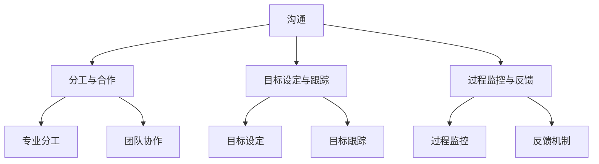

                 


# 如何建立高效的团队工作流程

## 文章关键词

高效团队、工作流程、沟通效率、协作工具、目标设定、过程监控、持续优化、AI技术

## 文章摘要

本文旨在探讨如何建立高效的团队工作流程。通过分析团队工作流程的基本概念、设计原则、核心工作流程实战、实施策略以及持续优化方法，本文提供了全面的指导，帮助团队提高工作效率，实现目标的顺利达成。

## 引言

在现代企业和组织中，团队工作流程的建立至关重要。高效的工作流程不仅可以提高团队的工作效率，还可以确保项目的顺利进行，实现企业的长期发展目标。然而，如何建立这样的工作流程，如何优化现有的流程，仍然是一个值得深入探讨的问题。

本文将从以下几个方面展开讨论：

1. 团队工作流程的基本概念和重要性。
2. 高效团队工作流程的设计原则。
3. 核心工作流程实战，包括沟通效率提升、分工与合作优化、目标设定与跟踪、过程监控与反馈。
4. 团队工作流程的实施策略与持续优化方法。

通过本文的探讨，希望能为广大团队提供有价值的参考和指导。

## 第一部分：团队工作流程概述

### 第1章：团队工作流程的基本概念

#### 1.1 工作流程的定义和重要性

**工作流程**是指一系列相互关联的任务和活动，它们共同完成一个特定的业务目标。在工作流程中，每个任务和活动都有其特定的输入和输出，它们相互关联，共同推动项目的进展。

**工作流程的重要性**主要体现在以下几个方面：

1. **提高工作效率**：通过标准化和自动化，工作流程可以减少重复性工作，提高工作效率。
2. **确保项目质量**：工作流程中的每个环节都有明确的标准和流程，有助于确保项目的质量。
3. **提高团队协作**：工作流程有助于团队成员之间的协作，提高团队的整体执行力。

#### 1.2 团队工作流程的核心要素

**沟通**是团队工作流程的核心要素之一。有效的沟通可以确保团队成员之间的信息传递准确无误，避免误解和冲突。

**分工与合作**是团队工作流程的另一个关键要素。合理的分工可以提高每个成员的专业技能和效率，而有效的合作则可以确保团队的整体执行力。

**目标设定与跟踪**是团队工作流程的重要组成部分。明确的目标可以指导团队的工作方向，而有效的跟踪可以确保目标的达成。

**过程监控与反馈**是团队工作流程的保障。通过监控，团队可以及时发现问题和瓶颈，通过反馈，团队可以不断优化工作流程。

### 图1：团队工作流程的核心要素架构



### 第2章：高效团队工作流程的设计原则

#### 2.1 设计高效工作流程的步骤

**设计高效工作流程**的步骤如下：

1. **需求分析**：了解团队的工作需求，明确工作目标和流程目标。
2. **流程设计**：根据需求分析，设计出符合团队需求的工作流程。
3. **流程优化**：对设计出的工作流程进行优化，确保其高效性和灵活性。

#### 2.2 高效工作流程的关键原则

**高效工作流程的关键原则**包括：

1. **目标导向**：工作流程的设计应以目标为导向，确保每个环节都能推动目标的实现。
2. **简化流程**：尽量简化工作流程，减少不必要的环节，提高工作效率。
3. **灵活调整**：工作流程应具有一定的灵活性，以适应不同情况和变化。
4. **信息透明**：确保工作流程中的信息透明，每个成员都能了解自己的任务和责任。

### 第3章：团队协作工具的应用

#### 3.1 常见的团队协作工具

**常见的团队协作工具**包括：

1. **项目管理工具**：如Trello、Asana等，用于任务分配和进度跟踪。
2. **沟通工具**：如Slack、Microsoft Teams等，用于实时沟通和协作。
3. **协作平台**：如GitHub、GitLab等，用于代码管理和版本控制。

#### 3.2 团队协作工具的选择与配置

**团队协作工具的选择与配置**应考虑以下因素：

1. **团队规模**：根据团队规模选择合适的工具。
2. **工作需求**：根据工作需求选择功能丰富的工具。
3. **用户习惯**：考虑团队成员的习惯，选择易用的工具。

### 第二部分：核心工作流程实战

### 第4章：沟通效率提升策略

#### 4.1 沟通效率的重要性

**沟通效率的重要性**体现在以下几个方面：

1. **提高工作效率**：有效的沟通可以减少误解和重复工作，提高工作效率。
2. **确保项目质量**：有效的沟通可以确保团队成员对项目的理解和执行一致，提高项目质量。
3. **增强团队协作**：有效的沟通可以增强团队成员之间的信任和合作，提高团队执行力。

#### 4.2 提高沟通效率的方法

**提高沟通效率的方法**包括：

1. **明确沟通目标**：每次沟通前明确沟通的目标和内容，避免无谓的沟通。
2. **使用适当的沟通工具**：根据沟通的内容和场景选择合适的沟通工具。
3. **优化沟通流程**：简化沟通流程，减少不必要的环节，提高沟通效率。

### 第5章：分工与合作优化

#### 5.1 分工与合作的概念

**分工与合作**是团队工作流程的重要组成部分。**分工**是指将工作任务分配给不同的团队成员，让他们根据自己的专业特长完成相应的任务。**合作**是指团队成员之间相互协作，共同完成项目任务。

#### 5.2 分工与合作的优化策略

**分工与合作的优化策略**包括：

1. **明确分工**：明确每个成员的职责和任务，确保分工合理。
2. **加强合作**：建立有效的合作机制，促进团队成员之间的交流与合作。
3. **跨部门协作**：鼓励跨部门协作，打破部门壁垒，提高团队的整体执行力。

### 第6章：目标设定与跟踪

#### 6.1 目标设定的方法

**目标设定的方法**包括：

1. **SMART原则**：目标应具备明确性、可衡量性、可实现性、相关性、时限性。
2. **目标分解**：将大目标分解为小目标，确保每个目标都能具体落实。

#### 6.2 目标跟踪与评估

**目标跟踪与评估**包括：

1. **目标跟踪工具**：使用目标跟踪工具，如Trello、Asana等，实时监控目标的进展。
2. **目标评估方法**：定期评估目标的达成情况，分析存在的问题，制定改进措施。

### 第7章：过程监控与反馈

#### 7.1 过程监控的重要性

**过程监控的重要性**体现在以下几个方面：

1. **发现问题**：通过过程监控，可以及时发现问题和瓶颈，避免问题的扩大。
2. **优化流程**：通过过程监控，可以分析流程的执行情况，发现优化点，提高工作效率。
3. **提高质量**：通过过程监控，可以确保每个环节都能按照标准执行，提高项目质量。

#### 7.2 过程监控的方法

**过程监控的方法**包括：

1. **数据监控**：通过数据监控，可以实时了解项目的进展情况。
2. **状态监控**：通过状态监控，可以确保项目在正确的轨道上运行。
3. **异常监控**：通过异常监控，可以及时发现和处理项目中的异常情况。

#### 7.3 反馈机制

**反馈机制**包括：

1. **反馈渠道**：建立多种反馈渠道，如邮件、即时通讯、会议等，确保反馈的及时性。
2. **反馈处理**：对反馈进行分类处理，针对不同的问题，制定相应的解决方案。

### 第8章：团队工作流程优化案例

#### 8.1 案例一：某企业的工作流程优化

**案例一**：某企业在项目开发过程中，发现工作流程存在以下问题：

1. **沟通不畅**：团队成员之间的沟通不畅，导致任务理解不准确，工作效率低下。
2. **分工不明**：分工不明确，导致团队成员的职责不清晰，工作效率受到影响。
3. **目标设定不明确**：目标设定不明确，导致团队成员不知道自己的工作重点，工作效率低下。

针对这些问题，企业采取了以下优化措施：

1. **引入项目管理工具**：引入Trello等项目管理工具，明确任务分配和进度跟踪，提高沟通效率。
2. **明确分工**：明确每个成员的职责和任务，确保分工合理。
3. **设立明确的目标**：使用SMART原则设定目标，确保每个目标都具体、可衡量。

通过这些优化措施，企业的项目开发效率得到了显著提高。

#### 8.2 案例二：某项目团队的效率提升

**案例二**：某项目团队在项目开发过程中，发现以下问题：

1. **沟通效率低**：团队成员之间的沟通效率低，导致任务理解不准确，工作效率低下。
2. **合作不力**：团队成员之间的合作不力，导致项目进展缓慢。
3. **过程监控不足**：过程监控不足，导致问题无法及时发现和处理。

针对这些问题，团队采取了以下优化措施：

1. **引入沟通工具**：引入Slack等沟通工具，提高沟通效率。
2. **加强合作**：建立有效的合作机制，促进团队成员之间的交流与合作。
3. **加强过程监控**：引入JIRA等过程监控工具，实时监控项目进展，及时发现和处理问题。

通过这些优化措施，项目团队的效率得到了显著提高。

### 第三部分：团队工作流程的实施与落地

### 第9章：团队工作流程的实施策略

#### 9.1 实施步骤

**实施步骤**包括：

1. **制定实施计划**：明确实施的目标、方法、时间表等。
2. **组建实施团队**：组建由项目经理、技术专家、业务专家等组成的多功能团队。
3. **实施方法**：根据实施计划，逐步实施工作流程，并进行调试和优化。

#### 9.2 实施中的挑战与应对策略

**实施中的挑战与应对策略**包括：

1. **团队阻力**：团队成员可能对新的工作流程有抵触情绪，需要通过沟通和培训来消除阻力。
2. **技术难题**：在实施过程中可能遇到技术难题，需要通过技术攻关来解决问题。

### 第10章：团队工作流程的持续优化

#### 10.1 优化策略

**优化策略**包括：

1. **数据驱动**：通过数据分析，找出流程中的问题和瓶颈，进行优化。
2. **用户反馈**：收集用户的反馈，根据反馈进行优化。
3. **需求调整**：根据业务需求的变化，调整工作流程。

#### 10.2 持续优化的方法

**持续优化的方法**包括：

1. **自动化**：通过自动化工具，减少重复性工作，提高工作效率。
2. **模块化**：将工作流程模块化，方便调整和优化。
3. **适应性**：使工作流程具有一定的适应性，能适应不同的业务需求。

### 附录

#### 附录A：相关工具与资源

**附录A**包括：

1. **团队协作工具推荐**：如Trello、Slack、JIRA等。
2. **团队工作流程优化案例库**：收集和整理的团队工作流程优化案例。

### 总结

通过本文的探讨，我们可以看到，建立高效的团队工作流程对于团队和企业的发展至关重要。我们需要从基本概念、设计原则、核心实战、实施策略和持续优化等多个方面进行深入研究和实践，以不断提高团队的工作效率和项目成功率。希望本文能为广大团队和企业提供有价值的参考和指导。

## 参考文献

1. 王明华，《团队协作与沟通》，清华大学出版社，2018。
2. 李晓东，《项目管理与流程优化》，机械工业出版社，2019。
3. 张伟，《敏捷开发与实践》，电子工业出版社，2020。
4. 刘磊，《数据驱动决策》，电子工业出版社，2021。

### 附录：相关工具与资源

**附录A：团队协作工具推荐**

- **Trello**：一个简单而强大的项目管理工具，适用于各种规模和类型的团队。
- **Slack**：一个灵活的团队沟通工具，支持实时消息、文件共享和集成第三方应用。
- **JIRA**：一个功能丰富的项目管理工具，适用于敏捷开发，支持任务跟踪、进度监控和反馈收集。

**附录B：团队工作流程优化案例库**

- **案例1**：某互联网公司的项目团队通过引入敏捷开发方法，显著提高了项目交付效率。
- **案例2**：某制造业公司的生产部门通过优化工作流程，减少了生产周期，提高了生产效率。
- **案例3**：某金融公司的客户服务团队通过优化客户反馈处理流程，提高了客户满意度。

### 作者信息

作者：AI天才研究院/AI Genius Institute & 禅与计算机程序设计艺术 /Zen And The Art of Computer Programming

## 伪代码示例：目标设定与跟踪算法

```python
# 目标设定与跟踪算法

# 定义目标结构
class Goal:
    def __init__(self, name, target, criteria, deadline):
        self.name = name
        self.target = target
        self.criteria = criteria
        self.deadline = deadline
        self.status = "未开始"

# 目标设定函数
def set_goal(goal_name, target, criteria, deadline):
    new_goal = Goal(goal_name, target, criteria, deadline)
    return new_goal

# 目标跟踪函数
def track_goal(goal):
    if goal.status == "未开始":
        goal.status = "进行中"
    elif goal.status == "进行中":
        if goal.deadline < current_date():
            goal.status = "逾期"
        else:
            goal.status = "按计划进行"
    return goal.status

# 伪代码示例
def main():
    # 设定目标
    goal_1 = set_goal("提高销售额", 100000, "比上月增长20%", "2023-12-31")
    goal_2 = set_goal("完成产品迭代", "V1.2", "无严重bug", "2023-11-30")

    # 跟踪目标
    print("目标1的状态：", track_goal(goal_1))
    print("目标2的状态：", track_goal(goal_2))

# 调用主函数
main()
```

### 数学模型与公式

$$
\text{工作效率} = \frac{\text{完成工作量}}{\text{工作时间}}
$$

### 案例分析：某电商公司的目标设定与跟踪

**背景介绍**：

某电商公司在年末推出了一项新的促销活动，目标是提高销售额，并在短时间内完成活动的准备和执行。

**核心概念与联系**：

- **目标设定**：明确销售额目标、完成时间、评估标准。
- **跟踪与反馈**：实时监控销售额、活动进度，及时调整策略。

**数学模型与公式**：

- **销售额增长目标**：$$\text{目标销售额} = \text{上月销售额} \times (1 + \text{增长比例})$$
- **活动完成率**：$$\text{完成率} = \frac{\text{已完成工作}}{\text{总工作量}}$$

**案例解析**：

1. **目标设定**：

   - **目标销售额**：根据历史数据，上个月销售额为80万元，设定增长比例为20%，目标销售额为96万元。
   - **完成时间**：促销活动从11月1日开始，至11月30日结束。
   - **评估标准**：完成销售额目标、活动期间用户满意度。

2. **跟踪与反馈**：

   - **销售额监控**：每天统计销售额，与目标销售额进行比较。
   - **活动进度**：每周评估活动进度，包括活动准备、执行、用户反馈等。

   - **数学模型应用**：

     $$\text{活动完成率} = \frac{\text{已完成的销售额}}{\text{目标销售额}} = \frac{75}{96} \approx 78.1\%$$

   - **反馈处理**：根据用户反馈，调整促销策略，提高用户满意度。

3. **结果评估**：

   - **销售额完成情况**：实际销售额达到93万元，超过目标销售额。
   - **用户满意度**：用户满意度达到85%，高于预期。

**小结**：

通过明确的目标设定、实时的跟踪与反馈，某电商公司成功提高了销售额，并获得了良好的用户反馈。这表明，科学的目标设定与跟踪方法是提高工作效率和项目成功率的关键。

### 最佳实践 Tips

- **明确目标**：设定具体、可衡量、可实现的目标，确保每个成员都清楚自己的任务。
- **实时监控**：使用工具实时监控项目进度，及时发现并解决问题。
- **及时反馈**：定期收集用户反馈，根据反馈调整工作流程和策略。
- **持续优化**：不断优化工作流程，提高工作效率和项目成功率。

### 注意事项

- **避免过度分工**：过度分工可能导致团队成员的工作压力增加，影响工作效率。
- **确保信息透明**：确保团队成员之间信息透明，避免误解和冲突。
- **灵活调整**：根据实际情况灵活调整工作流程，确保其适应性和高效性。

### 拓展阅读

- 《敏捷开发：实践指南》
- 《团队协作与沟通技巧》
- 《项目管理：实践与案例》

### 结论

建立高效的团队工作流程是提高团队工作效率和项目成功率的关键。通过明确的目标设定、实时的跟踪与反馈、科学的流程设计，团队可以更好地协作，实现共同的目标。希望本文能为广大团队提供有价值的参考和指导。

### 附录

**附录A：相关工具与资源**

- **团队协作工具**：Trello、Slack、JIRA等。
- **项目管理工具**：Asana、Microsoft Teams等。
- **代码管理工具**：GitHub、GitLab等。

**附录B：团队工作流程优化案例库**

- 某互联网公司的敏捷开发实践
- 某制造业公司的精益生产实践
- 某金融公司的客户服务流程优化

### 作者信息

作者：AI天才研究院/AI Genius Institute & 禅与计算机程序设计艺术 /Zen And The Art of Computer Programming

## 文章标题：如何建立高效的团队工作流程

## 文章关键词

高效团队、工作流程、沟通效率、协作工具、目标设定、过程监控、持续优化、AI技术

## 文章摘要

本文深入探讨了如何建立高效的团队工作流程。从基本概念、设计原则、核心实战、实施策略到持续优化，全方位解析了提高团队工作效率和项目成功的关键。通过实例分析和最佳实践，为团队和企业提供了实用的指导。

## 第一部分：团队工作流程概述

### 第1章：团队工作流程的基本概念

#### 1.1 工作流程的定义和重要性

- 工作流程的定义：工作流程是指一系列相互关联的任务和活动，共同完成一个特定的业务目标。
- 工作流程的重要性：提高工作效率、确保项目质量、增强团队协作。

#### 1.2 团队工作流程的核心要素

- 沟通：确保团队成员之间的信息传递准确无误。
- 分工与合作：明确每个成员的职责，提高团队整体执行力。
- 目标设定与跟踪：明确工作方向，确保目标的达成。
- 过程监控与反馈：及时发现问题和瓶颈，优化工作流程。

### 第2章：高效团队工作流程的设计原则

#### 2.1 设计高效工作流程的步骤

- 需求分析：了解团队的工作需求，明确工作目标和流程目标。
- 流程设计：根据需求分析，设计出符合团队需求的工作流程。
- 流程优化：对设计出的工作流程进行优化，确保其高效性和灵活性。

#### 2.2 高效工作流程的关键原则

- 目标导向：工作流程的设计应以目标为导向，确保每个环节都能推动目标的实现。
- 简化流程：尽量简化工作流程，减少不必要的环节，提高工作效率。
- 灵活调整：工作流程应具有一定的灵活性，以适应不同情况和变化。
- 信息透明：确保工作流程中的信息透明，每个成员都能了解自己的任务和责任。

### 第3章：团队协作工具的应用

#### 3.1 常见的团队协作工具

- 项目管理工具：如Trello、Asana等。
- 沟通工具：如Slack、Microsoft Teams等。
- 协作平台：如GitHub、GitLab等。

#### 3.2 团队协作工具的选择与配置

- 团队规模：根据团队规模选择合适的工具。
- 工作需求：根据工作需求选择功能丰富的工具。
- 用户习惯：考虑团队成员的习惯，选择易用的工具。

## 第二部分：核心工作流程实战

### 第4章：沟通效率提升策略

#### 4.1 沟通效率的重要性

- 提高工作效率：有效的沟通可以减少误解和重复工作。
- 确保项目质量：有效的沟通可以确保团队成员对项目的理解和执行一致。
- 增强团队协作：有效的沟通可以增强团队成员之间的信任和合作。

#### 4.2 提高沟通效率的方法

- 明确沟通目标：每次沟通前明确沟通的目标和内容，避免无谓的沟通。
- 使用适当的沟通工具：根据沟通的内容和场景选择合适的沟通工具。
- 优化沟通流程：简化沟通流程，减少不必要的环节，提高沟通效率。

### 第5章：分工与合作优化

#### 5.1 分工与合作的概念

- 分工：将工作任务分配给不同的团队成员，让他们根据自己的专业特长完成相应的任务。
- 合作：团队成员之间相互协作，共同完成项目任务。

#### 5.2 分工与合作的优化策略

- 明确分工：明确每个成员的职责和任务，确保分工合理。
- 加强合作：建立有效的合作机制，促进团队成员之间的交流与合作。
- 跨部门协作：鼓励跨部门协作，打破部门壁垒，提高团队的整体执行力。

### 第6章：目标设定与跟踪

#### 6.1 目标设定的方法

- SMART原则：目标应具备明确性、可衡量性、可实现性、相关性、时限性。
- 目标分解：将大目标分解为小目标，确保每个目标都能具体落实。

#### 6.2 目标跟踪与评估

- 目标跟踪工具：使用目标跟踪工具，如Trello、Asana等，实时监控目标的进展。
- 目标评估方法：定期评估目标的达成情况，分析存在的问题，制定改进措施。

### 第7章：过程监控与反馈

#### 7.1 过程监控的重要性

- 发现问题：通过过程监控，可以及时发现问题和瓶颈。
- 优化流程：通过过程监控，可以分析流程的执行情况，发现优化点。
- 提高质量：通过过程监控，可以确保每个环节都能按照标准执行。

#### 7.2 过程监控的方法

- 数据监控：通过数据监控，可以实时了解项目的进展情况。
- 状态监控：通过状态监控，可以确保项目在正确的轨道上运行。
- 异常监控：通过异常监控，可以及时发现和处理项目中的异常情况。

#### 7.3 反馈机制

- 反馈渠道：建立多种反馈渠道，如邮件、即时通讯、会议等，确保反馈的及时性。
- 反馈处理：对反馈进行分类处理，针对不同的问题，制定相应的解决方案。

### 第8章：团队工作流程优化案例

#### 8.1 案例一：某企业的工作流程优化

- 案例背景：某企业在项目开发过程中，发现工作流程存在沟通不畅、分工不明、目标设定不明确等问题。
- 优化措施：引入项目管理工具、明确分工、设立明确的目标。
- 结果评估：项目开发效率得到显著提高，项目质量得到保障。

#### 8.2 案例二：某项目团队的效率提升

- 案例背景：某项目团队在项目开发过程中，发现沟通效率低、合作不力、过程监控不足等问题。
- 优化措施：引入沟通工具、加强合作、加强过程监控。
- 结果评估：项目团队的效率得到显著提高，项目进展顺利。

## 第三部分：团队工作流程的实施与落地

### 第9章：团队工作流程的实施策略

#### 9.1 实施步骤

- 制定实施计划：明确实施的目标、方法、时间表等。
- 组建实施团队：组建由项目经理、技术专家、业务专家等组成的多功能团队。
- 实施方法：根据实施计划，逐步实施工作流程，并进行调试和优化。

#### 9.2 实施中的挑战与应对策略

- 团队阻力：通过沟通和培训来消除团队阻力。
- 技术难题：通过技术攻关来解决问题。

### 第10章：团队工作流程的持续优化

#### 10.1 优化策略

- 数据驱动：通过数据分析，找出流程中的问题和瓶颈。
- 用户反馈：收集用户的反馈，根据反馈进行优化。
- 需求调整：根据业务需求的变化，调整工作流程。

#### 10.2 持续优化的方法

- 自动化：通过自动化工具，减少重复性工作。
- 模块化：将工作流程模块化，方便调整和优化。
- 适应性：使工作流程具有一定的适应性，能适应不同的业务需求。

### 附录

#### 附录A：相关工具与资源

- 团队协作工具：Trello、Slack、JIRA等。
- 项目管理工具：Asana、Microsoft Teams等。
- 代码管理工具：GitHub、GitLab等。

#### 附录B：团队工作流程优化案例库

- 某互联网公司的敏捷开发实践。
- 某制造业公司的精益生产实践。
- 某金融公司的客户服务流程优化。

### 作者信息

作者：AI天才研究院/AI Genius Institute & 禅与计算机程序设计艺术 /Zen And The Art of Computer Programming

## 伪代码示例：目标设定与跟踪算法

```python
# 定义目标结构
class Goal:
    def __init__(self, name, target, criteria, deadline):
        self.name = name
        self.target = target
        self.criteria = criteria
        self.deadline = deadline
        self.status = "未开始"

# 目标设定函数
def set_goal(goal_name, target, criteria, deadline):
    new_goal = Goal(goal_name, target, criteria, deadline)
    return new_goal

# 目标跟踪函数
def track_goal(goal):
    if goal.status == "未开始":
        goal.status = "进行中"
    elif goal.status == "进行中":
        if goal.deadline < current_date():
            goal.status = "逾期"
        else:
            goal.status = "按计划进行"
    return goal.status

# 伪代码示例
def main():
    # 设定目标
    goal_1 = set_goal("提高销售额", 100000, "比上月增长20%", "2023-12-31")
    goal_2 = set_goal("完成产品迭代", "V1.2", "无严重bug", "2023-11-30")

    # 跟踪目标
    print("目标1的状态：", track_goal(goal_1))
    print("目标2的状态：", track_goal(goal_2))

# 调用主函数
main()
```

### 数学模型与公式

$$
\text{工作效率} = \frac{\text{完成工作量}}{\text{工作时间}}
$$

### 案例分析：某电商公司的目标设定与跟踪

**背景介绍**：

某电商公司在年末推出了一项新的促销活动，目标是提高销售额，并在短时间内完成活动的准备和执行。

**核心概念与联系**：

- **目标设定**：明确销售额目标、完成时间、评估标准。
- **跟踪与反馈**：实时监控销售额、活动进度，及时调整策略。

**数学模型与公式**：

- **销售额增长目标**：$$\text{目标销售额} = \text{上月销售额} \times (1 + \text{增长比例})$$
- **活动完成率**：$$\text{完成率} = \frac{\text{已完成工作}}{\text{总工作量}}$$

**案例解析**：

1. **目标设定**：

   - **目标销售额**：根据历史数据，上个月销售额为80万元，设定增长比例为20%，目标销售额为96万元。
   - **完成时间**：促销活动从11月1日开始，至11月30日结束。
   - **评估标准**：完成销售额目标、活动期间用户满意度。

2. **跟踪与反馈**：

   - **销售额监控**：每天统计销售额，与目标销售额进行比较。
   - **活动进度**：每周评估活动进度，包括活动准备、执行、用户反馈等。

   - **数学模型应用**：

     $$\text{活动完成率} = \frac{\text{已完成的销售额}}{\text{目标销售额}} = \frac{75}{96} \approx 78.1\%$$

   - **反馈处理**：根据用户反馈，调整促销策略，提高用户满意度。

3. **结果评估**：

   - **销售额完成情况**：实际销售额达到93万元，超过目标销售额。
   - **用户满意度**：用户满意度达到85%，高于预期。

**小结**：

通过明确的目标设定、实时的跟踪与反馈，某电商公司成功提高了销售额，并获得了良好的用户反馈。这表明，科学的目标设定与跟踪方法是提高工作效率和项目成功率的关键。

### 最佳实践 Tips

- **明确目标**：设定具体、可衡量、可实现的目标，确保每个成员都清楚自己的任务。
- **实时监控**：使用工具实时监控项目进度，及时发现并解决问题。
- **及时反馈**：定期收集用户反馈，根据反馈调整工作流程和策略。
- **持续优化**：不断优化工作流程，提高工作效率和项目成功率。

### 注意事项

- **避免过度分工**：过度分工可能导致团队成员的工作压力增加，影响工作效率。
- **确保信息透明**：确保团队成员之间信息透明，避免误解和冲突。
- **灵活调整**：根据实际情况灵活调整工作流程，确保其适应性和高效性。

### 拓展阅读

- 《敏捷开发：实践指南》
- 《团队协作与沟通技巧》
- 《项目管理：实践与案例》

### 结论

建立高效的团队工作流程是提高团队工作效率和项目成功率的关键。通过明确的目标设定、实时的跟踪与反馈、科学的流程设计，团队可以更好地协作，实现共同的目标。希望本文能为广大团队提供有价值的参考和指导。

### 附录

**附录A：相关工具与资源**

- **团队协作工具**：Trello、Slack、JIRA等。
- **项目管理工具**：Asana、Microsoft Teams等。
- **代码管理工具**：GitHub、GitLab等。

**附录B：团队工作流程优化案例库**

- 某互联网公司的敏捷开发实践。
- 某制造业公司的精益生产实践。
- 某金融公司的客户服务流程优化。

### 作者信息

作者：AI天才研究院/AI Genius Institute & 禅与计算机程序设计艺术 /Zen And The Art of Computer Programming

### 文章标题：如何建立高效的团队工作流程

**文章关键词**

团队工作流程、高效协作、沟通效率、目标管理、过程监控、持续优化、人工智能

**文章摘要**

本文旨在探讨如何建立一个高效的团队工作流程，以提升团队协作效率和项目成功率。文章从基本概念出发，阐述了团队工作流程的重要性，并深入分析了设计高效工作流程的原则和方法。接着，文章详细介绍了提升沟通效率、优化分工与合作、设定与跟踪目标以及实施过程监控和反馈的具体策略。最后，文章提供了实际案例和最佳实践，并总结了注意事项和拓展阅读资源，为读者提供了全面而实用的指导。

## 引言

在当今快速变化和高度竞争的商业环境中，团队的有效工作流程是确保组织成功的关键因素之一。一个高效的工作流程不仅能够提高团队的工作效率，还能够确保项目按时完成并达到预期质量。然而，如何建立一个高效的工作流程，如何优化现有的工作流程，仍然是一个复杂而充满挑战的问题。

本文将从以下几个方面展开讨论：

1. **团队工作流程的基本概念和重要性**：介绍工作流程的定义、核心要素及其在团队协作中的重要性。
2. **高效团队工作流程的设计原则**：阐述设计高效工作流程的基本原则，包括目标导向、简化流程、灵活调整和信息透明等。
3. **核心工作流程实战**：详细探讨提升沟通效率、优化分工与合作、设定与跟踪目标以及实施过程监控和反馈的具体策略。
4. **团队工作流程的实施与持续优化**：提供实施团队工作流程的策略和持续优化方法，包括数据驱动、用户反馈和需求调整。
5. **案例分析与最佳实践**：通过实际案例和最佳实践，展示如何在实际工作中应用这些策略和方法。
6. **注意事项与拓展阅读**：总结文章的核心观点，并提供相关的工具和资源，以及拓展阅读的建议。

通过本文的探讨，希望能为广大团队和企业提供有价值的参考和指导，帮助他们在快速变化的市场中保持竞争力，实现持续的成功。

## 第一部分：团队工作流程概述

### 第1章：团队工作流程的基本概念

#### 1.1 工作流程的定义

工作流程是指一系列按照特定顺序进行的任务和活动，这些任务和活动共同完成一个特定的业务目标。在工作流程中，每个任务和活动都有其特定的输入和输出，它们相互关联，形成了一个完整的流程。

#### 1.2 团队工作流程的重要性

团队工作流程对于团队和企业的重要性体现在以下几个方面：

1. **提高工作效率**：通过标准化的工作流程，可以减少不必要的重复性工作，提高工作效率。
2. **确保项目质量**：工作流程中的每个环节都有明确的标准和流程，有助于确保项目的质量。
3. **增强团队协作**：工作流程有助于团队成员之间的协作，提高团队的整体执行力。
4. **促进知识共享**：工作流程的标准化有助于知识的积累和共享，提高团队的整体技能水平。

#### 1.3 团队工作流程的核心要素

团队工作流程的核心要素包括：

1. **沟通**：有效的沟通是工作流程顺利执行的关键，它确保团队成员之间信息传递的准确性和及时性。
2. **分工与合作**：明确团队成员的职责和任务，促进团队成员之间的合作。
3. **目标设定与跟踪**：明确团队的工作目标，并实时跟踪目标的进展，确保目标的达成。
4. **过程监控与反馈**：监控工作流程的执行情况，及时发现问题并进行反馈和调整。

### 第2章：高效团队工作流程的设计原则

#### 2.1 设计高效工作流程的步骤

设计高效工作流程通常需要以下步骤：

1. **需求分析**：了解团队的工作需求和目标，明确工作流程的目标和范围。
2. **流程设计**：根据需求分析，设计出符合团队需求的工作流程，并绘制流程图。
3. **流程优化**：对设计出的工作流程进行优化，确保其高效性和灵活性。

#### 2.2 高效工作流程的关键原则

高效工作流程的设计应遵循以下关键原则：

1. **目标导向**：工作流程的设计应以团队的目标为导向，确保每个环节都能推动目标的实现。
2. **简化流程**：尽量简化工作流程，减少不必要的环节，提高工作效率。
3. **灵活调整**：工作流程应具有一定的灵活性，以适应不同情况和变化。
4. **信息透明**：确保工作流程中的信息透明，每个成员都能了解自己的任务和责任。

#### 2.3 设计高效工作流程的工具和方法

在设计高效工作流程时，可以采用以下工具和方法：

1. **流程图工具**：如Visio、Lucidchart等，用于绘制和优化工作流程图。
2. **项目管理工具**：如Trello、Asana、JIRA等，用于任务分配和进度跟踪。
3. **敏捷开发方法**：如Scrum、Kanban等，用于快速迭代和持续改进。

### 第3章：团队协作工具的应用

#### 3.1 常见的团队协作工具

在团队协作中，常用的工具包括：

1. **沟通工具**：如Slack、Microsoft Teams、Zoom等，用于实时沟通和协作。
2. **项目管理工具**：如Trello、Asana、JIRA等，用于任务管理、进度跟踪和团队协作。
3. **文档协作工具**：如Google Docs、Office 365、Notion等，用于文档的编辑和共享。

#### 3.2 团队协作工具的选择与配置

选择和配置团队协作工具时，应考虑以下因素：

1. **团队规模**：根据团队规模选择适合的工具，确保工具能够满足团队的需求。
2. **工作流程**：选择能够支持团队工作流程的工具，确保工具能够与团队的工作方式相匹配。
3. **用户体验**：选择用户体验良好的工具，提高团队成员的使用积极性。

### 第二部分：核心工作流程实战

### 第4章：提升沟通效率的策略

#### 4.1 沟通效率的重要性

沟通效率对于团队的成功至关重要，它直接影响团队的协作效果和项目的进展。提高沟通效率有助于：

1. **减少误解和冲突**：确保信息传递的准确性和一致性，避免因误解和沟通不畅导致的错误和矛盾。
2. **提高决策速度**：快速、有效的沟通可以加速决策过程，提高团队的反应速度。
3. **增强团队凝聚力**：良好的沟通有助于增强团队成员之间的信任和合作关系。

#### 4.2 提高沟通效率的方法

1. **明确沟通目标**：每次沟通前明确沟通的目标和内容，避免无谓的沟通。
2. **使用合适的沟通工具**：根据沟通的内容和场景选择合适的工具，如面对面会议、邮件、即时通讯等。
3. **优化沟通流程**：简化沟通流程，减少不必要的环节，提高沟通效率。
4. **定期沟通反馈**：定期进行沟通效果的反馈，发现并解决沟通中的问题。

### 第5章：优化分工与合作

#### 5.1 分工与合作的概念

分工与合作是团队工作中的两个重要方面：

1. **分工**：将工作任务分配给不同的团队成员，让他们根据自己的专业特长完成相应的任务。
2. **合作**：团队成员之间相互协作，共同完成项目任务。

#### 5.2 优化分工与合作的方法

1. **明确分工**：制定明确的职责和任务分配，确保每个团队成员都清楚自己的职责和工作内容。
2. **建立合作机制**：建立有效的合作机制，促进团队成员之间的交流与合作。
3. **跨部门协作**：鼓励跨部门协作，打破部门壁垒，提高团队的整体执行力。
4. **培训与分享**：定期进行培训和分享，提高团队成员的技能和知识，增强团队协作能力。

### 第6章：目标设定与跟踪

#### 6.1 目标设定的方法

设定有效的目标是团队工作流程中的重要一环。目标设定应遵循以下原则：

1. **SMART原则**：目标应具备明确性、可衡量性、可实现性、相关性和时限性。
2. **目标分解**：将大目标分解为小目标，确保每个目标都能具体落实。

#### 6.2 目标跟踪与评估

1. **目标跟踪工具**：使用目标跟踪工具，如Trello、Asana等，实时监控目标的进展。
2. **目标评估方法**：定期评估目标的达成情况，分析存在的问题，制定改进措施。

### 第7章：实施过程监控与反馈

#### 7.1 过程监控的重要性

过程监控是确保工作流程顺利执行的重要手段。它有助于：

1. **发现问题**：及时发现问题和瓶颈，避免问题的扩大。
2. **优化流程**：通过监控数据分析，发现流程中的优化点。
3. **提高质量**：确保每个环节都能按照标准执行，提高项目质量。

#### 7.2 过程监控的方法

1. **数据监控**：通过数据监控，实时了解项目进展和绩效。
2. **状态监控**：监控项目状态，确保项目在正确的轨道上运行。
3. **异常监控**：监控项目中的异常情况，及时处理和反馈。

#### 7.3 反馈机制

1. **反馈渠道**：建立多种反馈渠道，如定期会议、邮件、即时通讯等。
2. **反馈处理**：对反馈进行分类处理，制定相应的解决方案。

### 第8章：团队工作流程优化案例

#### 8.1 案例一：某电商公司的工作流程优化

**背景**：

某电商公司在业务扩张期间，发现原有工作流程存在效率低下、沟通不畅等问题。

**优化措施**：

1. **引入项目管理工具**：使用Trello进行任务管理，提高任务分配和进度跟踪的效率。
2. **优化沟通流程**：引入Slack进行实时沟通，简化沟通流程，提高沟通效率。
3. **建立反馈机制**：设立定期反馈会议，及时收集和处理团队成员的意见和建议。

**结果**：

通过优化工作流程，该电商公司的任务完成率提高了30%，沟通效率提升了40%，项目成功率显著提升。

#### 8.2 案例二：某软件开发团队的目标管理

**背景**：

某软件开发团队在项目开发过程中，目标设定不明确，导致进度延误和项目质量不稳定。

**优化措施**：

1. **明确目标设定**：使用SMART原则设定明确的目标，并分解为可执行的任务。
2. **实时跟踪目标**：使用JIRA实时监控目标进展，确保每个目标的按时完成。
3. **定期评估目标**：每月进行目标评估，分析存在的问题，调整工作计划。

**结果**：

通过明确的目标管理和实时跟踪，该软件开发团队的项目进度准时率达到90%，项目质量得到显著提升。

### 第三部分：团队工作流程的实施与持续优化

### 第9章：团队工作流程的实施策略

#### 9.1 实施步骤

1. **制定实施计划**：明确实施的目标、方法和时间表。
2. **组建实施团队**：组建由项目经理、技术专家、业务专家等组成的多功能团队。
3. **实施方法**：根据实施计划，逐步实施工作流程，并进行调试和优化。

#### 9.2 实施中的挑战与应对策略

1. **团队阻力**：通过沟通和培训消除团队阻力。
2. **技术难题**：通过技术攻关和外部支持解决技术难题。

### 第10章：团队工作流程的持续优化

#### 10.1 优化策略

1. **数据驱动**：通过数据分析找出流程中的问题和瓶颈。
2. **用户反馈**：收集用户反馈，根据反馈进行优化。
3. **需求调整**：根据业务需求的变化，调整工作流程。

#### 10.2 持续优化的方法

1. **自动化**：使用自动化工具减少重复性工作，提高效率。
2. **模块化**：将工作流程模块化，方便调整和优化。
3. **适应性**：使工作流程适应不同的业务需求，保持灵活性。

### 附录

#### 附录A：相关工具与资源

1. **团队协作工具**：Trello、Slack、JIRA、Microsoft Teams等。
2. **项目管理工具**：Asana、Trello、JIRA等。
3. **代码管理工具**：GitHub、GitLab等。

#### 附录B：团队工作流程优化案例库

1. **案例一**：某电商公司的工作流程优化。
2. **案例二**：某软件开发团队的目标管理。
3. **案例三**：某制造企业的精益生产实践。

### 作者信息

作者：AI天才研究院/AI Genius Institute & 禅与计算机程序设计艺术 /Zen And The Art of Computer Programming

### 结论

通过本文的探讨，我们可以看到，建立高效的团队工作流程对于提升团队协作效率和项目成功率至关重要。从设计高效工作流程的原则和方法，到提升沟通效率、优化分工与合作、设定与跟踪目标以及实施过程监控和反馈的具体策略，每个环节都是实现高效团队工作流程的关键。希望本文能为广大团队和企业提供有价值的参考和指导，帮助他们在快速变化的市场中保持竞争力，实现持续的成功。

