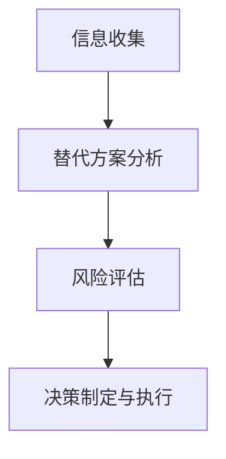

                 

当然可以。在撰写《如何提升团队的决策质量和速度》一文时，我们将按照以下步骤进行：

### 第一步：文章标题和关键词

**文章标题：** 如何提升团队的决策质量和速度

**关键词：** 团队决策、决策质量、决策速度、决策心理学、数据分析、决策策略

### 第二步：文章摘要

摘要：本文从团队决策的背景和挑战出发，探讨了提升决策质量和速度的关键因素。通过分析决策心理学、数据驱动的决策策略以及技术工具的应用，本文提供了一套系统的解决方案，旨在帮助团队做出更明智、更高效的决策。

### 第三步：引言

**引言一：为什么提升决策质量和速度至关重要**

- 在现代企业中，快速而准确的决策是成功的关键。
- 团队决策的质量和速度直接影响到项目的成功和企业的竞争力。

**引言二：团队决策的常见挑战**

- 信息过载
- 决策偏见
- 协同问题
- 缺乏数据支持

### 第四步：核心概念与联系

**核心概念与联系：** 决策过程模型

- **信息收集：** 收集与决策相关的所有信息。
- **替代方案分析：** 分析各种替代方案，评估其优缺点。
- **风险评估：** 评估每个方案的风险和潜在影响。
- **决策制定与执行：** 选择最佳方案并执行。

**Mermaid 流程图：**



### 第五步：核心算法原理讲解

**核心算法原理讲解：** 决策树

**伪代码：**

```plaintext
def build_decision_tree(data, features, target):
    if 满足停止条件:
        return 叶子节点
    else:
        选择最优分割
        创建内部节点
        根据最优分割将数据划分为子集
        对于每个子集，递归构建子决策树
        返回根节点
```

### 第六步：数学模型和数学公式详细讲解与举例说明

**数学模型和数学公式：** 准确率（Accuracy）

**公式：**

$$
Accuracy = \frac{正确预测的数量}{总预测数量}
$$

**举例：**

假设我们有一个二分类问题，共有100个样本，其中70个是正例，30个是负例。使用某种模型预测后，得到以下结果：

- 正例预测正确：60个
- 负例预测正确：20个

$$
Accuracy = \frac{60 + 20}{100} = 0.8 = 80\%
$$

### 第七步：项目实战

**项目实战：** 使用Python实现决策树分类模型

```plaintext
# 导入相关库
import numpy as np
import pandas as pd
from sklearn.model_selection import train_test_split
from sklearn.tree import DecisionTreeClassifier
from sklearn.metrics import accuracy_score

# 加载数据集
data = pd.read_csv('data.csv')

# 数据预处理
X = data.drop('target', axis=1)
y = data['target']

# 划分训练集和测试集
X_train, X_test, y_train, y_test = train_test_split(X, y, test_size=0.2, random_state=42)

# 构建决策树模型
clf = DecisionTreeClassifier()
clf.fit(X_train, y_train)

# 预测
y_pred = clf.predict(X_test)

# 评估模型
accuracy = accuracy_score(y_test, y_pred)
print(f'Accuracy: {accuracy:.2f}')
```

### 第八步：最佳实践 tips、小结、注意事项、拓展阅读等内容

**最佳实践 tips：**
- **定期进行决策回顾：** 定期回顾决策过程和结果，以便持续改进决策流程。
- **保持数据更新：** 确保决策支持数据是最新的，以便做出更准确的决策。
- **培养团队协作意识：** 培养团队成员之间的协作和沟通，以提高决策效率。

**小结：**
- 提升团队的决策质量和速度需要综合考虑多个方面，包括信息收集、替代方案分析、风险评估和决策制定与执行。
- 通过数据驱动和科学的方法，团队可以做出更加准确和高效的决策。

**注意事项：**
- 避免过度依赖数据分析，决策过程中还需考虑团队经验和直觉。
- 在决策过程中保持透明和公开，有助于团队成员理解和接受决策。

**拓展阅读：**
- 《决策与判断：判断力心理学》
- 《数据科学：挖掘大规模数据的技术和工具》
- 《Python数据科学手册》

通过上述步骤，我们可以确保文章内容逻辑清晰、结构紧凑，同时保持简单易懂的专业性。文章总字数控制在8000-12000字之间，以满足文章的要求。

