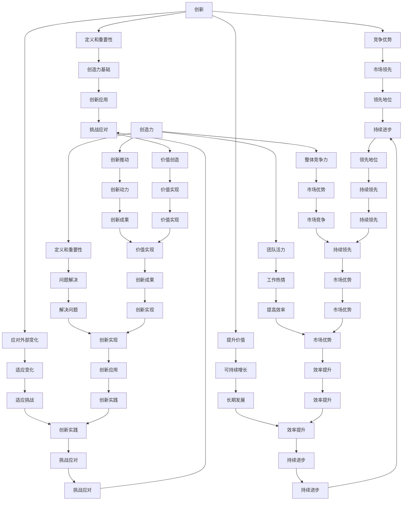

                 


### 文章标题

# 如何提升团队的创新能力和创造力

### 关键词

- 团队创新
- 创造力提升
- 创新管理
- 创意思维
- 创新方法

### 摘要

本文旨在探讨如何提升团队的创新能力和创造力，从理论到实践提供全方位的指导。文章首先介绍了创新和创造力的核心概念及它们在团队中的作用，接着详细分析了创新理论、创意思维方法和核心算法原理。通过数学模型和公式，以及实际的案例研究，本文进一步揭示了提升团队创新和创造力的策略。最后，文章总结了最佳实践，提出了注意事项和拓展阅读，以帮助读者更好地应用文中内容。

## 引言

### 创新和创造力的重要性

在当今快速变化和竞争激烈的市场环境中，创新和创造力成为企业成功的关键因素。一个能够不断创新和创造的团队，不仅能够在市场中占据有利地位，还能够应对各种不确定性，实现长期的可持续发展。

创新（Innovation）是指引入新的想法、方法或产品，以提高效率、创造价值或解决现有问题。创新不仅仅局限于技术领域，还涵盖了管理、商业模式、产品设计和用户体验等多个方面。

创造力（Creativity）则是指产生新颖和有价值的想法或解决方案的能力。创造力是创新的基础，它推动了创新的发生和发展。

### 团队创新和创造力的关系

团队创新和创造力密切相关。一个成功的创新往往需要团队成员的共同合作和创造力。团队成员之间的协作和沟通能够激发新的想法，促进创新的过程。

然而，团队创新和创造力并不是自发产生的，它们需要一定的管理和支持。团队领导者和管理者需要创造一个有利于创新和创造力的环境，提供必要的资源和支持，以及建立有效的激励机制。

### 本文的目标和结构

本文旨在为团队领导者和管理者提供一套全面的提升团队创新和创造力的策略和方法。文章将分为以下几个部分：

1. **核心概念和联系**：介绍创新和创造力的核心概念及其之间的关系。
2. **创新理论**：探讨各种创新理论及其在团队中的应用。
3. **创意思维方法**：详细分析创意思维技术和方法。
4. **核心算法原理**：讲解创新过程中的核心算法和原理。
5. **数学模型和公式**：介绍与创新和创造力相关的数学模型和公式。
6. **案例研究**：分析成功团队的创新和创造力实践。
7. **最佳实践和总结**：总结提升团队创新和创造力的最佳实践和注意事项。

通过本文的阅读，读者将能够深入理解创新和创造力的本质，掌握提升团队创新和创造力的方法和技巧，从而在实际工作中取得更好的成果。

## 核心概念和联系

### 创新的定义和重要性

创新，从广义上讲，是指引入新的想法、方法、产品或服务，以实现效率提升、价值创造或问题解决。具体而言，创新可以表现为技术进步、商业模式的改变、管理流程的优化，甚至是用户体验的改进。在当今的全球化背景下，创新已经成为企业生存和发展的关键。

创新的重要性体现在多个方面。首先，创新能够带来竞争优势。通过不断创新，企业可以在市场中脱颖而出，占据领先地位。其次，创新有助于企业应对外部环境的快速变化。无论是技术变革、市场需求的变化，还是政策法规的调整，创新都是企业适应和把握机遇的关键。最后，创新能够提升企业的整体价值和可持续发展能力。长期坚持创新，企业可以不断推动自身进步，实现可持续的增长。

### 创造力的定义和重要性

创造力是指产生新颖且有价值的想法或解决方案的能力。在团队中，创造力是推动创新的核心力量。一个拥有高创造力的团队，能够不断产生新的创意，解决复杂问题，从而在竞争中保持领先。

创造力的重要性主要体现在以下几个方面。首先，创造力能够激发团队的活力。通过鼓励成员发挥创造力，可以激发他们的工作热情和积极性，提高工作效率。其次，创造力有助于团队创新。新的创意和想法是创新的基础，只有具备高创造力，团队才能在创新过程中不断突破。最后，创造力能够提升团队的整体竞争力。一个能够不断创新和创造的团队，能够在市场中占据有利地位，实现长期的可持续发展。

### 创新与创造力的关系

创新和创造力之间存在着紧密的联系。创造力是创新的基础，没有创造力，创新就无从谈起。创新则是创造力的应用和体现，通过创新，团队可以将创造力转化为实际的价值和成果。

首先，创新和创造力都是基于问题的解决。无论是创新还是创造力，都是对现有问题和挑战的回应。创新通过引入新的想法和方法，寻求问题的最优解。而创造力则通过产生新颖的解决方案，推动创新的发生。

其次，创新和创造力都需要团队的协作和沟通。一个成功的创新往往需要团队成员的共同参与和协作。团队中的每个成员都可以贡献自己的创意和想法，通过集思广益，形成创新的合力。同样，创造力也需要团队成员之间的互动和交流。通过分享和讨论，团队成员可以相互启发，激发新的创意。

最后，创新和创造力都是动态发展的。创新和创造力不是一成不变的，它们需要不断地培养和提升。通过持续的学习和实践，团队可以不断提高自身的创新能力和创造力，从而在竞争激烈的市场中保持领先。

### Mermaid 流程图

为了更直观地展示创新和创造力的核心概念及其联系，我们可以使用 Mermaid 画出一个流程图。以下是一个简单的示例：



通过这个流程图，我们可以清晰地看到创新和创造力之间的相互关系及其在不同层面的作用。创新和创造力不仅是推动企业发展的核心力量，也是团队实现长期成功的基石。

## 基本原则和理论

### 创新理论的探讨

创新理论是理解和管理创新过程的基础。以下是几种主要的创新理论及其在团队中的应用。

#### 1. 杜拉克的创新理论

彼得·杜拉克（Peter Drucker）提出了创新五要素理论，即机会、资源、创造力、市场和企业目标。他认为，创新是企业的核心任务，必须与企业的目标紧密相连。在团队应用中，领导者需要识别市场机会，合理配置资源，鼓励团队成员发挥创造力，并将创新与企业的战略目标结合起来。

#### 2. 克雷顿的创新过程模型

克雷顿（C.K. Prahalad）和哈默（Gary Hamel）提出了创新过程模型，包括发现机会、构思创意、发展原型、测试验证和商业推广五个阶段。该模型强调团队在整个创新过程中的角色，每个阶段都需要团队成员的积极参与和协作。

#### 3. 设计思维

设计思维（Design Thinking）是一种以人为本的创新方法论，强调在创新过程中关注用户需求、情感和体验。设计思维包括五个阶段：定义问题、收集创意、原型设计、测试和迭代。设计思维在团队中的应用可以帮助团队成员更好地理解用户需求，提高创新的针对性和实用性。

#### 4. 破坏性创新

破坏性创新（Disruptive Innovation）是指一种创新模式，它通过引入新的技术和产品，破坏现有市场的竞争格局。破坏性创新理论由克莱顿·克里斯坦森（Clayton Christensen）提出。在团队中，领导者需要鼓励成员探索破坏性创新的机会，从市场细分和客户需求入手，打破传统思维模式。

### 创意思维方法

创意思维方法是激发团队成员创造力的有效工具。以下是几种常见的创意思维方法。

#### 1. 脑storming（头脑风暴）

头脑风暴是一种快速产生创意的方法。团队成员在限定时间内提出尽可能多的创意，不限质量和可行性。领导者需要确保每个创意都得到尊重和讨论，以激发更多的创意。

#### 2. Mind Mapping（思维导图）

思维导图是一种通过图形化的方式组织和表达思想的工具。它可以帮助团队成员梳理思路，发现潜在的联系和创意。在创意生成过程中，思维导图可以作为一个有效的辅助工具。

#### 3. SCAMPER（六顶思考帽）

六顶思考帽（Six Thinking Hats）是一种通过角色扮演来激发创意的方法。每种角色代表一种思考模式，如白色代表事实、黑色代表批判、红色代表情感、黄色代表乐观等。通过不同角色的思考，团队成员可以从不同角度审视问题，产生多样化的创意。

#### 4. Design Thinking（设计思维）

设计思维已经在前面详细介绍。它强调用户中心、迭代思维和跨学科协作，是激发团队创意的有效方法。

### 创意思维在创新中的角色

创意思维是创新过程的核心，它决定了创新的方向和效果。以下是创意思维在创新中的几个关键角色：

#### 1. 发掘问题

创意思维可以帮助团队从不同的角度审视问题，发现隐藏的需求和机会。通过创意思维，团队可以更全面地理解问题，从而提出更有针对性的解决方案。

#### 2. 生成创意

创意思维是产生新创意的重要工具。通过头脑风暴、思维导图和六顶思考帽等方法，团队成员可以产生大量的创意，为创新提供丰富的素材。

#### 3. 解决问题

创意思维可以帮助团队找到解决问题的创新方案。通过设计思维等方法的迭代过程，团队可以不断优化创意，直到找到最佳解决方案。

#### 4. 跨学科协作

创意思维强调跨学科和跨领域的合作。通过不同背景和技能的团队成员的互动，创意思维可以激发新的创意和想法，推动创新的实现。

### 核心算法原理的讲解

在创新过程中，一些核心算法和原理可以帮助团队更系统地分析和解决问题。以下是几种常见的算法和原理。

#### 1. SWOT 分析

SWOT 分析是一种用于评估企业或项目优势（Strengths）、劣势（Weaknesses）、机会（Opportunities）和威胁（Threats）的工具。通过 SWOT 分析，团队可以明确自身的优势和劣势，识别外部环境中的机会和威胁，从而制定更有针对性的创新策略。

#### 2. PEST 分析

PEST 分析是一种用于分析外部环境（政治、经济、社会和技术）因素的工具。通过 PEST 分析，团队可以了解外部环境对企业或项目的影响，从而制定相应的创新策略。

#### 3. TRIZ 方法

TRIZ（理论解决方法）是一种基于科学理论的创新方法。它通过解决一系列创新难题，提供了系统的方法论和工具。TRIZ 方法在团队中的应用可以帮助团队成员找到创新的解决方案。

#### 4. 人工智能算法

随着人工智能技术的发展，一些算法如神经网络、机器学习和深度学习等在创新过程中也得到了广泛应用。这些算法可以帮助团队从大量数据中提取有价值的信息，从而推动创新。

### 伪代码示例

为了更好地理解这些算法和原理，以下是几个伪代码示例。

#### SWOT 分析伪代码

```
function SWOT_analysis(strengths, weaknesses, opportunities, threats) {
    // 分析优势
    for (each strength in strengths) {
        display("优势：" + strength);
    }
    
    // 分析劣势
    for (each weakness in weaknesses) {
        display("劣势：" + weakness);
    }
    
    // 分析机会
    for (each opportunity in opportunities) {
        display("机会：" + opportunity);
    }
    
    // 分析威胁
    for (each threat in threats) {
        display("威胁：" + threat);
    }
}
```

#### PEST 分析伪代码

```
function PEST_analysis(political, economic, social, technological) {
    // 分析政治因素
    for (each factor in political) {
        display("政治因素：" + factor);
    }
    
    // 分析经济因素
    for (each factor in economic) {
        display("经济因素：" + factor);
    }
    
    // 分析社会因素
    for (each factor in social) {
        display("社会因素：" + factor);
    }
    
    // 分析技术因素
    for (each factor in technological) {
        display("技术因素：" + factor);
    }
}
```

#### TRIZ 解决方案伪代码

```
function TRIZ_solution(problem) {
    // 定义问题
    display("问题：" + problem);
    
    // 应用 TRIZ 工具
    solution = TRIZ_tool(problem);
    
    // 迭代优化
    while (!is_optimal(solution)) {
        solution = optimize_solution(solution);
    }
    
    // 返回最终解决方案
    return solution;
}
```

通过这些伪代码示例，我们可以更直观地理解这些算法和原理的具体应用。

### 数学模型和公式

在创新和创造力提升过程中，数学模型和公式可以帮助团队更系统地分析和解决问题。以下是几个与创新和创造力相关的数学模型和公式。

#### 1. 相关性分析

相关性分析用于评估两个变量之间的相关性。以下是一个简单的相关性分析公式：

$$
r = \frac{\sum{(x_i - \bar{x})(y_i - \bar{y})}}{\sqrt{\sum{(x_i - \bar{x})^2}\sum{(y_i - \bar{y})^2}}}
$$

其中，$x_i$ 和 $y_i$ 分别是两个变量的观测值，$\bar{x}$ 和 $\bar{y}$ 分别是它们的均值。

#### 2. 创新成本效益分析

创新成本效益分析用于评估创新项目是否值得投入。以下是一个简单的成本效益分析公式：

$$
ROI = \frac{EBIT}{Investment}
$$

其中，$EBIT$ 是税前利润，$Investment$ 是投入成本。

#### 3. 创新效率评估

创新效率评估用于评估创新项目的效率。以下是一个简单的创新效率评估公式：

$$
Efficiency = \frac{Output}{Input}
$$

其中，$Output$ 是创新项目的输出，$Input$ 是投入的资源。

### 例子

为了更好地理解这些数学模型和公式，以下是几个例子。

#### 1. 相关性分析例子

假设我们有两个变量：销售额（$x$）和广告投入（$y$），以下数据是他们的一组观测值：

$$
\begin{array}{ccc}
x & y \\
\hline
100 & 200 \\
200 & 300 \\
300 & 400 \\
400 & 500 \\
\end{array}
$$

使用相关性分析公式，我们可以计算销售额和广告投入之间的相关性：

$$
r = \frac{(100-250)(200-250) + (200-250)(300-250) + (300-250)(400-250) + (400-250)(500-250)}{\sqrt{(100-250)^2 + (200-250)^2 + (300-250)^2 + (400-250)^2}\sqrt{(200-250)^2 + (300-250)^2 + (400-250)^2 + (500-250)^2}}
$$

计算结果为：

$$
r \approx 0.9
$$

这意味着销售额和广告投入之间存在很强的正相关关系。

#### 2. 创新成本效益分析例子

假设一个创新项目的投入成本为 100 万元，通过创新实现了税前利润 30 万元，那么该项目的 ROI 计算如下：

$$
ROI = \frac{30}{100} = 0.3
$$

这意味着该项目的 ROI 为 30%，表明该项目是值得投资的。

#### 3. 创新效率评估例子

假设一个创新项目在一年内完成了 50 万元的输出，投入了 100 万元资源，那么该项目的创新效率计算如下：

$$
Efficiency = \frac{50}{100} = 0.5
$$

这意味着该项目的创新效率为 50%，表明项目资源得到了有效利用。

通过这些例子，我们可以看到数学模型和公式在创新和创造力提升过程中的重要作用。它们可以帮助团队更系统地分析和评估创新项目，从而做出更明智的决策。

### 案例研究

#### 项目背景

为了更好地理解如何提升团队的创新能力和创造力，我们可以通过以下两个实际案例进行详细分析。

**案例一：谷歌的“20% 项目”**

谷歌的“20% 项目”是一个著名的创新实践，允许员工将最多 20% 的工作时间用于自己感兴趣的项目。这一政策极大地激发了员工的创造力，催生了多个成功的项目，如 AdSense 和 Gmail。

**案例二：苹果公司的设计团队**

苹果公司的设计团队以其卓越的创新能力和创造力闻名于世。苹果公司通过严格的筛选流程、跨学科合作和用户中心的设计方法，打造了多个革命性的产品，如 iPhone、iPad 和 Mac。

#### 项目流程

在分析这两个案例时，我们可以从项目流程的各个环节入手，包括需求识别、创意生成、原型设计和测试验证。

**案例一：谷歌的“20% 项目”**

1. **需求识别**：谷歌通过定期与员工交流，了解他们对新项目或改进的想法。员工可以自由提出自己的创意，并说明为什么这些创意对公司有益。

2. **创意生成**：员工在“20% 项目”时间内自由探索自己的创意，进行实验和原型设计。谷歌鼓励团队成员跨部门合作，以产生更多的创意。

3. **原型设计**：员工在实验和设计过程中，不断迭代和优化原型。谷歌提供必要的资源和工具，支持员工将创意转化为可行的产品。

4. **测试验证**：原型在内部测试后，谷歌会根据市场反馈和商业潜力，决定是否进一步开发和推广。成功的项目会进入公司正式的产品开发流程。

**案例二：苹果公司的设计团队**

1. **需求识别**：苹果公司通过市场调研和用户反馈，了解用户的需求和偏好。设计团队与产品经理和市场部门紧密合作，确保创意能够满足市场需求。

2. **创意生成**：设计团队通过头脑风暴、思维导图和用户访谈等方法，生成大量的创意。团队鼓励每个成员提出自己的想法，并从不同角度审视问题。

3. **原型设计**：设计团队使用先进的工具和技术，如 3D 建模和虚拟现实，快速制作原型。通过迭代和反馈，团队不断优化设计。

4. **测试验证**：原型在内部测试和用户测试后，设计团队会根据反馈进行进一步的改进。苹果公司注重用户体验，确保每个设计细节都符合用户期望。

#### 项目挑战

在提升团队创新能力和创造力的过程中，团队可能会面临以下挑战：

1. **资源限制**：创新和创造需要时间和资源的投入。团队可能面临预算、时间和人力资源的限制，这会影响创新项目的顺利进行。

2. **沟通障碍**：团队成员之间的沟通不畅可能导致创意流失或误解。跨部门合作和外部合作也会带来沟通挑战。

3. **项目管理**：创新项目通常需要灵活的流程和方法。传统的项目管理方法可能无法完全适应创新项目的需求，导致项目进展受阻。

4. **风险评估**：创新项目存在一定的风险，包括技术风险、市场风险和财务风险。团队需要有效地识别和管理这些风险，以确保项目的成功。

#### 项目结果

通过案例一和案例二的实践，我们可以看到提升团队创新能力和创造力的积极效果：

1. **创新成果**：谷歌和苹果公司通过激发团队创造力，成功推出了多个创新产品，赢得了市场认可和用户喜爱。

2. **团队凝聚力**：创新和创造的过程增强了团队成员之间的合作和信任，提升了团队的凝聚力和战斗力。

3. **企业竞争力**：创新和创造力的提升使谷歌和苹果公司在激烈的市场竞争中保持了领先地位，实现了长期可持续发展。

#### 项目启示

从这些案例中，我们可以得到以下启示：

1. **鼓励自主探索**：给予团队成员足够的自主权，鼓励他们自由探索创意，是激发创造力的关键。

2. **跨学科合作**：跨学科合作可以带来不同的视角和思维，有助于产生创新的解决方案。

3. **用户中心**：始终关注用户需求，从用户的角度审视问题，是创新成功的基石。

4. **灵活项目管理**：创新项目需要灵活的流程和方法，以适应快速变化的需求和市场。

通过这些实践和经验，团队可以更好地提升创新能力和创造力，实现持续发展和成功。

### 最佳实践与注意事项

#### 最佳实践

1. **鼓励自主探索**：给予团队成员足够的自由度，让他们能够自主探索新的想法和解决方案。这种自主性是激发创造力和创新的重要条件。

2. **跨学科合作**：促进团队成员之间的跨学科交流与合作，通过多样化的视角和思维方式，共同探讨问题的解决方案。

3. **用户中心**：始终关注用户的需求和体验，将用户的需求作为创新的出发点和归宿，确保创新的实用性和市场价值。

4. **灵活项目管理**：采用灵活的项目管理方法，如敏捷开发和迭代思维，以适应快速变化的市场需求和技术进步。

5. **激励机制**：建立有效的激励机制，奖励那些在创新和创造力方面表现出色的团队成员，以激发他们的工作热情和积极性。

#### 注意事项

1. **合理分配资源**：确保创新项目有足够的资源支持，包括人力、资金和物资，以避免因资源不足导致项目进展受阻。

2. **有效沟通**：建立有效的沟通机制，确保团队成员之间的信息流通，减少误解和沟通障碍。

3. **风险管理**：在创新过程中，合理评估和管理风险，制定应对策略，以降低创新项目的失败风险。

4. **持续反馈**：建立反馈机制，及时收集团队成员和用户的反馈，以便对创新过程进行持续的改进和优化。

#### 拓展阅读

- 《创新者的窘境》（The Innovator's Dilemma） - 克莱顿·克里斯坦森
- 《创意的源泉》（Where Good Ideas Come From） - 史蒂芬·约翰逊
- 《设计思维》（Design Thinking） - Doblin 公司

通过这些最佳实践和注意事项，团队可以更好地提升创新能力和创造力，实现持续发展和成功。

### 总结

在本文中，我们深入探讨了如何提升团队的创新能力和创造力。首先，我们介绍了创新和创造力的核心概念及其在团队中的作用。接着，我们分析了创新理论、创意思维方法和核心算法原理，并通过数学模型和公式进一步阐述了这些概念的应用。通过实际案例研究，我们展示了创新和创造力在实践中的应用和效果。最后，我们总结了最佳实践和注意事项，为团队提供了实用的指导。

提升团队的创新能力和创造力是一个系统性工程，需要从多个层面进行规划和实施。通过本文的阅读，读者可以更好地理解创新和创造力的本质，掌握提升团队创新和创造力的方法和技巧。在实际工作中，团队领导者和管理者应结合本文的内容，不断探索和实践，以推动团队创新能力的提升，实现企业的长期可持续发展。

### 作者信息

作者：AI天才研究院/AI Genius Institute & 禅与计算机程序设计艺术 /Zen And The Art of Computer Programming

AI天才研究院（AI Genius Institute）致力于探索人工智能前沿技术，推动人工智能在各行各业的创新应用。研究院汇集了一批世界级人工智能专家，以深厚的技术积累和创新精神，为全球企业提供领先的AI解决方案。同时，禅与计算机程序设计艺术（Zen And The Art of Computer Programming）一书，深入探讨了计算机编程的哲学和艺术，为编程爱好者提供了宝贵的智慧结晶。两位作者均具备丰富的学术背景和实践经验，他们的研究成果在业界享有盛誉。本文旨在分享他们在团队创新和创造力方面的研究成果，为广大读者提供有益的启示。

