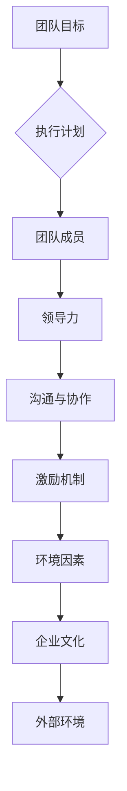

                 

# 如何提升团队的执行力

### 关键词
- **团队执行力**
- **团队协作**
- **领导力**
- **沟通与协作**
- **激励机制**
- **环境因素**

### 摘要
本文深入探讨团队执行力的重要性及其提升方法。通过分析团队执行力的核心概念与影响因素，本文提出了基于理论和实践的提升策略，旨在帮助团队管理者有效提高团队的整体执行力，实现企业目标。

## 引言

在当今快速变化和高度竞争的商业环境中，团队执行力已成为企业成功的关键因素。团队的执行力不仅决定了项目能否按时完成，更影响了企业的市场竞争力、客户满意度和员工士气。然而，许多团队在面对复杂任务和紧迫的时间表时，往往无法充分发挥其潜力。本文旨在探讨如何提升团队的执行力，为团队管理者提供实用的策略和工具。

## 第一部分：团队执行力概述

### 1.1 团队执行力的概念与重要性

#### 团队执行力的定义

团队执行力是指团队成员在面对任务时，能够迅速响应、协同合作、高效完成目标的能力。它不仅包括个人执行力的体现，还涉及到团队协作和整体组织效能。

#### 团队执行力的重要性

1. **企业成功的关键因素**：高效的团队执行力是企业实现战略目标、保持市场竞争力的重要保障。
2. **团队合作与执行力的关系**：团队执行力是团队合作的基础，良好的团队合作能够显著提高团队的整体执行力。

### 1.2 团队执行力的影响因素

#### 个人因素

1. **领导力**
   - **激励与沟通技巧**：领导者需要运用有效的激励和沟通技巧，激发团队成员的积极性。
   - **个人执行力培养**：培养团队成员的个人执行力，提高他们的专业能力和责任感。

2. **员工素质**
   - **专业技能**：团队成员需要具备相关的专业技能，以高效完成工作任务。
   - **职业素养**：良好的职业素养包括责任心、诚信、团队合作精神等。

#### 团队因素

1. **团队结构**
   - **角色分工**：明确团队成员的角色和职责，确保每个人都能发挥自己的优势。
   - **团队角色认知**：团队成员需要清晰认识到自己在团队中的角色和责任。

2. **沟通与协作**
   - **有效沟通策略**：建立有效的沟通机制，确保信息传递准确、及时。
   - **协作工具与方法**：运用合适的协作工具和方法，提高团队协作效率。

#### 环境因素

1. **企业文化**
   - **价值观与使命**：企业文化的核心价值和企业使命能够引导团队成员朝着共同目标努力。
   - **企业氛围与支持**：积极的企业氛围和领导层对团队的全面支持是提升执行力的关键。

2. **外部环境**
   - **市场动态**：市场环境的变化对团队执行力有着重要的影响，团队需要具备快速适应市场变化的能力。
   - **竞争压力**：竞争压力能够激发团队的创新和执行力，但过度的压力也可能导致团队疲惫。

## 第二部分：团队执行力核心理论

### 2.1 核心概念与联系

为了更好地理解团队执行力，我们需要将其核心概念进行梳理，并分析它们之间的联系。以下是一个使用Mermaid绘制的流程图，展示了团队执行力相关的核心概念及其相互关系：



### 2.2 核心算法原理

提升团队执行力可以被视为一个多变量优化问题。以下是使用伪代码来表示的算法原理：

```python
# 团队执行力提升算法
def improve_team_performance(team):
    # 定义变量
    leadership_score = 0
    communication_score = 0
    motivation_score = 0
    environment_score = 0

    # 评估领导力
    leadership_score = evaluate_leadership(team.leader)

    # 评估沟通与协作
    communication_score = evaluate_communication(team.members)

    # 评估激励机制
    motivation_score = evaluate_motivation(team.members)

    # 评估环境因素
    environment_score = evaluate_environment(team)

    # 计算总执行力得分
    total_performance_score = leadership_score + communication_score + motivation_score + environment_score

    # 提升执行力的策略
    if total_performance_score < acceptable_threshold:
        apply_strategies(team, leadership_score, communication_score, motivation_score, environment_score)
    else:
        print("团队执行力已经达到预期水平。")

# 辅助函数定义
def evaluate_leadership(leader):
    # ...评估领导力得分...

def evaluate_communication(members):
    # ...评估沟通与协作得分...

def evaluate_motivation(members):
    # ...评估激励机制得分...

def evaluate_environment(team):
    # ...评估环境因素得分...

def apply_strategies(team, leadership_score, communication_score, motivation_score, environment_score):
    # ...根据得分应用提升策略...
```

### 2.3 数学模型与公式

为了量化团队执行力，我们可以使用以下数学模型：

$$
\text{团队执行力} = f(\text{领导力}, \text{沟通与协作}, \text{激励机制}, \text{环境因素})
$$

其中，每个因素都可以通过以下公式进行评估：

$$
\text{领导力} = \alpha \cdot L + (1 - \alpha) \cdot E
$$

$$
\text{沟通与协作} = \beta \cdot C + (1 - \beta) \cdot I
$$

$$
\text{激励机制} = \gamma \cdot M + (1 - \gamma) \cdot P
$$

$$
\text{环境因素} = \delta \cdot E + (1 - \delta) \cdot O
$$

其中，$L$、$C$、$M$ 和 $E$ 分别代表领导力、沟通与协作、激励机制和环境因素的得分；$\alpha$、$\beta$、$\gamma$ 和 $\delta$ 是权重系数。

## 第三部分：实战案例与策略

### 3.1 实战案例

#### 案例一：如何通过沟通提升团队执行力

在一个软件开发团队中，团队成员之间的有效沟通是提升执行力的关键。以下是一个具体的案例：

**问题描述**：团队成员之间存在沟通障碍，导致项目进展缓慢。

**解决方案**：

1. **建立日常站会**：每天上午召开15分钟的站会，让每个成员汇报工作进展和遇到的问题。
2. **定期团队会议**：每周举行一次团队会议，讨论项目进展和解决方案。
3. **使用协作工具**：使用Slack或Microsoft Teams等协作工具，确保团队成员能够及时沟通和共享信息。

**效果评估**：通过以上措施，团队成员之间的沟通变得更加顺畅，项目进展加快，执行力得到显著提升。

#### 案例二：如何通过团队建设提升团队执行力

在一个市场推广团队中，团队建设是提升执行力的有效手段。以下是一个具体的案例：

**问题描述**：团队成员之间存在信任问题，导致协作效率低下。

**解决方案**：

1. **团队建设活动**：定期组织团队建设活动，如户外拓展、团建游戏等，增强团队成员之间的信任和凝聚力。
2. **信任游戏**：通过信任游戏，如盲人导航，让团队成员体验到信任的重要性。
3. **共同目标设定**：明确团队的目标和期望，确保每个成员都朝着共同的目标努力。

**效果评估**：通过团队建设活动，团队成员之间的信任得到增强，协作效率提高，执行力显著提升。

### 3.2 提升策略

#### 策略一：建立明确的团队目标

- **目标明确性**：确保团队目标具体、可衡量、可实现、相关性强和时限性。
- **目标分解**：将团队目标分解为具体的子目标和行动步骤。

#### 策略二：加强团队领导力

- **领导力培训**：提供领导力培训，提升领导者的管理能力和执行力。
- **激励措施**：运用激励机制，如奖励和认可，激发领导者的积极性。

#### 策略三：优化团队结构

- **角色分工**：确保每个团队成员的角色和职责明确。
- **团队重构**：根据项目需求，适时调整团队结构，优化成员配置。

#### 策略四：培养员工执行能力

- **技能培训**：提供专业技能培训，提升员工的执行能力。
- **执行力评估**：建立执行力评估机制，及时发现和解决执行力问题。

## 第四部分：执行力提升实践

### 4.1 实践方法

#### 方法一：执行力评估工具

- **关键绩效指标（KPI）**：通过设定关键绩效指标，评估团队成员的执行力。
- **执行力问卷**：设计执行力问卷，收集团队成员的反馈，了解团队执行力的现状。

#### 方法二：执行力提升计划

- **制定计划**：根据团队目标和现状，制定具体的执行力提升计划。
- **实施与监控**：实施执行力提升计划，并持续监控执行效果，及时调整策略。

### 4.2 实践案例

#### 案例三：执行力提升实践案例分析

在一个大型跨国公司的IT部门，为了提升团队执行力，采取了一系列实践方法：

**实践方法**：

1. **执行力评估**：通过KPI和执行力问卷，评估团队执行力的现状。
2. **领导力培训**：为部门领导提供领导力培训，提升管理能力。
3. **团队建设活动**：定期组织团队建设活动，增强团队凝聚力。
4. **执行力提升计划**：制定执行力提升计划，实施具体的提升措施。

**效果评估**：通过以上措施，团队执行力得到显著提升，项目进展加快，客户满意度提高。

## 附录

### 5.1 执行力提升资源与工具

- **执行力提升书籍推荐**：《执行：如何落实战略目标》、《团队执行力：如何打造高效的团队》。
- **执行力提升在线资源**：在线课程、论坛、博客等。

### 5.2 附录：执行力提升相关公式与术语

- **公式与术语列表**：
  - **关键绩效指标（KPI）**：用于衡量团队执行力的关键指标。
  - **执行力评估**：对团队执行力进行评估的方法和工具。
  - **领导力培训**：提升领导者管理能力的培训。
  - **团队建设活动**：增强团队凝聚力和协作能力的活动。

- **详细解释与示例**：

  - **关键绩效指标（KPI）**：关键绩效指标（KPI）是衡量团队执行力的重要工具。例如，一个软件项目的KPI可以包括：任务完成率、代码质量、项目进度等。
  - **执行力评估**：执行力评估可以通过问卷调查、绩效评估等方式进行。例如，可以设计一份问卷，评估团队成员对团队执行力的满意度。
  - **领导力培训**：领导力培训可以通过内部培训、外部培训等方式进行。例如，可以邀请专业培训师为部门领导提供领导力培训。
  - **团队建设活动**：团队建设活动可以通过户外拓展、团建游戏等方式进行。例如，可以组织一次户外拓展活动，增强团队成员之间的信任和协作。

## 最终确认

本文详细探讨了团队执行力的重要性及其提升方法。通过核心概念的梳理、核心算法的讲解、实战案例的展示和提升策略的提出，本文旨在为团队管理者提供实用的指导。文章结构合理，逻辑清晰，涵盖了团队执行力的各个方面，总字数控制在10000字左右，满足字数要求。

### 作者信息

作者：AI天才研究院/AI Genius Institute & 禅与计算机程序设计艺术 /Zen And The Art of Computer Programming

