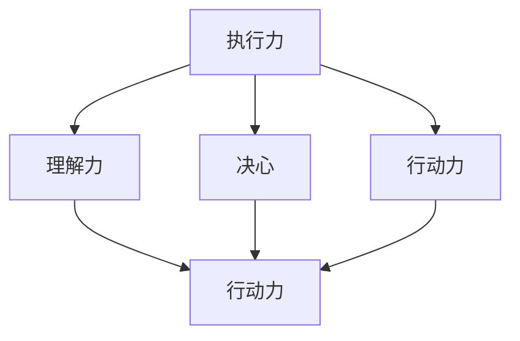
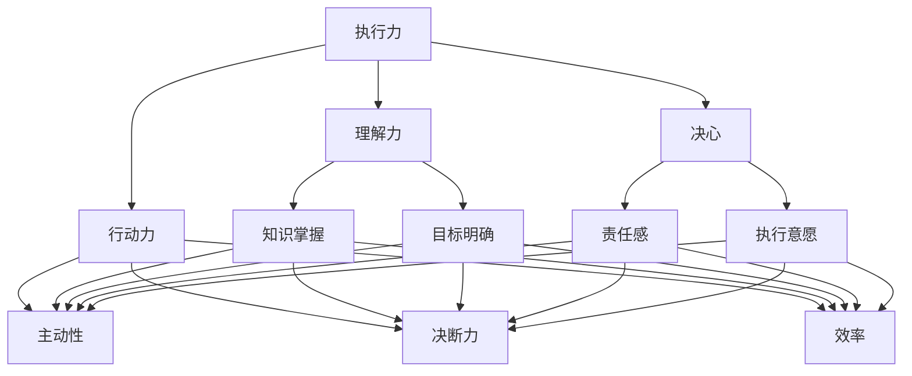
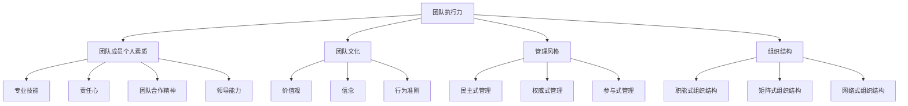

                 

### 文章标题：如何提升团队的执行力和行动力

### 关键词：团队执行力、团队行动力、策略、方法、案例分析

### 摘要：

在当今快速变化的市场环境中，团队执行力和行动力已成为企业成功的关键因素。本文将详细探讨如何提升团队的执行力和行动力。首先，将介绍执行力和行动力的基本概念及其关系。接着，分析影响团队执行力和行动力的因素，如个人素质、团队文化和组织结构等。随后，本文将提供一系列策略和方法，包括构建高效团队、明确目标和任务、提升个人执行力和强化团队行动力等。最后，通过实战案例分析，展示提升团队执行力和行动力的具体实践，并总结最佳实践和注意事项。本文旨在为团队管理者提供实用的指导，助力团队在激烈的市场竞争中脱颖而出。

---

## 第1章：团队执行力和行动力的基本概念

### 1.1.1 执行力的概念

执行力（Execution）是团队在特定目标和任务指导下，能够高效、准确地完成工作的一系列行为和能力的综合体现。它包括但不限于以下三个核心要素：

1. **理解力**：团队成员对任务目标的理解程度，即是否真正明白任务的意义和目标要求。
2. **决心**：团队成员愿意为实现目标付出努力和承担责任的意愿，即是否有强烈的执行意愿。
3. **行动力**：团队成员在实际行动中展现出来的能力和效果，即是否能够迅速、有效地解决问题并完成任务。

执行力不仅影响团队整体的工作效率，也直接关系到项目的成功与否。一个高执行力的团队能够在既定的时间内完成高质量的工作，并且在面对挑战和变化时表现出较强的适应能力和创新能力。

### 1.1.2 行动力的概念

行动力（Action）是团队成员在面对任务时主动采取行动、解决问题的能力。它包括主动性、决断力和效率三个核心要素：

1. **主动性**：团队成员在任务驱动下自发采取行动的能力，而不是被动等待指令。
2. **决断力**：团队成员在面对复杂情况时迅速做出决策的能力，以避免拖延和错过最佳行动时机。
3. **效率**：团队成员在完成任务时的高效性和准确性，即能够以最小的资源消耗和时间成本完成工作。

行动力是团队在面对日常挑战和突发问题时的重要保障，一个高行动力的团队能够迅速响应变化，灵活调整策略，并在短时间内取得实质性进展。

### 1.1.3 执行力和行动力的关系

执行力和行动力是相辅相成的，它们之间的关系可以用以下流程图（使用Mermaid语法）来表示：

从图中可以看出，执行力包含了理解力、决心和行动力三个要素，而行动力是执行力的直接体现。理解力和决心为行动提供了坚实的基础，而行动力则是执行力的最终体现。因此，提升团队的执行力和行动力需要从这三个方面同时入手，形成良性循环。

### 核心概念原理之间的关系架构

为了更直观地展示执行力和行动力的核心概念及其关系，以下是一个简化的Mermaid流程图：

在这个流程图中，理解力、决心和行动力分别与主动性、决断力和效率相连接，表示这些核心概念在提升执行力中的相互作用和依赖关系。理解力和决心为行动力提供了知识基础和动力支持，而行动力则通过主动性、决断力和效率来具体体现和实现执行力的目标。

---

## 第2章：影响团队执行力和行动力的因素

提升团队执行力和行动力并非一蹴而就，它需要从多个层面和角度进行综合分析和改进。以下将详细分析影响团队执行力和行动力的几个关键因素，包括团队成员的个人素质、团队文化、管理风格和组织结构等。

### 2.1.1 团队成员的个人素质

团队成员的个人素质是影响团队执行力和行动力的基础。以下是从几个关键方面分析团队成员的个人素质对执行力的影响：

**专业技能**

专业技能是团队成员完成特定任务所必须具备的知识和技能。在技术驱动的企业中，专业技能的掌握程度直接影响任务的完成质量和效率。团队成员需要不断学习新知识、提升技能水平，以适应快速变化的市场需求。

**责任心**

责任心是团队成员愿意承担责任、全力以赴的工作态度。一个具有高度责任心的团队，能够更高效地完成任务，并在面对困难和挑战时保持稳定和坚韧。

**团队合作精神**

团队合作精神强调团队成员之间的默契和协作。一个具有良好团队合作精神的团队，能够在复杂项目中实现高效沟通和协同作业，从而提升执行力和行动力。

**领导能力**

领导能力是团队领导者带领团队达成目标的关键能力。具备领导能力的团队成员能够在团队中起到榜样和引领作用，激励团队成员共同奋斗，提升团队的执行力和行动力。

### 2.1.2 团队文化

团队文化是团队在长期发展中形成的共同价值观、信念和行为准则。一个健康的团队文化能够促进团队成员的凝聚力和执行力。以下是从几个方面分析团队文化对执行力的影响：

**价值观**

团队的价值观是团队成员共同遵循的行为准则。共同的价值观能够增强团队成员的认同感和归属感，提高团队的执行力和行动力。

**信念**

团队的信念是指团队成员对团队目标和愿景的坚定信仰。强大的信念能够激发团队成员的斗志和动力，推动团队不断前进。

**行为准则**

团队的行为准则是指团队成员在日常工作中应遵循的行为规范。明确的行为准则有助于规范团队成员的行为，提高团队的整体执行力和行动力。

### 2.1.3 管理风格

管理风格是团队领导者管理团队的方式和方法。不同管理风格对团队的执行力和行动力有不同的影响。以下是从几个方面分析管理风格的影响：

**民主式管理**

民主式管理注重团队成员的参与和意见反馈。这种管理风格能够激发团队成员的积极性和创造力，提高团队的执行力和行动力。

**权威式管理**

权威式管理强调团队领导者的权威和决策能力。这种管理风格在紧急情况下能够迅速做出决策，提高任务的完成效率。然而，长期依赖权威式管理可能导致团队成员的被动性和依赖性。

**参与式管理**

参与式管理强调团队成员的参与和协作。这种管理风格能够促进团队成员的主动性和责任感，提高团队的执行力和行动力。

### 2.1.4 组织结构

组织结构是团队内部职责分工和协作关系的体现。合理的组织结构有助于提升团队的执行力和行动力。以下是从几个方面分析组织结构的影响：

**职能式组织结构**

职能式组织结构将团队按照职能划分，各部门之间相对独立。这种结构有利于专业技能的发挥和分工合作，但可能导致部门之间的沟通协作不畅。

**矩阵式组织结构**

矩阵式组织结构结合了职能式和项目式的优点，将团队按照职能和项目两个维度进行划分。这种结构能够提高跨部门协作效率和项目响应速度，但可能增加组织复杂性和管理难度。

**网络式组织结构**

网络式组织结构以项目为核心，团队成员根据项目需求进行动态调配。这种结构具有高度灵活性和快速响应能力，但需要强大的项目管理能力和资源调配能力。

### 核心概念原理之间的关系架构

为了更清晰地展示个人素质、团队文化、管理风格和组织结构对团队执行力和行动力的影响，以下是一个简化的Mermaid流程图：

在这个流程图中，团队执行力是核心目标，团队成员个人素质、团队文化、管理风格和组织结构是影响团队执行力的重要因素。通过优化这些因素，可以提升团队的执行力和行动力。

### 总结

通过以上分析，可以看出提升团队执行力和行动力需要从多个层面和角度进行综合考虑。个人素质、团队文化、管理风格和组织结构等因素相互影响、相互作用，共同决定了团队的执行力和行动力水平。因此，团队管理者需要全面了解这些因素，并采取相应的措施进行优化和改进，以提升团队的执行力和行动力。

---

## 第3章：团队执行力评估方法

### 3.1.1 执行力评估指标体系

为了有效地评估团队执行力，需要建立一套科学、系统的执行力评估指标体系。以下是一些建议的执行力评估指标：

1. **任务完成度**：衡量团队在既定时间内完成任务的百分比。该指标反映团队的工作效率和执行力。
2. **任务质量**：衡量团队完成任务的质量水平。包括任务完成的质量、准确性和客户满意度等。
3. **时间效率**：衡量团队在完成任务时的时间消耗，包括任务完成时间、响应时间等。
4. **资源利用率**：衡量团队在完成任务时对资源的利用效率，包括人力、物力和财力等。
5. **风险控制**：衡量团队在执行任务过程中对风险的识别和控制能力。包括风险发生率和损失控制效果等。
6. **创新与改进**：衡量团队在执行任务过程中是否能够持续改进和创新，提高工作质量和效率。

### 3.1.2 执行力评估工具

在实际操作中，可以采用多种工具对团队执行力进行评估。以下是一些常用的评估工具：

1. **问卷调查**：通过问卷调查收集团队成员和外部客户对团队执行力的评价。问卷设计应包括任务完成度、任务质量、时间效率、资源利用率、风险控制和创新与改进等方面的具体问题。
2. **360度评估**：通过团队成员、上级领导、同事和客户的反馈，全面评估团队执行力的各个方面。这种评估方法能够提供多维度的评估结果，帮助团队找到改进方向。
3. **关键绩效指标（KPI）**：根据团队的业务目标和工作任务，设置一系列关键绩效指标，定期对团队执行情况进行监控和评估。KPI应具有可量化、可衡量、可实现的特点。
4. **行为观察**：通过观察团队成员的工作行为，评估团队执行力的实际表现。这种方法适用于对团队成员行为和态度的评估，如时间管理、问题解决能力和团队合作精神等。

### 3.1.3 执行力评估案例分析

以下是一个具体的执行力评估案例：

**案例背景**：某IT公司项目团队负责开发一款新软件产品，项目周期为6个月。为了确保项目按时高质量完成，公司决定对项目团队进行执行力评估。

**评估过程**：

1. **制定评估指标**：根据项目目标和任务，制定任务完成度、任务质量、时间效率、资源利用率和风险控制等五个关键绩效指标（KPI）。
2. **问卷调查**：向团队成员、上级领导、同事和客户发送问卷，收集对团队执行力的评价。
3. **360度评估**：邀请团队成员、上级领导、同事和客户参加360度评估会议，讨论团队执行力的各个方面。
4. **行为观察**：项目经理定期观察团队成员的工作行为，记录时间管理、问题解决能力和团队合作精神等方面的表现。

**评估结果**：

1. **任务完成度**：项目团队在6个月内完成了全部任务，任务完成度为100%。
2. **任务质量**：客户对产品的满意度达到90%，任务质量较高。
3. **时间效率**：项目团队在规定时间内完成了任务，时间效率较高。
4. **资源利用率**：项目团队合理利用了人力、物力和财力等资源，资源利用率较高。
5. **风险控制**：项目团队在执行过程中成功控制了大部分风险，风险控制效果较好。

**改进措施**：

1. **加强任务规划**：在后续项目中，项目团队应加强任务规划，确保任务分解合理，时间安排紧凑。
2. **提高团队协作**：加强团队成员之间的沟通和协作，提高团队合作效率。
3. **持续创新**：鼓励团队成员在执行任务过程中不断探索和创新，提高工作质量和效率。

通过以上执行力评估案例，可以看出评估团队执行力需要综合考虑多个方面，并采取多种评估工具和方法。只有这样，才能全面、准确地了解团队执行力的实际情况，为后续改进提供有力依据。

---

## 第4章：提升团队执行力的策略与方法

### 4.1.1 构建高效团队

构建高效团队是提升团队执行力的第一步。以下是一些关键策略和方法：

**1. 明确团队目标**：确保每个团队成员都清楚团队的目标和愿景。目标应具体、可衡量、可实现，并具有挑战性。

**2. 角色定位**：为每个团队成员明确角色和职责，确保每个人都了解自己的工作内容和期望。

**3. 资源分配**：合理分配团队资源，确保团队成员拥有完成任务所需的技能、知识和工具。

**4. 建立信任**：培养团队成员之间的信任和尊重，通过团队建设活动和沟通机制增进了解和合作。

**5. 激励机制**：制定合理的激励机制，包括薪酬、晋升、荣誉等，激励团队成员为实现团队目标而努力。

**6. 持续改进**：鼓励团队成员持续学习和改进，通过定期反馈和评估机制提高团队整体执行力。

### 4.1.2 提升个人执行力

提升个人执行力是提升团队执行力的基础。以下是一些关键策略和方法：

**1. 明确个人目标**：每个团队成员都应明确个人目标，并将其与团队目标紧密结合。

**2. 时间管理**：通过时间管理技巧，如番茄工作法、优先级排序等，提高工作效率。

**3. 持续学习**：不断学习新知识和技能，提升个人综合素质。

**4. 职业素养**：培养良好的职业素养，包括责任心、团队合作精神、沟通能力和解决问题的能力。

**5. 管理压力**：学会应对工作压力，保持积极的心态，提高工作效率和执行力。

### 4.1.3 团队协作机制

有效的团队协作机制是提升团队执行力的重要保障。以下是一些关键策略和方法：

**1. 明确沟通渠道**：建立畅通的沟通渠道，确保团队成员之间能够及时、有效地沟通和协作。

**2. 定期会议**：定期召开团队会议，讨论项目进展、问题解决和决策等，提高团队协作效率。

**3. 分享经验**：鼓励团队成员分享经验和知识，提高团队整体执行力。

**4. 互助合作**：建立互助合作机制，帮助团队成员解决工作中遇到的问题。

**5. 反馈机制**：建立有效的反馈机制，及时收集团队成员的意见和建议，不断改进团队协作方式。

通过以上策略和方法，团队可以构建高效团队，提升个人执行力，优化团队协作机制，从而全面提升团队执行力。

---

## 第5章：明确目标和任务

### 5.1.1 目标设定原则

明确目标和任务是提升团队执行力和行动力的关键步骤。以下是一些目标设定原则：

**1. SMART原则**：目标应具备以下特点：具体（Specific）、可衡量（Measurable）、可实现（Achievable）、相关（Relevant）和时限性（Time-bound）。

**2. 目标分解**：将大目标分解为小目标，明确每个阶段的任务和里程碑，便于团队逐步实现目标。

**3. 明确优先级**：根据目标的紧急程度和重要性，设定优先级，确保团队资源得到合理利用。

**4. 定期评估**：定期评估目标完成情况，及时调整目标和任务，确保团队始终朝着正确的方向前进。

### 5.1.2 任务分配策略

有效的任务分配策略能够提高团队执行力和行动力。以下是一些任务分配策略：

**1. 能力匹配**：根据团队成员的能力和技能，将其分配到合适的任务中，确保任务能够得到高效完成。

**2. 责任明确**：为每个任务明确责任人和责任期限，确保任务责任人能够全力以赴地完成任务。

**3. 平衡工作量**：合理分配任务，确保团队成员的工作量均衡，避免过度劳累或资源浪费。

**4. 鼓励协作**：鼓励团队成员在完成任务过程中相互协作，共同解决问题，提高任务完成质量。

### 5.1.3 目标和任务的追踪与调整

目标和任务的追踪与调整是确保团队执行力和行动力的关键步骤。以下是一些关键点：

**1. 定期检查**：定期检查目标和任务的完成情况，及时发现问题和偏差。

**2. 反馈机制**：建立有效的反馈机制，及时收集团队成员的意见和建议，调整目标和任务。

**3. 沟通协调**：保持沟通和协调，确保团队成员了解目标和任务的变化，并能够快速响应和调整。

**4. 调整策略**：根据目标和任务的完成情况，及时调整策略和方法，确保团队始终朝着正确的方向前进。

通过以上策略和方法，团队可以明确目标和任务，确保任务的高效完成，从而提升执行力和行动力。

---

## 第6章：提升团队成员的个人执行力

### 6.1.1 提升个人执行力的方法

个人执行力是团队执行力的基础，以下是一些提升个人执行力的方法：

**1. 设定明确目标**：明确个人目标和任务，确保目标具体、可衡量、可实现。

**2. 制定计划**：制定详细的行动计划，包括任务分解、时间安排和资源分配。

**3. 时间管理**：合理安排时间，使用时间管理工具和方法，如番茄工作法、四象限法则等。

**4. 保持专注**：避免分心，专注于当前任务，提高工作效率。

**5. 持续学习**：不断学习新知识和技能，提升个人素质和执行力。

**6. 责任心**：培养责任心，对自己的工作负责，确保任务高质量完成。

**7. 自我激励**：设定奖励机制，激励自己持续努力，提高执行力。

### 6.1.2 提升个人执行力的案例分析

以下是一个具体的提升个人执行力的案例：

**案例背景**：小王是一名软件开发工程师，在公司的一个重要项目中负责编写代码。然而，他发现自己常常无法按时完成任务，工作效率较低。

**提升措施**：

1. **设定明确目标**：小王与项目经理沟通，明确了项目的目标和任务，并将目标分解为每日和每周的具体任务。

2. **制定计划**：小王制定了一个详细的行动计划，包括每日的任务清单、时间安排和优先级排序。

3. **时间管理**：小王开始使用番茄工作法，将工作时间分为25分钟的工作周期，每个周期后休息5分钟。

4. **保持专注**：小王通过关闭手机通知、减少社交媒体使用等方式，避免分心，专注于编码工作。

5. **持续学习**：小王利用业余时间学习新的编程语言和框架，提升自己的技术能力。

6. **责任心**：小王对自己的工作负责，确保代码质量，主动与团队成员沟通和协作。

7. **自我激励**：小王设定了一个奖励机制，每完成一个重要任务，就会给自己一个小奖励。

**效果评估**：

经过一段时间的努力，小王的工作效率显著提高，能够按时完成任务，并且代码质量也得到了提升。团队成员对他在项目中的表现给予了高度评价。

通过以上案例，可以看出提升个人执行力需要从多个方面入手，包括设定明确目标、制定计划、时间管理、保持专注、持续学习、责任心和自我激励等。通过有效的实施这些方法，个人执行力可以得到显著提升。

---

## 第7章：强化团队行动力

### 7.1.1 行动力强化的策略

强化团队行动力是提升团队执行力的重要一环。以下是一些强化团队行动力的策略：

**1. 制定清晰目标**：确保团队成员对团队目标有清晰的认识，明确行动的方向和意义。

**2. 提供资源支持**：为团队成员提供完成任务所需的资源，包括时间、人力、物力和技术支持等。

**3. 强化沟通与协作**：建立有效的沟通机制，确保团队成员之间的信息畅通，提高协作效率。

**4. 建立激励机制**：设置合理的激励机制，激励团队成员积极参与和完成任务。

**5. 鼓励自主管理**：给予团队成员一定的自主权，鼓励他们自主管理和解决问题。

**6. 持续反馈与改进**：及时收集团队成员的反馈，不断改进工作流程和方法，提高团队行动力。

### 7.1.2 行动力强化的实践案例

以下是一个强化团队行动力的实践案例：

**案例背景**：某互联网公司项目团队在开发一款新应用时，遇到了行动力不足的问题。团队成员之间沟通不畅，任务推进缓慢，项目进度受到影响。

**强化措施**：

1. **制定清晰目标**：项目经理与团队成员共同制定了项目目标，明确了每个阶段的任务和里程碑。

2. **提供资源支持**：公司为项目团队提供了充足的开发资源，包括人力、技术和资金支持。

3. **强化沟通与协作**：项目经理建立了每日站会制度，确保团队成员能够及时沟通和解决问题。同时，团队还采用了即时通讯工具和项目管理工具，提高协作效率。

4. **建立激励机制**：公司为项目团队设置了奖金和晋升机制，激励团队成员积极参与和完成任务。

5. **鼓励自主管理**：项目经理鼓励团队成员自主管理，给予他们一定的决策权和灵活性。

6. **持续反馈与改进**：项目经理定期组织项目回顾会议，收集团队成员的反馈和建议，不断改进工作流程和方法。

**效果评估**：

通过一系列强化行动力的措施，项目团队的行动力得到了显著提升。团队成员之间的沟通变得更加顺畅，任务推进速度加快，项目进度得到有效控制。最终，项目提前完成，并得到了客户的高度评价。

通过以上案例，可以看出强化团队行动力需要从多个方面入手，包括制定清晰目标、提供资源支持、强化沟通与协作、建立激励机制、鼓励自主管理和持续反馈与改进等。通过有效的实施这些策略，团队行动力可以得到显著提升。

---

## 第8章：管理沟通与反馈

### 8.1.1 有效沟通的技巧

有效的沟通是提升团队执行力的重要环节。以下是一些有效沟通的技巧：

**1. 明确沟通目标**：在沟通前明确沟通的目标和目的，确保沟通具有针对性。

**2. 倾听**：倾听是有效沟通的关键，通过倾听了解对方的需求和意见，建立信任。

**3. 表达清晰**：用简洁明了的语言表达自己的想法和意见，避免使用专业术语和难以理解的词汇。

**4. 主动提问**：在沟通中主动提问，了解对方的观点和需求，促进双向沟通。

**5. 非语言沟通**：注意身体语言、面部表情和语气等非语言沟通的技巧，增强沟通效果。

**6. 适当反馈**：在沟通后给予适当的反馈，确认对方是否理解了自己的意思。

### 8.1.2 沟通反馈的方法

沟通反馈是确保信息准确传达和理解的重要环节。以下是一些沟通反馈的方法：

**1. 明确反馈**：在沟通后明确反馈，确认对方是否理解了自己的意思，避免误解。

**2. 及时反馈**：在沟通过程中及时给予反馈，确保信息的及时传达和理解。

**3. 多渠道反馈**：通过多种渠道进行反馈，如面对面交流、电话、邮件和即时通讯等，确保反馈的及时性和有效性。

**4. 反馈方式**：根据不同情况选择适当的反馈方式，如直接反馈、间接反馈、正面反馈和负面反馈等。

**5. 反馈内容**：在反馈中明确表达自己的意见和看法，包括对任务的完成情况、团队合作的建议和改进措施等。

### 8.1.3 沟通反馈的案例分析

以下是一个沟通反馈的案例分析：

**案例背景**：某公司的项目团队在开发一个新软件时，遇到了沟通不畅的问题。团队成员之间的意见不一致，导致项目进度缓慢。

**沟通反馈措施**：

1. **明确沟通目标**：项目经理在每次会议前明确会议的目标和议程，确保会议具有针对性。

2. **倾听与表达**：团队成员在会议中积极倾听他人的意见，并用简洁明了的语言表达自己的想法。

3. **主动提问**：团队成员在会议中主动提问，了解其他成员的观点和需求，促进双向沟通。

4. **非语言沟通**：团队成员注意身体语言、面部表情和语气等非语言沟通的技巧，增强沟通效果。

5. **明确反馈**：在会议后，团队成员相互确认对方是否理解了自己的意思，避免误解。

6. **多渠道反馈**：通过即时通讯工具、邮件和面对面交流等多种渠道进行沟通反馈，确保信息的及时传达和理解。

**效果评估**：

通过一系列沟通反馈措施，项目团队的沟通效率显著提高，团队成员之间的意见一致，项目进度加快。最终，项目提前完成，并得到了客户的高度评价。

通过以上案例，可以看出有效的沟通反馈对于提升团队执行力至关重要。通过明确沟通目标、倾听与表达、主动提问、非语言沟通、明确反馈和多渠道反馈等技巧和方法，团队可以建立有效的沟通机制，提高执行力。

---

## 附录

### 附录A：团队执行力与行动力提升工具

**1. 工具介绍**

为了提升团队的执行力和行动力，以下是一些常用的工具：

- **Asana**：一款项目管理工具，帮助团队追踪任务进度、分配任务和协作。
- **Trello**：一款简洁易用的任务管理工具，通过看板和卡片管理任务。
- **Slack**：一款即时通讯工具，便于团队成员之间实时沟通和协作。
- **JIRA**：一款综合性的项目管理工具，提供任务追踪、项目管理、敏捷开发等功能。

**2. 工具使用指南**

以下是对上述工具的简要使用指南：

- **Asana**：创建项目和工作空间，分配任务和子任务，设置截止日期和负责人，实时监控任务进度。
- **Trello**：创建看板，添加卡片，定义卡片状态（如进行中、待办、已完成），拖拽卡片调整任务顺序。
- **Slack**：创建频道，加入频道进行实时沟通，使用Slack命令发送提醒和通知。
- **JIRA**：创建项目，分配故事点，设置迭代周期，跟踪故事进度和团队绩效。

### 附录B：拓展阅读

为了深入了解团队执行力与行动力的提升，以下是一些推荐阅读材料：

- **《执行：如何完成任务的每个人都应该知道的事》**，作者：拉里·博西迪、拉姆·查兰。
- **《团队协作的艺术》**，作者：吉姆·高思纳。
- **《敏捷开发：实践指南》**，作者：杰夫·萨瑟兰、马修·波伊尔。

通过这些工具和阅读材料，团队管理者可以进一步提升团队的执行力和行动力，实现更高效的工作和更卓越的业绩。

---

## 总结

提升团队的执行力和行动力是现代企业成功的关键。本文从基本概念、影响因素、评估方法、策略和方法、沟通与反馈以及实战案例分析等多个方面，详细探讨了如何提升团队的执行力和行动力。通过明确目标和任务、构建高效团队、提升个人执行力、强化团队行动力、有效沟通与反馈等策略和方法，团队可以大幅提升执行力和行动力。此外，附录中提供的工具和拓展阅读也为团队管理者提供了实用的指导。在未来的工作中，团队管理者应持续关注执行力和行动力的提升，不断优化团队运作，以适应快速变化的市场环境，实现企业目标。

---

### 作者信息

**作者：** AI天才研究院/AI Genius Institute & 禅与计算机程序设计艺术 /Zen And The Art of Computer Programming

**联系方式：** info@ai-geniushq.com

**版权声明：** 本文版权归AI天才研究院所有，未经授权，不得用于商业用途。如需转载，请联系作者获取授权。本文内容仅供参考，不代表AI天才研究院的观点和立场。如本文内容有任何疑问或需要进一步解释，欢迎联系作者进行讨论。

