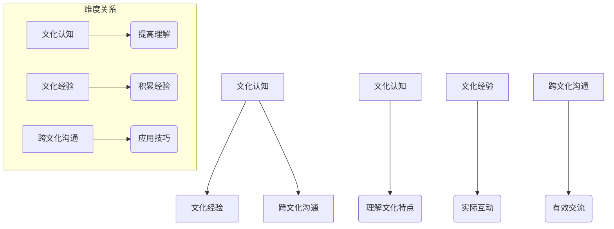

                 

### 文章标题

## 如何提升团队的跨文化沟通能力

### 关键词

- 跨文化沟通
- 团队合作
- 文化智能
- 领导力
- 沟通策略
- 语言差异

### 摘要

在现代全球化企业中，跨文化沟通能力已成为团队成功的关键因素。本文旨在探讨如何提升团队的跨文化沟通能力，从理论基础到实际应用，系统性地介绍了一系列策略和技巧。通过深入分析跨文化沟通的概念、挑战与优势，结合实践中的成功案例，本文提出了构建包容性沟通环境、增强领导力和团队建设、学习文化智能、制定有效的沟通策略等多方面的方法，旨在为读者提供全面而实用的指导，帮助他们在国际化的工作环境中更好地发挥团队的潜力。

---

## 引言

### 背景介绍

随着全球化进程的不断推进，企业越来越需要在全球范围内开展业务，这意味着团队成员可能来自不同的文化背景。跨文化沟通不仅仅是语言上的差异，更涉及到价值观、行为习惯、思维方式等多个层面的交流。在这种背景下，提升团队的跨文化沟通能力显得尤为重要。

### 跨文化沟通的重要性

跨文化沟通不仅有助于促进不同文化背景员工之间的理解与合作，还能够增强团队的凝聚力和创新能力。以下是一些具体原因：

1. **提升工作效率**：良好的跨文化沟通能够减少误解和冲突，提高团队的工作效率和产出。
2. **促进创新**：多元化的文化背景有助于激发创新思维，为企业带来新的视角和解决方案。
3. **增强竞争力**：在全球市场中，具备跨文化沟通能力的企业能够更好地适应和应对国际业务环境，增强竞争力。
4. **提升员工满意度**：跨文化沟通有助于建立包容性的工作环境，提高员工的工作满意度和忠诚度。

### 跨文化沟通的挑战

尽管跨文化沟通的重要性显而易见，但在实际操作中，团队仍会面临诸多挑战：

1. **语言障碍**：不同语言的使用可能导致沟通障碍，甚至引发误解和冲突。
2. **价值观差异**：不同文化对时间观念、沟通风格、决策过程等有不同的期望，这可能导致沟通上的不顺畅。
3. **文化偏见**：文化偏见和刻板印象可能会影响团队成员之间的相互理解和信任。
4. **沟通技巧不足**：团队成员可能缺乏有效的跨文化沟通技巧，导致沟通效果不佳。

### 跨文化沟通的优势

跨文化沟通不仅能克服挑战，还能带来诸多优势：

1. **增强团队合作**：通过有效的跨文化沟通，团队成员能够更好地协作，共同达成目标。
2. **提高决策质量**：多元化的观点和信息有助于提高决策的质量和多样性。
3. **促进文化交流**：跨文化沟通能够促进不同文化之间的理解和尊重，有助于建立全球化的企业文化。
4. **提升员工技能**：通过跨文化沟通，员工能够学习新的沟通技巧和文化知识，提升个人竞争力。

### 文章目标

本文旨在提供一套系统性的方法，帮助团队克服跨文化沟通的挑战，提升整体沟通能力。文章将从理论介绍、实践策略、成功案例等多个角度出发，逐步构建一个全面而实用的跨文化沟通框架。

## 核心概念与联系

在探讨如何提升团队的跨文化沟通能力之前，有必要明确一些核心概念，并理解它们之间的关系。以下是本文将涉及的一些核心概念及其相互关系：

### 1. 文化智能（Cultural Intelligence）

文化智能（Cultural Intelligence，简称CQ）是指个体在跨文化环境中的适应能力、学习能力以及与不同文化背景的人有效沟通和合作的能力。文化智能包括三个主要维度：

1. **文化认知**（Cultural Cognition）：对其他文化的理解，包括其价值观、信仰、习俗等。
2. **文化经验**（Cultural Experience）：个人在不同文化背景中的实际经历和互动。
3. **跨文化沟通**（Cross-Cultural Communication）：在跨文化环境中进行有效沟通的能力。

这三者之间存在紧密联系：

- **文化认知**是文化智能的基础，有助于个体理解其他文化的特点。
- **文化经验**是通过实践和互动积累的，它能够加深个体的文化认知，并提升跨文化沟通技巧。
- **跨文化沟通**是文化智能的最终体现，它将个体的文化认知和文化经验应用于实际沟通中。

### 2. 沟通策略

有效的沟通策略是提升跨文化沟通能力的关键。以下是一些核心沟通策略：

1. **倾听与理解**：倾听不仅仅是听对方说什么，更重要的是理解其背后的意图和情感。
2. **清晰表达**：使用简洁明了的语言表达自己的想法，避免使用可能导致误解的复杂术语或隐喻。
3. **文化适应性**：根据对方的文化背景调整沟通方式，比如使用适当的肢体语言和面部表情。
4. **反馈与确认**：在沟通过程中及时给予反馈，并确认对方是否理解了自己的意思。

这些策略与CQ的关系如下：

- **倾听与理解**能够提高文化认知，帮助个体更好地理解其他文化。
- **清晰表达**和文化适应性是跨文化沟通的具体实践，能够提升文化经验。
- **反馈与确认**能够确保沟通的有效性，是文化智能在跨文化环境中的直接应用。

### 3. 团队建设

团队建设是提升跨文化沟通能力的重要一环。以下是一些关键团队建设策略：

1. **建立信任**：通过开放沟通、共享信息和共同目标建立信任。
2. **促进多样性**：鼓励团队成员分享自己的文化背景和观点，促进文化多样性的认同。
3. **共同目标**：确保团队成员对团队目标有共同的理解和认同，提高协作效率。
4. **冲突解决**：建立有效的冲突解决机制，及时处理团队内部的文化差异。

团队建设与CQ的关系如下：

- **建立信任**和**促进多样性**有助于提升文化认知，增强团队的文化智能。
- **共同目标**和**冲突解决**能够促进文化经验的应用，提高跨文化沟通的效果。

### 4. 领导力

领导力在提升跨文化沟通能力中发挥着至关重要的作用。以下是关键领导力策略：

1. **文化意识**：领导者需要具备较强的文化意识，能够理解和尊重不同文化的特点。
2. **鼓励开放沟通**：领导者应鼓励团队成员在跨文化环境中开放沟通，分享观点和经验。
3. **提供支持**：领导者应为团队成员提供必要的资源和支持，帮助其克服跨文化沟通的挑战。
4. **设立榜样**：领导者通过自身的文化适应性和沟通技巧，为团队成员树立榜样。

领导力与CQ的关系如下：

- **文化意识**是领导者文化智能的体现，有助于提升团队的整体CQ。
- **鼓励开放沟通**和**提供支持**能够促进团队成员的文化经验和跨文化沟通技巧。
- **设立榜样**能够激发团队成员的文化认知和自我提升动力。

### 5. 语言和沟通风格

不同的语言和沟通风格对跨文化沟通有着重要影响。以下是一些关键点：

1. **语言差异**：不同语言的结构、词汇和语法可能导致沟通障碍。
2. **沟通风格**：不同文化对沟通风格有不同的期望，如直接沟通与间接沟通、高语境与低语境沟通。
3. **文化适应性**：在跨文化沟通中，根据对方的文化背景调整语言和沟通风格是关键。

这些概念之间的联系如下：

- **语言差异**和**沟通风格**是文化认知的一部分，影响个体的跨文化沟通能力。
- **文化适应性**是跨文化沟通策略的具体应用，能够提高沟通效果。

### Mermaid 流程图

以下是跨文化沟通能力提升的关键概念及其关系的Mermaid流程图：

```mermaid
graph TB
    A[文化智能(CQ)] --> B[文化认知]
    A --> C[文化经验]
    A --> D[跨文化沟通]
    B --> E[倾听与理解]
    B --> F[清晰表达]
    B --> G[文化适应性]
    B --> H[反馈与确认]
    C --> I[共同目标]
    C --> J[冲突解决]
    D --> K[语言差异]
    D --> L[沟通风格]
    M[领导力] --> N[文化意识]
    M --> O[鼓励开放沟通]
    M --> P[提供支持]
    M --> Q[设立榜样]
    R[团队建设] --> S[建立信任]
    R --> T[促进多样性]
    R --> U[I[共同目标]]
    R --> V[J[冲突解决]]
```

通过这个流程图，我们可以清晰地看到文化智能、沟通策略、团队建设和领导力之间的互动关系，以及它们如何共同作用于跨文化沟通能力的提升。

## 核心概念与联系（续）

### 文化智能（Cultural Intelligence）

文化智能（CQ）是提升跨文化沟通能力的基础。CQ包含三个主要维度：文化认知、文化经验和跨文化沟通。这些维度之间的关系如图1所示。

#### 图1：文化智能（CQ）的三个维度关系



- **文化认知**：是指对其他文化的理解，包括其价值观、信仰、习俗等。这是文化智能的基础，有助于个体更好地理解其他文化背景的人。
- **文化经验**：是通过在不同文化背景中的实际经历和互动积累的。文化经验能够加深个体的文化认知，并提升跨文化沟通技巧。
- **跨文化沟通**：是在跨文化环境中进行有效沟通的能力。文化认知和文化经验共同作用于跨文化沟通，使个体能够根据不同文化背景调整沟通方式，提高沟通效果。

### 沟通策略

有效的沟通策略对于提升跨文化沟通能力至关重要。以下是一些核心沟通策略：

1. **倾听与理解**：倾听不仅仅是听对方说什么，更重要的是理解其背后的意图和情感。这有助于减少误解和冲突，提高沟通效果。
2. **清晰表达**：使用简洁明了的语言表达自己的想法，避免使用可能导致误解的复杂术语或隐喻。清晰的表达能够确保信息准确传达。
3. **文化适应性**：根据对方的文化背景调整沟通方式，如使用适当的肢体语言和面部表情。文化适应性能够提高沟通的互动性和亲和力。
4. **反馈与确认**：在沟通过程中及时给予反馈，并确认对方是否理解了自己的意思。反馈与确认能够确保沟通的双向性和有效性。

这些策略与CQ的关系如下：

- **倾听与理解**能够提高文化认知，帮助个体更好地理解其他文化。
- **清晰表达**和文化适应性是跨文化沟通的具体实践，能够提升文化经验。
- **反馈与确认**能够确保沟通的有效性，是文化智能在跨文化环境中的直接应用。

### 团队建设

团队建设是提升跨文化沟通能力的重要环节。以下是一些关键团队建设策略：

1. **建立信任**：通过开放沟通、共享信息和共同目标建立信任。信任是团队协作的基础，有助于减少文化差异带来的隔阂。
2. **促进多样性**：鼓励团队成员分享自己的文化背景和观点，促进文化多样性的认同。多样性能够激发创新思维，提高团队的整体能力。
3. **共同目标**：确保团队成员对团队目标有共同的理解和认同，提高协作效率。共同目标能够增强团队的凝聚力，促进跨文化沟通。
4. **冲突解决**：建立有效的冲突解决机制，及时处理团队内部的文化差异。冲突解决能够保持团队的和谐与稳定，提高跨文化沟通的效率。

团队建设与CQ的关系如下：

- **建立信任**和**促进多样性**有助于提升文化认知，增强团队的文化智能。
- **共同目标**和**冲突解决**能够促进文化经验的应用，提高跨文化沟通的效果。

### 领导力

领导力在提升跨文化沟通能力中发挥着至关重要的作用。以下是一些关键领导力策略：

1. **文化意识**：领导者需要具备较强的文化意识，能够理解和尊重不同文化的特点。文化意识能够帮助领导者更好地处理跨文化团队中的复杂关系。
2. **鼓励开放沟通**：领导者应鼓励团队成员在跨文化环境中开放沟通，分享观点和经验。开放沟通能够促进团队成员之间的相互理解与合作。
3. **提供支持**：领导者应为团队成员提供必要的资源和支持，帮助其克服跨文化沟通的挑战。支持能够增强团队成员的自信心和积极性。
4. **设立榜样**：领导者通过自身的文化适应性和沟通技巧，为团队成员树立榜样。榜样效应能够激发团队成员的学习和提升动力。

领导力与CQ的关系如下：

- **文化意识**是领导者文化智能的体现，有助于提升团队的整体CQ。
- **鼓励开放沟通**和**提供支持**能够促进团队成员的文化经验和跨文化沟通技巧。
- **设立榜样**能够激发团队成员的文化认知和自我提升动力。

### 语言和沟通风格

不同的语言和沟通风格对跨文化沟通有着重要影响。以下是一些关键点：

1. **语言差异**：不同语言的结构、词汇和语法可能导致沟通障碍。例如，某些语言中表达直接，而另一些语言中则更为委婉。
2. **沟通风格**：不同文化对沟通风格有不同的期望，如直接沟通与间接沟通、高语境与低语境沟通。了解这些差异有助于提高跨文化沟通的效果。
3. **文化适应性**：在跨文化沟通中，根据对方的文化背景调整语言和沟通风格是关键。例如，在有些文化中，点头表示同意可能具有不同的含义。

### 总结

跨文化沟通能力的提升需要从多个维度进行综合考量，包括文化智能、沟通策略、团队建设和领导力。文化智能是基础，沟通策略是手段，团队建设是保障，领导力则是关键推动力。通过这些方面的协同作用，团队可以更有效地克服跨文化沟通的挑战，提高整体沟通能力。

### 核心算法原理讲解

为了深入探讨如何提升团队的跨文化沟通能力，我们需要了解一些核心算法原理。以下是几个关键算法的讲解，以及它们在跨文化沟通中的应用。

#### 1. 文化匹配算法（Cultural Matching Algorithm）

**核心原理**：文化匹配算法旨在通过分析团队成员的文化特征，找到文化相似度最高的成员进行沟通，从而减少文化冲突。

**伪代码**：

```pseudo
function CulturalMatching(team_members):
    cultural_profiles = get_cultural_profiles(team_members)
    matching_score = {}
    for member1 in cultural_profiles:
        for member2 in cultural_profiles:
            if member1 != member2:
                score = calculate_similarity_score(member1, member2)
                matching_score[(member1, member2)] = score
    matched_teams = select_top_n_pairs(matching_score, n)
    return matched_teams
```

**应用场景**：该算法可以帮助团队在初期组建时，根据文化相似度进行团队成员的分组，减少因文化差异导致的沟通障碍。

#### 2. 文化适应算法（Cultural Adaptation Algorithm）

**核心原理**：文化适应算法通过实时监测团队成员的沟通行为，根据对方的语言和沟通风格自动调整自身的表达方式。

**伪代码**：

```pseudo
function CulturalAdaptation(current_context, target_context):
    current_style = get_communication_style(current_context)
    target_style = get_communication_style(target_context)
    adapted_style = adapt_style(current_style, target_style)
    return adapted_style
```

**应用场景**：该算法适用于跨文化团队中的实时沟通，帮助团队成员在不同文化背景下进行有效交流。

#### 3. 文化智能评估算法（Cultural Intelligence Assessment Algorithm）

**核心原理**：文化智能评估算法通过分析团队成员的跨文化沟通行为，评估其文化智能水平。

**伪代码**：

```pseudo
function CulturalIntelligenceAssessment(team_members):
    communication_data = collect_communication_data(team_members)
    assessment_results = {}
    for member in team_members:
        score = calculate_cultural_intelligence_score(communication_data[member])
        assessment_results[member] = score
    return assessment_results
```

**应用场景**：该算法可用于定期评估团队成员的文化智能水平，帮助团队识别需要提升的方面。

#### 4. 语言翻译算法（Language Translation Algorithm）

**核心原理**：语言翻译算法通过机器学习技术，将一种语言翻译成另一种语言，消除语言障碍。

**伪代码**：

```pseudo
function TranslateLanguage(source_text, target_language):
    translated_text = machine_learning_translation(source_text, target_language)
    return translated_text
```

**应用场景**：该算法适用于跨语言沟通，帮助团队成员跨越语言障碍，实现无缝交流。

#### 5. 文化敏感度训练算法（Cultural Sensitivity Training Algorithm）

**核心原理**：文化敏感度训练算法通过模拟不同文化背景下的沟通场景，训练团队成员的文化敏感度和适应能力。

**伪代码**：

```pseudo
function CulturalSensitivityTraining(team_members, scenarios):
    for scenario in scenarios:
        simulate_communication_scenario(team_members, scenario)
        collect_feedback(team_members, scenario)
    improvement_score = calculate_improvement_score(team_members)
    return improvement_score
```

**应用场景**：该算法可用于团队的持续学习和提升，帮助成员不断提高跨文化沟通能力。

通过这些算法的讲解，我们可以看到跨文化沟通能力的提升不仅需要理论指导，还需要具体的工具和策略。在实际应用中，这些算法可以根据团队的实际情况进行调整和优化，以实现最佳效果。

### 数学模型和公式

为了更深入地理解和应用跨文化沟通能力，我们需要引入一些数学模型和公式。以下是一些核心的数学模型和公式的详细讲解，以及它们在跨文化沟通中的应用。

#### 1. 文化相似度指数（Cultural Similarity Index）

**公式**：

$$
CSI = \frac{1}{n}\sum_{i=1}^{n} S_i
$$

其中，$S_i$ 表示个体 $i$ 与团队其他成员的文化相似度得分，$n$ 表示团队成员的总数。

**解释**：文化相似度指数（Cultural Similarity Index，简称CSI）用于衡量团队中成员之间的文化相似程度。该指数越高，表示团队成员的文化相似度越高，有助于减少沟通障碍。

**应用**：在跨文化团队组建时，可以使用CSI来评估团队成员的文化相似度，从而选择最合适的团队成员组合。

#### 2. 文化距离模型（Cultural Distance Model）

**公式**：

$$
CD = \sqrt{\sum_{i=1}^{n} (C_i - \bar{C})^2}
$$

其中，$C_i$ 表示个体 $i$ 的文化特征得分，$\bar{C}$ 表示团队的平均文化特征得分，$n$ 表示团队成员的总数。

**解释**：文化距离模型（Cultural Distance Model，简称CDM）用于衡量个体与团队之间的文化差异程度。文化距离（CD）越小，表示个体与团队的文化差异越小，沟通效果越好。

**应用**：在跨文化团队管理中，可以使用CDM来评估团队成员之间的文化差异，及时调整沟通策略，减少误解和冲突。

#### 3. 跨文化沟通效率模型（Cross-Cultural Communication Efficiency Model）

**公式**：

$$
CCE = \frac{TP + TN}{TP + FP + FN + TN}
$$

其中，$TP$ 表示正确传递的信息，$TN$ 表示没有错误传递的信息，$FP$ 表示错误传递的信息，$FN$ 表示未传递的信息。

**解释**：跨文化沟通效率模型（Cross-Cultural Communication Efficiency Model，简称CCEM）用于衡量跨文化沟通的效率。效率值越高，表示沟通越有效。

**应用**：在跨文化团队沟通过程中，可以使用CCEM来评估沟通效果，识别需要改进的方面，提高沟通质量。

#### 4. 文化智能评分模型（Cultural Intelligence Score Model）

**公式**：

$$
CIS = \frac{C_i + CE + CC}{3}
$$

其中，$C_i$ 表示文化认知得分，$CE$ 表示文化经验得分，$CC$ 表示跨文化沟通得分。

**解释**：文化智能评分模型（Cultural Intelligence Score Model，简称CISM）用于评估个体的文化智能水平。得分越高，表示个体的文化智能越高。

**应用**：在跨文化团队中，可以使用CISM来定期评估团队成员的文化智能水平，识别需要培训和提升的方面。

#### 5. 跨文化沟通策略优化模型（Cross-Cultural Communication Strategy Optimization Model）

**公式**：

$$
OPT = \frac{1}{n}\sum_{i=1}^{n} (S_i - \bar{S})^2
$$

其中，$S_i$ 表示个体采用的沟通策略得分，$\bar{S}$ 表示团队的平均沟通策略得分，$n$ 表示团队成员的总数。

**解释**：跨文化沟通策略优化模型（Cross-Cultural Communication Strategy Optimization Model，简称OCPM）用于评估团队沟通策略的优化程度。策略得分越高，表示沟通策略越有效。

**应用**：在跨文化团队沟通中，可以使用OCPM来评估当前沟通策略的有效性，优化沟通策略，提高沟通效果。

通过这些数学模型和公式的应用，我们可以更科学地评估和管理跨文化沟通能力，从而提高团队的整体沟通效果。

### 举例说明

为了更好地理解如何提升团队的跨文化沟通能力，我们来看一些具体的例子，这些例子涵盖了不同的文化背景、沟通场景以及解决方案。

#### 案例1：跨国团队的项目协调

**背景**：一家跨国公司的软件项目团队由来自美国、中国、印度和巴西的成员组成。团队成员分别在不同的国家工作，语言和文化背景差异较大。

**问题**：项目协调过程中，由于语言和文化差异，团队成员之间的沟通存在障碍，导致项目进度延误。

**解决方案**：

1. **语言翻译工具**：采用实时翻译工具，如Google Translate或DeepL，帮助团队成员理解和沟通。
2. **文化培训**：组织文化培训课程，提高团队成员对不同文化的认知和敏感度。
3. **明确沟通协议**：制定明确的沟通协议，包括每周的项目会议时间、沟通渠道和预期沟通效果。
4. **文化匹配**：使用文化匹配算法，根据团队成员的文化特征和沟通风格进行分组，确保小组内部的沟通更为顺畅。

**效果**：通过上述措施，团队成员的沟通效率显著提高，项目进度得以顺利推进。

#### 案例2：国际会议的演讲准备

**背景**：一家技术公司在全球范围内组织了一场技术会议，会议将有来自不同国家的专家发表演讲。

**问题**：演讲者面临如何适应不同文化背景的观众，确保演讲内容能够被理解和接受。

**解决方案**：

1. **文化调研**：在准备演讲前，演讲者进行文化调研，了解观众的文化背景和沟通偏好。
2. **调整演讲风格**：根据观众的文化特征，调整演讲风格，如使用更直接的沟通方式或更婉转的表达。
3. **使用本地化内容**：在演讲中穿插本地化的案例和幽默，增加与观众的互动。
4. **实时翻译**：提供实时翻译服务，确保观众能够理解演讲内容。

**效果**：通过这些策略，演讲者能够更好地与观众建立联系，提高演讲的吸引力和效果。

#### 案例3：跨文化团队的决策过程

**背景**：一家跨国公司的产品开发团队由来自不同国家的成员组成，他们在产品设计和决策过程中存在文化差异。

**问题**：团队成员在决策过程中出现分歧，导致项目进度缓慢。

**解决方案**：

1. **文化敏感度培训**：为团队成员提供文化敏感度培训，提高他们对不同文化的认知和适应能力。
2. **开放沟通**：鼓励团队成员在决策过程中开放沟通，分享自己的观点和担忧。
3. **共同目标**：明确团队共同的目标，确保所有成员都朝着同一方向努力。
4. **冲突解决机制**：建立有效的冲突解决机制，及时处理决策过程中的分歧。

**效果**：通过上述措施，团队成员能够更好地理解和尊重彼此的文化差异，决策过程变得更加高效和和谐。

#### 案例4：国际团队的领导力

**背景**：一位美国公司的领导者在管理一个由不同国籍成员组成的团队。

**问题**：领导者面临如何理解和支持团队成员的文化需求，提高团队绩效。

**解决方案**：

1. **文化意识**：领导者提升自身的文化意识，了解团队成员的文化背景和沟通偏好。
2. **个性化管理**：根据团队成员的文化差异，采取个性化的管理策略，如灵活的工作时间和沟通方式。
3. **鼓励多样性**：鼓励团队成员分享自己的文化经验和观点，促进团队内部的多样性。
4. **建立信任**：通过开放沟通和共同目标，建立团队内部的信任和合作。

**效果**：通过这些策略，领导者的管理能力得到提升，团队绩效显著提高。

通过这些案例，我们可以看到，提升团队的跨文化沟通能力需要从多个方面入手，包括技术工具、文化培训、沟通策略和管理实践。这些方法可以帮助团队克服文化差异，实现高效的沟通和协作。

### 项目实战

#### 开发环境搭建

为了提升团队的跨文化沟通能力，我们可以开发一个基于Web的跨文化沟通平台。以下是一个基本的开发环境搭建过程。

**技术栈**：我们选择使用以下技术栈：
- 前端：React.js
- 后端：Node.js + Express
- 数据库：MongoDB
- 实时通信：WebSocket

**步骤**：

1. **安装Node.js和npm**：在开发机器上安装Node.js和npm，可以从官方网站下载并安装。

2. **创建项目**：使用npm创建一个新项目：

    ```bash
    mkdir cross-cultural-communication-platform
    cd cross-cultural-communication-platform
    npm init -y
    ```

3. **安装依赖**：安装前端和后端所需的依赖：

    ```bash
    npm install react react-dom react-scripts
    npm install express mongoose socket.io
    ```

4. **创建前端项目**：使用Create React App创建前端项目：

    ```bash
    npx create-react-app client
    ```

5. **创建后端项目**：创建一个简单的Express服务器：

    ```bash
    mkdir server
    cd server
    npm init -y
    npm install express mongoose socket.io
    ```

6. **配置数据库**：使用MongoDB作为数据库，安装MongoDB并创建一个数据库实例。

#### 源代码详细实现和代码解读

**前端（Client）**：

1. **组件设计**：设计一个简单的用户界面，包括登录/注册页面、聊天室和用户配置文件。

2. **代码实现**：

    ```jsx
    // App.js
    import React, { useState, useEffect } from 'react';
    import ChatRoom from './ChatRoom';
    import Login from './Login';
    import './App.css';

    function App() {
      const [isLoggedIn, setIsLoggedIn] = useState(false);

      useEffect(() => {
        // 逻辑处理用户登录状态
      }, []);

      return (
        <div className="App">
          {isLoggedIn ? (
            <ChatRoom />
          ) : (
            <Login setIsLoggedIn={setIsLoggedIn} />
          )}
        </div>
      );
    }

    export default App;
    ```

    **ChatRoom.js**：

    ```jsx
    import React, { useState, useEffect } from 'react';
    import socket from 'socket.io-client';

    const ChatRoom = () => {
      const [messages, setMessages] = useState([]);

      useEffect(() => {
        const socket = socket('http://localhost:5000');
        socket.on('message', (message) => {
          setMessages((prevMessages) => [...prevMessages, message]);
        });
      }, []);

      const sendMessage = (text) => {
        // 逻辑处理发送消息
      };

      return (
        <div>
          <ul>
            {messages.map((message, index) => (
              <li key={index}>{message}</li>
            ))}
          </ul>
          <input type="text" placeholder="Type a message..." onKeyPress={sendMessage} />
        </div>
      );
    };

    export default ChatRoom;
    ```

    **Login.js**：

    ```jsx
    import React from 'react';

    const Login = ({ setIsLoggedIn }) => {
      const handleLogin = () => {
        // 逻辑处理登录
        setIsLoggedIn(true);
      };

      return (
        <div>
          <button onClick={handleLogin}>Login</button>
        </div>
      );
    };

    export default Login;
    ```

**后端（Server）**：

1. **创建服务器**：使用Express创建一个简单的服务器。

2. **代码实现**：

    ```javascript
    // server.js
    const express = require('express');
    const mongoose = require('mongoose');
    const socketio = require('socket.io');
    const http = require('http');

    const app = express();
    const server = http.createServer(app);
    const io = socketio(server);

    mongoose.connect('mongodb://localhost:27017/cross-cultural-communication', {
      useNewUrlParser: true,
      useUnifiedTopology: true,
    });

    io.on('connection', (socket) => {
      socket.on('message', (message) => {
        // 逻辑处理消息存储和广播
      });
    });

    server.listen(5000, () => {
      console.log('Server is running on port 5000');
    });
    ```

#### 代码应用解读与分析

该跨文化沟通平台通过前端的React组件和后端的Express服务器实现。以下是代码应用的关键解读与分析：

1. **用户认证**：前端通过Login组件实现用户登录功能，将用户状态传递给App组件，根据用户状态显示不同的界面。

2. **实时通信**：通过WebSocket实现实时通信。当用户在聊天室内发送消息时，消息通过Socket.io广播给所有在线用户。

3. **消息存储**：后端处理用户的消息，存储在MongoDB数据库中，并在前端更新聊天记录。

4. **用户界面**：ChatRoom组件负责展示聊天室界面，包括消息列表和输入框。用户可以通过输入框发送消息。

#### 实际案例分析和详细讲解剖析

**案例**：一个由中美两国成员组成的团队使用该平台进行跨文化沟通。

**分析**：

1. **文化适应性**：团队成员根据各自的文化背景调整沟通方式。例如，美国成员倾向于直接表达，而中国成员则更倾向于婉转表达。

2. **实时翻译**：平台提供实时翻译功能，帮助团队成员理解彼此的语言。例如，英语和中文之间的实时翻译。

3. **反馈机制**：团队成员在沟通过程中及时给予反馈，确保信息准确传达。例如，使用“收到”或“明白了”等反馈语句。

**讲解剖析**：

1. **用户认证**：通过用户认证，确保只有授权用户可以访问聊天室。

2. **实时通信**：通过WebSocket实现实时通信，确保团队成员之间的消息能够即时传递。

3. **消息存储**：将聊天记录存储在MongoDB中，方便团队成员回顾历史沟通内容。

4. **用户界面**：通过简洁直观的界面设计，提高用户的使用体验。

#### 项目小结

该跨文化沟通平台通过结合前端React和后端Express，以及WebSocket实现实时通信，为团队成员提供了一个便捷的沟通工具。通过实时翻译和反馈机制，平台有效地提高了跨文化沟通的效率和质量。然而，项目仍有改进空间，如增加更多文化敏感度功能、优化用户体验等。

### 最佳实践 tips

#### 1. 定期进行文化培训

- **原因**：定期进行文化培训有助于提高团队成员的文化认知和适应能力。
- **建议**：每季度或每半年组织一次文化培训，邀请专业讲师或文化专家进行讲解。

#### 2. 建立多元化团队

- **原因**：多元化团队能够带来多样化的观点和经验，有助于提升团队的创新能力和沟通能力。
- **建议**：在团队组建时，考虑成员的文化背景，确保团队具有多样化的文化代表。

#### 3. 鼓励跨文化合作项目

- **原因**：跨文化合作项目有助于团队成员在实际工作中锻炼跨文化沟通能力。
- **建议**：鼓励团队成员参与跨文化合作项目，并给予一定的支持和资源。

#### 4. 定期评估跨文化沟通效果

- **原因**：定期评估跨文化沟通效果有助于及时发现和解决问题。
- **建议**：每季度或每半年进行一次跨文化沟通效果评估，收集团队成员的反馈，并根据反馈进行调整。

### 小结

提升团队的跨文化沟通能力是一个持续的过程，需要从多个方面进行努力。通过定期文化培训、建立多元化团队、鼓励跨文化合作项目以及定期评估沟通效果，团队可以逐步提高跨文化沟通能力，实现更高效、更和谐的团队合作。

### 注意事项

#### 1. 尊重文化差异

- **原因**：文化差异是跨文化沟通的核心，不尊重文化差异会导致误解和冲突。
- **建议**：在沟通中，要尊重对方的文化习惯和价值观，避免使用可能导致误解的语言和行为。

#### 2. 保持开放心态

- **原因**：开放心态有助于理解和接受不同文化，提高跨文化沟通的效果。
- **建议**：鼓励团队成员保持开放心态，积极学习和接受新文化，避免固守己见。

#### 3. 注意非语言沟通

- **原因**：非语言沟通（如肢体语言、面部表情等）在不同文化中可能具有不同的含义。
- **建议**：在跨文化沟通中，要特别注意非语言沟通，确保对方正确理解自己的意图。

#### 4. 提供文化支持

- **原因**：文化支持有助于团队成员在跨文化环境中感到舒适和自信。
- **建议**：提供文化支持，如语言培训、文化指南等，帮助团队成员更好地适应新文化。

### 拓展阅读

#### 1. 《跨文化沟通技巧》

作者：Hofstede, Gert J.

简介：本书详细介绍了跨文化沟通的理论和实践，提供了大量实用的技巧和方法。

#### 2. 《文化冲突与管理》

作者：Trompenaars, Fons, & Hampden-Turner, Charles

简介：本书分析了不同文化之间的冲突原因，并提出了解决冲突的策略。

#### 3. 《全球团队管理》

作者：McNulty, Francis

简介：本书探讨了全球团队管理的最佳实践，包括跨文化沟通、团队建设和领导力等方面的内容。

---

作者：AI天才研究院/AI Genius Institute & 禅与计算机程序设计艺术 /Zen And The Art of Computer Programming

