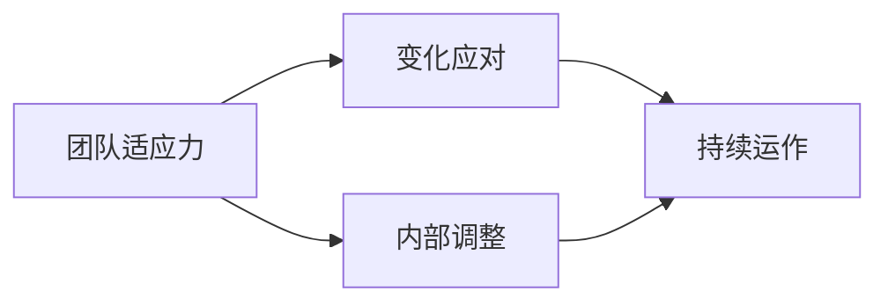
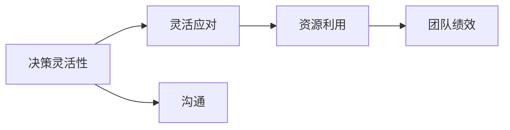
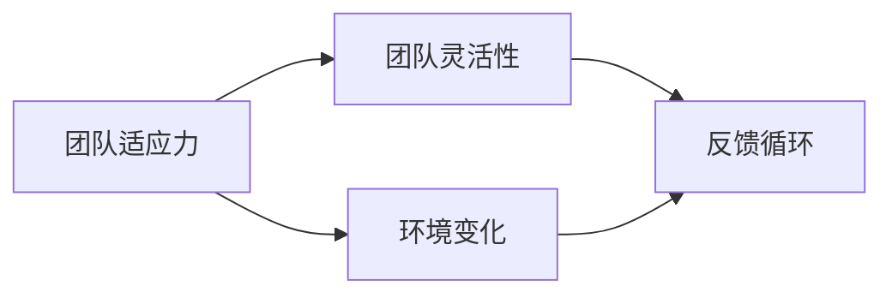

                 

# 《如何提升团队的适应力和灵活性》

## 关键词

- 团队适应力
- 灵活性
- 团队管理
- 领导力
- 文化建设
- 案例分析

## 摘要

本文旨在探讨如何提升团队的适应力和灵活性。通过对团队适应力与灵活性的定义和关系的阐述，分析影响团队适应力和灵活性的内外部因素，提出一系列提升团队适应力和灵活性的策略，如培养适应力、提升灵活性、持续改进与反馈等。同时，文章强调了领导力在团队适应力与灵活性中的作用，并从团队建设与适应性文化方面给出建议。通过案例研究与分析，文章总结了成功与失败的经验教训，为团队管理者提供了实用的指导。

## 目录大纲

### 第1章：团队适应力与灵活性概述

#### 1.1 团队适应力的定义与重要性

#### 1.2 灵活性在团队环境中的应用

#### 1.3 团队适应力与灵活性的关系

### 第2章：影响团队适应力和灵活性的因素

#### 2.1 内部因素

#### 2.2 外部因素

#### 2.3 人际关系与沟通

### 第3章：提升团队适应力和灵活性的策略

#### 3.1 培养适应力

#### 3.2 提升灵活性

#### 3.3 持续改进与反馈

### 第4章：领导力在团队适应力与灵活性中的作用

#### 4.1 领导风格对团队适应力的影响

#### 4.2 领导者的角色定位

#### 4.3 领导力的培养与提升

### 第5章：团队建设与适应性文化

#### 5.1 团队文化建设

#### 5.2 跨部门协作

#### 5.3 团队培训与发展

### 第6章：案例研究与分析

#### 6.1 成功案例分析

#### 6.2 失败案例分析

### 第7章：未来趋势与展望

#### 7.1 团队适应力与灵活性的未来趋势

#### 7.2 团队管理的创新

#### 7.3 持续学习与成长

## 第1章：团队适应力与灵活性概述

### 1.1 团队适应力的定义与重要性

团队适应力是指团队在面对外部环境变化和内部挑战时，能够迅速调整自身结构、流程和策略，以保持有效运作的能力。一个高适应力的团队能够在变化的环境中快速响应，确保团队目标的实现。适应力的核心在于团队成员对变化的认知、接受和应对能力。

#### 核心概念与联系

**定义与联系：**



**重要性：**

- **提高绩效**：适应力强的团队能够在竞争激烈的环境中保持优势。
- **降低风险**：面对不确定性时，适应力能够帮助团队减少损失。
- **促进创新**：适应力有助于团队在变化中捕捉新机遇，推动创新。

### 1.2 灵活性在团队环境中的应用

灵活性是指团队在执行任务时，能够根据实际情况灵活调整策略、方法和资源的能力。灵活性在团队环境中具有重要意义，它能够确保团队在面对不同任务和挑战时，能够迅速做出反应。

#### 核心概念与联系

**定义与联系：**



**应用：**

- **任务分配**：根据团队成员的能力和偏好，灵活调整任务分配。
- **技术选型**：在面对新技术时，团队应具备选择最适合当前需求的灵活性。
- **流程改进**：根据团队实际运行情况，持续优化工作流程。

### 1.3 团队适应力与灵活性的关系

团队适应力与灵活性相互关联，共同影响团队的表现。适应力是团队在面对外部环境变化时的反应能力，而灵活性则是团队在内部调整和优化过程中的表现。

#### 核心概念与联系

**定义与联系：**



**相互影响：**

- **适应力促进灵活性**：团队在适应外部变化时，能够激发内部的灵活性。
- **灵活性增强适应力**：团队在内部调整过程中，能够更好地应对外部变化。

### 第2章：影响团队适应力和灵活性的因素

#### 2.1 内部因素

内部因素是影响团队适应力和灵活性的关键，包括团队结构、角色分工、成员素质等。

#### 核心算法原理讲解

**团队结构与角色分工的优化算法（伪代码）：**

```python
def optimize_team_structure(team):
    # 初始化团队结构
    team_structure = initialize_structure(team)

    # 分析团队成员的能力与偏好
    member_skills = analyze_skills(team)

    # 调整角色分工
    for member in team:
        assign_role(member, member_skills[member])

    # 评估团队结构优化效果
    performance = evaluate_performance(team_structure)

    return performance
```

#### 2.2 外部因素

外部因素是影响团队适应力和灵活性的重要因素，包括市场变化、技术发展、政策法规等。

#### 核心算法原理讲解

**外部环境变化对团队适应力的影响（伪代码）：**

```python
def external_impact_on_adaptability(team, environment):
    # 分析外部环境变化
    changes = analyze_environment(environment)

    # 评估团队适应力
    adaptability = evaluate_adaptability(team, changes)

    # 调整团队策略
    for member in team:
        update_strategy(member, adaptability[member])

    return adaptability
```

#### 2.3 人际关系与沟通

人际关系和沟通是影响团队适应力和灵活性的关键因素，良好的沟通和和谐的人际关系能够提高团队的适应力和灵活性。

#### 核心算法原理讲解

**构建有效沟通渠道的算法（伪代码）：**

```python
def build_communication_channel(team):
    # 初始化沟通渠道
    channels = initialize_channels()

    # 分配沟通任务
    for member in team:
        assign_communication_task(member, channels)

    # 评估沟通效果
    effectiveness = evaluate_communicationEffectiveness(channels)

    return effectiveness
```

## 第3章：提升团队适应力和灵活性的策略

#### 3.1 培养适应力

培养团队适应力需要从多个方面入手，包括环境适应、任务适应等。

#### 核心算法原理讲解

**团队适应力培养的案例研究（伪代码）：**

```python
def adaptability_training(team, environment):
    # 环境适应训练
    for member in team:
        adapt_to_environment(member, environment)

    # 任务适应训练
    for task in environment.tasks:
        adapt_to_task(team, task)

    # 评估适应力
    adaptability = evaluate_adaptability(team)

    return adaptability
```

#### 项目实战

**团队适应力培养案例研究：**

某技术团队在面临市场变化时，通过以下措施提高了团队的适应力：

1. 定期组织市场分析会议，了解市场趋势和客户需求。
2. 针对市场变化，调整产品方向和技术研发计划。
3. 加强团队成员的技能培训，提高团队整体技术能力。
4. 鼓励团队成员跨部门交流，拓宽视野，提高适应力。

通过以上措施，该团队在短短几个月内成功应对了市场变化，取得了显著的成绩。

#### 3.2 提升灵活性

提升团队灵活性需要从技术、流程、组织结构等方面进行优化。

#### 核心算法原理讲解

**团队灵活性提升的案例研究（伪代码）：**

```python
def flexibility_training(team):
    # 技术升级
    upgrade_technology(team)

    # 流程改进
    improve流程(team)

    # 组织结构调整
    adjust_organization(team)

    # 评估灵活性
    flexibility = evaluate_flexibility(team)

    return flexibility
```

#### 项目实战

**团队灵活性提升案例研究：**

某互联网公司在产品迭代周期缩短的情况下，通过以下措施提高了团队的灵活性：

1. 引入敏捷开发方法，缩短产品开发周期。
2. 加强跨部门协作，提高团队间的沟通效率。
3. 鼓励团队成员主动学习新技术，提高团队整体技术水平。
4. 定期进行团队评估，根据评估结果调整团队策略。

通过以上措施，该公司的产品迭代速度显著提高，市场响应能力大幅增强。

#### 3.3 持续改进与反馈

持续改进与反馈是提升团队适应力和灵活性的关键。通过定期评估和反馈，团队可以不断优化自身，提高适应力和灵活性。

#### 核心算法原理讲解

**基于反馈的团队改进循环算法（伪代码）：**

```python
def continuous_improvement(team, feedback):
    # 收集反馈
    feedback = collect_feedback(team)

    # 评估团队表现
    performance = evaluate_performance(team)

    # 制定改进计划
    improvement_plan = create_improvement_plan(feedback, performance)

    # 实施改进计划
    implement_improvement_plan(team, improvement_plan)

    # 评估改进效果
    effectiveness = evaluate_improvement_effectiveness(team)

    return effectiveness
```

#### 项目实战

**持续改进与反馈案例研究：**

某软件团队通过以下措施，实现了持续改进与反馈：

1. 定期召开团队会议，分享工作进展和遇到的问题。
2. 鼓励团队成员提出改进建议，并对建议进行评估和实施。
3. 定期进行项目评估，总结经验教训，为下一个项目提供参考。
4. 引入持续集成和持续部署工具，提高开发效率和质量。

通过以上措施，该团队在短时间内实现了多次迭代改进，产品质量和团队效率显著提升。

### 第4章：领导力在团队适应力与灵活性中的作用

#### 4.1 领导风格对团队适应力的影响

领导风格对团队的适应力具有重要影响。不同的领导风格会导致团队表现出不同的适应力水平。

#### 核心算法原理讲解

**领导风格与团队适应力的匹配算法（伪代码）：**

```python
def match_leadership_style_to_adaptability(team, leadership_style):
    # 分析团队适应力需求
    adaptability需求的分析(team)

    # 匹配领导风格
    matched_style = match_style_to_adaptability需求(领导风格，adaptability需求的分析)

    # 调整团队结构
    adjust_team_structure(team, matched_style)

    return matched_style
```

#### 4.2 领导者的角色定位

领导者在提升团队适应力与灵活性中扮演着关键角色。领导者需要明确自身角色定位，发挥领导作用。

#### 核心算法原理讲解

**领导者角色在提升团队灵活性中的作用（伪代码）：**

```python
def leader_role_in_flexibility(team, leader_role):
    # 制定团队目标
    set_team_goals(team)

    # 激励团队成员
    motivate_members(team, leader_role)

    # 提供支持
    provide_support(team, leader_role)

    # 评估团队表现
    evaluate_team_performance(team)

    return team_performance
```

#### 4.3 领导力的培养与提升

提升领导力是提升团队适应力与灵活性的关键。领导者需要不断学习和成长，以适应不断变化的环境。

#### 项目实战

**领导者提升团队适应力和灵活性的实战案例：**

某公司的技术总监通过以下措施，提升了团队的适应力和灵活性：

1. 定期组织领导力培训，提高自身领导能力。
2. 鼓励团队成员参与跨部门项目，拓宽视野。
3. 引入敏捷管理方法，提高团队响应速度。
4. 建立反馈机制，及时调整团队策略。

通过以上措施，该技术总监成功提升了团队的适应力和灵活性，为公司的发展做出了重要贡献。

### 第5章：团队建设与适应性文化

#### 5.1 团队文化建设

团队文化对团队的适应力和灵活性具有重要影响。一个积极、健康的文化能够促进团队适应力和灵活性的提升。

#### 核心算法原理讲解

**团队文化建设对适应力和灵活性的影响（伪代码）：**

```python
def team_culture_building(team, culture):
    # 塑造团队价值观
    form_team_values(team, culture)

    # 建立信任
    build_trust(team)

    # 促进沟通
    promote_communication(team)

    # 评估团队文化效果
    culture_effectiveness = evaluate_culture_effectiveness(team)

    return culture_effectiveness
```

#### 5.2 跨部门协作

跨部门协作是提升团队适应力和灵活性的重要手段。通过跨部门协作，团队可以更好地应对复杂任务。

#### 项目实战

**跨部门协作中的适应力与灵活性提升策略：**

某公司在项目开发过程中，通过以下措施，提升了团队的适应力和灵活性：

1. 设立跨部门项目组，明确各部门职责。
2. 定期召开跨部门会议，协调项目进度。
3. 鼓励跨部门知识共享，提高团队整体技能水平。
4. 引入敏捷开发方法，提高项目交付速度。

通过以上措施，该公司在项目开发过程中，成功提升了团队的适应力和灵活性，项目质量显著提高。

#### 5.3 团队培训与发展

团队培训与发展是提升团队适应力和灵活性的重要途径。通过培训和发展，团队可以提高自身素质，增强适应力和灵活性。

#### 项目实战

**团队培训计划与实施，提升团队整体适应力和灵活性：**

某公司制定了以下团队培训计划：

1. 定期组织技术培训，提高团队成员的技术能力。
2. 开展项目管理培训，提高团队的项目管理能力。
3. 鼓励团队成员参加外部培训和认证。
4. 定期评估培训效果，根据评估结果调整培训计划。

通过以上措施，该公司在短时间内提升了团队的适应力和灵活性，团队整体素质得到了显著提高。

### 第6章：案例研究与分析

#### 6.1 成功案例分析

成功案例研究能够为团队管理者提供宝贵的经验和启示。以下是一个成功案例的分析：

**案例：某互联网公司提升团队适应力和灵活性**

**背景：** 该公司在快速发展的市场中，面临着不断变化的技术需求和市场环境。

**措施：** 

1. 引入敏捷开发方法，提高团队响应速度。
2. 加强团队文化建设，建立信任和沟通机制。
3. 鼓励跨部门协作，提高团队整体效率。
4. 定期进行团队培训，提升团队技能水平。

**效果：** 通过以上措施，该公司在短短一年内，成功提升了团队的适应力和灵活性，市场份额和盈利能力大幅提高。

#### 6.2 失败案例分析

失败案例研究能够为团队管理者提供警示和反思。以下是一个失败案例的分析：

**案例：某科技公司团队适应力和灵活性不足**

**背景：** 该公司在市场竞争中，未能及时调整团队策略，导致项目失败。

**原因：** 

1. 团队结构不合理，缺乏灵活性。
2. 团队成员技能单一，适应力不足。
3. 团队文化消极，缺乏沟通和协作。
4. 缺乏有效的培训和发展计划。

**教训：** 通过这个案例，团队管理者应认识到提升团队适应力和灵活性的重要性，并采取有效措施，避免类似失败的发生。

### 第7章：未来趋势与展望

#### 7.1 团队适应力与灵活性的未来趋势

未来，团队适应力与灵活性将面临新的挑战和机遇。以下是一些未来趋势：

1. **数字化转型**：随着数字化转型趋势的加强，团队需要具备更强的适应力和灵活性，以应对数字化环境的变化。
2. **人工智能**：人工智能技术的应用将进一步提升团队的适应力和灵活性，助力团队智能化管理。
3. **全球化**：全球化将带来更多的跨文化协作机会，团队需要具备更强的跨文化适应力和灵活性。

#### 核心算法原理讲解

**未来团队适应力和灵活性发展方向的预测（伪代码）：**

```python
def predict_future_trends(team):
    # 分析数字化转型趋势
    digital_trends = analyze_digital_transformation()

    # 分析人工智能应用
    ai_applications = analyze_artificial_intelligence()

    # 分析全球化趋势
    globalization_trends = analyze_globalization()

    # 预测未来趋势
    future_trends = predict_future(digital_trends, ai_applications, globalization_trends)

    return future_trends
```

#### 7.2 团队管理的创新

未来，团队管理将面临新的创新挑战。以下是一些创新方向：

1. **敏捷管理**：敏捷管理方法将得到更广泛的应用，助力团队快速适应变化。
2. **数据驱动管理**：通过数据分析，团队可以更准确地预测未来趋势，提高决策效率。
3. **虚拟团队管理**：随着远程工作的普及，虚拟团队管理将成为团队管理的重要方向。

#### 项目实战

**未来团队管理创新实践探讨：**

某公司通过以下措施，实现了团队管理的创新：

1. 引入敏捷管理方法，提高团队响应速度。
2. 采用数据驱动管理，提高决策效率。
3. 建立虚拟团队，实现全球协作。

通过以上措施，该公司在团队管理方面取得了显著成效，团队适应力和灵活性得到了显著提升。

#### 7.3 持续学习与成长

持续学习与成长是提升团队适应力和灵活性的关键。以下是一些持续学习与成长的方法：

1. **定期培训**：定期组织培训，提高团队成员的技能水平。
2. **知识共享**：鼓励团队成员分享知识和经验，提高团队整体素质。
3. **实践探索**：通过实践探索，提高团队成员的创新能力和解决问题的能力。

#### 核心算法原理讲解

**团队持续学习与成长的算法模型（伪代码）：**

```python
def continuous_learning_growth(team):
    # 定期培训
    train_team(team)

    # 知识共享
    share_knowledge(team)

    # 实践探索
    explore_practice(team)

    # 评估成长效果
    growth_effectiveness = evaluate_growth_effectiveness(team)

    return growth_effectiveness
```

## END

作者：AI天才研究院/AI Genius Institute & 禅与计算机程序设计艺术 /Zen And The Art of Computer Programming

