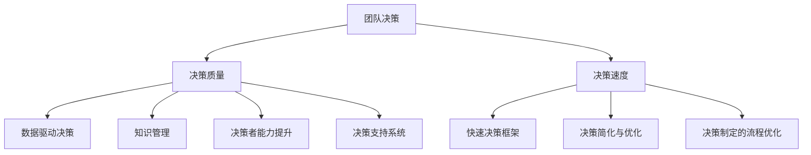

                 

### 文章标题

# 如何提高团队的决策质量和速度

### 关键词

- 团队决策
- 决策质量
- 决策速度
- 数据驱动
- 知识管理
- 决策支持系统

### 摘要

在快速变化和竞争激烈的市场环境中，提高团队的决策质量和速度对于企业的生存和发展至关重要。本文将从背景介绍、核心概念与联系、决策质量与速度的重要性、提高决策质量的策略、提高决策速度的技巧、团队协作与沟通、决策案例分析以及结论与展望等方面，详细探讨如何有效地提高团队决策的质量和速度，从而助力企业实现战略目标。

### 引言与背景

在当今全球化和数字化时代，企业的竞争环境日益复杂多变。面对市场的快速变化和激烈的竞争，企业必须能够快速响应、灵活调整，以保持竞争优势。在这个过程中，团队决策的质量和速度成为了决定企业成败的关键因素。

首先，我们需要明确团队决策的定义。团队决策是指在团队中通过集体讨论和合作，共同达成一致的决策过程。与个人决策相比，团队决策具有以下优势：

1. **多元化观点**：团队成员来自不同的背景和领域，能够提供多样化的观点和思路，有助于发现问题的多种解决方案。
2. **集体智慧**：通过团队成员的集体讨论和合作，能够综合各种信息和意见，形成更为全面和科学的决策。
3. **责任分担**：团队成员共同参与决策过程，能够分担决策风险和责任，降低个人决策失误带来的损失。

然而，团队决策也存在一些挑战，如沟通障碍、意见分歧、决策时间过长等。为了充分发挥团队决策的优势，同时克服其不足，我们需要关注如何提高团队的决策质量和速度。

### 决策质量与速度的重要性

决策质量是指决策的正确性和合理性，即决策结果能够有效解决问题、实现预期目标。决策速度则是指从问题识别到决策实施的时间长短。在企业的运营中，决策质量和速度具有以下重要意义：

1. **竞争优势**：高质量的决策能够帮助企业准确把握市场趋势、快速响应客户需求，从而在竞争中脱颖而出。而快速决策则能够使企业迅速调整策略，抢占市场先机。
2. **资源优化**：高效的决策能够优化资源配置，避免资源的浪费和重复投入，提高企业的运营效率。
3. **风险管理**：高质量的决策能够识别和应对潜在的风险，降低企业的运营风险。而快速决策则能够在风险发生时迅速采取应对措施，减少损失。

然而，在现实中，许多企业面临决策质量和速度的双重挑战。一方面，决策过程复杂、耗时，导致决策滞后；另一方面，决策过程中存在信息不对称、意见分歧等问题，导致决策质量不高。因此，提高团队的决策质量和速度成为了企业必须面对和解决的重要课题。

### 提高决策质量的策略

为了提高团队的决策质量，我们可以采取以下策略：

1. **数据驱动决策**：基于数据的分析能够提供客观的决策依据，降低主观判断的影响。企业可以通过建立数据仓库、数据挖掘和分析工具，收集和分析大量的数据，为决策提供支持。

2. **知识管理**：知识管理是指通过收集、组织、存储和传播知识，提高团队的知识共享和创新能力。企业可以通过建立知识库、培训和学习机制，促进团队成员之间的知识交流和共享，提高决策质量。

3. **决策者能力提升**：决策者的素质和能力对决策质量具有重要影响。企业可以通过培训、学习和实践，提升决策者的战略思维、风险管理、数据分析和决策技巧等方面的能力。

4. **决策支持系统**：决策支持系统是一种辅助决策的工具，能够提供数据、模型和分析方法，帮助决策者快速做出高质量决策。企业可以开发和引入决策支持系统，提高决策效率和质量。

### 提高决策速度的技巧

为了提高决策速度，我们可以采取以下技巧：

1. **快速决策框架**：建立一套标准化的决策流程和框架，简化决策过程，缩短决策时间。企业可以根据不同类型的决策，设计相应的快速决策流程，提高决策效率。

2. **决策简化与优化**：通过简化决策流程、减少冗余环节、优化决策方法，降低决策的复杂度，提高决策速度。例如，可以采用关键路径法（Critical Path Method，CPM）和计划评审技术（Program Evaluation and Review Technique，PERT）等项目管理工具，优化决策过程。

3. **决策制定的流程优化**：优化决策制定的流程，减少不必要的审批环节，提高决策效率。例如，可以采用扁平化管理结构，减少管理层级，缩短决策路径。

### 团队协作与沟通

团队协作与沟通是提高决策质量和速度的关键因素。为了实现高效的团队协作与沟通，我们可以采取以下措施：

1. **明确团队角色与职责**：确保每个团队成员都清楚自己的角色和职责，避免职责重叠和推诿。企业可以通过制定岗位职责说明书、工作流程图等方式，明确团队成员的职责。

2. **有效沟通**：建立开放的沟通渠道，鼓励团队成员之间的交流与互动。企业可以采用多种沟通工具，如邮件、会议、即时通讯等，确保信息传递的及时性和准确性。

3. **决策中的冲突管理**：冲突是团队决策中常见的现象，有效的冲突管理能够促进团队决策的顺利进行。企业可以通过建立冲突解决机制、培养团队成员的沟通技巧等手段，降低冲突对决策过程的影响。

4. **团队协作工具与技术**：引入和应用团队协作工具与技术，提高团队协作的效率和效果。例如，可以采用项目管理软件、协同办公平台等工具，实现团队成员之间的信息共享和任务协同。

### 决策案例分析

为了更好地理解如何提高团队的决策质量和速度，我们可以通过以下案例进行分析：

#### 案例一：某公司的战略决策过程

某公司是一家互联网公司，面临市场竞争激烈、用户需求多变等挑战。为了保持竞争优势，公司决定制定新的战略规划。在决策过程中，公司采取了以下措施：

1. **数据驱动决策**：公司收集了大量的市场数据、用户反馈和竞争情报，通过数据分析，确定了公司的核心竞争力和市场定位。

2. **知识管理**：公司建立了知识库，收集和整理了内部员工的实践经验、市场趋势和最佳实践，为决策提供了丰富的知识资源。

3. **快速决策框架**：公司制定了一套快速决策框架，明确了决策流程、关键节点和时间限制，确保决策过程高效、有序。

4. **团队协作与沟通**：公司建立了跨部门协作团队，通过定期会议、即时通讯等方式，确保团队成员之间的沟通与协作。

通过以上措施，公司在短时间内完成了战略规划的制定，并迅速付诸实施。新的战略规划有效提升了公司的市场竞争力，实现了业务的快速增长。

#### 案例二：某企业的快速决策实践

某企业是一家制造企业，面临市场变化快、生产周期长等挑战。为了提高决策速度，企业采取了以下措施：

1. **决策简化与优化**：企业简化了决策流程，减少了审批环节，缩短了决策时间。同时，企业引入了项目管理工具，优化了项目进度和资源分配。

2. **决策制定的流程优化**：企业建立了扁平化管理结构，减少了管理层级，缩短了决策路径。企业还推行了目标管理（Management by Objectives，MBO）方法，明确了各级管理人员的职责和目标，提高了决策效率。

3. **团队协作与沟通**：企业建立了高效的沟通渠道，通过定期会议、内部邮件等方式，确保信息传递的及时性和准确性。同时，企业引入了团队协作工具，实现了团队成员之间的信息共享和任务协同。

通过以上措施，企业在短时间内实现了决策速度的大幅提升，生产周期缩短了30%，业务效率提高了20%。

### 结论与展望

通过本文的探讨，我们可以看到，提高团队的决策质量和速度对于企业的生存和发展具有重要意义。为了实现这一目标，我们需要从数据驱动、知识管理、决策者能力提升、决策支持系统等方面入手，采取一系列策略和技巧。同时，团队协作与沟通是提高决策质量和速度的关键因素，我们需要关注团队角色与职责的明确、有效沟通、冲突管理以及团队协作工具的引入。

未来，随着人工智能、大数据等技术的不断发展，团队的决策质量和速度将得到进一步提升。我们可以预见，智能化决策支持系统、自动化决策流程、知识图谱等技术将在团队决策中发挥越来越重要的作用。同时，企业需要不断学习和创新，适应快速变化的市场环境，以实现持续的发展和竞争优势。

总之，提高团队的决策质量和速度是一项长期而复杂的任务，需要企业从多个方面进行努力和探索。通过有效的决策管理和团队协作，企业将能够更好地应对市场挑战，实现战略目标，迎接更加美好的未来。

### 作者信息

作者：AI天才研究院/AI Genius Institute & 禅与计算机程序设计艺术 /Zen And The Art of Computer Programming

### 附录

为了更好地理解本文的核心概念和算法原理，我们提供了以下附录：

#### 附录A：核心概念原理关系架构



#### 附录B：核心算法原理讲解

**伪代码：快速决策框架**

```
function 快速决策框架（问题，团队成员）：
    初始化决策流程
    收集问题相关信息
    分析团队成员的观点和意见
    根据团队成员的观点和意见，生成多个决策方案
    对决策方案进行评估和选择
    实施最优决策方案
    跟踪决策结果，反馈和调整
    返回决策结果
```

#### 附录C：数学模型和公式

**公式：决策质量评价模型**

$$
Q = \frac{1}{N} \sum_{i=1}^{N} w_i \cdot p_i
$$

其中，$Q$ 表示决策质量，$N$ 表示决策方案的数量，$w_i$ 表示第 $i$ 个决策方案的权重，$p_i$ 表示第 $i$ 个决策方案的成功概率。

**公式：决策速度优化模型**

$$
T = C \cdot \ln(N) + O(1)
$$

其中，$T$ 表示决策时间，$C$ 表示常数，$N$ 表示决策方案的数量。

#### 附录D：项目实战

**实战项目：数据驱动的团队决策系统**

1. **开发环境搭建**：选择合适的编程语言（如Python）、数据库（如MySQL）和框架（如Django）搭建开发环境。

2. **源代码实现**：编写数据采集、处理和分析的代码，实现团队决策系统的核心功能。

3. **代码解读**：详细解读代码的实现过程和关键部分，包括数据采集、数据处理、决策分析和决策实施等。

4. **代码应用解读与分析**：结合实际案例，分析决策系统的应用效果和改进方向。

5. **实际案例分析和详细讲解剖析**：通过实际案例，展示数据驱动决策系统的应用效果，并进行详细分析和讲解。

6. **项目小结**：总结项目实施的经验和教训，为后续项目提供参考。

#### 附录E：最佳实践 tips、小结、注意事项、拓展阅读等内容

1. **最佳实践 tips**：提供一些实用的团队决策和沟通技巧，如如何高效主持会议、如何有效表达观点等。

2. **小结**：对全文的主要内容进行总结，强调提高团队决策质量和速度的重要性和方法。

3. **注意事项**：提醒读者在实施决策管理和团队协作时需要注意的问题，如避免信息孤岛、防止决策过程中的过度冗余等。

4. **拓展阅读**：推荐一些相关的书籍、论文和网站，供读者进一步学习和研究。

通过附录的内容，读者可以更深入地了解本文的核心概念和算法原理，同时获得实际项目实战的经验和最佳实践技巧，从而更好地应用到实际工作中。

