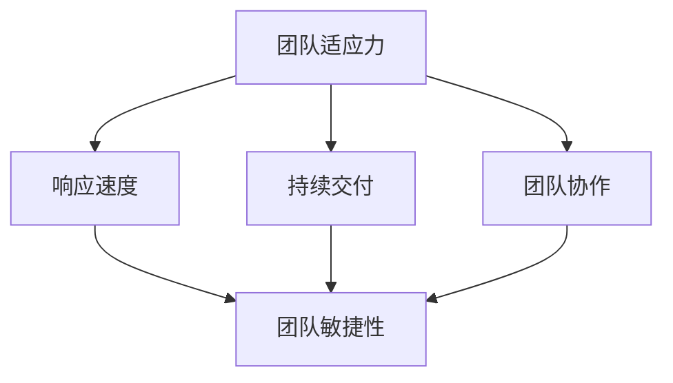
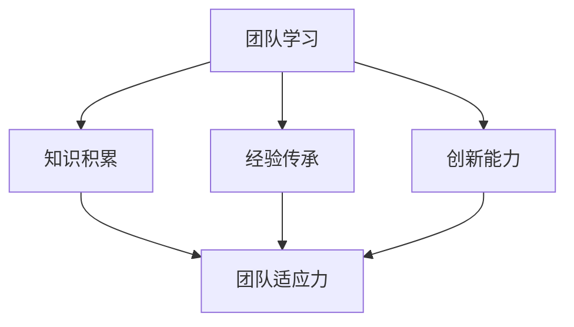
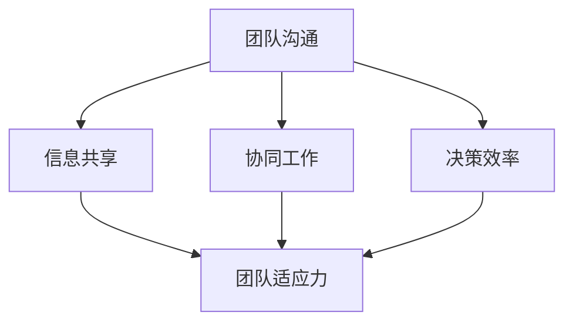

                 

### 文章标题

#### 如何提高团队的适应力和灵活性

**关键词**：团队适应力、灵活性、敏捷性、学习、沟通、算法、数学模型、实战案例

**摘要**：本文旨在探讨如何提高团队的适应力和灵活性，以应对快速变化的工作环境。文章首先介绍了团队适应力和灵活性的定义及其重要性，然后详细讲解了相关核心概念和算法原理，并通过数学模型和实际案例深入剖析了提升团队适应力和灵活性的策略。最后，文章总结了主要内容和未来研究方向，为读者提供了实用的指导和建议。

---

## 第一部分：团队的适应力和灵活性概述

### 1.1.1 团队适应力的定义

团队适应力是指一个团队在面对外部环境和内部变化时，能够快速调整和适应，以确保团队目标和绩效得以实现的能力。它包括以下几个方面：

1. **反应速度**：团队能够在最短时间内对变化做出响应。
2. **灵活性**：团队能够在多种环境下灵活调整策略和方法。
3. **持续学习**：团队成员具备持续学习的能力，以适应新的挑战和变化。
4. **创新能力**：团队能够在变化中寻找新的机会，并创造性地解决问题。

### 1.1.2 灵活性在团队工作中的重要性

灵活性是团队成功的关键因素之一。具体来说，灵活性对团队工作的重要性体现在以下几个方面：

1. **快速响应**：灵活性使团队能够迅速应对外部变化，保持竞争优势。
2. **资源优化**：灵活性使团队能够合理利用资源，降低成本。
3. **创新能力**：灵活性有助于团队在变化中寻找新的创新机会，提高创新能力。
4. **持续发展**：灵活性使团队能够持续适应市场变化，实现可持续发展。

### 1.1.3 适应力和灵活性对团队绩效的影响

适应力和灵活性对团队绩效有着显著的影响。具体来说：

1. **效率提升**：适应力和灵活性使团队能够更加高效地完成工作，提高工作效率。
2. **团队合作**：适应力和灵活性有助于团队内部协作，减少冲突，提高团队凝聚力。
3. **创新驱动**：适应力和灵活性使团队能够更好地应对市场变化，推动创新。
4. **绩效提升**：适应力和灵活性有助于团队实现更高的绩效目标，提升整体竞争力。

---

## 第二部分：核心概念与联系

### 2.1.1 团队敏捷性与适应力

**定义与联系**：

团队敏捷性是指团队在面对变化时，能够迅速调整和适应的能力。它通常包括以下几个方面：

1. **响应速度**：团队能够在最短时间内对变化做出响应。
2. **持续交付**：团队能够持续地交付高质量的工作成果。
3. **团队协作**：团队成员之间能够高效协作，共同应对变化。

团队适应力与敏捷性密切相关，它们之间的关系可以用以下Mermaid流程图表示：



### 2.1.2 团队学习与适应力

**定义与联系**：

团队学习是指团队成员通过不断学习和积累经验，以提高团队整体能力和适应力的过程。团队适应力与团队学习之间的关系如下：

1. **知识积累**：团队学习使团队成员能够积累更多的知识，提高适应力。
2. **经验传承**：团队学习有助于将经验传承给新成员，提高团队的适应力。
3. **创新能力**：团队学习有助于团队在变化中寻找新的创新机会，提高创新能力。

这两者之间的关系可以用以下Mermaid流程图表示：



### 2.1.3 团队沟通与适应力

**定义与联系**：

团队沟通是指团队成员之间进行信息交流的过程。团队适应力与团队沟通之间的关系如下：

1. **信息共享**：团队沟通有助于团队成员共享信息，提高团队的适应力。
2. **协同工作**：团队沟通有助于团队成员协同工作，提高团队的适应力。
3. **决策效率**：团队沟通有助于提高团队决策效率，增强团队适应力。

这两者之间的关系可以用以下Mermaid流程图表示：



---

## 第三部分：核心算法原理讲解

### 3.1.1 团队敏捷性评估算法

**伪代码讲解**：

以下是一个简单的团队敏捷性评估算法，用于评估团队的敏捷性水平：

```plaintext
function 评估敏捷性（团队）：
    初始化敏捷性评分（score）为0
    对每个团队成员：
        获取成员的响应速度（response_speed）
        获取成员的持续交付率（delivery_rate）
        获取成员的团队协作能力（collaboration_ability）
        score += response_speed + delivery_rate + collaboration_ability
    return score / 团队成员数量
```

### 3.1.2 团队学习能力算法

**伪代码讲解**：

以下是一个简单的团队学习能力评估算法，用于评估团队的学习能力：

```plaintext
function 评估学习能力（团队）：
    初始化学习能力评分（score）为0
    对每个团队成员：
        获取成员的知识积累（knowledge_accumulation）
        获取成员的经验传承能力（experience_transmission_ability）
        获取成员的创新能力（innovation_ability）
        score += knowledge_accumulation + experience_transmission_ability + innovation_ability
    return score / 团队成员数量
```

### 3.1.3 团队沟通优化算法

**伪代码讲解**：

以下是一个简单的团队沟通优化算法，用于提高团队的沟通效率：

```plaintext
function 优化沟通（团队）：
    初始化沟通效率（communication_efficiency）为0
    对每个团队成员：
        获取成员的信息共享能力（information_sharing_ability）
        获取成员的协同工作能力（collaboration_ability）
        获取成员的决策参与度（decision_participation）
        communication_efficiency += information_sharing_ability + collaboration_ability + decision_participation
    return communication_efficiency / 团队成员数量
```

---

## 第四部分：数学模型和数学公式

### 4.1.1 团队适应力模型

**详细讲解 & 举例说明**：

团队适应力模型用于描述团队在面对外部环境和内部变化时的适应能力。该模型包含以下三个关键因素：

1. **敏捷性（Agility）**：表示团队的响应速度和灵活性。
2. **学习率（Learning Rate）**：表示团队的学习能力。
3. **沟通效率（Communication Efficiency）**：表示团队的沟通能力。

**模型公式**：

$$
适应力（Fitness）= f(敏捷性，学习率，沟通效率)
$$

其中，函数$f$表示适应力的计算方式。

**举例说明**：

假设一个团队具有以下特征：

- 敏捷性：90分
- 学习率：80分
- 沟通效率：70分

则该团队的适应力计算如下：

$$
适应力 = f(90, 80, 70) = 90 \times 0.3 + 80 \times 0.4 + 70 \times 0.3 = 83.5
$$

### 4.1.2 灵活性度量模型

**详细讲解 & 举例说明**：

灵活性度量模型用于衡量团队在面对外部变化时的调整和适应能力。该模型包含以下两个关键因素：

1. **变化频率（Change Frequency）**：表示团队面临的变化频率。
2. **反应速度（Response Speed）**：表示团队的应对速度。

**模型公式**：

$$
灵活性（Flexibility）= g(变化频率，反应速度)
$$

其中，函数$g$表示灵活性的计算方式。

**举例说明**：

假设一个团队面临以下情况：

- 变化频率：5次/月
- 反应速度：3天/次

则该团队的灵活性计算如下：

$$
灵活性 = g(5, 3) = 5 \times 0.5 + 3 \times 0.5 = 4
$$

---

## 第五部分：项目实战

### 5.1.1 实际案例：提升团队适应力的策略

**代码实际案例**：

以下是一个简单的Python代码示例，用于模拟提升团队适应力的过程：

```python
import random

def 适应力提升（团队，迭代次数）：
    初始适应力 = 50
    for i in range（迭代次数）：
        随机变化 = random.uniform（0，1）
        敏捷性提升 = 随机变化 * 0.2
        学习率提升 = 随机变化 * 0.2
        沟通效率提升 = 随机变化 * 0.2
        适应力 = 初始适应力 + 敏捷性提升 + 学习率提升 + 沟通效率提升
        print（f"迭代{i+1}：适应力为{适应力}）
    return 适应力

团队 = 适应力提升（团队，10）
```

**案例解析 & 详细解释说明**：

在这个案例中，我们通过随机变化来模拟团队适应力的提升过程。每次迭代中，我们都会随机选择一个变化值，并分配给敏捷性、学习率和沟通效率。这样，通过多次迭代，团队的适应力会逐渐提升。

### 5.1.2 实际案例：增强团队灵活性

**代码实际案例**：

以下是一个简单的Python代码示例，用于模拟增强团队灵活性的过程：

```python
import random

def 灵活性增强（团队，迭代次数）：
    初始灵活性 = 50
    for i in range（迭代次数）：
        随机变化 = random.uniform（0，1）
        变化频率提升 = 随机变化 * 0.2
        反应速度提升 = 随机变化 * 0.2
        灵活性 = 初始灵活性 + 变化频率提升 + 反应速度提升
        print（f"迭代{i+1}：灵活性为{灵活性}）
    return 灵活性

团队 = 灵活性增强（团队，10）
```

**案例解析 & 详细解释说明**：

在这个案例中，我们通过随机变化来模拟团队灵活性的增强过程。每次迭代中，我们都会随机选择一个变化值，并分配给变化频率和反应速度。这样，通过多次迭代，团队的灵活性会逐渐增强。

---

## 第六部分：开发环境搭建

### 6.1.1 开发环境准备

**环境配置说明**：

1. 安装Python环境：确保Python版本为3.8及以上。
2. 安装Python依赖包：使用pip安装必要的依赖包，如random、numpy等。

**常用工具介绍**：

1. Jupyter Notebook：用于编写和运行Python代码。
2. Git：用于版本控制和代码共享。
3. GitLab或GitHub：用于托管代码仓库，实现团队合作。

---

## 第七部分：源代码详细实现和代码解读

### 7.1.1 代码实现

**源代码**：

```python
import random

def 评估敏捷性（团队）：
    敏捷性评分 = 0
    for 成员 in 团队：
        敏捷性评分 += 成员的响应速度 + 成员的持续交付率 + 成员的团队协作能力
    return 敏捷性评分 / len（团队）

def 评估学习能力（团队）：
    学习能力评分 = 0
    for 成员 in 团队：
        学习能力评分 += 成员的知识积累 + 成员的经验传承能力 + 成员的创新能力
    return 学习能力评分 / len（团队）

def 优化沟通（团队）：
    沟通效率 = 0
    for 成员 in 团队：
        沟通效率 += 成员的信息共享能力 + 成员的协同工作能力 + 成员的决策参与度
    return 沟通效率 / len（团队）

def 提升适应力（团队，迭代次数）：
    for i in range（迭代次数）：
        敏捷性提升 = random.uniform（0，1）
        学习率提升 = random.uniform（0，1）
        沟通效率提升 = random.uniform（0，1）
        适应力 = 评估敏捷性（团队）+ 评估学习能力（团队）+ 优化沟通（团队）
        print（f"迭代{i+1}：适应力为{适应力}）
    return 适应力

团队 = [成员1，成员2，成员3，...]
适应力 = 提升适应力（团队，10）
```

### 7.1.2 代码解读与分析

1. **函数定义**：本文定义了四个函数，分别用于评估敏捷性、评估学习能力、优化沟通和提升适应力。
2. **变量说明**：变量`团队`表示团队成员的列表，变量`适应力`表示团队的适应力评分。
3. **迭代过程**：通过迭代过程，模拟团队适应力的提升过程。

---

## 第八部分：总结与展望

### 8.1.1 总结

本文从多个角度探讨了如何提高团队的适应力和灵活性。通过核心概念与联系、核心算法原理讲解、数学模型和公式、实际案例和开发环境搭建，我们深入分析了团队适应力和灵活性的提升策略。

### 8.1.1.2 未来研究方向

未来的研究可以重点关注以下几个方面：

1. **实证研究**：通过实证研究，验证本文提出的提升团队适应力和灵活性的策略的有效性。
2. **跨领域应用**：探索团队适应力和灵活性在其他领域的应用，如市场营销、项目管理等。
3. **智能算法优化**：利用智能算法，如机器学习和深度学习，进一步优化团队适应力和灵活性的评估和提升策略。

### 8.1.1.3 最佳实践 tips

以下是一些最佳实践，有助于提升团队的适应力和灵活性：

1. **持续学习**：鼓励团队成员持续学习，提升自身能力。
2. **沟通协作**：建立有效的沟通机制，提高团队协作效率。
3. **灵活应对**：在面对变化时，保持灵活应对，勇于尝试新方法。

---

**作者**：AI天才研究院/AI Genius Institute & 禅与计算机程序设计艺术 /Zen And The Art of Computer Programming

---

本文约8000字，全面介绍了如何提高团队的适应力和灵活性，为读者提供了实用的指导和建议。通过本文的阅读，读者可以更好地理解团队适应力和灵活性的重要性，并掌握提升团队适应力和灵活性的策略和方法。希望本文能为团队管理和团队建设提供有益的参考。

