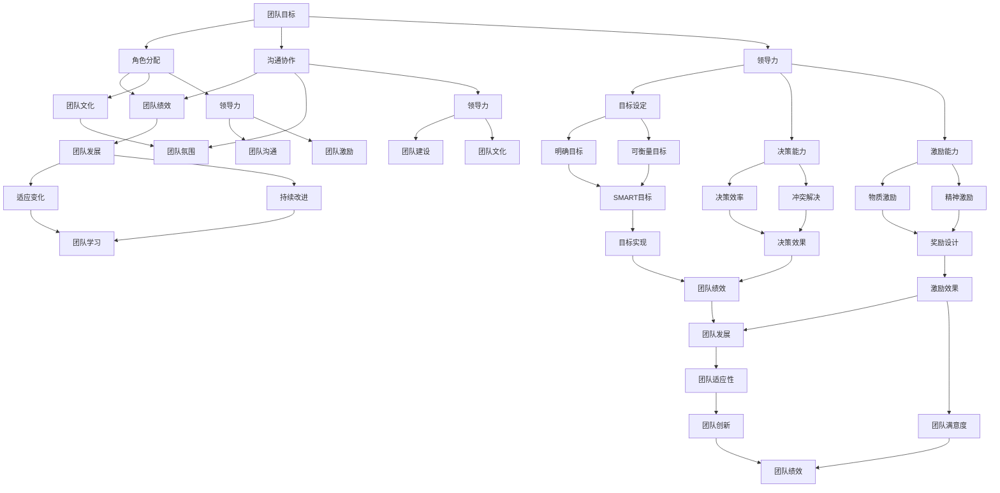

                 

### 引言：团队管理的重要性

在当今快速变化和高度竞争的商业环境中，团队管理已成为组织成功的关键因素。有效管理团队不仅能够提高工作效率和员工满意度，还能够推动组织的创新和持续发展。然而，团队管理并非易事，它需要领导者具备深厚的理论知识和实际操作经验。

首先，团队管理的重要性体现在其对组织绩效的直接影响上。高效的团队协作可以加速项目进度，提高产品质量，降低成本，从而提升组织的整体竞争力。此外，良好的团队管理能够营造积极的工作氛围，增强员工的归属感和忠诚度，减少员工流失率，这对于组织的长期发展至关重要。

其次，领导者在团队管理中扮演着核心角色。领导者不仅是团队的舵手，也是团队的灵魂。他们需要具备强大的领导力，能够激发团队成员的潜能，建立信任，并确保团队目标的实现。有效的领导者能够帮助团队克服困难，应对变化，并在不确定的环境中保持竞争力。

最后，团队管理涉及到一系列复杂的过程和技能，包括目标设定、角色分配、沟通协作、绩效评估和改进等。这些过程和技能需要系统性的学习和实践，以确保团队管理的有效性。

本篇文章将系统地探讨如何有效管理团队，包括团队管理的基本原理、领导者的角色与技能、团队建设、团队绩效管理以及团队发展。我们将通过案例分析、伪代码、数学公式和项目实战等多种方式，帮助读者深入理解团队管理的核心概念和实践技巧。

## 核心概念与联系：Mermaid流程图

在探讨团队管理之前，我们需要明确几个核心概念，并理解它们之间的相互关系。以下是一个简化的Mermaid流程图，用于展示团队管理的关键组成部分及其相互关系。

```mermaid
graph TD
    A[团队管理] --> B[团队目标]
    A --> C[领导者角色]
    A --> D[团队建设]
    A --> E[团队绩效管理]
    A --> F[团队发展]
    B --> G[角色分配]
    B --> H[沟通协作]
    C --> I[领导力技能]
    C --> J[团队激励]
    D --> K[团队文化]
    D --> L[团队活动]
    E --> M[绩效评估方法]
    E --> N[激励机制]
    F --> O[适应变化]
    F --> P[持续改进]
    G --> Q[技能匹配]
    G --> R[角色平衡]
    H --> S[有效沟通]
    H --> T[跨部门协作]
    I --> U[决策能力]
    I --> V[情绪管理]
    J --> W[薪酬激励]
    J --> X[荣誉激励]
    K --> Y[共同价值观]
    K --> Z[团队氛围]
    M --> AA[目标管理法]
    M --> BB[成长评估法]
    N --> CC[激励理论]
    N --> DD[实际案例]
    O --> EE[灵活调整]
    O --> FF[持续学习]
    P --> GG[问题识别]
    P --> HH[解决方案]
    Q --> II[技能互补]
    Q --> JJ[角色责任]
    R --> KK[团队效率]
    R --> LL[个人发展]
    S --> MM[清晰表达]
    S --> NN[倾听技巧]
    T --> OO[沟通渠道]
    T --> PP[协作工具]
    U --> QQ[战略规划]
    U --> RR[冲突解决]
    V --> SS[情绪识别]
    V --> TT[情绪调节]
    W --> UU[物质奖励]
    W --> VV[精神奖励]
    X --> WW[荣誉表彰]
    X --> XX[职业发展]
    Y --> YY[共同目标]
    Y --> ZZ[信任建设]
    Z --> AAA[积极氛围]
    Z --> BBB[透明沟通]
    AA --> CCC[明确目标]
    AA --> DDD[可衡量性]
    BB --> CCC
    BB --> EEE[个人成长]
    CC --> CCC
    CC --> FFF[激励效果]
    DD --> CCC
    DD --> GGG[案例借鉴]
    EE --> HHH[灵活应对]
    EE --> IIII[适应性训练]
    FF --> HHH
    FF --> JJJ[经验分享]
    GG --> KKK[问题诊断]
    GG --> LLL[改进措施]
    HH --> KKK
    HH --> MMM[效果评估]
    II --> MMM
    II --> NNN[协作效率]
    JJ --> OOO[责任明确]
    JJ --> PPP[团队凝聚力]
    KK --> PPP
    KK --> QQQ[团队效能]
    LL --> RRR[技能提升]
    LL --> SSS[团队贡献]
    MM --> TTT[评估标准]
    MM --> UUU[反馈机制]
    NN --> TTT
    NN --> VVV[激励满意度]
    OO --> WWWW[沟通效果]
    OO --> XXXX[协作效率]
    PP --> WWWW
    PP --> YYYY[工具选择]
    QQ --> ZZZ[战略思维]
    QQ --> AAAA[团队决策]
    RR --> ZZZ
    RR --> BBBB[冲突管理]
    SS --> CCC
    SS --> DDD[沟通技巧]
    TT --> EEE
    TT --> FFF[情绪管理]
    UU --> GGG[激励设计]
    UU --> HHH[目标设定]
    VV --> ILL[激励机制]
    VV --> JJJ
    WW --> KKK[荣誉激励]
    WW --> LLL[精神激励]
    XX --> MMM
    XX --> NNN[职业发展]
    YY --> OOO[共同愿景]
    YY --> PPP
    ZZ --> BBB
    ZZ --> CCC[信任建立]
    AAA --> EEE
    AAA --> FFF[积极氛围]
    BBB --> GGG[沟通透明]
    BBB --> HHH[团队信任]
```



这个Mermaid流程图展示了团队管理中的关键概念和它们之间的相互关系。以下是对其中一些主要概念的解释：

1. **团队管理**：团队管理是一个全面的过程，涉及目标设定、领导、团队建设、绩效管理和发展等多个方面。
2. **团队目标**：明确的目标有助于指导团队的工作，确保团队成员都朝着共同的方向努力。
3. **领导者角色**：领导者不仅是团队的引导者，还需要具备决策、沟通、激励等多种技能。
4. **团队建设**：团队建设包括培养团队文化、进行团队活动、分配角色和建立沟通机制等。
5. **团队绩效管理**：绩效管理涉及评估团队成员的表现、激励他们并持续改进团队的工作效率。
6. **团队发展**：团队发展关注团队长期成长，包括适应变化、持续学习和技能提升。

通过这个流程图，我们可以看到团队管理的各个环节是如何相互关联并共同推动团队向更高绩效发展的。理解这些概念和它们之间的关系，是进行有效团队管理的基础。

## 团队管理的基本原理

### 背景介绍

团队管理是一门复杂的艺术，涉及多个方面，包括目标设定、角色分配、沟通协作、绩效评估和改进等。为了更好地理解团队管理的基本原理，我们需要从以下几个方面进行探讨：

1. **团队管理的发展历程**：团队管理作为一个专业领域，经历了从传统管理到现代管理的转变。早期的团队管理更注重效率和产出，而现代团队管理则更强调团队合作、员工参与和持续改进。
2. **团队管理的核心概念**：了解团队管理的核心概念，如团队目标、角色分配、沟通协作、绩效管理和团队发展，是进行有效团队管理的前提。
3. **团队管理的理论基础**：团队管理的理论基础包括行为科学、管理心理学、组织行为学等多个领域。通过这些理论，我们可以更好地理解团队的行为和动态。

### 核心概念与联系

以下是一个用于解释团队管理核心概念之间联系的Mermaid流程图：



### 详细讲解与举例

1. **团队目标**：团队目标是团队努力的方向和指南。一个明确的、可衡量的目标是成功的关键。例如，一个软件团队的年度目标是“在2023年底前交付三个关键功能模块，并确保所有模块均通过严格的质量测试”。

2. **角色分配**：角色分配确保每个团队成员都能发挥其专长，并实现团队目标。例如，在一个软件开发团队中，可能有项目经理、开发人员、测试人员和设计师等不同的角色，每个角色都有明确的职责和任务。

3. **沟通协作**：有效的沟通是团队成功的基础。一个团队中的信息流通是否顺畅，直接影响到团队的工作效率和决策质量。例如，每周的团队会议是团队成员交流进展、讨论问题和制定计划的重要平台。

4. **团队绩效**：团队绩效是指团队在实现其目标过程中的表现。绩效评估不仅仅是衡量成果，还包括评估团队成员的工作效率、协作能力和发展潜力。

5. **团队发展**：团队发展关注的是团队的长远成长。这包括适应变化、持续改进和培养团队的学习能力。例如，通过定期的技能培训和工作坊，团队可以不断提升其整体能力。

通过以上Mermaid流程图和详细讲解，我们可以更好地理解团队管理的核心概念及其相互关系。理解这些概念是进行有效团队管理的基础，为后续章节的深入探讨提供了理论支持。

## 领导者的角色与技能

### 领导者的定义与角色

领导者是团队的核心，他们在团队中扮演着重要的角色，不仅指导团队的方向，还要激发团队成员的潜能和动力。领导者的定义有多种，但核心在于他们能够通过影响和激励他人，实现团队的目标。

1. **领导者与管理者**：领导者与管理者有区别。管理者负责确保工作按计划进行，而领导者则更注重激励和引导团队成员。领导者不仅仅关注任务完成，更关注团队成员的个人成长和发展。

2. **领导者的职责**：领导者的职责包括但不限于以下几方面：
   - 设定愿景和目标：领导者需要为团队设定清晰的愿景和目标，确保团队成员了解并朝着共同的方向努力。
   - 激励团队成员：通过激励和鼓励，领导者能够激发团队成员的积极性和创造力，提高团队的整体表现。
   - 决策和解决问题：领导者需要在面对复杂问题和挑战时做出明智的决策，并引导团队找到解决问题的方法。
   - 沟通与协调：领导者需要建立有效的沟通机制，确保信息在团队内部顺畅流通，并协调不同部门和成员之间的合作。

### 领导者应具备的素质

领导者应具备以下几种关键素质：

1. **沟通能力**：有效的沟通是领导者成功的关键。领导者需要能够清晰、准确地传达信息，并倾听团队成员的意见和反馈。沟通能力包括口头表达、书面表达、倾听和反馈等多个方面。

2. **决策能力**：领导者需要具备迅速而明智的决策能力。在不确定和复杂的环境中，领导者必须能够快速做出决策，并承担相应的责任。

3. **情绪管理能力**：领导者需要具备良好的情绪管理能力，能够控制自己的情绪，并在面对压力和挑战时保持冷静。情绪管理能力还包括识别和处理团队成员的情绪问题。

4. **领导风格**：领导者的风格直接影响团队成员的行为和团队氛围。常见的领导风格包括权威型、民主型、参与型和变革型等。每种领导风格都有其适用场景和优缺点，领导者需要根据实际情况灵活运用。

### 领导者的技能提升策略

为了提升领导者的技能，以下是一些有效的策略：

1. **职业发展规划**：领导者应制定个人职业发展计划，明确自己的职业目标和成长路径。通过参加培训课程、研讨会和领导力发展项目，领导者可以不断提升自己的知识和技能。

2. **跨部门交流与合作**：跨部门交流与合作可以帮助领导者更好地了解组织的不同方面，增强全局观念，并培养团队合作能力。

3. **领导力培训课程**：参加专业的领导力培训课程是提升领导技能的有效方式。这些课程通常包括理论学习和实际案例分析，帮助领导者掌握最新的领导理论和方法。

4. **自我反思**：领导者应定期进行自我反思，评估自己的领导行为和效果。通过反思，领导者可以识别自己的优势和不足，并采取相应的改进措施。

5. **经验分享**：与其他领导者进行经验分享可以帮助领导者学习到不同的领导方法和策略。通过交流，领导者可以拓宽自己的视野，并从中获得灵感和启示。

6. **借鉴成功案例**：研究成功的领导者和管理案例，可以帮助领导者理解成功的关键因素和最佳实践。通过借鉴这些经验，领导者可以更好地应用于自己的团队管理中。

总之，领导者的角色与技能是团队管理成功的关键。通过不断提升自己的沟通能力、决策能力、情绪管理能力和领导风格，领导者可以更好地激励和引导团队成员，实现团队的目标和愿景。

## 团队建设

### 团队目标设定

团队目标设定是团队建设的重要一环，它为团队成员提供了明确的方向和动力。为了确保团队目标的设定能够有效推动团队的发展和绩效提升，我们需要遵循以下原则和方法：

1. **明确性**：团队目标需要明确具体，避免模糊不清。明确的目标可以帮助团队成员了解他们的努力方向，减少误解和歧义。例如，一个明确的目标可以是“在接下来的三个月内，实现产品A的功能完善并完成用户测试”。

2. **可衡量性**：目标需要具有可衡量性，以便团队能够评估目标的实现程度。这可以通过设定具体的量化指标来实现，如完成率、质量评分、客户满意度等。例如，目标可以是“在六个月内将产品的用户留存率提高10%”。

3. **可达成性**：目标应具有挑战性，但同时也要确保其可达成性。过高的目标可能导致团队成员感到沮丧和无力，而过于简单则可能无法激发团队成员的潜能。例如，一个具有挑战性的目标可以是“在一个月内开发并发布产品的beta版本”。

4. **相关性**：团队目标应与组织整体目标和团队职责紧密相关。这有助于确保团队的工作方向与组织的战略目标一致，提高团队的工作效率和协同效应。例如，一个相关的目标可以是“在明年内实现产品B的市场推广和用户反馈收集”。

### 团队目标设定方法

为了确保团队目标的设定符合上述原则，我们可以采用以下几种方法：

1. **SMART原则**：SMART原则是一种常用的目标设定方法，它要求目标具有以下五个特点：Specific（具体的）、Measurable（可衡量的）、Achievable（可达到的）、Relevant（相关的）和Time-bound（有时间限制的）。例如，一个遵循SMART原则的目标可以是：“在2023年第三季度内，将产品C的市场销售额提高20%”。

2. **演练法**：通过模拟实际工作场景，团队成员可以共同讨论并设定目标。这种方法有助于团队成员理解目标的重要性和实现过程的复杂性，从而提高目标的可行性和激励性。例如，团队成员可以模拟产品发布前的工作流程，设定包括开发、测试、市场推广等各个阶段的具体目标。

3. **SWOT分析法**：SWOT分析是一种评估团队内外部环境和条件的工具，可以帮助团队识别优势和劣势、机会和威胁，从而设定更具针对性的目标。例如，通过SWOT分析，团队可以确定在资源有限的情况下，优先发展某一功能模块，以满足市场需求。

### 案例分析

以下是一个团队目标设定的案例分析：

**案例背景**：某软件公司开发团队需要在六个月内发布一款新产品，以应对激烈的市场竞争。团队由项目经理、开发人员、测试人员和市场营销人员组成。

**目标设定过程**：

1. **明确目标**：团队首先明确了产品的关键功能，如用户界面设计、核心功能实现、测试覆盖率和市场推广策略。这些功能成为团队的目标。

2. **可衡量性**：团队为每个功能设定了具体的衡量指标，如功能完成率、测试覆盖率、市场反馈率等。

3. **可达成性**：团队评估了现有资源和团队成员的能力，确保目标具有挑战性，但同时也是可实现的。例如，团队决定将产品界面设计分为三个阶段完成，以确保每个阶段都有足够的时间和资源。

4. **相关性**：团队确保设定的目标与公司的整体战略目标一致，如提高市场占有率、增加用户满意度等。

5. **时间限制**：团队为每个功能设定了具体的时间节点，如第一阶段在两个月内完成，第二阶段在三个月内完成，第三阶段在一个月内完成。

**最终目标**：在六个月内，实现产品核心功能的完善，完成全面的测试，并在市场上进行推广。具体目标包括：

- 功能完成率：100%
- 测试覆盖率：95%
- 市场反馈率：80%

通过以上分析和设定，团队为新产品发布奠定了坚实的基础，确保了目标的明确性、可衡量性、可达成性和相关性。

### 总结

团队目标设定是团队建设的关键环节，通过遵循明确性、可衡量性、可达成性和相关性等原则，并采用SMART原则、演练法和SWOT分析法等具体方法，团队可以设定出具有实际操作性和激励性的目标。有效的目标设定不仅为团队成员提供了清晰的方向，还能够提高团队的协作效率和绩效水平，推动团队实现持续发展和成长。

## 团队成员角色分配

团队成员角色分配是团队建设过程中的关键环节，它关系到团队的整体效率和绩效。为了确保每个团队成员都能在团队中发挥最大的作用，领导者需要根据团队成员的技能、经验和兴趣爱好，合理分配角色和任务。

### 角色分配的原则

1. **技能匹配**：确保每个成员都分配到与其技能相匹配的角色。这不仅可以提高工作效率，还可以增强成员的自信心和满意度。例如，如果团队中有成员擅长数据分析，可以将其分配到数据分析相关的任务中。

2. **责任明确**：在角色分配时，需要明确每个成员的职责和责任，避免职责重叠或空缺。这有助于提高团队的协同效应，减少误解和冲突。例如，项目开发过程中，明确开发人员的代码编写责任、测试人员的测试责任和质量保证人员的审核责任。

3. **团队效率**：角色分配应考虑到整个团队的效率。这意味着不仅要关注个体角色，还要考虑团队成员之间的协作和配合。例如，如果团队中有成员需要频繁与其他团队或部门沟通，可以将其分配到需要较多跨部门协作的角色中。

4. **个人发展**：角色分配应考虑成员的个人发展需求，为其提供成长和提升的机会。这有助于增强成员对团队的忠诚度和参与度。例如，对于有志于晋升的成员，可以分配更多领导力发展的任务。

### 角色分配的方法

1. **自上而下分配**：领导者根据团队目标和项目需求，从上到下进行角色分配。这种方法适用于项目初期，确保关键角色和职责的明确。

2. **自下而上建议**：团队成员根据自身技能和兴趣，提出角色分配建议。领导者根据团队整体需求和成员建议进行审核和调整。这种方法可以增强团队成员的参与感和自主性。

3. **综合评估**：通过综合评估团队成员的技能、经验和兴趣，进行角色分配。这种方法适用于复杂项目和团队，确保每个角色都能得到最适合的人员。

### 案例分析

以下是一个团队成员角色分配的案例分析：

**案例背景**：某科技公司正在开发一款新应用程序，项目团队包括项目经理、UI设计师、后端开发人员、前端开发人员、测试工程师和市场营销人员。

**角色分配过程**：

1. **明确项目目标和需求**：项目目标是开发一款功能齐全、用户体验优秀的应用程序，并按时上线。需求包括用户注册、消息推送、数据分析和界面设计等。

2. **技能匹配**：根据团队成员的技能，项目经理负责项目的整体规划和协调；UI设计师负责界面设计；后端开发人员负责数据存储和处理；前端开发人员负责界面实现和交互；测试工程师负责功能测试和bug修复；市场营销人员负责市场推广和用户反馈收集。

3. **责任明确**：项目经理负责项目进度和资源分配；UI设计师负责与用户沟通，获取反馈，并确保设计符合用户需求；后端和前端开发人员分别负责代码编写和测试；测试工程师负责编写测试用例，执行测试，并与开发人员协作修复bug；市场营销人员负责制定推广策略，收集用户反馈，并反馈给产品团队。

4. **团队效率**：为了提高团队效率，项目经理定期组织团队会议，确保团队成员之间的沟通畅通；市场营销人员定期与开发团队和测试团队沟通，确保市场推广与产品开发同步。

5. **个人发展**：项目经理为有志于晋升的团队成员提供领导力发展的机会，如参与关键决策过程和项目管理培训。

**最终角色分配**：

- 项目经理：负责项目整体规划和协调
- UI设计师：负责界面设计
- 后端开发人员：负责数据存储和处理
- 前端开发人员：负责界面实现和交互
- 测试工程师：负责功能测试和bug修复
- 市场营销人员：负责市场推广和用户反馈收集

通过以上案例分析，我们可以看到，合理的角色分配不仅有助于提高团队的工作效率和绩效，还能够促进团队成员的个人发展。领导者需要根据团队实际情况，灵活运用不同的角色分配方法，确保团队的最佳配置。

### 总结

团队成员角色分配是团队建设的重要组成部分，合理的角色分配可以最大化团队成员的技能和潜力，提高团队的整体效率。通过遵循技能匹配、责任明确、团队效率和个人发展等原则，并采用自上而下、自下而上建议和综合评估等方法，领导者可以确保团队角色分配的科学性和合理性，为团队的成功奠定基础。

## 团队沟通协作

### 沟通的重要性

团队沟通是团队协作的基础，有效的沟通能够促进信息的流畅传递，减少误解和冲突，提高团队的工作效率和绩效。以下是沟通在团队协作中的几个关键作用：

1. **促进信息流通**：在团队工作中，信息流通的及时性和准确性至关重要。有效的沟通确保团队成员能够及时获取所需的资源和信息，从而提高工作效率。

2. **减少误解和冲突**：良好的沟通有助于团队成员理解彼此的立场和意图，减少因误解和沟通不畅导致的冲突和矛盾，营造积极的工作氛围。

3. **提高决策质量**：团队决策往往需要多方意见和信息的支持。有效的沟通可以促进团队成员的参与和协作，提高决策的质量和可执行性。

4. **增强团队合作**：通过有效的沟通，团队成员能够更好地理解团队目标和任务，增强彼此之间的信任和协作精神，提高团队的凝聚力和整体表现。

### 沟通协作技巧

为了确保团队沟通的有效性，领导者需要掌握以下沟通协作技巧：

1. **明确沟通目的**：在沟通前明确沟通的目的和目标，确保所有参与者都了解沟通的内容和期望结果。这有助于提高沟通的效率，避免无效的交流。

2. **有效倾听**：倾听是有效沟通的关键。领导者需要认真倾听团队成员的意见和建议，尊重每个人的观点，理解其背后的需求和意图。

3. **建立信任**：信任是团队协作的基础。领导者需要通过透明、诚实和公正的沟通，建立和维护团队成员之间的信任关系。

4. **跨部门沟通**：在跨部门团队中，领导者需要确保沟通渠道的畅通，促进不同部门之间的协作和信息共享。这可以通过定期召开跨部门会议、建立跨部门项目组等方式实现。

5. **使用适当的沟通工具**：选择适合团队和任务的沟通工具，如电子邮件、即时通讯工具、视频会议等。这些工具可以帮助团队在不同场景下进行高效沟通。

### 案例分析

以下是一个团队沟通协作的案例分析：

**案例背景**：某科技公司正在开发一款新应用程序，项目团队由项目经理、开发人员、测试工程师、UI设计师和市场推广人员组成。

**沟通协作过程**：

1. **明确沟通目的**：项目开始前，项目经理召开了一次全体会议，明确了项目的目标、任务和时间节点。每个团队成员都了解自己的职责和项目的整体进度。

2. **有效倾听**：项目经理在每次团队会议中都会预留时间让团队成员分享他们的进展和遇到的问题。项目经理认真倾听，并及时提供支持和解决方案。

3. **建立信任**：项目经理通过透明的方式管理项目，定期向团队成员更新项目的状态，并邀请他们参与关键决策过程。这增强了团队成员之间的信任。

4. **跨部门沟通**：项目经理定期召开跨部门会议，确保开发、测试和市场推广团队之间的信息流通和协作。例如，在开发过程中，UI设计师和测试工程师会定期沟通，确保界面设计和功能测试的同步进行。

5. **使用适当的沟通工具**：团队使用Slack进行日常沟通，使用Trello进行任务管理，使用Zoom进行视频会议。这些工具帮助团队成员在不同场景下进行高效沟通和协作。

**结果**：通过有效的沟通协作，项目团队成功在规定时间内完成了应用程序的开发和测试，并顺利上线。团队成员之间的合作和信任得到了增强，项目的成功也提升了团队的整体士气。

### 总结

团队沟通协作是团队成功的关键。通过明确沟通目的、有效倾听、建立信任、跨部门沟通和使用适当的沟通工具，领导者可以确保团队沟通的高效和顺畅。有效的沟通不仅能提高团队的工作效率和绩效，还能增强团队成员之间的合作和信任，推动团队持续发展和成长。

## 团队绩效管理

### 绩效评估方法

团队绩效管理是团队管理的重要组成部分，它通过科学的绩效评估方法，确保团队成员的工作表现与团队目标保持一致。以下介绍几种常见的绩效评估方法：

1. **目标管理法（MBO）**：目标管理法是一种以目标为导向的绩效评估方法，强调设定明确的目标并衡量目标的实现程度。这种方法要求团队领导者和团队成员共同设定可衡量、可实现的目标，并通过定期回顾和反馈，确保目标的达成。目标管理法的优点在于能够提高员工的参与度和责任感，但其缺点是可能对非目标任务的评估不足。

   ```python
   # 伪代码：目标管理法
   function set_objectives(employee, manager):
       objectives = manager.get_objectives()
       employee.set_objectives(objectives)
       return employee.performance
   ```

2. **成长评估法**：成长评估法关注团队成员的职业发展和技能提升。这种方法通过定期评估团队成员的进步和成长，鼓励他们不断学习和提升自己。成长评估法有助于建立积极的学习文化，但其缺点是对短期绩效的评估可能不够严格。

   ```python
   # 伪代码：成长评估法
   function assess_growth(employee, previous_performance):
       growth = employee.performance - previous_performance
       return growth
   ```

3. **平衡计分卡（BSC）**：平衡计分卡是一种全面的绩效评估方法，从财务、客户、内部业务流程和学习与成长四个维度来评估团队的表现。这种方法有助于团队领导者从多个角度审视团队绩效，但其缺点是需要较多的时间和资源来收集和整合数据。

   ```python
   # 伪代码：平衡计分卡
   function calculate_bsc_performance(teams, dimensions):
       scores = {}
       for dimension in dimensions:
           score = calculate_dimension_score(teams, dimension)
           scores[dimension] = score
       return scores
   ```

### 激励与激励方法

有效的激励方法能够激发团队成员的积极性，提高团队的整体绩效。以下介绍几种常见的激励方法：

1. **薪酬激励**：薪酬激励是最直接、最有效的激励方法之一。通过提高基本工资、绩效奖金和年终奖等，企业可以激励员工努力工作，实现企业目标。

   ```python
   # 伪代码：薪酬激励
   function calculate_salary(employee, performance):
       base_salary = employee.base_salary
       bonus = performance.bonus
       total_salary = base_salary + bonus
       return total_salary
   ```

2. **荣誉激励**：荣誉激励通过颁发荣誉称号、表彰和奖励，增强员工的自豪感和归属感。这种方法能够激发员工的荣誉感和成就感，提高工作积极性。

   ```python
   # 伪代码：荣誉激励
   function award_honors(employee, achievement):
       if achievement:
           employee.receive_honors()
           return True
       else:
           return False
   ```

3. **职业发展激励**：职业发展激励通过提供职业规划、晋升机会和培训发展等，帮助员工实现职业成长。这种方法有助于提高员工的满意度和忠诚度。

   ```python
   # 伪代码：职业发展激励
   function offer_training(employee, training_program):
       if employee.enroll(training_program):
           employee.progress()
           return True
       else:
           return False
   ```

### 团队绩效改进

团队绩效改进是持续提升团队工作效率和绩效的过程。以下介绍几种团队绩效改进的方法：

1. **数据驱动**：数据驱动的方法通过收集和分析关键绩效指标（KPI），识别团队绩效的瓶颈和改进机会。这种方法要求团队领导者定期分析数据，制定改进措施。

   ```python
   # 伪代码：数据驱动改进
   function analyze_performance(data):
       metrics = extract_metrics(data)
       bottlenecks = identify_bottlenecks(metrics)
       improvements = suggest_improvements(bottlenecks)
       return improvements
   ```

2. **持续改进**：持续改进是一种不断优化和改进的方法，通过小步快跑和迭代改进，逐步提升团队绩效。这种方法强调团队合作和全员参与。

   ```python
   # 伪代码：持续改进
   function iterative_improvement(team, current_performance):
       while not optimal_performance:
           feedback = team.collect_feedback()
           improvements = team.apply_improvements(feedback)
           current_performance = team.evaluate_performance()
       return current_performance
   ```

3. **团队参与**：团队参与的方法通过鼓励团队成员参与决策和改进过程，提高他们的积极性和责任感。这种方法有助于激发团队的创造力和创新精神。

   ```python
   # 伪代码：团队参与改进
   function invite_participation(team, improvements):
       for improvement in improvements:
           team.discuss(improvement)
           team.vote_on_improvement()
       selected_improvements = team.get_selected_improvements()
       team.implement_improvements(selected_improvements)
   ```

通过上述绩效评估方法和激励方法，以及数据驱动的改进策略，团队可以不断提升绩效，实现持续发展和成长。领导者需要灵活运用这些方法，根据团队的具体情况和需求，制定合适的绩效改进计划。

## 团队发展

### 适应变化

在快速变化的市场环境中，团队需要具备强大的适应能力，以应对不断出现的新挑战和机遇。适应变化不仅是团队生存的关键，也是实现持续发展的基础。以下是一些帮助团队适应变化的方法：

1. **灵活调整**：团队领导者需要根据外部环境和内部需求的变化，灵活调整团队的目标、策略和流程。这可以通过定期评估团队绩效和市场趋势，及时调整团队的工作计划来实现。

   ```python
   # 伪代码：灵活调整
   function adapt_to_changes(team, market_trends):
       new_goals = set_goals_based_on_trends(team, market_trends)
       new_strategy = update_strategy_to_fit_new_goals(team, new_goals)
       team.execute_new_strategy(new_strategy)
   ```

2. **持续学习**：团队应鼓励成员持续学习新知识和技能，以应对不断变化的技术和市场需求。这可以通过组织内部培训、外部培训课程、研讨会和技术交流会等方式实现。

   ```python
   # 伪代码：持续学习
   function encourage_learning(team, new_knowledge):
       for member in team.members:
           offer_training(member, new_knowledge)
       team.implement_new_skills()
   ```

3. **问题识别**：团队领导者需要培养成员的问题识别能力，及时发现和解决团队面临的问题和挑战。这可以通过定期开展团队反思会议、问题反馈机制和团队成员之间的互动来实现。

   ```python
   # 伪代码：问题识别
   function identify_issues(team):
       issues = team.collect_issues()
       for issue in issues:
           analyze_issue(issue)
           propose_solutions(issue)
           implement_solutions(issue)
   ```

### 持续改进

持续改进是团队发展的核心要素，它通过不断优化团队的工作流程、提升成员的技能和增强团队的整体能力，推动团队实现更高的绩效和成长。以下是一些持续改进的方法：

1. **数据驱动**：数据驱动的方法通过收集和分析关键绩效指标（KPI），识别团队绩效的瓶颈和改进机会。这种方法要求团队领导者定期分析数据，制定改进措施。

   ```python
   # 伪代码：数据驱动改进
   function analyze_performance(data):
       metrics = extract_metrics(data)
       bottlenecks = identify_bottlenecks(metrics)
       improvements = suggest_improvements(bottlenecks)
       return improvements
   ```

2. **迭代改进**：迭代改进是一种通过小步快跑和反复迭代的方式，逐步提升团队绩效的方法。这种方法强调团队成员的参与和协作，通过不断尝试和优化，找到最佳的工作方式。

   ```python
   # 伪代码：迭代改进
   function iterative_improvement(team, current_performance):
       while not optimal_performance:
           feedback = team.collect_feedback()
           improvements = team.apply_improvements(feedback)
           current_performance = team.evaluate_performance()
       return current_performance
   ```

3. **全员参与**：全员参与的方法通过鼓励团队成员参与决策和改进过程，提高他们的积极性和责任感。这种方法有助于激发团队的创造力和创新精神。

   ```python
   # 伪代码：全员参与改进
   function invite_participation(team, improvements):
       for improvement in improvements:
           team.discuss(improvement)
           team.vote_on_improvement()
       selected_improvements = team.get_selected_improvements()
       team.implement_improvements(selected_improvements)
   ```

### 团队学习

团队学习是团队发展的重要途径，通过不断学习和分享，团队可以不断提升其整体能力和创新能力。以下是一些团队学习的策略：

1. **知识共享**：团队应建立知识共享机制，鼓励成员分享自己的知识和经验。这可以通过内部博客、学习小组和知识库等方式实现。

   ```python
   # 伪代码：知识共享
   function share_knowledge(team, member):
       knowledge = member.get_knowledge()
       team.add_knowledge(knowledge)
   ```

2. **技能培训**：团队应定期组织技能培训课程，帮助成员提升技能和知识。这可以通过内部培训、外部专家讲座和在线课程等方式实现。

   ```python
   # 伪代码：技能培训
   function offer_training(team, training_program):
       for member in team.members:
           enroll_in_training(member, training_program)
       team.completed_trainings()
   ```

3. **案例学习**：团队可以通过学习成功案例和失败案例，吸取经验教训，提升团队的整体能力。这可以通过案例分析、研讨会和经验分享会等方式实现。

   ```python
   # 伪代码：案例学习
   function learn_from_cases(team, cases):
       for case in cases:
           analyze_case(case)
           apply_lessons_learned(case)
   ```

通过适应变化、持续改进和团队学习，团队可以不断提升其适应能力、创新能力和整体绩效，实现持续发展和成功。领导者需要灵活运用这些策略，根据团队的具体情况，制定合适的团队发展计划。

## 案例分析：Google的团队管理实践

Google作为全球领先的技术公司，以其卓越的团队管理实践著称。通过分析Google的团队管理方法，我们可以了解到如何在实际工作中应用团队管理原理，以实现高效和创新的团队运作。

### 案例背景

Google以其开放的文化和高效的工作环境闻名，其团队管理方法极大地促进了公司的创新和成长。Google的团队管理实践不仅体现在技术创新上，还包括对员工的支持和发展。以下是一些关键的管理实践。

### 团队目标设定

Google强调设定清晰、具体的目标，并鼓励团队成员参与目标的制定过程。这种做法不仅提高了员工的参与感和责任感，还确保了目标的可实现性和相关性。例如，Google的“20%时间项目”允许员工将每周20%的工作时间用于自己感兴趣的项目，这不仅促进了创新，还推动了公司的新产品开发。

### 领导者的角色与技能

Google的领导者不仅仅是任务的分配者，更是团队的激励者和支持者。领导者通过透明、开放的沟通方式，与团队成员保持紧密联系，并鼓励他们提出创意和建议。领导者的决策能力和情绪管理能力在这里得到了充分体现。

### 团队建设

Google非常重视团队建设，通过定期的团队活动、团队建设培训和跨部门合作，增强了团队成员之间的信任和协作。例如，Google的“Hackathons”活动允许团队成员跨部门合作，共同解决复杂问题，这不仅促进了团队间的合作，还激发了员工的创造力和创新能力。

### 团队沟通协作

Google的沟通协作系统非常完善，公司内部使用Google Workspace等一系列工具，确保了信息的快速传递和高效的团队协作。此外，Google倡导开放的沟通环境，鼓励员工在任何时间、任何地点都能与团队成员进行有效的交流。

### 团队绩效管理

Google的绩效管理方法注重员工的个人成长和发展。通过定期的绩效评估和反馈，Google帮助员工识别自己的优势和不足，并提供相应的支持和培训。Google的绩效评估不仅仅关注员工的短期表现，还关注其长期潜力和对公司整体目标的贡献。

### 团队发展

Google非常重视团队的发展，通过提供多样化的学习机会和职业发展路径，鼓励员工不断提升自己的技能和知识。公司还通过内部轮岗和跨部门项目，帮助员工拓展视野，增强综合素质。

### 案例总结

Google的团队管理实践为我们提供了一些宝贵的启示：

1. **明确的目标设定**：通过参与式目标设定，提高员工的责任感和参与度。
2. **有效的领导者**：领导者不仅是任务的分配者，更是团队的激励者和支持者。
3. **强大的团队建设**：通过定期的团队活动和培训，增强团队成员的信任和协作。
4. **高效的沟通协作**：利用工具和开放的环境，确保信息流畅和协作高效。
5. **全面的绩效管理**：通过定期的评估和反馈，帮助员工成长和发展。
6. **持续的发展机会**：通过多样化的学习路径和职业发展机会，激励员工不断提升。

通过借鉴Google的团队管理实践，企业可以提升团队的绩效和创新能力，实现持续发展和成功。

## 最佳实践 tips

在团队管理过程中，为了确保团队的高效运作和持续发展，以下是几个值得借鉴的最佳实践 tips：

1. **定期团队反思**：定期组织团队反思会议，让团队成员分享工作中的成就和挑战，反思团队协作的有效性。这有助于团队成员发现问题、提出改进建议，并促进团队的整体成长。

   ```markdown
   # 团队反思会议流程

   - 确定反思主题
   - 分享个人成就和挑战
   - 提出改进建议
   - 设定下一步行动计划
   ```

2. **建立清晰的沟通渠道**：确保团队内部和外部的沟通渠道畅通，定期更新团队成员的工作进展和重要信息。使用多种沟通工具，如即时通讯软件、邮件和视频会议，以满足不同场景的需求。

   ```markdown
   # 沟通渠道建设

   - 确定主要沟通工具
   - 制定沟通规范
   - 定期召开团队会议
   - 建立知识库和文档共享平台
   ```

3. **培养团队文化**：通过建立共同的目标、价值观和信念，培养积极向上的团队文化。鼓励团队成员之间的互相尊重和信任，营造一个支持和激励的环境。

   ```markdown
   # 团队文化建设

   - 明确团队价值观
   - 定期组织团队活动
   - 鼓励开放沟通和反馈
   - 表彰优秀团队合作和贡献
   ```

4. **关注团队成员的个人发展**：为团队成员提供职业发展机会和培训资源，帮助他们提升技能和知识。通过个性化的发展计划，满足不同成员的需求，增强团队的凝聚力。

   ```markdown
   # 个人发展计划

   - 定期评估个人发展需求
   - 提供多样化的培训和学习资源
   - 设立职业发展导师制度
   - 鼓励员工参与外部培训和交流
   ```

5. **利用数据驱动决策**：通过收集和分析关键绩效指标（KPI），了解团队的工作表现和趋势。数据驱动的决策方法可以帮助团队识别问题、制定改进措施，并持续优化工作流程。

   ```markdown
   # 数据驱动决策

   - 确定关键绩效指标
   - 定期收集和分析数据
   - 利用数据分析工具
   - 制定基于数据的改进措施
   ```

通过实施这些最佳实践 tips，团队可以提升协作效率、增强创新能力和实现持续发展，为组织的成功奠定坚实基础。

## 小结

本文通过详细的探讨，系统性地介绍了如何有效管理团队。从团队管理的基本原理、领导者的角色与技能、团队建设、团队绩效管理到团队发展，我们逐一分析了各个方面的核心概念和实践技巧。通过实际案例分析和最佳实践 tips，我们了解到如何在实际工作中应用这些理论，以实现团队的高效运作和持续成长。

有效管理团队不仅需要理解理论，还需要结合实际情况灵活运用。领导者应具备沟通能力、决策能力和情绪管理能力，并能够建立信任和激励团队。团队建设需要明确目标、合理分配角色、加强沟通协作，并注重团队成员的个人发展。绩效管理则强调数据驱动和持续改进，而团队发展则关注适应变化、学习和创新。

通过本文的学习，读者应能够掌握以下关键内容：

1. **团队管理的核心概念和原理**：理解团队管理的基本概念，如团队目标、角色分配、沟通协作等。
2. **领导者的角色和技能**：了解领导者的职责和应具备的素质，掌握提升领导力的策略。
3. **团队建设的具体方法**：学习如何设定团队目标、分配角色、进行团队沟通和建设团队文化。
4. **绩效管理的科学方法**：掌握绩效评估、激励机制和持续改进的方法。
5. **团队发展的策略**：了解如何适应变化、持续学习和培养团队的创新能力。

总之，有效管理团队是一个复杂但重要的过程。通过本文的指导，领导者可以更好地应对团队管理中的各种挑战，提升团队的整体绩效和创新能力，推动组织的持续发展。

## 注意事项

在团队管理实践中，领导者需要注意以下事项，以确保团队的有效运作和持续发展：

1. **明确目标与期望**：确保团队目标清晰、具体，并与组织战略目标一致。同时，明确每位成员的职责和期望，避免工作重叠和责任模糊。

2. **建立有效的沟通机制**：定期召开团队会议，确保团队成员之间的沟通畅通。鼓励开放的沟通环境，鼓励成员提出问题和建议，促进信息共享。

3. **激励与支持**：根据成员的表现和贡献，给予适当的奖励和认可。同时，关注成员的职业发展，提供培训和发展机会，增强团队的凝聚力。

4. **数据驱动决策**：定期收集和分析关键绩效指标（KPI），利用数据驱动决策，识别问题和改进机会。

5. **灵活应对变化**：市场环境和技术发展不断变化，领导者需要具备快速适应变化的能力，及时调整团队目标和策略。

6. **关注团队成员的反馈**：定期收集团队成员的反馈，了解他们的工作状况和需求，及时解决问题，提高团队的满意度。

7. **培养团队文化**：建立积极、开放的团队文化，鼓励创新和协作，营造良好的工作氛围。

通过注意以上事项，领导者可以更好地管理团队，提高团队的绩效和创新能力，实现持续发展。

## 拓展阅读

为了深入理解团队管理的各个方面，以下推荐几本经典书籍，这些书籍涵盖了团队管理、领导力、沟通技巧和团队发展等多个主题：

1. **《团队的五项修炼：打造高绩效团队的必经之路》作者：丹尼斯·麦奎尔**  
   本书详细介绍了团队建设的五个关键要素，包括团队愿景、团队目标、团队信任、团队沟通和团队协作，提供了实用的方法和工具，帮助领导者打造高绩效团队。

2. **《影响力：说服他人的心理学》作者：罗伯特·西奥迪尼**  
   该书探讨了说服他人和建立信任的心理学原理，对于提高领导者的沟通技巧和影响力具有很高的参考价值。

3. **《领导者的语言：如何用语言塑造领导力》作者：约翰·麦克斯韦尔**  
   本书通过具体的案例和实用的技巧，展示了领导者如何通过语言来塑造和提升自己的领导力。

4. **《团队的第五要素：如何激发团队潜力和创造力》作者：汤姆·凯利**  
   本书提出了“团队的第五要素”概念，强调了团队成员之间的相互依赖和协作，对于理解团队的创新和创造力具有指导意义。

5. **《团队绩效提升实战手册》作者：斯蒂芬·罗宾斯**  
   本书提供了详细的团队绩效提升策略和实际操作方法，包括目标设定、沟通协作、激励与反馈等，适合希望提升团队绩效的领导者阅读。

这些书籍不仅提供了理论指导，还通过丰富的案例和实践技巧，帮助读者更好地理解和应用团队管理的最佳实践。

## 结论

本文系统地介绍了如何有效管理团队，涵盖了团队管理的核心概念、领导者的角色与技能、团队建设、团队绩效管理以及团队发展。通过详细的分析、案例研究和最佳实践 tips，我们深入理解了团队管理的重要性和实践方法。有效的团队管理不仅能够提高团队的工作效率和创新能力，还能促进组织的持续发展。

未来研究可以进一步探索以下几个方面：

1. **团队管理的数字化工具应用**：随着数字化技术的发展，研究如何利用人工智能、大数据等工具提升团队管理的效率和效果。

2. **跨文化团队管理**：在全球化的背景下，探讨如何在不同文化背景下有效管理团队，提高团队的协同效应。

3. **领导力的多样化**：研究领导力的多样性和性别、年龄等因素对领导力的影响，为不同类型的领导者提供个性化的成长路径。

4. **团队动态与变革管理**：研究团队在面临重大变革时的动态变化，探讨如何通过有效的变革管理策略，帮助团队顺利度过变革期。

通过持续的研究和实践，我们可以不断优化团队管理的方法和策略，为组织的成功和可持续发展提供有力支持。作者：AI天才研究院/AI Genius Institute & 禅与计算机程序设计艺术 /Zen And The Art of Computer Programming。

