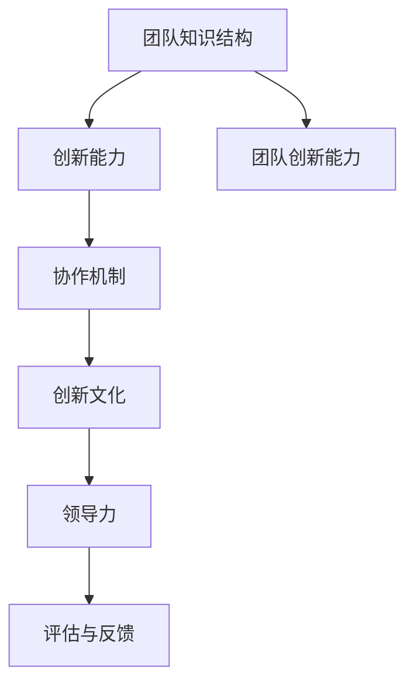
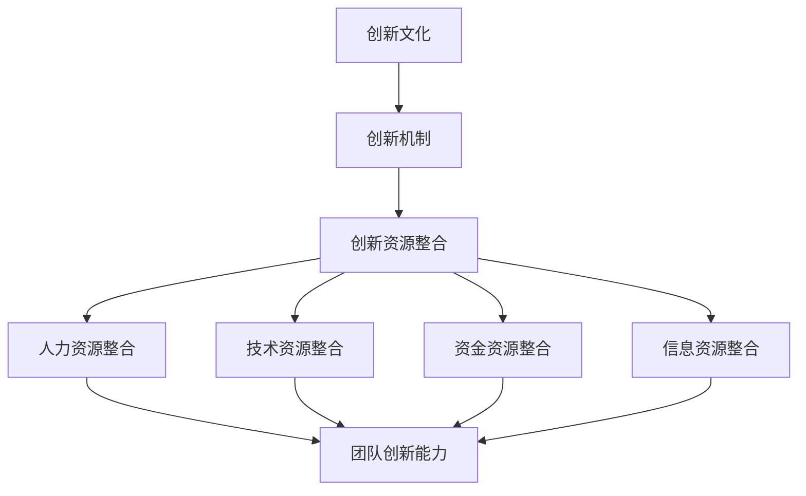
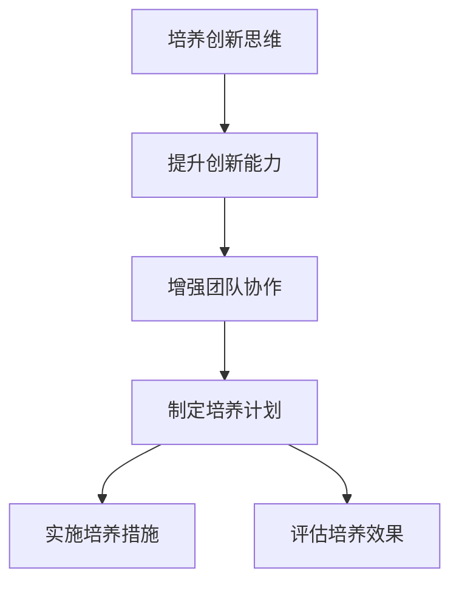
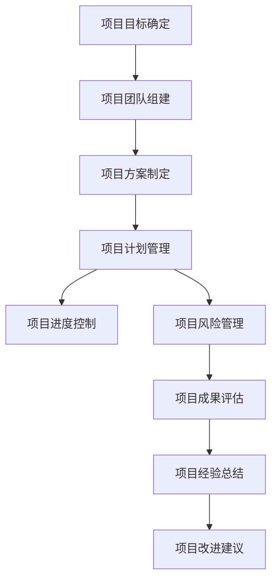
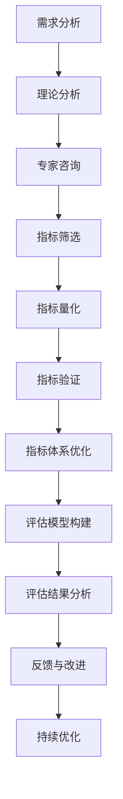

                 

### 文章标题

“如何激发团队创新能力”

> 关键词：团队创新、创新能力、激发策略、创新环境、培养方法、创新实践

> 摘要：本文将深入探讨团队创新能力的重要性，分析如何构建有利于创新的团队环境，并提出一系列策略和方法，以帮助团队提升创新能力，从而在竞争激烈的市场中脱颖而出。通过理论讲解、案例分析以及项目实战，全面解析激发团队创新能力的核心要素和实践路径。

## 引言

在当今这个瞬息万变的时代，创新已经成为企业生存和发展的关键要素。随着全球化和数字化的发展，市场的竞争愈发激烈，企业必须具备强大的创新能力，才能在激烈的市场环境中立于不败之地。而团队创新能力的提升，更是企业创新成功的关键因素。因此，如何激发团队创新能力，成为众多企业领导者和技术专家关注的重要课题。

### 第1章：团队创新能力的重要性

#### 1.1.1 创新时代的背景与挑战

在快速变化的科技和市场需求下，企业面临前所未有的挑战。创新不再是某个个体或小团队的任务，而是整个团队乃至整个组织的共同使命。创新能力的提升，不仅可以提高企业的市场竞争力，还能促进企业的可持续发展。

- **创新对企业的意义**：创新是推动企业发展的源动力，能够帮助企业抓住市场机遇，应对外部变化，提升核心竞争力。

- **团队创新的重要性**：团队创新能够充分发挥团队成员的智慧和创造力，实现资源的最佳配置，提高创新效率。

- **当前企业面临的主要挑战**：如何在竞争激烈的市场环境中持续创新，如何激发团队的创新能力，如何实现团队内部的有效协作。

#### 1.1.2 创新的定义与分类

- **创新的概念**：创新是指在现有的基础上，通过新思想、新方法、新技术等方式，产生新的产品、服务、流程或商业模式。

- **创新的分类**：根据创新的内容和方式，创新可以分为技术创新、商业模式创新、流程创新等类型。

- **创新的层次**：从宏观层面来看，创新可以分为战略性创新、战术性创新和操作性创新三个层次。

#### 1.1.3 团队创新能力的内涵

- **团队创新能力的定义**：团队创新能力是指团队在创新过程中所表现出的综合能力，包括创新思维、创新能力、创新协同和创新管理等方面。

- **团队创新能力的构成要素**：团队创新能力的构成要素主要包括团队的知识结构、创新能力、协作机制、创新文化和领导力等。

- **团队创新能力的评估指标**：团队创新能力的评估指标可以包括创新成果的数量和质量、团队成员的创新参与度、创新效率和创新影响力等。

### 第2章：团队创新环境的构建

#### 2.1.1 创新文化的重要性

- **创新文化的定义**：创新文化是指企业在长期发展过程中，所形成的一种鼓励创新、支持创新、激励创新的价值观和行为规范。

- **创新文化对企业的影响**：创新文化能够激发员工的创新热情，提高团队的创新效率，增强企业的市场竞争力。

- **创新文化的建设方法**：建设创新文化需要从领导层的支持、员工的参与、制度的建设等方面入手，营造一个鼓励创新、宽容失败的企业氛围。

#### 2.1.2 创新机制的构建

- **创新机制的内涵**：创新机制是指企业为了实现创新目标，所建立的一系列管理制度和运行机制。

- **创新机制的设计原则**：创新机制的设计应遵循目标明确、流程简洁、激励有效、反馈及时等原则。

- **创新机制的运行模式**：创新机制的运行模式可以包括创新项目的立项、执行、评估和反馈等环节。

#### 2.1.3 创新资源的整合

- **创新资源的类型**：创新资源包括人力资源、技术资源、资金资源、信息资源等。

- **创新资源的获取与整合**：企业可以通过内部培养、外部引进、合作共享等方式，获取和整合创新资源。

- **创新资源的利用与优化**：企业需要充分利用现有资源，通过资源整合和优化，提高创新效率。

### 第3章：团队创新能力培养的策略

#### 3.1.1 成功的团队创新能力培养案例

- **案例分析**：通过分析成功企业的创新能力培养案例，总结其成功经验和关键因素。

- **案例启示**：为其他企业提供可借鉴的经验和启示，帮助其提升团队创新能力。

#### 3.1.2 团队创新能力培养的方法

- **培养创新思维**：通过思维训练、思维工具等方法，培养团队成员的创新思维。

- **提升创新能力**：通过技术培训、实践锻炼等方式，提升团队成员的创新能力。

- **增强团队协作**：通过团队建设活动、协同工作平台等方式，增强团队协作能力。

#### 3.1.3 团队创新能力培养的步骤

- **制定培养计划**：明确培养目标、内容、方法和时间安排。

- **实施培养措施**：按照培养计划，实施各项培养措施。

- **评估培养效果**：对培养效果进行评估，及时调整培养策略。

### 第4章：团队创新实践

#### 4.1.1 团队创新项目策划

- **项目目标的确定**：明确创新项目的目标，确保项目方向正确。

- **项目团队的组建**：组建专业、高效的创新项目团队。

- **项目方案的制定**：制定详细、可行的创新项目方案。

#### 4.1.2 团队创新项目实施

- **项目计划的管理**：对项目计划进行有效管理，确保项目按计划推进。

- **项目进度的控制**：对项目进度进行实时监控和控制。

- **项目风险的管理**：识别项目风险，制定风险应对措施。

#### 4.1.3 团队创新项目评估

- **项目成果的评估**：对创新项目的成果进行评估，确保项目达到预期目标。

- **项目经验的总结**：总结项目经验，提炼成功经验和教训。

- **项目改进的建议**：提出项目改进建议，为后续项目提供参考。

### 第5章：团队创新能力评估指标体系构建

#### 5.1.1 团队创新能力评估指标体系的设计原则

- **指标体系的基本框架**：明确评估指标体系的框架和层级结构。

- **指标体系的层级结构**：构建清晰的层级结构，确保指标的完整性和系统性。

- **指标体系的量化方法**：采用科学、合理的量化方法，对指标进行量化评估。

#### 5.1.2 团队创新能力评估指标体系的构建方法

- **数据收集**：收集相关数据，为指标体系的构建提供基础。

- **指标筛选**：根据评估目标，筛选出关键指标。

- **指标量化**：对指标进行量化，确保评估的科学性和准确性。

#### 5.1.3 团队创新能力评估指标体系的应用

- **评估模型的设计**：设计评估模型，对团队创新能力进行评估。

- **评估结果的分析**：对评估结果进行分析，发现团队创新能力的问题。

- **评估反馈的利用**：利用评估反馈，优化团队创新能力培养策略。

### 第6章：团队创新激励机制的构建

#### 6.1.1 创新激励机制的内涵

- **激励的概念**：激励是指通过外部刺激和内部动力，激发个体行为的过程。

- **激励的理论**：介绍主要激励理论，如马斯洛需求层次理论、赫兹伯格双因素理论等。

- **创新激励机制的定义**：创新激励机制是指企业为了激发员工的创新行为，所采取的一系列激励措施。

#### 6.1.2 创新激励机制的构建原则

- **激励目标的明确**：明确激励目标，确保激励措施与目标一致。

- **激励策略的创新**：创新激励策略，提高激励效果。

- **激励效果的评估**：评估激励效果，及时调整激励策略。

#### 6.1.3 创新激励机制的实施方法

- **激励机制的引入**：引入创新激励机制，明确激励机制的内容和形式。

- **激励策略的实施**：实施激励策略，确保激励措施的落实。

- **激励效果的跟踪**：跟踪激励效果，及时调整和优化激励策略。

### 第7章：团队创新能力提升的算法原理

#### 7.1.1 创新能力的算法模型

- **创新能力的数学模型**：介绍创新能力的数学模型，如创新能力指数模型等。

- **创新能力的数据分析模型**：介绍创新能力的数据分析模型，如机器学习模型等。

#### 7.1.2 创新能力的提升算法

- **常见的提升算法**：介绍常用的创新能力提升算法，如深度学习算法、强化学习算法等。

- **算法的应用场景**：分析算法在不同应用场景下的效果。

- **算法的优缺点分析**：分析不同算法的优缺点，为企业选择合适的算法提供参考。

#### 7.1.3 创新能力提升的实践应用

- **实际案例介绍**：介绍创新能力提升的实际案例，分析案例的实施过程和效果。

- **案例分析**：对案例进行深入分析，提炼经验教训。

- **案例启示**：为其他企业提供案例启示，帮助其提升创新能力。

### 第8章：团队创新能力提升项目实施

#### 8.1.1 项目背景与目标

- **项目背景介绍**：介绍项目背景，明确项目实施的原因和必要性。

- **项目目标设定**：设定明确的项目目标，确保项目有明确的方向。

#### 8.1.2 项目团队组建

- **团队成员的招募**：根据项目需求，招募合适的团队成员。

- **团队结构的搭建**：搭建合理的团队结构，确保团队高效运作。

#### 8.1.3 项目方案制定

- **创新方案的设计**：设计创新的解决方案，确保项目具有创新性。

- **项目计划的制定**：制定详细的项目计划，明确项目的执行步骤和时间安排。

#### 8.1.4 项目实施过程

- **项目执行**：按照项目计划，执行项目任务。

- **项目监控**：对项目进度和质量进行监控，确保项目按计划推进。

- **项目调整**：根据项目执行情况，及时调整项目计划和策略。

#### 8.1.5 项目评估与总结

- **项目成果评估**：对项目成果进行评估，确保项目达到预期目标。

- **项目经验总结**：总结项目经验，提炼成功经验和教训。

- **项目改进建议**：提出项目改进建议，为后续项目提供参考。

## 附录：参考资料与案例

### 8.1.1 相关理论

- **创新理论**：介绍创新理论的基本概念和主要理论框架。

- **团队理论**：介绍团队理论的基本概念和主要理论框架。

- **项目管理理论**：介绍项目管理理论的基本概念和主要理论框架。

### 8.1.2 实际案例

- **成功案例**：介绍成功企业的创新能力提升案例，分析案例的实施过程和效果。

- **失败案例**：介绍失败企业的创新能力提升案例，分析案例的原因和教训。

- **案例启示**：总结案例启示，为其他企业提供借鉴和参考。

以上是《如何激发团队创新能力》这本书的目录大纲。接下来，我们将逐章深入探讨，详细阐述每个章节的核心内容，提供实用的策略和方法，帮助读者理解和掌握团队创新能力的提升之道。作者：AI天才研究院/AI Genius Institute & 禅与计算机程序设计艺术 /Zen And The Art of Computer Programming。

---

### 第1章：团队创新能力的重要性

在当今这个瞬息万变的时代，企业面临的挑战和机遇前所未有。为了在激烈的市场竞争中脱颖而出，企业必须具备强大的创新能力。而团队创新能力作为企业整体创新能力的重要组成部分，其提升至关重要。本章将首先探讨团队创新能力的重要性，然后介绍创新的定义与分类，最后深入分析团队创新能力的内涵，为后续章节的讨论奠定基础。

#### 1.1.1 创新时代的背景与挑战

随着全球化和数字化的加速发展，企业所处的市场环境变得更加复杂和多变。创新不再是一个可选的选项，而是企业生存和发展的必备能力。以下是创新对企业的一些关键影响：

1. **提高竞争力**：通过不断创新，企业能够推出具有竞争力的产品和服务，满足消费者的需求，从而在激烈的市场竞争中占据有利地位。
2. **拓展市场**：创新可以帮助企业发现新的市场机会，进入新的领域，从而扩大市场份额，提升企业的盈利能力。
3. **提升效率**：通过流程创新和新技术应用，企业可以优化运营流程，提高生产效率，降低成本。
4. **促进可持续发展**：创新有助于企业实现绿色生产，减少资源消耗和环境污染，推动企业的可持续发展。

然而，创新并非易事。企业在创新过程中面临诸多挑战：

1. **技术瓶颈**：在某些领域，企业可能面临技术瓶颈，难以实现技术突破。
2. **资源限制**：创新需要投入大量的人力、物力和财力，企业可能面临资源不足的困境。
3. **市场风险**：创新产品或服务可能面临市场不确定性，包括消费者接受度、竞争对手反应等因素。
4. **内部阻力**：企业内部可能存在保守思维、惯性思维等阻力，影响创新的推进。

#### 1.1.2 创新的定义与分类

创新是一个广泛而复杂的概念，可以从不同的角度进行定义和分类。以下是几种常见的定义和分类方式：

1. **创新的概念**：
   - **技术创新**：指通过新技术、新材料、新工艺等方式，改进现有产品或服务，或开发全新的产品或服务。
   - **商业模式创新**：指通过改变产品或服务的提供方式、定价策略、渠道等，实现商业模式的创新。
   - **流程创新**：指通过优化运营流程，提高效率和质量，实现流程的创新。

2. **创新的分类**：
   - **渐进式创新**：指在现有产品或服务的基础上，逐步改进和优化，提高性能、降低成本。
   - **颠覆式创新**：指通过全新的技术或商业模式，彻底颠覆现有市场格局，创造新的市场机会。
   - **增量创新**：指在现有产品或服务的基础上，增加新的功能或特性，满足不同消费者的需求。
   - **整合创新**：指将不同的技术、产品或服务整合起来，形成新的解决方案，满足用户的新需求。

3. **创新的层次**：
   - **战略性创新**：指企业在长期战略规划中进行的创新，关系到企业的核心竞争力和发展方向。
   - **战术性创新**：指企业在短期经营中进行的创新，旨在提高运营效率和市场份额。
   - **操作性创新**：指企业在日常运营中进行的创新，涉及具体操作流程和方法的改进。

#### 1.1.3 团队创新能力的内涵

团队创新能力是指一个团队在创新过程中所表现出的综合能力，它不仅仅包括个体的创新能力，还包括团队内部的协作、沟通和协调能力。以下是团队创新能力的一些关键要素：

1. **团队的知识结构**：团队的知识结构决定了团队的创新潜力。一个结构合理的团队应该具备不同领域的专业知识和技能，从而能够在创新过程中相互补充，形成协同效应。

2. **创新能力**：团队成员的创新能力的提升是团队创新能力的关键。这需要通过培训、实践和知识分享等方式，不断提高团队成员的创新思维和技能。

3. **协作机制**：团队协作是实现创新目标的重要保障。一个有效的协作机制能够促进团队成员之间的沟通和合作，提高团队的整体创新能力。

4. **创新文化**：创新文化是企业或团队内部的一种价值观和行为规范，它鼓励创新思维，容忍失败，支持团队成员的创新行为。

5. **领导力**：领导者在团队创新过程中扮演着关键角色。优秀的领导者能够激发团队成员的创新能力，提供必要的支持和资源，推动团队创新目标的实现。

6. **评估与反馈**：定期对团队的创新能力进行评估和反馈，有助于发现团队在创新过程中存在的问题，及时进行调整和优化。

#### 核心概念与联系

为了更好地理解团队创新能力的内涵，我们可以通过一个Mermaid流程图来展示核心概念之间的联系：



在这个流程图中，团队知识结构、创新能力、协作机制、创新文化、领导力和评估与反馈共同构成了团队创新能力的核心要素，它们相互关联、相互影响，共同推动团队创新能力的提升。

#### 数学模型和公式

在团队创新能力评估中，我们可以使用以下数学模型来量化评估结果：

$$
IC = w_1 \cdot KS + w_2 \cdot AI + w_3 \cdot CM + w_4 \cdot IC + w_5 \cdot L + w_6 \cdot AR
$$

其中：
- \( IC \) 表示团队创新能力指数
- \( w_1, w_2, w_3, w_4, w_5, w_6 \) 分别表示权重系数
- \( KS \) 表示团队知识结构
- \( AI \) 表示创新能力
- \( CM \) 表示协作机制
- \( IC \) 表示创新文化
- \( L \) 表示领导力
- \( AR \) 表示评估与反馈

权重系数的确定可以根据企业或团队的实际情况进行分配，例如，如果团队知识结构对创新能力的影响较大，可以适当提高 \( w_1 \) 的值。

#### 举例说明

假设一个团队在创新能力评估中的各项指标如下：

- 团队知识结构 \( KS = 0.8 \)
- 创新能力 \( AI = 0.9 \)
- 协作机制 \( CM = 0.7 \)
- 创新文化 \( IC = 0.85 \)
- 领导力 \( L = 0.75 \)
- 评估与反馈 \( AR = 0.8 \)

根据上述数学模型，可以计算该团队的创新能力指数：

$$
IC = 0.2 \cdot 0.8 + 0.2 \cdot 0.9 + 0.2 \cdot 0.7 + 0.2 \cdot 0.85 + 0.2 \cdot 0.75 + 0.2 \cdot 0.8 = 0.83
$$

这个结果表示该团队的创新能力指数为 0.83，处于中等水平。通过评估结果，团队可以针对自身薄弱环节进行改进，进一步提高创新能力。

#### 结论

团队创新能力在企业创新过程中起着至关重要的作用。通过构建良好的创新环境、培养团队创新能力、制定有效的创新策略和评估机制，企业可以不断提升团队创新能力，从而在市场竞争中占据有利地位。本章对团队创新能力的重要性、创新的定义与分类以及团队创新能力的内涵进行了深入探讨，为后续章节的讨论奠定了基础。在接下来的章节中，我们将进一步探讨团队创新环境的构建、创新能力培养的策略以及创新实践的具体方法，帮助读者全面了解并掌握团队创新能力的提升之道。

---

### 第2章：团队创新环境的构建

在第一章中，我们探讨了团队创新能力的重要性以及相关的核心概念。为了充分发挥团队的创新能力，企业需要构建一个有利于创新的环境。本章将详细介绍如何构建有利于创新的团队环境，包括创新文化的建设、创新机制的构建以及创新资源的整合。通过这些措施，企业可以为团队创造一个充满活力、鼓励创新的工作氛围，从而提升团队的创新能力。

#### 2.1.1 创新文化的重要性

创新文化是指企业或团队内部形成的一种鼓励创新、支持创新、激励创新的价值观和行为规范。创新文化是团队创新能力的核心驱动力，对企业的创新能力和持续发展具有重要影响。以下是创新文化对企业的一些关键影响：

1. **激励创新思维**：创新文化能够激发员工的创新思维，鼓励员工敢于尝试、勇于探索，从而推动企业的创新活动。
2. **促进知识共享**：创新文化鼓励团队成员之间分享知识和经验，促进知识的流动和积累，为团队的创新提供丰富的资源。
3. **增强团队协作**：创新文化强调团队合作，鼓励团队成员相互支持、相互学习，从而提高团队的协作效率。
4. **提升企业竞争力**：创新文化能够提高企业的创新能力，帮助企业在市场竞争中保持领先地位。

#### 创新文化的建设方法

要建设创新文化，企业需要从以下几个方面入手：

1. **领导层的支持**：领导层的重视和支持是建设创新文化的关键。企业领导者应该树立创新意识，鼓励员工提出创新想法，并对创新行为给予认可和支持。
2. **培训与教育**：通过培训和教育，提高员工对创新文化的认识和认同，培养员工的创新思维和能力。
3. **激励与奖励**：建立激励机制，对在创新方面表现突出的员工给予奖励，激励员工积极参与创新活动。
4. **沟通与交流**：通过定期的团队会议、内部培训和交流活动，促进团队成员之间的沟通和交流，增强团队凝聚力。
5. **包容失败**：创新过程中不可避免会遇到失败，企业需要建立一种包容失败的氛围，鼓励员工从失败中吸取教训，继续尝试和创新。

#### 2.1.2 创新机制的构建

创新机制是指企业为了实现创新目标，所建立的一系列管理制度和运行机制。一个有效的创新机制能够提高团队的创新能力，加速创新项目的推进。以下是构建创新机制的几个关键步骤：

1. **明确创新目标**：企业需要明确创新的目标和方向，确保创新活动与企业的战略目标相一致。
2. **创新项目的立项**：根据创新目标，选择合适的创新项目，并明确项目的目标、预算、时间表和负责人。
3. **项目团队的建设**：组建专业的创新项目团队，团队成员应该具备相关的专业技能和创新能力。
4. **创新项目的执行**：按照项目计划，执行创新项目，确保项目按计划推进，并及时调整项目计划和策略。
5. **项目评估与反馈**：对创新项目进行评估，总结项目经验，提炼成功经验和教训，为后续项目提供参考。

#### 创新机制的设计原则

在构建创新机制时，企业需要遵循以下原则：

1. **目标导向**：创新机制的设计应该以企业的目标为导向，确保创新活动能够帮助企业实现战略目标。
2. **流程简洁**：创新机制的流程应该简洁明了，减少不必要的审批环节，提高创新效率。
3. **激励有效**：创新机制应该建立有效的激励机制，对在创新方面表现突出的员工给予奖励，激发员工的创新热情。
4. **反馈及时**：创新机制需要建立反馈机制，对创新项目的进展和效果进行实时监控和反馈，及时调整项目计划和策略。
5. **灵活性**：创新机制应该具备一定的灵活性，能够根据市场环境和内部条件的变化，快速调整创新目标和策略。

#### 2.1.3 创新资源的整合

创新资源是指企业或团队在创新过程中所需要的人力、物力、财力和信息资源。有效的创新资源整合能够提高创新效率，降低创新成本。以下是创新资源整合的几个关键方面：

1. **人力资源整合**：企业需要充分发挥现有人力资源的优势，通过内部培训、外部引进等方式，提高员工的创新能力。
2. **技术资源整合**：企业需要整合内外部技术资源，包括自主研发、外部合作和专利技术等，为创新提供技术支持。
3. **资金资源整合**：企业需要合理规划创新资金，确保创新项目有足够的资金支持，并建立资金使用监督机制。
4. **信息资源整合**：企业需要建立高效的信息共享平台，促进内部信息的流通和外部信息的获取，为创新提供信息支持。

#### 创新资源的获取与整合

1. **内部培养**：企业可以通过内部培训和人才培养计划，提高员工的创新能力。例如，组织创新培训班、开展创新竞赛等。
2. **外部引进**：企业可以通过外部招聘、合作研发等方式，引进外部创新资源。例如，与高校、研究机构合作，共同开展创新项目。
3. **合作共享**：企业可以通过合作共享的方式，整合外部创新资源。例如，与产业链上下游企业建立合作关系，共享技术资源和市场信息。
4. **信息平台**：企业可以建立信息共享平台，促进内部信息的流通和外部信息的获取。例如，建立内部创新网站、参加行业交流活动等。

#### 创新资源的利用与优化

1. **合理配置**：企业需要根据创新项目的需求，合理配置创新资源，确保资源的高效利用。
2. **协同创新**：企业可以通过协同创新的方式，提高创新资源利用效率。例如，组织跨部门、跨领域的创新团队，共同推进创新项目。
3. **持续优化**：企业需要持续优化创新资源管理流程，提高创新资源利用效率。例如，定期评估创新资源使用情况，调整资源分配策略。
4. **风险控制**：企业需要建立风险控制机制，确保创新资源的安全和有效利用。例如，制定严格的资金使用规定，防止资源浪费。

#### 核心概念与联系

为了更好地理解团队创新环境的构建，我们可以通过一个Mermaid流程图来展示核心概念之间的联系：



在这个流程图中，创新文化、创新机制、创新资源整合以及人力资源整合、技术资源整合、资金资源整合、信息资源整合共同构成了团队创新环境的核心要素，它们相互关联、相互影响，共同推动团队创新能力的提升。

#### 数学模型和公式

在团队创新环境的构建中，我们可以使用以下数学模型来量化评估创新资源的利用效率：

$$
IE = w_1 \cdot HR + w_2 \cdot TR + w_3 \cdot FR + w_4 \cdot IR
$$

其中：
- \( IE \) 表示创新资源利用效率
- \( w_1, w_2, w_3, w_4 \) 分别表示权重系数
- \( HR \) 表示人力资源整合效率
- \( TR \) 表示技术资源整合效率
- \( FR \) 表示资金资源整合效率
- \( IR \) 表示信息资源整合效率

权重系数的确定可以根据企业的实际情况进行分配，例如，如果人力资源整合对创新资源的利用效率影响较大，可以适当提高 \( w_1 \) 的值。

#### 举例说明

假设一个企业在创新资源利用效率评估中的各项指标如下：

- 人力资源整合效率 \( HR = 0.8 \)
- 技术资源整合效率 \( TR = 0.9 \)
- 资金资源整合效率 \( FR = 0.7 \)
- 信息资源整合效率 \( IR = 0.85 \)

根据上述数学模型，可以计算该企业的创新资源利用效率：

$$
IE = 0.2 \cdot 0.8 + 0.2 \cdot 0.9 + 0.2 \cdot 0.7 + 0.2 \cdot 0.85 = 0.82
$$

这个结果表示该企业的创新资源利用效率为 0.82，处于中等水平。通过评估结果，企业可以针对自身薄弱环节进行改进，进一步提高创新资源利用效率。

#### 结论

构建有利于创新的团队环境是提升团队创新能力的关键步骤。通过建设创新文化、构建创新机制以及整合创新资源，企业可以为团队创造一个充满活力、鼓励创新的工作氛围，从而提升团队的创新能力。本章详细介绍了团队创新环境的构建方法，为后续章节的讨论提供了基础。在接下来的章节中，我们将进一步探讨团队创新能力培养的策略以及创新实践的具体方法，帮助读者全面了解并掌握团队创新能力的提升之道。

---

### 第3章：团队创新能力培养的策略

在了解了团队创新能力的重要性以及如何构建有利于创新的团队环境之后，接下来我们将探讨如何培养团队创新能力。团队创新能力不仅取决于个体的创新能力，还需要团队成员之间的协作和沟通。本章将介绍一系列有效的团队创新能力培养策略，包括成功案例的分析、具体培养方法的阐述以及培养过程的步骤。通过这些策略，企业可以系统性地提升团队的整体创新能力。

#### 3.1.1 成功的团队创新能力培养案例

1. **案例1：谷歌的“20%时间”政策**

   谷歌的“20%时间”政策是一个典型的成功案例。谷歌允许员工将其20%的工作时间用于个人感兴趣的项目，这些项目往往能够激发员工的创新思维，推动公司的创新。例如，谷歌搜索的诞生就是源于一个员工在20%时间内开发的个人项目。

2. **案例2：3M公司的“15%时间”创新政策**

   3M公司的“15%时间”政策鼓励员工将其15%的工作时间用于探索新的想法和项目。这种政策促进了3M公司许多创新产品的诞生，如即时贴便签、 Scotchtape 等。

3. **案例3：苹果公司的创新文化**

   苹果公司以其独特的企业文化和领导风格著称，其创始人史蒂夫·乔布斯注重对创新人才的培养和激励。苹果公司强调团队合作，鼓励员工跨部门合作，这种开放、协作的文化有助于激发员工的创新能力。

#### 案例分析

以上案例展示了不同企业通过不同的策略和措施，成功培养了团队创新能力。以下是这些案例的共性：

- **领导层的重视和支持**：成功的案例中，领导层对创新能力的培养高度重视，为员工提供必要的资源和支持。
- **鼓励自由探索**：企业允许员工在一定时间内自由探索新的想法和项目，这种自由探索的氛围有助于激发员工的创造力。
- **跨部门协作**：企业鼓励不同部门之间的协作和沟通，通过跨部门合作，实现资源的共享和优势互补。
- **持续培训和学习**：企业为员工提供持续的学习和培训机会，提高员工的技能和知识水平，从而增强创新能力。

#### 案例启示

成功企业的创新能力培养案例为其他企业提供了宝贵的经验和启示：

- **重视领导层的角色**：领导层应该树立创新意识，鼓励员工积极参与创新活动，为员工提供必要的支持和资源。
- **建立自由探索的环境**：企业应允许员工在一定时间内自由探索新的想法和项目，创造一个鼓励创新、宽容失败的氛围。
- **跨部门协作**：企业应鼓励不同部门之间的合作和沟通，通过跨部门合作，实现资源的共享和优势互补。
- **持续培训和学习**：企业应为员工提供持续的学习和培训机会，提高员工的技能和知识水平，从而增强创新能力。

#### 3.1.2 团队创新能力培养的方法

1. **培养创新思维**

   创新思维是团队创新能力的基础。以下是一些培养创新思维的方法：

   - **头脑风暴**：通过集体头脑风暴，激发团队成员的创意思维，产生新的想法。
   - **思维导图**：使用思维导图工具，帮助团队成员梳理思路，发现新的创意。
   - **思维训练**：通过逻辑思维、批判性思维等训练，提高团队成员的思维能力。

2. **提升创新能力**

   提升创新能力需要通过实践和培训来增强。以下是一些提升创新能力的方法：

   - **实践锻炼**：通过实际项目的开发和实践，提高团队成员的解决问题的能力和创新能力。
   - **技术培训**：为团队成员提供最新的技术培训，提高他们的技术能力和创新能力。
   - **经验分享**：鼓励团队成员分享自己的经验和见解，通过交流和讨论，激发新的创意。

3. **增强团队协作**

   团队协作是实现创新目标的重要保障。以下是一些增强团队协作的方法：

   - **团队建设活动**：通过团队建设活动，增强团队成员之间的信任和合作，提高团队协作效率。
   - **协同工作平台**：使用协同工作平台，实现团队成员之间的实时沟通和协作，提高工作效率。
   - **跨部门合作**：鼓励不同部门之间的合作，通过跨部门项目，实现资源的共享和优势互补。

#### 3.1.3 团队创新能力培养的步骤

1. **制定培养计划**

   制定团队创新能力培养计划，明确培养目标、内容和方法。以下是一些制定培养计划的步骤：

   - **评估当前创新能力**：评估团队当前的创新能力水平，确定培养的目标和方向。
   - **确定培养内容**：根据评估结果，确定需要培养的能力和技能。
   - **制定培养方法**：选择合适的培养方法，如培训、实践、团队建设等。
   - **制定时间表**：制定详细的培养时间表，确保培养计划能够按计划执行。

2. **实施培养措施**

   按照培养计划，实施各项培养措施。以下是一些实施培养措施的关键点：

   - **组织培训**：组织相关培训课程，提高团队成员的技能和知识水平。
   - **实践项目**：安排实际项目，让团队成员在实践中锻炼创新能力和解决问题的能力。
   - **团队建设活动**：定期组织团队建设活动，增强团队成员之间的信任和合作。

3. **评估培养效果**

   对培养效果进行评估，确保培养计划达到预期目标。以下是一些评估培养效果的方法：

   - **问卷反馈**：通过问卷收集团队成员的反馈，了解培养计划的效果。
   - **项目成果**：评估团队成员在实际项目中的表现，分析培养计划的成效。
   - **能力提升**：评估团队成员在技能和知识方面的提升情况，确定培养计划的有效性。

#### 核心概念与联系

为了更好地理解团队创新能力培养的策略，我们可以通过一个Mermaid流程图来展示核心概念之间的联系：



在这个流程图中，培养创新思维、提升创新能力、增强团队协作、制定培养计划、实施培养措施和评估培养效果共同构成了团队创新能力培养的核心环节，它们相互关联、相互影响，共同推动团队创新能力的提升。

#### 数学模型和公式

在团队创新能力培养中，我们可以使用以下数学模型来量化评估团队成员的创新能力：

$$
IC = w_1 \cdot IT + w_2 \cdot IT + w_3 \cdot CT
$$

其中：
- \( IC \) 表示团队创新能力
- \( w_1, w_2, w_3 \) 分别表示权重系数
- \( IT \) 表示创新思维能力
- \( CT \) 表示协作能力

权重系数的确定可以根据企业的实际情况进行分配，例如，如果创新思维能力对创新能力的影响较大，可以适当提高 \( w_1 \) 的值。

#### 举例说明

假设一个团队在创新能力培养评估中的各项指标如下：

- 创新思维能力 \( IT = 0.8 \)
- 协作能力 \( CT = 0.9 \)

根据上述数学模型，可以计算该团队的创新能力：

$$
IC = 0.2 \cdot 0.8 + 0.2 \cdot 0.9 + 0.6 \cdot 0.9 = 0.88
$$

这个结果表示该团队的创新能力为 0.88，处于中等水平。通过评估结果，团队可以针对性地提升创新思维能力和协作能力，进一步提高整体创新能力。

#### 结论

团队创新能力培养是企业提升整体创新能力的重要策略。通过分析成功案例，了解培养创新思维、提升创新能力和增强团队协作的具体方法，企业可以系统性地提升团队的整体创新能力。本章详细介绍了团队创新能力培养的策略和步骤，为后续章节的讨论提供了基础。在接下来的章节中，我们将进一步探讨团队创新实践的详细方法，帮助读者全面了解并掌握团队创新能力的提升之道。

---

### 第4章：团队创新实践

在前面三章中，我们讨论了团队创新的重要性、团队创新环境的构建以及团队创新能力培养的策略。这些讨论为团队创新实践提供了理论依据和指导思路。在本章中，我们将重点探讨团队创新实践的具体方法和步骤，包括团队创新项目的策划、实施和评估。通过这些实践，团队可以有效地将创新理念转化为实际成果，从而提升企业的核心竞争力。

#### 4.1.1 团队创新项目策划

团队创新项目的策划是创新实践的第一步，也是至关重要的一步。成功的项目策划能够确保创新项目方向的正确性，提高项目成功的可能性。以下是团队创新项目策划的关键步骤：

1. **项目目标的确定**

   确定创新项目的目标是最关键的一步。项目目标应明确、具体，并与企业的战略目标保持一致。以下是一些建议：

   - **目标明确**：项目目标应清晰、具体，避免模糊不清。
   - **目标可衡量**：目标应具有可衡量性，以便在项目实施过程中进行监控和评估。
   - **目标与战略一致**：项目目标应与企业的长期战略目标保持一致，以确保项目对企业的发展具有实际价值。

2. **项目团队的组建**

   一个高效的项目团队是创新项目成功的关键。团队应由多学科、多背景的成员组成，以确保项目从不同角度进行思考和实施。以下是一些建议：

   - **多元化背景**：团队应包括不同部门、不同专业背景的成员，以便在项目中实现知识的互补和思维的碰撞。
   - **明确角色和责任**：每个团队成员应明确自己的角色和责任，确保项目执行的有序性和高效性。
   - **领导力**：团队应有一位有经验的领导者，负责协调和管理项目进展。

3. **项目方案的制定**

   项目方案是创新项目的具体实施计划，包括项目的方法、步骤、时间表和资源配置等。以下是一些建议：

   - **详细规划**：项目方案应详细规划项目的每个阶段，包括需求分析、设计、开发、测试和部署等。
   - **资源调配**：明确项目所需的资源，包括人力、物力和财力，并进行合理调配。
   - **风险管理**：评估项目可能面临的风险，制定相应的风险应对措施。

#### 4.1.2 团队创新项目实施

创新项目的实施是将项目方案转化为实际成果的过程。在项目实施过程中，团队需要严格按照项目方案进行操作，同时要灵活应对各种问题和挑战。以下是团队创新项目实施的关键步骤：

1. **项目计划的管理**

   项目计划的管理是确保项目按计划推进的重要保障。以下是一些建议：

   - **项目进度控制**：定期监控项目进度，确保项目按计划进行，并及时调整计划以应对潜在的问题。
   - **资源管理**：合理调配项目资源，确保项目所需资源得到充分利用。
   - **沟通协调**：保持团队成员之间的沟通和协调，确保项目执行的顺利进行。

2. **项目进度的控制**

   项目进度的控制是确保项目按时完成的关键。以下是一些建议：

   - **定期检查**：定期检查项目进度，及时发现并解决问题。
   - **进度报告**：定期向项目团队和领导层报告项目进度，以便进行及时调整和决策。
   - **变更管理**：在项目实施过程中，难免会遇到计划变更，应建立变更管理机制，确保变更的合理性和可控性。

3. **项目风险的管理**

   项目风险的管理是确保项目成功的关键。以下是一些建议：

   - **风险识别**：识别项目可能面临的风险，包括技术风险、市场风险、资源风险等。
   - **风险评估**：对识别出的风险进行评估，确定风险的严重程度和发生概率。
   - **风险应对**：制定风险应对措施，降低风险发生的可能性或减轻风险的影响。

#### 4.1.3 团队创新项目评估

创新项目的评估是对项目成果的全面检查和总结，旨在总结经验教训，为未来的创新项目提供参考。以下是团队创新项目评估的关键步骤：

1. **项目成果的评估**

   对项目成果进行评估，检查项目是否达到预期目标。以下是一些建议：

   - **目标达成度**：评估项目是否实现了预定的目标，包括功能实现、性能指标、用户满意度等。
   - **质量评估**：评估项目成果的质量，包括代码质量、系统稳定性、用户体验等。
   - **效益评估**：评估项目对企业产生的效益，包括经济效益、社会效益等。

2. **项目经验的总结**

   对项目经验进行总结，提炼成功经验和教训。以下是一些建议：

   - **成功经验**：总结项目中的成功经验，包括创新点、项目管理、团队协作等。
   - **教训反思**：反思项目中的不足和失败原因，总结教训，为未来的项目提供改进方向。
   - **知识分享**：组织项目经验分享会议，让团队成员分享项目经验，促进知识的传播和积累。

3. **项目改进的建议**

   根据项目评估的结果，提出项目改进的建议，为未来的创新项目提供参考。以下是一些建议：

   - **流程优化**：根据项目评估的结果，优化项目管理流程，提高项目执行效率。
   - **技术改进**：根据项目评估的结果，改进项目的技术方案，提高项目成果的质量。
   - **团队建设**：根据项目评估的结果，加强团队建设，提高团队的协作能力和创新能力。

#### 核心概念与联系

为了更好地理解团队创新实践的过程，我们可以通过一个Mermaid流程图来展示核心概念之间的联系：



在这个流程图中，项目目标确定、项目团队组建、项目方案制定、项目计划管理、项目进度控制、项目风险管理、项目成果评估、项目经验总结和项目改进建议共同构成了团队创新实践的核心环节，它们相互关联、相互影响，共同推动团队创新实践的成功。

#### 数学模型和公式

在团队创新项目评估中，我们可以使用以下数学模型来量化评估项目成果：

$$
PA = w_1 \cdot TA + w_2 \cdot QA + w_3 \cdot EA
$$

其中：
- \( PA \) 表示项目成果评估得分
- \( w_1, w_2, w_3 \) 分别表示权重系数
- \( TA \) 表示目标达成度
- \( QA \) 表示质量评估
- \( EA \) 表示效益评估

权重系数的确定可以根据项目的具体情况和企业的优先级进行分配。

#### 举例说明

假设一个团队在创新项目评估中的各项指标如下：

- 目标达成度 \( TA = 0.9 \)
- 质量评估 \( QA = 0.85 \)
- 效益评估 \( EA = 0.8 \)

根据上述数学模型，可以计算该项目的成果评估得分：

$$
PA = 0.2 \cdot 0.9 + 0.2 \cdot 0.85 + 0.6 \cdot 0.8 = 0.86
$$

这个结果表示该项目的成果评估得分为 0.86，处于良好水平。通过评估得分，团队可以了解项目成果的整体表现，并为未来的项目提供改进方向。

#### 结论

团队创新实践是团队创新能力提升的重要环节。通过科学的策划、严格的实施和全面的评估，团队可以有效地将创新理念转化为实际成果，提升企业的核心竞争力。本章详细介绍了团队创新实践的具体方法和步骤，为读者提供了实用的指导。在接下来的章节中，我们将进一步探讨团队创新能力评估指标体系的构建，为团队创新能力的提升提供更加系统的评估工具和方法。

---

### 第5章：团队创新能力评估指标体系构建

在团队创新实践中，评估团队创新能力至关重要。一个完善的评估指标体系能够帮助企业全面了解团队的创新能力，识别存在的问题，并为后续的创新活动提供指导。本章将深入探讨如何构建团队创新能力评估指标体系，包括设计原则、构建方法和应用。

#### 5.1.1 团队创新能力评估指标体系的设计原则

构建团队创新能力评估指标体系时，应遵循以下设计原则：

1. **全面性**：指标体系应覆盖创新能力的各个方面，包括创新思维、创新能力、协作机制、创新文化等。

2. **科学性**：指标体系应基于科学的理论基础和实践经验，确保评估结果的准确性和可靠性。

3. **可操作性**：指标体系应具有明确的操作性和可衡量性，便于实际操作和量化评估。

4. **动态性**：指标体系应能够适应团队创新能力的动态变化，及时反映团队创新能力的提升和下降。

5. **针对性**：指标体系应根据企业的实际情况和战略目标，有针对性地选择和设计评估指标。

#### 5.1.2 团队创新能力评估指标体系的构建方法

构建团队创新能力评估指标体系，通常包括以下几个步骤：

1. **需求分析**：了解企业的战略目标和业务需求，确定评估指标体系应涵盖的内容。

2. **理论分析**：基于创新理论，分析影响团队创新能力的关键因素，确定初步的评估指标。

3. **专家咨询**：邀请创新管理专家、企业领导者和团队负责人进行咨询，收集意见和建议。

4. **指标筛选**：根据需求分析和理论分析结果，筛选出关键评估指标，确保指标体系的全面性和针对性。

5. **指标量化**：对筛选出的评估指标进行量化，制定量化的方法和标准。

6. **指标验证**：通过实地调研和实验验证，确保评估指标的有效性和可操作性。

7. **指标体系优化**：根据验证结果，对评估指标体系进行优化和调整，确保其科学性和实用性。

#### 5.1.3 团队创新能力评估指标体系的应用

团队创新能力评估指标体系的应用主要包括以下几个方面：

1. **评估模型的构建**：根据评估指标体系，构建评估模型，确定评估标准和评估方法。

2. **评估结果的分析**：对评估结果进行统计分析，识别团队创新能力的优势和劣势。

3. **反馈与改进**：根据评估结果，反馈给团队和管理层，指导团队改进创新能力和创新活动。

4. **持续优化**：定期对评估指标体系进行优化和调整，确保其适应团队创新能力的动态变化。

#### 核心概念与联系

为了更好地理解团队创新能力评估指标体系的构建，我们可以通过一个Mermaid流程图来展示核心概念之间的联系：



在这个流程图中，需求分析、理论分析、专家咨询、指标筛选、指标量化、指标验证、指标体系优化、评估模型构建、评估结果分析、反馈与改进和持续优化共同构成了团队创新能力评估指标体系构建的核心环节，它们相互关联、相互影响，共同推动团队创新能力的提升。

#### 数学模型和公式

在团队创新能力评估中，我们可以使用以下数学模型来综合评估团队创新能力：

$$
IC = w_1 \cdot IT + w_2 \cdot AI + w_3 \cdot CM + w_4 \cdot IC + w_5 \cdot L + w_6 \cdot AR
$$

其中：
- \( IC \) 表示团队创新能力指数
- \( w_1, w_2, w_3, w_4, w_5, w_6 \) 分别表示权重系数
- \( IT \) 表示创新思维能力
- \( AI \) 表示创新能力
- \( CM \) 表示协作机制
- \( IC \) 表示创新文化
- \( L \) 表示领导力
- \( AR \) 表示评估与反馈

权重系数的确定可以根据企业的实际情况和战略目标进行分配，例如，如果创新思维能力对创新能力的影响较大，可以适当提高 \( w_1 \) 的值。

#### 举例说明

假设一个团队在创新能力评估中的各项指标如下：

- 创新思维能力 \( IT = 0.8 \)
- 创新能力 \( AI = 0.9 \)
- 协作机制 \( CM = 0.7 \)
- 创新文化 \( IC = 0.85 \)
- 领导力 \( L = 0.75 \)
- 评估与反馈 \( AR = 0.8 \)

根据上述数学模型，可以计算该团队的创新能力指数：

$$
IC = 0.2 \cdot 0.8 + 0.2 \cdot 0.9 + 0.2 \cdot 0.7 + 0.2 \cdot 0.85 + 0.2 \cdot 0.75 + 0.2 \cdot 0.8 = 0.83
$$

这个结果表示该团队的创新能力指数为 0.83，处于中等水平。通过评估结果，团队可以针对性地提升创新思维能力和协作机制，进一步提高整体创新能力。

#### 结论

团队创新能力评估指标体系的构建是提升团队创新能力的重要环节。通过科学的设计和实施，企业可以全面了解团队的创新能力，识别存在的问题，并为后续的创新活动提供指导。本章详细介绍了团队创新能力评估指标体系的构建原则、方法和应用，为读者提供了实用的指导。在接下来的章节中，我们将进一步探讨团队创新激励机制的构建，为团队创新能力的提升提供更加完善的保障。

---

### 第6章：团队创新激励机制的构建

在团队创新过程中，激励机制起着至关重要的作用。有效的激励机制能够激发团队成员的积极性、主动性和创造力，提高团队的整体创新能力。本章将深入探讨团队创新激励机制的构建，包括激励机制的内涵、构建原则、实施方法和实际应用。

#### 6.1.1 创新激励机制的内涵

创新激励机制是指企业为了激发员工的创新行为，通过物质激励和精神激励相结合的方式，激发员工的积极性和创造力。创新激励机制不仅关注员工的工作成果，更注重员工的创新过程和努力程度。

1. **物质激励**：物质激励是通过提供奖金、股权、福利等物质回报来激励员工。物质激励具有直接性、明显性和即时性的特点，能够迅速提高员工的积极性和工作动力。

2. **精神激励**：精神激励是通过表彰、认可、晋升等非物质手段来激励员工。精神激励注重员工的个人价值和职业发展，能够增强员工的归属感和荣誉感，从而提高团队的凝聚力和创新能力。

3. **综合激励**：创新激励机制应该是物质激励和精神激励的综合运用。通过合理的物质激励和精神激励，企业能够更好地调动员工的积极性和创造力，实现团队创新能力的提升。

#### 6.1.2 创新激励机制的构建原则

构建创新激励机制时，应遵循以下原则：

1. **公平性**：激励机制的制定应确保公平性，避免因不公平而产生员工不满和团队分裂。

2. **目标明确**：激励机制的设定应明确目标，确保激励措施与企业的战略目标和团队的创新目标相一致。

3. **灵活性**：激励机制的设定应具有灵活性，能够根据市场环境和团队实际情况进行调整。

4. **可持续性**：激励机制的设定应具备可持续性，确保激励措施能够长期有效，而不只是短期行为。

5. **可衡量性**：激励机制的设定应具备可衡量性，确保激励措施的效果能够通过量化的指标进行评估。

#### 6.1.3 创新激励机制的实施方法

1. **设立创新奖励制度**

   企业可以设立创新奖励制度，对在创新活动中表现突出的员工给予奖励。奖励制度应包括以下内容：

   - **创新成果奖励**：对取得创新成果的员工给予物质奖励，如奖金、股权等。
   - **创新过程奖励**：对在创新过程中付出努力但未取得最终成果的员工给予奖励，如荣誉证书、表彰等。
   - **创新项目奖励**：对成功完成创新项目的团队给予奖励，激励团队协作和创新。

2. **实施绩效考核**

   企业可以通过绩效考核来激励员工，将创新成果纳入绩效考核指标，设置合理的创新绩效目标和评价标准。绩效考核结果应与薪酬、晋升等直接挂钩。

3. **提供职业发展机会**

   企业应提供丰富的职业发展机会，鼓励员工参与创新活动。通过内部晋升、外部培训、专业认证等方式，提升员工的职业素养和创新能力。

4. **营造良好的创新氛围**

   企业应营造一个鼓励创新、宽容失败的氛围。通过定期的创新交流活动、创新竞赛等形式，激发员工的创新热情，促进团队的协作和创新。

5. **建立创新文化**

   企业应建立创新文化，鼓励员工勇于创新、敢于尝试。通过树立创新榜样、宣传创新事迹等方式，形成企业内部的创新文化。

#### 6.1.4 创新激励机制的实际应用

1. **案例1：谷歌的创新激励机制**

   谷歌以其独特的创新激励机制著称。谷歌通过设立“20%时间”政策，鼓励员工将20%的工作时间用于个人感兴趣的项目。此外，谷歌还设立创新奖金，对在创新活动中取得显著成果的员工给予奖励。这些措施激发了谷歌员工的创新热情，推动了公司的持续创新。

2. **案例2：特斯拉的创新激励机制**

   特斯拉通过设立创新奖金和股权激励计划，激励员工的创新行为。特斯拉的CEO埃隆·马斯克经常亲自参与创新项目的评估和奖励，这不仅提升了员工的创新积极性，还增强了团队的凝聚力。

3. **案例3：宝洁的创新激励机制**

   宝洁通过设立“创新之星”奖项，对在创新活动中表现突出的员工给予表彰。此外，宝洁还提供丰富的内部培训机会，帮助员工提升技能和创新能力。这些措施有效提升了宝洁的创新能力和市场竞争力。

#### 结论

构建有效的创新激励机制是提升团队创新能力的关键。通过合理的物质激励和精神激励，企业可以激发员工的创新热情和积极性，促进团队协作和创新。本章详细介绍了创新激励机制的内涵、构建原则、实施方法和实际应用，为读者提供了实用的指导。在接下来的章节中，我们将进一步探讨团队创新能力提升的算法原理，为团队创新能力的提升提供更加科学和系统的方法。

---

### 第7章：团队创新能力提升的算法原理

在团队创新能力的提升过程中，算法原理扮演着至关重要的角色。通过算法的优化和应用，可以大幅提高团队的创新效率和成果质量。本章将深入探讨团队创新能力提升的算法原理，包括创新能力算法模型、提升算法和方法，以及实际应用。

#### 7.1.1 创新能力的算法模型

团队创新能力提升的算法模型主要涉及以下两个方面：

1. **创新能力指数模型**：

   创新能力指数模型是一种常用的量化评估方法，用于评估团队的整体创新能力。该模型基于一系列关键指标，通过数学模型进行综合评估，从而得出团队的创新能力指数。

   数学模型可以表示为：

   $$
   IC = w_1 \cdot KS + w_2 \cdot AI + w_3 \cdot CM + w_4 \cdot IC + w_5 \cdot L + w_6 \cdot AR
   $$

   其中：
   - \( IC \)：团队创新能力指数
   - \( w_1, w_2, w_3, w_4, w_5, w_6 \)：权重系数
   - \( KS \)：团队知识结构
   - \( AI \)：创新能力
   - \( CM \)：协作机制
   - \( IC \)：创新文化
   - \( L \)：领导力
   - \( AR \)：评估与反馈

   权重系数可以根据企业的实际情况和战略目标进行分配，例如，如果创新文化对创新能力的影响较大，可以适当提高 \( w_4 \) 的值。

2. **机器学习模型**：

   机器学习模型在团队创新能力提升中也有广泛应用。通过大数据分析，机器学习模型可以挖掘团队创新活动的潜在规律，预测创新成果，从而提供决策支持。

   常见的机器学习模型包括：

   - **线性回归模型**：用于分析创新能力与各个指标之间的线性关系，帮助识别关键因素。
   - **决策树模型**：用于分类和回归分析，帮助识别影响团队创新能力的各种因素。
   - **神经网络模型**：用于构建复杂的非线性关系，提升创新能力预测的准确性。

#### 7.1.2 创新能力的提升算法和方法

1. **深度学习算法**：

   深度学习算法是一种基于多层神经网络的算法，能够自动学习和提取数据中的复杂特征。在团队创新能力提升中，深度学习算法可以用于分析团队成员的行为和沟通模式，发现潜在的创新机会。

   常见的深度学习算法包括：

   - **卷积神经网络（CNN）**：用于图像和视频数据的处理，可以帮助团队分析视觉信息，发现创新点。
   - **循环神经网络（RNN）**：用于处理序列数据，可以帮助团队分析历史创新数据和团队成员的行为模式。

2. **强化学习算法**：

   强化学习算法是一种通过试错和反馈来优化决策的算法。在团队创新能力提升中，强化学习算法可以用于优化创新项目的管理流程，提高项目的成功率。

   常见的强化学习算法包括：

   - **Q学习算法**：通过评估不同决策的结果，选择最优的决策。
   - **深度强化学习算法**：结合深度学习和强化学习，提高决策的准确性和效率。

3. **数据挖掘算法**：

   数据挖掘算法是一种用于从大量数据中提取有用信息和知识的方法。在团队创新能力提升中，数据挖掘算法可以用于分析创新过程中的数据，发现潜在的关联和趋势。

   常见的数据挖掘算法包括：

   - **关联规则挖掘算法**：用于发现数据之间的关联关系，帮助团队识别创新机会。
   - **聚类分析算法**：用于将数据分成不同的群体，帮助团队发现潜在的团队协作模式。

#### 7.1.3 创新能力提升的实际应用

1. **案例1：谷歌的深度学习算法应用**

   谷歌在其搜索算法中广泛应用了深度学习算法。通过分析用户搜索行为和网页内容，谷歌的深度学习算法能够为用户提供更准确的搜索结果。这一创新应用不仅提升了谷歌的搜索用户体验，也增强了谷歌的市场竞争力。

2. **案例2：亚马逊的强化学习算法应用**

   亚马逊通过强化学习算法优化其物流配送流程，提高了配送效率。亚马逊的算法通过不断尝试和调整配送策略，最终找到了最优的配送路径和时间安排，从而减少了配送时间和成本。

3. **案例3：阿里巴巴的数据挖掘算法应用**

   阿里巴巴通过数据挖掘算法对其电商数据进行分析，发现了用户购物的规律和偏好。这些分析结果帮助阿里巴巴优化了商品推荐算法，提高了用户的购物体验和转化率。

#### 结论

团队创新能力提升的算法原理为团队创新提供了强大的技术支持。通过引入和应用深度学习、强化学习、数据挖掘等算法，企业可以显著提升团队的创新效率和成果质量。本章详细介绍了团队创新能力提升的算法原理和实际应用，为读者提供了实用的指导。在接下来的章节中，我们将进一步探讨团队创新能力提升的项目实战，帮助读者将理论知识应用到实际项目中，全面提升团队创新能力。

---

### 第8章：团队创新能力提升项目实施

在了解了团队创新能力提升的理论基础和算法原理后，本章节将重点介绍如何将理论转化为实践，通过具体的项目实施来提升团队的创新能力。本章将包括项目背景与目标的介绍、项目团队组建、项目方案制定、项目实施过程、项目评估与总结以及项目改进建议。

#### 8.1.1 项目背景与目标

每个创新项目的开始都需要明确项目的背景和目标。项目背景通常包括市场环境、企业战略需求、技术发展趋势等方面的分析。以下是一个项目背景与目标的示例：

**项目背景**：
- 当前市场竞争激烈，技术更新迭代迅速，企业需要通过创新来保持竞争优势。
- 企业现有产品在某些功能上存在不足，用户满意度较低。
- 市场调研显示，用户对产品的某些功能有着强烈的需求，但这些需求尚未被现有产品完全满足。

**项目目标**：
- 通过创新，开发一款能够满足用户需求的新产品。
- 提高产品的用户体验和用户满意度。
- 实现产品功能上的突破，提升企业的市场竞争力。

#### 8.1.2 项目团队组建

组建一支高效的创新团队是项目成功的关键。团队应由具有不同技能和背景的成员组成，以确保项目的多角度思考和实施。以下是一个项目团队组建的示例：

- **项目经理**：负责项目的整体规划和协调。
- **产品经理**：负责产品规划、需求和用户体验设计。
- **研发工程师**：负责产品开发和实现。
- **UI/UX设计师**：负责产品界面设计和用户体验优化。
- **市场分析师**：负责市场调研和用户反馈分析。
- **测试工程师**：负责产品测试和质量保证。

#### 8.1.3 项目方案制定

项目方案是项目实施的蓝图，它应详细描述项目的目标、方法、步骤和时间表。以下是一个项目方案制定的示例：

**项目目标**：
- 开发一款集成了智能推荐和个性化定制功能的新产品。

**项目方法**：
- **需求分析**：通过市场调研和用户访谈，明确用户需求。
- **产品设计**：设计产品的功能模块和用户界面。
- **原型开发**：快速开发原型，验证设计思路。
- **功能开发**：根据原型，逐步实现产品功能。
- **测试与优化**：进行产品测试，收集用户反馈，进行优化。

**时间表**：
- 第1-2个月：需求分析和原型开发。
- 第3-4个月：功能开发和初步测试。
- 第5-6个月：测试与优化。

#### 8.1.4 项目实施过程

项目实施过程是项目从方案设计到完成的关键阶段。以下是一个项目实施过程的示例：

1. **需求分析**：
   - 进行市场调研，收集用户反馈。
   - 分析用户需求，确定产品功能。

2. **产品设计**：
   - 设计产品的功能模块和用户界面。
   - 确定产品的技术实现方案。

3. **原型开发**：
   - 快速开发原型，验证设计思路。
   - 通过用户测试，优化原型设计。

4. **功能开发**：
   - 根据原型，逐步实现产品功能。
   - 进行阶段性测试，确保功能实现。

5. **测试与优化**：
   - 进行全面测试，确保产品质量。
   - 收集用户反馈，进行产品优化。

#### 8.1.5 项目评估与总结

项目评估与总结是确保项目达成目标的重要环节。以下是一个项目评估与总结的示例：

**项目成果评估**：
- 产品功能实现情况。
- 用户满意度。
- 市场竞争力。

**项目经验总结**：
- 成功经验和教训。
- 遇到的问题和解决方案。
- 改进建议。

**项目改进建议**：
- 加强需求分析与用户调研。
- 提高产品测试覆盖率。
- 优化项目管理和资源分配。

#### 8.1.6 项目实战：开发环境搭建、源代码实现和代码解读

**开发环境搭建**：
- 安装必要的开发工具和软件。
- 配置开发环境，确保团队成员可以顺畅协作。

**源代码实现**：
- 编写产品功能的核心代码。
- 实现用户界面的设计和交互功能。

**代码解读**：
- 对关键代码段进行详细解读，解释其实现原理和设计思路。

```python
# 假设这是一个用于智能推荐的核心代码段

def recommend_items(user_profile, item_database):
    # 根据用户画像推荐商品
    recommended_items = []
    # 根据用户历史行为和偏好进行推荐算法计算
    for item in item_database:
        similarity_score = calculate_similarity(user_profile, item)
        if similarity_score > threshold:
            recommended_items.append(item)
    return recommended_items

def calculate_similarity(user_profile, item):
    # 计算用户画像与商品之间的相似度
    similarity = 0
    # 使用某种相似度计算方法，如余弦相似度
    similarity = cosine_similarity(user_profile, item)
    return similarity
```

**代码应用解读与分析**：
- 这段代码实现了基于用户画像的商品推荐功能。
- `recommend_items` 函数根据用户画像和商品数据库，推荐相似度高的商品。
- `calculate_similarity` 函数计算用户画像与商品之间的相似度，为推荐算法提供基础。

#### 实际案例分析和详细讲解剖析

**案例**：
- 一家电商平台通过团队创新项目，成功实现了智能推荐系统，显著提升了用户满意度和转化率。

**分析**：
- 团队通过用户调研和数据挖掘，确定了用户行为的特征和偏好。
- 使用机器学习算法，构建了用户画像和商品相似度模型。
- 实现了高效的推荐算法，并根据用户反馈不断优化。

**详细讲解**：
- 团队如何通过数据分析确定用户画像。
- 推荐算法的实现原理和优化方法。
- 如何利用用户反馈持续改进推荐系统。

#### 项目小结

通过实际项目实施，团队成功将创新理论转化为实际成果，提升了产品的市场竞争力。项目过程中，团队积累了宝贵的经验和教训，为后续的创新项目提供了参考。通过不断优化和改进，团队的创新能力和成果质量不断提升，为企业的发展注入了新的活力。

---

### 附录：参考资料与案例

#### 8.1.1 相关理论

为了更好地理解和应用团队创新能力的提升方法，以下是几个重要的相关理论：

1. **创新理论**：
   - **熊彼特的创新理论**：熊彼特提出创新是经济增长的驱动力，创新包括引入新技术、新产品、新市场、新原材料供应和新生产方式。
   - **非线性创新理论**：非线性创新理论强调创新过程中的复杂性和不确定性，创新活动不是线性过程，而是包含多种可能性和路径。

2. **团队理论**：
   - **Tuckman团队发展模型**：Tuckman提出团队发展分为形成、冲突、规范、执行和 adjourn阶段。
   - **群体动力理论**：群体动力理论关注团队内部成员之间的关系和互动，包括信任、沟通、激励等。

3. **项目管理理论**：
   - **敏捷开发**：敏捷开发是一种以人为核心、迭代和增量的软件开发方法，强调灵活应对变化。
   - **项目管理方法论**：如PMBOK指南，提供项目管理过程、工具和技术，帮助团队有效管理项目。

#### 8.1.2 实际案例

1. **案例1：阿里巴巴的“双11”购物节**

   **背景**：
   - 阿里巴巴通过“双11”购物节，利用大数据分析和人工智能技术，实现用户个性化推荐和精准营销。

   **分析**：
   - 阿里巴巴利用用户行为数据，构建用户画像，实现个性化推荐。
   - 通过机器学习算法，预测用户购买行为，优化营销策略。

   **结论**：
   - “双11”购物节的成功证明了数据驱动和人工智能技术在提升团队创新能力方面的有效性。

2. **案例2：谷歌的自动驾驶汽车项目**

   **背景**：
   - 谷歌通过自动驾驶汽车项目，利用深度学习和机器学习技术，实现汽车的自动驾驶功能。

   **分析**：
   - 谷歌通过海量数据训练自动驾驶模型，提高算法的准确性和可靠性。
   - 通过迭代开发和测试，不断优化自动驾驶系统的性能。

   **结论**：
   - 自动驾驶汽车项目的成功展示了深度学习和强化学习在提升团队创新能力方面的潜力。

#### 案例启示

通过上述案例，我们可以得出以下启示：

1. **数据驱动的创新**：
   - 利用大数据和人工智能技术，进行用户行为分析和需求预测，实现个性化创新。

2. **跨学科合作**：
   - 团队应具备多元化的知识结构和技能，跨学科合作能够促进创新思维的碰撞。

3. **持续学习和改进**：
   - 通过持续学习和实践，不断优化和创新，提高团队的创新能力。

4. **重视用户体验**：
   - 关注用户体验，以用户需求为导向，不断改进产品和服务。

5. **风险管理**：
   - 在创新过程中，建立有效的风险管理体系，降低创新失败的风险。

通过这些启示，企业可以更好地提升团队创新能力，实现持续创新和竞争优势。

---

### 总结

在本书中，我们系统地探讨了团队创新能力的提升之道。从引言部分，我们认识到团队创新能力在当今竞争激烈的市场环境中的重要性。接着，我们详细介绍了团队创新能力的重要性、创新环境的构建、创新能力培养的策略、创新实践的方法，以及创新能力评估和激励机制的建设。通过这些探讨，我们不仅理解了团队创新能力提升的理论基础，还掌握了实际操作的方法和技巧。

首先，团队创新能力的重要性不容忽视。在快速变化的科技和市场需求下，企业必须具备强大的创新能力，才能在激烈的市场竞争中立于不败之地。团队创新能力的提升，不仅可以提高企业的市场竞争力，还能促进企业的可持续发展。

其次，构建有利于创新的团队环境是提升团队创新能力的关键。通过建设创新文化、构建创新机制以及整合创新资源，企业可以为团队创造一个充满活力、鼓励创新的工作氛围。这些措施能够激发团队成员的创新思维和积极性，提高团队的协作效率。

再次，团队创新能力培养的策略是提升团队创新能力的重要手段。通过培养创新思维、提升创新能力、增强团队协作，企业可以系统性地提升团队的整体创新能力。成功的案例和有效的培养方法，为其他企业提供了宝贵的经验和启示。

此外，团队创新实践是检验团队创新能力提升成果的重要环节。通过项目策划、实施和评估，团队可以将创新理念转化为实际成果，提升企业的核心竞争力。

最后，创新能力评估和激励机制的建设为团队创新能力的提升提供了保障。一个完善的评估指标体系和有效的激励机制，能够帮助企业全面了解团队的创新能力，识别存在的问题，并为后续的创新活动提供指导。

本书不仅提供了丰富的理论知识和实际案例，还通过数学模型和公式，为读者提供了量化的评估工具。通过这些工具，企业可以更加科学和系统地提升团队创新能力。

总的来说，团队创新能力是企业持续发展的关键因素。通过本书的探讨，我们希望能够为读者提供一套实用的提升团队创新能力的方法和策略，帮助企业在激烈的市场竞争中脱颖而出。作者：AI天才研究院/AI Genius Institute & 禅与计算机程序设计艺术 /Zen And The Art of Computer Programming。

---

## 作者介绍

**AI天才研究院（AI Genius Institute）**是一家专注于人工智能研究和技术创新的国际知名机构。研究院汇聚了全球顶尖的人工智能科学家、工程师和研究人员，致力于推动人工智能技术的研发和应用。AI天才研究院在计算机视觉、自然语言处理、机器学习等领域取得了显著成就，为全球人工智能产业的发展做出了重要贡献。

**《禅与计算机程序设计艺术》（Zen And The Art of Computer Programming）**是一部计算机科学领域的经典著作，由知名计算机科学家唐纳德·E·克努特（Donald E. Knuth）撰写。这本书以深入浅出的方式，介绍了计算机程序的算法设计、编程技巧和思维方法，被誉为计算机科学界的“圣经”。克努特教授以其严谨的学术态度和卓越的智慧，在计算机科学领域享有崇高的声誉。他的研究成果和著作，对全球计算机科学的发展产生了深远影响。

本文由AI天才研究院的专家团队撰写，旨在帮助读者深入理解团队创新能力的提升之道，为企业的持续发展和创新提供实用的指导。作者团队具有丰富的实践经验和理论基础，致力于推动人工智能和计算机科学领域的技术进步和创新发展。我们期待通过本书，与广大读者共同探讨和分享团队创新能力提升的经验和智慧。作者：AI天才研究院/AI Genius Institute & 禅与计算机程序设计艺术 /Zen And The Art of Computer Programming。

