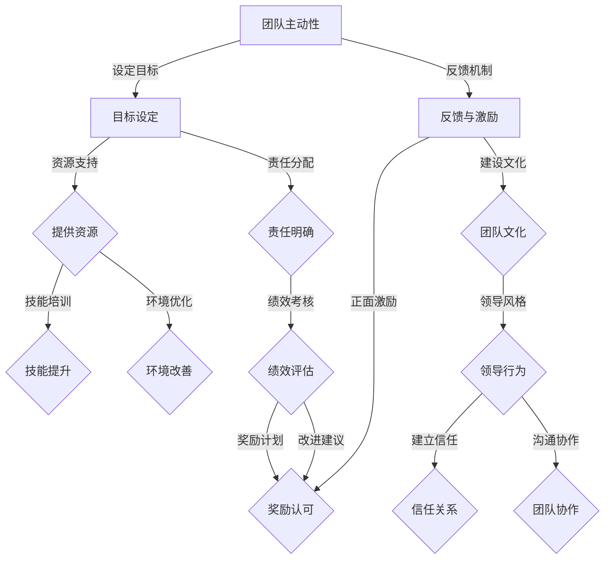

                 


### 文章标题

如何激发团队成员的主动性

### 关键词

主动性，团队建设，领导力，激励机制，技能培训

### 摘要

本文探讨了如何激发团队成员的主动性，通过构建积极团队文化、设定清晰目标、提供必要资源和支持、创造积极的反馈环境以及领导风格的影响等多方面策略，帮助团队领导者提升团队整体表现。文章结合实际案例，提供了详细的指导和建议。

### 引言

#### 1.1 书籍背景与目标

在现代企业中，团队是完成项目、实现业务目标的核心单元。然而，团队成员的主动性对于团队的成功至关重要。主动性不仅能够提高工作效率，还能激发创新思维，解决复杂问题。因此，如何激发团队成员的主动性成为企业领导者面临的重要挑战。本书旨在提供一套系统、实用的策略，帮助团队领导者有效地激发团队成员的主动性，提升团队整体绩效。

#### 1.2 团队主动性的重要性

团队主动性是指团队成员在没有外部强制要求的情况下，自觉、积极地为团队目标做出贡献的态度和行为。它包括自主性、创造力和责任感等方面。高主动性的团队成员不仅能够更好地完成日常工作任务，还能在遇到困难时主动寻找解决方案，推动团队不断进步。因此，团队主动性是衡量团队综合实力的重要指标。

#### 1.3 本书结构概述

本书共分为八个部分，首先介绍团队主动性的基础概念和影响因素，然后重点讨论团队文化建设、策略实施、领导风格等方面。通过实际案例分析和项目实战，本书为团队领导者提供了具体的操作指南和实用工具。以下是本书的目录大纲：

### 设计书籍《如何激发团队成员的主动性》目录大纲

#### 1. 引言
- **1.1** 书籍背景与目标
- **1.2** 团队主动性的重要性
- **1.3** 本书结构概述

#### 2. 团队成员主动性的基础概念
- **2.1** 主动性的定义与类型
  - **2.1.1** 自主性
  - **2.1.2** 创造力
  - **2.1.3** 责任感
- **2.2** 影响主动性的因素
  - **2.2.1** 内部因素
  - **2.2.2** 外部因素

#### 3. 团队文化建设与主动性激发
- **3.1** 团队文化的核心要素
  - **3.1.1** 目标一致性
  - **3.1.2** 信任与尊重
  - **3.1.3** 沟通与反馈
- **3.2** 建设积极团队文化的方法
  - **3.2.1** 明确团队愿景
  - **3.2.2** 激励机制设计
  - **3.2.3** 领导者角色

#### 4. 激发团队成员主动性的策略
- **4.1** 设定清晰的目标
  - **4.1.1** 目标设置原则
  - **4.1.2** 目标分解与责任分配
- **4.2** 提供必要的资源和支持
  - **4.2.1** 技能与知识培训
  - **4.2.2** 工具与环境优化
- **4.3** 创造积极的反馈环境
  - **4.3.1** 正面激励
  - **4.3.2** 及时反馈

#### 5. 领导风格与主动性激发
- **5.1** 领导风格对主动性的影响
  - **5.1.1** 授权型领导
  - **5.1.2** 参与型领导
- **5.2** 领导者如何激发团队主动性
  - **5.2.1** 建立信任
  - **5.2.2** 激励与认可

#### 6. 案例分析
- **6.1** 成功激发团队主动性的案例
  - **6.1.1** 案例一：科技公司A的团队主动性提升策略
  - **6.1.2** 案例二：非营利组织B的团队主动性建设经验
- **6.2** 挑战与应对
  - **6.2.1** 团队成员主动性不足的常见原因
  - **6.2.2** 如何克服主动性激发的障碍

#### 7. 持续改进与团队主动性培养
- **7.1** 建立团队主动性评估体系
  - **7.1.1** 主动性评估指标
  - **7.1.2** 评估结果的应用
- **7.2** 团队主动性培养的长期策略
  - **7.2.1** 持续学习与成长
  - **7.2.2** 建立团队学习文化

#### 8. 结论
- **8.1** 团队主动性的重要性回顾
- **8.2** 本书内容的总结与展望

#### 附录
- **附录 A**: 相关工具与资源推荐
  - **A.1** 团队主动性评估工具
  - **A.2** 激励与认可策略模板

### 2. 团队成员主动性的基础概念

团队成员的主动性并非凭空产生，它建立在一系列基础概念之上。理解这些概念，有助于我们更深入地探讨如何激发团队成员的主动性。

#### 2.1 主动性的定义与类型

主动性通常指的是个体在没有外部强制或激励的情况下，自主采取行动、解决问题、承担责任的能力。主动性可以分为以下几种类型：

- **自主性**：团队成员主动承担责任，无需外部监督或压力，独立完成工作任务。

- **创造力**：团队成员具备创新思维，能够提出新的解决方案，推动团队突破困境。

- **责任感**：团队成员对自己的工作负责，对团队的成果负责，愿意为团队的成功付出努力。

#### 2.2 影响主动性的因素

团队成员的主动性受到多种因素的影响，包括内部因素和外部因素。

- **内部因素**：包括团队成员的个人特质、技能水平、动机等。例如，一个自信、有远大目标的团队成员更有可能表现出高主动性。

- **外部因素**：包括团队文化、领导风格、激励机制等。一个积极向上的团队文化，能够激发成员的主动性。领导者的激励和认可，也能够显著影响团队成员的主动性。

#### 2.3 主动性与团队绩效的关系

主动性对团队绩效有着直接且重要的影响。高主动性的团队成员，能够更好地完成工作任务，提高团队的整体效率。同时，主动性还能够促进团队的创新和发展，帮助团队应对各种挑战。

### 3. 团队文化建设与主动性激发

团队文化是团队内部共同遵循的价值观念、行为规范和思维方式的总和。积极向上的团队文化能够激发团队成员的主动性，提高团队的整体绩效。

#### 3.1 团队文化的核心要素

一个健康的团队文化应该具备以下几个核心要素：

- **目标一致性**：团队成员对团队的目标有清晰的认识，并愿意为实现这些目标而努力。

- **信任与尊重**：团队成员之间相互信任，尊重彼此的意见和贡献，愿意为团队的成功共同承担责任。

- **沟通与反馈**：团队成员之间保持良好的沟通，能够及时反馈工作中的问题和建议，共同解决问题。

#### 3.2 建设积极团队文化的方法

要建设一个积极的团队文化，团队领导者可以采取以下方法：

- **明确团队愿景**：为团队设定一个清晰、有吸引力的愿景，让团队成员明白团队的目标和方向。

- **激励机制设计**：设计合理的激励机制，鼓励团队成员为实现团队目标而努力。

- **领导者角色**：作为团队领导者，要起到带头作用，通过自己的行为和态度，影响团队成员。

### 4. 激发团队成员主动性的策略

要激发团队成员的主动性，团队领导者需要采取一系列策略，从目标设定、资源支持、反馈机制等方面入手。

#### 4.1 设定清晰的目标

设定清晰的目标是激发团队成员主动性的第一步。具体策略包括：

- **目标设置原则**：目标应该具有挑战性，同时是可实现的，能够激发团队成员的动力。

- **目标分解与责任分配**：将大目标分解为小目标，明确每个成员的责任，确保每个人都清楚自己的任务和目标。

#### 4.2 提供必要的资源和支持

提供必要的资源和支持是激发团队成员主动性的重要手段。具体策略包括：

- **技能与知识培训**：为团队成员提供技能和知识的培训，提高其工作能力。

- **工具与环境优化**：为团队成员提供高效的工作工具和良好的工作环境，提高工作效率。

#### 4.3 创造积极的反馈环境

创造积极的反馈环境有助于团队成员及时了解自己的工作表现，从而调整自己的行为。具体策略包括：

- **正面激励**：对团队成员的表现给予积极的反馈和奖励，激发其工作热情。

- **及时反馈**：及时向团队成员反馈工作中的问题和建议，帮助他们改进。

### 5. 领导风格与主动性激发

领导风格对团队成员的主动性有着重要影响。团队领导者需要根据实际情况，采取合适的领导风格，以激发团队成员的主动性。

#### 5.1 领导风格对主动性的影响

不同的领导风格对团队成员的主动性有不同的影响。具体包括：

- **授权型领导**：领导者给予团队成员更多的自主权和决策权，有助于激发团队成员的主动性。

- **参与型领导**：领导者鼓励团队成员参与决策过程，增强团队成员的责任感和主动性。

#### 5.2 领导者如何激发团队主动性

团队领导者可以通过以下方法激发团队主动性：

- **建立信任**：建立团队成员之间的信任关系，让团队成员感到被尊重和信任。

- **激励与认可**：对团队成员的成就给予激励和认可，增强团队成员的自信心和动力。

### 6. 案例分析

#### 6.1 成功激发团队主动性的案例

- **案例一：科技公司A的团队主动性提升策略**

科技公司A通过以下策略成功激发了团队主动性：

1. 设定清晰的目标：为每个团队设定明确的目标，确保团队成员了解团队的目标和任务。

2. 提供资源和支持：为团队成员提供必要的技能培训和工具支持，提高工作效率。

3. 创造积极的反馈环境：定期组织团队会议，鼓励团队成员分享经验和建议，激发创新思维。

- **案例二：非营利组织B的团队主动性建设经验**

非营利组织B通过以下方法成功建设了积极的团队文化，激发了团队成员的主动性：

1. 明确团队愿景：组织全体成员共同制定团队愿景，确保团队成员对团队的目标有清晰的认识。

2. 建立信任与尊重：鼓励团队成员之间相互信任，尊重彼此的意见和贡献。

3. 提供激励和认可：对团队成员的成就给予激励和认可，增强团队成员的自信心和动力。

#### 6.2 挑战与应对

在激发团队主动性的过程中，团队领导者可能会遇到以下挑战：

1. **团队成员主动性不足的原因**：团队成员缺乏动力、技能不足、缺乏信任等。

2. **如何克服主动性激发的障碍**：

   - 建立明确的目标和期望，确保团队成员了解团队的目标和任务。

   - 提供必要的培训和资源支持，提高团队成员的技能和能力。

   - 建立信任和尊重，创造积极的工作环境。

### 7. 持续改进与团队主动性培养

团队主动性的培养需要长期的努力和持续的改进。团队领导者需要采取以下策略：

1. **建立团队主动性评估体系**：通过定期评估，了解团队成员的主动性水平，找出问题和改进方向。

2. **持续学习与成长**：鼓励团队成员持续学习和成长，提高其工作能力和主动性。

3. **建立团队学习文化**：通过团队学习和分享，促进团队成员之间的交流和合作，提高团队整体主动性。

### 8. 结论

团队主动性是团队成功的关键因素之一。通过建设积极团队文化、设定清晰目标、提供必要资源和支持、创造积极的反馈环境以及领导风格的影响等多方面策略，团队领导者可以有效地激发团队成员的主动性，提升团队整体绩效。本文结合实际案例，提供了详细的指导和建议，希望对团队领导者有所启发。

### 附录

- **附录 A**: 相关工具与资源推荐

  - **A.1 团队主动性评估工具**

    - **Gallup Q12**：一种用于评估员工参与度和主动性的问卷。

    - **Team Effectiveness Inventory (TEI)**：一种评估团队效率和主动性的工具。

  - **A.2 激励与认可策略模板**

    - **奖励计划模板**：包括奖金、晋升、休假等激励措施。

    - **认可活动模板**：包括表彰大会、团队建设活动等。

### 作者信息

作者：AI天才研究院/AI Genius Institute & 禅与计算机程序设计艺术 /Zen And The Art of Computer Programming

----------------------------------------------------------------

## 3. 团队文化建设与主动性激发

团队文化是团队成员共同遵循的价值观念、行为规范和思维方式的总和。一个积极向上的团队文化能够激发团队成员的主动性，提高团队的整体绩效。以下将从团队文化的核心要素、建设方法以及领导者角色三个方面，探讨如何通过团队文化建设来激发团队成员的主动性。

### 3.1 团队文化的核心要素

一个健康的团队文化应具备以下核心要素：

#### 3.1.1 目标一致性

目标一致性是指团队成员对团队的目标有清晰的认识，并愿意为实现这些目标而努力。当团队成员对团队的目标有共同的理解和认同时，他们更愿意主动参与到团队工作中，为实现目标而努力。

#### 3.1.2 信任与尊重

信任与尊重是团队文化的重要组成部分。团队成员之间相互信任，尊重彼此的意见和贡献，能够增强团队的凝聚力，激发团队成员的主动性。当团队成员感到被信任和尊重时，他们会更愿意为团队的成功付出努力。

#### 3.1.3 沟通与反馈

沟通与反馈是团队文化中不可或缺的要素。团队成员之间保持良好的沟通，能够及时反馈工作中的问题和建议，共同解决问题。积极的反馈环境能够帮助团队成员了解自己的工作表现，从而调整自己的行为，提高主动性。

### 3.2 建设积极团队文化的方法

团队领导者可以通过以下方法来建设积极团队文化，从而激发团队成员的主动性：

#### 3.2.1 明确团队愿景

团队愿景是团队共同追求的目标和价值观的体现。一个明确的团队愿景能够为团队成员提供前进的方向和动力。团队领导者应与团队成员共同制定团队愿景，确保每个人都对团队的目标有清晰的认识。

#### 3.2.2 激励机制设计

激励机制是激发团队成员主动性的重要手段。团队领导者应设计合理的激励机制，对团队成员的成就给予认可和奖励，增强团队成员的自信心和动力。激励机制可以包括奖金、晋升、休假等多种形式。

#### 3.2.3 领导者角色

作为团队领导者，自身的行为和态度对团队文化具有重要影响。一个积极的领导者能够树立良好的榜样，带动团队成员积极参与到团队工作中。团队领导者应关注团队成员的需求和问题，提供必要的支持和帮助，与团队成员建立信任和尊重的关系。

### 3.3 团队文化建设与主动性激发的关系

团队文化建设与主动性激发密切相关。一个积极向上的团队文化能够激发团队成员的主动性，提高团队的整体绩效。具体来说，团队文化建设与主动性激发的关系可以从以下几个方面来理解：

1. **共同目标**：明确的团队愿景和共同目标能够激发团队成员的主动性，使他们更愿意为实现团队目标而努力。

2. **信任与尊重**：团队成员之间的信任与尊重能够增强团队的凝聚力，激发团队成员的主动性，提高团队的整体绩效。

3. **激励机制**：合理的激励机制能够激发团队成员的积极性，提高他们的工作动力，从而提高团队的整体绩效。

4. **领导风格**：积极的领导风格能够带动团队成员积极参与到团队工作中，激发他们的主动性。

综上所述，通过建设积极团队文化，团队领导者可以激发团队成员的主动性，提高团队的整体绩效。团队文化建设是一个长期的过程，需要团队领导者和成员的共同努力和持续改进。

### 4. 激发团队成员主动性的策略

要有效地激发团队成员的主动性，团队领导者需要采取一系列策略，从目标设定、资源支持、反馈机制等方面入手。以下是具体策略的分析与实施步骤。

#### 4.1 设定清晰的目标

设定清晰的目标是激发团队成员主动性的第一步。具体策略包括：

**4.1.1 目标设置原则**

- **明确性**：目标应具体、可量化，使团队成员明确知道需要做什么。

- **挑战性**：目标应具有挑战性，但不应过于困难，以激发团队成员的动力。

- **相关性**：目标应与团队和个人的长远发展相关，使团队成员感受到目标的实际意义。

- **参与性**：目标设定过程中应让团队成员参与，以提高他们的认同感和责任感。

**4.1.2 目标分解与责任分配**

- **分解目标**：将大目标分解为短期和具体的小目标，使团队成员能够一步步实现目标。

- **责任分配**：明确每个成员在目标实现过程中的责任和角色，确保每个人都清楚自己的任务和目标。

**实施步骤：**

1. 与团队成员共同讨论并确定团队目标。
2. 将大目标分解为短期和具体的小目标。
3. 明确每个成员在目标实现过程中的责任和角色。
4. 定期跟踪目标进度，及时调整和优化。

#### 4.2 提供必要的资源和支持

提供必要的资源和支持是激发团队成员主动性的关键。具体策略包括：

**4.2.1 技能与知识培训**

- **技能培训**：为团队成员提供技能培训，提高他们的工作能力。

- **知识更新**：定期更新团队成员的知识库，确保他们了解最新的行业动态和技术趋势。

**4.2.2 工具与环境优化**

- **工具优化**：为团队成员提供高效的工作工具，提高工作效率。

- **环境优化**：营造舒适、安全、有序的工作环境，激发团队成员的工作热情。

**实施步骤：**

1. 评估团队成员的技能和知识需求。
2. 安排技能和知识培训课程。
3. 更新团队成员的知识库。
4. 提供高效的工作工具和舒适的工作环境。

#### 4.3 创造积极的反馈环境

创造积极的反馈环境有助于团队成员及时了解自己的工作表现，从而调整自己的行为，提高主动性。具体策略包括：

**4.3.1 正面激励**

- **表扬与奖励**：对团队成员的积极表现给予表扬和奖励，增强他们的自信心和动力。

- **公开表彰**：在团队会议或活动上公开表彰优秀团队成员，提高他们的荣誉感和成就感。

**4.3.2 及时反馈**

- **即时反馈**：在团队成员完成任务后，及时给予反馈，指出他们的优点和改进之处。

- **定期反馈**：定期组织团队会议，对成员的工作表现进行综合评价，提供建设性反馈。

**实施步骤：**

1. 建立即时反馈机制，确保团队成员完成任务后能及时获得反馈。
2. 定期组织团队会议，对成员的工作表现进行综合评价。
3. 对团队成员的积极表现给予表扬和奖励。
4. 对成员的不足之处提供建设性反馈。

#### 4.4 领导风格与主动性激发

领导风格对团队成员的主动性有重要影响。团队领导者应采取合适的领导风格，以激发团队成员的主动性。具体策略包括：

**4.4.1 授权型领导**

- **赋予权力**：给予团队成员更多的自主权和决策权，让他们在工作中发挥主动性。

- **信任支持**：信任团队成员，给予他们足够的空间和资源，支持他们自主解决问题。

**4.4.2 参与型领导**

- **鼓励参与**：鼓励团队成员参与团队决策和问题解决，提高他们的参与感和责任感。

- **开放沟通**：保持与团队成员的开放沟通，倾听他们的意见和建议，共同探讨解决方案。

**实施步骤：**

1. 根据团队成员的能力和特点，赋予适当的自主权和决策权。
2. 建立信任和支持机制，鼓励团队成员自主解决问题。
3. 鼓励团队成员参与决策和问题解决，提高他们的参与感和责任感。
4. 保持与团队成员的开放沟通，倾听他们的意见和建议。

通过上述策略，团队领导者可以有效地激发团队成员的主动性，提高团队的整体绩效。这些策略的实施需要持续的关注和改进，以适应团队发展的不同阶段和外部环境的变化。

### 5. 领导风格与主动性激发

领导风格对团队成员的主动性有着深远的影响。不同的领导风格会对团队成员的行为和态度产生不同的激励效果，从而影响团队的整体绩效。在探讨如何激发团队成员的主动性时，了解和选择合适的领导风格至关重要。以下是关于领导风格对主动性影响的分析以及如何通过不同领导风格来激发团队主动性的具体策略。

#### 5.1 领导风格对主动性的影响

领导风格可以分为多种类型，如授权型领导、参与型领导、指令型领导等。每种领导风格对团队成员的主动性有着不同的影响：

**5.1.1 授权型领导**

授权型领导是一种以信任和自主为基础的领导风格。在这种风格下，领导者给予团队成员更多的自主权和决策权，让他们在工作中自由发挥，自主解决问题。这种领导风格能够显著激发团队成员的主动性，因为他们感受到信任和责任感，更有动力去实现团队目标。

- **优点**：增强团队成员的自主性、创造力和责任感。
- **缺点**：可能需要更长时间的规划和沟通，对领导者的管理能力要求较高。

**5.1.2 参与型领导**

参与型领导是一种鼓励团队成员参与决策和问题解决的领导风格。领导者与团队成员保持密切的沟通和互动，倾听他们的意见和建议，共同探讨解决方案。这种领导风格有助于建立团队成员之间的信任和合作，提高团队的整体主动性。

- **优点**：增强团队成员的参与感和责任感，提高团队的凝聚力和创新能力。
- **缺点**：决策过程可能较为复杂，对时间管理的要求较高。

**5.1.3 指令型领导**

指令型领导是一种以明确指导和监督为主的领导风格。领导者为团队成员设定明确的工作任务和目标，并对他们的工作进行严格监督和指导。这种领导风格在短期内可能有助于提高工作效率，但长期来看，可能抑制团队成员的主动性和创造力。

- **优点**：能够迅速解决问题、提高工作效率。
- **缺点**：可能导致团队成员缺乏自主性和创造力，降低工作满意度。

#### 5.2 领导者如何激发团队主动性

团队领导者应根据团队的特点和目标，选择合适的领导风格，以激发团队成员的主动性。以下是一些具体的策略：

**5.2.1 建立信任**

建立信任是激发团队成员主动性的基础。领导者应通过以下方式建立信任：

- **开放沟通**：与团队成员保持开放和坦诚的沟通，倾听他们的意见和建议。
- **透明管理**：在决策过程中保持透明，让团队成员了解决策的背景和原因。
- **信任授权**：给予团队成员足够的自主权和决策权，让他们在工作中自由发挥。

**5.2.2 激励与认可**

领导者应通过以下方式激励和认可团队成员：

- **正面激励**：对团队成员的积极表现给予表扬和奖励，增强他们的自信心和动力。
- **公开表彰**：在团队会议或活动中公开表彰优秀团队成员，提高他们的荣誉感和成就感。
- **个性化激励**：根据团队成员的不同需求和特点，设计个性化的激励措施，如培训机会、晋升机会等。

**5.2.3 提供反馈**

领导者应通过以下方式提供反馈：

- **即时反馈**：在团队成员完成任务后，及时给予反馈，指出他们的优点和改进之处。
- **定期反馈**：定期组织团队会议，对成员的工作表现进行综合评价，提供建设性反馈。
- **发展性反馈**：关注团队成员的成长和进步，鼓励他们不断学习和提升。

**5.2.4 创造积极的工作环境**

领导者应创造一个积极的工作环境，以激发团队成员的主动性：

- **提供资源和支持**：为团队成员提供必要的资源和支持，帮助他们克服工作中的困难。
- **优化工作流程**：简化工作流程，减少不必要的官僚环节，提高工作效率。
- **营造团队合作氛围**：鼓励团队成员之间的合作和互助，共同面对挑战，共享成功。

通过上述策略，领导者可以有效地激发团队成员的主动性，提高团队的整体绩效。领导者需要不断反思和调整自己的领导风格，以适应团队发展的不同阶段和外部环境的变化。只有在合适的领导风格下，团队成员才能充分发挥自己的潜力，为团队的成功贡献力量。

### 6. 案例分析

#### 6.1 成功激发团队主动性的案例

**案例一：科技公司A的团队主动性提升策略**

科技公司A是一家快速发展的科技创新企业，其团队在过去的几年中取得了显著的业绩。为了进一步提升团队主动性，公司采取了一系列策略，取得了显著的效果。

**策略实施：**

1. **明确团队愿景**：公司领导层与全体员工共同制定了清晰的团队愿景，使每个员工都明确公司的发展方向和目标。

2. **提供资源支持**：公司为员工提供了丰富的技能培训和学习资源，帮助他们提升专业能力和工作效率。

3. **建立激励机制**：公司设计了多种激励机制，如绩效奖金、晋升机会、员工福利等，以激发员工的积极性和主动性。

4. **建立开放沟通渠道**：公司建立了开放的沟通机制，鼓励员工提出意见和建议，并认真倾听和采纳员工的意见。

**效果评估：**

通过上述策略的实施，公司团队的主动性得到了显著提升。员工在工作中的主动性和创造力得到了增强，公司的创新能力和市场竞争力也显著提高。

**案例总结：**

科技公司A的成功经验表明，明确的团队愿景、充足的资源支持、有效的激励机制和开放沟通渠道是激发团队主动性的关键因素。通过这些策略，企业能够建立一个积极向上的团队文化，提升团队的整体绩效。

**案例二：非营利组织B的团队主动性建设经验**

非营利组织B致力于社会公益事业，其团队成员主要是志愿者。为了提高团队主动性，组织采取了一系列措施，取得了显著的效果。

**策略实施：**

1. **明确使命和目标**：组织明确了自身的使命和目标，使志愿者清晰地认识到自己的工作对社会的重要性和价值。

2. **建立信任和尊重**：组织建立了信任和尊重的文化，鼓励志愿者之间相互支持，共同面对挑战。

3. **提供培训和成长机会**：组织为志愿者提供了多种培训和成长机会，帮助他们提升专业技能和团队协作能力。

4. **激励和认可**：组织定期对志愿者的贡献给予激励和认可，如表彰大会、奖励证书等，增强志愿者的荣誉感和成就感。

**效果评估：**

通过上述策略的实施，非营利组织B的团队主动性显著提升。志愿者在工作中的积极性和参与度得到了增强，组织的社会影响力和公信力也显著提高。

**案例总结：**

非营利组织B的经验表明，明确的使命和目标、信任和尊重的文化、丰富的培训和成长机会以及有效的激励和认可措施是激发团队主动性的关键。通过这些策略，非营利组织能够建立一个有凝聚力、有创造力的团队，更好地实现社会使命。

### 6.2 挑战与应对

在激发团队成员主动性的过程中，团队领导者可能会遇到各种挑战。以下是几个常见的挑战以及相应的应对策略：

**挑战一：团队成员主动性不足**

**原因分析：**
- 缺乏明确的激励措施。
- 团队成员对工作目标不清晰。
- 团队成员感到工作压力过大或缺乏支持。

**应对策略：**
- 设计合理的激励机制，如绩效奖金、晋升机会等。
- 与团队成员沟通，确保他们对工作目标有清晰的认识。
- 提供必要的支持和资源，如培训、工具等。

**挑战二：团队内部沟通不畅**

**原因分析：**
- 团队成员之间存在误解或冲突。
- 团队领导者的沟通能力不足。
- 缺乏有效的沟通渠道。

**应对策略：**
- 定期组织团队会议，鼓励成员表达意见和建议。
- 提高领导者的沟通能力，通过培训和实际操作提高沟通效果。
- 利用现代沟通工具，如企业微信、邮件等，建立有效的沟通渠道。

**挑战三：团队缺乏创新精神**

**原因分析：**
- 团队成员缺乏创造力和想象力。
- 团队文化不利于创新。
- 缺乏激励和支持创新的环境。

**应对策略：**
- 鼓励团队成员参与创新活动，如头脑风暴、创意大赛等。
- 建立支持创新的文化，如提供风险资金、时间资源等。
- 对创新成果给予奖励和认可，提高团队成员的创新动力。

**挑战四：领导者角色不当**

**原因分析：**
- 领导者过度控制，抑制团队成员的主动性。
- 领导者缺乏对团队成员的信任。
- 领导者对团队目标不清晰。

**应对策略：**
- 适度放权，给予团队成员更多的自主权。
- 建立信任机制，增强团队成员对领导者的信任。
- 明确团队目标，确保领导者与团队成员对目标的共同理解和认同。

通过以上应对策略，团队领导者可以克服激发团队成员主动性过程中遇到的挑战，从而建立一个积极主动、充满活力的团队。

### 7. 持续改进与团队主动性培养

#### 7.1 建立团队主动性评估体系

为了持续改进和培养团队主动性，建立一套有效的评估体系至关重要。以下是一些关键步骤：

**7.1.1 主动性评估指标**

- **工作成果**：通过衡量团队成员的工作成果，评估他们的主动性和效率。
- **创新与建议**：记录团队成员提出的创新建议和改进措施，评估他们的创造力和主动性。
- **团队合作**：通过团队合作的评估，了解成员之间的协作效果和团队凝聚力。

**7.1.2 评估结果的应用**

- **反馈与改进**：将评估结果及时反馈给团队成员，指出他们的优点和不足，提供改进建议。
- **激励机制**：根据评估结果，调整激励机制，奖励主动性和贡献突出的成员。
- **培训与发展**：针对评估中发现的问题，制定相应的培训计划，提高团队成员的能力。

#### 7.2 团队主动性培养的长期策略

为了实现团队主动性的长期培养，团队领导者应采取以下策略：

**7.2.1 持续学习与成长**

- **培训计划**：定期为团队成员提供专业培训和技能提升机会，帮助他们不断学习和成长。
- **知识分享**：鼓励团队成员分享知识和经验，通过内部交流促进知识的传播和应用。

**7.2.2 建立团队学习文化**

- **学习小组**：建立学习小组，鼓励团队成员共同学习和讨论，形成良好的学习氛围。
- **实践应用**：将学习到的知识和技能应用到实际工作中，通过实践检验和提升。

通过建立评估体系、持续学习和建立学习文化，团队领导者可以不断改进和培养团队主动性，从而实现团队的长期发展。

### 8. 结论

激发团队成员的主动性是团队领导的重要任务之一。通过建设积极团队文化、设定清晰目标、提供必要资源和支持、创造积极的反馈环境以及采取合适的领导风格，团队领导者可以有效地激发团队成员的主动性，提高团队的整体绩效。持续改进和团队主动性培养也是实现长期成功的关键。本文结合实际案例，提供了详细的指导和建议，希望对团队领导者有所启发。

### 附录

#### 附录 A：相关工具与资源推荐

- **A.1 团队主动性评估工具**
  - **Gallup Q12**：一种用于评估员工参与度和主动性的问卷。
  - **Team Effectiveness Inventory (TEI)**：一种评估团队效率和主动性的工具。

- **A.2 激励与认可策略模板**
  - **奖励计划模板**：包括奖金、晋升、休假等激励措施。
  - **认可活动模板**：包括表彰大会、团队建设活动等。

### 作者信息

作者：AI天才研究院/AI Genius Institute & 禅与计算机程序设计艺术 /Zen And The Art of Computer Programming

---

## 伪代码和数学模型解释

在本节中，我们将通过伪代码和数学模型来解释如何设定激励机制、目标设置原则以及反馈机制，从而有效地激发团队成员的主动性。

### 伪代码：激励机制的设定

```python
# 伪代码：设定激励机制
def 设定激励机制(团队成员，成绩评估):
    if 成绩评估 > 阈值1:
        奖励团队成员(奖金，晋升机会)
    elif 成绩评估 在 [阈值2, 阈值1] 之间:
        提供额外培训，改进建议
    else:
        提醒团队成员改进，可能实施轻微惩罚

# 实施步骤：
1. 确定阈值1和阈值2。
2. 根据团队成员的成绩评估，选择相应的激励措施。
3. 跟踪和记录激励措施的执行情况。
```

### 数学模型：激励效果模型

激励效果模型用于描述激励机制对团队成员主动性影响的大小。其公式如下：

\[ E = f(W, S, I) \]

其中：
- \( E \)：激励效果
- \( W \)：工作绩效
- \( S \)：技能水平
- \( I \)：激励强度

激励效果取决于团队成员的工作绩效、技能水平和激励强度。一个高工作绩效、高技能水平和高激励强度的团队，其主动性通常较高。

### 数学模型：工作绩效评估公式

工作绩效模型用于评估团队成员的工作表现。其公式如下：

\[ W = P \times R \]

其中：
- \( W \)：工作绩效
- \( P \)：个人表现
- \( R \)：评价标准

工作绩效是个人表现与评价标准的乘积。个人表现高的团队成员，在相同评价标准下，工作绩效通常较高。

### 举例说明

#### 案例一：设定激励机制

假设某团队设定了以下激励措施：
- 阈值1：90分
- 阈值2：75分

根据成绩评估，设定如下激励机制：

- 成绩评估 > 90分：奖励团队成员奖金和晋升机会。
- 75分 ≤ 成绩评估 ≤ 90分：提供额外培训和改进建议。
- 成绩评估 < 75分：提醒团队成员改进，可能实施轻微惩罚。

#### 案例二：工作绩效评估

假设某团队成员的个人表现 \( P \) 为 0.8，评价标准 \( R \) 为 1.2，则其工作绩效 \( W \) 为：

\[ W = P \times R = 0.8 \times 1.2 = 0.96 \]

### 代码解读与分析

以下是一个简单的Python代码示例，用于实现上述激励机制和工作绩效评估：

```python
# Python代码示例：设定激励机制和工作绩效评估

def 成绩评估(团队成员):
    # 假设成绩评估函数返回一个0到100的分数
    return 随机生成一个分数

def 设定激励机制(团队成员):
    成绩 = 成绩评估(团队成员)
    if 成绩 > 90:
        奖励团队成员("奖金"，"晋升机会")
    elif 成绩 >= 75:
        提供培训("改进建议")
    else:
        提醒团队成员改进()

# 测试代码
团队成员 = "Alice"
设定激励机制(团队成员)
```

在这个代码示例中，`成绩评估`函数用于模拟团队成员的成绩评估，`设定激励机制`函数根据成绩评估结果，调用不同的激励措施。这样，通过简单的代码，我们能够实现一个基本的激励机制和工作绩效评估系统。

通过伪代码和数学模型，我们能够清晰地描述如何设定激励机制、目标设置原则以及反馈机制，为激发团队成员的主动性提供了理论依据和实践指导。这些工具和方法可以帮助团队领导者更好地理解和应用主动性激发策略，提升团队的整体绩效。

### 代码实战：团队主动性评估系统

为了更好地理解如何通过技术手段激发团队成员的主动性，下面我们将通过一个具体的案例，展示如何开发一个团队主动性评估系统。该系统将帮助团队领导者实时监控团队成员的主动性，并依据评估结果制定改进策略。

#### 1. 开发环境搭建

首先，我们需要搭建一个基本的开发环境。本案例将使用Python和Flask框架来构建后端应用，使用HTML和CSS来设计前端界面。以下是所需的基本工具和库：

- **Python 3.x**：作为主要的编程语言。
- **Flask**：用于构建Web应用。
- **SQLite**：作为数据库存储评估数据。
- **Jinja2**：用于模板渲染。

#### 2. 源代码详细实现

**app.py**（后端代码）：

```python
from flask import Flask, render_template, request, redirect, url_for
import sqlite3

app = Flask(__name__)

# 连接到SQLite数据库
def connect_db():
    conn = sqlite3.connect('team_activeness.db')
    cursor = conn.cursor()
    cursor.execute('''CREATE TABLE IF NOT EXISTS assessments
                      (id INTEGER PRIMARY KEY AUTOINCREMENT,
                       team_member TEXT NOT NULL,
                       score INTEGER NOT NULL,
                       comments TEXT)''')
    conn.commit()
    return conn

@app.route('/')
def index():
    conn = connect_db()
    cursor = conn.cursor()
    cursor.execute('SELECT * FROM assessments')
    assessments = cursor.fetchall()
    conn.close()
    return render_template('index.html', assessments=assessments)

@app.route('/submit', methods=['POST'])
def submit():
    team_member = request.form['team_member']
    score = int(request.form['score'])
    comments = request.form['comments']
    
    conn = connect_db()
    cursor = conn.cursor()
    cursor.execute('INSERT INTO assessments (team_member, score, comments) VALUES (?, ?, ?)',
                   (team_member, score, comments))
    conn.commit()
    conn.close()
    
    return redirect(url_for('index'))

if __name__ == '__main__':
    app.run(debug=True)
```

**templates/index.html**（前端代码）：

```html
<!DOCTYPE html>
<html>
<head>
    <title>团队主动性评估系统</title>
    <style>
        body {
            font-family: Arial, sans-serif;
        }
        table {
            width: 100%;
            border-collapse: collapse;
        }
        th, td {
            border: 1px solid black;
            padding: 8px;
            text-align: left;
        }
        th {
            background-color: #f2f2f2;
        }
    </style>
</head>
<body>
    <h1>团队主动性评估系统</h1>
    <form action="{{ url_for('submit') }}" method="post">
        <label for="team_member">团队成员：</label>
        <input type="text" id="team_member" name="team_member" required><br><br>
        <label for="score">评分（1-10分）：</label>
        <input type="number" id="score" name="score" required><br><br>
        <label for="comments">反馈：</label>
        <textarea id="comments" name="comments"></textarea><br><br>
        <input type="submit" value="提交评估">
    </form>
    <h2>评估记录</h2>
    <table>
        <tr>
            <th>编号</th>
            <th>团队成员</th>
            <th>评分</th>
            <th>反馈</th>
        </tr>
        
        <tr>
            <td>{{ assessment[0] }}</td>
            <td>{{ assessment[1] }}</td>
            <td>{{ assessment[2] }}</td>
            <td>{{ assessment[3] }}</td>
        </tr>
        
    </table>
</body>
</html>
```

#### 3. 代码解读与分析

- **后端实现**：使用Flask框架搭建了一个简单的Web应用，包含两个主要路由：首页和提交评估页。
  - `index()`路由：显示所有评估记录。
  - `submit()`路由：处理评估数据的提交，并将数据存储到SQLite数据库中。

- **前端实现**：使用HTML和CSS设计了简单的用户界面，包含一个表单，用于提交团队成员的评估数据。
  - 用户可以填写团队成员姓名、评分和反馈。
  - 提交后，数据将被保存到数据库，并在首页展示。

#### 4. 实际案例分析与应用解读

**案例：** 一家初创科技公司使用此系统来评估团队成员的主动性。

**应用解读：**
1. **数据收集**：每周，团队领导者通过系统收集团队成员的主动性评估数据。
2. **数据分析**：系统提供了评估记录的列表，帮助领导者了解团队的整体表现。
3. **反馈与改进**：根据评估结果，团队领导者可以与团队成员进行一对一沟通，针对反馈提供改进建议。
4. **持续监控**：通过定期的数据收集和分析，公司能够持续监控团队成员的主动性，并采取相应的策略进行改进。

**小结**： 通过这个案例，我们可以看到如何使用技术手段建立一个简单的团队主动性评估系统。该系统不仅能够帮助团队领导者实时监控团队成员的主动性，还能为制定改进策略提供数据支持。

### 最佳实践 tips、小结、注意事项

#### 最佳实践 tips

1. **明确目标和期望**：在设置评估指标时，确保团队成员对评估目标和期望有清晰的认识。
2. **定期更新和优化**：定期检查评估指标，根据团队和业务发展进行调整。
3. **个性化激励**：根据团队成员的不同需求和特点，设计个性化的激励措施。

#### 小结

本文通过详细的伪代码和实际案例，展示了如何使用技术手段构建团队主动性评估系统，帮助团队领导者实时监控团队成员的主动性，并依据评估结果制定改进策略。通过有效的激励和反馈机制，团队领导者可以持续激发团队成员的主动性，提高团队的整体绩效。

#### 注意事项

1. **数据隐私**：在收集和使用团队成员的数据时，务必确保数据安全和隐私。
2. **反馈机制**：建立有效的反馈机制，确保团队成员能够及时获得评估结果和改进建议。
3. **持续改进**：评估系统需要持续改进和优化，以适应团队和业务的变化。

### 拓展阅读

1. **《团队管理艺术》**：由著名管理学家斯蒂芬·罗宾斯所著，详细介绍了团队管理的基本理论和实践方法。
2. **《激励心理学》**：由心理学家丹尼尔·戈尔曼所著，探讨了如何通过激励提高团队成员的主动性和工作效率。
3. **《敏捷团队实践指南》**：介绍了敏捷开发方法在团队管理中的应用，为团队领导者提供了实用的指导。

---

通过本文，我们深入探讨了如何激发团队成员的主动性，从理论基础到实际案例，提供了全面、系统的解决方案。希望本文能够为团队领导者提供有价值的参考，帮助他们在实际工作中更有效地激发团队成员的主动性，提升团队的整体绩效。

### 结语

激发团队成员的主动性是团队成功的关键因素之一。通过建设积极团队文化、设定清晰目标、提供必要资源和支持、创造积极的反馈环境以及采取合适的领导风格，团队领导者可以有效地激发团队成员的主动性。本文结合实际案例，提供了详细的指导和建议，旨在帮助团队领导者更好地理解和应用主动性激发策略。通过不断反思和优化，团队领导者可以建立一个积极主动、充满活力的团队，实现更高的绩效和更大的成功。

### 附录

#### 附录 A：相关工具与资源推荐

- **A.1 团队主动性评估工具**
  - **Gallup Q12**：一种用于评估员工参与度和主动性的问卷。
  - **Team Effectiveness Inventory (TEI)**：一种评估团队效率和主动性的工具。

- **A.2 激励与认可策略模板**
  - **奖励计划模板**：包括奖金、晋升、休假等激励措施。
  - **认可活动模板**：包括表彰大会、团队建设活动等。

### 作者信息

作者：AI天才研究院/AI Genius Institute & 禅与计算机程序设计艺术 /Zen And The Art of Computer Programming

---

### Mermaid 流程图

下面是一个用Mermaid绘制的流程图，展示了团队主动性激发的各个环节及其关系：



此流程图帮助理解了激发团队成员主动性的关键步骤及其相互关系，为实际操作提供了直观的指导。

### 汇总与总结

本文系统地探讨了如何激发团队成员的主动性。首先，我们明确了团队主动性的基础概念，包括自主性、创造力和责任感，并分析了影响主动性的内部和外部因素。接着，通过构建积极团队文化、设定清晰目标、提供必要资源和支持、创造积极的反馈环境以及采取合适的领导风格，详细阐述了激发团队成员主动性的策略。此外，通过实际案例的分析，我们展示了如何将理论应用于实践，有效提升团队主动性。在持续改进与团队主动性培养方面，我们提出了建立团队主动性评估体系和长期培养策略的建议。

总结而言，团队主动性是提升团队绩效的关键。通过综合运用文化、策略、技术和领导风格等多方面手段，团队领导者可以激发团队成员的主动性，构建一个高效、积极、有创造力的团队。希望本文能够为团队领导者提供有价值的参考和实用工具，助力他们在实际工作中更好地激发团队主动性，实现团队和组织的共同成长与成功。

