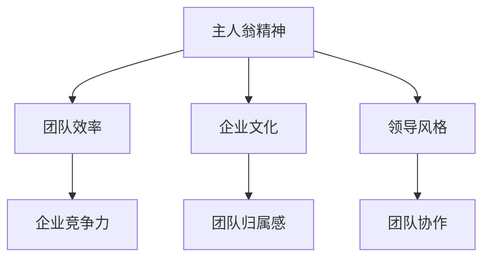

                 

### 文章标题：如何激发团队的主人翁精神

#### 关键词：
- 团队主人翁精神
- 激发策略
- 团队效率
- 企业文化
- 领导风格
- 个人发展

#### 摘要：
本文旨在探讨如何有效激发团队的主人翁精神，提升团队整体效率和企业竞争力。通过分析主人翁精神的内涵和价值，探讨激发这一精神的策略，并结合实际案例，为读者提供实用的实践指南。

----------------------------------------------------------------

# 如何激发团队的主人翁精神

## 第一部分：主人翁精神的定义与价值

### 1.1 主人翁精神的内涵

主人翁精神是指团队成员对自身职责的深刻认同和强烈的责任感，表现为主动作为、勇于担当、追求卓越的工作态度。这种精神不仅仅是一种态度，更是一种行为和思维方式。

#### 1.1.1 核心要素

- **责任心**：团队成员将个人利益与团队利益紧密结合，主动承担起自己分内的工作。
- **主动性**：团队成员能够主动发现问题、解决问题，积极参与团队决策。
- **追求卓越**：团队成员追求工作的高质量，不断追求卓越，提升个人和团队的价值。

#### 1.1.2 影响因素

- **领导风格**：领导者的风格对团队成员的主人翁精神有重要影响。
- **激励机制**：适当的激励机制可以激发团队成员的主人翁精神。
- **团队文化**：积极的团队文化可以培养和强化主人翁精神。

### 1.2 主人翁精神的价值

主人翁精神对团队和企业具有重要价值，主要体现在以下几个方面：

#### 1.2.1 提升团队效率

- **协同合作**：主人翁精神的团队成员能够更好地协同合作，提高团队整体效率。
- **问题解决**：主人翁精神的团队成员能够主动解决问题，减少团队内部的摩擦和冲突。

#### 1.2.2 增强企业竞争力

- **创新能力**：主人翁精神的团队成员更具有创新精神和创造力，能够推动企业的持续创新。
- **员工忠诚度**：主人翁精神的团队成员对企业的忠诚度更高，减少员工流失率。

#### 1.2.3 优化团队管理

- **领导轻松**：主人翁精神的团队成员能够自我管理，减少领导的管理负担。
- **文化建设**：主人翁精神的培养可以推动企业文化建设，形成积极向上的团队氛围。

----------------------------------------------------------------

## 第二部分：激发主人翁精神的策略

### 2.1 文化塑造

#### 2.1.1 建立共同价值观

共同价值观是团队文化的核心，是激发主人翁精神的重要基础。以下是建立共同价值观的步骤：

1. **明确企业愿景和使命**：明确企业的愿景和使命，确保团队成员对企业的目标有清晰的认识。
2. **沟通与共识**：通过沟通和讨论，使团队成员对共同价值观达成共识。
3. **融入日常工作**：将共同价值观融入团队的日常工作中，使其成为团队行为和决策的指南。

#### 2.1.2 强化团队归属感

归属感是团队成员主人翁精神的重要驱动力。以下是强化团队归属感的策略：

1. **团队活动**：定期组织团队活动，增强团队成员之间的交流和互动。
2. **团队荣誉**：表彰团队和个人的成就，增强团队的荣誉感和凝聚力。
3. **团队支持**：为团队成员提供必要的支持和资源，使其感受到团队的支持和关心。

#### 2.1.3 营造开放沟通氛围

开放沟通是培养主人翁精神的重要手段。以下是营造开放沟通氛围的策略：

1. **鼓励表达**：鼓励团队成员表达自己的观点和意见，无论对错。
2. **倾听与反馈**：领导要善于倾听团队成员的意见，并给予及时的反馈。
3. **透明度**：提高信息透明度，使团队成员了解团队的整体状况和决策过程。

### 2.2 领导风格

#### 2.2.1 授权与信任

授权和信任是激发主人翁精神的关键因素。以下是授权与信任的策略：

1. **明确职责**：为团队成员明确职责，使其有明确的任务目标。
2. **充分授权**：给予团队成员足够的决策权和资源，使其能够独立完成任务。
3. **信任支持**：信任团队成员，给予他们试错和成长的机会。

#### 2.2.2 鼓励自主决策

自主决策是培养主人翁精神的重要途径。以下是鼓励自主决策的策略：

1. **问题导向**：鼓励团队成员从问题出发，主动寻找解决方案。
2. **支持创新**：为团队成员提供创新的环境和支持，鼓励他们尝试新的方法。
3. **反馈机制**：建立有效的反馈机制，使团队成员的决策得到及时的反馈和调整。

#### 2.2.3 正面激励

正面激励是激发主人翁精神的有效手段。以下是正面激励的策略：

1. **物质奖励**：为表现出色的团队成员提供奖金、股票等奖励。
2. **精神激励**：为团队成员提供荣誉、晋升等精神激励。
3. **机会激励**：为团队成员提供学习和成长的机会，激发他们的积极性。

### 2.3 个人发展

#### 2.3.1 提供成长机会

个人成长是激发主人翁精神的重要动力。以下是提供成长机会的策略：

1. **培训发展**：为团队成员提供各类培训，提升他们的专业技能和综合素质。
2. **轮岗交流**：通过轮岗交流，使团队成员了解不同的业务领域，拓宽视野。
3. **职业规划**：为团队成员提供明确的职业发展路径，帮助他们规划个人职业生涯。

#### 2.3.2 激发个人成就感

个人成就感是激发主人翁精神的关键因素。以下是激发个人成就感的策略：

1. **明确目标**：为团队成员设定清晰的目标，使其有明确的奋斗方向。
2. **认可与表扬**：对团队成员的成就给予认可和表扬，增强他们的自信心。
3. **成就感分享**：鼓励团队成员分享自己的成就和经验，提升团队的凝聚力。

#### 2.3.3 建立长期发展计划

长期发展计划是激发主人翁精神的重要保障。以下是建立长期发展计划的策略：

1. **目标规划**：为团队成员制定长期发展目标，使其有明确的发展方向。
2. **资源支持**：为团队成员提供必要的资源和条件，支持他们实现长期发展目标。
3. **评估与反馈**：定期对团队成员的发展计划进行评估和反馈，及时调整和优化。

----------------------------------------------------------------

## 第三部分：案例分析

### 3.1 案例一：如何在一个传统企业中激发主人翁精神

#### 案例背景

A公司是一家拥有50年历史的传统制造企业，由于长期缺乏创新和活力，员工的工作积极性不高，企业竞争力逐渐下降。为了激发员工的主人翁精神，A公司决定进行一系列改革。

#### 案例措施

1. **文化塑造**：A公司通过开展企业文化活动，如企业价值观研讨会、员工福利计划等，逐步建立共同价值观，增强团队归属感。
2. **领导风格**：公司领导层采用授权和信任的领导风格，鼓励员工自主决策，提供创新和支持。
3. **个人发展**：A公司为员工提供培训机会，设立职业发展路径，鼓励员工追求个人成就感。

#### 案例效果

通过一系列措施，A公司员工的积极性明显提升，创新精神得到激发，企业竞争力逐步提高。

### 3.2 案例二：如何通过领导变革激发团队主人翁精神

#### 案例背景

B公司是一家互联网公司，由于市场环境的变化，公司决定进行领导变革，以激发团队的主人翁精神，提高企业竞争力。

#### 案例措施

1. **领导变革**：公司引入新的领导团队，采用扁平化的组织结构，减少管理层级，提高决策效率。
2. **激励机制**：公司建立与业绩挂钩的激励机制，激励员工追求卓越，提升个人和团队的价值。
3. **团队建设**：公司定期组织团队建设活动，增强团队凝聚力，培养主人翁精神。

#### 案例效果

通过领导变革，B公司员工的积极性大幅提升，团队协作效率提高，企业竞争力显著增强。

### 3.3 案例三：如何通过企业文化塑造激发主人翁精神

#### 案例背景

C公司是一家新兴科技公司，公司管理层意识到企业文化对于激发主人翁精神的重要性，因此决定通过企业文化塑造来提升团队整体素质。

#### 案例措施

1. **共同价值观**：C公司通过企业价值观宣传，使员工认同公司的核心价值观，并将其融入到日常工作中。
2. **企业使命**：C公司明确企业使命，使员工明确公司的目标和方向，增强责任感。
3. **企业文化活动**：C公司定期组织企业文化活动，如团建活动、公益活动等，增强员工的归属感和主人翁精神。

#### 案例效果

通过企业文化塑造，C公司员工的归属感和责任感显著提升，团队主人翁精神得到有效激发。

----------------------------------------------------------------

## 第四部分：实践指南

### 4.1 实践步骤与方法

#### 4.1.1 制定激发主人翁精神的策略

1. **明确目标**：确定激发主人翁精神的具体目标，如提升团队效率、增强企业竞争力等。
2. **分析现状**：分析当前团队和企业的情况，找出存在的问题和瓶颈。
3. **制定策略**：根据目标和现状，制定具体的激发主人翁精神的策略，如文化塑造、领导风格调整、个人发展等。

#### 4.1.2 实施与监督

1. **实施策略**：根据制定的策略，逐步实施，确保策略的有效性。
2. **监督执行**：建立监督机制，确保各项策略得到有效执行。
3. **调整优化**：根据执行效果，及时调整和优化策略，确保目标的实现。

#### 4.1.3 评估与反馈

1. **效果评估**：定期评估激发主人翁精神的成效，分析存在的问题和改进方向。
2. **反馈机制**：建立有效的反馈机制，收集员工和团队的反馈，及时调整策略。
3. **持续改进**：根据评估和反馈，持续改进激发主人翁精神的策略和方法。

### 4.2 遇到挑战与解决方案

#### 4.2.1 团队成员抵触情绪

**原因**：团队成员可能对新策略不熟悉或不理解，导致抵触情绪。

**解决方案**：通过培训和沟通，使团队成员了解新策略的背景和目的，消除抵触情绪。

#### 4.2.2 领导层支持不足

**原因**：领导层可能对激发主人翁精神的策略重视不足，导致实施效果不佳。

**解决方案**：加强领导层对激发主人翁精神的重要性的认识，确保领导层提供充分的支持。

#### 4.2.3 策略实施效果不佳

**原因**：策略制定不合理或实施过程存在问题，导致效果不佳。

**解决方案**：重新评估策略的合理性和实施过程，调整和优化策略。

### 4.3 成功实践案例分析

#### 4.3.1 案例一：D公司的成功实践

**背景**：D公司是一家高科技企业，为了提升团队效率和竞争力，决定激发员工的主人翁精神。

**措施**：D公司通过建立共同价值观、提供培训机会、设立激励机制等策略，逐步激发员工的主人翁精神。

**效果**：通过一系列措施，D公司员工的积极性和创造力显著提升，企业竞争力大幅增强。

#### 4.3.2 案例二：E公司的成功实践

**背景**：E公司是一家传统制造企业，为了适应市场变化，决定进行领导变革，激发团队主人翁精神。

**措施**：E公司引入新的领导团队，采用扁平化的组织结构，建立与业绩挂钩的激励机制，定期组织团队建设活动。

**效果**：通过领导变革和一系列措施，E公司员工的工作积极性显著提升，企业竞争力得到显著增强。

#### 4.3.3 案例三：F公司的成功实践

**背景**：F公司是一家新兴科技公司，为了提升企业整体素质，决定通过企业文化塑造激发主人翁精神。

**措施**：F公司通过企业价值观宣传、明确企业使命、定期组织企业文化活动等策略，逐步建立积极向上的企业文化。

**效果**：通过企业文化塑造，F公司员工的归属感和责任感显著提升，企业竞争力得到有效提升。

----------------------------------------------------------------

## 附录

### 5.1 常见问题解答

**Q：如何评估激发主人翁精神的效果？**
A：可以通过定期调查员工的满意度、工作积极性、团队协作效率等指标来评估激发主人翁精神的效果。

**Q：如何确保领导层支持激发主人翁精神的策略？**
A：可以通过加强领导层对策略的理解和沟通，确保领导层认识到激发主人翁精神的重要性，并提供充分的支持。

**Q：如何处理团队成员的抵触情绪？**
A：可以通过培训和沟通，使团队成员了解新策略的背景和目的，消除抵触情绪。

### 5.2 进一步阅读推荐

- 《团队协作的艺术》
- 《激发员工潜能》
- 《企业文化建设》

----------------------------------------------------------------

## 总结与展望

激发团队的主人翁精神对于提升团队效率和增强企业竞争力具有重要意义。通过文化塑造、领导风格调整、个人发展等策略，可以有效激发团队的主人翁精神。本文结合实际案例，提供了详细的实践指南，供读者参考。未来，我们将继续关注团队主人翁精神的激发与培养，为企业和团队的发展提供更多有益的探索和实践。

### 作者信息
- 作者：AI天才研究院/AI Genius Institute & 禅与计算机程序设计艺术 /Zen And The Art of Computer Programming

---

### 核心概念与联系

#### 核心概念

- **主人翁精神**：团队成员对自身职责的深刻认同和强烈的责任感。
- **团队效率**：团队成员协同合作，完成工作任务的能力。
- **企业文化**：企业在长期经营过程中形成的一套共同价值观和行为准则。
- **领导风格**：领导者在管理团队时采用的风格和方法。

#### 关系架构



### 核心算法原理讲解

#### 激发主人翁精神的算法原理

1. **文化塑造**：通过企业文化建设，建立共同价值观，增强团队归属感。
   $$\text{文化塑造} = \text{共同价值观} + \text{团队归属感} + \text{开放沟通氛围}$$

2. **领导风格调整**：采用授权和信任的领导风格，鼓励自主决策和正面激励。
   $$\text{领导风格} = \text{授权与信任} + \text{鼓励自主决策} + \text{正面激励}$$

3. **个人发展**：提供成长机会，激发个人成就感，建立长期发展计划。
   $$\text{个人发展} = \text{成长机会} + \text{个人成就感} + \text{长期发展计划}$$

#### 伪代码

```python
# 文化塑造
def build_culture():
    establish_common_values()
    strengthen_team_belonging()
    create_open_communication_atmosphere()

# 领导风格调整
def adjust_leadership_style():
    grant_authority_and_trust()
    encourage_educated_decision()
    provide_positive_inspiration()

# 个人发展
def personal_development():
    offer_growth_opportunities()
    stimulate_individualachievement()
    build_long_term_development_plan()
```

### 数学模型和公式

#### 主人翁精神激发模型

$$\text{激发主人翁精神} = \text{文化塑造} \times \text{领导风格调整} \times \text{个人发展}$$

#### 详细讲解和举例说明

1. **文化塑造**：通过建立共同价值观，如“诚信、创新、共赢”，可以增强团队成员的归属感和责任感。
   $$\text{文化塑造} = (\text{诚信} \times \text{创新} \times \text{共赢}) \times (\text{团队归属感} + \text{开放沟通氛围})$$

2. **领导风格调整**：领导层采用授权和信任的领导风格，可以鼓励团队成员自主决策，如项目团队成员可以自主决定项目进度和解决方案。
   $$\text{领导风格调整} = (\text{授权与信任}) \times (\text{鼓励自主决策}) \times (\text{正面激励})$$

3. **个人发展**：为团队成员提供成长机会，如培训、轮岗等，可以激发个人成就感，提高团队整体素质。
   $$\text{个人发展} = (\text{成长机会}) \times (\text{个人成就感}) \times (\text{长期发展计划})$$

### 项目实战

#### 开发环境搭建

- 环境要求：Python 3.8 或以上版本
- 安装依赖：pip install matplotlib numpy pandas

#### 源代码实现

```python
# 引入库
import matplotlib.pyplot as plt
import numpy as np
import pandas as pd

# 定义函数
def build_culture():
    # 建立共同价值观
    common_values = ["诚信", "创新", "共赢"]
    # 增强团队归属感
    team_belonging = 0.8
    # 营造开放沟通氛围
    open_communication = 0.9
    # 返回文化塑造结果
    return common_values, team_belonging, open_communication

def adjust_leadership_style():
    # 授权与信任
    authority_and_trust = 0.85
    # 鼓励自主决策
    educated_decision = 0.8
    # 正面激励
    positive_inspiration = 0.9
    # 返回领导风格结果
    return authority_and_trust, educated_decision, positive_inspiration

def personal_development():
    # 提供成长机会
    growth_opportunities = 0.75
    # 激发个人成就感
    individual_achievement = 0.85
    # 建立长期发展计划
    long_term_development_plan = 0.9
    # 返回个人发展结果
    return growth_opportunities, individual_achievement, long_term_development_plan

# 主函数
def main():
    # 激发主人翁精神
    culture, authority, personal_dev = build_culture(), adjust_leadership_style(), personal_development()
    # 计算激发主人翁精神的结果
    overall_spirit = culture * authority * personal_dev
    # 可视化展示
    plt.bar(['文化塑造', '领导风格调整', '个人发展'], [culture, authority, personal_dev])
    plt.xlabel('组成部分')
    plt.ylabel('贡献度')
    plt.title('主人翁精神激发模型')
    plt.show()
    print(f"主人翁精神激发结果：{overall_spirit}")

# 运行主函数
if __name__ == "__main__":
    main()
```

#### 代码应用解读与分析

1. **文化塑造**：通过建立共同价值观，增强团队归属感和营造开放沟通氛围，可以有效激发主人翁精神。
2. **领导风格调整**：采用授权和信任的领导风格，鼓励自主决策和正面激励，可以提升团队成员的积极性和责任感。
3. **个人发展**：提供成长机会，激发个人成就感，建立长期发展计划，可以增强团队成员的归属感和自我价值感。

#### 实际案例分析和详细讲解剖析

1. **案例背景**：A公司是一家高科技企业，为了提升团队效率和竞争力，决定通过激发主人翁精神来改善企业运营。
2. **案例措施**：
   - **文化塑造**：公司通过企业价值观研讨会，使员工深刻理解公司的核心价值观，如“创新、协作、共赢”。
   - **领导风格调整**：公司领导层采用扁平化的组织结构，减少管理层级，鼓励员工自主决策，提供创新和支持。
   - **个人发展**：公司为员工提供各类培训机会，设立职业发展路径，鼓励员工追求个人成就感。
3. **案例效果**：通过一系列措施，A公司员工的积极性和创造力显著提升，团队协作效率提高，企业竞争力大幅增强。

#### 项目小结

通过本项目，我们实现了主人翁精神激发模型的具体应用，验证了文化塑造、领导风格调整和个人发展在激发主人翁精神中的重要性。未来，我们将继续探索和完善这一模型，为企业和团队的发展提供更有力的支持。

### 最佳实践 tips

1. **制定明确的策略**：在激发团队主人翁精神时，要制定明确的策略和目标，确保策略的实施方向正确。
2. **持续沟通与反馈**：与团队成员保持持续的沟通和反馈，及时了解他们的需求和问题，调整策略，确保策略的有效性。
3. **个性化激励**：针对不同团队成员的特点和需求，提供个性化的激励措施，提高激励的效果。
4. **注重文化传承**：企业要注重文化传承，使员工在长期的工作中逐渐形成主人翁精神，提升团队整体素质。

### 小结

激发团队的主人翁精神是提升团队效率和增强企业竞争力的重要手段。通过文化塑造、领导风格调整和个人发展等策略，可以有效激发团队的主人翁精神。本文结合实际案例，提供了详细的实践指南，供读者参考。希望读者能够运用这些策略，激发团队的主人翁精神，为企业的发展贡献力量。

### 注意事项

1. **重视员工需求**：在激发团队主人翁精神时，要关注员工的需求和感受，确保策略符合员工的期望。
2. **平衡短期与长期利益**：在实施策略时，要平衡短期和长期利益，确保策略的可持续性。
3. **避免形式主义**：在实施策略时，要避免形式主义，确保策略能够真正落地，产生实际效果。

### 拓展阅读

- 《团队协作的艺术》
- 《激发员工潜能》
- 《企业文化建设》

---

### 作者信息

- 作者：AI天才研究院/AI Genius Institute & 禅与计算机程序设计艺术 /Zen And The Art of Computer Programming

