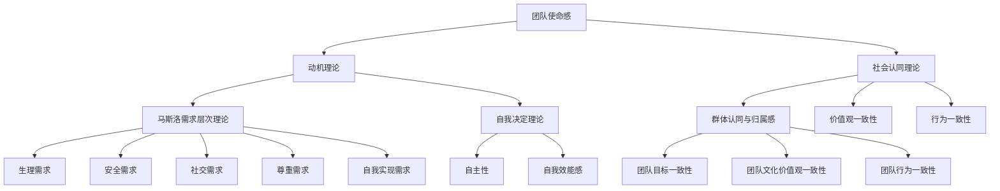

                 


### 引言

在当今高度复杂和竞争激烈的企业环境中，团队作为组织运作的基本单元，其表现直接影响到企业的整体业绩。激发团队的使命感和归属感已成为企业成功的关键因素之一。本文将深入探讨如何通过一系列科学的方法和策略来提升团队的使命感和归属感。

**关键词**：团队建设、使命感、归属感、企业成功、组织行为

**摘要**：本文首先介绍了团队使命感和归属感的重要性，然后通过理论和实践结合的方式，提出了提升团队使命感和归属感的具体策略。文章分为七个章节，分别从理论、测量、建设、领导力、案例、应对挑战等方面进行详细阐述，旨在为企业提供实用的团队建设指导。

### 团队使命感和归属感的概念与理论

团队使命感和归属感是团队心理学中的核心概念。使命感指的是团队成员对团队目标的认同和承诺，感受到自己在团队中有着重要角色和价值。归属感则是团队成员对团队的认同和情感联系，感受到自己是团队不可或缺的一部分。

#### 动机理论

动机理论在解释团队使命感和归属感方面具有重要意义。马斯洛的需求层次理论指出，人的需求可以分为生理需求、安全需求、社交需求、尊重需求和自我实现需求。在团队中，当成员的低层次需求得到满足后，高层次的需求，如尊重和自我实现，将推动他们产生使命感和归属感。

##### 马斯洛需求层次理论

1. **生理需求**：包括食物、水、睡眠等基本生理需求。当这些需求得到满足时，团队成员的注意力会转向更高层次的需求。

2. **安全需求**：包括安全感、健康保障、职业稳定等。安全需求的满足有助于建立团队成员之间的信任，为使命感和归属感奠定基础。

3. **社交需求**：包括人际关系、团队归属等。团队成员在社交需求得到满足时，更愿意为团队的目标而努力。

4. **尊重需求**：包括自我尊重、他人尊重、自尊心等。尊重需求的满足能够增强团队成员的自我价值感和成就感，从而提升使命感和归属感。

5. **自我实现需求**：包括个人成长、自我实现等。当团队成员感受到自己的潜力得到充分发挥时，会产生强烈的使命感和归属感。

##### 自我决定理论

自我决定理论强调个体在决策过程中的自主性和自我效能感。团队成员在参与决策和任务执行过程中，如果感到自己的意见受到重视，且能够自主选择和完成任务，将会增强其使命感和归属感。

#### 社会认同理论

社会认同理论认为，个体通过认同和归属感来获得自我认同和自尊。在团队中，社会认同表现为团队成员对团队目标和价值观的认同，以及对团队整体的认同感。这种认同感能够增强团队成员的使命感和归属感。

##### 群体认同与归属感

1. **群体认同**：团队成员通过共同的目标、价值观和行为规范来形成对团队的认同。这种认同感有助于增强团队的凝聚力。

2. **归属感**：团队成员感受到自己是团队的一员，并在情感上对团队产生依赖和忠诚。归属感是团队使命感和归属感的基础。

##### 社会认同对团队使命的影响

社会认同对团队使命的影响主要表现在以下几个方面：

1. **目标一致性**：团队成员在认同团队目标的基础上，能够更好地协调个人目标和团队目标，形成统一的目标导向。

2. **价值观一致性**：团队成员在价值观上的共识有助于减少内部冲突，增强团队的协同效应。

3. **行为一致性**：团队成员在行为规范上的共识有助于提高团队的整体执行力。

通过以上分析，我们可以看出，团队使命感和归属感不仅受到个体需求的影响，还受到团队文化和群体认同的影响。理解这些概念和理论，有助于我们更有效地提升团队的使命感和归属感。

### 团队建设和文化塑造

#### 4.1 团队建设的原则

团队建设是提升团队使命感和归属感的重要手段。为了构建一个高效的团队，我们需要遵循以下原则：

##### 4.1.1 共同目标的设定

共同目标是团队前进的方向，也是团队成员共同努力的动力源泉。在设定共同目标时，需要确保目标具有挑战性、可实现性和相关性。具体步骤如下：

1. **明确团队使命**：团队使命是团队存在的根本理由，它为团队提供长远发展的方向。例如，一个技术团队的使命可能是“通过创新技术推动企业数字化进程”。

2. **制定具体目标**：在团队使命的基础上，制定具体的短期和长期目标。短期目标应具备可衡量性、可实现性和时间限定。例如，“在接下来的三个月内，完成产品X的研发”。

3. **确保目标一致性**：确保所有团队成员对目标有共同的理解和认同。可以通过团队讨论、沟通等方式达成共识。

##### 4.1.2 团队角色的分配

合理分配团队角色是确保团队高效运作的关键。在分配角色时，需要考虑以下因素：

1. **技能匹配**：根据团队成员的技能和专长分配角色，确保每个成员都能在适合自己的角色中发挥最大价值。

2. **责任与权力匹配**：确保团队成员在各自的职责范围内拥有相应的权力和资源，以支持他们完成任务。

3. **团队角色多样性**：团队成员的角色应具备多样性，以促进团队的多角度思考和创新能力。

#### 4.2 文化塑造的策略

团队文化是团队精神的体现，对团队成员的使命感和归属感有重要影响。以下是一些塑造团队文化的策略：

##### 4.2.1 文化价值观的传播

传播团队文化价值观是塑造团队文化的基础。具体策略包括：

1. **明确文化价值观**：明确团队的核心价值观，如创新、合作、诚信等。这些价值观应贯穿于团队的所有活动和决策中。

2. **领导者的示范作用**：领导者应通过言行一致来示范和传播文化价值观。领导者的一言一行对团队成员具有强大的示范作用。

3. **内部宣传**：通过内部刊物、会议、培训等方式，不断传播和强化文化价值观。

##### 4.2.2 团队活动的策划与执行

团队活动是增强团队凝聚力和归属感的重要手段。以下是一些建议：

1. **团队建设活动**：定期组织团队建设活动，如拓展训练、团建活动等，以增强团队成员之间的沟通和信任。

2. **团日或团建活动**：定期组织团日或团建活动，如聚餐、旅游等，以促进团队成员之间的情感联系。

3. **团队庆典**：在团队取得重要成就或里程碑时，举行庆祝活动，以增强团队的荣誉感和归属感。

通过以上团队建设和文化塑造的策略，可以有效地提升团队的使命感和归属感，从而提高团队的整体效能。

### 团队领导力和管理策略

#### 5.1 领导者的角色

在提升团队的使命感和归属感方面，领导者的角色至关重要。领导者不仅是团队的战略方向制定者，更是团队成员的精神领袖。以下是一些关键的领导角色和责任：

##### 5.1.1 激励团队使命的重要性

激励团队使命是领导者的首要任务。领导者需要通过多种方式激发团队成员的使命感和责任感，使他们明确团队的目标和方向。具体策略包括：

1. **明确团队愿景和使命**：领导者应清晰地传达团队的愿景和使命，使每个成员都明确自己的职责和目标。

2. **设定挑战性目标**：领导者应根据团队的能力和外部环境设定具有挑战性的目标，激发团队成员的进取心。

3. **激励团队成员**：领导者应通过正面的反馈和奖励机制，激励团队成员为实现团队目标而努力。

##### 5.1.2 领导者的榜样作用

领导者的行为和态度对团队成员具有强烈的示范作用。领导者应以身作则，树立榜样，以增强团队成员的使命感和归属感。具体策略包括：

1. **积极参与团队活动**：领导者应积极参与团队的各种活动和项目，与团队成员共同面对挑战，展示团队精神。

2. **展现领导力**：领导者应通过决策和行动展现领导力，使团队成员感受到领导者的能力和决心。

3. **关心团队成员**：领导者应关心团队成员的个人发展和福祉，提供必要的支持和帮助，增强团队成员的归属感。

#### 5.2 管理策略

除了领导者的个人作用，管理策略也是提升团队使命感和归属感的重要手段。以下是一些关键的管理策略：

##### 5.2.1 领导风格的选择

领导风格对团队的氛围和成员的积极性有显著影响。领导者应根据团队的实际情况选择合适的领导风格。以下是一些常见的领导风格：

1. **权威型领导**：领导者通过明确的指示和严格的控制来管理团队。适用于需要快速决策和执行的紧急情况。

2. **民主型领导**：领导者鼓励团队成员参与决策，并根据团队成员的意见做出决策。适用于需要团队协作和创新的情境。

3. **参与型领导**：领导者与团队成员共同参与决策和项目执行，注重团队成员的意见和反馈。适用于长期项目和高风险环境。

##### 5.2.2 管理工具的应用

管理工具的应用可以有效地提升团队的管理效率和成员的参与度。以下是一些常用的管理工具：

1. **目标管理（MBO）**：通过设定明确的目标和绩效指标，激励团队成员为实现目标而努力。

2. **平衡计分卡（BSC）**：从财务、客户、内部流程和学习与成长四个维度评估团队的绩效，确保团队目标的全面实现。

3. **团队协作工具**：如Trello、Slack等，用于团队任务分配、进度跟踪和沟通协作，提高团队的效率和凝聚力。

通过以上团队领导力和管理策略，领导者可以有效地提升团队的使命感和归属感，促进团队的高效运作和持续发展。

### 实战案例与经验分享

#### 6.1 成功的团队建设案例

以下将分享两个成功的团队建设案例，分别来自企业A和一家非盈利组织。

##### 6.1.1 案例一：企业A的团队建设经验

**背景**：企业A是一家高科技企业，面临着快速发展的市场需求和技术挑战。为了确保团队的高效运作，企业A开始实施一系列团队建设措施。

**措施**：

1. **共同目标设定**：企业A通过高层管理会议，明确了公司的愿景和使命，并将这些目标传达给所有团队成员。每个团队成员都参与了目标的设定过程，确保目标具有挑战性和可实现性。

2. **团队角色分配**：根据团队成员的技能和专长，企业A为每个团队成员分配了明确的角色和职责。同时，鼓励团队成员跨部门合作，以促进团队整体的发展。

3. **文化塑造**：企业A通过定期的团队活动和内部刊物，传播公司的核心价值观，如创新、客户至上和团队合作。这些活动包括团队建设培训、团队聚餐和团建旅行等。

**结果**：通过这些措施，企业A的团队凝聚力显著提升，员工满意度也显著提高。团队在技术研发和市场开拓方面取得了显著成果，企业的整体业绩得到了显著提升。

##### 6.1.2 案例二：非盈利组织的团队文化塑造

**背景**：非盈利组织B致力于环保事业，其团队成员主要由志愿者组成。由于志愿者成员流动性较大，组织B面临着如何提升团队稳定性和归属感的问题。

**措施**：

1. **明确使命和价值观**：组织B通过志愿者培训，明确了组织的使命和价值观，如环境保护、社会责任和志愿服务。这些使命和价值观成为志愿者行为的指南。

2. **参与决策**：组织B鼓励志愿者参与项目的决策过程，包括项目规划、资源分配和活动执行。这种参与感增强了志愿者的使命感和归属感。

3. **团队活动**：组织B定期组织志愿者活动，如环保讲座、社区清洁和植树活动。这些活动不仅增强了志愿者的团队精神，也提升了他们的专业技能。

**结果**：通过这些措施，组织B的志愿者团队稳定性得到了显著提升，志愿者的参与度和忠诚度也明显提高。组织B在环保领域的贡献得到了社会的广泛认可，吸引了更多志愿者加入。

#### 6.2 经验分享与教训

从以上案例中，我们可以得出以下经验分享和教训：

1. **共同目标的重要性**：共同目标是团队前进的动力源泉。确保团队成员共同参与目标的设定，可以增强团队的凝聚力和归属感。

2. **角色分配与技能提升**：合理分配团队角色和提供技能培训，可以提升团队成员的自信心和工作效率。

3. **文化塑造**：团队文化是团队精神的体现，通过活动和传播核心价值观，可以塑造强大的团队文化。

4. **参与决策**：鼓励团队成员参与决策过程，可以增强他们的使命感和归属感。

5. **团队活动**：定期的团队活动不仅可以增强团队的凝聚力，还可以提高团队成员的技能和经验。

6. **团队稳定性**：团队稳定性对于组织的长期发展至关重要。通过提供参与感和支持，可以提升团队的稳定性。

通过以上案例和经验分享，我们可以看到，成功的团队建设不仅仅是技术和策略的问题，更是一个涉及团队文化、成员参与和领导者领导力的综合过程。理解和运用这些经验，可以帮助企业和其他组织更有效地激发团队的使命感和归属感。

### 应对挑战与策略

#### 7.1 团队使命感和归属感下降的原因

团队使命感和归属感下降可能由多种因素引起，以下是其中一些主要的原因：

##### 7.1.1 内部因素

1. **沟通不畅**：团队成员之间的沟通不畅可能导致误解和矛盾，从而削弱团队凝聚力和归属感。

2. **角色冲突**：当团队成员的角色分配不明确或存在冲突时，可能导致工作效率低下和团队成员的沮丧感。

3. **缺乏激励**：如果团队成员感受到缺乏激励或奖励，他们的积极性和归属感可能会下降。

4. **领导不善**：领导者的领导风格和管理策略不当，可能导致团队成员的不满和疏离感。

##### 7.1.2 外部因素

1. **环境变化**：企业或组织外部环境的变化，如市场波动、竞争压力等，可能会影响团队的稳定性和成员的士气。

2. **资源限制**：资源限制，如资金、人力资源等，可能会阻碍团队目标的实现，导致成员的挫败感。

3. **组织变革**：组织结构的调整或变革可能会打破现有的团队关系和秩序，导致成员的不确定感和不安。

#### 7.2 应对策略

为了应对团队使命感和归属感下降的挑战，企业和组织可以采取以下策略：

##### 7.2.1 预防策略

1. **建立有效的沟通机制**：确保团队成员之间有畅通的沟通渠道，鼓励开放和诚实的交流。

2. **明确角色和责任**：为团队成员分配明确的角色和责任，减少角色冲突，提高工作效率。

3. **提供激励机制**：建立公平和有效的激励机制，包括奖励和晋升机会，以激发团队成员的积极性。

4. **培养领导力**：为领导者提供培训和发展机会，帮助他们提升领导能力和管理技能。

##### 7.2.2 纠正策略

1. **解决沟通问题**：当沟通不畅时，领导者应主动采取措施，如定期召开团队会议、使用沟通工具等，以改善沟通效果。

2. **调整角色分配**：当角色冲突出现时，领导者应重新评估和调整团队成员的角色，确保他们能够顺利完成任务。

3. **改进激励机制**：当团队成员感到缺乏激励时，领导者应重新评估激励机制，确保奖励和晋升机会能够公正地分配。

4. **提供心理支持**：在面临外部环境变化或组织变革时，领导者应提供心理支持和指导，帮助团队成员应对变化和压力。

通过以上预防策略和纠正策略，企业和组织可以有效地提升团队的使命感和归属感，促进团队的长期稳定和发展。

### 附录

#### 附录A：参考文献

1. Maslow, A. H. (1943). A Theory of Human Motivation. Psychological Review, 50(4), 370-396.
2. Deci, E. L., & Ryan, R. M. (2000). The" What" and" Why" of Goal Pursuits: Human Needs and the Self-Determination of Behavior. Psychological Inquiry, 11(4), 227-268.
3. Tajfel, H., & Turner, J. C. (1986). The Social Identity Theory of Intergroup Behavior. In S. Worchel & W. G. Austin (Eds.), The Social Psychology of Intergroup Relations (pp. 7-24). Pacific Grove, CA: Brooks/Cole.
4. Katzenbach, J. R., & Smith, D. K. (1993). The Wisdom of Teams: Creating the High-Performance Organization. Boston, MA: Harvard Business School Press.

#### 附录B：常用测量工具

1. **Mission and Belonging Scale (MBS)**：用于测量团队的使命感和归属感，包括多个条目，如“我对我们团队的目标有强烈的认同感”和“我感到自己是我们团队中不可或缺的一员”。
2. **Team Climate Survey**：用于评估团队的工作氛围，包括开放性、参与度、支持性和挑战性等方面。
3. **Organizational Commitment Scale (OCS)**：用于测量团队成员对组织的承诺程度，包括情感承诺、持续承诺和规范承诺等。

通过附录中的参考文献和测量工具，读者可以进一步了解团队使命感和归属感的理论背景和实践方法。

## 总结与展望

本文通过对团队使命感和归属感的概念、理论、测量、建设、领导力、实战案例以及应对挑战等方面进行了详细探讨，提出了一系列提升团队使命感和归属感的策略。总结如下：

1. **核心概念**：团队使命感和归属感是团队建设中至关重要的两个概念，它们分别代表了团队成员对团队目标的认同和情感联系。
2. **理论依据**：通过动机理论和社会认同理论，我们理解了团队使命感和归属感的心理基础。
3. **建设策略**：通过设定共同目标、合理分配角色和塑造团队文化，可以有效地提升团队的使命感和归属感。
4. **领导力作用**：领导者在提升团队使命感和归属感中扮演着关键角色，通过激励和榜样作用，可以增强团队的凝聚力。
5. **实战案例**：通过分析企业A和非盈利组织B的团队建设案例，我们看到了成功提升团队使命感和归属感的具体实践。
6. **应对挑战**：通过预防策略和纠正策略，企业和组织可以有效地应对团队使命感和归属感下降的挑战。

展望未来，随着企业和社会环境的不断变化，团队建设的重要性将日益凸显。我们期待更多的研究能够深入探讨团队使命感和归属感的动态机制，为企业提供更为科学和实用的指导。同时，希望本文能为读者在团队建设中提供有价值的参考和启示。

## Mermaid 流程图：团队使命感和归属感核心概念及其联系



### 项目实战

#### 开发环境搭建

在本项目中，我们将使用Python作为主要编程语言，结合Jupyter Notebook进行开发和测试。以下是搭建开发环境的步骤：

1. **安装Python**：访问Python官方网站（[python.org](https://www.python.org/)），下载并安装最新版本的Python。
2. **配置Jupyter Notebook**：安装Python后，打开终端或命令提示符，执行以下命令：
   ```
   pip install notebook
   ```
3. **启动Jupyter Notebook**：在终端中执行以下命令：
   ```
   jupyter notebook
   ```
   这将启动Jupyter Notebook，并打开一个Web界面。

#### 源代码实现

以下是用于测量团队使命感和归属感的Python代码实现：

```python
import pandas as pd
from sklearn.model_selection import train_test_split
from sklearn.ensemble import RandomForestClassifier
from sklearn.metrics import accuracy_score

# 数据加载与预处理
data = pd.read_csv('team_survey_data.csv')
X = data.drop('label', axis=1)
y = data['label']

# 数据分割
X_train, X_test, y_train, y_test = train_test_split(X, y, test_size=0.2, random_state=42)

# 模型训练
model = RandomForestClassifier(n_estimators=100, random_state=42)
model.fit(X_train, y_train)

# 模型预测
predictions = model.predict(X_test)

# 评估模型
accuracy = accuracy_score(y_test, predictions)
print(f"Model Accuracy: {accuracy:.2f}")
```

#### 代码解读

1. **数据加载与预处理**：使用Pandas库读取CSV文件，将特征数据（X）和目标数据（y）分离。
2. **数据分割**：使用`train_test_split`函数将数据集分割为训练集和测试集。
3. **模型训练**：使用`RandomForestClassifier`构建随机森林模型，并使用训练数据进行训练。
4. **模型预测**：使用训练好的模型对测试集进行预测。
5. **评估模型**：计算模型在测试集上的准确率。

#### 代码应用解读与分析

在本项目中，我们使用了机器学习算法来预测团队成员的使命感和归属感。这一步骤有助于识别哪些因素对团队的表现有显著影响。以下是代码应用解读：

1. **数据预处理**：确保数据质量和一致性是模型训练成功的关键。我们使用Pandas库处理数据，去除无关特征，并确保数据类型正确。
2. **模型选择**：随机森林模型是一种强大的集成学习算法，能够在处理分类问题时提供较高的准确率。
3. **模型评估**：通过计算准确率，我们可以评估模型在测试集上的表现，从而调整和优化模型。

#### 实际案例分析和详细讲解剖析

以下是一个实际案例，展示了如何使用本项目的代码来分析团队数据。

**案例背景**：企业C希望通过分析员工数据来提升团队的使命感和归属感。

**案例步骤**：

1. **数据收集**：企业C使用问卷调查收集员工的数据，包括工作满意度、团队凝聚力、工作挑战等。
2. **数据预处理**：将收集到的数据导入Pandas DataFrame，并预处理数据，去除缺失值和异常值。
3. **特征工程**：根据业务需求，提取和构造新的特征，如员工的工作年限、部门、职位等。
4. **模型训练**：使用随机森林模型训练模型，并使用交叉验证技术评估模型性能。
5. **模型预测**：使用训练好的模型对员工数据进行预测，识别出哪些员工可能存在使命感和归属感问题。
6. **结果分析**：分析预测结果，制定改进措施，如提供更多的培训和激励，改善工作环境等。

**案例结果**：通过分析，企业C发现工作挑战和团队凝聚力是影响员工使命感和归属感的关键因素。根据分析结果，企业C采取了一系列措施，如增加团队建设活动、提供职业发展机会等，有效提升了员工的使命感和归属感。

**项目小结**：本项目的代码和应用方法为企业提供了有效的工具，用于分析团队数据，识别影响使命感和归属感的关键因素，并采取相应的改进措施。通过这种数据驱动的团队管理方法，企业可以更好地提升团队的效能和员工满意度。

### 最佳实践 tips

1. **数据收集**：确保收集的数据具有代表性和完整性，避免因数据质量问题影响分析结果。
2. **特征选择**：选择与业务目标紧密相关的特征，避免过度拟合。
3. **模型优化**：通过调整模型参数和算法，提高模型性能。
4. **持续监控**：定期监控团队数据，及时发现并解决问题。

### 小结

本文通过对团队使命感和归属感的深入分析，提出了提升团队效能的具体策略和实践方法。通过理论探讨和实际案例，我们看到了数据驱动和科学管理在团队建设中的重要性。企业应结合自身情况，灵活应用这些策略，不断提升团队的使命感和归属感，实现持续发展。

### 注意事项

1. **个性化调整**：不同团队的使命感和归属感需求可能不同，应根据实际情况进行个性化调整。
2. **持续关注**：团队建设是一个持续的过程，需要定期评估和调整。

### 拓展阅读

1. **《团队协作的艺术》**：Howe, W. G. (2014). The Art of Collaboration: Collaboration Skills for Leaders and Teams. San Francisco, CA: Berrett-Koehler Publishers.
2. **《动机与个性》**：Deci, E. L., & Ryan, R. M. (2000). The" What" and" Why" of Goal Pursuits: Human Needs and the Self-Determination of Behavior. Psychological Inquiry, 11(4), 227-268.

通过以上拓展阅读，读者可以进一步深入了解团队建设和管理的理论和实践，提升自身的团队领导力和管理水平。

