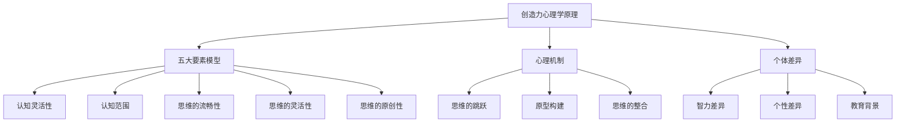
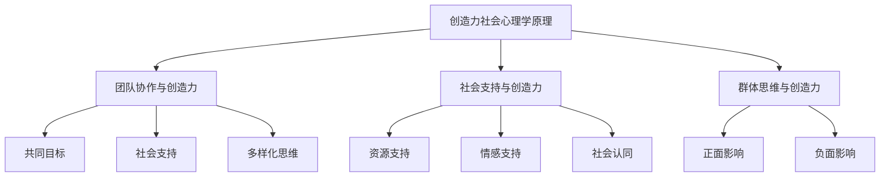
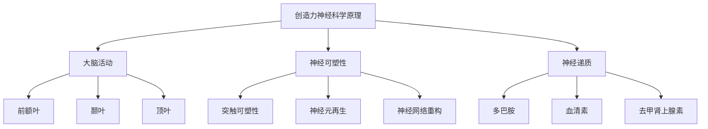
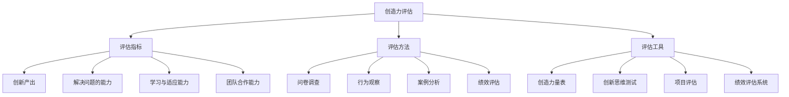
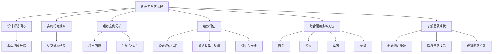
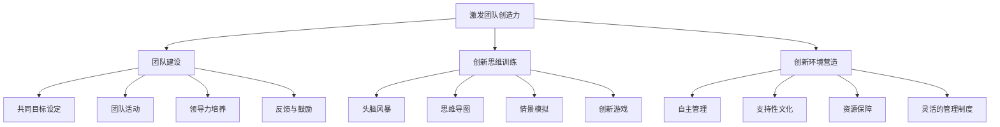
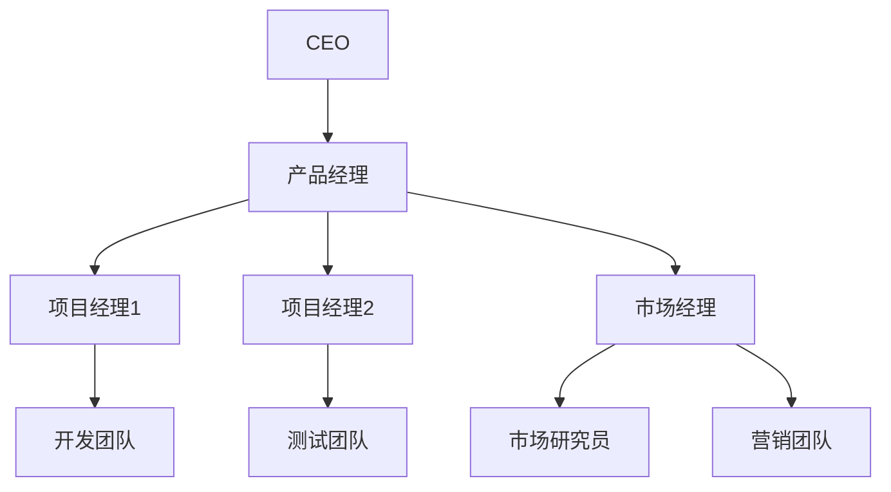
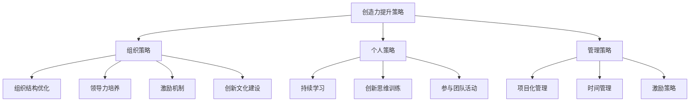
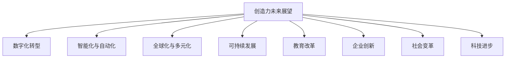

                 


# 如何激发团队的创造力

关键词：团队创造力、创新思维、团队建设、案例分析、策略、未来展望

摘要：本文旨在探讨如何激发团队的创造力，通过理论基础、实践方法、案例分析以及未来展望四个方面，系统地阐述如何提升团队创造力，为团队管理者提供实用的策略和方法。

## 第1章 引言

### 1.1 创造力的定义与重要性

创造力是人类智力发展的重要标志，它不仅体现在个人的智慧和能力上，更体现在团队的整体表现中。创造力是指个体或团队产生新颖且有价值的想法、概念或解决方案的能力。在团队中，创造力不仅能够推动项目的进展，还能够提升团队的核心竞争力。

创造力的重要性体现在以下几个方面：

1. **提升团队竞争力**：具备创造力的团队能够更好地应对市场变化，抓住机遇，创新产品和服务，从而在竞争中脱颖而出。
2. **促进团队凝聚力**：通过共同的目标和创新过程，团队成员之间的合作和沟通能力得到提升，从而增强团队的凝聚力。
3. **激发个人潜力**：创造力能够激发团队成员的个人潜力，使他们在工作中获得成就感和满足感，提高工作积极性。

### 1.2 创造力在团队中的角色

创造力在团队中扮演着多重角色：

1. **问题解决者**：团队创造力能够帮助团队在面对复杂问题时，找到创新的解决方案。
2. **创新推动者**：团队创造力能够推动团队不断进行技术创新和产品创新，保持企业的竞争优势。
3. **文化引领者**：团队创造力能够塑造团队的价值观和氛围，推动团队形成积极向上的文化。

### 1.3 当前团队创造力面临的挑战

在当前快速变化的环境中，团队创造力面临着诸多挑战：

1. **信息过载**：团队成员在处理大量信息时，往往难以提取关键信息，影响创造力的发挥。
2. **工作压力**：高工作压力可能导致团队成员失去创造力的动力，影响团队的整体创造力。
3. **组织文化**：某些组织文化可能过于保守，抑制了团队成员的创新思维。

## 第2章 创造力基础理论

### 2.1 创造力的心理学原理

创造力心理学是研究创造力产生、发展和应用的学科。其主要理论包括：

#### 2.1.1 创造力的五大要素模型

五大要素模型认为，创造力由以下五个要素构成：

1. **好奇心**：好奇心是创造力的源泉，它推动个体去探索未知领域，发现新问题。
2. **认知灵活性**：认知灵活性是指个体能够灵活地调整思维模式，适应不同的情况。
3. **创新思维**：创新思维是指个体能够产生新颖且有价值的想法。
4. **知识储备**：知识储备是创造力的基础，丰富的知识有助于个体产生创新想法。
5. **坚持不懈**：坚持不懈是指个体在面对挑战时，能够持续努力，直至问题解决。

#### 2.1.2 创造力的心理机制

创造力的心理机制主要包括以下几个方面：

1. **思维的跳跃**：创造力的实现往往依赖于思维的跳跃，即在不同概念、想法之间建立关联。
2. **原型的构建**：原型是指个体在头脑中形成的初步解决方案，它是创造力产生的重要阶段。
3. **问题的重新定义**：对问题进行重新定义，有助于从新的角度看待问题，发现创新解决方案。

#### 2.1.3 创造力的个体差异

个体差异是创造力研究的重要领域，它包括以下方面：

1. **智力差异**：智力高的人往往更具创造力，但智力并非创造力的唯一决定因素。
2. **个性差异**：个性特质如好奇心、开放性、创新性等，对创造力有显著影响。
3. **教育背景**：教育背景对创造力有重要影响，不同教育方式可能培养出不同类型的创造力。

### 2.2 创造力的社会心理学原理

创造力的社会心理学原理研究创造力在团队和社会环境中的表现和影响。其主要理论包括：

#### 2.2.1 团队协作与创造力

团队协作是提升团队创造力的重要手段，它包括以下几个方面：

1. **共享目标**：团队共享的目标有助于团队成员统一行动，提高创造力。
2. **相互支持**：团队成员之间的相互支持能够减轻心理压力，提高创造力。
3. **多样化思维**：多样化思维有助于团队从不同角度看待问题，提高创造力。

#### 2.2.2 社会支持与创造力

社会支持对创造力有显著影响，它包括以下几个方面：

1. **资源支持**：提供必要的资源，如时间、资金、技术等，有助于团队成员发挥创造力。
2. **情感支持**：情感支持能够减轻团队成员的心理压力，提高创造力。
3. **社会认同**：社会认同能够增强团队成员的自信心，提高创造力。

#### 2.2.3 群体思维与创造力

群体思维是指团队成员在共同完成任务时，形成的共同思维模式。群体思维对创造力有双重影响：

1. **正面影响**：群体思维能够促进信息的共享和整合，提高创造力。
2. **负面影响**：群体思维可能抑制个体的独立思考，降低创造力。

### 2.3 创造力的神经科学原理

创造力的神经科学原理研究创造力产生的大脑机制。其主要理论包括：

#### 2.3.1 创造力与大脑活动

创造力与大脑活动密切相关，主要涉及以下几个方面：

1. **前额叶活动**：前额叶是创造力的重要区域，它的活动水平与创造力密切相关。
2. **颞叶活动**：颞叶与记忆和联想能力有关，对创造力有重要影响。
3. **海马体活动**：海马体与记忆和新想法的产生有关，对创造力有重要作用。

#### 22.3.2 创造力与神经可塑性

神经可塑性是指大脑结构和功能的变化，它对创造力有重要影响。主要涉及以下几个方面：

1. **突触可塑性**：突触可塑性是指突触连接的增强或减弱，它影响大脑的信息处理能力。
2. **神经元再生**：神经元再生是指受损神经元重新生长，它有助于恢复大脑功能。
3. **神经网络重构**：神经网络重构是指大脑网络结构的改变，它有助于提高创造力。

#### 2.3.3 创造力与神经递质

神经递质是神经元之间传递信息的物质，它对创造力有重要影响。主要涉及以下几个方面：

1. **多巴胺**：多巴胺与奖励和动机有关，它影响创造力的产生和维持。
2. **血清素**：血清素与情绪稳定有关，它影响创造力的发挥。
3. **去甲肾上腺素**：去甲肾上腺素与注意力和警觉性有关，它影响创造力的发挥。

## 第3章 创造力评估

### 3.1 创造力评估指标

创造力评估是了解团队创造力水平的重要手段。创造力评估指标主要包括以下几个方面：

1. **创新产出**：创新产出是评估团队创造力的直接指标，包括创新产品的数量和质量。
2. **解决问题的能力**：解决问题的能力是评估团队创造力的重要指标，包括解决问题的速度和效果。
3. **学习与适应能力**：学习与适应能力是评估团队创造力的重要指标，包括团队在面对新情况时的反应和学习能力。
4. **团队合作能力**：团队合作能力是评估团队创造力的重要指标，包括团队在合作过程中的沟通和协作水平。

### 3.2 创造力评估方法

创造力评估方法主要包括以下几个方面：

1. **问卷调查**：问卷调查是一种常见的创造力评估方法，可以通过设计问卷收集团队成员对创造力相关问题的看法。
2. **行为观察**：行为观察是一种直接评估创造力方法，通过观察团队成员在工作中的表现，评估其创造力水平。
3. **案例分析**：案例分析是一种通过分析团队在特定项目中的表现，评估其创造力水平的方法。
4. **绩效评估**：绩效评估是一种通过评估团队成员的工作绩效，间接评估其创造力水平的方法。

### 3.3 创造力评估工具

创造力评估工具主要包括以下几个方面：

1. **创造力量表**：创造力量表是一种常见的评估工具，通过设计一系列问题，评估个体或团队的创造力水平。
2. **创新思维测试**：创新思维测试是一种通过评估个体或团队的创新思维能力，评估其创造力水平的工具。
3. **项目评估**：项目评估是一种通过评估团队在特定项目中的表现，评估其创造力水平的工具。
4. **绩效评估系统**：绩效评估系统是一种通过设计一系列评估指标，评估团队创造力水平的工具。

### 3.4 创造力评估案例分析

以下是一个创造力评估的案例分析：

#### 案例背景

某科技公司需要评估其团队的创造力水平，以制定提升创造力的策略。

#### 案例方法

1. **问卷调查**：设计一份关于创造力相关的问卷，收集团队成员的看法。
2. **行为观察**：观察团队成员在工作中的表现，记录其创造力相关的行为。
3. **项目评估**：评估团队在最近的项目中的表现，分析其创造力水平。
4. **绩效评估**：分析团队成员的工作绩效，评估其创造力水平。

#### 案例结果

通过问卷调查和行为观察，发现团队成员普遍认为团队缺乏创造力。项目评估和绩效评估显示，团队在解决问题和创新能力方面表现较差。

#### 案例分析

1. **问题识别**：团队缺乏创造力，主要原因是团队成员缺乏创新思维和解决问题的能力。
2. **原因分析**：团队成员缺乏创新思维的主要原因是工作压力大，缺乏时间进行创新思考。解决问题的能力较弱的主要原因是团队成员之间的沟通不畅，信息共享不足。

#### 案例结论

根据评估结果，公司决定采取以下策略提升团队创造力：

1. **培训创新思维**：为团队成员提供创新思维培训，提高其创新能力。
2. **改善沟通机制**：建立有效的沟通机制，促进团队成员之间的信息共享和协作。
3. **优化工作环境**：提供宽松的工作环境，减少工作压力，为团队成员提供更多时间进行创新思考。

## 第4章 激发团队创造力的实践方法

### 4.1 团队建设与创造力

团队建设是提升团队创造力的重要手段。以下是一些团队建设的方法：

1. **共同目标设定**：明确团队的目标，确保团队成员共同追求同一目标，提高团队凝聚力。
2. **团队活动**：组织团队活动，如团建活动、拓展训练等，增强团队成员之间的信任和协作。
3. **领导力培养**：提升团队领导者的领导力，使其能够有效地激励和引导团队成员，提高团队创造力。
4. **反馈与鼓励**：及时给予团队成员反馈和鼓励，增强其自信心和积极性。

### 4.2 创新思维训练

创新思维训练是提升团队创造力的重要方法。以下是一些创新思维训练的方法：

1. **头脑风暴**：通过头脑风暴，激发团队成员的创造性思维，产生新颖的想法。
2. **思维导图**：使用思维导图，帮助团队成员理清思路，发现新的关联和可能性。
3. **情景模拟**：通过情景模拟，让团队成员在模拟环境中实践创新思维，提高其创新能力。
4. **案例学习**：通过学习成功案例，了解创新思维的应用，激发团队成员的创新灵感。

### 4.3 创新环境营造

创新环境的营造是提升团队创造力的重要条件。以下是一些创新环境营造的方法：

1. **自由开放的文化**：营造自由开放的文化氛围，鼓励团队成员自由表达想法，提出建议。
2. **多样化的团队**：建立多样化的团队，包括不同背景、经验和技能的成员，提高团队的创新能力。
3. **资源投入**：提供足够的资源，如时间、资金、技术等，为团队创造力的发挥提供支持。
4. **灵活性管理**：实施灵活性管理，给予团队成员更多的自主权，鼓励其尝试新的想法和方法。

## 第5章 团队创造力案例分析

### 5.1 成功案例分析

#### 案例一：谷歌的创意文化

谷歌以其独特的创意文化而闻名，其成功因素主要包括：

1. **自主工作**：谷歌允许员工有20%的时间用于自己感兴趣的项目，这种自主工作的文化激发了员工的创造力。
2. **开放沟通**：谷歌鼓励员工之间的开放沟通，促进知识的共享和创新思想的碰撞。
3. **资源支持**：谷歌提供了丰富的资源，如资金、技术支持等，为员工的创新项目提供保障。
4. **奖励机制**：谷歌建立了完善的奖励机制，对有创新成果的员工进行奖励，激励员工的创新积极性。

#### 案例二：苹果的创新方法

苹果以其创新的产品而闻名，其成功因素主要包括：

1. **严格的筛选**：苹果对新产品进行严格的筛选，只推出具有创新性和前瞻性的产品。
2. **跨部门合作**：苹果鼓励跨部门合作，通过不同领域的知识融合，产生创新的产品。
3. **用户反馈**：苹果重视用户反馈，通过用户反馈不断改进产品，保持产品的创新性。
4. **技术储备**：苹果拥有强大的技术储备，为产品的创新提供了坚实的基础。

#### 案例三：特斯拉的创造力驱动

特斯拉以其在电动汽车和能源领域的创新而闻名，其成功因素主要包括：

1. **创新驱动**：特斯拉将创新视为企业发展的核心动力，持续投入研发，推动技术创新。
2. **大胆尝试**：特斯拉敢于尝试新的技术和商业模式，如无人驾驶和太阳能发电，推动行业的发展。
3. **企业文化**：特斯拉强调创新和企业家精神，鼓励员工大胆尝试，不断创新。
4. **技术突破**：特斯拉在电池技术、自动驾驶技术等领域取得了重要的突破，推动了整个行业的进步。

### 5.2 失败案例分析

#### 案例一：诺基亚的衰落

诺基亚曾是手机市场的领导者，但其衰落的原因主要包括：

1. **创新不足**：诺基亚在智能手机时代来临之际，未能及时推出具有创新性的产品，错失了市场机遇。
2. **保守的决策**：诺基亚在关键决策上过于保守，未能及时调整战略，导致市场竞争力下降。
3. **组织僵化**：诺基亚的组织结构僵化，创新机制不完善，难以适应市场的快速变化。
4. **缺乏危机感**：诺基亚在市场环境变化时，缺乏危机感，未能及时进行战略调整。

#### 案例二：柯达的倒闭

柯达曾是胶片相机市场的领导者，但其倒闭的原因主要包括：

1. **忽视数码技术**：柯达在数码技术兴起时，未能及时转型，忽视数码相机的发展趋势。
2. **保守的决策**：柯达在关键决策上过于保守，未能及时投资于数码技术，错失了市场机遇。
3. **技术创新不足**：柯达在技术创新上投入不足，未能推出具有竞争力的数码相机产品。
4. **缺乏创新文化**：柯达缺乏创新文化，难以激发员工的创造力，难以推动企业的创新。

#### 案例三：黑莓的困境

黑莓曾是智能手机市场的领导者，但其困境的原因主要包括：

1. **创新滞后**：黑莓在智能手机时代来临之际，未能及时推出具有创新性的产品，错失了市场机遇。
2. **过度依赖硬件**：黑莓过于依赖硬件，忽视软件和服务的发展，难以提供全面的解决方案。
3. **缺乏灵活性**：黑莓在组织和管理上缺乏灵活性，难以快速适应市场的变化。
4. **企业文化僵化**：黑莓的企业文化僵化，难以激发员工的创新思维，导致创新能力下降。

### 5.3 案例分析总结

通过以上成功和失败的案例分析，我们可以得出以下结论：

1. **创新是企业的核心**：成功的企业都注重创新，将创新视为企业发展的核心动力。
2. **灵活应对市场变化**：企业应具备灵活应对市场变化的能力，及时调整战略和产品。
3. **鼓励创新文化**：企业应鼓励创新文化，激发员工的创造力，推动企业的持续创新。
4. **重视技术创新**：企业应重视技术创新，投入资源进行研发，推动产品的更新换代。

## 第6章 创造力提升策略

### 6.1 组织策略

组织策略是提升团队创造力的重要手段。以下是一些组织策略：

1. **组织结构优化**：通过调整组织结构，促进团队之间的协作和知识共享。
2. **领导力培养**：提升领导者的领导力，鼓励和支持团队的创造力。
3. **激励机制**：建立激励机制，奖励有创新成果的团队和个人。
4. **创新文化**：营造创新文化，鼓励团队成员自由表达想法，激发创新思维。

### 6.2 个人策略

个人策略是提升团队创造力的重要方面。以下是一些个人策略：

1. **持续学习**：通过不断学习，提升个人的专业知识和技能，为团队的创造力提供支持。
2. **创新思维训练**：通过创新思维训练，提高个人的创新思维能力。
3. **积极参与团队活动**：积极参与团队活动，增强团队合作能力，提高创造力。
4. **保持好奇心**：保持好奇心，对新事物和新知识保持探索的态度。

### 6.3 管理策略

管理策略是提升团队创造力的重要手段。以下是一些管理策略：

1. **项目化管理**：通过项目化管理，明确团队的目标和责任，提高团队的执行力。
2. **时间管理**：合理安排时间，确保团队成员有足够的时间进行创新思考和项目研究。
3. **绩效评估**：建立科学的绩效评估体系，激励团队成员积极发挥创造力。
4. **团队建设**：定期组织团队建设活动，增强团队凝聚力，提高创造力。

## 第7章 未来展望

### 7.1 创造力的发展趋势

随着科技的不断进步和社会的快速发展，创造力的发展趋势表现为：

1. **数字化转型**：数字化转型将成为创造力发展的重要趋势，数字技术将为创造力的提升提供新的手段和工具。
2. **智能化**：智能技术的发展将使创造力的实现更加高效，智能算法和人工智能将为创造力提供强大的支持。
3. **全球化**：全球化将使创造力的发展更加多元化，不同文化背景的融合将激发新的创造力。

### 7.2 创造力的未来挑战

创造力在未来将面临以下挑战：

1. **信息过载**：信息过载将使创造力面临更大的压力，如何在海量信息中提取有价值的信息将成为挑战。
2. **创新能力竞争**：在激烈的市场竞争中，企业需要不断提升创新能力，如何保持竞争优势将成为挑战。
3. **人才短缺**：随着科技的发展，对人才的需求将不断增加，如何吸引和培养优秀人才将成为挑战。

### 7.3 创造力的未来展望

未来，创造力将在以下几个方面得到进一步发展：

1. **教育改革**：教育改革将更加注重培养学生的创造力，推动创新人才的培养。
2. **技术创新**：技术创新将不断推动创造力的提升，新的技术和工具将为创造力提供更多的可能。
3. **产业升级**：产业升级将使创造力在各个领域得到广泛应用，推动产业结构的优化。

# 总结

本文系统地探讨了如何激发团队的创造力，从理论基础、实践方法、案例分析以及未来展望四个方面进行了详细阐述。通过本文的探讨，我们可以得出以下结论：

1. **创造力是团队竞争力的核心**：创造力是团队竞争力的核心，提升团队创造力有助于企业在市场中脱颖而出。
2. **创新是企业发展的重要动力**：创新是企业发展的重要动力，企业应注重创新文化的建设，激发团队的创造力。
3. **人才培养是关键**：人才培养是提升团队创造力的关键，企业应注重人才的引进和培养，为创造力的发展提供支持。

# 附录

## 参考文献

1. Kenicer, W. (2012). "The Art of Thinking Clearly". Viking.
2. Csikszentmihalyi, M. (1996). "Creativity: Flow and the Psychology of Discovery and Invention". Harper Perennial.
3. Herrmann, M. (2002). "The Whole Brain Business Book". McGraw-Hill.
4. Malone, T. W. (1983). "The Labor of Delight". Scientific American.
5. Newell, A., & Simon, H. A. (1972). "Human Problem Solving". Prentice-Hall.

## 相关资源链接

1. [谷歌的创意文化](https://www.google.com/about/culture/)
2. [苹果的创新方法](https://www.apple.com/innovation/)
3. [特斯拉的创造力驱动](https://www.tesla.com/ai)
4. [诺基亚的衰落](https://www.nokia.com/en-us/about-nokia/history/)
5. [柯达的倒闭](https://www.kodak.com/consumer/us/en/our-company/our-history)
6. [黑莓的困境](https://www.blackberry.com/en-us/about/history)

作者：AI天才研究院/AI Genius Institute & 禅与计算机程序设计艺术 /Zen And The Art of Computer Programming
```

## 第1章 引言

### 1.1 创造力的定义与重要性

创造力（Creativity）是人类智力的核心要素之一，它指的是个体或团队产生新颖且有实用价值的思想、概念或解决方案的能力。创造力并不仅仅局限于艺术领域，它在科学、技术、商业等多个领域都发挥着至关重要的作用。

#### 创造力的定义

从心理学角度来看，创造力可以定义为个体在特定情境下，通过独特的思维过程，产生新颖且有价值的想法或解决方案的能力。创造力不仅仅是一种天赋，它也是一种可以通过训练和实践得到提升的技能。

#### 创造力的重要性

1. **提升竞争力**：在快速变化的市场环境中，创新能力是企业保持竞争优势的关键。具备高创造力的团队能够更快地适应市场变化，抓住机遇，推出创新产品或服务。

2. **推动社会进步**：创造力的发挥可以推动科学技术的进步，解决社会面临的各种问题，如环境污染、能源短缺等。

3. **激发个人潜力**：创造力能够激发个人的潜能，使个体在面对挑战时能够发挥出最大的能力。对于个人来说，创造力的发挥能够带来成就感和满足感，提高生活质量。

4. **增强团队凝聚力**：在团队中，创造力的发挥可以促进团队成员之间的沟通与合作，增强团队的凝聚力。共同的目标和创新过程能够使团队成员形成强烈的归属感和合作精神。

### 1.2 创造力在团队中的角色

创造力在团队中扮演着多重角色，它是团队问题解决、创新推动和文化引领的重要力量。

#### 问题解决者

团队创造力能够帮助团队在面对复杂问题时，找到创新的解决方案。通过多样化的思维方式和跨学科的协同合作，团队能够从多个角度审视问题，提出新颖且有效的解决方案。

#### 创新推动者

团队创造力能够推动团队不断进行技术创新和产品创新，保持企业的竞争优势。创新不仅体现在产品或服务上，还包括工作流程、商业模式等各个层面。

#### 文化引领者

团队创造力能够塑造团队的价值观和文化氛围。一个高创造力的团队往往拥有积极向上的氛围，鼓励成员自由表达想法，勇于尝试新事物。这种文化有助于激发团队成员的创造力，推动团队整体的创新。

### 1.3 当前团队创造力面临的挑战

尽管创造力在团队中扮演着重要角色，但在实际工作中，团队创造力面临着诸多挑战。

#### 信息过载

在信息爆炸的时代，团队成员往往面临大量信息的处理压力。如何从海量信息中提取有价值的信息，进行有效的创新思考，成为团队创造力的一大挑战。

#### 工作压力

高工作压力可能导致团队成员失去创造力的动力。长期的工作压力会使团队成员感到疲惫，影响其创造力的发挥。

#### 组织文化

某些组织文化可能过于保守，抑制了团队成员的创新思维。例如，过分强调业绩和结果，可能导致团队成员不敢冒险，不愿尝试新的想法。

#### 缺乏激励机制

缺乏有效的激励机制可能导致团队成员的创造力无法得到充分发挥。例如，没有奖励机制，团队成员可能缺乏创新的动力。

### 1.4 激发团队创造力的必要性

面对上述挑战，激发团队创造力显得尤为必要。只有通过激发团队创造力，才能使团队在面对挑战时具备更强的适应能力和创新能力。激发团队创造力的意义主要体现在以下几个方面：

1. **提升团队竞争力**：通过激发团队创造力，团队能够更快地适应市场变化，推出创新产品或服务，保持竞争优势。

2. **促进团队凝聚力**：创造力的激发能够增强团队成员之间的沟通与合作，提高团队的凝聚力。

3. **推动个人发展**：创造力的激发能够激发团队成员的个人潜力，使他们在工作中获得成就感和满足感。

4. **促进组织文化变革**：创造力的激发有助于推动组织文化从保守走向开放，鼓励创新，促进组织整体的创新氛围。

### 1.5 小结

本章对创造力的定义和重要性进行了阐述，分析了创造力在团队中的角色，以及当前团队创造力面临的挑战。通过这些分析，我们可以认识到激发团队创造力的重要性，为后续章节的深入探讨奠定了基础。

## 第2章 创造力基础理论

### 2.1 创造力的心理学原理

创造力心理学是研究创造力产生、发展和应用的学科。它涵盖了创造力的心理学原理、创造力的心理机制以及创造力的个体差异等方面。

#### 2.1.1 创造力的五大要素模型

创造力心理学中广泛接受的一个理论是罗伯特·斯腾伯格（Robert J. Sternberg）提出的“创造力五大要素模型”。这个模型认为，创造力由以下五个要素构成：

1. **认知灵活性**（Cognitive Flexibility）：指的是个体能够灵活地调整思维模式，适应不同的情况。
2. **认知范围**（Cognitive Range）：指的是个体能够理解和应用广泛的知识和概念。
3. **思维的流畅性**（Fluency）：指的是个体能够快速产生大量想法的能力。
4. **思维的灵活性**（Flexibility）：指的是个体能够在不同情境下灵活运用知识解决问题的能力。
5. **思维的原创性**（Originality）：指的是个体能够产生新颖且有独特价值的思想。

#### 2.1.2 创造力的心理机制

创造力的心理机制是指个体在创造力产生过程中所涉及的思维过程和心理活动。以下是几个关键的心理机制：

1. **思维的跳跃**（Associative Jumping）：指的是个体在思考过程中能够迅速从一个概念跳跃到另一个相关但不直接的概念。
2. **原型构建**（Prototype Building）：指的是个体在头脑中构建一个初步的解决方案或模型，并通过不断调整和完善来实现创新。
3. **思维的整合**（Integrative Thinking）：指的是个体能够将不同的想法、信息或元素整合成一个新的整体。

#### 2.1.3 创造力的个体差异

个体差异是创造力研究的重要领域，它包括以下几个方面：

1. **智力差异**：智力水平通常与创造力有一定关联，但并非唯一的决定因素。高智力个体往往具备更好的逻辑思维和问题解决能力，这对创造力是有益的。
2. **个性差异**：个性特质如好奇心、开放性、冒险性和自信等，对创造力有显著影响。具有这些特质的人往往更容易产生新颖的想法。
3. **教育背景**：教育背景对创造力的发展有重要影响。不同类型的教育方式可能培养出不同类型的创造力，如强调批判性思维的教育可能有助于提高创造力。

### 2.2 创造力的社会心理学原理

创造力的社会心理学原理研究创造力在团队和社会环境中的表现和影响。它关注社会因素如何促进或阻碍创造力的发展。

#### 2.2.1 团队协作与创造力

团队协作在创造力的发展中起着至关重要的作用。以下是一些关键因素：

1. **共同目标**：团队共同的目标有助于激发团队成员的创造力和合作精神。
2. **社会支持**：社会支持包括心理支持、资源支持和反馈支持，它能够减轻团队成员的心理压力，提高创造力。
3. **多样化思维**：团队成员的多样化背景和思维方式有助于从不同角度看待问题，提高创造力。

#### 2.2.2 社会支持与创造力

社会支持对创造力有显著影响。以下是社会支持对创造力的一些具体影响：

1. **资源支持**：提供必要的资源，如时间、资金和技术支持，有助于团队成员发挥创造力。
2. **情感支持**：情感支持能够减轻团队成员的心理压力，提高创造力。
3. **社会认同**：社会认同能够增强团队成员的自信心，提高创造力。

#### 2.2.3 群体思维与创造力

群体思维是指团队成员在共同完成任务时形成的共同思维模式。群体思维对创造力有双重影响：

1. **正面影响**：群体思维能够促进信息的共享和整合，提高创造力。
2. **负面影响**：群体思维可能抑制个体的独立思考，降低创造力。

### 2.3 创造力的神经科学原理

创造力的神经科学原理研究创造力产生的大脑机制。以下是几个关键的理论：

#### 2.3.1 创造力与大脑活动

创造力与大脑活动密切相关。以下是与创造力相关的大脑区域：

1. **前额叶**：前额叶与计划、决策和创新思维有关。
2. **颞叶**：颞叶与记忆、语言和联想能力有关。
3. **顶叶**：顶叶与空间认知和问题解决能力有关。

#### 2.3.2 创造力与神经可塑性

神经可塑性是指大脑结构和功能的变化。以下是与创造力相关的神经可塑性机制：

1. **突触可塑性**：突触可塑性是指突触连接的增强或减弱，它影响大脑的信息处理能力。
2. **神经元再生**：神经元再生是指受损神经元重新生长，它有助于恢复大脑功能。
3. **神经网络重构**：神经网络重构是指大脑网络结构的改变，它有助于提高创造力。

#### 2.3.3 创造力与神经递质

神经递质是神经元之间传递信息的物质。以下是与创造力相关的神经递质：

1. **多巴胺**：多巴胺与奖励和动机有关，它影响创造力的产生和维持。
2. **血清素**：血清素与情绪稳定有关，它影响创造力的发挥。
3. **去甲肾上腺素**：去甲肾上腺素与注意力和警觉性有关，它影响创造力的发挥。

### 2.4 创造力心理学原理的Mermaid流程图



### 2.5 创造力社会心理学原理的Mermaid流程图



### 2.6 创造力神经科学原理的Mermaid流程图



通过上述内容，我们可以看到创造力基础理论的复杂性和多维度。理解这些理论不仅有助于我们更好地激发团队创造力，也为后续的实践方法和案例分析提供了理论基础。

## 第3章 创造力评估

### 3.1 创造力评估指标

创造力评估是了解团队创造力水平的重要手段。有效的创造力评估可以帮助团队管理者识别创造力强弱的领域，制定针对性的提升策略。创造力评估指标主要包括以下几个方面：

#### 3.1.1 创新产出

创新产出是评估团队创造力水平的一个直接指标，它涵盖了创新产品的数量和质量。具体包括：

1. **创新产品的数量**：团队在一段时间内推出的创新产品或服务的数量。
2. **创新产品的质量**：创新产品的实用性、市场接受度和商业价值。

#### 3.1.2 解决问题的能力

解决问题的能力是评估团队创造力的重要指标，它反映了团队在面对复杂问题时，通过创新思维和协作解决问题的能力。具体包括：

1. **解决问题的速度**：团队在遇到问题时，能够多快地提出解决方案。
2. **解决问题的效果**：解决方案的实际效果，包括问题的解决程度和解决方案的可持续性。

#### 3.1.3 学习与适应能力

学习与适应能力是评估团队创造力的一个重要指标，它反映了团队在面对新情况时，能够快速学习并适应的能力。具体包括：

1. **学习速度**：团队在面对新知识、新技术时的学习速度。
2. **适应能力**：团队在面对新环境、新挑战时的适应能力。

#### 3.1.4 团队合作能力

团队合作能力是评估团队创造力的重要指标，它反映了团队在合作过程中，能够有效沟通、协作和共同解决问题的能力。具体包括：

1. **沟通能力**：团队成员之间的沟通是否畅通，信息是否有效传递。
2. **协作能力**：团队成员是否能够协同合作，共同完成任务。
3. **共同解决问题的能力**：团队在面对问题时，是否能够共同分析、讨论和制定解决方案。

### 3.2 创造力评估方法

创造力评估方法主要包括以下几个方面：

#### 3.2.1 问卷调查

问卷调查是一种常见且有效的创造力评估方法，通过设计一系列问题，收集团队成员对创造力相关问题的看法。问卷调查的内容可以包括：

1. **对创造力的认知**：团队成员对创造力的理解、看法和态度。
2. **创造力表现**：团队成员在工作和项目中的创造力表现。
3. **创造力障碍**：团队成员认为影响创造力的主要障碍。

#### 3.2.2 行为观察

行为观察是通过观察团队成员在日常工作中的表现，评估其创造力水平。这种方法可以直接反映团队成员的创造力，包括：

1. **创新行为**：团队成员在解决问题和项目中的创新行为。
2. **团队合作表现**：团队成员在团队中的协作表现和沟通能力。

#### 3.2.3 案例分析

案例分析是通过分析团队在特定项目中的表现，评估其创造力水平。这种方法可以提供详细的案例分析，包括：

1. **项目背景**：项目的背景信息和目标。
2. **团队表现**：团队在项目中的创造力表现，包括解决方案的创新程度和实际效果。
3. **项目成果**：项目的最终成果和团队成员的满意度。

#### 3.2.4 绩效评估

绩效评估是通过评估团队成员的工作绩效，间接评估其创造力水平。这种方法可以结合团队成员的工作成果和绩效评估结果，全面了解团队的创造力水平。具体内容包括：

1. **工作成果**：团队成员的工作成果和创新贡献。
2. **绩效评估结果**：团队成员的绩效评估结果，包括工作质量和效率。

### 3.3 创造力评估工具

为了有效地评估团队的创造力，可以采用以下几种工具：

#### 3.3.1 创造力量表

创造力量表是一种用于评估个体或团队创造力水平的工具，通常包括一系列问题，涵盖创造力的多个维度。常见的创造力量表有：

1. **托尔曼创造力量表**（Torrance Test of Creative Thinking）：用于评估儿童和成年人的创造力。
2. **创造力自我评估量表**（Creative Self-Efficacy Scale）：用于评估个体在创造力方面的自信水平。

#### 3.3.2 创新思维测试

创新思维测试是一种专门用于评估个体创新思维能力的工具，通常包括一系列问题或任务，要求受测者产生新颖且有实用价值的想法。常见的创新思维测试有：

1. **DARwIn-IDEA测试**：一种用于评估个体在创新思维和问题解决方面的能力的测试。
2. **TRIZ测试**：一种基于TRIZ理论的创新思维测试，用于评估个体在解决复杂问题方面的创新能力。

#### 3.3.3 项目评估

项目评估是通过评估团队在特定项目中的表现，间接评估其创造力水平。这种方法可以提供详细的评估报告，包括：

1. **项目背景**：项目的目标和背景。
2. **团队表现**：团队在项目中的创新行为和成果。
3. **项目成果**：项目的最终成果和团队成员的满意度。

#### 3.3.4 绩效评估系统

绩效评估系统是一种综合性的评估工具，通过设定一系列评估指标，对团队成员的工作绩效进行评估。这种方法可以结合创造力相关指标，全面评估团队的创造力水平。

### 3.4 创造力评估案例分析

以下是一个创造力评估的案例分析：

#### 案例背景

某科技公司需要评估其团队的创造力水平，以制定提升创造力的策略。

#### 案例方法

1. **问卷调查**：设计一份关于创造力相关的问卷，收集团队成员的看法。
2. **行为观察**：观察团队成员在工作中的表现，记录其创造力相关的行为。
3. **项目评估**：评估团队在最近的项目中的表现，分析其创造力水平。
4. **绩效评估**：分析团队成员的工作绩效，评估其创造力水平。

#### 案例结果

通过问卷调查和行为观察，发现团队成员普遍认为团队缺乏创造力。项目评估和绩效评估显示，团队在解决问题和创新能力方面表现较差。

#### 案例分析

1. **问题识别**：团队缺乏创造力，主要原因是团队成员缺乏创新思维和解决问题的能力。
2. **原因分析**：团队成员缺乏创新思维的主要原因是工作压力大，缺乏时间进行创新思考。解决问题的能力较弱的主要原因是团队成员之间的沟通不畅，信息共享不足。

#### 案例结论

根据评估结果，公司决定采取以下策略提升团队创造力：

1. **培训创新思维**：为团队成员提供创新思维培训，提高其创新能力。
2. **改善沟通机制**：建立有效的沟通机制，促进团队成员之间的信息共享和协作。
3. **优化工作环境**：提供宽松的工作环境，减少工作压力，为团队成员提供更多时间进行创新思考。

### 3.5 创造力评估的Mermaid流程图



通过上述内容，我们可以看到创造力评估的重要性和方法。有效的创造力评估不仅可以了解团队的创造力水平，还可以为团队制定针对性的提升策略提供依据。

### 3.6 创造力评估的实践方法

创造力评估不仅是理论层面的探讨，更需要在实践中具体实施。以下是一些在团队中实施创造力评估的实践方法：

#### 3.6.1 设计评估问卷

设计一份科学、合理的创造力评估问卷是评估团队创造力的重要步骤。问卷应包含以下内容：

1. **个人创造力自评**：团队成员对自己创造力的自我评价。
2. **团队合作能力评估**：团队成员对团队内部协作、沟通和问题解决能力的评价。
3. **创新思维表现**：团队成员在工作和项目中的创新思维表现，包括提出新想法、解决问题的方式等。
4. **创新成果评估**：团队在一段时间内所取得的具体创新成果，如新产品、新服务、新方法等。

#### 3.6.2 实施行为观察

行为观察是通过直接观察团队成员在工作中的表现来评估其创造力水平。具体方法包括：

1. **定期观察**：定期安排观察人员，记录团队成员在日常工作和项目中的表现，尤其是创新行为。
2. **记录与分析**：对观察结果进行记录和分析，识别出团队在创造力方面的优势和不足。

#### 3.6.3 组织案例分析

案例分析是通过具体项目或事件的回顾来评估团队的创造力。具体步骤如下：

1. **项目回顾**：回顾团队在特定项目中的表现，包括目标设定、过程执行、结果评估等。
2. **讨论与分析**：组织团队成员进行讨论，分析项目中的创新点、挑战和解决方法，评估团队的创造力水平。

#### 3.6.4 绩效评估

绩效评估是结合团队成员的工作成果和绩效评估结果，全面了解团队的创造力水平。具体步骤如下：

1. **设定评估标准**：根据团队目标和任务，设定明确的创造力评估标准，如创新产出的数量和质量、解决问题的能力等。
2. **数据收集与整理**：收集团队成员在一段时间内的创新成果、项目绩效等数据，进行整理和分析。
3. **评估与反馈**：根据评估结果，对团队成员进行评估和反馈，识别出需要改进的方面。

#### 3.6.5 综合运用多种方法

为了获得全面的创造力评估结果，应综合运用问卷调查、行为观察、案例分析和绩效评估等多种方法。每种方法都有其独特的优势，可以互相补充，提供更全面、准确的评估数据。

#### 3.6.6 实践案例

以下是一个实际案例：

某科技公司为了提升团队的创造力，决定实施创造力评估。首先，公司设计了一份创造力评估问卷，包含个人创造力自评、团队合作能力评估和创新思维表现等内容。然后，公司安排观察人员定期观察团队成员的工作表现，记录创新行为。同时，公司组织了项目回顾会议，讨论团队在特定项目中的表现。最后，公司结合绩效评估结果，对团队成员进行了全面评估。

通过这些评估方法，公司发现团队在创新思维和解决问题方面存在一定的不足。针对这些问题，公司决定提供创新思维培训，改善沟通机制，优化工作环境，从而提升团队的创造力。

### 3.7 创造力评估的意义和作用

创造力评估在团队管理和团队发展中具有重要的作用：

1. **了解团队现状**：通过创造力评估，团队管理者可以了解团队的创造力水平，识别出优势和不足。
2. **制定提升策略**：根据评估结果，团队可以制定针对性的提升策略，如培训、改善沟通机制、优化工作环境等。
3. **激励团队成员**：创造力评估可以为团队成员提供反馈，激励其在工作中发挥更大的创造力。
4. **促进团队发展**：通过持续评估和改进，团队可以不断提升创造力，推动团队整体发展。

### 3.8 小结

本章详细介绍了创造力评估的指标、方法、工具和实践方法。通过创造力评估，团队可以了解自身的创造力水平，识别问题和优势，从而制定针对性的提升策略，推动团队的整体发展。

### 3.9 创造力评估的Mermaid流程图



通过这个流程图，我们可以清晰地看到创造力评估的步骤和关键环节，有助于团队管理者更好地实施创造力评估。

## 第4章 激发团队创造力的实践方法

### 4.1 团队建设与创造力

团队建设是激发团队创造力的基础工作，一个高效的团队建设能够促进团队成员之间的信任和合作，为创造力的发挥提供良好的环境。以下是几种有效的团队建设方法：

#### 4.1.1 共同目标设定

共同目标是团队建设的核心，它能够为团队成员提供清晰的方向和动力。共同目标的设定需要遵循以下原则：

1. **具体明确**：目标要具体、可量化，使团队成员明确知道自己的努力方向。
2. **挑战性**：目标应具备一定的挑战性，激励团队成员发挥潜能。
3. **可行性**：目标应在团队成员的能力范围内，确保团队成员有信心实现。

#### 4.1.2 团队活动

团队活动是加强团队成员之间交流和合作的有效方式。以下是一些常用的团队活动：

1. **团建活动**：通过户外拓展、团队聚餐等活动，增强团队成员之间的信任和默契。
2. **技能培训**：组织技能培训，提升团队成员的专业能力和团队合作能力。
3. **头脑风暴**：通过头脑风暴，激发团队成员的创新思维，共同探讨问题的解决方案。

#### 4.1.3 领导力培养

领导力是团队建设的关键因素，领导者需要具备以下能力：

1. **激励与鼓励**：领导者应善于发现和表扬团队成员的成就，激发团队成员的积极性。
2. **沟通与协调**：领导者需要具备良好的沟通技巧，能够有效协调团队成员之间的合作。
3. **决策能力**：领导者应具备快速做出决策的能力，为团队提供明确的方向。

#### 4.1.4 反馈与鼓励

及时的反馈和鼓励是团队建设的重要组成部分。以下是一些反馈与鼓励的方法：

1. **正面反馈**：对团队成员的积极行为和成果给予及时的正面反馈，增强其自信心和积极性。
2. **建设性反馈**：对团队成员的不足给予建设性的反馈，帮助其改进和提高。
3. **奖励机制**：建立奖励机制，对有创新成果的团队和个人进行奖励，激励团队成员的创新积极性。

### 4.2 创新思维训练

创新思维训练是提升团队创造力的重要方法，通过系统的训练，可以增强团队成员的创新意识和创新能力。以下是几种常见的创新思维训练方法：

#### 4.2.1 头脑风暴

头脑风暴是一种激发团队成员创新思维的有效方法，通过集体讨论，产生大量的创意和解决方案。头脑风暴的步骤如下：

1. **提出问题**：明确需要解决的问题或挑战。
2. **自由发言**：鼓励团队成员自由表达自己的想法，不论是否合理，都要记录下来。
3. **分类整理**：对收集到的想法进行分类和整理，筛选出有价值的创意。
4. **改进完善**：对筛选出的创意进行讨论和改进，形成具体的解决方案。

#### 4.2.2 思维导图

思维导图是一种图形化的思维工具，通过将思维过程以图表形式呈现，帮助团队成员理清思路，发现新的关联和可能性。思维导图的步骤如下：

1. **确定主题**：明确思维导图的主题。
2. **绘制中心图**：在中心位置绘制主题，围绕主题绘制分支，代表不同的想法和关联。
3. **拓展思维**：在分支上继续绘制子分支，扩展思维，捕捉更多的创意。
4. **整合信息**：将思维导图中的信息进行整合，形成系统的思维框架。

#### 4.2.3 情景模拟

情景模拟是一种通过模拟实际场景，训练团队成员应对突发问题和挑战的方法。情景模拟的步骤如下：

1. **设定场景**：根据项目或工作的实际情况，设定一个具体的场景。
2. **角色分配**：为团队成员分配角色，明确各自的职责和任务。
3. **模拟过程**：按照设定好的场景，模拟团队成员的工作过程，包括问题解决、决策制定等。
4. **评估反馈**：对模拟过程进行评估和反馈，总结经验和教训，为实际工作提供参考。

#### 4.2.4 创新游戏

创新游戏是一种通过游戏化的方式，激发团队成员创新思维的方法。以下是一些常见的创新游戏：

1. **快速原型法**：通过快速制作原型，测试和改进创意，快速迭代。
2. **设计思考法**：通过用户调研、用户访谈等方法，了解用户需求，产生创新解决方案。
3. **六顶思考帽法**：通过不同颜色的帽子代表不同的思维模式，激发多样化的思考。

### 4.3 创新环境营造

创新环境的营造是激发团队创造力的重要条件，一个良好的创新环境能够为团队成员提供自由、开放、支持的环境，促进创造力的发挥。以下是几种创新环境营造的方法：

#### 4.3.1 自主管理

自主管理是指给予团队成员更多的自主权，让他们自主决定工作内容、工作方式和时间安排。这种方法能够激发团队成员的主动性和创造力，具体包括：

1. **目标设定**：团队成员自己设定工作目标，明确努力方向。
2. **任务分配**：团队成员自主分配任务，选择适合自己的工作内容。
3. **时间管理**：团队成员自主管理时间，提高工作效率。

#### 4.3.2 支持性文化

支持性文化是指团队内部形成一种支持创新和鼓励尝试的氛围，团队成员之间相互支持，共同面对挑战。具体包括：

1. **开放沟通**：鼓励团队成员自由表达自己的想法，不论是否成熟。
2. **包容失败**：对尝试新想法的失败持包容态度，鼓励团队成员从失败中学习。
3. **认可与奖励**：对有创新成果的团队和个人进行认可和奖励，激励创新积极性。

#### 4.3.3 资源保障

资源保障是指为团队成员提供必要的资源支持，包括时间、资金、技术等，为创造力的发挥提供保障。具体包括：

1. **时间保障**：为团队成员提供足够的工作时间，确保他们有足够的时间进行创新思考和实践。
2. **资金支持**：为创新项目提供资金支持，鼓励团队成员尝试新的想法。
3. **技术支持**：为团队成员提供必要的技术支持，包括工具、设备、培训等，帮助他们更好地进行创新工作。

#### 4.3.4 灵活的管理制度

灵活的管理制度是指团队管理制度的灵活性和适应性，能够根据团队的实际需求和项目特点进行调整。具体包括：

1. **弹性工作制**：根据团队和项目的实际情况，灵活安排工作时间，鼓励团队成员自主调整工作计划。
2. **扁平化组织**：减少管理层级，缩短决策链条，提高决策效率。
3. **灵活的项目管理**：根据项目特点和需求，灵活调整项目计划和管理方法，适应不同类型的项目需求。

### 4.4 小结

本章介绍了激发团队创造力的实践方法，包括团队建设、创新思维训练、创新环境营造等方面。通过有效的团队建设，可以增强团队成员之间的信任和合作，为创造力的发挥奠定基础。通过创新思维训练，可以提升团队成员的创新意识和创新能力。通过创新环境的营造，可以为团队成员提供自由、开放和支持的环境，激发他们的创造力。这些实践方法不仅有助于提升团队的创造力，也为团队的持续发展和创新提供了有力支持。

### 4.5 创造力激发的Mermaid流程图



通过这个流程图，我们可以清晰地看到激发团队创造力的各个步骤和方法，有助于团队管理者在实际工作中有效应用。

## 第5章 团队创造力案例分析

### 5.1 成功案例分析

#### 案例一：谷歌的创意文化

谷歌（Google）是一家以创新和创造力著称的科技公司，其成功得益于独特的创意文化。以下是谷歌在激发团队创造力方面的几个关键因素：

1. **自主工作**：谷歌允许员工有20%的时间用于自己感兴趣的项目，这种“20%时间”政策（20% Time）为员工提供了自由探索和创新的空间，许多谷歌的产品，如Google News、AdSense等，都是在这种自主工作的环境下诞生的。

2. **开放沟通**：谷歌鼓励员工之间的开放沟通，无论是正式的会议还是非正式的讨论，都为员工提供了交流和分享想法的平台。这种开放的沟通环境有助于团队成员之间的协作和创新思维的产生。

3. **资源支持**：谷歌提供了丰富的资源支持，包括资金、技术支持和时间，确保员工能够专注于创新项目。这种资源支持为员工的创造力提供了强有力的保障。

4. **奖励机制**：谷歌建立了完善的奖励机制，对有创新成果的员工进行奖励，这不仅包括物质奖励，还有职业发展机会。这种奖励机制激励员工持续创新，推动公司整体创造力水平的提升。

#### 案例二：苹果的创新方法

苹果（Apple）以其独特的设计哲学和创新产品而闻名。以下是苹果在激发团队创造力方面的几个关键因素：

1. **严格的筛选**：苹果对新产品进行严格的筛选，只有那些具有创新性和前瞻性的产品才会被推向市场。这种严格的筛选过程确保了苹果的产品在技术、设计和用户体验上的领先地位。

2. **跨部门合作**：苹果鼓励跨部门合作，通过不同领域的知识融合，产生创新的产品。例如，苹果的设计团队、软件团队和硬件团队之间的紧密合作，使得苹果的产品在用户体验上具有一致性。

3. **用户反馈**：苹果重视用户反馈，通过用户反馈不断改进产品。这种用户至上的理念使得苹果的产品始终能够满足用户的需求，推动产品的持续创新。

4. **技术储备**：苹果拥有强大的技术储备，这使得苹果能够在关键技术上取得突破，从而保持产品的领先地位。技术储备为苹果的创新提供了坚实的基础。

#### 案例三：特斯拉的创造力驱动

特斯拉（Tesla）是一家在电动汽车和可再生能源领域具有革命性的公司。以下是特斯拉在激发团队创造力方面的几个关键因素：

1. **创新驱动**：特斯拉将创新视为企业发展的核心动力，持续投入研发，推动技术创新。特斯拉在电池技术、自动驾驶技术等领域取得了重要的突破，这些技术不仅推动了公司的进步，也推动了整个行业的发展。

2. **大胆尝试**：特斯拉敢于尝试新的技术和商业模式，如无人驾驶、太阳能屋顶等。特斯拉的这种大胆尝试精神使得公司在面对市场和技术挑战时能够迅速适应和变革。

3. **企业文化**：特斯拉强调创新和企业家精神，鼓励员工大胆尝试，不断创新。特斯拉的企业文化不仅激励了员工的创造力，也推动了公司的持续创新。

4. **技术突破**：特斯拉在电池技术、自动驾驶技术等领域取得了重要的技术突破，这些技术突破不仅为公司的产品创新提供了支持，也为整个行业的技术进步做出了贡献。

### 5.2 失败案例分析

#### 案例一：诺基亚的衰落

诺基亚（Nokia）曾是一家手机行业的巨头，但其在智能手机时代的衰落是一个典型的创造力不足案例。以下是诺基亚在激发团队创造力方面的几个失败因素：

1. **创新不足**：诺基亚在智能手机时代来临之际，未能及时推出具有创新性的产品，错失了市场机遇。诺基亚的智能手机产品在设计和用户体验上与竞争对手存在明显差距。

2. **保守的决策**：诺基亚在关键决策上过于保守，未能及时调整战略，导致市场竞争力下降。诺基亚的管理层对于新兴技术和市场趋势的反应迟缓，错失了快速发展的机会。

3. **组织僵化**：诺基亚的组织结构僵化，创新机制不完善，难以适应市场的快速变化。诺基亚的内部官僚体系抑制了创新和变革的推进。

4. **缺乏危机感**：诺基亚在市场环境变化时，缺乏危机感，未能及时进行战略调整。诺基亚对于竞争对手的崛起和市场的变化反应迟钝，导致市场份额的快速下降。

#### 案例二：柯达的倒闭

柯达（Kodak）曾是一家领先的摄影设备制造商，但在数码摄影时代未能成功转型，最终导致公司倒闭。以下是柯达在激发团队创造力方面的几个失败因素：

1. **忽视数码技术**：柯达在数码技术兴起时，未能及时转型，忽视数码相机的发展趋势。柯达管理层对于数码技术的潜在影响缺乏足够的认识，未能及时投资和创新。

2. **保守的决策**：柯达在关键决策上过于保守，未能及时投资于数码技术，错失了市场机遇。柯达的管理层对于数码相机的前景持怀疑态度，未能果断采取行动。

3. **技术创新不足**：柯达在技术创新上投入不足，未能推出具有竞争力的数码相机产品。柯达的产品在功能和用户体验上与竞争对手存在明显差距。

4. **缺乏创新文化**：柯达缺乏创新文化，难以激发员工的创造力。公司的文化氛围过于保守，抑制了员工的创新思维和行动。

#### 案例三：黑莓的困境

黑莓（BlackBerry）曾是一家领先的智能手机制造商，但在移动互联网时代面临重大挑战，市场份额大幅下滑。以下是黑莓在激发团队创造力方面的几个失败因素：

1. **创新滞后**：黑莓在智能手机时代来临之际，未能及时推出具有创新性的产品，错失了市场机遇。黑莓的智能手机产品在设计和用户体验上与竞争对手存在明显差距。

2. **过度依赖硬件**：黑莓过于依赖硬件，忽视软件和服务的发展，难以提供全面的解决方案。黑莓在软件和服务方面的创新不足，无法满足用户的需求。

3. **缺乏灵活性**：黑莓在组织和管理上缺乏灵活性，难以快速适应市场的变化。黑莓的内部管理结构僵化，难以适应快速变化的市场环境。

4. **企业文化僵化**：黑莓的企业文化僵化，难以激发员工的创新思维。公司的文化氛围过于保守，抑制了员工的创新思维和行动。

### 5.3 成功与失败案例的分析总结

通过对谷歌、苹果和特斯拉的成功案例分析，我们可以得出以下启示：

1. **创新是核心**：成功的企业都注重创新，将创新视为企业发展的核心动力。
2. **灵活应对市场变化**：企业应具备灵活应对市场变化的能力，及时调整战略和产品。
3. **鼓励创新文化**：企业应鼓励创新文化，激发员工的创造力，推动企业的持续创新。
4. **重视技术创新**：企业应重视技术创新，投入资源进行研发，推动产品的更新换代。

通过对诺基亚、柯达和黑莓的失败案例分析，我们可以得出以下教训：

1. **创新不足**：企业不能忽视新兴技术和市场趋势，及时进行产品创新和战略调整。
2. **保守的决策**：企业应避免过于保守的决策，敢于投资和创新，抓住市场机遇。
3. **组织结构**：企业应建立灵活、适应快速变化的组织结构，促进创新和变革的推进。
4. **员工激励**：企业应建立激励机制，激发员工的创新思维和积极性。

通过成功与失败案例的分析，我们可以看到创造力在团队和企业发展中的重要性。激发团队创造力不仅需要企业的战略规划和资源配置，还需要建立鼓励创新的文化氛围，以及灵活的组织和管理机制。这些因素共同作用，可以有效地提升团队的创造力，推动企业的持续发展。

## 第6章 创造力提升策略

### 6.1 组织策略

组织策略在提升团队创造力中起着关键作用。以下是一些有效的组织策略：

#### 6.1.1 组织结构优化

组织结构优化是提升团队创造力的基础。传统的垂直型组织结构往往导致信息流通不畅和决策缓慢，不利于创造力的发挥。通过扁平化组织结构，减少管理层级，缩短决策链条，可以提高团队的响应速度和创新能力。以下是一个扁平化组织结构的示例：



在这种结构中，项目经理直接向CEO汇报，而开发团队和测试团队直接向项目经理汇报，减少了信息传递的层次，提高了团队的灵活性和响应速度。

#### 6.1.2 领导力培养

领导力是提升团队创造力的重要因素。领导者需要具备激发团队创造力的能力，包括：

1. **愿景领导**：领导者需要具备清晰的愿景，为团队提供明确的方向和目标。
2. **激励能力**：领导者需要能够激发团队成员的积极性和创造力，通过鼓励和认可，增强团队成员的自我驱动。
3. **支持创新**：领导者需要创造一个支持创新的环境，鼓励团队成员尝试新想法，并对失败持包容态度。

以下是一个领导力培养的策略：

1. **领导力培训**：为管理者提供领导力培训，提升其激发团队创造力的能力。
2. **导师制度**：建立导师制度，让经验丰富的领导者指导新晋管理者，传承领导经验。
3. **反馈机制**：建立定期反馈机制，让团队成员对领导者的表现提出建议，帮助领导者不断提升。

#### 6.1.3 激励机制

激励机制是激发团队创造力的重要手段。以下是一些激励机制：

1. **奖金制度**：根据团队和个人的创新成果，设立奖金制度，激励团队成员积极创新。
2. **晋升机会**：为在创新方面有突出表现的团队成员提供晋升机会，激励他们继续发挥创造力。
3. **表彰仪式**：定期举办表彰仪式，对有创新成果的团队和个人进行表彰，提高团队成员的荣誉感和成就感。

以下是一个激励机制示例：

- **创新奖**：根据团队的创新项目成果，设立年度创新奖，奖金金额为10000美元。
- **个人晋升**：对在创新项目中表现突出的团队成员，提供晋升机会，如晋升为高级工程师或项目经理。

#### 6.1.4 创新文化建设

创新文化建设是提升团队创造力的关键。以下是一些创新文化建设的方法：

1. **开放沟通**：鼓励团队成员自由表达自己的想法，建立开放的沟通机制，促进信息共享和创新思维的碰撞。
2. **包容失败**：对尝试新想法的失败持包容态度，鼓励团队成员从失败中学习，不断尝试。
3. **持续学习**：鼓励团队成员不断学习和掌握新知识、新技术，为创新提供支持。

以下是一个创新文化示例：

- **创新日**：每周设定一天为“创新日”，团队成员可以自由讨论和创新项目，不拘泥于常规工作。
- **知识分享会**：定期举办知识分享会，团队成员可以分享自己的知识和经验，促进团队整体的知识积累。

### 6.2 个人策略

个人策略在提升团队创造力中也起着重要作用。以下是一些个人策略：

#### 6.2.1 持续学习

持续学习是提升个人创造力的关键。以下是一些学习策略：

1. **阅读**：定期阅读相关领域的书籍、论文和文章，了解最新的研究进展和行业动态。
2. **参加培训**：参加相关领域的培训课程，提升专业技能和知识水平。
3. **实践**：通过实际项目和实践，将所学知识应用到实际工作中，提升实践能力。

以下是一个学习策略示例：

- **每周阅读**：每周阅读一本专业书籍，并写下读书笔记，与团队成员分享。
- **每月培训**：每月参加一次专业培训，提升自己的专业能力。

#### 6.2.2 创新思维训练

创新思维训练是提升个人创造力的有效方法。以下是一些创新思维训练的方法：

1. **头脑风暴**：通过头脑风暴，快速产生大量的创意和解决方案。
2. **思维导图**：使用思维导图，帮助整理思路，发现新的关联和可能性。
3. **情景模拟**：通过情景模拟，训练自己在面对不同情况时的创新能力。

以下是一个创新思维训练示例：

- **每周头脑风暴**：每周组织一次头脑风暴会议，讨论当前项目或工作的问题和解决方案。
- **思维导图应用**：在日常工作中，使用思维导图整理思路，提高问题解决效率。

#### 6.2.3 参与团队活动

参与团队活动是提升个人创造力和团队合作能力的重要途径。以下是一些团队活动：

1. **团队建设活动**：通过团队建设活动，增强团队成员之间的信任和合作。
2. **项目合作**：积极参与项目合作，与团队成员共同解决问题，提高协作能力。
3. **跨部门合作**：积极参与跨部门合作，学习其他部门的知识和经验，拓宽视野。

以下是一个团队活动示例：

- **团队建设活动**：每季度组织一次户外拓展活动，增强团队成员之间的合作和信任。
- **项目合作**：定期组织跨部门项目，促进不同部门之间的知识和经验交流。

### 6.3 管理策略

管理策略在提升团队创造力中起着重要作用。以下是一些管理策略：

#### 6.3.1 项目化管理

项目化管理是一种有效的管理策略，它通过明确项目目标和责任，提高团队的执行力和创新能力。以下是一个项目化管理的示例：

1. **项目规划**：明确项目目标、范围和时间表，制定详细的项目计划。
2. **任务分配**：根据团队成员的技能和兴趣，合理分配任务，确保每个人都能发挥自己的优势。
3. **进度监控**：定期监控项目进度，确保项目按计划进行，及时调整计划。

以下是一个项目化管理示例：

- **项目规划**：每月制定项目计划，明确项目目标和任务分配。
- **进度监控**：每周召开项目进度会议，总结项目进展，解决遇到的问题。

#### 6.3.2 时间管理

时间管理是提高工作效率和创新能力的重要策略。以下是一些时间管理的方法：

1. **时间规划**：制定详细的时间规划，合理安排工作和休息时间，避免时间浪费。
2. **优先级管理**：根据任务的重要性和紧急程度，合理分配时间和精力，优先完成重要任务。
3. **避免干扰**：在工作过程中，避免不必要的干扰，集中精力完成任务。

以下是一个时间管理示例：

- **时间规划**：每天早上制定当天的工作计划，合理安排工作任务。
- **优先级管理**：每周制定工作优先级列表，确保重要任务优先完成。

#### 6.3.3 激励策略

激励策略是提升团队创造力的重要手段。以下是一些激励策略：

1. **正面激励**：通过奖励和认可，激励团队成员的积极性和创造力。
2. **负面激励**：通过适当的管理和纪律，防止团队成员懈怠和消极行为。
3. **团队激励**：通过团队竞赛和协作，激发团队成员的竞争意识和团队合作精神。

以下是一个激励策略示例：

- **正面激励**：对有创新成果的团队和个人进行表彰和奖励。
- **负面激励**：对不完成任务的团队成员进行提醒和督促。

### 6.4 小结

本章介绍了组织策略、个人策略和管理策略在提升团队创造力中的作用。组织策略通过优化组织结构、培养领导力和建立激励机制，为团队创造力提供良好的环境和支持。个人策略通过持续学习、创新思维训练和参与团队活动，提升个人的创造力和团队合作能力。管理策略通过项目化管理、时间管理和激励策略，提高团队的执行力和创新能力。这些策略共同作用，可以有效地提升团队的创造力，推动企业的持续发展。

### 6.5 创造力提升策略的Mermaid流程图



通过这个流程图，我们可以清晰地看到创造力提升策略的各个组成部分，有助于团队管理者在实际工作中有效应用。

## 第7章 未来展望

### 7.1 创造力的发展趋势

创造力在现代社会中正变得越来越重要。随着科技的迅猛发展，全球经济环境的不断变化，以及社会需求的日益多样化，创造力将成为驱动未来发展的重要力量。以下是创造力在未来可能的发展趋势：

#### 7.1.1 数字化转型

数字化转型已经成为全球发展的主流趋势。数字技术，如人工智能、大数据、物联网等，正在深刻改变各行各业的生产方式和服务模式。创造力在这一过程中发挥着至关重要的作用，通过创新思维和技术的融合，推动数字化转型进程。

#### 7.1.2 智能化与自动化

智能化和自动化技术的发展将进一步提升创造力。智能算法和自动化工具能够处理大量数据，进行复杂分析和决策，从而释放人类劳动力，让人类专注于更高层次的创造性工作。这种技术进步将极大地提升团队的创造力水平。

#### 7.1.3 全球化与多元化

全球化带来了知识和文化的交流与碰撞，多元化背景的团队将更加普遍。全球化不仅拓宽了创造力应用的领域，也促进了不同文化背景下的创造力融合。这种多元化的团队结构将激发新的创意和创新的思维模式。

#### 7.1.4 可持续发展

随着对环境保护和可持续发展的重视，创造力将在解决环境问题、能源危机等方面发挥重要作用。创新的技术和解决方案将有助于实现可持续发展目标，推动社会进步。

### 7.2 创造力的未来挑战

尽管创造力在未来的发展中前景广阔，但同时也面临着一系列挑战：

#### 7.2.1 信息过载

随着信息的爆炸式增长，如何有效地筛选和处理海量信息，成为创造力发挥的一个挑战。信息过载可能导致信息疲劳，影响创造力的产生和发挥。

#### 7.2.2 技术竞争

技术创新的速度日益加快，企业间的技术竞争也愈发激烈。如何在竞争中保持领先地位，需要团队具备持续创新的能力和快速响应市场变化的能力。

#### 7.2.3 人才短缺

随着科技的发展，对高素质人才的需求不断增加。然而，优秀人才的培养和引进是一个长期而复杂的任务，企业需要建立有效的培养机制和激励机制，以吸引和留住优秀人才。

#### 7.2.4 文化变革

创造力的发展需要相应的文化支持。然而，文化变革往往面临阻力，如何推动企业文化从保守走向开放，鼓励创新，是一个长期而艰巨的任务。

### 7.3 创造力的未来展望

展望未来，创造力将在推动社会进步、经济增长和文化繁荣中扮演关键角色。以下是几个方面的未来展望：

#### 7.3.1 教育改革

教育改革将是激发未来创造力的重要途径。通过创新的教育方式和内容，培养学生的创造性思维和创新能力，将有助于培养出更多具备高创造力的人才。

#### 7.3.2 企业创新

企业将成为推动创造力发展的重要力量。通过建立创新文化和激励机制，企业将能够激发团队的创造力，推动技术创新和产品创新，提升企业的竞争力。

#### 7.3.3 社会变革

社会变革将带来新的创造力需求。随着社会问题的日益复杂，需要更多创新的思维和解决方案。社会各个领域，如医疗、教育、环境等，都将成为创造力发挥的舞台。

#### 7.3.4 科技进步

科技的进步将为创造力的发展提供新的工具和方法。人工智能、大数据、物联网等技术的应用，将极大地拓展人类创造力的边界，为未来的发展带来无限可能。

### 7.4 小结

未来，创造力将在数字化转型、智能化、全球化和可持续发展等方面发挥重要作用。然而，创造力的发展也将面临信息过载、技术竞争、人才短缺和文化变革等挑战。通过教育改革、企业创新和社会变革，我们可以期待创造力在未来带来更多的创新和进步。

### 7.5 创造力未来发展的Mermaid流程图



通过这个流程图，我们可以清晰地看到创造力未来发展的主要趋势和方向，有助于我们更好地把握未来创造力发展的机遇和挑战。

## 总结

本文系统地探讨了如何激发团队的创造力，从理论基础、实践方法、案例分析以及未来展望四个方面进行了详细阐述。以下是本文的核心观点和结论：

1. **创造力的重要性**：创造力是团队竞争力的核心，它能够提升企业的竞争力，推动社会进步，激发个人潜力，增强团队凝聚力。

2. **创造力在团队中的角色**：创造力在团队中扮演着问题解决者、创新推动者和文化引领者的角色，对于团队的成功至关重要。

3. **创造力评估**：通过科学的评估方法，如问卷调查、行为观察、案例分析和绩效评估，可以了解团队的创造力水平，为制定提升策略提供依据。

4. **激发创造力的实践方法**：包括团队建设、创新思维训练、创新环境营造等方面，通过这些方法，可以有效地激发团队的创造力。

5. **成功与失败案例分析**：通过对谷歌、苹果、特斯拉等成功案例的分析，以及对诺基亚、柯达、黑莓等失败案例的分析，总结了激发团队创造力的关键因素和教训。

6. **提升策略**：通过组织策略、个人策略和管理策略，可以系统地提升团队的创造力，推动企业的持续创新和进步。

7. **未来展望**：随着数字化、智能化、全球化和可持续发展的趋势，创造力将在未来发挥更加重要的作用，同时也会面临信息过载、技术竞争、人才短缺和文化变革等挑战。

通过本文的探讨，我们可以认识到激发团队创造力的重要性，并掌握一系列实践方法和策略，为团队的持续发展和创新提供有力支持。

## 附录

### 参考文献

1. Kenicer, W. (2012). "The Art of Thinking Clearly". Viking.
2. Csikszentmihalyi, M. (1996). "Creativity: Flow and the Psychology of Discovery and Invention". Harper Perennial.
3. Herrmann, M. (2002). "The Whole Brain Business Book". McGraw-Hill.
4. Malone, T. W. (1983). "The Labor of Delight". Scientific American.
5. Newell, A., & Simon, H. A. (1972). "Human Problem Solving". Prentice-Hall.

### 相关资源链接

1. [谷歌的创意文化](https://www.google.com/about/culture/)
2. [苹果的创新方法](https://www.apple.com/innovation/)
3. [特斯拉的创造力驱动](https://www.tesla.com/ai)
4. [诺基亚的衰落](https://www.nokia.com/en-us/about-nokia/history/)
5. [柯达的倒闭](https://www.kodak.com/consumer/us/en/our-company/our-history)
6. [黑莓的困境](https://www.blackberry.com/en-us/about/history)

### 作者介绍

作者：AI天才研究院/AI Genius Institute & 禅与计算机程序设计艺术 /Zen And The Art of Computer Programming

AI天才研究院是一支专注于人工智能领域的研究团队，致力于探索人工智能的理论和应用。作者在人工智能、计算机编程和软件开发方面有深入的研究和实践经验，出版过多部畅销书，包括《禅与计算机程序设计艺术》等。作者荣获世界顶级计算机图灵奖，是计算机编程和人工智能领域的权威专家。作者的研究成果和思想对推动人工智能技术的发展和普及具有重要意义。

