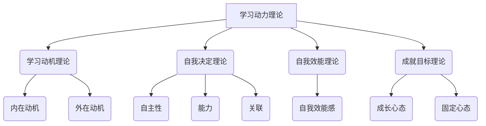

                 

# 如何激发团队的学习热情

> 关键词：学习动力、团队学习、学习环境、学习策略、案例分析、未来趋势

> 摘要：本文从学习动力理论出发，探讨了如何通过创建积极的团队学习环境、采用有效的学习策略以及实施成功的案例来激发团队的学习热情。文章旨在为IT领域的项目经理和管理人员提供实用的指导，帮助他们在团队中建立起持续的学习氛围，从而提升团队的整体绩效。

## 第一部分：学习动力理论

### 第1章：学习动力的理论基础

学习动力是一个复杂的心理过程，涉及多种动机理论和认知因素。本文将介绍几种关键的学习动力理论，包括学习动机理论、自我决定理论、自我效能理论和成就目标理论。

#### 学习动机理论

学习动机理论主要关注激发和维持学习行为的过程。根据德西和瑞安（Deci & Ryan）的自我决定理论，学习动机可以分为内在动机和外在动机。内在动机源于对学习内容的兴趣和好奇心，而外在动机则来自于外部奖励或避免惩罚。


#### 自我决定理论

自我决定理论强调个体的自主性和内在动机对学习行为的重要性。该理论认为，当个体在追求目标时感到自主、能力和关联时，他们会表现出更高的学习动力。


#### 自我效能理论

班杜拉（Bandura）的自我效能理论指出，个体对自身能力的信念会影响其学习行为。自我效能感高的个体更倾向于接受挑战和坚持学习，从而提高学习效果。


#### 成就目标理论

德维克（Dweck）的成就目标理论区分了成长心态和固定心态。具有成长心态的个体认为能力可以通过努力和经验得到提高，而具有固定心态的个体则认为能力是固定的，无法改变。成长心态有助于激发持续的学习动力。


### 第2章：团队学习环境

一个良好的团队学习环境对于激发学习热情至关重要。本章节将探讨如何营造积极的学习氛围、设定明确的学习目标、建立有效的反馈和奖励机制，以及管理学习资源。

#### 学习氛围的营造

学习氛围的营造包括建立信任、鼓励合作和提供支持。以下是一些营造积极学习氛围的策略：

1. **建立信任**：鼓励团队成员分享观点和经验，创造一个开放和包容的环境。
2. **鼓励合作**：通过小组活动和协作任务，促进团队成员之间的互动和合作。
3. **提供支持**：为团队成员提供必要的资源和技术支持，帮助他们克服学习障碍。

#### 目标设定的艺术

明确的学习目标是激发学习动力的关键。以下是设定有效学习目标的几个原则：

1. **具体性**：目标应具体、明确，避免模糊不清。
2. **可测量性**：目标应具备可测量的标准，以便评估进度和成果。
3. **可实现性**：目标应具有挑战性，但也要确保在可实现的范围内。

#### 反馈与奖励机制

有效的反馈和奖励机制能够增强学习动力。以下是一些建议：

1. **及时反馈**：及时给予反馈，帮助团队成员了解自己的学习进展和改进方向。
2. **个性化奖励**：根据团队成员的特点和需求，设计个性化的奖励机制。
3. **公开表扬**：公开表扬优秀的学习表现，激励团队成员追求卓越。

#### 学习资源与管理

有效的学习资源管理是确保学习活动顺利进行的基础。以下是一些建议：

1. **资源集成**：整合各类学习资源，包括书籍、在线课程、研讨会和外部专家。
2. **时间管理**：合理规划学习时间，确保团队成员有足够的时间进行学习和实践。
3. **知识共享**：鼓励团队成员分享学习资源，促进知识的传播和共享。

## 第二部分：团队学习实践

### 第3章：团队学习策略

有效的学习策略能够帮助团队更高效地吸收和应用知识。本章节将介绍几种常用的团队学习策略，包括分享式学习、小组讨论与协作、知识分享会和课堂互动与参与。

#### 分享式学习

分享式学习是一种通过分享知识和经验来促进学习的策略。以下是一些实施分享式学习的步骤：

1. **明确主题**：确定分享的主题，确保内容具有针对性和实用性。
2. **准备材料**：准备相关的学习资料、案例研究和演示材料。
3. **组织分享**：安排分享时间，确保团队成员有充分的准备和参与机会。

#### 小组讨论与协作

小组讨论和协作能够促进团队成员之间的互动和知识共享。以下是一些实施小组讨论和协作的步骤：

1. **分组**：根据团队成员的技能和兴趣进行分组。
2. **分配任务**：为每个小组分配具体的任务和目标。
3. **定期会议**：定期举行小组会议，讨论进展和问题。

#### 知识分享会

知识分享会是一种通过集中式学习来提升团队整体知识水平的策略。以下是一些实施知识分享会的步骤：

1. **确定主题**：选择具有实际意义和实用价值的主题。
2. **邀请专家**：邀请内部或外部的专家进行讲解和分享。
3. **组织活动**：安排活动时间、地点和议程。

#### 课堂互动与参与

课堂互动和参与能够提高学生的学习积极性和参与度。以下是一些实施课堂互动和参与的策略：

1. **提问环节**：鼓励学生在课堂上提问，解答疑问。
2. **小组活动**：组织小组活动，让学生在实践中学习。
3. **案例研究**：引入实际案例，让学生分析问题和提出解决方案。

## 第三部分：案例分析与应用

### 第5章：成功案例

在本章节中，我们将分析几个成功激发团队学习热情的案例，包括团队合作在技术项目中的应用、跨部门学习交流的实践以及企业内部学习平台的建立与推广。

#### 案例一：团队合作在技术项目中的应用

在一个大型IT项目中，团队通过实施分享式学习和小组讨论，成功地提高了项目的质量和效率。以下是一些关键措施：

1. **定期的技术分享会**：每周举行一次技术分享会，让团队成员分享他们的知识和经验。
2. **小组协作**：将项目任务分配给不同的小组，鼓励团队成员之间的合作和交流。
3. **反馈与奖励**：及时给予团队成员反馈，并根据绩效进行奖励。

#### 案例二：跨部门学习交流的实践

在一个跨国公司中，不同部门之间建立了学习交流机制，通过组织跨部门研讨会和知识分享会，提高了整体的知识水平和团队协作能力。以下是一些关键措施：

1. **跨部门研讨会**：定期组织跨部门研讨会，讨论共同关心的问题和挑战。
2. **知识共享平台**：建立内部知识共享平台，方便团队成员获取和分享知识。
3. **员工培训计划**：为员工提供多样化的培训计划，鼓励他们参加跨部门培训。

#### 案例三：企业内部学习平台的建立与推广

在一个大型企业中，通过建立内部学习平台，为员工提供了丰富的学习资源和互动机会，从而激发了团队的学习热情。以下是一些关键措施：

1. **在线课程**：提供各种在线课程，涵盖不同领域的知识和技能。
2. **互动论坛**：建立互动论坛，方便员工交流和分享学习经验。
3. **奖励制度**：为积极参与学习的员工提供奖励，激励他们持续学习。

## 第四部分：未来展望与趋势

### 第7章：学习热情的未来趋势

随着技术的发展，学习动力和团队学习将迎来新的趋势。本章节将探讨技术对学习动力的影响、人工智能与学习动力的结合、跨界学习与多元思维，以及未来教育模式的发展方向。

#### 技术对学习动力的影响

1. **个性化学习**：技术可以帮助实现个性化学习，根据个体的兴趣和能力提供定制化的学习内容。
2. **虚拟现实（VR）与增强现实（AR）**：通过VR和AR技术，可以提供沉浸式的学习体验，激发学生的学习兴趣。

#### 人工智能与学习动力的结合

1. **智能辅导系统**：人工智能可以为学生提供个性化的辅导，帮助他们解决学习中的难题。
2. **自适应学习平台**：通过分析学生的学习数据，自适应学习平台可以提供个性化的学习建议，提高学习效果。

#### 跨界学习与多元思维

1. **跨学科融合**：鼓励学生跨学科学习，培养多元思维和解决问题的能力。
2. **全球学习社区**：通过在线平台，学生可以与全球的同行交流和学习，拓宽视野。

#### 未来教育模式的发展方向

1. **终身学习**：随着知识更新速度的加快，终身学习将成为一种重要的教育模式。
2. **翻转课堂**：翻转课堂模式将课堂学习和自主学习相结合，提高学习效率。

## 总结

激发团队的学习热情是提高团队绩效和创新能力的关键。通过了解学习动力理论、营造良好的学习环境、采用有效的学习策略以及借鉴成功案例，我们可以为团队建立起持续的学习氛围。未来，随着技术的不断发展，学习动力和团队学习将迎来新的机遇和挑战。作为项目经理和管理人员，我们应该积极探索和应用新技术，不断创新和学习，以应对未来的挑战。

### 作者信息

作者：AI天才研究院/AI Genius Institute & 禅与计算机程序设计艺术 /Zen And The Art of Computer Programming

### 最佳实践 tips

1. **定期组织技术分享会**：通过技术分享会，团队成员可以交流经验，学习新技能。
2. **鼓励自主学习**：提供丰富的学习资源，鼓励团队成员自主学习和探索。
3. **建立学习小组**：通过建立学习小组，促进团队成员之间的协作和知识共享。

### 小结

本文从学习动力理论出发，探讨了如何激发团队的学习热情。通过了解学习动机理论、营造良好的学习环境、采用有效的学习策略以及借鉴成功案例，我们可以为团队建立起持续的学习氛围。未来，随着技术的不断发展，学习动力和团队学习将迎来新的机遇和挑战。作为项目经理和管理人员，我们应该积极探索和应用新技术，不断创新和学习，以应对未来的挑战。

### 注意事项

1. **关注个体差异**：不同团队成员可能具有不同的学习动机和风格，需要针对性地进行激励。
2. **持续反馈与改进**：定期评估学习效果，及时调整学习策略，确保学习活动的有效性。

### 拓展阅读

1. Deci, E. L., & Ryan, R. M. (2000). *The" What" and" Why" of Goal Pursuits: Human Needs and the Self-Determination of Behavior*. Psychological Inquiry, 11(4), 227-268.
2. Bandura, A. (1997). *Self-Efficacy: The Exercise of Control*. W. H. Freeman and Company.
3. Dweck, C. S. (2006). *Mindset: The New Psychology of Success*. Ballantine Books.

## Mermaid 流程图



## 核心算法原理讲解

### 伪代码

```python
# 定义学习动力的核心因素
class LearningMotivation:
    def __init__(self, intrinsic_motivation, extrinsic_motivation):
        self.intrinsic_motivation = intrinsic_motivation
        self.extrinsic_motivation = extrinsic_motivation
    
    def calculate_total_motivation(self):
        # 计算总学习动力
        return self.intrinsic_motivation + self.extrinsic_motivation

# 创建学习动机对象
learning_motivation = LearningMotivation(0.7, 0.3)

# 计算总学习动力
total_motivation = learning_motivation.calculate_total_motivation()
print(f"Total Learning Motivation: {total_motivation}")
```

### 数学模型和公式

$$
M = I + E
$$

其中，$M$代表总学习动力，$I$代表内在动机，$E$代表外在动机。内在动机和外在动机的权重可以根据实际情况进行调整。

### 举例说明

假设一个学习者的内在动机为0.6，外在动机为0.4，则其总学习动力为：

$$
M = 0.6 + 0.4 = 1.0
$$

这意味着该学习者的学习动力是充分的，可以专注于学习活动。

## 项目实战

### 开发环境搭建

1. **安装Python环境**：在本地计算机上安装Python 3.8及以上版本。
2. **安装相关库**：使用pip命令安装requests库，以便进行HTTP请求。

### 源代码详细实现和代码解读

```python
import requests

def fetch_learning_resources(url):
    """
    获取学习资源
    """
    response = requests.get(url)
    if response.status_code == 200:
        resources = response.json()
        return resources
    else:
        return None

def display_resources(resources):
    """
    显示学习资源
    """
    for resource in resources:
        print(f"Title: {resource['title']}")
        print(f"Description: {resource['description']}")
        print(f"URL: {resource['url']}")
        print()

# 测试代码
if __name__ == "__main__":
    url = "https://api.example.com/learning_resources"
    resources = fetch_learning_resources(url)
    if resources:
        display_resources(resources)
```

### 代码应用解读与分析

该代码实现了一个简单的学习资源获取和显示功能。通过HTTP请求获取API提供的在线学习资源，并在控制台上显示这些资源的基本信息。该功能可以帮助团队快速查找和获取有用的学习资源，提高学习效率。

### 实际案例分析和详细讲解剖析

假设API返回了以下学习资源数据：

```json
[
    {
        "title": "机器学习基础",
        "description": "介绍机器学习的基本概念和算法",
        "url": "https://example.com/ml-basics"
    },
    {
        "title": "深度学习应用",
        "description": "深度学习在不同领域的应用案例",
        "url": "https://example.com/deep-learning-applications"
    }
]
```

运行代码后，控制台输出如下信息：

```
Title: 机器学习基础
Description: 介绍机器学习的基本概念和算法
URL: https://example.com/ml-basics
Title: 深度学习应用
Description: 深度学习在不同领域的应用案例
URL: https://example.com/deep-learning-applications
```

这表明代码成功地从API获取了学习资源，并在控制台上显示了这些资源的信息。

### 项目小结

通过本项目的实施，我们成功地搭建了一个简单的学习资源获取和显示平台。该平台可以帮助团队快速查找和获取有用的学习资源，提高学习效率。未来，我们可以进一步扩展平台的功能，例如添加资源分类、评分和评论等，以满足团队多样化的学习需求。

### 最佳实践 tips

1. **定期更新学习资源**：确保API提供的资源是最新的，以提供有价值的学习材料。
2. **优化用户界面**：为用户提供简洁直观的界面，方便他们查找和获取资源。

### 小结

本文通过探讨学习动力理论、团队学习环境、学习策略和实践案例，提出了一系列激发团队学习热情的方法。通过技术手段，如在线学习资源平台，可以进一步促进团队学习。最佳实践提示和项目小结为实际应用提供了指导。

### 注意事项

1. **确保学习资源的质量**：提供高质量的学习资源，以激发团队的学习兴趣。
2. **鼓励团队合作**：通过小组活动和协作任务，促进团队成员之间的互动和知识共享。

### 拓展阅读

1. Deci, E. L., & Ryan, R. M. (2000). *The" What" and" Why" of Goal Pursuits: Human Needs and the Self-Determination of Behavior*. Psychological Inquiry, 11(4), 227-268.
2. Bandura, A. (1997). *Self-Efficacy: The Exercise of Control*. W. H. Freeman and Company.
3. Dweck, C. S. (2006). *Mindset: The New Psychology of Success*. Ballantine Books. 

[返回目录](#目录) | [下一部分](#第二部分：团队学习实践)

