                 


### 文章标题：如何管理团队：新手管理者必读指南

> 关键词：团队管理，新手管理者，领导力，沟通，绩效管理

> 摘要：本文将围绕团队管理的新手入门知识，介绍管理者在角色、责任、团队组建、领导力、沟通与协作、问题解决与决策、绩效管理以及个人成长等方面的核心内容，为新手管理者提供实用的指导。

----------------------------------------------------------------

# 如何管理团队：新手管理者必读指南

## 引言

在快速发展的科技时代，越来越多的专业人士走上了管理岗位，成为团队的管理者。然而，成为管理者并不意味着自然拥有管理能力。新手管理者常常面临诸多挑战，如角色定位不清、团队建设困难、沟通障碍等。本文旨在为新手管理者提供一份实用指南，帮助他们在团队管理方面取得成功。

### 管理者的角色与责任

**管理者的角色**：
1. **规划者**：制定团队目标和战略计划。
2. **组织者**：合理分配资源和职责，确保团队成员能够高效工作。
3. **协调者**：解决团队内部和团队之间的冲突，促进协作。
4. **领导者**：激励和引导团队成员，提供方向和愿景。
5. **监督者**：监控团队进度，确保目标达成。

**管理者的责任**：
1. **结果责任**：确保团队目标实现。
2. **人员责任**：关心团队成员的成长和发展。
3. **职业责任**：维护团队和组织声誉。

### 管理基础

在理解管理者的角色和责任后，新手管理者需要掌握一些管理基础。

#### 管理心理学

**人性与行为**：
1. **需求理论**：了解团队成员的基本需求，如生理需求、安全需求、社交需求、尊重需求和自我实现需求。
2. **动机理论**：研究如何激发团队成员的内在动机，如目标设定、奖励和惩罚等。

#### 管理理论

**从科学管理到现代管理**：
1. **科学管理**：泰勒提出的科学管理理论，强调通过科学方法提高工作效率。
2. **现代管理**：包括行为科学管理、系统管理、权变管理等，更注重人性化和系统化。

#### 管理工具与方法

**流程图、SWOT分析等**：
1. **流程图**：用于描述工作流程，帮助管理者优化流程，提高效率。
2. **SWOT分析**：用于分析团队或项目的优势、劣势、机会和威胁，帮助制定战略计划。

### 团队组建

组建一个高效团队是新手管理者的重要任务。以下是一些关键点：

#### 团队结构

**角色分配与职责划分**：
1. **明确角色**：每个团队成员都应该清楚自己的角色和职责。
2. **合理分工**：根据团队成员的技能和兴趣进行任务分配，确保团队成员能够充分发挥自己的优势。

#### 团队文化

**价值观与共同目标**：
1. **价值观**：建立共同的价值观，增强团队凝聚力。
2. **共同目标**：确保团队目标与组织目标一致，激励团队成员为实现目标而努力。

#### 团队建设

**培训与发展**：
1. **培训**：定期为团队成员提供培训，提高团队整体素质。
2. **发展**：关注团队成员的职业发展，提供晋升机会和职业规划指导。

### 领导力

领导力是团队管理中至关重要的一环。以下是一些关键的领导力要素：

#### 领导风格

**民主式、权威式等**：
1. **民主式领导**：鼓励团队成员参与决策，增强团队归属感。
2. **权威式领导**：在紧急情况下提供明确的指导和决策，确保团队高效执行。

#### 领导力模型

**情境领导、变革型领导等**：
1. **情境领导**：根据团队成员的不同情况，采用不同的领导风格。
2. **变革型领导**：通过激励和启发，推动团队成员实现变革和成长。

#### 领导力发展

**自我反思与成长**：
1. **自我反思**：定期进行自我反思，识别自己的优点和不足。
2. **成长**：通过学习和实践，不断提升自己的领导能力。

### 沟通与协作

有效的沟通和协作是团队成功的关键。以下是一些沟通和协作技巧：

#### 沟通技巧

**倾听、表达、反馈**：
1. **倾听**：认真倾听团队成员的意见和建议，了解他们的需求和困惑。
2. **表达**：清晰、明确地表达自己的想法和决策。
3. **反馈**：及时给予团队成员反馈，帮助他们改进和成长。

#### 协作机制

**跨部门沟通与合作**：
1. **明确目标**：确保团队目标一致，避免资源浪费和冲突。
2. **建立沟通渠道**：建立有效的沟通机制，确保信息传递顺畅。

#### 沟通障碍与解决方法

**解决方法**：
1. **文化差异**：尊重不同文化背景的团队成员，避免产生误解和冲突。
2. **信息过滤**：减少信息过滤现象，确保信息传递的真实性和准确性。

### 问题解决与决策

作为团队管理者，解决问题和做出决策是日常工作中的重要部分。以下是一些关键点：

#### 问题识别

**定位问题本质**：
1. **收集信息**：通过调查、访谈等方式收集相关信息。
2. **分析原因**：分析问题的根本原因，而不是表面现象。

#### 决策模型

**理性决策、直觉决策等**：
1. **理性决策**：基于数据和逻辑进行决策。
2. **直觉决策**：在紧急情况下，基于经验和直觉做出快速决策。

#### 决策制定

**制定备选方案与评估**：
1. **备选方案**：列出所有可能的解决方案。
2. **评估与选择**：评估每个方案的优缺点，选择最佳方案。

### 绩效管理

有效的绩效管理是团队持续发展的重要保障。以下是一些关键点：

#### 绩效评估

**关键绩效指标(KPI)**：
1. **设定目标**：根据团队目标和组织战略，设定明确的绩效目标。
2. **监测与评估**：定期监测和评估绩效，确保目标达成。

#### 绩效改进

**反馈与激励**：
1. **反馈**：及时给予团队成员反馈，帮助他们了解自己的绩效状况。
2. **激励**：通过奖励和晋升等激励措施，激发团队成员的积极性。

#### 绩效监控

**持续改进**：
1. **数据分析**：通过数据分析，识别绩效问题，制定改进措施。
2. **改进与实施**：实施改进措施，持续优化绩效管理。

### 个人成长

作为新手管理者，个人成长同样至关重要。以下是一些个人成长的关键点：

#### 职业规划

**目标设定与路径规划**：
1. **设定目标**：明确自己的职业目标，制定实现目标的路径。
2. **路径规划**：制定详细的学习计划和职业发展计划。

#### 持续学习

**自我提升与行业动态**：
1. **自我提升**：通过学习新知识和技能，不断提升自己的能力。
2. **行业动态**：关注行业趋势和新技术，确保自己紧跟时代步伐。

#### 压力管理

**应对工作与生活的压力**：
1. **合理安排时间**：合理规划工作和休息时间，避免过度劳累。
2. **心理调适**：通过心理调适和放松技巧，缓解工作压力。

## 总结与展望

团队管理是一门复杂的艺术，需要新手管理者不断学习和实践。本文介绍了管理者的角色、管理基础、团队组建、领导力、沟通与协作、问题解决与决策、绩效管理和个人成长等方面的核心内容，希望对新手管理者有所启发。在实际工作中，管理者需要根据具体情况灵活运用所学知识，不断提升自己的管理能力。

## 作者信息

作者：AI天才研究院/AI Genius Institute & 禅与计算机程序设计艺术 /Zen And The Art of Computer Programming

本文版权归作者所有，未经授权禁止转载。如需转载，请联系作者获取授权。

----------------------------------------------------------------

以下是使用Mermaid流程图来展示管理者的核心概念之间的联系：

```mermaid
graph TB
A[管理者角色] --> B[规划者]
A --> C[组织者]
A --> D[协调者]
A --> E[领导者]
A --> F[监督者]

G[管理者的责任] --> H[结果责任]
G --> I[人员责任]
G --> J[职业责任]

K[管理基础] --> L[管理心理学]
K --> M[管理理论]
K --> N[管理工具与方法]

O[团队组建] --> P[团队结构]
O --> Q[团队文化]
O --> R[团队建设]

S[领导力] --> T[领导风格]
S --> U[领导力模型]
S --> V[领导力发展]

W[沟通与协作] --> X[沟通技巧]
W --> Y[协作机制]
W --> Z[沟通障碍与解决方法]

AA[问题解决与决策] --> BB[问题识别]
AA --> CC[决策模型]
AA --> DD[决策制定]

EE[绩效管理] --> FF[绩效评估]
EE --> GG[绩效改进]
EE --> HH[绩效监控]

II[个人成长] --> JJ[职业规划]
II --> KK[持续学习]
II --> LL[压力管理]
```



通过这个Mermaid流程图，我们可以清晰地看到管理者核心概念之间的联系和关系，有助于新手管理者更好地理解和应用这些知识。

----------------------------------------------------------------

以下是关于绩效管理的伪代码和示例：

```python
# 绩效管理伪代码

# 设定绩效目标
def set_performance_goals(employee):
    goals = []
    # 根据员工岗位和职责设定绩效目标
    goals.append("完成项目A的进度")
    goals.append("提高项目B的质量")
    goals.append("减少错误率")
    return goals

# 监测绩效
def monitor_performance(employee, goals):
    performance = {}
    for goal in goals:
        # 根据实际完成情况打分
        score = get_score_for_goal(employee, goal)
        performance[goal] = score
    return performance

# 评估绩效
def evaluate_performance(performance):
    total_score = 0
    for score in performance.values():
        total_score += score
    average_score = total_score / len(performance)
    return average_score

# 激励措施
def apply_incentives(employee, average_score):
    if average_score > 90:
        # 表现优秀，给予奖金和晋升机会
        apply_bonus(employee)
        apply_promotion(employee)
    elif average_score > 80:
        # 表现良好，给予奖金
        apply_bonus(employee)
    else:
        # 表现一般，给予培训和指导
        provide_training(employee)

# 示例
employee = "张三"
goals = set_performance_goals(employee)
performance = monitor_performance(employee, goals)
average_score = evaluate_performance(performance)
apply_incentives(employee, average_score)
```

在这个伪代码中，我们首先设定了员工的绩效目标，然后监测和评估员工的绩效，并根据绩效结果给予相应的激励措施。这个例子展示了绩效管理的基本流程和实现方法。

----------------------------------------------------------------

以下是使用LaTeX格式嵌入的数学公式和示例：

$$
E = mc^2
$$

$1 + 1 = 2$

在上述例子中，第一个公式使用了 LaTeX 格式，将其嵌入到独立的段落中，使用 `$$` 括起来，这是为了使其在文中独立显示。第二个公式使用了 `$` 括起来，这是为了将其嵌入到文本行中。

在撰写技术博客时，合理使用 LaTeX 公式可以使文章更加专业和清晰。以下是关于绩效管理的 LaTeX 公式示例：

$$
\text{绩效得分} = \frac{\text{完成目标得分}}{\text{目标数量}}
$$

$$
\text{平均绩效得分} = \frac{\sum_{i=1}^{n} \text{绩效得分}_i}{n}
$$

这些公式说明了如何计算绩效得分和平均绩效得分，对于理解绩效管理具有重要意义。

----------------------------------------------------------------

以下是关于团队管理中沟通与协作的实战案例：

### 项目背景

某科技公司正在开发一款新的移动应用程序，项目团队成员来自不同部门，包括产品经理、设计师、前端工程师、后端工程师和测试工程师。由于团队成员分散在不同地点，沟通和协作成为一个关键挑战。

### 开发环境搭建

为了确保团队成员可以顺畅地进行协作，项目经理首先搭建了以下开发环境：

1. **版本控制工具**：选择了Git作为版本控制工具，确保代码的版本管理和协作开发。
2. **代码仓库**：创建了远程代码仓库，方便团队成员提交代码和进行代码合并。
3. **协作平台**：使用了Slack进行即时沟通和协作，确保团队成员可以实时交流。
4. **项目管理工具**：采用了Jira进行任务跟踪和管理，确保项目进度和任务分配清晰。

### 源代码实现

项目开发过程中，团队成员根据各自的职责进行代码编写。以下是一个前端工程师的代码实现示例：

```javascript
// 前端代码实现示例
function fetchUserInfo() {
    fetch('/api/userinfo')
        .then(response => response.json())
        .then(data => {
            // 处理用户信息
            console.log(data);
        })
        .catch(error => {
            // 处理错误
            console.error('Error fetching user info:', error);
        });
}

// 调用API获取用户信息
fetchUserInfo();
```

### 代码解读与分析

1. **函数定义**：`fetchUserInfo` 函数用于获取用户信息。
2. **异步处理**：使用 `fetch` API 进行异步数据请求，避免阻塞主线程。
3. **错误处理**：使用 `try...catch` 语句处理可能的错误。

### 实际案例分析与详细讲解

在一个实际案例中，前端工程师和后端工程师之间由于接口定义不一致导致了一系列问题。以下是问题分析和解决过程：

1. **问题识别**：前端工程师在调用后端接口时，发现返回的数据格式与预期不符。
2. **原因分析**：经过沟通，发现是后端工程师在定义接口时没有明确说明返回的数据格式。
3. **解决方案**：后端工程师修改接口定义，明确返回数据格式，并在文档中记录接口定义。
4. **验证与测试**：前端工程师重新调用接口，验证数据格式是否符合预期。

通过这个案例，我们可以看到有效的沟通和协作对于避免问题至关重要。团队成员之间需要保持良好的沟通，确保信息传递准确无误。

### 项目小结

在开发过程中，通过搭建合适的开发环境、使用版本控制工具和协作平台，以及保持有效的沟通和协作，项目团队成功地完成了移动应用程序的开发。这一实战案例展示了团队管理中沟通与协作的重要性和实现方法。

### 最佳实践 tips

1. **明确职责**：确保每个团队成员都清楚自己的职责和任务。
2. **建立沟通机制**：定期召开团队会议，确保团队成员之间的沟通畅通。
3. **使用协作工具**：利用项目管理工具和协作平台，提高团队协作效率。

通过这些最佳实践，团队可以更好地应对沟通与协作中的挑战，提高项目的成功率。

----------------------------------------------------------------

## 小结与注意事项

本文通过详细的分析和实战案例，为新手管理者提供了关于团队管理的一系列核心知识和实践建议。以下是本文的重点总结和注意事项：

### 重点总结

1. **管理者的角色与责任**：新手管理者需要明确自己的角色和责任，包括规划者、组织者、协调者、领导者和监督者。
2. **管理基础**：了解管理心理学、管理理论和常用的管理工具与方法，有助于提高管理效率。
3. **团队组建**：通过合理分配角色和职责、建立团队文化和进行团队建设，确保团队高效运行。
4. **领导力**：掌握不同领导风格和领导力模型，不断提升自己的领导力。
5. **沟通与协作**：有效的沟通和协作是团队成功的关键，需要注重倾听、表达和反馈。
6. **问题解决与决策**：学会识别问题、制定决策模型和制定备选方案，确保团队在面对挑战时能够迅速应对。
7. **绩效管理**：通过设定绩效目标、监测和评估绩效、激励措施等，确保团队成员的工作积极性。
8. **个人成长**：新手管理者需要持续学习和自我提升，关注行业动态，以适应不断变化的工作环境。

### 注意事项

1. **理解团队成员**：新手管理者需要深入了解团队成员的需求和期望，以便更好地激励和引导他们。
2. **持续改进**：团队管理是一个不断优化的过程，管理者需要持续改进管理方法，提高团队效能。
3. **平衡工作与生活**：管理者在关注工作绩效的同时，也要关注团队成员的个人生活和心理健康。
4. **灵活应对**：面对不同的情况，管理者需要灵活调整管理策略，以适应团队和环境的变化。

### 拓展阅读

- **《管理实践》**：彼得·德鲁克
- **《五项管理修炼》**：彼得·圣吉
- **《沟通的艺术》**：阿尔伯特·梅拉比安

这些书籍提供了丰富的团队管理理论和实践案例，有助于新手管理者进一步提高自己的管理能力。

作者：AI天才研究院/AI Genius Institute & 禅与计算机程序设计艺术 /Zen And The Art of Computer Programming

本文版权归作者所有，未经授权禁止转载。如需转载，请联系作者获取授权。

----------------------------------------------------------------

### 项目实战：实现一个简单的任务管理系统

在本节中，我们将通过一个简单的任务管理系统的实现，展示团队管理中的项目实战过程。任务管理系统是一个用于管理任务、跟踪进度和分配任务的工具，有助于提高团队的工作效率。

#### 开发环境搭建

首先，我们需要搭建开发环境。以下是所需的工具和步骤：

1. **编程语言**：选择Python作为编程语言，因为它简单易学，且拥有丰富的第三方库。
2. **数据库**：使用SQLite作为数据库，它是一个轻量级的嵌入式数据库，适合小型项目。
3. **前端框架**：选择Flask作为Web框架，它是一个轻量级的Web应用框架，易于使用。
4. **版本控制**：使用Git进行版本控制，以便团队成员可以协作开发。

#### 源代码实现

以下是一个简单的任务管理系统实现的伪代码和部分关键代码：

```python
# 导入所需库
import sqlite3
from flask import Flask, request, jsonify

# 初始化Flask应用
app = Flask(__name__)

# 连接SQLite数据库
conn = sqlite3.connect('tasks.db')
c = conn.cursor()

# 创建任务表
c.execute('''CREATE TABLE IF NOT EXISTS tasks
             (id INTEGER PRIMARY KEY, title TEXT, description TEXT, status TEXT)''')

# 添加任务
@app.route('/tasks', methods=['POST'])
def add_task():
    title = request.form['title']
    description = request.form['description']
    status = '未开始'
    c.execute("INSERT INTO tasks (title, description, status) VALUES (?, ?, ?)", (title, description, status))
    conn.commit()
    return jsonify({'message': '任务添加成功'})

# 获取所有任务
@app.route('/tasks', methods=['GET'])
def get_tasks():
    c.execute("SELECT * FROM tasks")
    tasks = c.fetchall()
    return jsonify(tasks)

# 修改任务状态
@app.route('/tasks/<int:task_id>', methods=['PUT'])
def update_task(task_id):
    status = request.form['status']
    c.execute("UPDATE tasks SET status = ? WHERE id = ?", (status, task_id))
    conn.commit()
    return jsonify({'message': '任务状态更新成功'})

# 删除任务
@app.route('/tasks/<int:task_id>', methods=['DELETE'])
def delete_task(task_id):
    c.execute("DELETE FROM tasks WHERE id = ?", (task_id,))
    conn.commit()
    return jsonify({'message': '任务删除成功'})

# 运行应用
if __name__ == '__main__':
    app.run(debug=True)
```

#### 代码解读与分析

1. **数据库连接**：使用SQLite3连接数据库，并创建任务表。
2. **添加任务**：通过POST请求添加任务，包括任务标题、描述和状态。
3. **获取所有任务**：通过GET请求获取所有任务，返回任务列表。
4. **修改任务状态**：通过PUT请求修改任务状态，如从“未开始”变为“进行中”或“已完成”。
5. **删除任务**：通过DELETE请求删除特定ID的任务。

#### 实际案例分析与详细讲解

以下是一个实际案例，展示如何使用任务管理系统：

1. **任务创建**：团队成员A通过Web界面创建了一个名为“编写报告”的任务，并添加了详细描述和初始状态“未开始”。
2. **任务分配**：项目经理将任务分配给团队成员B，并在任务管理系统中更新任务状态为“进行中”。
3. **任务进度更新**：团队成员B在完成任务的过程中，通过Web界面更新任务进度，将状态更改为“已完成”。
4. **任务跟踪**：项目经理通过任务管理系统监控任务进度，确保所有任务按时完成。

#### 项目小结

通过实现一个简单的任务管理系统，团队成员可以方便地创建、分配、更新和删除任务。这个项目展示了如何将团队管理理论应用于实际开发中，提高了团队的工作效率和协作能力。

### 最佳实践 tips

1. **持续集成**：定期进行代码审查和测试，确保代码质量。
2. **文档化**：为代码和系统功能编写详细的文档，便于新成员快速上手。
3. **反馈机制**：建立有效的反馈机制，及时收集和处理团队成员的意见和建议。

通过这些最佳实践，团队可以更好地管理项目，提高工作效率和团队协作效果。

---

本文由AI天才研究院/AI Genius Institute与禅与计算机程序设计艺术/Zen And The Art of Computer Programming共同撰写，旨在为新手管理者提供实用的团队管理指南。读者如需转载，请联系作者获取授权。本文版权所有，未经授权禁止转载。

