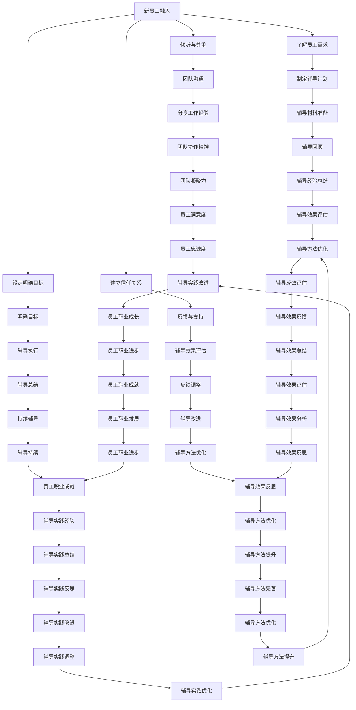
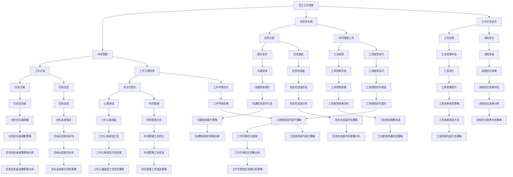

                 


### 文章标题：如何进行有效的一对一员工辅导

> 关键词：员工辅导、一对一辅导、有效沟通、技能提升、职业发展

> 摘要：本文旨在探讨如何进行有效的一对一员工辅导，从基础原则、具体步骤、技巧与方法以及案例研究等多个维度，提供实用的指导和策略，帮助管理者和企业提升员工的职业素养和工作表现。

----------------------------------------------------------------

## 引言：员工辅导的重要性与价值

### 1.1 为什么要进行员工辅导？

员工辅导是企业管理中至关重要的一环，它不仅关系到员工个人的职业发展，还直接影响企业的整体绩效。以下是进行员工辅导的几个关键原因：

1. **提升员工技能**：员工辅导可以帮助员工掌握新技能，提高工作效率和质量，从而推动企业的业务发展。
2. **增强员工满意度**：一对一的辅导让员工感受到企业对他们的关注和支持，有助于提升员工的工作满意度和忠诚度。
3. **培养团队协作精神**：通过辅导，员工可以更好地了解团队的目标和任务，增强协作意识，提升团队的整体执行力。
4. **促进职业发展**：有效的员工辅导可以明确员工的职业发展路径，帮助他们规划职业生涯，提高企业的核心竞争力。

### 1.2 一对一员工辅导的独特优势

相对于其他形式的员工辅导，一对一员工辅导具有以下独特优势：

1. **个性化**：一对一辅导可以根据员工的个人需求和特点进行定制化指导，提高辅导的针对性和有效性。
2. **深度沟通**：一对一辅导提供了充分的交流空间，有助于建立信任关系，促进双方深入沟通。
3. **灵活安排**：辅导时间可以根据员工的工作和生活安排灵活调整，确保辅导的持续性和稳定性。
4. **隐私保护**：一对一辅导保障了员工的隐私，员工可以在安全的环境中表达自己的想法和困惑。

## 基础原则：有效辅导的基石

### 2.1 倾听与尊重

有效的员工辅导首先需要建立良好的沟通基础，而倾听和尊重则是沟通的核心原则。以下是一些建议：

1. **全身心倾听**：在辅导过程中，要专注地听员工讲话，避免分心或打断他们的发言。
2. **积极回应**：通过点头、眼神交流等非语言信号，表达对员工的尊重和理解。
3. **开放式提问**：鼓励员工表达自己的观点和想法，不要急于给出结论或建议。

### 2.2 设定明确的目标

设定明确的目标是有效辅导的重要步骤。以下是设定目标的几个关键点：

1. **具体性**：目标应该具体、明确，避免模糊不清。
2. **可实现性**：目标要具有可实现性，既要挑战性，又要实际可行。
3. **时限性**：为每个目标设定一个明确的完成时间，有助于员工更有动力地去实现。

### 2.3 建立信任关系

信任是有效辅导的基础。以下是一些建立信任关系的方法：

1. **真诚**：在辅导过程中，要保持真诚，不要隐瞒或夸大事实。
2. **一致性**：言行一致，保持稳定的表现和态度。
3. **反馈**：及时给予员工反馈，肯定他们的进步和努力。

## 准备阶段：制定辅导计划

### 3.1 确定辅导的目的和内容

在准备阶段，首先要明确辅导的目的和内容。以下是确定辅导目的和内容的方法：

1. **了解员工需求**：与员工沟通，了解他们的需求和期望，明确辅导的方向。
2. **分析业务需求**：结合企业的发展目标和业务需求，确定辅导的重点领域。
3. **制定辅导计划**：根据上述分析，制定详细的辅导计划，包括辅导的目标、内容、时间安排等。

### 3.2 了解员工需求和问题

了解员工的需求和问题是有效辅导的前提。以下是一些了解员工需求和问题的方法：

1. **一对一访谈**：与员工进行一对一访谈，了解他们的困惑、挑战和职业发展目标。
2. **调查问卷**：设计调查问卷，收集员工的意见和建议。
3. **团队沟通**：与员工的团队成员沟通，了解他们在工作中的表现和需求。

### 3.3 准备辅导材料和资源

在准备辅导阶段，还需要准备充分的辅导材料和资源，以便在辅导过程中提供支持。以下是一些建议：

1. **制定学习计划**：根据辅导内容，制定详细的学习计划，包括学习目标、学习内容、学习时间等。
2. **收集资料**：收集相关的书籍、文章、视频等学习资料，为辅导提供参考。
3. **准备工具**：根据辅导需要，准备适当的工具和软件，如演示软件、练习工具等。

## 执行阶段：实施一对一辅导

### 4.1 开场和建立联系

在执行阶段，首先需要进行开场和建立联系，以下是一些建议：

1. **营造轻松氛围**：选择一个舒适的环境，让员工感到放松和自在。
2. **介绍自己**：简要介绍自己的背景和职责，让员工了解辅导的目的和意义。
3. **建立信任**：通过积极的语言和非语言信号，表达对员工的关心和支持。

### 4.2 倾听与理解

倾听和理解是辅导过程中至关重要的一环，以下是一些建议：

1. **全神贯注**：在员工讲话时，保持专注，避免分心或打断他们的发言。
2. **积极回应**：通过点头、眼神交流等非语言信号，表达对员工的尊重和理解。
3. **开放式提问**：鼓励员工表达自己的观点和想法，不要急于给出结论或建议。

### 4.3 提问与引导

提问与引导是辅导过程中的关键环节，以下是一些建议：

1. **开放式提问**：使用开放式提问，引导员工思考和表达。
2. **引导深入探讨**：在员工回答问题时，引导他们进一步深入思考，探讨问题的本质。
3. **避免假设**：在提问时，避免对员工的观点或想法进行假设，尊重他们的真实想法。

### 4.4 提供反馈与建议

提供反馈与建议是辅导过程中不可或缺的一环，以下是一些建议：

1. **及时反馈**：在辅导过程中，及时给予员工反馈，肯定他们的进步和努力。
2. **具体明确**：反馈要具体明确，避免模糊不清，帮助员工明确改进方向。
3. **积极正面**：反馈要积极正面，鼓励员工克服困难，继续努力。

### 4.5 结束辅导会议

在辅导会议结束时，需要进行以下步骤：

1. **总结要点**：回顾本次辅导的主要内容和收获，确保双方对辅导内容有清晰的认识。
2. **明确下一步行动**：确定下一次辅导的时间、内容和目标，确保辅导的持续性和稳定性。
3. **感谢员工**：感谢员工的参与和付出，表达对他们的关心和支持。

## 回顾阶段：辅导效果评估与反馈

### 5.1 评估辅导效果

评估辅导效果是回顾阶段的重要任务，以下是一些建议：

1. **收集员工反馈**：通过调查问卷、访谈等方式，收集员工对辅导效果的反馈。
2. **观察员工表现**：观察员工在工作中的表现，了解他们在辅导后的变化和进步。
3. **对比目标**：将员工的实际表现与辅导目标进行对比，评估辅导效果。

### 5.2 收集员工反馈

收集员工反馈是评估辅导效果的重要依据，以下是一些建议：

1. **匿名反馈**：确保反馈的匿名性，让员工可以放心地表达真实想法。
2. **开放式问题**：使用开放式问题，鼓励员工详细描述他们的感受和看法。
3. **定期收集**：定期收集员工的反馈，确保反馈的及时性和准确性。

### 5.3 反馈调整与改进

根据评估结果和员工反馈，进行以下调整和改进：

1. **优化辅导内容**：根据员工的需求和反馈，调整辅导内容，确保其更加贴近实际需求。
2. **改进辅导方法**：根据反馈，改进辅导方法，提高辅导效果。
3. **持续跟踪**：定期跟踪员工的辅导效果，确保辅导的持续性和稳定性。

## 技巧与方法：提升辅导效果

### 6.1 倾听的技巧

倾听是有效辅导的关键，以下是一些倾听技巧：

1. **全神贯注**：在员工讲话时，保持专注，避免分心或打断他们的发言。
2. **积极回应**：通过点头、眼神交流等非语言信号，表达对员工的尊重和理解。
3. **开放式提问**：鼓励员工表达自己的观点和想法，不要急于给出结论或建议。

### 6.2 提问的技巧

提问是辅导过程中的重要环节，以下是一些提问技巧：

1. **开放式提问**：使用开放式提问，引导员工思考和表达。
2. **引导深入探讨**：在员工回答问题时，引导他们进一步深入思考，探讨问题的本质。
3. **避免假设**：在提问时，避免对员工的观点或想法进行假设，尊重他们的真实想法。

### 6.3 提供有效反馈

提供有效反馈是提升辅导效果的关键，以下是一些建议：

1. **及时反馈**：在辅导过程中，及时给予员工反馈，肯定他们的进步和努力。
2. **具体明确**：反馈要具体明确，避免模糊不清，帮助员工明确改进方向。
3. **积极正面**：反馈要积极正面，鼓励员工克服困难，继续努力。

### 6.4 应对困难情况

在辅导过程中，可能会遇到一些困难情况，以下是一些建议：

1. **保持冷静**：遇到困难时，保持冷静，不要急于下结论或批评。
2. **倾听理解**：倾听员工的困难和困惑，理解他们的感受和需求。
3. **共同寻找解决方案**：与员工共同分析问题，寻找解决方案，鼓励他们积极参与。

## 案例研究：成功的一对一员工辅导实践

### 7.1 案例一：如何帮助新员工快速融入团队？

**背景介绍**：某公司新招聘了一批新员工，但他们对于公司的文化和工作流程不够熟悉，导致在融入团队的过程中遇到了一些困难。

**核心概念与联系**：

**核心算法原理讲解**：
```plaintext
// 核心算法：员工融入流程
function employeeIntegration(employee) {
    // 步骤1：倾听与尊重
    listenAndRespect(employee);
    
    // 步骤2：了解员工需求
    understandEmployeeNeeds(employee);
    
    // 步骤3：设定明确目标
    setClearGoals(employee);
    
    // 步骤4：建立信任关系
    buildTrust(employee);
    
    // 步骤5：团队沟通
    communicateWithTeam(employee);
    
    // 步骤6：辅导计划制定
    prepareDormitoryPlan(employee);
    
    // 步骤7：辅导执行
    executeDormitory(employee);
    
    // 步骤8：辅导效果评估
    evaluateDormitoryEffect(employee);
}

// 辅导流程伪代码
function listenAndRespect(employee) {
    // 实现倾听与尊重的具体操作
}

function understandEmployeeNeeds(employee) {
    // 实现了解员工需求的具体操作
}

function setClearGoals(employee) {
    // 实现设定明确目标的具体操作
}

function buildTrust(employee) {
    // 实现建立信任关系的具体操作
}

function communicateWithTeam(employee) {
    // 实现团队沟通的具体操作
}

function prepareDormitoryPlan(employee) {
    // 实现辅导计划制定的具体操作
}

function executeDormitory(employee) {
    // 实现辅导执行的具体操作
}

function evaluateDormitoryEffect(employee) {
    // 实现辅导效果评估的具体操作
}
```
**数学模型和公式**：
```latex
$$
\text{员工融入度} = f(\text{倾听与尊重}, \text{了解员工需求}, \text{设定明确目标}, \text{建立信任关系}, \text{团队沟通}, \text{辅导计划制定}, \text{辅导执行}, \text{辅导效果评估})
$$
```
**详细讲解与举例说明**：
**背景介绍**：某公司新招聘了一批新员工，这些员工在融入团队的过程中遇到了一些困难。为了帮助这些新员工更快地融入团队，公司决定开展一对一员工辅导。

**核心概念与联系**：
- **倾听与尊重**：辅导者需要全神贯注地倾听新员工的需求和困惑，并通过积极的语言和肢体动作表达对他们的尊重和理解。
- **了解员工需求**：辅导者需要与新员工进行深入的沟通，了解他们的期望、困惑和职业规划，以便制定有针对性的辅导计划。
- **设定明确目标**：辅导者需要与员工共同设定明确的辅导目标，确保辅导过程有清晰的方向和成果。
- **建立信任关系**：辅导者需要通过真诚的沟通和支持，建立与员工之间的信任关系，为后续的辅导奠定基础。
- **团队沟通**：辅导者需要引导新员工与团队成员进行有效的沟通，帮助他们更好地融入团队。
- **辅导计划制定**：辅导者需要根据新员工的需求和目标，制定详细的辅导计划，包括辅导的内容、时间安排和预期成果等。
- **辅导执行**：辅导者需要按照辅导计划实施辅导，通过提问、讨论、反馈等方式，帮助新员工提高技能和解决困惑。
- **辅导效果评估**：辅导者需要定期评估辅导效果，根据员工的反馈和实际表现，调整辅导策略和计划。

**详细讲解与举例说明**：

1. **倾听与尊重**：
   - **步骤**：辅导者在与新员工沟通时，要全神贯注地倾听他们的需求和困惑，通过积极的语言和肢体动作表达对他们的尊重和理解。
   - **示例**：新员工小王在入职后感到困惑，不知道如何与团队成员沟通。辅导者小张在第一次辅导时，耐心倾听小王的困惑，并给予肯定和支持。

2. **了解员工需求**：
   - **步骤**：辅导者需要通过深入沟通，了解新员工的期望、困惑和职业规划，以便制定有针对性的辅导计划。
   - **示例**：在了解小王的需求后，辅导者小张发现小王对于团队沟通技巧感到困惑，于是制定了针对性的辅导计划，帮助小王提升沟通能力。

3. **设定明确目标**：
   - **步骤**：辅导者需要与员工共同设定明确的辅导目标，确保辅导过程有清晰的方向和成果。
   - **示例**：小张与小王共同设定了提升沟通能力的明确目标，并在辅导计划中明确了具体的行动步骤和时间表。

4. **建立信任关系**：
   - **步骤**：辅导者需要通过真诚的沟通和支持，建立与员工之间的信任关系，为后续的辅导奠定基础。
   - **示例**：在辅导过程中，小张始终以真诚的态度对待小王，给予他充分的信任和支持，从而建立了良好的信任关系。

5. **团队沟通**：
   - **步骤**：辅导者需要引导新员工与团队成员进行有效的沟通，帮助他们更好地融入团队。
   - **示例**：在辅导过程中，小张帮助小王与团队成员建立联系，并引导他们进行有效的沟通，帮助小王更好地融入团队。

6. **辅导计划制定**：
   - **步骤**：辅导者需要根据新员工的需求和目标，制定详细的辅导计划，包括辅导的内容、时间安排和预期成果等。
   - **示例**：小张根据小王的需求和目标，制定了详细的辅导计划，包括沟通技巧培训、团队活动参与等。

7. **辅导执行**：
   - **步骤**：辅导者需要按照辅导计划实施辅导，通过提问、讨论、反馈等方式，帮助新员工提高技能和解决困惑。
   - **示例**：在辅导过程中，小张通过提问、讨论和反馈的方式，帮助小王逐步提升沟通能力，解决他在团队沟通中遇到的问题。

8. **辅导效果评估**：
   - **步骤**：辅导者需要定期评估辅导效果，根据员工的反馈和实际表现，调整辅导策略和计划。
   - **示例**：在辅导结束后，小张与小王进行了一次效果评估，发现小王的沟通能力有了显著提升，并根据评估结果调整了后续的辅导计划。

**总结**：通过一对一员工辅导，小王成功地融入了团队，提升了沟通能力，并在工作中取得了更好的成果。这个案例展示了如何通过有效的辅导，帮助新员工快速融入团队，提升职业素养和工作表现。

### 7.2 案例二：如何帮助员工提升工作效率？

**背景介绍**：某公司员工小张在工作中遇到了效率低的问题，影响了整体团队的进度。为了帮助小张提升工作效率，公司决定开展一对一员工辅导。

**核心概念与联系**：

**核心算法原理讲解**：
```plaintext
// 核心算法：提升工作效率
function improveWorkEfficiency(employee) {
    // 步骤1：时间管理
    manageTime(employee);
    
    // 步骤2：任务优先级
    setTaskPriority(employee);
    
    // 步骤3：工作方法优化
    optimizeWorkMethod(employee);
    
    // 步骤4：工作计划制定
    prepareWorkPlan(employee);
    
    // 步骤5：工作习惯培养
    cultivateWorkHabits(employee);
    
    // 步骤6：工作环境优化
    optimizeWorkEnvironment(employee);
    
    // 步骤7：任务跟进
    followUpTasks(employee);
    
    // 步骤8：效果评估与反馈
    evaluateAndFeedback(employee);
}

// 工作效率提升流程伪代码
function manageTime(employee) {
    // 实现时间管理的具体操作
}

function setTaskPriority(employee) {
    // 实现任务优先级的具体操作
}

function optimizeWorkMethod(employee) {
    // 实现工作方法优化的具体操作
}

function prepareWorkPlan(employee) {
    // 实现工作计划制定的具体操作
}

function cultivateWorkHabits(employee) {
    // 实现工作习惯培养的具体操作
}

function optimizeWorkEnvironment(employee) {
    // 实现工作环境优化的具体操作
}

function followUpTasks(employee) {
    // 实现任务跟进的具体操作
}

function evaluateAndFeedback(employee) {
    // 实现效果评估与反馈的具体操作
}
```
**数学模型和公式**：
```latex
$$
\text{工作效率} = f(\text{时间管理}, \text{任务优先级}, \text{工作方法优化}, \text{工作计划制定}, \text{工作习惯培养}, \text{工作环境优化}, \text{任务跟进}, \text{效果评估与反馈})
$$
```
**详细讲解与举例说明**：

**背景介绍**：某公司员工小张在工作中遇到了效率低的问题，他经常感到压力很大，无法按时完成工作任务。为了帮助小张提升工作效率，公司决定开展一对一员工辅导。

**核心概念与联系**：

- **时间管理**：辅导者需要帮助小张学会合理安排时间，提高工作效率。
- **任务优先级**：辅导者需要帮助小张明确任务的优先级，确保重要任务得到优先处理。
- **工作方法优化**：辅导者需要帮助小张找到更高效的工作方法，减少不必要的工作量。
- **工作计划制定**：辅导者需要帮助小张制定合理的工作计划，确保工作有条不紊地进行。
- **工作习惯培养**：辅导者需要帮助小张养成良好的工作习惯，提高工作效率。
- **工作环境优化**：辅导者需要帮助小张改善工作环境，减少干扰因素，提高专注力。
- **任务跟进**：辅导者需要帮助小张建立有效的任务跟进机制，确保任务按时完成。
- **效果评估与反馈**：辅导者需要定期评估小张的工作效率，并根据反馈进行调整。

**详细讲解与举例说明**：

1. **时间管理**：
   - **步骤**：辅导者需要帮助小张学会合理安排时间，提高工作效率。
   - **示例**：辅导者小王帮助小张制定了一个详细的时间管理计划，包括每天的工作任务和时间分配，并鼓励小张严格按照计划执行。

2. **任务优先级**：
   - **步骤**：辅导者需要帮助小张明确任务的优先级，确保重要任务得到优先处理。
   - **示例**：在任务管理中，小王教导小张使用“四象限法”来划分任务的优先级，将紧急且重要的事情放在第一位处理。

3. **工作方法优化**：
   - **步骤**：辅导者需要帮助小张找到更高效的工作方法，减少不必要的工作量。
   - **示例**：小王建议小张尝试使用“番茄工作法”来提高专注力，减少中断，从而提高工作效率。

4. **工作计划制定**：
   - **步骤**：辅导者需要帮助小张制定合理的工作计划，确保工作有条不紊地进行。
   - **示例**：小王与小张一起制定了每周的工作计划，明确了每周的目标和任务，并设定了具体的完成时间。

5. **工作习惯培养**：
   - **步骤**：辅导者需要帮助小张养成良好的工作习惯，提高工作效率。
   - **示例**：小王鼓励小张每天早

