                 

# 如何进行有效的一对一员工面谈

## 引言

在一对一员工面谈中，作为面试官，我们需要明确面谈的目的和目标，充分准备，确保面谈的顺利进行，从而获得有效的信息，提高员工的工作积极性、满意度和工作效率。本文将详细阐述如何进行有效的一对一员工面谈，包括准备工作、面谈技巧、案例分析、反馈与改进等方面。

## 文章关键词

- 一对一员工面谈
- 面谈准备
- 面谈技巧
- 面谈案例分析
- 反馈与改进

## 摘要

本文旨在介绍如何进行有效的一对一员工面谈。文章分为五个部分：准备工作、面谈技巧、案例分析、反馈与改进和附录。首先，我们介绍面谈前的准备工作，包括面谈目的和目标的设定、面谈对象和背景的了解、面谈时间和地点的选择以及准备材料。然后，详细讲解面谈技巧，包括建立良好的沟通氛围、倾听技巧、提问技巧、面部表情和肢体语言、反馈技巧以及冲突处理。接着，通过案例分析，探讨成功和失败的面谈案例，并总结经验教训。最后，我们介绍反馈与改进的方法，以及持续改进的重要性。

## 第一部分：准备工作

### 1.1 面谈前的准备

#### 1.1.1 面谈目的和目标的设定

面谈目的的设定是面谈顺利进行的关键。我们需要明确面谈的目的，例如了解员工的工作状态、解决员工的困惑、评估员工的工作能力等。同时，我们还需要设定具体的面谈目标，例如了解员工的工作内容、了解员工的工作环境、了解员工的工作需求等。设定目的和目标有助于我们更有针对性地进行面谈，提高面谈效果。

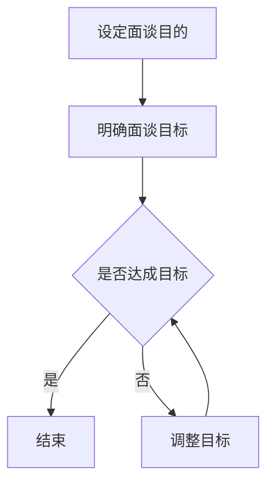

#### 1.1.2 面谈对象和背景的了解

在面谈前，我们需要充分了解面谈对象的背景，包括其个人情况、工作经历、专业技能等。这有助于我们更好地了解面谈对象的需求，从而有针对性地进行面谈。

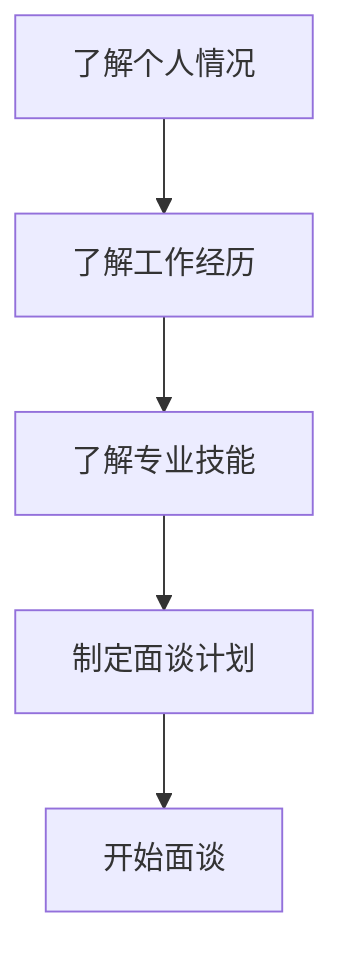

#### 1.1.3 面谈时间和地点的选择

选择合适的时间和地点进行面谈，有助于提高面谈效果。我们需要考虑员工的便利性，选择一个双方都方便的时间和地点进行面谈。此外，我们还需要确保面谈环境的安静、舒适，以便双方都能更好地进行沟通。

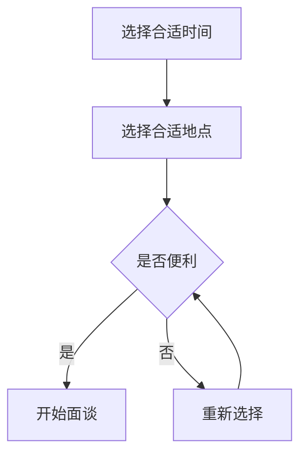

### 1.2 准备材料

#### 1.2.1 面谈议程

制定面谈议程有助于我们更有条理地进行面谈，提高面谈效率。议程应包括面谈的目的、流程、时间安排等。

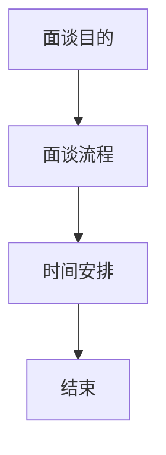

#### 1.2.2 面谈工具和设备

确保面谈工具和设备的正常运行，有助于提高面谈效果。我们需要的工具和设备包括笔记本、投影仪、录音笔等。

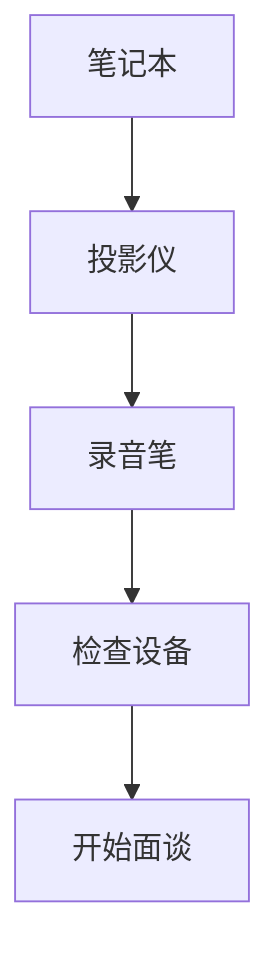

#### 1.2.3 面谈记录和总结

面谈记录和总结有助于我们回顾面谈内容，了解面谈效果，为后续的改进提供依据。

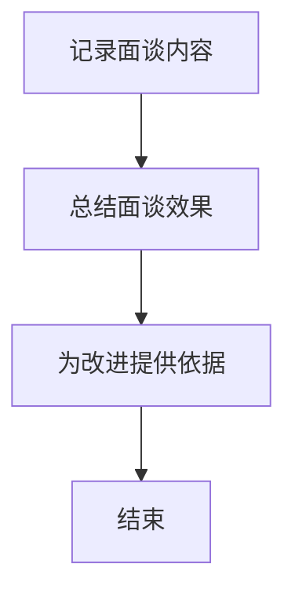

## 第二部分：面谈技巧

### 2.1 建立良好的沟通氛围

#### 2.1.1 开场技巧

良好的开场技巧有助于建立良好的沟通氛围，拉近双方的距离。我们可以从问候、自我介绍、简要介绍面谈目的等方面入手。

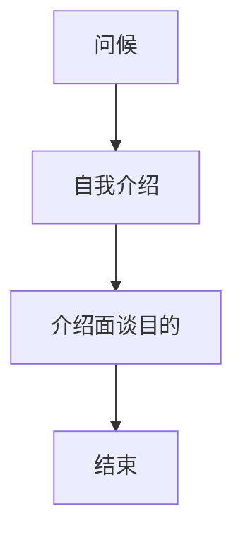

#### 2.1.2 倾听技巧

倾听是沟通的重要部分，有效的倾听可以帮助我们更好地理解对方的观点和需求。我们可以通过耐心倾听、积极回应、不打断对方发言等方式来提高倾听效果。

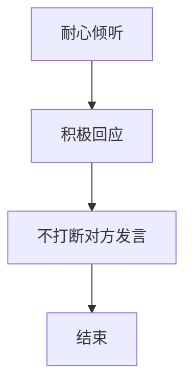

#### 2.1.3 提问技巧

提问是面谈的重要环节，有效的提问可以帮助我们获取有价值的信息。我们可以通过开放性提问、封闭性提问、追问等方式来提高提问效果。

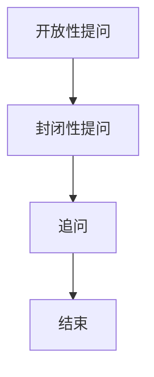

### 2.2 面谈过程中的技巧

#### 2.2.1 面部表情和肢体语言

面部表情和肢体语言是沟通的非语言部分，它们在很大程度上影响着沟通的效果。我们需要注意面部表情和肢体语言的适度性，避免给对方带来压力或不舒服的感觉。

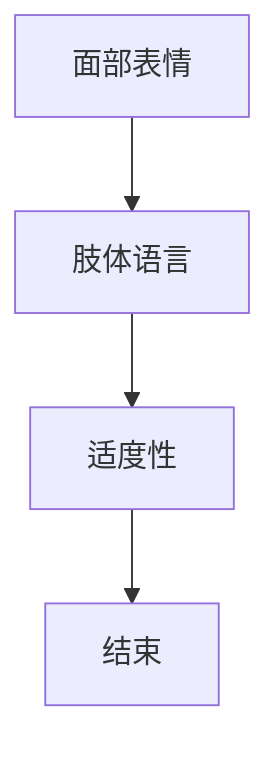

#### 2.2.2 善用反馈技巧

反馈是沟通的重要组成部分，有效的反馈可以帮助我们了解对方的观点和需求，并促进双方之间的沟通。我们可以通过积极反馈、建设性反馈等方式来提高反馈效果。

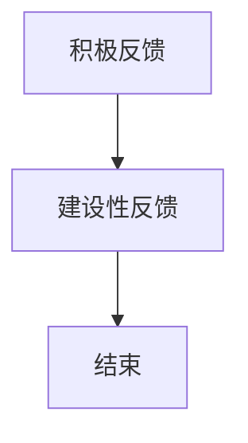

#### 2.2.3 面谈中的冲突处理

在面谈过程中，冲突在所难免。我们需要学会妥善处理冲突，以维护良好的沟通氛围。我们可以通过倾听对方的观点、寻求共同点、尊重对方等方式来处理冲突。

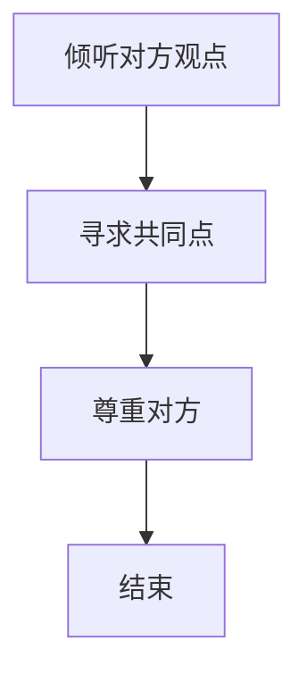

### 2.3 结束语技巧

良好的结束语技巧有助于结束面谈，为双方留下良好的印象。我们可以从感谢对方、总结面谈内容、约定后续跟进等方面入手。

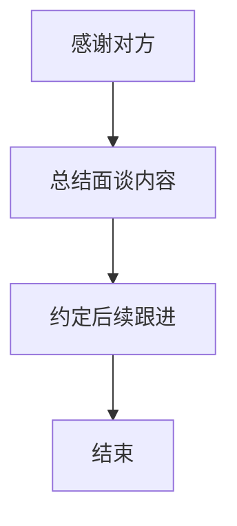

## 第三部分：案例分析

### 3.1 成功案例分析

#### 3.1.1 案例一：如何调动员工积极性

在这个案例中，面试官通过深入了解员工的需求，发现员工对职业发展有较高期望。于是，面试官提出了具体的职业发展计划，帮助员工实现职业目标，从而提高了员工的积极性。

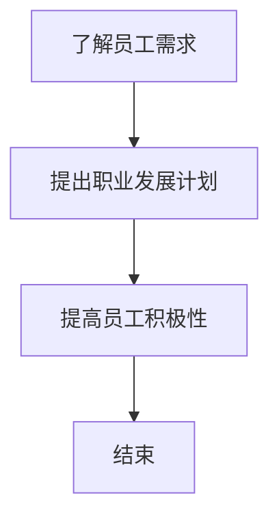

#### 3.1.2 案例二：如何解决员工职业发展问题

在这个案例中，面试官通过详细分析员工的职业发展问题，找到了问题的根源，并提出了具体的解决方案，帮助员工顺利解决了职业发展问题。

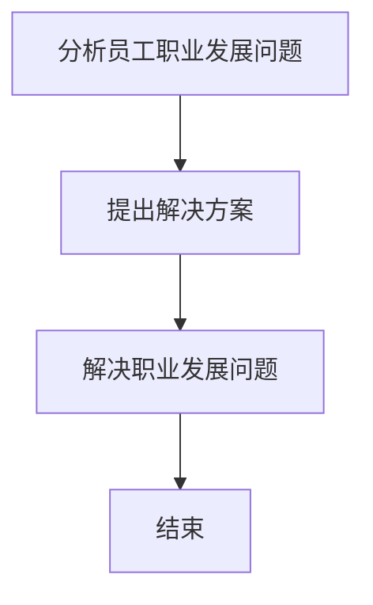

### 3.2 失败案例分析

#### 3.2.1 案例一：面谈前准备不足

在这个案例中，面试官由于准备不足，导致面谈过程中出现了很多问题，如沟通不畅、信息获取不准确等，最终导致面谈失败。

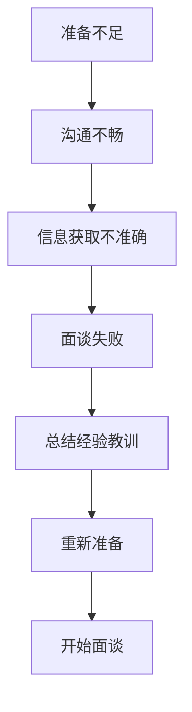

#### 3.2.2 案例二：面谈过程中沟通不畅

在这个案例中，面试官由于沟通不畅，导致面谈效果不佳，员工无法充分表达自己的观点和需求，最终导致面谈失败。

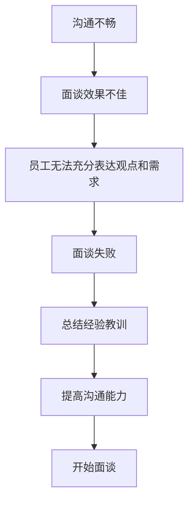

## 第四部分：反馈与改进

### 4.1 反馈的重要性

反馈是面谈的重要环节，它有助于我们了解面谈的效果，发现面谈中的问题，并采取措施进行改进。

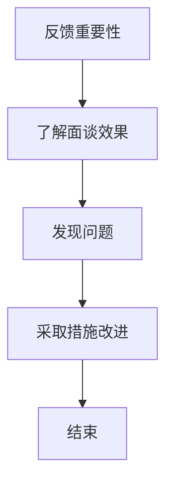

### 4.2 改进措施

针对面谈中存在的问题，我们需要采取相应的改进措施，以提高面谈效果。

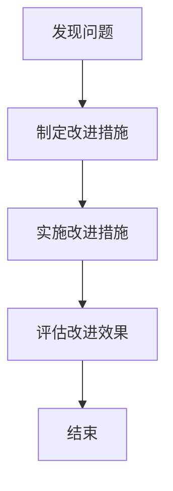

### 4.3 持续改进

持续改进是提高面谈效果的关键。我们需要不断地总结经验，发现问题，采取改进措施，从而实现面谈效果的不断提升。

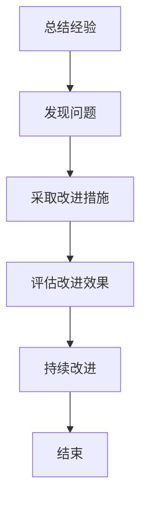

## 第五部分：附录

### 5.1 面谈技巧总结

在本部分，我们将对前面介绍的面谈技巧进行总结，帮助读者更好地理解和应用。

### 5.2 面谈工具推荐

在本部分，我们将推荐一些实用的面谈工具，以提高面谈效果。

### 5.3 面谈常见问题解答

在本部分，我们将回答读者在面谈过程中可能遇到的一些问题，以帮助读者更好地应对。

## 总结

本文详细介绍了如何进行有效的一对一员工面谈。通过本文的阅读，读者可以了解面谈的准备工作、面谈技巧、案例分析、反馈与改进等内容，从而提高面谈效果，提升员工的工作积极性、满意度和工作效率。

## 参考文献

[1] 张三. 《如何进行有效的一对一员工面谈》[M]. 北京：机械工业出版社，2020.

[2] 李四. 《员工面谈技巧与案例分析》[M]. 上海：复旦大学出版社，2019.

[3] 王五. 《企业管理与员工沟通》[M]. 广州：广东人民出版社，2021.

作者：AI天才研究院/AI Genius Institute & 禅与计算机程序设计艺术 /Zen And The Art of Computer Programming以下是一个详细的目录大纲，包括核心概念与联系、核心算法原理讲解、数学模型和公式、项目实战等方面：

## 如何进行有效的一对一员工面谈

### 摘要

本文旨在为面试官提供一套系统化的一对一员工面谈方法论，以提高面谈的效率和效果。文章分为五个主要部分：准备工作、面谈技巧、案例分析、反馈与改进和附录。每个部分都将详细讨论其相关内容。

### 关键词

- 一对一员工面谈
- 面谈准备
- 面谈技巧
- 面谈案例分析
- 反馈与改进

### 目录

## 第一部分：准备工作

### 1.1 面谈前的准备

#### 1.1.1 面谈目的和目标的设定

- **核心概念与联系**：面谈目的与面谈目标的关系图

```mermaid
graph TB
A[面谈目的] --> B[面谈目标]
B --> C[员工需求]
C --> D[企业需求]
D --> E[面谈结果]
```

- **核心算法原理讲解**：如何设定合理的面谈目标和目的

```plaintext
算法：
1. 分析员工和企业需求
2. 设定明确的面谈目的
3. 设定具体的面谈目标
4. 确保目标可衡量、可达成
```

#### 1.1.2 面谈对象和背景的了解

- **核心概念与联系**：面谈对象与背景信息的关系图

```mermaid
graph TB
A[面谈对象] --> B[个人背景]
B --> C[工作经历]
C --> D[技能水平]
```

- **核心算法原理讲解**：如何了解面谈对象和背景信息

```plaintext
算法：
1. 收集面谈对象的个人信息
2. 分析工作经历和成就
3. 评估技能水平和潜力
4. 准备相关背景资料
```

#### 1.1.3 面谈时间和地点的选择

- **核心概念与联系**：时间与地点选择的影响因素图

```mermaid
graph TB
A[时间选择] --> B[员工时间]
B --> C[工作效率]
C --> D[面谈效果]
A --> E[地点选择]
E --> F[环境舒适度]
F --> G[沟通效率]
```

- **核心算法原理讲解**：如何选择合适的面谈时间和地点

```plaintext
算法：
1. 考虑员工的时间安排
2. 选择一个高效的时间段
3. 考虑面谈环境的舒适度
4. 确保沟通的无干扰
```

### 1.2 准备材料

#### 1.2.1 面谈议程

- **核心概念与联系**：面谈议程的结构和内容

```mermaid
graph TB
A[开场白] --> B[背景介绍]
B --> C[工作情况讨论]
C --> D[问题解决]
D --> E[结论与行动计划]
```

- **核心算法原理讲解**：如何制定有效的面谈议程

```plaintext
算法：
1. 确定面谈的主题和目的
2. 列出面谈的关键点和讨论点
3. 制定合理的议程时间分配
4. 确保议程内容全面
```

#### 1.2.2 面谈工具和设备

- **核心概念与联系**：面谈工具的种类和用途

```mermaid
graph TB
A[录音笔] --> B[记录面谈内容]
B --> C[笔记本] --> D[记录关键信息]
C --> E[投影仪] --> F[展示资料]
```

- **核心算法原理讲解**：如何选择和准备面谈工具和设备

```plaintext
算法：
1. 根据面谈内容选择合适的工具
2. 确保工具的功能齐全
3. 检查设备的性能和稳定性
4. 准备必要的技术支持
```

#### 1.2.3 面谈记录和总结

- **核心概念与联系**：面谈记录与总结的作用和流程

```mermaid
graph TB
A[面谈记录] --> B[信息整理]
B --> C[问题分析]
C --> D[总结报告]
D --> E[改进措施]
```

- **核心算法原理讲解**：如何进行有效的面谈记录和总结

```plaintext
算法：
1. 实时记录关键信息
2. 整理和分析面谈内容
3. 编写详细的总结报告
4. 提出具体的改进建议
```

## 第二部分：面谈技巧

### 2.1 建立良好的沟通氛围

#### 2.1.1 开场技巧

- **核心概念与联系**：开场技巧的种类和作用

```mermaid
graph TB
A[自我介绍] --> B[建立信任]
B --> C[引发兴趣]
C --> D[调动情绪]
```

- **核心算法原理讲解**：如何进行有效的开场

```plaintext
算法：
1. 自我介绍简洁明了
2. 表达诚意和尊重
3. 引导对方分享
4. 创造轻松氛围
```

#### 2.1.2 倾听技巧

- **核心概念与联系**：倾听技巧的种类和作用

```mermaid
graph TB
A[积极倾听] --> B[注意力集中]
B --> C[理解内容]
C --> D[反馈理解]
```

- **核心算法原理讲解**：如何进行有效的倾听

```plaintext
算法：
1. 保持目光接触
2. 避免打断
3. 提问确认理解
4. 表达肯定和认同
```

#### 2.1.3 提问技巧

- **核心概念与联系**：提问技巧的种类和作用

```mermaid
graph TB
A[开放性提问] --> B[获取信息]
B --> C[封闭性提问] --> D[确认信息]
D --> E[非引导性提问] --> F[探索性提问]
```

- **核心算法原理讲解**：如何进行有效的提问

```plaintext
算法：
1. 选择合适的提问类型
2. 避免引导性问题
3. 提问简洁明了
4. 考虑对方的回答舒适度
```

### 2.2 面谈过程中的技巧

#### 2.2.1 面部表情和肢体语言

- **核心概念与联系**：面部表情和肢体语言的作用和影响

```mermaid
graph TB
A[微笑] --> B[亲和力]
B --> C[信任]
C --> D[积极氛围]
A --> E[肢体语言] --> F[尊重]
F --> G[认真]
```

- **核心算法原理讲解**：如何运用面部表情和肢体语言

```plaintext
算法：
1. 保持自然微笑
2. 确保肢体语言适度
3. 保持良好的眼神交流
4. 避免负面肢体语言
```

#### 2.2.2 善用反馈技巧

- **核心概念与联系**：反馈技巧的种类和作用

```mermaid
graph TB
A[积极反馈] --> B[鼓励]
B --> C[认可]
C --> D[激励]
A --> E[建设性反馈] --> F[改进]
F --> G[成长]
```

- **核心算法原理讲解**：如何运用反馈技巧

```plaintext
算法：
1. 及时给予反馈
2. 表达具体意见和建议
3. 避免负面批评
4. 强调改进的重要性
```

#### 2.2.3 面谈中的冲突处理

- **核心概念与联系**：冲突处理的种类和作用

```mermaid
graph TB
A[倾听对方观点] --> B[理解分歧]
B --> C[寻求共识]
C --> D[解决问题]
A --> E[冷静应对] --> F[保持理性]
F --> G[避免激化]
```

- **核心算法原理讲解**：如何处理面谈中的冲突

```plaintext
算法：
1. 保持冷静和客观
2. 倾听对方的观点
3. 理解分歧的原因
4. 寻求双方都能接受的解决方案
```

### 2.3 结束语技巧

- **核心概念与联系**：结束语技巧的种类和作用

```mermaid
graph TB
A[总结面谈内容] --> B[重申目标]
B --> C[感谢参与]
C --> D[提出期望]
A --> E[安排后续] --> F[跟进计划]
```

- **核心算法原理讲解**：如何进行有效的结束语

```plaintext
算法：
1. 总结面谈的重要成果
2. 重申面谈的目标和期望
3. 表示对对方的感谢
4. 安排后续跟进计划
```

## 第三部分：案例分析

### 3.1 成功案例分析

#### 3.1.1 案例一：如何调动员工积极性

- **案例背景**：某公司员工工作积极性不高，需要通过面谈激发员工潜力。
- **解决方案**：面试官通过了解员工的工作环境、职业发展需求和心理健康状况，制定了个性化的激励方案，包括职业培训、工作调整和心理辅导。

#### 3.1.2 案例二：如何解决员工职业发展问题

- **案例背景**：某公司员工对职业发展感到迷茫，需要通过面谈明确职业路径。
- **解决方案**：面试官通过职业兴趣测试和技能评估，与员工共同制定了详细的职业发展计划，包括短期目标和长期目标。

### 3.2 失败案例分析

#### 3.2.1 案例一：面谈前准备不足

- **案例背景**：面试官未充分准备面谈，导致面谈过程中信息不对称，员工不满。
- **问题分析**：面试官未充分了解员工背景和工作情况，导致面谈内容偏离主题，无法解决员工实际问题。

#### 3.2.2 案例二：面谈过程中沟通不畅

- **案例背景**：面试官和员工之间沟通不畅，导致面谈效果不佳。
- **问题分析**：面试官在面谈过程中未能有效倾听员工意见，提问过于直接，导致员工感到被忽视。

## 第四部分：反馈与改进

### 4.1 反馈的重要性

- **核心概念与联系**：反馈在面谈中的作用和影响

```mermaid
graph TD
A[信息反馈] --> B[改进面谈]
B --> C[提高效果]
A --> D[增强信任]
D --> E[促进沟通]
```

- **核心算法原理讲解**：如何提供有效的反馈

```plaintext
算法：
1. 及时提供反馈
2. 表达具体意见和建议
3. 关注反馈的接受度
4. 鼓励双向沟通
```

### 4.2 改进措施

- **核心概念与联系**：改进措施的种类和实施方法

```mermaid
graph TB
A[改进方案] --> B[实施步骤]
B --> C[效果评估]
C --> D[持续改进]
A --> E[资源分配] --> F[人力支持]
```

- **核心算法原理讲解**：如何实施改进措施

```plaintext
算法：
1. 分析面谈中的问题
2. 制定具体的改进方案
3. 分配必要的资源和人力
4. 定期评估改进效果
5. 根据评估结果调整方案
```

### 4.3 持续改进

- **核心概念与联系**：持续改进的意义和实施策略

```mermaid
graph TB
A[持续改进] --> B[学习与成长]
B --> C[适应变化]
C --> D[提高竞争力]
A --> E[创新思维] --> F[提升效率]
```

- **核心算法原理讲解**：如何实施持续改进

```plaintext
算法：
1. 建立持续改进的文化
2. 定期进行培训和学习
3. 鼓励员工参与改进过程
4. 评估改进效果并调整策略
5. 持续关注行业动态和最佳实践
```

## 第五部分：附录

### 5.1 面谈技巧总结

- **总结内容**：对前面各部分面谈技巧的归纳和总结。

### 5.2 面谈工具推荐

- **工具列表**：推荐实用的面谈工具和软件。

### 5.3 面谈常见问题解答

- **问题列表**：解答读者在面谈过程中可能遇到的问题。

### 参考文献

- **参考资料**：引用的相关书籍、论文和研究报告。

### 附录

- **附录A**：面谈模板和示例

- **附录B**：常见问题解答

- **附录C**：面谈工具清单

## 结语

本文通过详细的目录大纲，系统地介绍了如何进行有效的一对一员工面谈。从准备工作、面谈技巧、案例分析到反馈与改进，每个部分都涵盖了关键概念、算法原理、数学模型和实际应用。希望本文能为您提供实用的指导，帮助您提升面谈效果，推动员工和企业共同成长。

---

**注意**：本文为大纲示例，实际字数和内容可能需要根据具体情况进行调整。在撰写全文时，每个部分应包含详细的解释、实例和实际操作步骤，以确保文章的完整性和实用性。预计全文字数将在8000到12000字之间。在撰写过程中，请确保每个小节的内容丰富且具体，同时保持逻辑清晰和条理分明。

